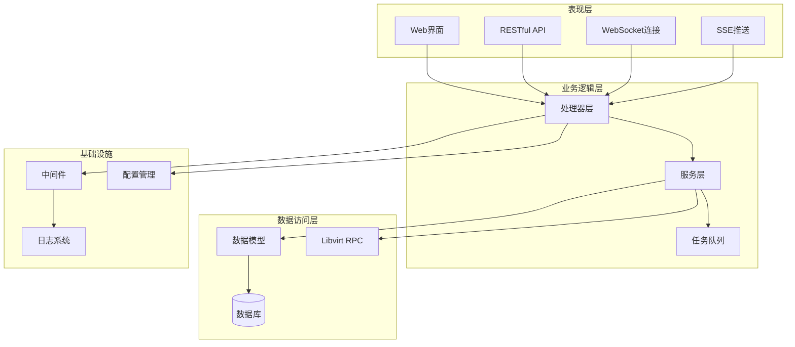
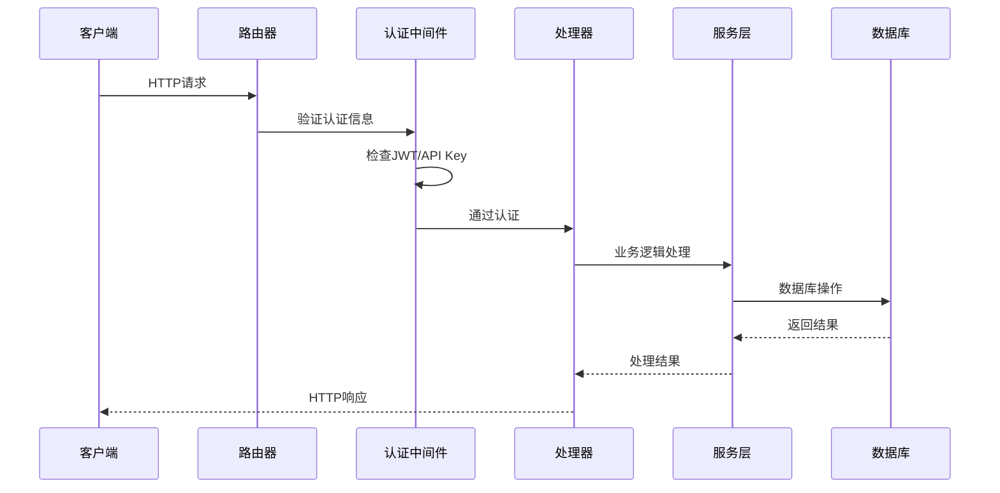
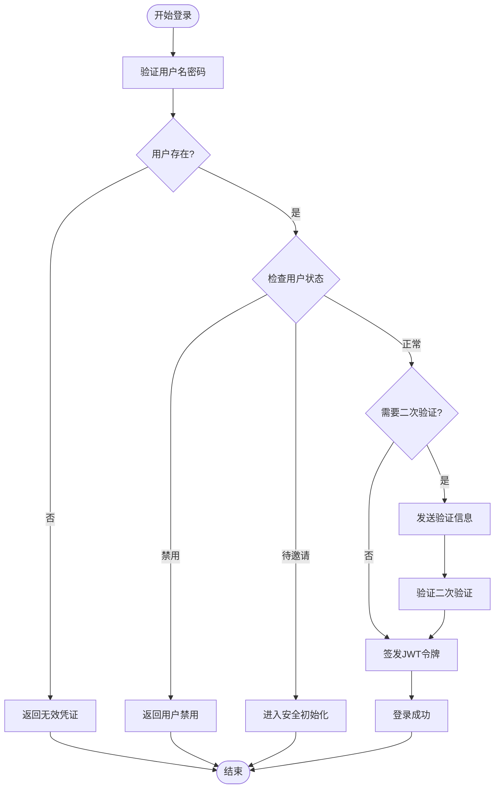
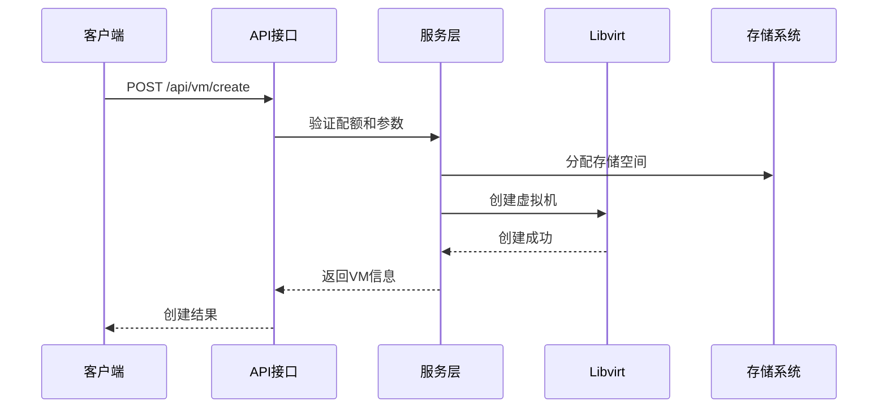
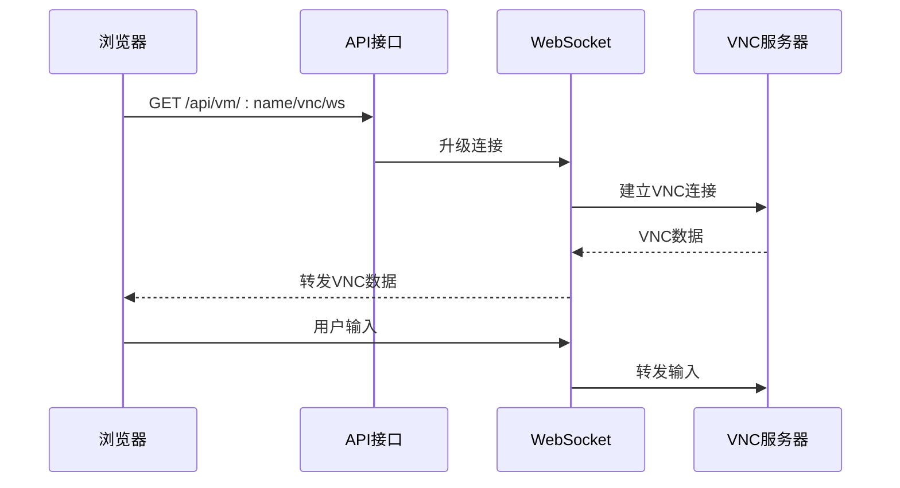
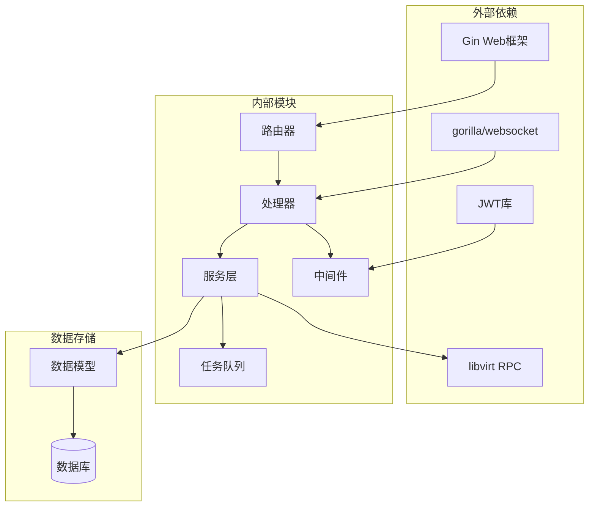

# API接口文档

<cite>
**本文档引用的文件**
- [server/main.go](file://server/main.go)
- [server/router/router.go](file://server/router/router.go)
- [server/middleware/auth.go](file://server/middleware/auth.go)
- [server/middleware/ratelimit.go](file://server/middleware/ratelimit.go)
- [server/handler/types.go](file://server/handler/types.go)
- [server/handler/auth.go](file://server/handler/auth.go)
- [server/handler/user.go](file://server/handler/user.go)
- [server/handler/vm.go](file://server/handler/vm.go)
- [server/handler/network.go](file://server/handler/network.go)
- [server/handler/storage_pool.go](file://server/handler/storage_pool.go)
- [server/handler/vnc.go](file://server/handler/vnc.go)
- [server/handler/vm_sse.go](file://server/handler/vm_sse.go)
- [server/handler/vm_monitor.go](file://server/handler/vm_monitor.go)
- [server/handler/task.go](file://server/handler/task.go)
</cite>

## 目录
1. [简介](#简介)
2. [项目结构](#项目结构)
3. [核心组件](#核心组件)
4. [架构概览](#架构概览)
5. [详细组件分析](#详细组件分析)
6. [依赖分析](#依赖分析)
7. [性能考虑](#性能考虑)
8. [故障排除指南](#故障排除指南)
9. [结论](#结论)
10. [附录](#附录)

## 简介
本项目是一个基于Go语言开发的Open虚拟机管理控制台，提供了完整的虚拟机生命周期管理、网络管理、存储管理等功能。系统采用RESTful API设计，支持JWT认证和API Key认证两种方式，并提供了WebSocket实时通信和Server-Sent Events(SSE)推送机制。

## 项目结构
项目采用典型的三层架构设计：



**图表来源**
- [server/main.go:31-128](file://server/main.go#L31-L128)
- [server/router/router.go:18-485](file://server/router/router.go#L18-L485)

**章节来源**
- [server/main.go:1-128](file://server/main.go#L1-L128)
- [server/router/router.go:1-539](file://server/router/router.go#L1-L539)

## 核心组件

### 认证与授权系统
系统支持多种认证方式：
- **JWT Token认证**：标准的JWT访问令牌
- **API Key认证**：基于API密钥的认证方式
- **双因素认证**：支持TOTP和邮箱验证
- **安全初始化**：首次登录的安全设置流程

### 中间件体系
- **认证中间件**：验证用户身份和权限
- **限流中间件**：防止API滥用
- **CORS中间件**：跨域资源共享支持
- **请求日志中间件**：完整的请求追踪

### 任务调度系统
- **异步任务队列**：支持多种任务类型的异步执行
- **任务进度推送**：通过SSE实时推送任务状态
- **任务取消机制**：支持取消进行中的任务

**章节来源**
- [server/middleware/auth.go:17-324](file://server/middleware/auth.go#L17-L324)
- [server/middleware/ratelimit.go:11-211](file://server/middleware/ratelimit.go#L11-L211)

## 架构概览



**图表来源**
- [server/router/router.go:18-485](file://server/router/router.go#L18-L485)
- [server/middleware/auth.go:75-199](file://server/middleware/auth.go#L75-L199)

## 详细组件分析

### 认证与用户管理

#### 用户认证流程


**图表来源**
- [server/handler/auth.go:101-202](file://server/handler/auth.go#L101-L202)

#### API Key认证机制
系统支持通过HTTP头部传递API Key进行认证：
- `X-API-Key-ID`: API Key标识符
- `X-API-Key`: API Key值
- 支持多种头部格式兼容

**章节来源**
- [server/handler/auth.go:16-100](file://server/handler/auth.go#L16-L100)
- [server/middleware/auth.go:201-241](file://server/middleware/auth.go#L201-L241)

### 虚拟机管理

#### 虚拟机操作接口
系统提供完整的虚拟机生命周期管理：

**虚拟机列表查询**
- 方法：GET `/api/vm/list`
- 权限：登录用户
- 功能：获取虚拟机列表，支持分页和过滤

**虚拟机详情查询**
- 方法：GET `/api/vm/:name`
- 权限：VM拥有者或管理员
- 功能：获取指定虚拟机的详细信息

**虚拟机操作**
- 开机：POST `/api/vm/:name/operate` (action=start)
- 关机：POST `/api/vm/:name/operate` (action=shutdown)
- 重启：POST `/api/vm/:name/operate` (action=reboot)
- 强制断电：POST `/api/vm/:name/operate` (action=destroy)

**章节来源**
- [server/handler/vm.go:81-352](file://server/handler/vm.go#L81-L352)

#### 虚拟机构建流程


**图表来源**
- [server/router/router.go:154-158](file://server/router/router.go#L154-L158)
- [server/handler/vm.go:354-508](file://server/handler/vm.go#L354-L508)

### 网络管理

#### 端口转发管理
系统提供灵活的端口转发管理功能：

**添加端口转发**
- 方法：POST `/api/network/port-forward/add`
- 参数：vm_name, vm_ip, vm_port, host_port, protocol
- 权限：VM拥有者或管理员

**批量删除端口转发**
- 方法：POST `/api/network/port-forward/batch-delete`
- 参数：ids数组
- 权限：高风险验证

**章节来源**
- [server/handler/network.go:221-348](file://server/handler/network.go#L221-L348)

#### 静态IP管理
- **绑定静态IP**：POST `/api/network/static-ip/bind`
- **解绑静态IP**：POST `/api/network/static-ip/unbind`
- **查询静态IP列表**：GET `/api/network/static-ip/list`

### 存储管理

#### 存储池管理
系统支持多种存储后端：

**存储池列表**
- 方法：GET `/api/storage-pool/list`
- 权限：管理员

**存储池配置**
- 设置默认存储池：POST `/api/storage-pool/:id/default`
- 更新存储池配置：PUT `/api/storage-pool/:id/config`

**存储池操作**
- 格式化并挂载：POST `/api/storage-pool/:id/format-mount`
- 创建分区：POST `/api/storage-pool/:id/create-partition`
- 删除分区：POST `/api/storage-pool/:id/delete-partitions`

**章节来源**
- [server/handler/storage_pool.go:15-254](file://server/handler/storage_pool.go#L15-L254)

### 实时通信

#### WebSocket VNC控制台
系统提供基于WebSocket的VNC控制台：

**VNC连接流程**


**图表来源**
- [server/handler/vnc.go:147-222](file://server/handler/vnc.go#L147-L222)

#### SSE实时推送
系统支持Server-Sent Events实现实时状态推送：

**虚拟机状态推送**
- URL：`/api/vm/sse`
- 事件类型：`vm_list`
- 更新频率：每2秒推送一次

**任务进度推送**
- URL：`/api/task/sse`
- 事件类型：`task_progress`
- 实时推送任务执行状态

**章节来源**
- [server/handler/vm_sse.go:14-99](file://server/handler/vm_sse.go#L14-L99)
- [server/handler/task.go:87-130](file://server/handler/task.go#L87-L130)

### 任务管理系统

#### 异步任务处理
系统提供完整的异步任务处理机制：

**任务类型**
- 虚拟机创建/删除
- 磁盘操作
- 系统维护任务
- 用户管理任务

**任务状态管理**
- 等待中
- 执行中
- 已完成
- 已取消
- 执行失败

**章节来源**
- [server/main.go:130-503](file://server/main.go#L130-L503)
- [server/handler/task.go:15-195](file://server/handler/task.go#L15-L195)

## 依赖分析



**图表来源**
- [server/main.go:3-25](file://server/main.go#L3-L25)
- [server/router/router.go:3-16](file://server/router/router.go#L3-L16)

**章节来源**
- [server/main.go:1-128](file://server/main.go#L1-L128)
- [server/router/router.go:1-539](file://server/router/router.go#L1-L539)

## 性能考虑

### 限流机制
系统实现了智能的API限流机制：

**限流配置**
- 公开接口：每IP每分钟20次请求
- 认证接口：每IP每分钟60次请求（默认不限制）
- 滑动窗口算法实现
- 自动清理过期条目

**性能优化**
- 连接池管理
- 异步任务处理
- 缓存机制
- 数据库索引优化

### 缓存策略
- 虚拟机状态缓存
- 用户权限缓存
- 配置信息缓存
- 实时数据缓存

## 故障排除指南

### 常见错误码
- **401 未授权**：认证失败或Token过期
- **403 禁止访问**：权限不足
- **404 未找到**：资源不存在
- **429 请求过多**：超过限流限制
- **500 服务器错误**：系统内部错误

### 调试建议
1. **检查认证信息**：确认Token或API Key有效
2. **验证权限**：确认用户角色和VM所有权
3. **查看日志**：检查系统日志获取详细错误信息
4. **测试网络连接**：确认WebSocket连接正常

**章节来源**
- [server/middleware/ratelimit.go:173-197](file://server/middleware/ratelimit.go#L173-L197)

## 结论
本项目提供了一个功能完整、安全性高的虚拟机管理平台。通过RESTful API设计、多层认证机制、实时通信支持和异步任务处理，系统能够满足企业级虚拟化管理的需求。系统的模块化设计使得扩展和维护变得相对简单，同时提供了良好的性能和可靠性保障。

## 附录

### API使用示例

#### 基础认证示例
```javascript
// 使用JWT Token认证
fetch('/api/auth/login', {
    method: 'POST',
    headers: {'Content-Type': 'application/json'},
    body: JSON.stringify({
        username: 'user',
        password: 'password'
    })
})

// 使用API Key认证
fetch('/api/vm/list', {
    method: 'GET',
    headers: {
        'X-API-Key-ID': 'your_key_id',
        'X-API-Key': 'your_api_key'
    }
})
```

#### WebSocket连接示例
```javascript
// 连接到VNC WebSocket
const ws = new WebSocket('ws://localhost:8080/api/vm/my-vm/vnc/ws');
ws.onopen = () => console.log('连接已建立');
ws.onmessage = (event) => {
    // 处理VNC数据
};
```

### 客户端集成最佳实践
1. **错误处理**：始终检查HTTP状态码和响应内容
2. **重试机制**：对临时性错误实现指数退避重试
3. **超时设置**：为长时间操作设置合理的超时时间
4. **并发控制**：限制同时进行的API调用数量
5. **缓存策略**：合理使用缓存减少重复请求