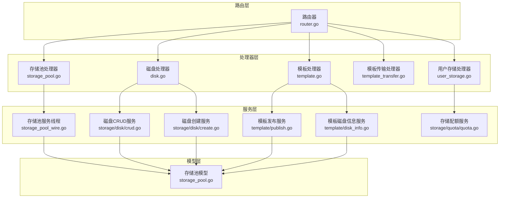
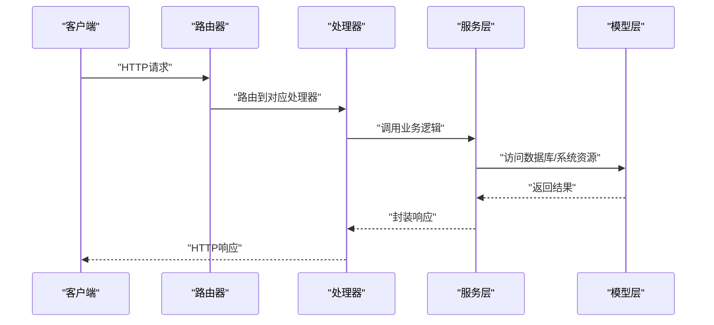
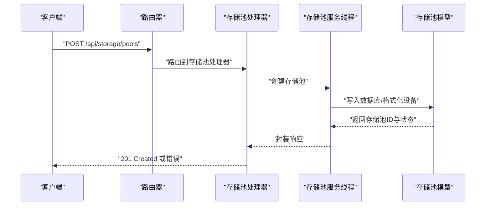
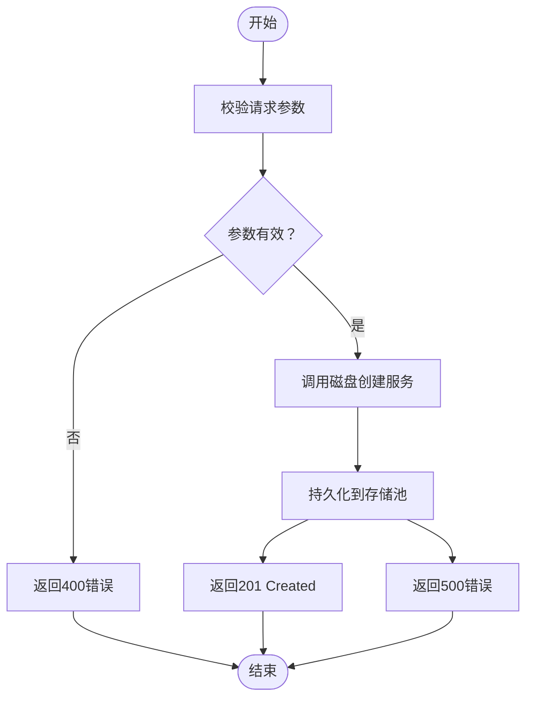
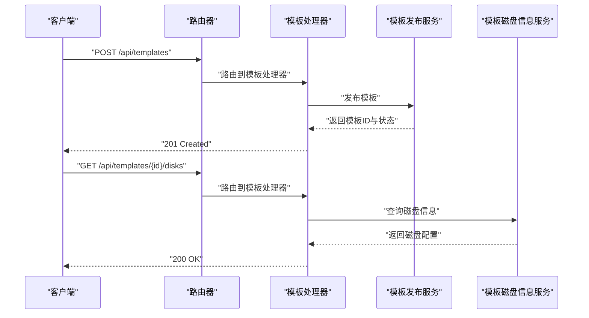
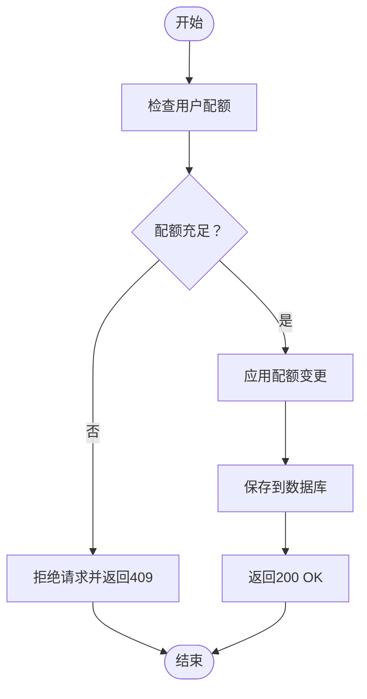
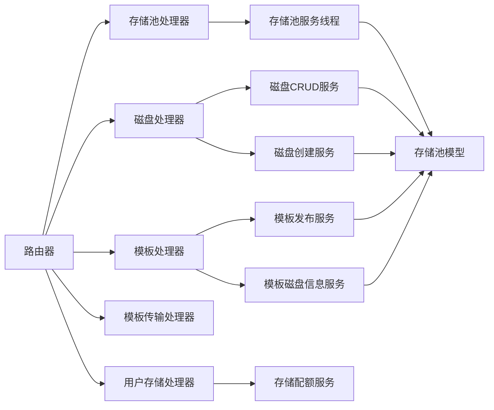

# 存储管理API

<cite>
**本文档引用的文件**
- [storage_pool.go](file://server/handler/storage_pool.go)
- [user_storage.go](file://server/handler/user_storage.go)
- [storage_pool_model.go](file://server/model/storage_pool.go)
- [storage_pool_wire.go](file://server/service/storage_pool_wire.go)
- [disk.go](file://server/handler/disk.go)
- [disk_crud.go](file://server/service/storage/disk/crud.go)
- [disk_create.go](file://server/service/storage/disk/create.go)
- [disk_helpers.go](file://server/service/storage/disk/helpers.go)
- [disk_types.go](file://server/service/storage/disk/types.go)
- [template.go](file://server/handler/template.go)
- [template_publish.go](file://server/service/template/publish.go)
- [template_transfer.go](file://server/handler/template_transfer.go)
- [template_disk_info.go](file://server/service/template/disk_info.go)
- [quota.go](file://server/service/storage/quota/quota.go)
- [router.go](file://server/router/router.go)
- [types.go](file://server/handler/types.go)
</cite>

## 目录
1. [简介](#简介)
2. [项目结构](#项目结构)
3. [核心组件](#核心组件)
4. [架构概览](#架构概览)
5. [详细组件分析](#详细组件分析)
6. [依赖关系分析](#依赖关系分析)
7. [性能考虑](#性能考虑)
8. [故障排除指南](#故障排除指南)
9. [结论](#结论)

## 简介
本文件为Open虚拟机管理控制台的存储管理API接口文档，覆盖存储池管理、磁盘管理、模板管理等核心功能。文档详细说明了存储池创建、磁盘挂载、模板发布等操作接口，并包含HTTP方法、URL路径、请求参数、响应格式与错误码说明。同时解释了存储配额管理与数据迁移机制，并提供存储配置与性能优化的最佳实践。

## 项目结构
存储管理相关模块主要分布在以下位置：
- 处理器层：负责HTTP路由与请求处理（如存储池、磁盘、模板处理器）
- 模型层：定义存储池实体与数据库交互
- 服务层：实现存储池、磁盘、模板的具体业务逻辑
- 路由层：统一注册API路由

**图表来源**
- [storage_pool.go:1-200](file://server/handler/storage_pool.go#L1-L200)
- [disk.go:1-200](file://server/handler/disk.go#L1-L200)
- [template.go:1-200](file://server/handler/template.go#L1-L200)
- [template_transfer.go:1-200](file://server/handler/template_transfer.go#L1-L200)
- [user_storage.go:1-200](file://server/handler/user_storage.go#L1-L200)
- [storage_pool_model.go:1-200](file://server/model/storage_pool.go#L1-L200)
- [storage_pool_wire.go:1-200](file://server/service/storage_pool_wire.go#L1-L200)
- [disk_crud.go:1-200](file://server/service/storage/disk/crud.go#L1-L200)
- [disk_create.go:1-200](file://server/service/storage/disk/create.go#L1-L200)
- [template_publish.go:1-200](file://server/service/template/publish.go#L1-L200)
- [template_disk_info.go:1-200](file://server/service/template/disk_info.go#L1-L200)
- [quota.go:1-200](file://server/service/storage/quota/quota.go#L1-L200)
- [router.go:1-200](file://server/router/router.go#L1-L200)

**章节来源**
- [storage_pool.go:1-200](file://server/handler/storage_pool.go#L1-L200)
- [disk.go:1-200](file://server/handler/disk.go#L1-L200)
- [template.go:1-200](file://server/handler/template.go#L1-L200)
- [template_transfer.go:1-200](file://server/handler/template_transfer.go#L1-L200)
- [user_storage.go:1-200](file://server/handler/user_storage.go#L1-L200)
- [storage_pool_model.go:1-200](file://server/model/storage_pool.go#L1-L200)
- [storage_pool_wire.go:1-200](file://server/service/storage_pool_wire.go#L1-L200)
- [disk_crud.go:1-200](file://server/service/storage/disk/crud.go#L1-L200)
- [disk_create.go:1-200](file://server/service/storage/disk/create.go#L1-L200)
- [template_publish.go:1-200](file://server/service/template/publish.go#L1-L200)
- [template_disk_info.go:1-200](file://server/service/template/disk_info.go#L1-L200)
- [quota.go:1-200](file://server/service/storage/quota/quota.go#L1-L200)
- [router.go:1-200](file://server/router/router.go#L1-L200)

## 核心组件
- 存储池管理：负责存储池的创建、查询、删除与分区管理
- 磁盘管理：负责磁盘的创建、挂载、卸载与容量调整
- 模板管理：负责模板的发布、查询、传输与磁盘信息提取
- 用户存储配额：基于用户维度的存储空间与IOPS配额管理

**章节来源**
- [storage_pool.go:1-200](file://server/handler/storage_pool.go#L1-L200)
- [disk.go:1-200](file://server/handler/disk.go#L1-L200)
- [template.go:1-200](file://server/handler/template.go#L1-L200)
- [user_storage.go:1-200](file://server/handler/user_storage.go#L1-L200)

## 架构概览
存储管理API采用分层架构，处理器层接收HTTP请求并调用服务层执行业务逻辑，服务层通过模型层与数据库交互，最终返回标准化响应。

**图表来源**
- [router.go:1-200](file://server/router/router.go#L1-L200)
- [storage_pool.go:1-200](file://server/handler/storage_pool.go#L1-L200)
- [disk.go:1-200](file://server/handler/disk.go#L1-L200)
- [template.go:1-200](file://server/handler/template.go#L1-L200)
- [storage_pool_model.go:1-200](file://server/model/storage_pool.go#L1-L200)

## 详细组件分析

### 存储池管理API
- 功能概述：提供存储池的创建、查询、删除、分区管理与挂载状态维护
- 关键接口
  - 创建存储池
    - 方法：POST
    - 路径：/api/storage/pools
    - 请求体字段：名称、类型、设备路径、卷组名（LVM）、容量等
    - 响应：存储池对象（含ID、状态、容量、已用空间）
    - 错误码：400（参数无效）、409（冲突/已存在）、500（内部错误）
  - 查询存储池列表
    - 方法：GET
    - 路径：/api/storage/pools
    - 查询参数：过滤条件（名称、状态、节点）
    - 响应：存储池数组
    - 错误码：500（内部错误）
  - 删除存储池
    - 方法：DELETE
    - 路径：/api/storage/pools/{id}
    - 路径参数：存储池ID
    - 响应：成功或失败
    - 错误码：404（不存在）、409（仍有磁盘/模板占用）
  - 分区管理（创建/删除分区）
    - 方法：POST/DELETE
    - 路径：/api/storage/pools/{id}/partitions
    - 请求体字段：分区大小、分区类型
    - 响应：分区信息
    - 错误码：400/409/500
  - 格式化与挂载
    - 方法：POST
    - 路径：/api/storage/pools/{id}/mount
    - 请求体字段：文件系统类型、挂载点
    - 响应：挂载状态
    - 错误码：400/500

**图表来源**
- [storage_pool.go:1-200](file://server/handler/storage_pool.go#L1-L200)
- [storage_pool_wire.go:1-200](file://server/service/storage_pool_wire.go#L1-L200)
- [storage_pool_model.go:1-200](file://server/model/storage_pool.go#L1-L200)

**章节来源**
- [storage_pool.go:1-200](file://server/handler/storage_pool.go#L1-L200)
- [storage_pool_wire.go:1-200](file://server/service/storage_pool_wire.go#L1-L200)
- [storage_pool_model.go:1-200](file://server/model/storage_pool.go#L1-L200)

### 磁盘管理API
- 功能概述：提供磁盘的创建、查询、删除、挂载/卸载、容量调整与CD-ROM管理
- 关键接口
  - 创建磁盘
    - 方法：POST
    - 路径：/api/disks
    - 请求体字段：存储池ID、磁盘大小、格式（qcow2/raw）、描述
    - 响应：磁盘对象（含ID、路径、状态）
    - 错误码：400/404/500
  - 查询磁盘列表
    - 方法：GET
    - 路径：/api/disks
    - 查询参数：按存储池、状态过滤
    - 响应：磁盘数组
    - 错误码：500
  - 删除磁盘
    - 方法：DELETE
    - 路径：/api/disks/{id}
    - 路径参数：磁盘ID
    - 响应：成功或失败
    - 错误码：404/409
  - 挂载/卸载磁盘
    - 方法：POST
    - 路径：/api/disks/{id}/attach, /api/disks/{id}/detach
    - 请求体字段：目标虚拟机ID、设备槽位
    - 响应：挂载状态
    - 错误码：400/404/409
  - 容量调整
    - 方法：POST
    - 路径：/api/disks/{id}/resize
    - 请求体字段：新容量
    - 响应：调整结果
    - 错误码：400/404/500
  - CD-ROM管理
    - 方法：POST/DELETE
    - 路径：/api/disks/{id}/cdrom
    - 请求体字段：ISO镜像路径
    - 响应：状态
    - 错误码：400/404/500

**图表来源**
- [disk.go:1-200](file://server/handler/disk.go#L1-L200)
- [disk_crud.go:1-200](file://server/service/storage/disk/crud.go#L1-L200)
- [disk_create.go:1-200](file://server/service/storage/disk/create.go#L1-L200)

**章节来源**
- [disk.go:1-200](file://server/handler/disk.go#L1-L200)
- [disk_crud.go:1-200](file://server/service/storage/disk/crud.go#L1-L200)
- [disk_create.go:1-200](file://server/service/storage/disk/create.go#L1-L200)
- [disk_helpers.go:1-200](file://server/service/storage/disk/helpers.go#L1-L200)
- [disk_types.go:1-200](file://server/service/storage/disk/types.go#L1-L200)

### 模板管理API
- 功能概述：提供模板的发布、查询、传输与磁盘信息提取
- 关键接口
  - 发布模板
    - 方法：POST
    - 路径：/api/templates
    - 请求体字段：源虚拟机ID、模板名称、描述、是否公开
    - 响应：模板对象（含ID、磁盘信息、状态）
    - 错误码：400/404/500
  - 查询模板列表
    - 方法：GET
    - 路径：/api/templates
    - 查询参数：名称、分类、公开状态
    - 响应：模板数组
    - 错误码：500
  - 删除模板
    - 方法：DELETE
    - 路径：/api/templates/{id}
    - 路径参数：模板ID
    - 响应：成功或失败
    - 错误码：404/409
  - 模板传输
    - 方法：POST
    - 路径：/api/templates/{id}/transfer
    - 请求体字段：目标存储池ID、目标节点
    - 响应：传输任务ID
    - 错误码：400/404/500
  - 获取模板磁盘信息
    - 方法：GET
    - 路径：/api/templates/{id}/disks
    - 响应：磁盘配置信息（容量、格式、路径）
    - 错误码：404/500

**图表来源**
- [template.go:1-200](file://server/handler/template.go#L1-L200)
- [template_publish.go:1-200](file://server/service/template/publish.go#L1-L200)
- [template_disk_info.go:1-200](file://server/service/template/disk_info.go#L1-L200)

**章节来源**
- [template.go:1-200](file://server/handler/template.go#L1-L200)
- [template_publish.go:1-200](file://server/service/template/publish.go#L1-L200)
- [template_transfer.go:1-200](file://server/handler/template_transfer.go#L1-L200)
- [template_disk_info.go:1-200](file://server/service/template/disk_info.go#L1-L200)

### 用户存储配额API
- 功能概述：基于用户维度的存储空间与IOPS配额管理
- 关键接口
  - 设置用户存储配额
    - 方法：POST
    - 路径：/api/users/{userId}/storage-quota
    - 请求体字段：总容量、已用量、IOPS上限
    - 响应：配额对象
    - 错误码：400/404/500
  - 查询用户存储配额
    - 方法：GET
    - 路径：/api/users/{userId}/storage-quota
    - 响应：配额详情
    - 错误码：404/500
  - 扣减/恢复配额
    - 方法：POST
    - 路径：/api/users/{userId}/storage-quota/adjust
    - 请求体字段：操作类型（扣减/恢复）、容量/IOPS数量
    - 响应：调整后配额
    - 错误码：400/404/500

**图表来源**
- [user_storage.go:1-200](file://server/handler/user_storage.go#L1-L200)
- [quota.go:1-200](file://server/service/storage/quota/quota.go#L1-L200)

**章节来源**
- [user_storage.go:1-200](file://server/handler/user_storage.go#L1-L200)
- [quota.go:1-200](file://server/service/storage/quota/quota.go#L1-L200)

## 依赖关系分析
- 处理器依赖服务层：处理器仅负责参数解析与响应封装，具体业务逻辑由服务层实现
- 服务层依赖模型层：服务层通过模型层访问数据库与系统资源
- 路由器集中注册所有存储相关API，确保URL路径规范与一致性

**图表来源**
- [router.go:1-200](file://server/router/router.go#L1-L200)
- [storage_pool.go:1-200](file://server/handler/storage_pool.go#L1-L200)
- [disk.go:1-200](file://server/handler/disk.go#L1-L200)
- [template.go:1-200](file://server/handler/template.go#L1-L200)
- [template_transfer.go:1-200](file://server/handler/template_transfer.go#L1-L200)
- [user_storage.go:1-200](file://server/handler/user_storage.go#L1-L200)
- [storage_pool_wire.go:1-200](file://server/service/storage_pool_wire.go#L1-L200)
- [disk_crud.go:1-200](file://server/service/storage/disk/crud.go#L1-L200)
- [disk_create.go:1-200](file://server/service/storage/disk/create.go#L1-L200)
- [template_publish.go:1-200](file://server/service/template/publish.go#L1-L200)
- [template_disk_info.go:1-200](file://server/service/template/disk_info.go#L1-L200)
- [quota.go:1-200](file://server/service/storage/quota/quota.go#L1-L200)
- [storage_pool_model.go:1-200](file://server/model/storage_pool.go#L1-L200)

**章节来源**
- [router.go:1-200](file://server/router/router.go#L1-L200)
- [storage_pool.go:1-200](file://server/handler/storage_pool.go#L1-L200)
- [disk.go:1-200](file://server/handler/disk.go#L1-L200)
- [template.go:1-200](file://server/handler/template.go#L1-L200)
- [template_transfer.go:1-200](file://server/handler/template_transfer.go#L1-L200)
- [user_storage.go:1-200](file://server/handler/user_storage.go#L1-L200)
- [storage_pool_wire.go:1-200](file://server/service/storage_pool_wire.go#L1-L200)
- [disk_crud.go:1-200](file://server/service/storage/disk/crud.go#L1-L200)
- [disk_create.go:1-200](file://server/service/storage/disk/create.go#L1-L200)
- [template_publish.go:1-200](file://server/service/template/publish.go#L1-L200)
- [template_disk_info.go:1-200](file://server/service/template/disk_info.go#L1-L200)
- [quota.go:1-200](file://server/service/storage/quota/quota.go#L1-L200)
- [storage_pool_model.go:1-200](file://server/model/storage_pool.go#L1-L200)

## 性能考虑
- 存储池与磁盘操作建议异步化：大容量格式化、挂载与模板传输应采用后台任务队列，避免阻塞请求
- 批量操作优化：批量创建磁盘或模板时，合并事务以减少IO次数
- 缓存策略：对频繁查询的磁盘与模板元数据进行缓存，降低数据库压力
- IOPS限制：在高并发场景下启用IOPS配额，防止单用户过度占用存储带宽
- 数据迁移：跨节点迁移时优先选择空闲时段，使用增量同步与压缩传输以降低网络开销

## 故障排除指南
- 存储池创建失败
  - 可能原因：设备不可用、权限不足、文件系统不兼容
  - 排查步骤：检查设备路径与权限；确认文件系统类型支持；查看服务日志
  - 相关接口：POST /api/storage/pools
- 磁盘挂载失败
  - 可能原因：目标虚拟机状态异常、设备槽位冲突、存储池容量不足
  - 排查步骤：确认虚拟机运行状态；检查设备分配情况；验证存储池剩余容量
  - 相关接口：POST /api/disks/{id}/attach
- 模板发布失败
  - 可能原因：源虚拟机状态异常、磁盘格式不支持、存储池空间不足
  - 排查步骤：检查源虚拟机快照状态；确认磁盘格式兼容性；清理存储池空间
  - 相关接口：POST /api/templates
- 配额超限
  - 可能原因：用户已用容量/IOPS达到上限
  - 排查步骤：查询用户配额详情；调整配额或释放资源
  - 相关接口：POST /api/users/{userId}/storage-quota

**章节来源**
- [storage_pool.go:1-200](file://server/handler/storage_pool.go#L1-L200)
- [disk.go:1-200](file://server/handler/disk.go#L1-L200)
- [template.go:1-200](file://server/handler/template.go#L1-L200)
- [user_storage.go:1-200](file://server/handler/user_storage.go#L1-L200)

## 结论
本文档系统性地梳理了Open虚拟机管理控制台的存储管理API，覆盖存储池、磁盘与模板三大核心领域，并提供了配额管理与数据迁移机制的说明。通过清晰的接口定义、错误码规范与最佳实践建议，可帮助开发者与运维人员高效构建与维护存储基础设施。