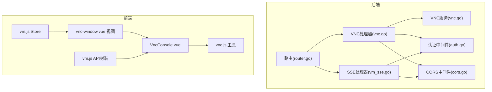
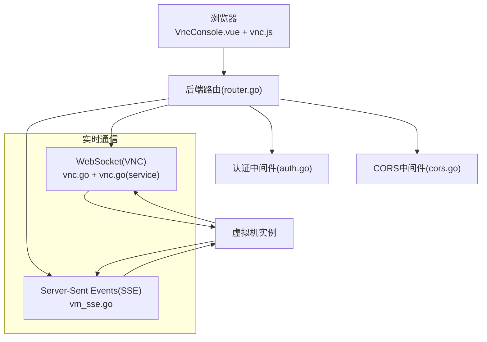
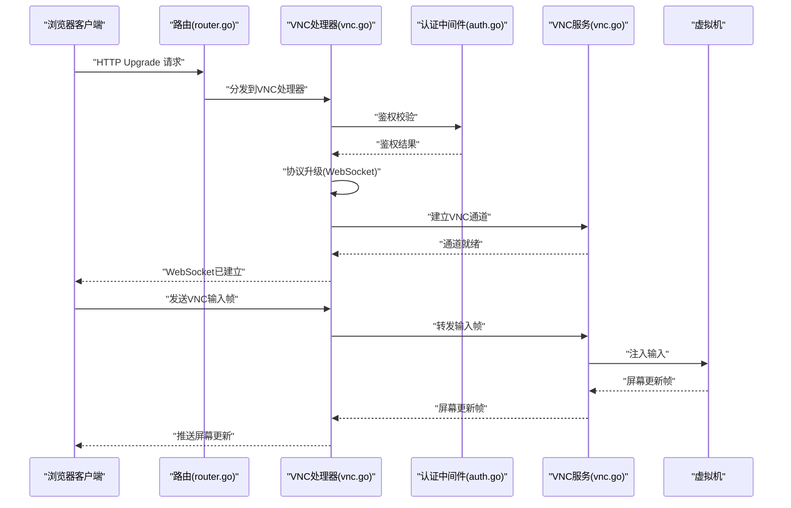
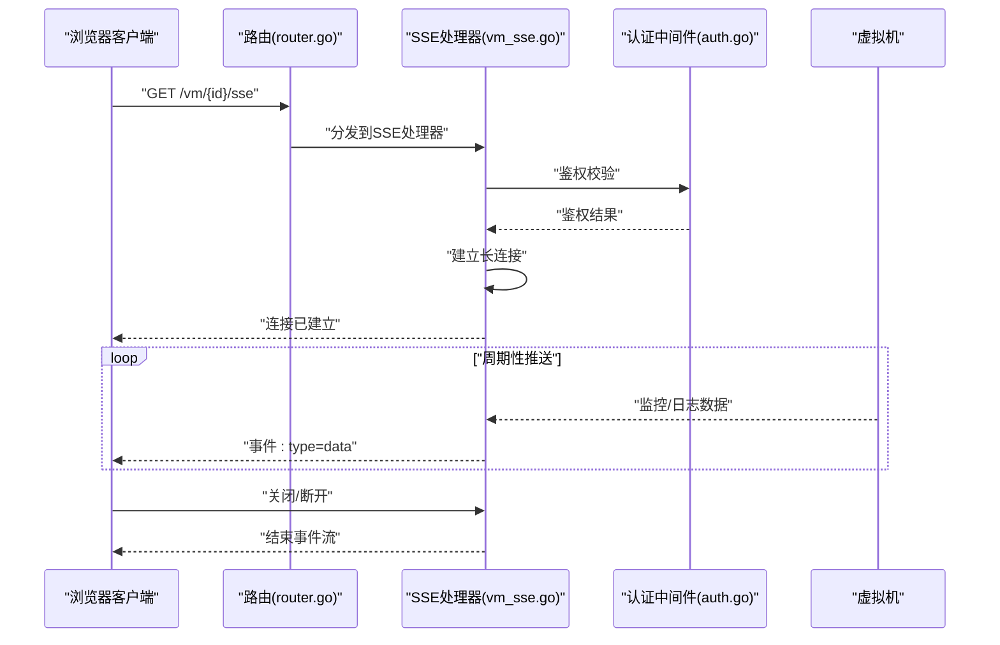
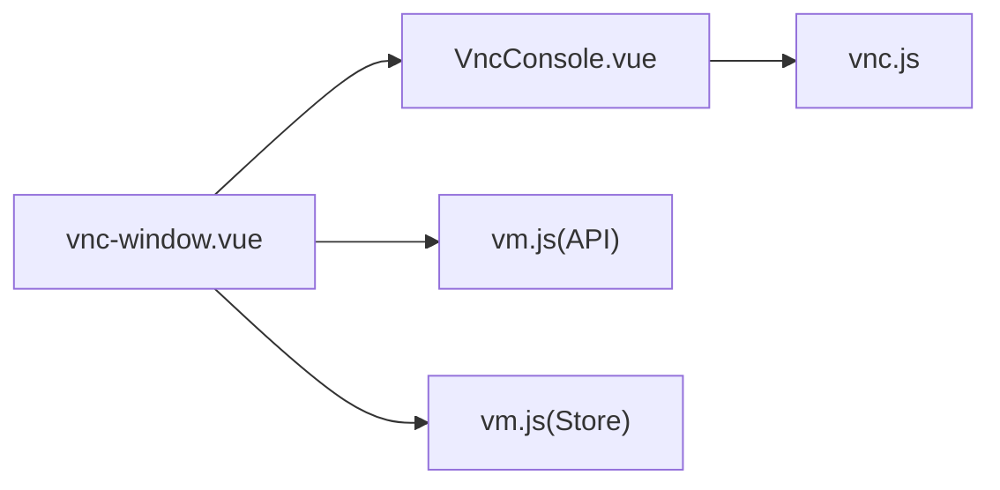
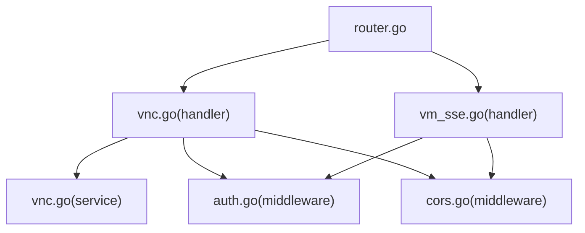

# 实时通信API

<cite>
**本文引用的文件**
- [server/main.go](file://server/main.go)
- [server/router/router.go](file://server/router/router.go)
- [server/handler/vnc.go](file://server/handler/vnc.go)
- [server/handler/vm_sse.go](file://server/handler/vm_sse.go)
- [server/service/vnc/vnc.go](file://server/service/vnc/vnc.go)
- [server/middleware/auth.go](file://server/middleware/auth.go)
- [server/middleware/cors.go](file://server/middleware/cors.go)
- [web/src/components/VncConsole.vue](file://web/src/components/VncConsole.vue)
- [web/src/utils/vnc.js](file://web/src/utils/vnc.js)
- [web/src/views/vm/vnc-window.vue](file://web/src/views/vm/vnc-window.vue)
- [web/src/api/vm.js](file://web/src/api/vm.js)
- [web/src/store/vm.js](file://web/src/store/vm.js)
</cite>

## 目录
1. [简介](#简介)
2. [项目结构](#项目结构)
3. [核心组件](#核心组件)
4. [架构总览](#架构总览)
5. [详细组件分析](#详细组件分析)
6. [依赖关系分析](#依赖关系分析)
7. [性能考虑](#性能考虑)
8. [故障排除指南](#故障排除指南)
9. [结论](#结论)
10. [附录](#附录)

## 简介
本文件面向Open虚拟机管理控制台的实时通信API，重点覆盖以下能力：
- WebSocket接口：用于VNC远程桌面交互（键盘、鼠标、剪贴板等）
- Server-Sent Events接口：用于虚拟机监控与实时日志推送
- 连接建立流程、消息格式、事件类型与状态管理
- 安全性与性能优化策略
- 客户端集成示例与调试方法

该文档旨在帮助开发者快速理解服务端实现与前端集成方式，并提供可操作的排障建议。

## 项目结构
后端采用Go语言开发，路由在router模块中定义；实时相关处理逻辑集中在handler层（vnc.go、vm_sse.go），业务服务位于service层（如vnc服务）。前端Vue应用位于web目录，包含VNC控制台组件与相关工具类。

图表来源
- [server/router/router.go](file://server/router/router.go)
- [server/handler/vnc.go](file://server/handler/vnc.go)
- [server/handler/vm_sse.go](file://server/handler/vm_sse.go)
- [server/service/vnc/vnc.go](file://server/service/vnc/vnc.go)
- [server/middleware/auth.go](file://server/middleware/auth.go)
- [server/middleware/cors.go](file://server/middleware/cors.go)
- [web/src/components/VncConsole.vue](file://web/src/components/VncConsole.vue)
- [web/src/utils/vnc.js](file://web/src/utils/vnc.js)
- [web/src/views/vm/vnc-window.vue](file://web/src/views/vm/vnc-window.vue)
- [web/src/api/vm.js](file://web/src/api/vm.js)
- [web/src/store/vm.js](file://web/src/store/vm.js)

章节来源
- [server/router/router.go](file://server/router/router.go)
- [server/handler/vnc.go](file://server/handler/vnc.go)
- [server/handler/vm_sse.go](file://server/handler/vm_sse.go)
- [server/service/vnc/vnc.go](file://server/service/vnc/vnc.go)
- [web/src/components/VncConsole.vue](file://web/src/components/VncConsole.vue)
- [web/src/utils/vnc.js](file://web/src/utils/vnc.js)
- [web/src/views/vm/vnc-window.vue](file://web/src/views/vm/vnc-window.vue)
- [web/src/api/vm.js](file://web/src/api/vm.js)
- [web/src/store/vm.js](file://web/src/store/vm.js)

## 核心组件
- 路由与入口
  - 入口程序负责初始化配置、加载中间件与注册路由
  - 路由模块集中定义HTTP端点，包括VNC与SSE相关接口
- 处理器
  - VNC处理器：负责VNC会话建立、权限校验、WebSocket升级与数据转发
  - SSE处理器：负责虚拟机监控与日志的Server-Sent Events推送
- 服务层
  - VNC服务：封装底层libvirt或VNC通道的连接与数据处理
- 中间件
  - 认证中间件：确保访问令牌有效
  - CORS中间件：允许跨域请求
- 前端组件
  - VncConsole.vue：VNC控制台UI与交互
  - vnc.js：VNC客户端工具（含连接参数、事件处理）
  - vnc-window.vue：VNC窗口视图
  - vm.js：VM相关API封装
  - vm.js（store）：状态管理

章节来源
- [server/main.go](file://server/main.go)
- [server/router/router.go](file://server/router/router.go)
- [server/handler/vnc.go](file://server/handler/vnc.go)
- [server/handler/vm_sse.go](file://server/handler/vm_sse.go)
- [server/service/vnc/vnc.go](file://server/service/vnc/vnc.go)
- [server/middleware/auth.go](file://server/middleware/auth.go)
- [server/middleware/cors.go](file://server/middleware/cors.go)
- [web/src/components/VncConsole.vue](file://web/src/components/VncConsole.vue)
- [web/src/utils/vnc.js](file://web/src/utils/vnc.js)
- [web/src/views/vm/vnc-window.vue](file://web/src/views/vm/vnc-window.vue)
- [web/src/api/vm.js](file://web/src/api/vm.js)
- [web/src/store/vm.js](file://web/src/store/vm.js)

## 架构总览
下图展示从浏览器到后端服务再到虚拟化平台的整体链路，以及实时通信的关键节点。

图表来源
- [server/router/router.go](file://server/router/router.go)
- [server/middleware/auth.go](file://server/middleware/auth.go)
- [server/middleware/cors.go](file://server/middleware/cors.go)
- [server/handler/vnc.go](file://server/handler/vnc.go)
- [server/service/vnc/vnc.go](file://server/service/vnc/vnc.go)
- [server/handler/vm_sse.go](file://server/handler/vm_sse.go)

## 详细组件分析

### WebSocket 接口（VNC远程桌面）
- 连接建立
  - 客户端通过HTTP升级请求发起WebSocket连接
  - 后端处理器执行鉴权与权限校验，随后进行协议升级
  - 升级成功后，建立持久连接以承载VNC数据帧
- 数据帧格式
  - 帧类型：键盘事件、鼠标事件、剪贴板同步、显示区域更新等
  - 编解码：遵循VNC协议标准的数据帧格式，包含操作码、参数与负载
- 状态管理
  - 连接生命周期：建立、活跃、断开重连
  - 会话状态：登录态、权限范围、并发连接限制
- 错误处理
  - 握手失败、鉴权失败、协议不匹配、网络异常等场景的错误码与回退策略

图表来源
- [server/router/router.go](file://server/router/router.go)
- [server/handler/vnc.go](file://server/handler/vnc.go)
- [server/middleware/auth.go](file://server/middleware/auth.go)
- [server/service/vnc/vnc.go](file://server/service/vnc/vnc.go)

章节来源
- [server/handler/vnc.go](file://server/handler/vnc.go)
- [server/service/vnc/vnc.go](file://server/service/vnc/vnc.go)
- [server/middleware/auth.go](file://server/middleware/auth.go)
- [web/src/components/VncConsole.vue](file://web/src/components/VncConsole.vue)
- [web/src/utils/vnc.js](file://web/src/utils/vnc.js)

### Server-Sent Events 接口（虚拟机监控与实时日志）
- 连接建立
  - 客户端发起HTTP长连接请求，服务端保持响应打开
  - 鉴权通过后，开始按需推送监控指标与日志事件
- 事件类型与数据格式
  - 监控事件：CPU使用率、内存占用、磁盘IO、网络流量等
  - 日志事件：系统日志、应用日志、告警信息等
  - 消息格式：文本事件流格式，支持事件类型与数据体
- 状态管理
  - 连接健康检查、自动重连、断线恢复
  - 流量控制与背压处理，避免客户端过载
- 错误处理
  - 鉴权失败、资源不可用、上游数据源异常等情况下的降级策略

图表来源
- [server/router/router.go](file://server/router/router.go)
- [server/handler/vm_sse.go](file://server/handler/vm_sse.go)
- [server/middleware/auth.go](file://server/middleware/auth.go)

章节来源
- [server/handler/vm_sse.go](file://server/handler/vm_sse.go)
- [server/middleware/auth.go](file://server/middleware/auth.go)
- [web/src/views/vm/vnc-window.vue](file://web/src/views/vm/vnc-window.vue)

### 前端集成与客户端示例
- VNC控制台组件
  - VncConsole.vue：封装VNC会话UI与交互逻辑
  - vnc.js：提供连接参数、事件回调与错误处理
  - vnc-window.vue：VNC窗口视图，承载VNC控制台
- API封装与状态管理
  - vm.js（API）：封装VM相关REST与实时接口调用
  - vm.js（store）：集中管理VM状态、实时订阅与事件队列

图表来源
- [web/src/views/vm/vnc-window.vue](file://web/src/views/vm/vnc-window.vue)
- [web/src/components/VncConsole.vue](file://web/src/components/VncConsole.vue)
- [web/src/utils/vnc.js](file://web/src/utils/vnc.js)
- [web/src/api/vm.js](file://web/src/api/vm.js)
- [web/src/store/vm.js](file://web/src/store/vm.js)

章节来源
- [web/src/components/VncConsole.vue](file://web/src/components/VncConsole.vue)
- [web/src/utils/vnc.js](file://web/src/utils/vnc.js)
- [web/src/views/vm/vnc-window.vue](file://web/src/views/vm/vnc-window.vue)
- [web/src/api/vm.js](file://web/src/api/vm.js)
- [web/src/store/vm.js](file://web/src/store/vm.js)

## 依赖关系分析
- 组件耦合
  - 路由与处理器：低耦合，职责清晰
  - 处理器与服务：处理器仅负责编排，服务负责具体业务
  - 前端组件与后端：通过HTTP与WebSocket交互，松耦合
- 外部依赖
  - 认证与CORS中间件提供统一安全与跨域支持
  - 前端通过API封装与状态管理降低对后端细节的感知

图表来源
- [server/router/router.go](file://server/router/router.go)
- [server/handler/vnc.go](file://server/handler/vnc.go)
- [server/handler/vm_sse.go](file://server/handler/vm_sse.go)
- [server/service/vnc/vnc.go](file://server/service/vnc/vnc.go)
- [server/middleware/auth.go](file://server/middleware/auth.go)
- [server/middleware/cors.go](file://server/middleware/cors.go)

章节来源
- [server/router/router.go](file://server/router/router.go)
- [server/handler/vnc.go](file://server/handler/vnc.go)
- [server/handler/vm_sse.go](file://server/handler/vm_sse.go)
- [server/service/vnc/vnc.go](file://server/service/vnc/vnc.go)
- [server/middleware/auth.go](file://server/middleware/auth.go)
- [server/middleware/cors.go](file://server/middleware/cors.go)

## 性能考虑
- 连接池与复用
  - WebSocket连接应尽量复用，避免频繁握手
  - SSE连接保持合理超时与心跳机制
- 帧压缩与批量
  - 对高频屏幕更新帧进行压缩与批量发送
  - 控制事件推送频率，避免带宽拥塞
- 背压与限流
  - 客户端缓冲区满时主动降频或暂停
  - 服务端对同一VM的并发连接数进行限制
- 缓存与预热
  - 对热点VM的初始状态进行缓存，缩短首次渲染时间
- 资源回收
  - 异常断开时及时释放会话与通道资源

## 故障排除指南
- WebSocket无法建立
  - 检查鉴权中间件是否正确传递令牌
  - 确认CORS配置允许前端域名
  - 查看处理器日志中的握手与升级阶段错误
- 屏幕无更新或延迟高
  - 检查帧压缩与批量策略
  - 监控网络带宽与丢包情况
- SSE断流
  - 确认客户端具备自动重连逻辑
  - 检查服务端事件推送频率与客户端消费速度
- 权限不足
  - 核对用户角色与VM访问权限
  - 确认API密钥或会话有效性

章节来源
- [server/middleware/auth.go](file://server/middleware/auth.go)
- [server/middleware/cors.go](file://server/middleware/cors.go)
- [server/handler/vnc.go](file://server/handler/vnc.go)
- [server/handler/vm_sse.go](file://server/handler/vm_sse.go)

## 结论
本文档梳理了Open虚拟机管理控制台的实时通信API，明确了WebSocket（VNC）与Server-Sent Events（监控与日志）的连接流程、消息格式与状态管理，并提供了安全性与性能优化建议及前端集成示例。建议在生产环境中结合实际网络环境进一步调优帧策略与连接参数，确保用户体验与系统稳定性。

## 附录
- 客户端调试要点
  - 使用浏览器开发者工具观察Network面板中的WebSocket与SSE连接状态
  - 在Console面板输出关键事件与错误信息
  - 逐步排查鉴权、CORS与协议升级环节
- 常见问题速查
  - 鉴权失败：确认令牌与作用域
  - 跨域失败：检查CORS白名单与预检请求
  - 协议不匹配：确认客户端与服务端版本兼容性