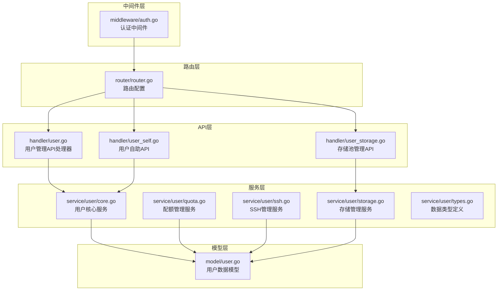
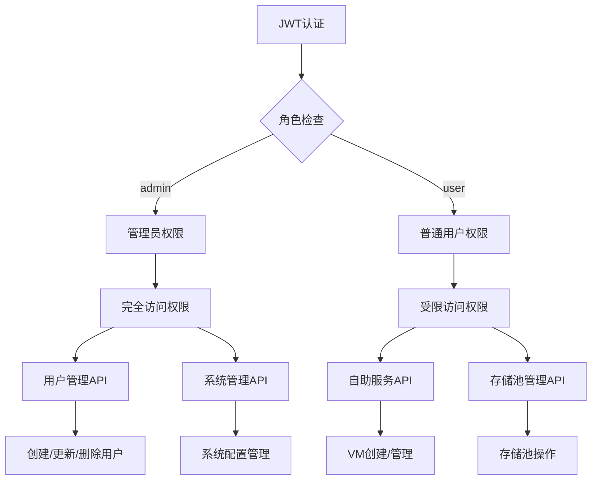
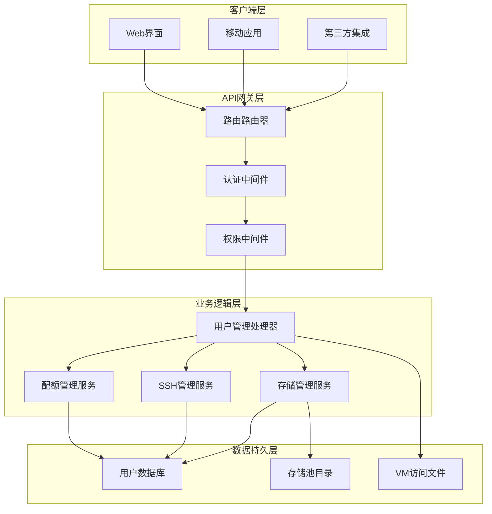
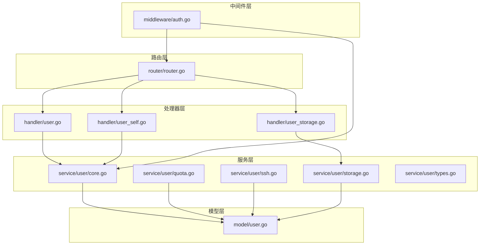
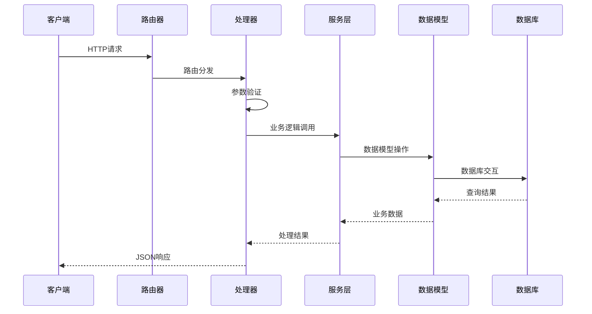

# 用户管理API

<cite>
**本文档引用的文件**
- [server/handler/user.go](file://server/handler/user.go)
- [server/router/router.go](file://server/router/router.go)
- [server/model/user.go](file://server/model/user.go)
- [server/service/user/core.go](file://server/service/user/core.go)
- [server/service/user/types.go](file://server/service/user/types.go)
- [server/service/user/ssh.go](file://server/service/user/ssh.go)
- [server/service/user/storage.go](file://server/service/user/storage.go)
- [server/service/user/quota.go](file://server/service/user/quota.go)
- [server/handler/user_self.go](file://server/handler/user_self.go)
- [server/handler/user_storage.go](file://server/handler/user_storage.go)
- [server/middleware/auth.go](file://server/middleware/auth.go)
- [server/service/security/user.go](file://server/service/security/user.go)
</cite>

## 目录
1. [简介](#简介)
2. [项目结构](#项目结构)
3. [核心组件](#核心组件)
4. [架构概览](#架构概览)
5. [详细组件分析](#详细组件分析)
6. [依赖分析](#依赖分析)
7. [性能考虑](#性能考虑)
8. [故障排除指南](#故障排除指南)
9. [结论](#结论)

## 简介

Open虚拟机管理控制台的用户管理API提供了完整的用户账户生命周期管理功能。该系统支持管理员和普通用户的权限分离，具备完善的用户创建、更新、删除、查询等核心功能，以及高级的配额管理、SSH密钥管理、存储池管理等企业级特性。

系统采用JWT令牌认证机制，结合API密钥认证，为不同场景提供灵活的安全保障。用户管理功能覆盖了从基础账户管理到资源配额控制的完整业务场景，适用于企业级虚拟化平台的用户管理体系。

## 项目结构

用户管理相关的核心文件组织如下：



**图表来源**
- [server/handler/user.go:1-762](file://server/handler/user.go#L1-L762)
- [server/router/router.go:382-400](file://server/router/router.go#L382-L400)

**章节来源**
- [server/handler/user.go:1-762](file://server/handler/user.go#L1-L762)
- [server/router/router.go:18-485](file://server/router/router.go#L18-L485)

## 核心组件

### 用户数据模型

系统使用统一的用户数据模型，支持多种用户类型和权限级别：

| 字段名 | 类型 | 描述 | 默认值 |
|--------|------|------|--------|
| id | uint | 用户唯一标识 | 主键 |
| username | string | 用户名 | 唯一索引 |
| email | string | 邮箱地址 | 索引 |
| role | string | 用户角色 | "user" |
| cloud_type | string | 云类型 | "elastic" |
| status | string | 用户状态 | "active" |
| max_cpu | int | CPU配额(核心) | 0(不限) |
| max_memory | int | 内存配额(GB) | 0(不限) |
| max_disk | int | 磁盘配额(GB) | 0(不限) |
| max_vm | int | VM数量配额 | 0(不限) |
| max_storage | int | 存储配额(GB) | 0(不限) |
| max_runtime_hours | int | 运行时长配额(小时) | 0(不限) |
| enable_port_forward | bool | 端口转发开关 | true |
| max_port_forwards | int | 端口转发数量配额 | 10 |
| max_snapshots | int | 快照数量配额 | 5 |
| max_bandwidth_up | float64 | 上行带宽配额(Mbps) | 0(不限) |
| max_bandwidth_down | float64 | 下行带宽配额(Mbps) | 0(不限) |
| max_traffic_down | float64 | 下行日流量配额(GB) | 0(不限) |
| max_traffic_up | float64 | 上行日流量配额(GB) | 0(不限) |
| max_public_ips | int | 公网IP数量配额 | 0(不限) |
| ssh_enabled | bool | SSH访问开关 | false |

### 权限管理架构

系统采用多层权限控制机制：



**图表来源**
- [server/middleware/auth.go:243-278](file://server/middleware/auth.go#L243-L278)
- [server/router/router.go:382-400](file://server/router/router.go#L382-L400)

**章节来源**
- [server/model/user.go:9-56](file://server/model/user.go#L9-L56)
- [server/middleware/auth.go:17-78](file://server/middleware/auth.go#L17-L78)

## 架构概览

用户管理系统的整体架构采用分层设计，确保功能模块的清晰分离和职责明确：



**图表来源**
- [server/router/router.go:18-485](file://server/router/router.go#L18-L485)
- [server/handler/user.go:140-328](file://server/handler/user.go#L140-L328)

## 详细组件分析

### 用户管理API接口

#### 用户创建接口

**接口定义**
- 方法: POST
- 路径: `/api/user`
- 权限: 管理员

**请求参数**

| 参数名 | 类型 | 必填 | 描述 | 默认值 |
|--------|------|------|------|--------|
| username | string | 是 | 用户名 | - |
| email | string | 否 | 邮箱地址 | - |
| password | string | SMTP未配置时必填 | 初始密码 | - |
| role | string | 否 | 用户角色(user/admin) | "user" |
| cloud_type | string | 否 | 云类型(elastic/lightweight) | "elastic" |
| dedicated_vpc_switch_id | uint | 否 | 专用VPC交换机ID | 0 |
| max_cpu | int | 否 | CPU配额(核心) | 0 |
| max_memory | int | 否 | 内存配额(GB) | 0 |
| max_disk | int | 否 | 磁盘配额(GB) | 0 |
| max_vm | int | 否 | VM数量配额 | 0 |
| max_storage | int | 否 | 存储配额(GB) | 0 |
| max_runtime_hours | int | 否 | 总运行时长配额(小时) | 0 |
| enable_port_forward | bool | 否 | 端口转发开关 | 角色决定 |
| max_port_forwards | int | 否 | 端口转发数量配额 | 角色决定 |
| max_snapshots | int | 否 | 快照数量配额 | 角色决定 |
| max_bandwidth_up | float64 | 否 | 上行带宽(Mbps) | 0 |
| max_bandwidth_down | float64 | 否 | 下行带宽(Mbps) | 0 |
| max_traffic_down | float64 | 否 | 下行日流量(GB) | 0 |
| max_traffic_up | float64 | 否 | 上行日流量(GB) | 0 |
| max_public_ips | int | 否 | 公网IP数量 | 0 |

**响应格式**
```json
{
  "code": 200,
  "message": "用户已创建",
  "data": {
    "username": "string"
  }
}
```

**错误处理**
- 400: 参数验证失败
- 409: 用户名或邮箱已存在
- 500: 创建用户失败

#### 用户配额更新接口

**接口定义**
- 方法: PUT
- 路径: `/api/user/:username/quota`
- 权限: 管理员

**请求参数**

| 参数名 | 类型 | 必填 | 描述 | 默认值 |
|--------|------|------|------|--------|
| max_cpu | int | 否 | CPU配额(核心) | - |
| max_memory | int | 否 | 内存配额(GB) | - |
| max_disk | int | 否 | 磁盘配额(GB) | - |
| max_vm | int | 否 | VM数量配额 | - |
| max_storage | int | 否 | 存储配额(GB) | - |
| max_runtime_hours | int | 否 | 总运行时长配额(小时) | - |
| enable_port_forward | bool | 否 | 端口转发开关 | - |
| max_port_forwards | int | 否 | 端口转发数量配额 | - |
| max_snapshots | int | 否 | 快照数量配额 | - |
| max_bandwidth_up | float64 | 否 | 上行带宽(Mbps) | - |
| max_bandwidth_down | float64 | 否 | 下行带宽(Mbps) | - |
| max_traffic_down | float64 | 否 | 下行日流量(GB) | - |
| max_traffic_up | float64 | 否 | 上行日流量(GB) | - |
| max_public_ips | int | 否 | 公网IP数量 | - |
| cloud_type | string | 否 | 云类型 | - |
| dedicated_vpc_switch_id | uint | 否 | 专用VPC交换机ID | - |

**响应格式**
```json
{
  "code": 200,
  "message": "配额更新成功"
}
```

**错误处理**
- 400: 参数错误
- 403: 管理员不能为自己设置配额
- 500: 更新配额失败

#### 用户状态管理接口

**接口定义**
- 方法: PUT
- 路径: `/api/user/:username/status`
- 权限: 管理员

**请求参数**

| 参数名 | 类型 | 必填 | 描述 | 默认值 |
|--------|------|------|------|--------|
| status | string | 是 | 用户状态(active/disabled) | - |

**响应格式**
```json
{
  "code": 200,
  "message": "用户已封禁",
  "data": {
    "task_id": "string"
  }
}
```

**错误处理**
- 400: 不支持的用户状态
- 403: 管理员不能修改自己的状态
- 500: 更新用户状态失败

#### 用户删除接口

**接口定义**
- 方法: DELETE
- 路径: `/api/user/:username`
- 权限: 管理员

**响应格式**
```json
{
  "code": 200,
  "message": "删除用户任务已提交",
  "data": {
    "task_id": "string"
  }
}
```

**错误处理**
- 400: 不能删除内置超级管理员用户
- 403: 管理员不能删除自己
- 500: 提交删除用户任务失败

#### SSH访问控制接口

**接口定义**
- 方法: PUT
- 路径: `/api/user/:username/ssh`
- 权限: 管理员

**请求参数**

| 参数名 | 类型 | 必填 | 描述 | 默认值 |
|--------|------|------|------|--------|
| enabled | bool | 是 | SSH访问开关 | - |

**响应格式**
```json
{
  "code": 200,
  "message": "用户 username 的 SSH 访问已开启"
}
```

**错误处理**
- 400: 参数错误
- 500: 切换 SSH 状态失败

#### 用户配额查询接口

**接口定义**
- 方法: GET
- 路径: `/api/user/:username/quota`
- 权限: 管理员

**响应格式**
```json
{
  "code": 200,
  "message": "ok",
  "data": {
    "used_cpu": 0,
    "used_memory": 0,
    "used_disk": 0,
    "used_vm": 0,
    "used_storage": 0,
    "used_storage_gb": "string",
    "used_runtime_seconds": 0,
    "used_runtime_display": "string",
    "used_port_forwards": 0,
    "used_snapshots": 0,
    "enable_port_forward": false,
    "max_cpu": 0,
    "max_memory": 0,
    "max_disk": 0,
    "max_vm": 0,
    "max_storage": 0,
    "max_runtime_hours": 0,
    "max_port_forwards": 0,
    "max_snapshots": 0,
    "max_bandwidth_up": 0,
    "max_bandwidth_down": 0,
    "max_traffic_down": 0,
    "max_traffic_up": 0,
    "max_public_ips": 0,
    "used_public_ips": 0,
    "used_traffic_down": 0,
    "used_traffic_up": 0,
    "used_traffic_down_gb": "string",
    "used_traffic_up_gb": "string",
    "is_limited_down": false,
    "is_limited_up": false,
    "remaining_runtime_seconds": 0,
    "remaining_runtime_display": "string",
    "runtime_quota_reached": false
  }
}
```

**错误处理**
- 500: 获取配额信息失败

#### 轻量云VM注册管理

**接口定义**
- 方法: POST
- 路径: `/api/user/:username/lightweight-registrations`
- 权限: 管理员

**请求参数**
```json
{
  "registrations": [
    {
      "vm_name": "string",
      "cloud_init_template": "string",
      "disk_size_gb": 0,
      "vcpu": 0,
      "memory_mb": 0,
      "network_switch_id": 0,
      "security_group_id": 0
    }
  ]
}
```

**响应格式**
```json
{
  "code": 200,
  "message": "轻量云 VM 已登记",
  "data": [
    {
      "id": 0,
      "username": "string",
      "vm_name": "string",
      "status": "string",
      "created_at": "string"
    }
  ]
}
```

**错误处理**
- 400: 参数错误
- 500: 轻量云 VM 已登记

### 用户自助服务API

#### 自助创建VM接口

**接口定义**
- 方法: POST
- 路径: `/api/self/vm/create`
- 权限: 已登录用户

**请求参数**

| 参数名 | 类型 | 必填 | 描述 | 默认值 |
|--------|------|------|------|--------|
| name | string | 是 | VM名称 | - |
| vcpu | int | 是 | CPU核心数 | - |
| ram | int | 是 | 内存大小(MB) | - |
| disk_size | int | 是 | 系统盘大小(GB) | - |
| disk_format | string | 否 | 磁盘格式(qcow2/raw) | "qcow2" |
| disk_bus | string | 否 | 磁盘总线类型 | "virtio" |
| os_variant | string | 否 | 操作系统变体 | - |
| iso_path | string | 否 | ISO镜像路径 | - |
| iso_paths | []string | 否 | 额外ISO镜像路径 | - |
| nic_model | string | 否 | 网卡模型 | "virtio" |
| autostart | bool | 否 | 自动启动 | false |
| freeze | bool | 否 | 冻结启动 | false |
| switch_id | uint | 否 | VPC交换机ID | - |
| security_group_id | uint | 否 | 安全组ID | - |
| extra_disks | []object | 否 | 额外磁盘 | - |

**响应格式**
```json
{
  "code": 200,
  "message": "创建任务已提交",
  "data": {
    "task_id": "string"
  }
}
```

**错误处理**
- 400: 参数错误
- 403: 配额不足
- 500: 提交创建任务失败

#### 自助存储池管理

**接口定义**
- 方法: GET
- 路径: `/api/self/storage/info`
- 权限: 已登录用户

**响应格式**
```json
{
  "code": 200,
  "message": "ok",
  "data": {
    "initialized": false,
    "used_bytes": 0,
    "used_display": "string",
    "max_storage": 0,
    "max_bytes": 0,
    "readonly": false,
    "iso_dir": "string",
    "share_dir": "string",
    "disk_dir": "string"
  }
}
```

**错误处理**
- 500: 获取存储池信息失败

**章节来源**
- [server/handler/user.go:74-762](file://server/handler/user.go#L74-L762)
- [server/handler/user_self.go:24-468](file://server/handler/user_self.go#L24-L468)
- [server/handler/user_storage.go:23-681](file://server/handler/user_storage.go#L23-L681)

## 依赖分析

### 组件间依赖关系



**图表来源**
- [server/router/router.go:382-400](file://server/router/router.go#L382-L400)
- [server/handler/user.go:140-328](file://server/handler/user.go#L140-L328)

### 数据流分析

用户管理系统的数据流遵循标准的MVC模式：



**图表来源**
- [server/router/router.go:18-485](file://server/router/router.go#L18-L485)
- [server/handler/user.go:140-328](file://server/handler/user.go#L140-L328)

**章节来源**
- [server/router/router.go:18-485](file://server/router/router.go#L18-L485)
- [server/handler/user.go:140-328](file://server/handler/user.go#L140-L328)

## 性能考虑

### 配额检查优化

系统实现了多层次的配额检查机制，确保资源使用的安全性：

1. **创建时检查**: 在VM创建前进行配额验证
2. **运行时监控**: 实时监控资源使用情况
3. **批量操作优化**: 支持批量VM分配和带宽重新计算

### 缓存策略

- **VM缓存**: 管理员VM列表采用缓存机制
- **用户信息缓存**: 用户配额使用情况缓存
- **权限缓存**: 用户权限状态缓存

### 并发控制

- **任务队列**: 所有耗时操作通过任务队列异步执行
- **锁机制**: 关键资源操作使用分布式锁
- **事务处理**: 数据库操作使用事务保证一致性

## 故障排除指南

### 常见错误及解决方案

| 错误代码 | 错误类型 | 可能原因 | 解决方案 |
|----------|----------|----------|----------|
| 400 | 参数错误 | 请求参数格式不正确 | 检查API文档，确保参数格式正确 |
| 401 | 未授权 | JWT令牌无效或过期 | 重新登录获取有效令牌 |
| 403 | 权限不足 | 用户权限不够 | 确认用户角色和权限设置 |
| 404 | 资源不存在 | 用户或VM不存在 | 检查资源ID是否正确 |
| 409 | 冲突 | 用户名或邮箱已存在 | 更换用户名或邮箱 |
| 500 | 服务器错误 | 系统内部错误 | 查看服务器日志，联系技术支持 |

### SSH访问问题排查

1. **SSH连接失败**
   - 检查用户SSH状态: `GET /api/user/:username/ssh`
   - 验证系统用户shell设置
   - 确认sshd配置文件

2. **权限拒绝**
   - 检查用户角色和权限
   - 验证VM访问列表文件
   - 确认polkit规则配置

### 存储池问题排查

1. **存储空间不足**
   - 检查用户存储配额: `GET /api/self/storage/info`
   - 验证文件系统配额设置
   - 清理不必要的文件

2. **文件上传失败**
   - 检查存储池初始化状态
   - 验证文件格式和大小限制
   - 确认文件系统权限

**章节来源**
- [server/handler/user.go:584-708](file://server/handler/user.go#L584-L708)
- [server/service/user/ssh.go:20-158](file://server/service/user/ssh.go#L20-L158)
- [server/service/user/storage.go:117-230](file://server/service/user/storage.go#L117-L230)

## 结论

Open虚拟机管理控制台的用户管理API提供了完整的企业级用户管理解决方案。系统采用分层架构设计，具有良好的扩展性和维护性。通过JWT认证、API密钥认证和多层权限控制，确保了系统的安全性和可靠性。

主要特点包括：
- 完整的用户生命周期管理
- 灵活的配额管理系统
- 安全的SSH访问控制
- 企业级存储池管理
- 高性能的任务队列处理
- 详细的错误处理和日志记录

建议在生产环境中：
1. 配置适当的JWT密钥轮换策略
2. 设置合理的API限流参数
3. 定期备份用户数据和配置
4. 监控系统性能指标
5. 建立完善的日志审计机制