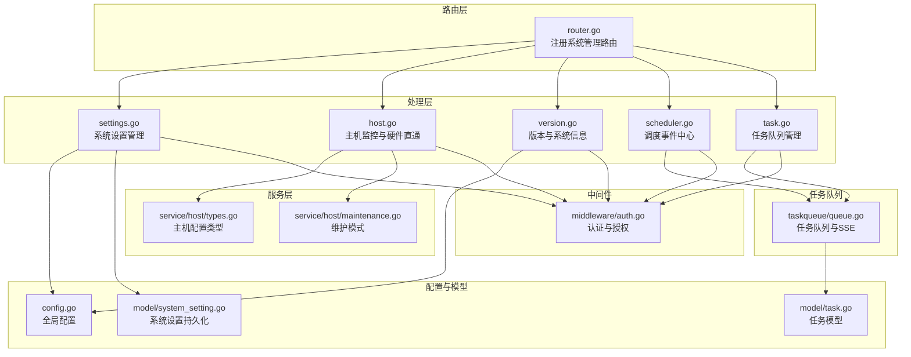
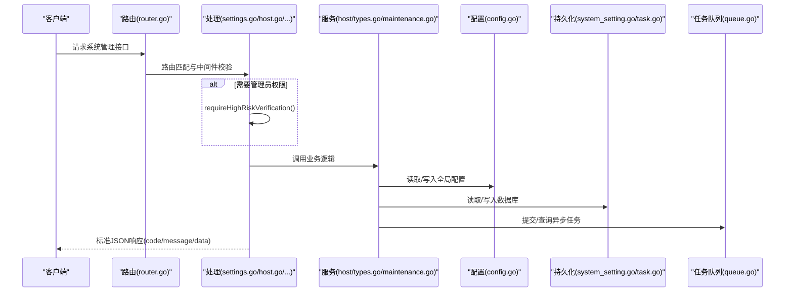
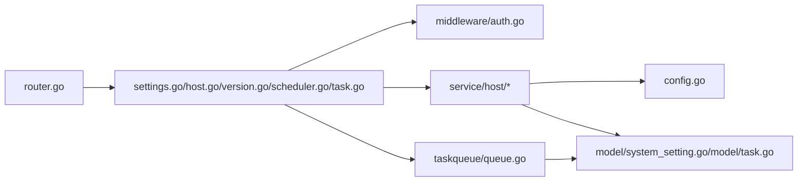

# 系统管理API

<cite>
**本文引用的文件**
- [router.go](file://server/router/router.go)
- [settings.go](file://server/handler/settings.go)
- [host.go](file://server/handler/host.go)
- [version.go](file://server/handler/version.go)
- [scheduler.go](file://server/handler/scheduler.go)
- [task.go](file://server/handler/task.go)
- [system_setting.go](file://server/model/system_setting.go)
- [types.go](file://server/service/host/types.go)
- [config.go](file://server/config/config.go)
- [auth.go](file://server/middleware/auth.go)
- [maintenance.go](file://server/service/host/maintenance.go)
- [queue.go](file://server/taskqueue/queue.go)
- [task.go](file://server/model/task.go)
- [helpers.go](file://server/handler/helpers.go)
</cite>

## 目录
1. [简介](#简介)
2. [项目结构](#项目结构)
3. [核心组件](#核心组件)
4. [架构总览](#架构总览)
5. [详细组件分析](#详细组件分析)
6. [依赖关系分析](#依赖关系分析)
7. [性能考量](#性能考量)
8. [故障排查指南](#故障排查指南)
9. [结论](#结论)
10. [附录](#附录)

## 简介
本文件面向Open虚拟机管理控制台的系统管理API，聚焦系统配置管理、主机信息与状态查询、版本信息、任务队列与调度事件、以及系统监控与维护功能。文档提供每个系统管理接口的请求方法、路径、认证要求、参数说明、响应格式与错误处理策略，并给出最佳实践与安全注意事项，帮助运维人员与开发者高效、安全地使用系统管理能力。

## 项目结构
系统管理API主要分布在以下模块：
- 路由层：统一注册系统管理相关路由，包含系统设置、主机监控、版本信息、任务队列、调度事件等。
- 处理层：具体业务实现，负责参数解析、权限校验、调用服务层并返回标准响应。
- 服务层：封装系统级操作（如维护模式、主机资源采集、KSM/ZRAM配置、日志管理等）。
- 配置层：集中管理全局配置与持久化设置。
- 任务队列：统一异步任务编排与SSE事件推送。
- 中间件：认证、授权、限流、SSE等通用能力。

图表来源
- [router.go:35-470](file://server/router/router.go#L35-L470)
- [settings.go:181-618](file://server/handler/settings.go#L181-L618)
- [host.go:26-304](file://server/handler/host.go#L26-L304)
- [version.go:17-131](file://server/handler/version.go#L17-L131)
- [scheduler.go:16-137](file://server/handler/scheduler.go#L16-L137)
- [task.go:15-194](file://server/handler/task.go#L15-L194)
- [types.go:1-150](file://server/service/host/types.go#L1-L150)
- [maintenance.go:13-66](file://server/service/host/maintenance.go#L13-L66)
- [config.go:19-152](file://server/config/config.go#L19-L152)
- [system_setting.go:1-46](file://server/model/system_setting.go#L1-L46)
- [task.go:1-76](file://server/model/task.go#L1-L76)
- [queue.go:1-562](file://server/taskqueue/queue.go#L1-L562)
- [auth.go:75-199](file://server/middleware/auth.go#L75-L199)

章节来源
- [router.go:35-470](file://server/router/router.go#L35-L470)

## 核心组件
- 系统设置管理：提供系统配置的查询与更新、SMTP测试、JWT密钥轮换、CPU亲和性预设、日志状态与导出等。
- 主机监控与维护：提供宿主机资源统计、KSM/ZRAM/profile切换、磁盘信息、SSE实时推送、硬件直通设备管理等。
- 版本与系统信息：提供版本号、构建时间、站点标题；以及系统运行环境信息（Go版本、内核、Uptime、libvirt、QEMU等）。
- 任务队列：提供任务列表、详情、取消、清理已完成任务，以及SSE实时进度推送。
- 调度事件中心：提供调度器概览、事件列表、SSE实时事件流。
- 配置与持久化：集中配置、环境变量与数据库持久化同步、安全校验与默认值处理。

章节来源
- [settings.go:181-618](file://server/handler/settings.go#L181-L618)
- [host.go:26-304](file://server/handler/host.go#L26-L304)
- [version.go:17-131](file://server/handler/version.go#L17-L131)
- [task.go:15-194](file://server/handler/task.go#L15-L194)
- [scheduler.go:16-137](file://server/handler/scheduler.go#L16-L137)
- [config.go:19-152](file://server/config/config.go#L19-L152)
- [system_setting.go:1-46](file://server/model/system_setting.go#L1-L46)

## 架构总览
系统管理API采用“路由-处理-服务-配置-任务队列”的分层设计，统一通过中间件进行认证与授权控制，保证接口的安全性与一致性。

图表来源
- [router.go:35-470](file://server/router/router.go#L35-L470)
- [settings.go:259-618](file://server/handler/settings.go#L259-L618)
- [host.go:54-165](file://server/handler/host.go#L54-L165)
- [config.go:458-749](file://server/config/config.go#L458-L749)
- [system_setting.go:19-45](file://server/model/system_setting.go#L19-L45)
- [queue.go:183-354](file://server/taskqueue/queue.go#L183-L354)

## 详细组件分析

### 系统设置管理接口
- 接口目标：提供系统配置的查询与更新、SMTP测试、JWT密钥轮换、CPU亲和性预设、日志状态与导出等。
- 认证与权限：需管理员访问令牌，部分高风险操作需二次验证。
- 关键接口
  - GET /api/settings：获取系统设置（含SMTP视图、维护模式服务单元、JWT密钥轮换状态、日志备份数等）
  - PUT /api/settings：更新系统设置（运行时生效并持久化，部分变更触发异步任务或系统命令）
  - POST /api/settings/smtp/test：SMTP测试发信（可传入临时配置或使用已保存配置）
  - PUT /api/settings/cpu-affinity-presets：保存CPU亲和性预设（管理员）
  - POST /api/settings/jwt-secret/rotate：手动轮换JWT密钥（管理员，开发模式禁止）
  - GET /api/settings/log/status：获取日志状态（文件列表、总大小、分类）
  - POST /api/settings/log/delete：删除日志（高风险）
  - POST /api/settings/log/export：导出日志（高风险）

- 参数与响应要点
  - 更新设置时，对端口范围、速率、阈值、并发数、轮换间隔等进行边界校验；部分字段变更会触发异步任务（如维护模式开关、全局带宽限制、网络等待就绪检测）。
  - SMTP测试支持传入临时配置或使用已保存配置；成功返回“测试邮件已发送”，失败返回错误信息。
  - JWT密钥轮换会使现有Token失效，需重新登录；开发模式下禁止手动轮换。
  - 日志管理接口支持列出日志文件、计算总大小、删除与导出（高风险操作需二次验证）。

- 错误处理
  - 参数绑定失败返回400；范围校验失败返回400；持久化失败返回200但提示部分失败；轮换失败返回500；开发模式禁止轮换返回400。

章节来源
- [router.go:88-101](file://server/router/router.go#L88-L101)
- [settings.go:181-618](file://server/handler/settings.go#L181-L618)
- [system_setting.go:19-45](file://server/model/system_setting.go#L19-L45)
- [config.go:679-749](file://server/config/config.go#L679-L749)

### 主机监控与维护接口
- 接口目标：提供宿主机资源统计、KSM/ZRAM/profile切换、磁盘信息、SSE实时推送、硬件直通设备管理等。
- 认证与权限：部分接口需管理员权限。
- 关键接口
  - GET /api/host/stats：获取宿主机资源信息（CPU/内存/磁盘/网络等）
  - GET /api/host/stats/history：按日期范围查询历史记录（start/end，支持多种日期格式）
  - GET /api/host/stats/sse：SSE实时推送宿主机资源数据（5秒周期）
  - GET /api/host/cpus：返回宿主机CPU核心数
  - GET /api/host/disks：返回宿主机挂载磁盘列表
  - GET/PUT /api/host/kvm-intel-unrestricted-guest：查询/设置Intel KVM unrestricted guest
  - GET/PUT /api/host/ksm：查询/设置KSM profile
  - GET/PUT /api/host/zram：查询/设置ZRAM profile
  - GET /api/host/passthrough：查询硬件直通设备
  - POST /api/host/passthrough/bind：绑定PCI设备到宿主机
  - POST /api/host/passthrough/unbind：解绑PCI设备

- 参数与响应要点
  - 历史查询接口支持“YYYY-MM-DD”和“YYYY-MM-DDTHH:mm:ss”两种格式，结束时间若仅日期未带时间，默认扩展至当日23:59:59。
  - SSE接口设置标准SSE头部，立即推送一次，随后每5秒推送一次。
  - KSM/ZRAM profile设置需管理员二次验证；设置成功返回状态与描述信息。
  - 硬件直通接口仅管理员可用，支持查询、绑定、解绑PCI设备。

- 错误处理
  - 历史查询缺少时间范围返回400；日期格式错误返回400；查询失败返回500；SSE推送内部错误忽略，不影响接口返回。

章节来源
- [router.go:433-451](file://server/router/router.go#L433-L451)
- [host.go:26-304](file://server/handler/host.go#L26-L304)
- [types.go:36-124](file://server/service/host/types.go#L36-L124)
- [maintenance.go:13-66](file://server/service/host/maintenance.go#L13-L66)

### 版本与系统信息接口
- 接口目标：提供系统版本信息与运行环境信息。
- 关键接口
  - GET /api/public/version：返回版本号、构建时间、站点标题
  - GET /api/system-info：返回Go版本、操作系统、发行版、架构、CPU数、主机名、goroutine数、内核、Uptime、libvirt、QEMU版本等

- 参数与响应要点
  - 版本信息通过构建时注入的变量提供；系统信息通过系统命令与文件读取汇总。

- 错误处理
  - 读取系统信息时若命令执行失败，相应字段返回“-”。

章节来源
- [router.go:38-41](file://server/router/router.go#L38-L41)
- [version.go:17-131](file://server/handler/version.go#L17-L131)

### 任务队列接口
- 接口目标：提供任务列表、详情、取消、清理已完成任务，以及SSE实时进度推送。
- 认证与权限：任务详情与取消需具备访问权限（管理员或任务创建者）。
- 关键接口
  - GET /api/task/list：获取任务列表（支持分页、状态、类型筛选）
  - GET /api/task/:id：获取任务详情（需权限）
  - POST /api/task/:id/cancel：取消任务（等待中或运行中）
  - DELETE /api/task/clear：清理已完成任务（高风险，需二次验证）
  - GET /api/task/sse：SSE实时推送任务进度

- 参数与响应要点
  - 任务列表支持page/page_size、status、type筛选；分页范围1-100。
  - 取消任务对等待中直接标记取消，对运行中触发取消信号；SSE事件包含任务ID、类型、状态、进度、消息。
  - 清理已完成任务仅删除已结束状态且超过24小时的任务，管理员可清理所有用户任务。

- 错误处理
  - 任务不存在返回404；无权访问返回403；取消失败返回400；清理失败返回500。

章节来源
- [router.go:453-461](file://server/router/router.go#L453-L461)
- [task.go:15-194](file://server/handler/task.go#L15-L194)
- [queue.go:356-562](file://server/taskqueue/queue.go#L356-L562)
- [task.go:1-76](file://server/model/task.go#L1-L76)

### 调度事件中心接口
- 接口目标：提供调度器概览、事件列表、SSE实时事件流。
- 认证与权限：管理员。
- 关键接口
  - GET /api/scheduler/list：获取调度器概览
  - GET /api/scheduler/events：获取调度事件列表（支持分页、时间范围、状态、VM名称筛选）
  - GET /api/scheduler/events/sse：SSE实时推送调度事件

- 参数与响应要点
  - 事件列表支持start/end时间范围解析，支持RFC3339、"YYYY-MM-DD HH:mm:ss"、"YYYY-MM-DD"三种格式；结束时间若仅日期，默认扩展至当日23:59:59。
  - SSE事件流首次发送连接确认，随后推送调度事件。

- 错误处理
  - 时间格式无效返回400；查询失败返回500；SSE客户端断开自动注销。

章节来源
- [router.go:463-470](file://server/router/router.go#L463-L470)
- [scheduler.go:16-137](file://server/handler/scheduler.go#L16-L137)

### 配置与持久化
- 全局配置
  - 配置项覆盖顺序：环境变量 > 数据库持久化 > 默认值；仅当对应环境变量未设置时才使用数据库值。
  - 可持久化配置项列表包含模板目录、网络后端、端口范围、带宽限制、SMTP、动态内存调度、VPC配置、IOPS默认限制、批量克隆并发、JWT轮换、日志配置、网络等待就绪检测等。
  - .env文件同步：将数据库中已持久化的配置项同步写入.env文件，确保重启后环境变量与数据库一致。

- 系统设置持久化
  - 通过键值对表存储系统设置；提供Get/Set/Delete接口；支持批量导出为设置映射并写入数据库。

章节来源
- [config.go:458-749](file://server/config/config.go#L458-L749)
- [system_setting.go:1-46](file://server/model/system_setting.go#L1-L46)

### 认证与授权
- 认证中间件
  - 支持JWT与API Key两种认证方式；JWT支持指定token type过滤；API Key通过请求头或查询参数传递。
  - 用户状态校验：禁用账户禁止访问；激活状态校验；安全更新时间校验防止Token被撤销后继续使用。
- 授权中间件
  - 管理员中间件：仅admin角色可访问。
  - VM访问中间件：非admin用户操作VM时校验归属权限。
  - 轻量云限制：禁止轻量云用户访问弹性云自助能力。

章节来源
- [auth.go:75-199](file://server/middleware/auth.go#L75-L199)

## 依赖关系分析
- 路由层依赖处理层；处理层依赖服务层与配置层；服务层依赖配置层与模型层；任务队列依赖模型层；中间件贯穿所有处理层。
- 高风险操作统一通过requireHighRiskVerification进行二次验证，确保管理员明确操作意图。

图表来源
- [router.go:35-470](file://server/router/router.go#L35-L470)
- [settings.go:259-618](file://server/handler/settings.go#L259-L618)
- [host.go:54-165](file://server/handler/host.go#L54-L165)
- [version.go:17-131](file://server/handler/version.go#L17-L131)
- [scheduler.go:16-137](file://server/handler/scheduler.go#L16-L137)
- [task.go:15-194](file://server/handler/task.go#L15-L194)
- [auth.go:75-199](file://server/middleware/auth.go#L75-L199)
- [config.go:458-749](file://server/config/config.go#L458-L749)
- [system_setting.go:1-46](file://server/model/system_setting.go#L1-L46)
- [task.go:1-76](file://server/model/task.go#L1-L76)
- [queue.go:1-562](file://server/taskqueue/queue.go#L1-L562)

## 性能考量
- SSE推送：宿主机资源与任务进度采用SSE推送，减少轮询开销；注意客户端断连与缓冲区满的处理。
- 任务队列：多worker并发处理任务，自动清理24小时过期任务，避免内存膨胀。
- 配置加载：环境变量优先于数据库持久化，减少数据库查询；.env同步仅更新已持久化键，降低IO。
- 网络与带宽：全局带宽限制变更触发异步重新分配，避免阻塞主流程。

## 故障排查指南
- 系统设置更新失败
  - 检查参数范围与格式（端口、速率、阈值、并发、轮换间隔等）；查看持久化错误提示；必要时回滚设置。
- SMTP测试失败
  - 确认SMTP配置正确；若使用临时配置，确保必填字段完整；查看服务端日志定位问题。
- JWT密钥轮换后无法登录
  - 轮换会使所有Token失效，需重新登录；开发模式禁止手动轮换。
- 维护模式异常
  - 检查维护模式服务单元列表与面板服务自启；查看任务队列中维护模式任务状态与结果。
- 任务取消无效
  - 等待中任务可直接取消；运行中任务需等待处理器检测取消信号；查看SSE事件确认状态变化。
- SSE连接断开
  - 检查客户端上下文是否提前关闭；服务端会自动注销断开的SSE客户端。

章节来源
- [settings.go:556-618](file://server/handler/settings.go#L556-L618)
- [task.go:132-170](file://server/handler/task.go#L132-L170)
- [queue.go:458-501](file://server/taskqueue/queue.go#L458-L501)
- [helpers.go:17-31](file://server/handler/helpers.go#L17-L31)

## 结论
系统管理API围绕“配置—监控—任务—调度—维护”五大维度构建，通过中间件保障安全，通过任务队列实现异步化与可观测性，通过SSE提供实时体验。遵循本文的参数规范、错误处理与最佳实践，可确保系统管理操作的稳定性与安全性。

## 附录
- 最佳实践
  - 管理员操作建议使用二次验证；敏感配置（SMTP、JWT）定期轮换；合理设置日志备份与清理策略。
  - 使用SSE监听任务与主机资源变化，避免频繁轮询；对长时间运行任务设置合理的超时与重试。
  - 维护模式开启前做好业务影响评估，确保关键服务单元列表准确。
- 安全考虑
  - JWT密钥必须强随机生成，生产环境禁止使用默认密钥；开发模式仅用于测试。
  - 高风险操作（轮换密钥、清理任务、维护模式）必须管理员二次验证。
  - 严格区分管理员与普通用户权限，避免越权访问。