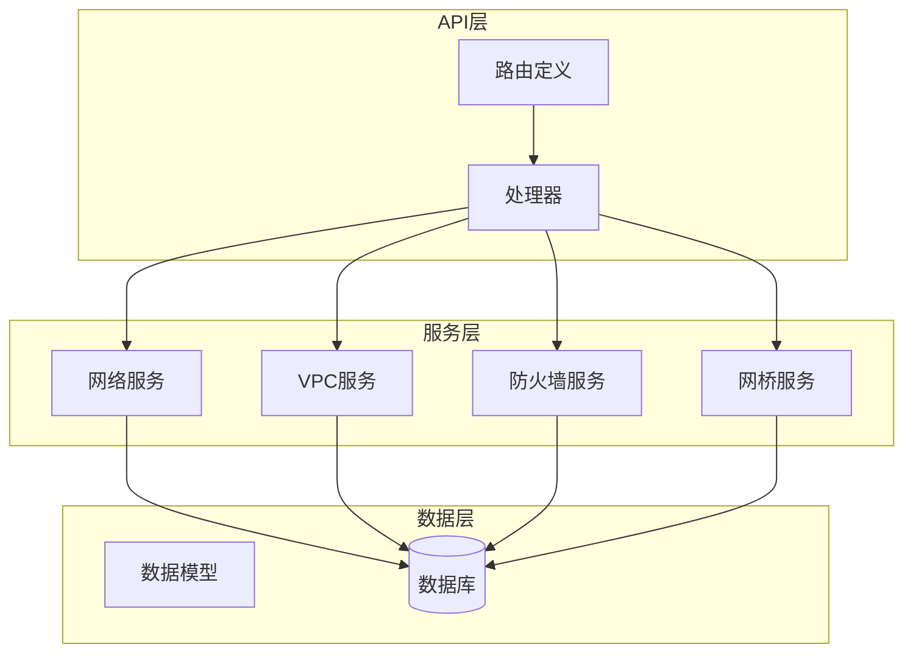
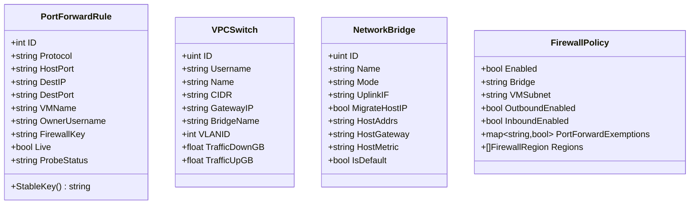
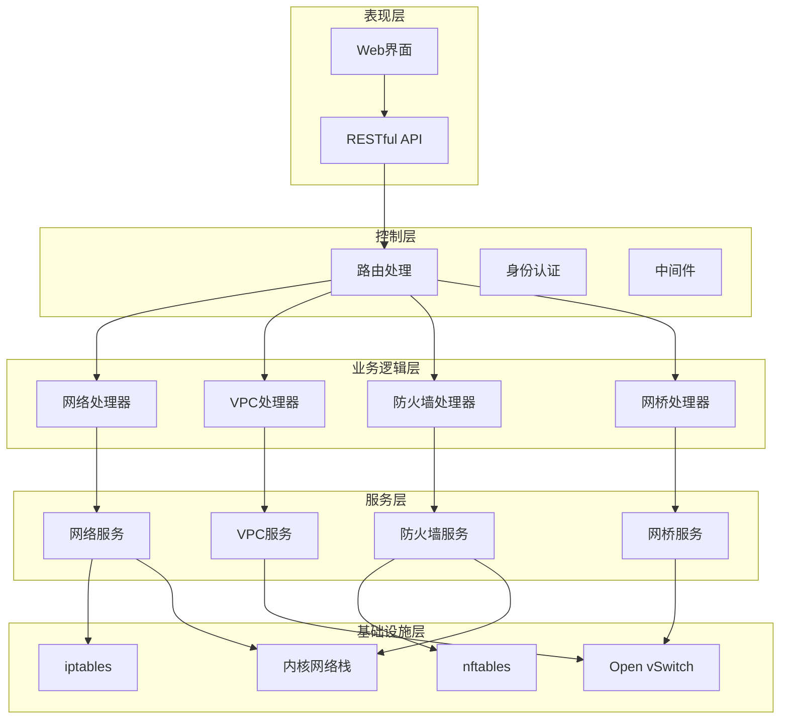
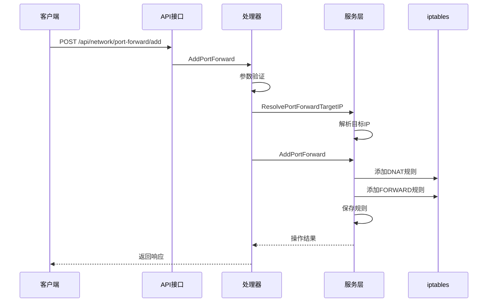
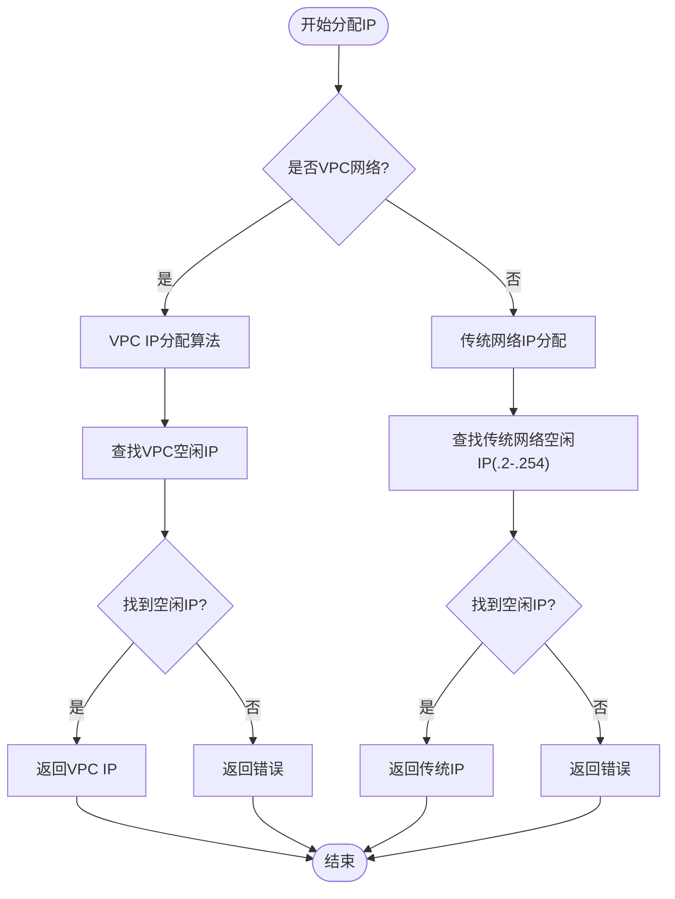
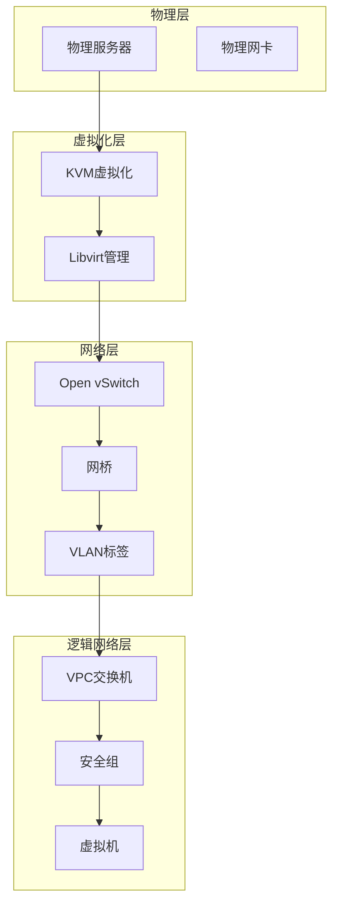
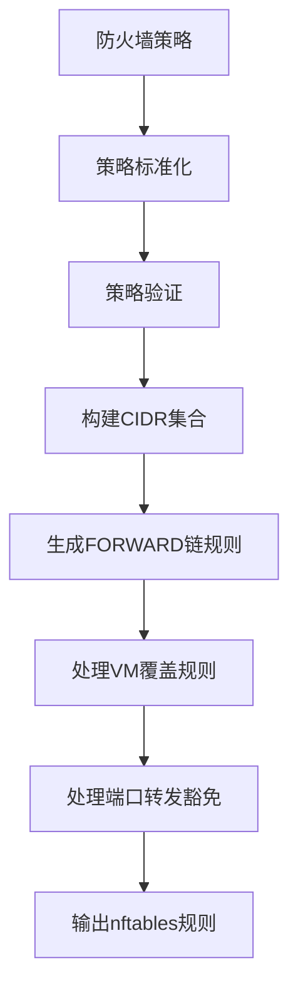
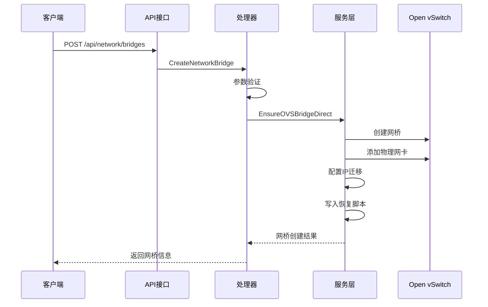
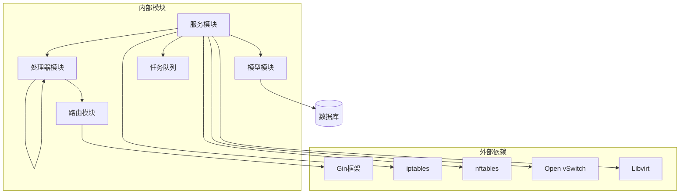

# 网络管理API

<cite>
**本文档引用的文件**
- [server/router/router.go](file://server/router/router.go)
- [server/handler/network.go](file://server/handler/network.go)
- [server/handler/vpc.go](file://server/handler/vpc.go)
- [server/handler/network_bridge.go](file://server/handler/network_bridge.go)
- [server/handler/firewall.go](file://server/handler/firewall.go)
- [server/service/network/port_forward.go](file://server/service/network/port_forward.go)
- [server/service/network/static_ip.go](file://server/service/network/static_ip.go)
- [server/service/network/types.go](file://server/service/network/types.go)
- [server/service/network/vpc/switch.go](file://server/service/network/vpc/switch.go)
- [server/service/network/vpc/types.go](file://server/service/network/vpc/types.go)
- [server/service/firewall/rules.go](file://server/service/firewall/rules.go)
- [server/service/firewall/types.go](file://server/service/firewall/types.go)
- [server/model/network_bridge.go](file://server/model/network_bridge.go)
</cite>

## 目录
1. [简介](#简介)
2. [项目结构](#项目结构)
3. [核心组件](#核心组件)
4. [架构概览](#架构概览)
5. [详细组件分析](#详细组件分析)
6. [依赖关系分析](#依赖关系分析)
7. [性能考虑](#性能考虑)
8. [故障排除指南](#故障排除指南)
9. [结论](#结论)

## 简介

Open虚拟机管理控制台提供了完整的网络管理API接口，涵盖了VPC网络、端口转发、防火墙规则、网络桥接等核心功能。该系统采用模块化设计，通过Gin框架提供RESTful API，结合iptables、nftables、Open vSwitch等底层技术实现网络虚拟化和安全控制。

系统支持两种主要网络模式：
- **传统网络模式**：基于iptables的端口转发和静态IP管理
- **VPC网络模式**：基于Open vSwitch的虚拟私有云网络，支持安全组和高级网络功能

## 项目结构

网络管理API主要分布在以下模块中：



**图表来源**
- [server/router/router.go:232-333](file://server/router/router.go#L232-L333)
- [server/handler/network.go:17-129](file://server/handler/network.go#L17-L129)
- [server/handler/vpc.go:34-95](file://server/handler/vpc.go#L34-L95)

**章节来源**
- [server/router/router.go:232-333](file://server/router/router.go#L232-L333)

## 核心组件

### 网络管理API分类

系统提供四大类网络管理接口：

1. **静态IP管理**：静态IP绑定、解绑、查询
2. **端口转发管理**：端口转发规则的创建、修改、删除
3. **VPC网络管理**：虚拟私有云交换机和安全组管理
4. **防火墙管理**：系统级防火墙策略和规则管理

### 数据模型



**图表来源**
- [server/service/network/types.go:27-96](file://server/service/network/types.go#L27-L96)
- [server/service/network/vpc/types.go:13-96](file://server/service/network/vpc/types.go#L13-L96)
- [server/model/network_bridge.go:5-23](file://server/model/network_bridge.go#L5-L23)
- [server/service/firewall/types.go:32-49](file://server/service/firewall/types.go#L32-L49)

**章节来源**
- [server/service/network/types.go:27-96](file://server/service/network/types.go#L27-L96)
- [server/service/network/vpc/types.go:13-96](file://server/service/network/vpc/types.go#L13-L96)
- [server/model/network_bridge.go:5-23](file://server/model/network_bridge.go#L5-L23)

## 架构概览

系统采用分层架构设计，各层职责清晰：



**图表来源**
- [server/router/router.go:18-485](file://server/router/router.go#L18-L485)
- [server/handler/network.go:17-129](file://server/handler/network.go#L17-L129)

## 详细组件分析

### 端口转发管理API

端口转发功能提供了灵活的网络访问控制机制：

#### 核心接口



**图表来源**
- [server/handler/network.go:222-348](file://server/handler/network.go#L222-L348)
- [server/service/network/port_forward.go:204-263](file://server/service/network/port_forward.go#L204-L263)

#### 接口规范

**创建端口转发规则**
- **方法**: POST `/api/network/port-forward/add`
- **请求体**:
  ```json
  {
    "vm_name": "string",
    "vm_ip": "string",
    "vm_port": "string",
    "host_port": "string",
    "protocol": "string"
  }
  ```
- **响应**:
  ```json
  {
    "code": 200,
    "message": "string",
    "data": {
      "host_port": "string",
      "vm_ip": "string",
      "access_ip": "string",
      "access_address": "string"
    }
  }
  ```

**编辑端口转发规则**
- **方法**: PUT `/api/network/port-forward/:id`
- **路径参数**: `id` (规则ID)
- **请求体**: 同创建接口，部分字段可选

**删除端口转发规则**
- **方法**: DELETE `/api/network/port-forward/:id`
- **路径参数**: `id` (规则ID)

**批量删除端口转发规则**
- **方法**: POST `/api/network/port-forward/batch-delete`
- **请求体**:
  ```json
  {
    "ids": [1, 2, 3]
  }
  ```

**章节来源**
- [server/handler/network.go:205-348](file://server/handler/network.go#L205-L348)
- [server/service/network/port_forward.go:165-187](file://server/service/network/port_forward.go#L165-L187)

### 静态IP管理API

静态IP管理提供了稳定的网络访问能力：

#### 核心接口

**查询静态IP列表**
- **方法**: GET `/api/network/static-ip/list`
- **权限**: 非管理员用户只能查看自己的VM绑定信息

**绑定静态IP**
- **方法**: POST `/api/network/static-ip/bind`
- **请求体**:
  ```json
  {
    "vm_name": "string",
    "ip": "string"
  }
  ```
- **行为**: IP为空时自动分配空闲IP

**解绑静态IP**
- **方法**: POST `/api/network/static-ip/unbind`
- **请求体**:
  ```json
  {
    "vm_name": "string"
  }
  ```

#### IP分配算法



**图表来源**
- [server/service/network/static_ip.go:90-173](file://server/service/network/static_ip.go#L90-L173)

**章节来源**
- [server/handler/network.go:17-172](file://server/handler/network.go#L17-L172)
- [server/service/network/static_ip.go:18-88](file://server/service/network/static_ip.go#L18-L88)

### VPC网络管理API

VPC网络提供了企业级的网络隔离和管理能力：

#### 核心接口

**创建VPC交换机**
- **方法**: POST `/api/vpc/switches`
- **请求体**:
  ```json
  {
    "username": "string",
    "name": "string",
    "bridge_name": "string",
    "bridge_vlan_id": 0,
    "cidr": "string",
    "gateway_ip": "string",
    "dhcp_start": "string",
    "dhcp_end": "string"
  }
  ```

**更新VPC交换机**
- **方法**: PUT `/api/vpc/switches/:id`
- **路径参数**: `id` (交换机ID)

**删除VPC交换机**
- **方法**: DELETE `/api/vpc/switches/:id`
- **查询参数**: `force=true` (强制删除，移除所有VM绑定)

**列出VPC安全组**
- **方法**: GET `/api/vpc/security-groups`

**创建安全组规则**
- **方法**: POST `/api/vpc/security-groups/:id/rules`
- **请求体**:
  ```json
  {
    "direction": "string",
    "protocol": "string",
    "port_start": 0,
    "port_end": 0,
    "target_type": "string",
    "target_value": "string",
    "remark": "string"
  }
  ```

#### VPC网络拓扑



**图表来源**
- [server/service/network/vpc/switch.go:32-96](file://server/service/network/vpc/switch.go#L32-L96)

**章节来源**
- [server/handler/vpc.go:34-274](file://server/handler/vpc.go#L34-L274)
- [server/service/network/vpc/switch.go:14-30](file://server/service/network/vpc/switch.go#L14-L30)

### 防火墙管理API

系统提供了多层次的防火墙管理能力：

#### 核心接口

**获取防火墙状态**
- **方法**: GET `/api/firewall/status`

**保存防火墙策略**
- **方法**: PUT `/api/firewall/policy`
- **请求体**: FirewallPolicy对象

**应用防火墙策略**
- **方法**: POST `/api/firewall/apply`
- **高风险验证**: 需要二次确认

**获取宿主机防火墙状态**
- **方法**: GET `/api/firewall/host/status`

**创建宿主机防火墙规则**
- **方法**: POST `/api/firewall/host/rules`
- **请求体**:
  ```json
  {
    "action": "string",
    "protocol": "string",
    "port_start": 0,
    "port_end": 0,
    "source_cidr": "string",
    "comment": "string"
  }
  ```

#### 防火墙策略构建



**图表来源**
- [server/service/firewall/rules.go:18-135](file://server/service/firewall/rules.go#L18-L135)

**章节来源**
- [server/handler/firewall.go:13-296](file://server/handler/firewall.go#L13-L296)
- [server/service/firewall/rules.go:18-135](file://server/service/firewall/rules.go#L18-L135)

### 网桥管理API

系统支持物理网卡与虚拟网络的桥接：

#### 核心接口

**列出宿主机网卡**
- **方法**: GET `/api/network/host/interfaces`

**列出网络网桥**
- **方法**: GET `/api/network/bridges`

**创建网络网桥**
- **方法**: POST `/api/network/bridges`
- **请求体**:
  ```json
  {
    "name": "string",
    "mode": "string",
    "uplink_if": "string",
    "migrate_host_ip": true
  }
  ```

**删除网络网桥**
- **方法**: DELETE `/api/network/bridges/:id`

#### 网桥创建流程



**图表来源**
- [server/handler/network_bridge.go:30-45](file://server/handler/network_bridge.go#L30-L45)
- [server/service/network/bridge/create.go:14-69](file://server/service/network/bridge/create.go#L14-L69)

**章节来源**
- [server/handler/network_bridge.go:12-58](file://server/handler/network_bridge.go#L12-L58)
- [server/service/network/bridge/create.go:14-160](file://server/service/network/bridge/create.go#L14-L160)

## 依赖关系分析

系统各组件之间的依赖关系如下：



**图表来源**
- [server/router/router.go:18-485](file://server/router/router.go#L18-L485)
- [server/handler/network.go:3-15](file://server/handler/network.go#L3-L15)

**章节来源**
- [server/router/router.go:18-485](file://server/router/router.go#L18-L485)

## 性能考虑

### 端口转发性能优化

1. **规则缓存**: 系统维护端口转发规则的缓存，避免频繁查询iptables
2. **批量操作**: 支持批量删除端口转发规则，减少系统调用次数
3. **异步持久化**: 规则变更后异步保存到持久化存储

### VPC网络性能优化

1. **硬件直通**: 支持PCIe直通设备，减少虚拟化开销
2. **带宽限制**: 提供细粒度的带宽控制和流量统计
3. **多网口支持**: 管理员可为VM添加多个网口，提高网络吞吐量

### 防火墙性能优化

1. **nftables替代**: 使用nftables替代iptables，提供更好的性能
2. **规则合并**: 自动合并相似的防火墙规则，减少规则数量
3. **CIDR压缩**: 对IPv4 CIDR进行压缩，提高匹配效率

## 故障排除指南

### 常见问题及解决方案

#### 端口转发问题

**问题**: 端口转发规则创建失败
- **可能原因**: 端口已被占用、权限不足、VPC网络配置错误
- **解决步骤**:
  1. 检查目标端口是否已被占用
  2. 验证用户权限和配额
  3. 确认VPC交换机配置正确

**问题**: 端口转发规则不生效
- **可能原因**: iptables规则未正确应用、防火墙策略阻止
- **解决步骤**:
  1. 检查iptables规则状态
  2. 验证防火墙策略配置
  3. 查看系统日志

#### VPC网络问题

**问题**: VPC交换机创建失败
- **可能原因**: VLAN ID冲突、网段配置错误、资源配额不足
- **解决步骤**:
  1. 检查VLAN ID可用性
  2. 验证网段配置合法性
  3. 确认用户配额充足

**问题**: VM无法获得静态IP
- **可能原因**: DHCP服务异常、静态IP绑定冲突
- **解决步骤**:
  1. 检查DHCP服务状态
  2. 验证静态IP绑定配置
  3. 查看VPC DHCP租约情况

#### 防火墙问题

**问题**: 防火墙策略应用失败
- **可能原因**: nftables服务不可用、规则语法错误
- **解决步骤**:
  1. 检查nftables服务状态
  2. 验证防火墙策略语法
  3. 查看应用日志

**问题**: 端口转发被防火墙阻止
- **可能原因**: 入站区域限制、端口转发豁免未正确设置
- **解决步骤**:
  1. 检查入站区域限制配置
  2. 设置端口转发豁免规则
  3. 验证防火墙策略应用

### 调试工具

系统提供了丰富的调试工具：

1. **网络诊断**: 支持VM网络抓包和连接状态检查
2. **日志分析**: 详细的系统日志和错误追踪
3. **状态监控**: 实时监控网络组件状态和性能指标

**章节来源**
- [server/handler/network.go:552-734](file://server/handler/network.go#L552-L734)
- [server/handler/firewall.go:274-296](file://server/handler/firewall.go#L274-L296)

## 结论

Open虚拟机管理控制台的网络管理API提供了完整的企业级网络管理解决方案。系统通过模块化设计实现了高度的可扩展性和可维护性，支持从简单的端口转发到复杂的VPC网络管理。

### 主要优势

1. **功能完整性**: 覆盖了网络管理的所有核心需求
2. **安全性**: 多层次的安全控制和权限管理
3. **性能优化**: 针对大规模部署的性能优化
4. **易用性**: 清晰的API设计和完善的错误处理

### 最佳实践

1. **VPC网络规划**: 合理规划VPC子网和安全组策略
2. **端口转发管理**: 建立规范的端口转发命名和文档管理
3. **防火墙策略**: 定期审查和优化防火墙策略
4. **监控告警**: 建立完善的网络监控和告警机制

该系统为企业级虚拟化环境提供了可靠的网络管理基础，支持从小规模部署到大型数据中心的各种应用场景。