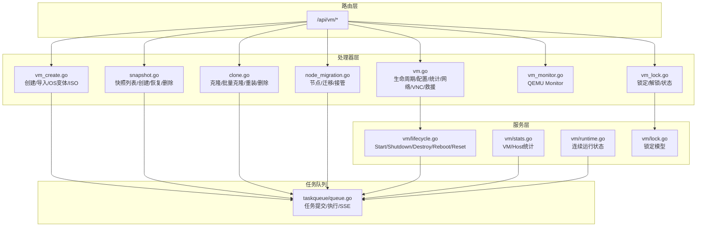
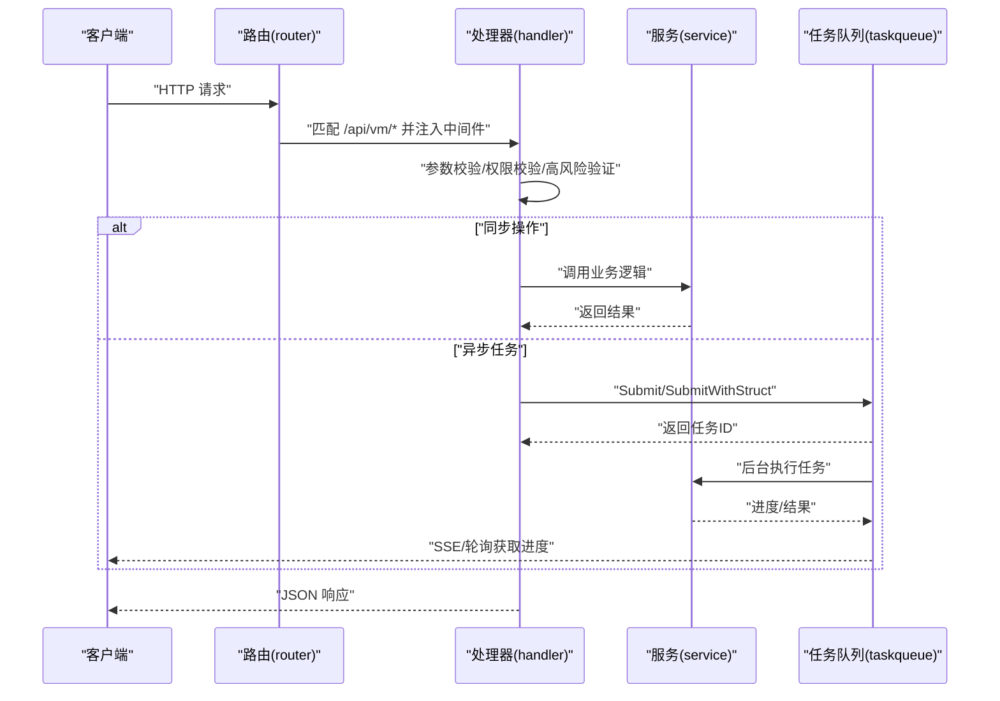
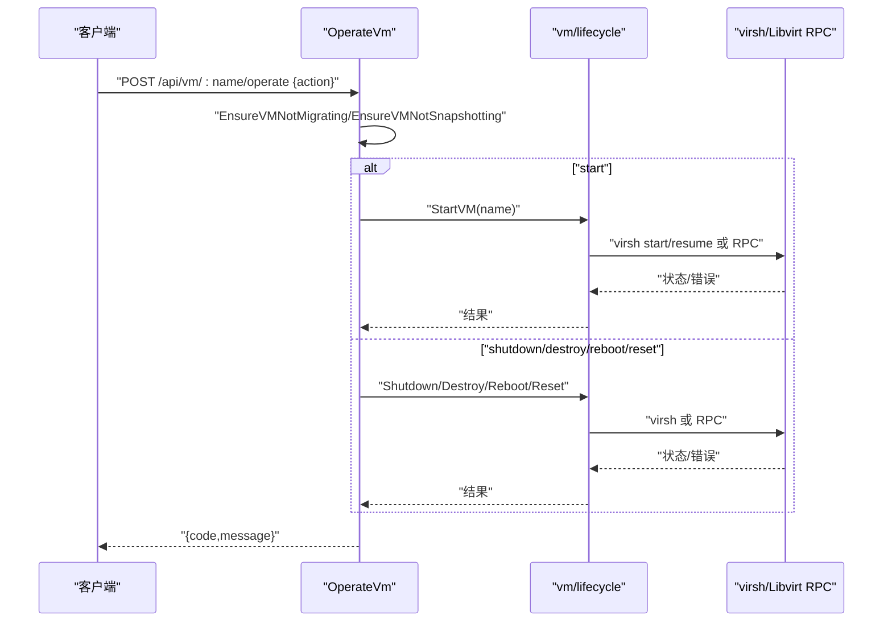
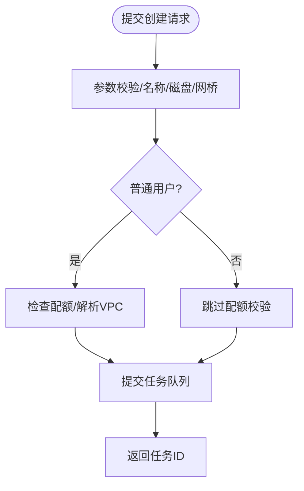
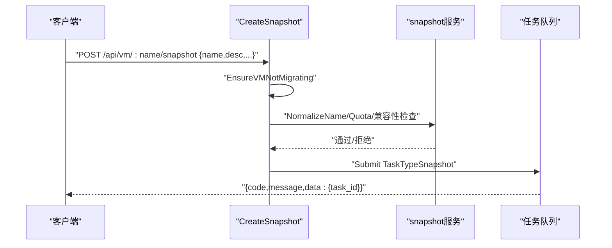
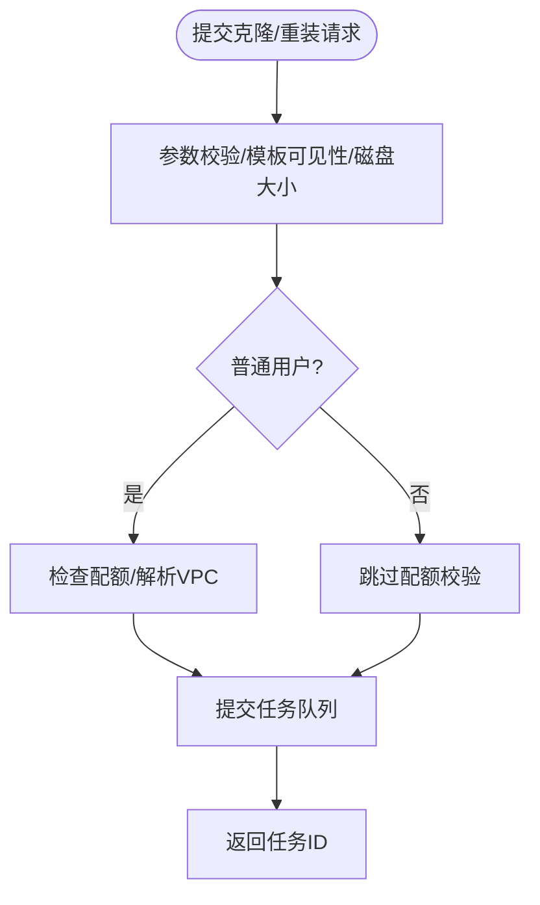
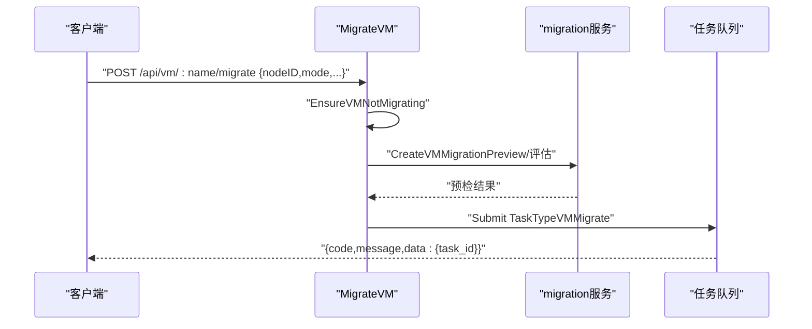
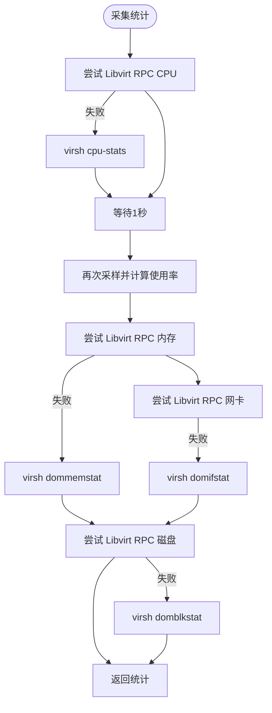
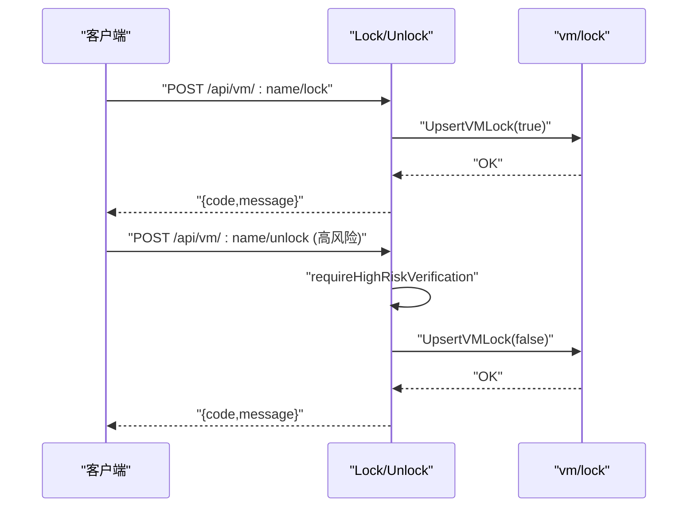
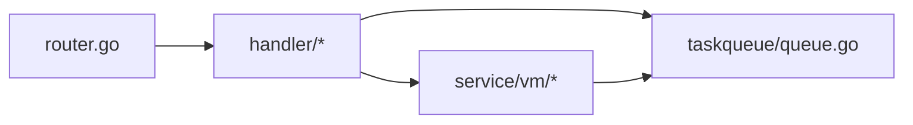

# 虚拟机管理API

<cite>
**本文档引用的文件**
- [server/router/router.go](file://server/router/router.go)
- [server/handler/types.go](file://server/handler/types.go)
- [server/handler/vm.go](file://server/handler/vm.go)
- [server/handler/vm_create.go](file://server/handler/vm_create.go)
- [server/handler/snapshot.go](file://server/handler/snapshot.go)
- [server/handler/clone.go](file://server/handler/clone.go)
- [server/handler/node_migration.go](file://server/handler/node_migration.go)
- [server/handler/vm_monitor.go](file://server/handler/vm_monitor.go)
- [server/handler/vm_lock.go](file://server/handler/vm_lock.go)
- [server/service/vm/lifecycle.go](file://server/service/vm/lifecycle.go)
- [server/service/vm/stats.go](file://server/service/vm/stats.go)
- [server/service/vm/runtime.go](file://server/service/vm/runtime.go)
- [server/service/vm/lock.go](file://server/service/vm/lock.go)
- [server/taskqueue/queue.go](file://server/taskqueue/queue.go)
- [server/middleware/auth.go](file://server/middleware/auth.go)
</cite>

## 目录
1. [简介](#简介)
2. [项目结构](#项目结构)
3. [核心组件](#核心组件)
4. [架构总览](#架构总览)
5. [详细组件分析](#详细组件分析)
6. [依赖分析](#依赖分析)
7. [性能考虑](#性能考虑)
8. [故障排查指南](#故障排查指南)
9. [结论](#结论)
10. [附录](#附录)

## 简介
本文件为 Open 虚拟机管理控制台的虚拟机管理API接口文档，覆盖虚拟机生命周期管理（创建、启动、停止、重启、重置、删除）、配置管理、监控统计、快照管理、克隆与重装、迁移、锁定与并发控制等能力。文档提供每个接口的HTTP方法、URL路径、请求参数、响应格式与错误码说明，并解释状态管理与并发控制机制，最后给出完整工作流程与最佳实践建议。

## 项目结构
虚拟机相关API集中在路由层的 /api/vm 组下，按功能划分为：
- 生命周期与配置：/list、/:name、/:name/operate、/:name/xml、/:name/stats、/:name/schedules、/:name/network、/:name/vnc、/:name/monitor
- 创建与导入：/create、/import-disk、/os-variants、/iso-list
- 克隆与重装：/clone、/linked-clone、/batch-clone、/:name/reinstall
- 快照：/:name/snapshots、/:name/snapshot、/:name/snapshot/:snap/revert、/:name/snapshot/:snap/delete
- 迁移：/:name/migration/preview、/:name/migrate、/nodes、/migration/adopt-vm
- 磁盘与网络：/:name/disks、/:name/disk、/:name/cdrom、/:name/interfaces
- 锁定与共享：/:name/lock、/:name/unlock、/:name/shares
- 救援与密码：/:name/rescue、/:name/password/reset

**图示来源**
- [server/router/router.go:107-211](file://server/router/router.go#L107-L211)
- [server/handler/vm.go:81-352](file://server/handler/vm.go#L81-L352)
- [server/handler/vm_create.go:66-218](file://server/handler/vm_create.go#L66-L218)
- [server/handler/snapshot.go:34-161](file://server/handler/snapshot.go#L34-L161)
- [server/handler/clone.go:120-297](file://server/handler/clone.go#L120-L297)
- [server/handler/node_migration.go:102-135](file://server/handler/node_migration.go#L102-L135)
- [server/handler/vm_monitor.go:16-77](file://server/handler/vm_monitor.go#L16-L77)
- [server/handler/vm_lock.go:11-89](file://server/handler/vm_lock.go#L11-L89)
- [server/service/vm/lifecycle.go:17-282](file://server/service/vm/lifecycle.go#L17-L282)
- [server/service/vm/stats.go:18-333](file://server/service/vm/stats.go#L18-L333)
- [server/service/vm/runtime.go:34-236](file://server/service/vm/runtime.go#L34-L236)
- [server/service/vm/lock.go:7-26](file://server/service/vm/lock.go#L7-L26)
- [server/taskqueue/queue.go:183-354](file://server/taskqueue/queue.go#L183-L354)

**章节来源**
- [server/router/router.go:107-211](file://server/router/router.go#L107-L211)

## 核心组件
- 路由与鉴权
  - 路由组 /api/vm 下的所有接口均受认证中间件保护，非管理员用户操作VM时受VM访问权限中间件约束。
  - 高风险操作（删除、强制删除、迁移、高危变更）需二次高风险验证。
- 处理器层
  - vm.go：虚拟机列表、详情、PCIe信息、XML、IP、操作（启动/关机/重启/重置/销毁）、编辑配置、统计、计划任务、网络诊断、VPC绑定、硬件直通、锁定/解锁、救援、密码重置等。
  - vm_create.go：普通创建、导入磁盘创建、OS变体、ISO列表。
  - snapshot.go：快照列表、创建、恢复、删除、批量删除。
  - clone.go：克隆、批量克隆、重装系统、删除/强制删除、查询qcow2磁盘。
  - node_migration.go：节点管理、迁移预检、发起迁移、接管迁移。
  - vm_monitor.go：QEMU Monitor状态与命令执行。
  - vm_lock.go：锁定/解锁/状态查询。
- 服务层
  - vm/lifecycle.go：虚拟机生命周期操作（启动/关机/强制断电/重启/重置）与状态修复。
  - vm/stats.go：虚拟机与宿主机统计采集。
  - vm/runtime.go：虚拟机连续运行状态缓存与统计。
  - vm/lock.go：虚拟机锁定模型。
- 任务队列
  - taskqueue/queue.go：任务提交、执行、SSE推送、取消、清理。

**章节来源**
- [server/router/router.go:107-211](file://server/router/router.go#L107-L211)
- [server/middleware/auth.go:280-324](file://server/middleware/auth.go#L280-L324)
- [server/handler/vm.go:81-352](file://server/handler/vm.go#L81-L352)
- [server/handler/vm_create.go:66-218](file://server/handler/vm_create.go#L66-L218)
- [server/handler/snapshot.go:34-161](file://server/handler/snapshot.go#L34-L161)
- [server/handler/clone.go:120-297](file://server/handler/clone.go#L120-L297)
- [server/handler/node_migration.go:102-135](file://server/handler/node_migration.go#L102-L135)
- [server/handler/vm_monitor.go:16-77](file://server/handler/vm_monitor.go#L16-L77)
- [server/handler/vm_lock.go:11-89](file://server/handler/vm_lock.go#L11-L89)
- [server/service/vm/lifecycle.go:17-282](file://server/service/vm/lifecycle.go#L17-L282)
- [server/service/vm/stats.go:18-333](file://server/service/vm/stats.go#L18-L333)
- [server/service/vm/runtime.go:34-236](file://server/service/vm/runtime.go#L34-L236)
- [server/service/vm/lock.go:7-26](file://server/service/vm/lock.go#L7-L26)
- [server/taskqueue/queue.go:183-354](file://server/taskqueue/queue.go#L183-L354)

## 架构总览
虚拟机管理API采用“路由 -> 处理器 -> 服务/任务队列”的分层设计。处理器负责参数校验、权限校验与调用服务层或提交任务；服务层封装具体业务逻辑（如virsh/Libvirt RPC调用、统计采集、状态缓存）；任务队列负责异步任务的提交、执行、进度广播与取消。

**图示来源**
- [server/router/router.go:107-211](file://server/router/router.go#L107-L211)
- [server/handler/vm_create.go:66-218](file://server/handler/vm_create.go#L66-L218)
- [server/handler/snapshot.go:59-161](file://server/handler/snapshot.go#L59-L161)
- [server/handler/clone.go:120-297](file://server/handler/clone.go#L120-L297)
- [server/taskqueue/queue.go:183-354](file://server/taskqueue/queue.go#L183-L354)

## 详细组件分析

### 虚拟机生命周期管理
- 接口定义
  - GET /api/vm/list：获取虚拟机列表
  - GET /api/vm/:name：获取虚拟机详情
  - POST /api/vm/:name/operate：操作虚拟机（start/shutdown/destroy/reboot/reset）
  - PUT /api/vm/:name：编辑虚拟机配置
  - DELETE /api/vm/:name：删除虚拟机（高风险）
  - POST /api/vm/:name/force-delete：强制删除虚拟机（高风险）
- 请求与响应
  - 操作请求体包含 action（枚举：start/shutdown/destroy/reboot/reset）。
  - 成功返回 code=200 与消息；失败返回对应HTTP状态码与错误信息。
- 并发与状态
  - 操作前检查迁移/快照状态，避免并发冲突。
  - 关机/强制断电后异步触发带宽重新分配；开机后应用带宽策略。
- 错误码
  - 400 参数错误/不支持的操作
  - 403 配额不足/权限不足/锁定
  - 404 虚拟机不存在
  - 409 正在迁移/快照中
  - 500 内部错误

**图示来源**
- [server/handler/vm.go:214-352](file://server/handler/vm.go#L214-L352)
- [server/service/vm/lifecycle.go:17-282](file://server/service/vm/lifecycle.go#L17-L282)

**章节来源**
- [server/router/router.go:107-147](file://server/router/router.go#L107-L147)
- [server/handler/vm.go:214-352](file://server/handler/vm.go#L214-L352)
- [server/service/vm/lifecycle.go:17-282](file://server/service/vm/lifecycle.go#L17-L282)

### 虚拟机创建与导入
- 接口定义
  - POST /api/vm/create：普通创建（异步任务）
  - POST /api/vm/import-disk：管理员导入磁盘创建（异步任务）
  - GET /api/vm/os-variants：系统变体列表
  - GET /api/vm/iso-list：ISO列表
- 请求与响应
  - CreateVmRequest/ImportDiskByPathRequest 包含名称、CPU/内存、磁盘、网卡、引导、视频、CPU拓扑、内存动态、VPC/安全组、额外磁盘/IOPS、直通设备等。
  - 成功返回 code=200 与任务ID；失败返回对应HTTP状态码与错误信息。
- 配额与VPC
  - 普通用户创建前校验配额；可解析VPC交换机与安全组。
- 错误码
  - 400 参数错误/名称占用/磁盘大小非法
  - 403 配额不足/权限不足
  - 500 提交任务失败

**图示来源**
- [server/handler/vm_create.go:66-218](file://server/handler/vm_create.go#L66-L218)
- [server/handler/vm_create.go:297-398](file://server/handler/vm_create.go#L297-L398)

**章节来源**
- [server/router/router.go:154-158](file://server/router/router.go#L154-L158)
- [server/handler/vm_create.go:66-218](file://server/handler/vm_create.go#L66-L218)
- [server/handler/vm_create.go:297-398](file://server/handler/vm_create.go#L297-L398)

### 快照管理
- 接口定义
  - GET /api/vm/:name/snapshots：列出快照
  - POST /api/vm/:name/snapshot：创建快照（异步任务）
  - POST /api/vm/:name/snapshot/:snap/revert：恢复快照（异步任务）
  - DELETE /api/vm/:name/snapshot/:snap：删除快照（异步任务）
  - DELETE /api/vm/:name/snapshots：删除全部快照（异步任务）
- 请求与响应
  - CreateSnapshotRequest 支持名称、描述、是否包含内存、NVRAM修复策略等。
  - 成功返回 code=200 与任务ID；失败返回对应HTTP状态码与错误信息。
- 配额与兼容性
  - 创建内存快照前检查VirtFS与UEFI NVRAM兼容性。
- 错误码
  - 400 参数错误/名称非法
  - 403 配额不足
  - 409 内存快照不兼容/正在迁移
  - 500 提交任务失败

**图示来源**
- [server/handler/snapshot.go:59-161](file://server/handler/snapshot.go#L59-L161)

**章节来源**
- [server/router/router.go:166-172](file://server/router/router.go#L166-L172)
- [server/handler/snapshot.go:34-161](file://server/handler/snapshot.go#L34-L161)

### 克隆与重装
- 接口定义
  - POST /api/vm/clone：克隆（异步任务）
  - POST /api/vm/linked-clone：链式克隆（管理员）
  - POST /api/vm/batch-clone：批量克隆（异步任务）
  - POST /api/vm/:name/reinstall：重装系统（异步任务）
  - DELETE /api/vm/:name：删除虚拟机（高风险）
  - POST /api/vm/:name/force-delete：强制删除（高风险）
  - GET /api/vm/:name/qcow2-disks：查询qcow2磁盘
- 请求与响应
  - CloneVmRequest/BatchCloneRequest/ReinstallRequest 包含模板、CPU/内存/磁盘、引导、VPC/安全组、直通设备、内存动态等。
  - 成功返回 code=200 与任务ID；失败返回对应HTTP状态码与错误信息。
- 并发与配额
  - 批量克隆需乘以数量校验配额；重装前检查是否存在进行中的重装任务。
- 错误码
  - 400 参数错误/模板不可见/磁盘大小非法
  - 403 配额不足/权限不足
  - 409 正在迁移/重装任务冲突
  - 500 提交任务失败

**图示来源**
- [server/handler/clone.go:120-297](file://server/handler/clone.go#L120-L297)
- [server/handler/clone.go:442-554](file://server/handler/clone.go#L442-L554)

**章节来源**
- [server/router/router.go:160-164](file://server/router/router.go#L160-L164)
- [server/handler/clone.go:120-297](file://server/handler/clone.go#L120-L297)
- [server/handler/clone.go:442-554](file://server/handler/clone.go#L442-L554)

### 迁移与节点管理
- 接口定义
  - GET /api/nodes：节点列表
  - GET /api/nodes/:id/migration-options：迁移选项
  - POST /api/vm/:name/migration/preview：迁移预检
  - POST /api/vm/:name/migrate：发起迁移（异步任务）
  - POST /api/migration/adopt-vm：接管迁移
- 请求与响应
  - PreviewVMMigration/MigrateVM 接收目标节点、模式、存储池、网口/安全组映射、CPU节流等。
  - 成功返回 code=200 与任务信息；失败返回对应HTTP状态码与错误信息。
- 并发与状态
  - 迁移前检查虚拟机状态，避免并发迁移。
- 错误码
  - 400 参数无效/状态检查失败
  - 409 正在迁移
  - 500 提交任务失败

**图示来源**
- [server/handler/node_migration.go:73-135](file://server/handler/node_migration.go#L73-L135)

**章节来源**
- [server/router/router.go:364-380](file://server/router/router.go#L364-L380)
- [server/handler/node_migration.go:16-135](file://server/handler/node_migration.go#L16-L135)

### 监控统计与状态
- 接口定义
  - GET /api/vm/:name/stats：实时统计（CPU/内存/网络/磁盘）
  - GET /api/vm/:name/stats/history：历史统计
  - GET /api/vm/:name/monitor/status：QEMU Monitor状态
  - POST /api/vm/:name/monitor/command：执行QEMU Monitor命令
- 数据采集
  - 通过 virsh 与 Libvirt RPC 采集统计；支持降级与错误日志。
  - 连续运行时间基于内存缓存维护，支持重置与查询。
- 响应
  - 成功返回 code=200 与数据；失败返回对应HTTP状态码与错误信息。

**图示来源**
- [server/service/vm/stats.go:18-186](file://server/service/vm/stats.go#L18-L186)
- [server/service/vm/runtime.go:34-236](file://server/service/vm/runtime.go#L34-L236)

**章节来源**
- [server/router/router.go:121-122](file://server/router/router.go#L121-L122)
- [server/handler/vm_monitor.go:16-77](file://server/handler/vm_monitor.go#L16-L77)
- [server/service/vm/stats.go:18-186](file://server/service/vm/stats.go#L18-L186)
- [server/service/vm/runtime.go:34-236](file://server/service/vm/runtime.go#L34-L236)

### 虚拟机锁定与并发控制
- 接口定义
  - POST /api/vm/:name/lock：锁定虚拟机
  - POST /api/vm/:name/unlock：解锁虚拟机（高风险）
  - GET /api/vm/:name/lock：查询锁定状态
- 并发与安全
  - 操作前检查锁定状态；删除/强制删除前检查锁定。
  - 高风险操作需二次验证。
- 响应
  - 成功返回 code=200 与消息；失败返回对应HTTP状态码与错误信息。

**图示来源**
- [server/handler/vm_lock.go:11-89](file://server/handler/vm_lock.go#L11-L89)
- [server/service/vm/lock.go:7-26](file://server/service/vm/lock.go#L7-L26)

**章节来源**
- [server/router/router.go:144-147](file://server/router/router.go#L144-L147)
- [server/handler/vm_lock.go:11-89](file://server/handler/vm_lock.go#L11-L89)
- [server/service/vm/lock.go:7-26](file://server/service/vm/lock.go#L7-L26)

## 依赖分析
- 路由到处理器
  - /api/vm/* 路由统一注入认证、VM访问权限、弹性云限制等中间件。
- 处理器到服务/任务队列
  - 创建/克隆/快照/迁移等异步操作通过任务队列提交；生命周期操作直接调用服务层。
- 任务队列
  - 统一的任务注册、执行、SSE广播、取消与清理机制。

**图示来源**
- [server/router/router.go:107-211](file://server/router/router.go#L107-L211)
- [server/handler/vm.go:81-352](file://server/handler/vm.go#L81-L352)
- [server/taskqueue/queue.go:183-354](file://server/taskqueue/queue.go#L183-L354)

**章节来源**
- [server/router/router.go:107-211](file://server/router/router.go#L107-L211)
- [server/taskqueue/queue.go:183-354](file://server/taskqueue/queue.go#L183-L354)

## 性能考虑
- 统计采集
  - 采用两次采样计算CPU使用率，避免瞬时波动；优先使用Libvirt RPC，失败时降级为virsh。
- 带宽与网络
  - 开机/关机/强制断电后异步触发带宽重新分配，减少阻塞。
- 任务队列
  - 多消费者并发执行任务；SSE广播进度，避免轮询压力。
- 连续运行时间
  - 内存缓存记录运行起始时间，降低频繁查询成本。

[本节为通用指导，无需特定文件引用]

## 故障排查指南
- 常见错误与定位
  - 400 参数错误：检查请求体字段与必填项。
  - 403 权限/配额：确认角色、配额与VPC解析。
  - 404 虚拟机不存在：确认名称与存在性。
  - 409 正在迁移/快照：等待当前操作完成或解除冲突。
  - 500 任务/内部错误：查看任务队列SSE或日志。
- QEMU内部错误暂停
  - 若虚拟机处于内部错误暂停，需重置或强制断电后重启。
- 带宽与网络
  - 开机后带宽未生效：检查用户配额与轻量云策略。
- 锁定状态
  - 删除/强制删除被拒绝：先解锁再操作。

**章节来源**
- [server/service/vm/lifecycle.go:161-184](file://server/service/vm/lifecycle.go#L161-L184)
- [server/handler/vm.go:295-304](file://server/handler/vm.go#L295-L304)

## 结论
本文档梳理了Open虚拟机管理控制台的虚拟机管理API，覆盖生命周期、配置、监控、快照、克隆、迁移、锁定与并发控制等核心能力。通过异步任务队列与严格的中间件校验，系统在保证安全性的同时提供了良好的扩展性与可观测性。建议在生产环境中结合SSE与任务队列进行状态追踪，并遵循配额与VPC解析的最佳实践。

[本节为总结，无需特定文件引用]

## 附录

### 接口清单与规范
- 路由组 /api/vm
  - GET /list：虚拟机列表
  - GET /:name：虚拟机详情
  - GET /:name/xml：虚拟机XML（管理员）
  - GET /:name/ip：虚拟机IP
  - GET /:name/pcie-info：PCIe热插槽信息
  - POST /:name/operate：操作（start/shutdown/destroy/reboot/reset）
  - PUT /:name：编辑配置
  - PUT /:name/xml：更新XML（管理员）
  - GET /:name/stats：实时统计
  - GET /:name/stats/history：历史统计
  - GET /:name/schedules：计划任务
  - POST /:name/schedules：创建计划任务
  - PUT /:name/schedules/:id：更新计划任务
  - DELETE /:name/schedules/:id：删除计划任务
  - GET /:name/network/status：网络运行状态
  - GET /:name/network/diagnostics：网络诊断（管理员）
  - POST /:name/network/capture：网络抓包（管理员）
  - GET /:name/vpc：VPC绑定
  - PUT /:name/vpc：绑定VPC
  - POST /:name/migration/preview：迁移预检（管理员）
  - POST /:name/migrate：迁移（管理员）
  - PUT /:name/security-group：切换安全组
  - GET /:name/interfaces：多网口管理
  - POST /:name/interfaces：添加网口
  - PUT /:name/interfaces/:order：更新网口
  - DELETE /:name/interfaces/:order：删除网口
  - DELETE /:name：删除（高风险）
  - POST /:name/force-delete：强制删除（管理员）
  - GET /:name/qcow2-disks：查询qcow2磁盘
  - POST /:name/lock：锁定
  - POST /:name/unlock：解锁（高风险）
  - GET /:name/lock：锁定状态
  - GET /:name/passthrough：硬件直通
  - POST /:name/passthrough：附加直通设备（管理员）
  - DELETE /:name/passthrough：移除直通设备（管理员）
  - POST /create：创建（高风险）
  - POST /import-disk：导入磁盘创建（管理员）
  - GET /os-variants：系统变体
  - GET /iso-list：ISO列表
  - POST /clone：克隆（高风险）
  - POST /linked-clone：链式克隆（管理员）
  - POST /batch-clone：批量克隆（高风险）
  - POST /:name/reinstall：重装系统（高风险）
  - GET /:name/snapshots：快照列表
  - DELETE /:name/snapshots：删除全部快照（高风险）
  - POST /:name/snapshot：创建快照（高风险）
  - POST /:name/snapshot/:snap/revert：恢复快照（高风险）
  - DELETE /:name/snapshot/:snap：删除快照（高风险）
  - GET /:name/vnc/status：VNC状态
  - POST /:name/vnc/enable：启用VNC
  - POST /:name/vnc/disable：禁用VNC
  - POST /:name/vnc/passwd：修改VNC密码
  - POST /:name/vnc/expose：暴露VNC
  - GET /:name/vnc/ws：VNC WebSocket
  - GET /:name/monitor/status：QEMU Monitor状态
  - POST /:name/monitor/command：执行QEMU Monitor命令
  - GET /:name/disks：磁盘列表
  - GET /:name/disk-migration/options：磁盘迁移选项（管理员）
  - POST /:name/disk：新增磁盘
  - POST /:name/disk/:dev/resize：扩容磁盘
  - PUT /:name/disk/:dev/bus：变更磁盘总线
  - POST /:name/disk/attach：附加磁盘
  - POST /:name/disk/import：导入磁盘（管理员）
  - POST /:name/disk/:dev/migrate：迁移磁盘（管理员）
  - DELETE /:name/disk/:dev：删除磁盘
  - GET /:name/disk/:dev/iops：查询磁盘IOPS
  - PUT /:name/disk/:dev/iops：设置磁盘IOPS（管理员）
  - POST /:name/cdrom：挂载CD/DVD
  - POST /:name/cdrom/eject：弹出CD/DVD
  - DELETE /:name/cdrom：移除CD/DVD
  - POST /:name/rescue：救援系统
  - POST /:name/password/reset：重置Linux密码
  - GET /:name/shares：共享目录
  - POST /:name/share：添加共享
  - DELETE /:name/share/:tag：删除共享

**章节来源**
- [server/router/router.go:107-211](file://server/router/router.go#L107-L211)

### 请求与响应规范
- 通用响应
  - 成功：code=200，message="ok"，data为具体数据
  - 失败：返回对应HTTP状态码与错误信息
- 请求体类型
  - VmOperateRequest：action（start/shutdown/destroy/reboot/reset）
  - CreateVmRequest/ImportDiskByPathRequest：创建/导入相关字段
  - CreateSnapshotRequest：name/description/include_memory/auto_fix_nvram/pause_for_memory_snapshot
  - CloneVmRequest/BatchCloneRequest/ReinstallRequest：克隆/批量克隆/重装相关字段
  - VMMonitorCommandRequest：command

**章节来源**
- [server/handler/types.go:9-59](file://server/handler/types.go#L9-L59)
- [server/handler/vm_create.go:16-64](file://server/handler/vm_create.go#L16-L64)
- [server/handler/snapshot.go:14-32](file://server/handler/snapshot.go#L14-L32)
- [server/handler/clone.go:29-118](file://server/handler/clone.go#L29-L118)
- [server/handler/vm_monitor.go:11-14](file://server/handler/vm_monitor.go#L11-L14)

### 并发控制与最佳实践
- 并发控制
  - 操作前检查迁移/快照状态，避免并发冲突。
  - 高风险操作需二次验证；删除/强制删除前检查锁定。
- 最佳实践
  - 创建/克隆/快照/迁移等操作使用异步任务，结合SSE获取进度。
  - 合理设置带宽与IOPS限制，避免资源争用。
  - 使用VPC与安全组隔离网络，定期清理过期任务。

**章节来源**
- [server/handler/vm.go:233-242](file://server/handler/vm.go#L233-L242)
- [server/handler/clone.go:505-511](file://server/handler/clone.go#L505-L511)
- [server/handler/vm_lock.go:57-63](file://server/handler/vm_lock.go#L57-L63)
- [server/taskqueue/queue.go:183-354](file://server/taskqueue/queue.go#L183-L354)