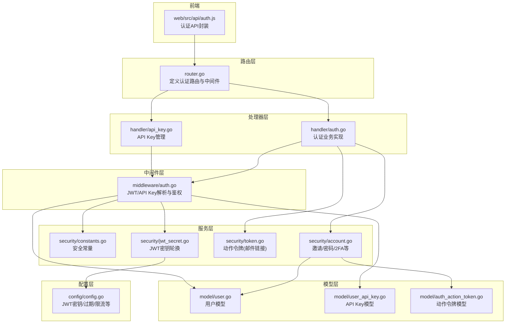
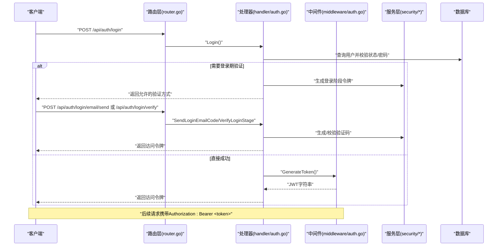
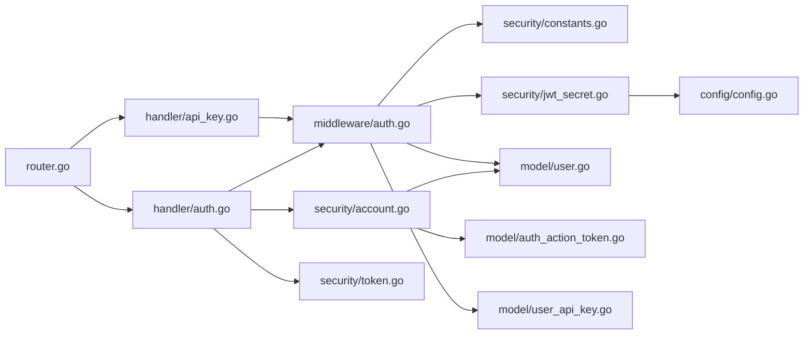
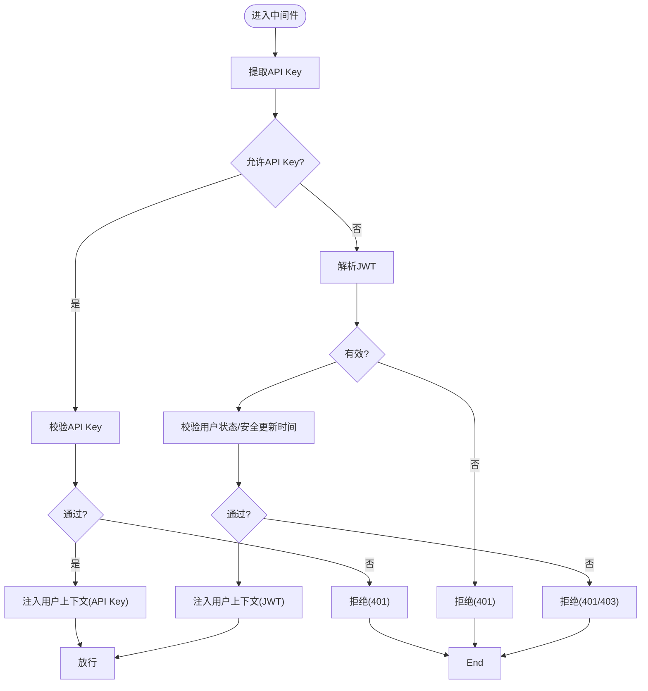

# 认证API

<cite>
**本文引用的文件**
- [server/router/router.go](file://server/router/router.go)
- [server/handler/auth.go](file://server/handler/auth.go)
- [server/middleware/auth.go](file://server/middleware/auth.go)
- [server/service/security/jwt_secret.go](file://server/service/security/jwt_secret.go)
- [server/service/security/constants.go](file://server/service/security/constants.go)
- [server/service/security/token.go](file://server/service/security/token.go)
- [server/service/security/account.go](file://server/service/security/account.go)
- [server/model/user.go](file://server/model/user.go)
- [server/model/user_api_key.go](file://server/model/user_api_key.go)
- [server/model/auth_action_token.go](file://server/model/auth_action_token.go)
- [server/config/config.go](file://server/config/config.go)
- [web/src/api/auth.js](file://web/src/api/auth.js)
</cite>

## 目录
1. [简介](#简介)
2. [项目结构](#项目结构)
3. [核心组件](#核心组件)
4. [架构总览](#架构总览)
5. [详细组件分析](#详细组件分析)
6. [依赖关系分析](#依赖关系分析)
7. [性能考量](#性能考量)
8. [故障排查指南](#故障排查指南)
9. [结论](#结论)
10. [附录](#附录)

## 简介
本文件面向Open虚拟机管理控制台的认证体系，系统性梳理并规范认证API接口，覆盖JWT令牌认证、API密钥认证与会话管理。内容包括：
- 登录、登出、令牌刷新、密码重置等核心接口的HTTP方法、URL路径、请求参数、响应格式与错误码说明
- 认证中间件的工作原理与安全边界
- 前端认证客户端使用示例与最佳实践
- 认证失败处理与安全防护策略

## 项目结构
认证相关代码主要分布在以下模块：
- 路由层：定义认证接口的路由与中间件绑定
- 处理器层：实现具体认证业务逻辑
- 中间件层：统一处理JWT解析、API Key提取与鉴权
- 服务层：封装安全常量、令牌生成与轮换、邮件验证码、TOTP等
- 模型层：用户、API Key、动作令牌等数据结构
- 配置层：JWT密钥、过期时间、限流等全局配置
- 前端：认证API调用封装

图表来源
- [server/router/router.go:18-101](file://server/router/router.go#L18-L101)
- [server/handler/auth.go:101-800](file://server/handler/auth.go#L101-L800)
- [server/middleware/auth.go:75-199](file://server/middleware/auth.go#L75-L199)
- [server/service/security/jwt_secret.go:32-55](file://server/service/security/jwt_secret.go#L32-L55)
- [server/service/security/constants.go:5-45](file://server/service/security/constants.go#L5-L45)
- [server/service/security/token.go:14-88](file://server/service/security/token.go#L14-L88)
- [server/service/security/account.go:140-226](file://server/service/security/account.go#L140-L226)
- [server/model/user.go:9-56](file://server/model/user.go#L9-L56)
- [server/model/user_api_key.go:9-27](file://server/model/user_api_key.go#L9-L27)
- [server/model/auth_action_token.go:5-21](file://server/model/auth_action_token.go#L5-L21)
- [server/config/config.go:154-200](file://server/config/config.go#L154-L200)
- [web/src/api/auth.js:7-180](file://web/src/api/auth.js#L7-L180)

章节来源
- [server/router/router.go:18-101](file://server/router/router.go#L18-L101)

## 核心组件
- JWT令牌与中间件
  - Claims结构体承载用户标识、角色、令牌类型与签发/过期时间
  - 支持生成不同类型的令牌（访问、引导、登录、高风险）
  - 中间件负责解析、校验、注入用户上下文，并按令牌类型与权限进行拦截
- API密钥认证
  - 支持通过请求头或查询参数携带API Key进行认证
  - 与JWT互斥，部分接口仅允许JWT
- 安全常量与令牌
  - 定义令牌类型、挑战方式、动作令牌用途与有效期
  - 动作令牌用于邮件链接（邀请注册、密码重置）
- 用户与API Key模型
  - 用户模型包含安全字段（TOTP、邮箱验证、登录验证窗口等）
  - API Key模型用于外部系统调用
- 配置
  - JWT密钥、过期时间、限流阈值、SMTP等

章节来源
- [server/middleware/auth.go:17-73](file://server/middleware/auth.go#L17-L73)
- [server/middleware/auth.go:27-56](file://server/middleware/auth.go#L27-L56)
- [server/middleware/auth.go:75-199](file://server/middleware/auth.go#L75-L199)
- [server/service/security/constants.go:5-45](file://server/service/security/constants.go#L5-L45)
- [server/service/security/token.go:14-88](file://server/service/security/token.go#L14-L88)
- [server/model/user.go:9-56](file://server/model/user.go#L9-L56)
- [server/model/user_api_key.go:9-27](file://server/model/user_api_key.go#L9-L27)
- [server/config/config.go:154-200](file://server/config/config.go#L154-L200)

## 架构总览
认证流程概览（以登录为例）：
- 客户端向登录接口提交用户名/密码
- 服务端校验用户状态与密码
- 若需要二次验证，则发放“登录”阶段令牌，返回允许的验证方式
- 客户端完成邮箱/TOTP/恢复码验证后，换取“访问”令牌
- 后续请求携带JWT或API Key，中间件解析并注入用户上下文

图表来源
- [server/router/router.go:42-60](file://server/router/router.go#L42-L60)
- [server/handler/auth.go:101-202](file://server/handler/auth.go#L101-L202)
- [server/middleware/auth.go:27-56](file://server/middleware/auth.go#L27-L56)

## 详细组件分析

### 认证接口总览
- 无需登录即可访问的认证接口
  - POST /api/auth/login 登录
  - GET /api/auth/invite 获取邀请详情
  - POST /api/auth/invite/complete 完成邀请注册
  - POST /api/auth/password/forgot 发送找回密码邮件
  - POST /api/auth/password/forgot/send-code 发送验证码
  - POST /api/auth/password/forgot/verify-code 验证验证码
  - POST /api/auth/password/forgot/select-account 选择账号
  - POST /api/auth/password/reset 通过邮件令牌重置密码
- 登录阶段验证（需携带登录阶段令牌）
  - POST /api/auth/login/email/send 发送登录邮箱验证码
  - POST /api/auth/login/verify 完成登录阶段验证
- 安全初始化与安全设置（需携带访问或引导令牌）
  - POST /api/auth/email/code/send 发送邮箱绑定验证码
  - POST /api/auth/email/bind 绑定/更新邮箱
  - POST /api/auth/2fa/setup 生成2FA配置
  - POST /api/auth/2fa/enable 启用2FA
  - POST /api/auth/2fa/disable 关闭2FA
  - POST /api/auth/2fa/recovery/regen 重新生成恢复码
  - POST /api/auth/skip-bootstrap 管理员跳过安全初始化
- 高风险验证（需JWT访问令牌）
  - GET /api/auth/info 获取当前用户信息
  - GET /api/auth/api-key 获取API Key元信息
  - POST /api/auth/api-key 生成/重新生成API Key
  - DELETE /api/auth/api-key 撤销API Key
  - PUT /api/auth/password 修改密码
  - PUT /api/auth/username 修改用户名
  - POST /api/auth/high-risk/verify 高风险验证

章节来源
- [server/router/router.go:42-86](file://server/router/router.go#L42-L86)

### 登录接口 Login
- 方法与路径
  - POST /api/auth/login
- 请求参数
  - username: string，必填
  - password: string，必填
- 成功响应
  - code: 200
  - message: "登录成功"
  - data.stage: "success"
  - data.token: string，访问令牌
  - data.username: string
  - data.role: string
  - data.cloud_type: string
  - data.security: object，安全状态
- 阶段式响应（若需要登录期验证）
  - data.stage: "login_verify"
  - data.token: string，登录阶段令牌（有效期约15分钟）
  - data.allowed_methods: string[]，允许的验证方式（email/totp/recovery）
- 错误码
  - 400: 参数错误
  - 401: 用户名或密码错误
  - 403: 账户状态异常（待邀请/禁用）
  - 500: 生成令牌失败

章节来源
- [server/handler/auth.go:101-202](file://server/handler/auth.go#L101-L202)

### 登录邮箱验证码发送接口 SendLoginEmailCode
- 方法与路径
  - POST /api/auth/login/email/send
- 请求参数
  - 通过请求头携带登录阶段令牌：Authorization: Bearer <token>
- 成功响应
  - code: 200
  - message: "验证码已发送"
  - data.challenge_id: uint，验证码挑战ID
  - data.masked_email: string，掩码后的邮箱
  - data.expires_in: int，过期秒数
- 错误码
  - 400: 邮箱未绑定或未配置SMTP
  - 500: 发送失败

章节来源
- [server/handler/auth.go:319-350](file://server/handler/auth.go#L319-L350)

### 登录阶段验证接口 VerifyLoginStage
- 方法与路径
  - POST /api/auth/login/verify
- 请求参数
  - method: string，验证方式（totp/email/recovery）
  - code: string，验证码/一次性代码
  - challenge_id: uint，当method=email时必填
- 成功响应
  - code: 200
  - message: "登录验证成功"
  - data.stage: "success"
  - data.token: string，访问令牌
  - data.security: object，安全状态
- 错误码
  - 400: 验证失败/不支持的方式
  - 403: 管理员仅支持TOTP验证
  - 500: 刷新登录验证状态/生成访问令牌失败

章节来源
- [server/handler/auth.go:352-429](file://server/handler/auth.go#L352-L429)

### 邮箱绑定验证码发送接口 SendEmailCode
- 方法与路径
  - POST /api/auth/email/code/send
- 请求参数
  - email: string，可选，为空则使用当前用户邮箱
  - 通过请求头携带访问或引导令牌
- 成功响应
  - code: 200
  - message: "验证码已发送"
  - data.challenge_id: uint
  - data.masked_email: string
  - data.expires_in: int
- 错误码
  - 400: SMTP未配置
  - 500: 发送失败

章节来源
- [server/handler/auth.go:431-467](file://server/handler/auth.go#L431-L467)

### 邮箱绑定接口 BindEmail
- 方法与路径
  - POST /api/auth/email/bind
- 请求参数
  - email: string，必填
  - code: string，必填
  - challenge_id: uint，必填
- 成功响应
  - code: 200
  - message: "邮箱绑定成功"
  - data.security: object，安全状态
  - 若处于引导阶段且满足条件，返回data.stage="success"与访问令牌
- 错误码
  - 400: 验证码错误/邮箱不匹配
  - 500: 绑定失败

章节来源
- [server/handler/auth.go:469-528](file://server/handler/auth.go#L469-L528)

### 2FA配置生成接口 SetupTOTP
- 方法与路径
  - POST /api/auth/2fa/setup
- 请求参数
  - 通过请求头携带访问或引导令牌
- 成功响应
  - code: 200
  - data: 包含二维码/密钥等2FA配置信息
- 错误码
  - 500: 生成失败

章节来源
- [server/handler/auth.go:530-539](file://server/handler/auth.go#L530-L539)

### 2FA启用接口 EnableTOTP
- 方法与路径
  - POST /api/auth/2fa/enable
- 请求参数
  - secret: string，TOTP密钥
  - code: string，一次性验证码
- 成功响应
  - code: 200
  - data.security: object
  - data.recovery: object，恢复码明文（仅此一次）
- 错误码
  - 400: 验证码错误
  - 500: 启用失败

章节来源
- [server/handler/auth.go:541-593](file://server/handler/auth.go#L541-L593)

### 2FA关闭接口 DisableTOTP
- 方法与路径
  - POST /api/auth/2fa/disable
- 请求参数
  - password: string，必填
  - code: string，必填
- 成功响应
  - code: 200
  - data.security: object
- 错误码
  - 400: 密码或验证码错误
  - 500: 关闭失败

章节来源
- [server/handler/auth.go:628-659](file://server/handler/auth.go#L628-L659)

### 2FA恢复码重新生成接口 RegenRecoveryCodes
- 方法与路径
  - POST /api/auth/2fa/recovery/regen
- 请求参数
  - password: string，必填
  - code: string，必填
- 成功响应
  - code: 200
  - data.recovery: object，新恢复码明文
- 错误码
  - 400: 密码或验证码错误
  - 500: 重新生成失败

章节来源
- [server/handler/auth.go:595-626](file://server/handler/auth.go#L595-L626)

### 邀请详情接口 GetInviteInfo
- 方法与路径
  - GET /api/auth/invite
- 查询参数
  - token: string，必填
- 成功响应
  - code: 200
  - data: 邀请详情对象
- 错误码
  - 400: 邀请令牌为空/无效

章节来源
- [server/handler/auth.go:740-753](file://server/handler/auth.go#L740-L753)

### 邀请完成注册接口 CompleteInvite
- 方法与路径
  - POST /api/auth/invite/complete
- 请求参数
  - token: string，必填
  - password: string，必填
  - confirm_password: string，必填
- 成功响应
  - code: 200
  - data.stage: "success"
  - data.token: string，访问令牌
  - data.username: string
  - data.role: string
  - data.cloud_type: string
  - data.security: object
- 错误码
  - 400: 参数错误/密码不一致/注册失败

章节来源
- [server/handler/auth.go:755-789](file://server/handler/auth.go#L755-L789)

### 密码找回相关接口
- 发送找回密码邮件
  - POST /api/auth/password/forgot
  - 请求参数: email
  - 成功: 200 + 邮件发送提示
- 发送验证码
  - POST /api/auth/password/forgot/send-code
  - 请求参数: email
  - 成功: 返回验证码挑战ID与过期时间
- 验证验证码
  - POST /api/auth/password/forgot/verify-code
  - 请求参数: email, code, challenge_id
  - 成功: 返回选择账号的令牌
- 选择账号
  - POST /api/auth/password/forgot/select-account
  - 请求参数: selection_token, username
  - 成功: 返回重置令牌
- 通过邮件令牌重置密码
  - POST /api/auth/password/reset
  - 请求参数: token, password, confirm_password
  - 成功: 200 + 重置成功

章节来源
- [server/handler/auth.go:791-800](file://server/handler/auth.go#L791-L800)
- [server/handler/auth.go:801-870](file://server/handler/auth.go#L801-L870)
- [server/handler/auth.go:871-997](file://server/handler/auth.go#L871-L997)

### 高风险验证接口 VerifyHighRisk
- 方法与路径
  - POST /api/auth/high-risk/verify
- 请求参数
  - method: string，验证方式（totp/email/recovery）
  - code: string，验证码/一次性代码
  - challenge_id: uint，当method=email时必填
  - operation: string，操作名称（用于生成高风险令牌）
- 成功响应
  - code: 200
  - data.verification_token: string，高风险令牌（短期）
  - data.trusted_until: string，信任窗口截止时间
- 错误码
  - 400: 验证失败/不支持的方式
  - 500: 写入信任状态失败

章节来源
- [server/handler/auth.go:661-738](file://server/handler/auth.go#L661-L738)

### 用户信息接口 GetUserInfo
- 方法与路径
  - GET /api/auth/info
- 请求参数
  - 通过JWT访问令牌
- 成功响应
  - code: 200
  - data.id: uint
  - data.username: string
  - data.role: string
  - data.cloud_type: string
  - data.security: object

章节来源
- [server/handler/auth.go:204-219](file://server/handler/auth.go#L204-L219)

### API Key管理接口
- 获取API Key元信息
  - GET /api/auth/api-key
- 生成/重新生成API Key
  - POST /api/auth/api-key
- 撤销API Key
  - DELETE /api/auth/api-key
- 以上接口均需高风险验证（见高风险验证）

章节来源
- [server/handler/api_key.go:11-48](file://server/handler/api_key.go#L11-L48)

### 修改密码/用户名接口
- 修改密码
  - PUT /api/auth/password
- 修改用户名
  - PUT /api/auth/username
- 均需高风险验证

章节来源
- [server/handler/auth.go:221-317](file://server/handler/auth.go#L221-L317)

## 依赖关系分析
- 路由与中间件
  - 认证路由组绑定不同中间件：AuthMiddleware、JWTTokenTypeMiddleware、TokenTypeMiddleware
  - 登录阶段与安全初始化接口使用特定令牌类型
- 中间件与服务
  - 中间件解析JWT并注入用户上下文；同时支持API Key认证
  - 服务层提供令牌生成、轮换、验证码、TOTP、动作令牌等能力
- 模型与配置
  - 用户模型包含安全字段；API Key模型用于外部调用
  - 配置决定JWT密钥、过期时间、限流策略等

图表来源
- [server/router/router.go:42-86](file://server/router/router.go#L42-L86)
- [server/handler/auth.go:101-997](file://server/handler/auth.go#L101-L997)
- [server/handler/api_key.go:11-48](file://server/handler/api_key.go#L11-L48)
- [server/middleware/auth.go:75-199](file://server/middleware/auth.go#L75-L199)
- [server/service/security/constants.go:5-45](file://server/service/security/constants.go#L5-L45)
- [server/service/security/jwt_secret.go:32-55](file://server/service/security/jwt_secret.go#L32-L55)
- [server/service/security/account.go:140-226](file://server/service/security/account.go#L140-L226)
- [server/service/security/token.go:14-88](file://server/service/security/token.go#L14-L88)
- [server/model/user.go:9-56](file://server/model/user.go#L9-L56)
- [server/model/user_api_key.go:9-27](file://server/model/user_api_key.go#L9-L27)
- [server/model/auth_action_token.go:5-21](file://server/model/auth_action_token.go#L5-L21)
- [server/config/config.go:154-200](file://server/config/config.go#L154-L200)

## 性能考量
- 令牌过期与轮换
  - 访问令牌默认过期时间由配置决定；JWT密钥可定时轮换，轮换后旧令牌立即失效
- 限流策略
  - 公开接口与认证接口分别配置限流阈值，降低暴力破解与滥用风险
- 验证码与邮件
  - 邮箱验证码与动作令牌具有固定有效期，避免长期有效令牌带来的安全风险

章节来源
- [server/config/config.go:154-200](file://server/config/config.go#L154-L200)
- [server/service/security/jwt_secret.go:94-131](file://server/service/security/jwt_secret.go#L94-L131)
- [server/service/security/constants.go:39-45](file://server/service/security/constants.go#L39-L45)

## 故障排查指南
- 401 未登录/Token无效
  - 检查Authorization头格式是否为Bearer <token>
  - 确认令牌未过期；若密钥轮换，需重新登录
- 403 账户被禁用/权限不足
  - 检查用户状态与角色；管理员接口需管理员权限
- 400 参数错误/验证码错误
  - 确认请求参数完整；验证码是否过期
- SMTP未配置
  - 发送验证码/邮件失败时，检查SMTP配置
- 高风险验证
  - 修改敏感信息需高风险验证；可通过高风险验证接口获取短期令牌

章节来源
- [server/middleware/auth.go:120-199](file://server/middleware/auth.go#L120-L199)
- [server/handler/auth.go:221-317](file://server/handler/auth.go#L221-L317)

## 结论
本认证体系通过多阶段令牌与多重验证（邮箱/TOTP/恢复码）提升安全性，结合JWT与API Key两种认证方式满足不同场景需求。路由与中间件清晰分离职责，服务层提供完善的令牌与安全能力，前端通过统一的API封装简化集成。建议在生产环境中启用SMTP与TOTP，并定期轮换JWT密钥，严格限制API Key的使用范围与权限。

## 附录

### 认证中间件工作原理
- 优先尝试API Key认证（若允许API Key）
- 否则解析JWT，校验签名与有效期
- 校验用户状态与安全更新时间
- 注入用户上下文（user_id、username、role、token_type、auth_type等）

图表来源
- [server/middleware/auth.go:90-199](file://server/middleware/auth.go#L90-L199)

### 前端认证客户端使用示例与最佳实践
- 登录
  - 调用登录接口，接收访问令牌
  - 将令牌保存在安全位置（如HttpOnly Cookie或内存）
- 发送登录验证码
  - 使用登录阶段令牌调用发送验证码接口
- 完成登录验证
  - 输入验证码，调用验证接口获取访问令牌
- 高风险操作
  - 修改密码/用户名/API Key前，先进行高风险验证
  - 使用短期高风险令牌执行操作
- 安全建议
  - 优先使用HTTPS传输
  - 避免在本地存储明文令牌
  - 定期轮换API Key
  - 启用TOTP并妥善保管恢复码

章节来源
- [web/src/api/auth.js:7-180](file://web/src/api/auth.js#L7-L180)