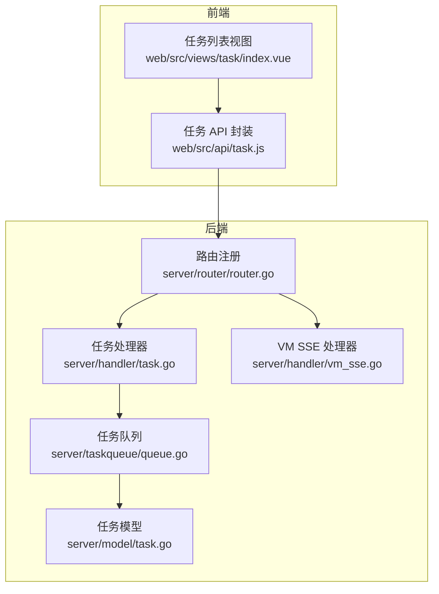
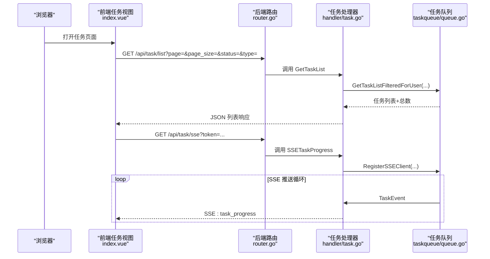
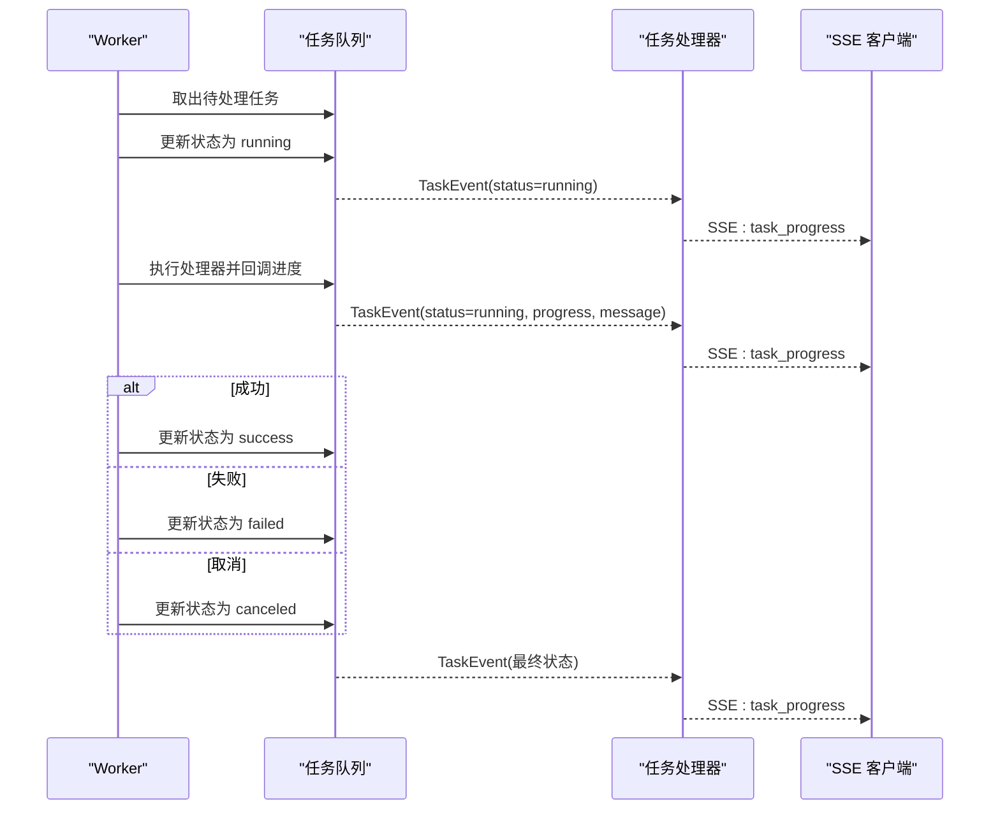
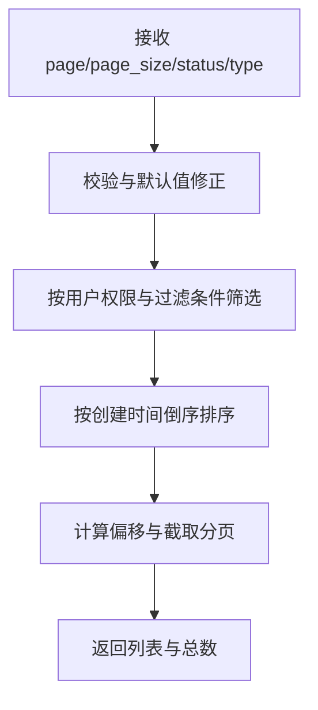
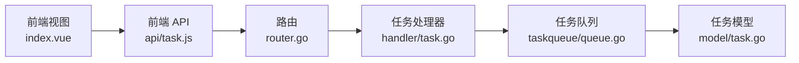

# 任务监控与追踪

<cite>
**本文引用的文件**
- [server/handler/task.go](file://server/handler/task.go)
- [server/handler/vm_sse.go](file://server/handler/vm_sse.go)
- [server/router/router.go](file://server/router/router.go)
- [server/taksqueue/queue.go](file://server/taskqueue/queue.go)
- [server/model/task.go](file://server/model/task.go)
- [server/service/scheduler/types.go](file://server/service/scheduler/types.go)
- [web/src/views/task/index.vue](file://web/src/views/task/index.vue)
- [web/src/api/task.js](file://web/src/api/task.js)
</cite>

## 目录
1. [引言](#引言)
2. [项目结构](#项目结构)
3. [核心组件](#核心组件)
4. [架构总览](#架构总览)
5. [详细组件分析](#详细组件分析)
6. [依赖分析](#依赖分析)
7. [性能考虑](#性能考虑)
8. [故障排查指南](#故障排查指南)
9. [结论](#结论)
10. [附录](#附录)

## 引言
本文件面向任务监控与追踪系统，围绕以下目标展开：深入解释基于 Server-Sent Events 的事件推送机制（客户端连接管理、事件格式与广播策略），任务状态跟踪（状态变更监听、实时更新与历史记录），任务查询接口（过滤、排序与分页），权限控制（用户访问验证与数据隔离），以及统计分析与告警配置、故障诊断实践。文档以代码为依据，辅以图示帮助不同背景读者理解。

## 项目结构
系统采用前后端分离架构，后端基于 Go 语言 Gin 框架，前端基于 Vue 3 + Element Plus。任务监控与追踪主要涉及：
- 后端路由与处理器：负责任务查询、SSE 推送、取消与清理等
- 任务队列模块：负责任务生命周期、状态变更、SSE 广播与自动清理
- 前端视图与 API：负责筛选、分页、实时订阅与展示



图表来源
- [server/router/router.go:453-461](file://server/router/router.go#L453-L461)
- [server/handler/task.go:15-195](file://server/handler/task.go#L15-L195)
- [server/taskqueue/queue.go:173-181](file://server/taskqueue/queue.go#L173-L181)
- [server/model/task.go:63-76](file://server/model/task.go#L63-L76)
- [server/handler/vm_sse.go:14-99](file://server/handler/vm_sse.go#L14-L99)

章节来源
- [server/router/router.go:453-461](file://server/router/router.go#L453-L461)
- [server/handler/task.go:15-195](file://server/handler/task.go#L15-L195)
- [server/taskqueue/queue.go:173-181](file://server/taskqueue/queue.go#L173-L181)
- [server/model/task.go:63-76](file://server/model/task.go#L63-L76)
- [server/handler/vm_sse.go:14-99](file://server/handler/vm_sse.go#L14-L99)

## 核心组件
- 任务模型与状态常量：定义任务字段与状态枚举，用于前后端一致的数据契约
- 任务队列与处理器：实现任务提交、执行、状态变更、SSE 广播与自动清理
- 任务路由与处理器：提供任务列表查询、详情查询、SSE 实时推送、取消与清理接口
- 前端任务视图与 API：提供筛选、分页、实时订阅与可视化展示

章节来源
- [server/model/task.go:7-76](file://server/model/task.go#L7-L76)
- [server/taskqueue/queue.go:28-354](file://server/taskqueue/queue.go#L28-L354)
- [server/handler/task.go:15-195](file://server/handler/task.go#L15-L195)
- [web/src/views/task/index.vue:1-586](file://web/src/views/task/index.vue#L1-L586)
- [web/src/api/task.js:1-46](file://web/src/api/task.js#L1-L46)

## 架构总览
系统通过 Gin 路由将请求分发至任务处理器；任务处理器调用任务队列模块进行任务状态管理与事件广播；前端通过 SSE 与 REST API 实现任务状态的实时更新与历史查询。



图表来源
- [server/router/router.go:453-461](file://server/router/router.go#L453-L461)
- [server/handler/task.go:87-130](file://server/handler/task.go#L87-L130)
- [server/taskqueue/queue.go:126-154](file://server/taskqueue/queue.go#L126-L154)

## 详细组件分析

### SSE 事件推送机制
- 客户端连接管理
  - 服务端设置标准 SSE 响应头，保持连接并允许跨域
  - 使用带缓冲的通道作为事件通道，注册/注销客户端时加锁保护
  - 使用请求上下文的 Done 通道检测客户端断开，及时清理资源
- 事件格式定义
  - 事件结构包含任务 ID、类型、状态、进度与消息文本
  - 初始连接事件名为“connected”，后续事件名为“task_progress”
- 消息广播策略
  - 任务状态变更时统一通过广播函数向所有客户端发送事件
  - 广播时采用非阻塞写入，若客户端缓冲区满则跳过，避免阻塞生产者

```mermaid
flowchart TD
Start(["SSE 连接建立"]) --> Reg["注册客户端通道"]
Reg --> SendInit["发送初始 connected 事件"]
loop 循环
NewEvent{"有新事件?"}
NewEvent --> |否| Wait["等待事件或客户端断开"]
Wait --> ClientGone{"客户端断开?"}
ClientGone --> |是| Cleanup["注销客户端并关闭通道"]
ClientGone --> |否| NewEvent
NewEvent --> |是| AccessCheck["按用户角色校验可见性"]
AccessCheck --> |不可见| Skip["跳过事件"]
AccessCheck --> |可见| Broadcast["广播事件给所有客户端"]
Broadcast --> UpdateUI["前端更新进度/状态"]
Skip --> Wait
end
Cleanup --> End(["结束"])
```

图表来源
- [server/handler/task.go:87-130](file://server/handler/task.go#L87-L130)
- [server/taskqueue/queue.go:126-154](file://server/taskqueue/queue.go#L126-L154)

章节来源
- [server/handler/task.go:87-130](file://server/handler/task.go#L87-L130)
- [server/taskqueue/queue.go:126-154](file://server/taskqueue/queue.go#L126-L154)

### 任务状态跟踪系统
- 状态变更监听
  - 任务进入等待中/执行中/成功/失败/已取消任一阶段，均会触发广播
  - 前端收到事件后更新对应任务的进度与消息
- 实时更新
  - SSE 通道持续推送，前端在事件到达时合并更新
  - 对于新增任务，若本地列表未包含则主动刷新
- 历史记录
  - 任务存储为内存结构，提供查询与分页能力
  - 支持按状态与类型筛选、按创建时间倒序排序



图表来源
- [server/taskqueue/queue.go:229-354](file://server/taskqueue/queue.go#L229-L354)
- [server/handler/task.go:108-129](file://server/handler/task.go#L108-L129)

章节来源
- [server/taskqueue/queue.go:229-354](file://server/taskqueue/queue.go#L229-L354)
- [server/handler/task.go:108-129](file://server/handler/task.go#L108-L129)

### 任务查询接口设计
- 过滤条件
  - 支持按状态与类型过滤，空字符串表示不过滤
- 排序规则
  - 按创建时间倒序排列
- 分页机制
  - 默认每页 20 条，最小 1，最大 100
  - 偏移计算与边界处理保证空页正确返回



图表来源
- [server/handler/task.go:15-49](file://server/handler/task.go#L15-L49)
- [server/taskqueue/queue.go:405-449](file://server/taskqueue/queue.go#L405-L449)

章节来源
- [server/handler/task.go:15-49](file://server/handler/task.go#L15-L49)
- [server/taskqueue/queue.go:405-449](file://server/taskqueue/queue.go#L405-L449)

### 任务权限控制
- 用户访问验证
  - 管理员可查看所有任务
  - 普通用户仅能查看自己创建的任务
- 数据隔离策略
  - 查询与详情接口在服务端进行权限校验
  - SSE 推送前再次校验任务可见性，避免越权

章节来源
- [server/taskqueue/queue.go:377-403](file://server/taskqueue/queue.go#L377-L403)
- [server/handler/task.go:108-129](file://server/handler/task.go#L108-L129)

### 任务统计与分析
- 执行时间统计
  - 任务执行完成后记录耗时，可用于统计平均耗时、最长耗时等
- 成功率分析
  - 基于最终状态（成功/失败/取消）进行聚合统计
- 性能指标收集
  - 任务队列内部记录任务生命周期日志，便于定位瓶颈
- 建议
  - 可扩展：引入持久化存储与独立统计服务，支持更复杂报表与趋势分析

章节来源
- [server/taskqueue/queue.go:304-354](file://server/taskqueue/queue.go#L304-L354)

### 监控告警配置与故障诊断
- 告警建议
  - 高并发场景下可增加 Worker 数量与 SSE 客户端缓冲容量
  - 对长时间未更新的任务可设置超时告警
- 故障诊断
  - SSE 连接断开：前端自动重连；后端记录断开日志
  - 任务未找到/权限不足：返回明确错误码，前端提示
  - 任务处理器缺失：任务失败并广播失败事件，便于前端提示

章节来源
- [server/handler/task.go:132-170](file://server/handler/task.go#L132-L170)
- [server/taskqueue/queue.go:131-141](file://server/taskqueue/queue.go#L131-L141)

## 依赖分析
- 路由层
  - 任务相关路由集中在 /api/task 下，统一走鉴权中间件
- 处理器层
  - 任务处理器依赖任务队列模块，负责业务编排与响应
- 任务队列层
  - 内部维护任务存储、SSE 客户端集合、处理器注册表与自动清理协程
- 前端层
  - 通过 API 封装发起请求，通过 EventSource 订阅 SSE



图表来源
- [server/router/router.go:453-461](file://server/router/router.go#L453-L461)
- [server/handler/task.go:15-195](file://server/handler/task.go#L15-L195)
- [server/taskqueue/queue.go:173-181](file://server/taskqueue/queue.go#L173-L181)
- [server/model/task.go:63-76](file://server/model/task.go#L63-L76)
- [web/src/views/task/index.vue:1-586](file://web/src/views/task/index.vue#L1-L586)
- [web/src/api/task.js:1-46](file://web/src/api/task.js#L1-L46)

章节来源
- [server/router/router.go:453-461](file://server/router/router.go#L453-L461)
- [server/handler/task.go:15-195](file://server/handler/task.go#L15-L195)
- [server/taskqueue/queue.go:173-181](file://server/taskqueue/queue.go#L173-L181)
- [server/model/task.go:63-76](file://server/model/task.go#L63-L76)
- [web/src/views/task/index.vue:1-586](file://web/src/views/task/index.vue#L1-L586)
- [web/src/api/task.js:1-46](file://web/src/api/task.js#L1-L46)

## 性能考虑
- SSE 广播
  - 采用非阻塞写入，避免因个别慢客户端影响整体吞吐
  - 建议限制最大客户端数量与事件缓冲大小，防止内存膨胀
- 任务处理
  - Worker 数量与任务通道容量需根据负载调整
  - 处理器应尽量短小、可中断，配合进度回调提升可观测性
- 查询与分页
  - 内存存储适合中小规模任务；大规模场景建议引入持久化与索引优化

## 故障排查指南
- 无法连接 SSE
  - 检查路由是否正确暴露 /api/task/sse
  - 确认前端 EventSource URL 包含有效 token
  - 观察后端日志中 SSE 客户端连接/断开记录
- 任务状态不更新
  - 确认任务处理器是否注册
  - 检查任务状态是否被取消或失败
  - 核对前端是否正确解析事件数据
- 权限问题
  - 管理员可查看所有任务；普通用户仅能看到自己创建的任务
  - 若出现 403/404，请检查当前用户角色与任务归属

章节来源
- [server/router/router.go:453-461](file://server/router/router.go#L453-L461)
- [server/handler/task.go:87-130](file://server/handler/task.go#L87-L130)
- [server/taskqueue/queue.go:131-141](file://server/taskqueue/queue.go#L131-L141)

## 结论
本系统通过简洁的 SSE 事件推送与内存任务队列，实现了任务状态的实时可视化与高效管理。结合严格的权限控制与完善的查询接口，满足了多用户场景下的任务监控需求。建议在高并发与大规模任务场景下，进一步引入持久化与统计分析能力，以支撑更复杂的运维与运营分析。

## 附录
- 任务类型与状态常量定义参见任务模型文件
- 前端任务视图与 API 封装提供了完整的交互体验与实时订阅能力

章节来源
- [server/model/task.go:7-76](file://server/model/task.go#L7-L76)
- [web/src/views/task/index.vue:1-586](file://web/src/views/task/index.vue#L1-L586)
- [web/src/api/task.js:1-46](file://web/src/api/task.js#L1-L46)