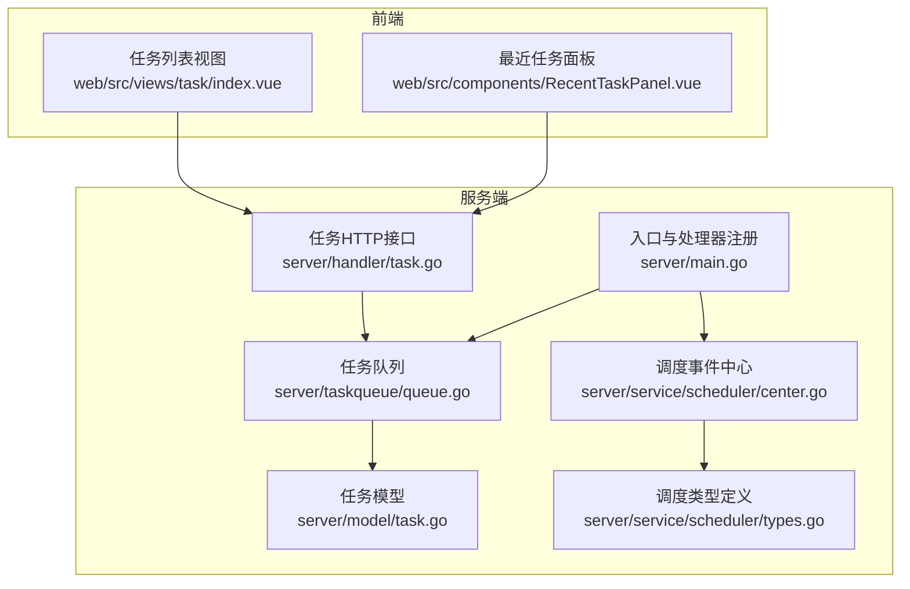
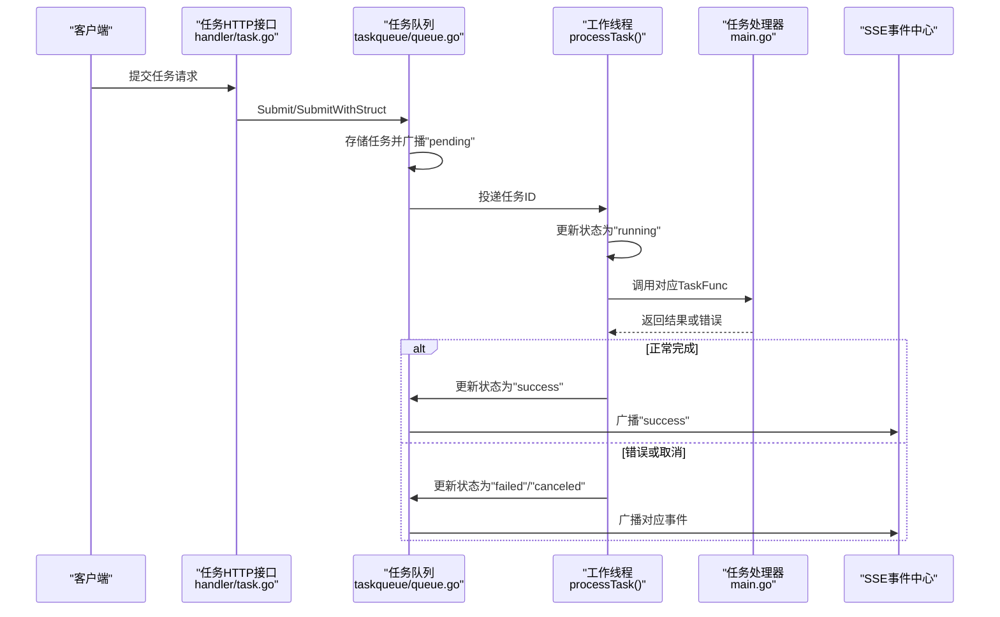
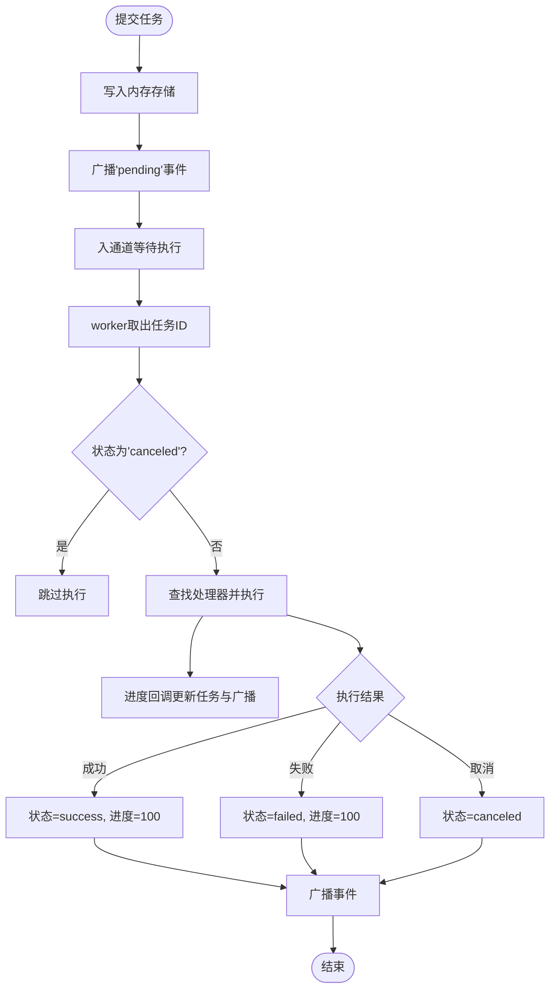
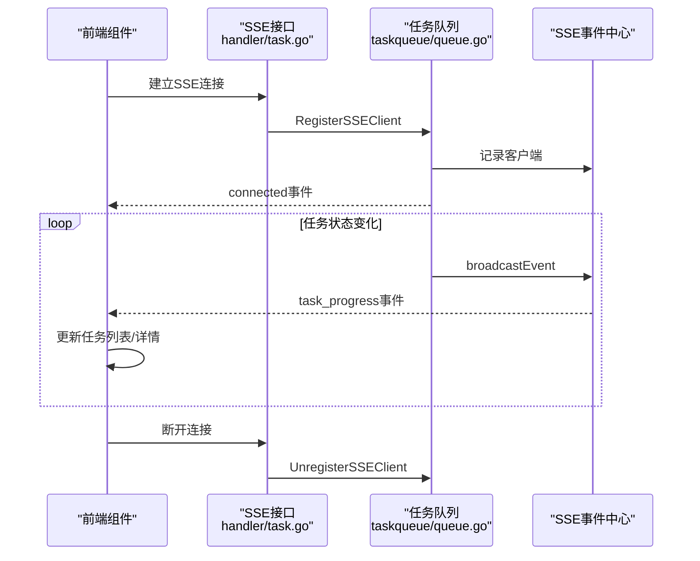
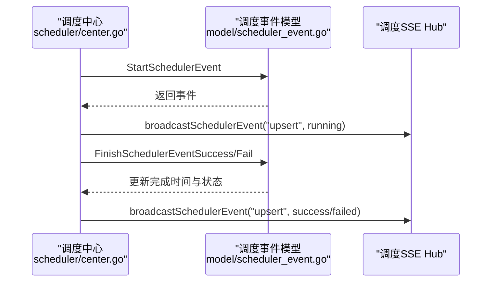
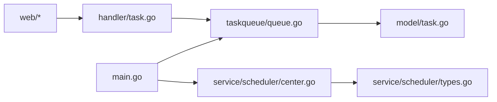

# 任务调度系统

<cite>
**本文引用的文件**
- [queue.go](file://server/taskqueue/queue.go)
- [task.go](file://server/model/task.go)
- [task.go](file://server/handler/task.go)
- [types.go](file://server/service/scheduler/types.go)
- [center.go](file://server/service/scheduler/center.go)
- [main.go](file://server/main.go)
- [index.vue](file://web/src/views/task/index.vue)
- [RecentTaskPanel.vue](file://web/src/components/RecentTaskPanel.vue)
</cite>

## 目录
1. [简介](#简介)
2. [项目结构](#项目结构)
3. [核心组件](#核心组件)
4. [架构总览](#架构总览)
5. [详细组件分析](#详细组件分析)
6. [依赖分析](#依赖分析)
7. [性能考虑](#性能考虑)
8. [故障排除指南](#故障排除指南)
9. [结论](#结论)
10. [附录](#附录)

## 简介
本文件面向Open虚拟机管理控制台的任务调度系统，系统采用“内存任务队列 + SSE 实时推送”的异步任务架构，提供统一的任务注册、调度、执行、取消与清理能力；同时配套“调度事件中心”用于虚拟机定时任务的计划、执行监控与状态跟踪。本文将从系统架构、组件职责、数据流与处理逻辑、错误与重试策略、监控与追踪、性能优化与故障排除等方面进行全面说明，并给出扩展开发的接口规范。

## 项目结构
任务调度系统主要由以下模块构成：
- 服务端核心
  - 任务队列：server/taskqueue/queue.go
  - 任务模型：server/model/task.go
  - 任务HTTP接口：server/handler/task.go
  - 调度事件中心：server/service/scheduler/center.go 与 server/service/scheduler/types.go
  - 任务处理器注册与入口：server/main.go
- 前端展示
  - 任务列表视图：web/src/views/task/index.vue
  - 最近任务面板（SSE订阅）：web/src/components/RecentTaskPanel.vue

图表来源
- [queue.go:173-181](file://server/taskqueue/queue.go#L173-L181)
- [task.go:63-76](file://server/model/task.go#L63-L76)
- [task.go:15-49](file://server/handler/task.go#L15-L49)
- [types.go:15-49](file://server/service/scheduler/types.go#L15-L49)
- [center.go:14-32](file://server/service/scheduler/center.go#L14-L32)
- [main.go:85-89](file://server/main.go#L85-L89)

章节来源
- [queue.go:1-562](file://server/taskqueue/queue.go#L1-L562)
- [task.go:1-76](file://server/model/task.go#L1-L76)
- [task.go:1-195](file://server/handler/task.go#L1-L195)
- [types.go:1-49](file://server/service/scheduler/types.go#L1-L49)
- [center.go:1-179](file://server/service/scheduler/center.go#L1-L179)
- [main.go:51-93](file://server/main.go#L51-L93)

## 核心组件
- 任务队列与调度器
  - 任务提交：Submit/SubmitWithStruct
  - 任务执行：Start(workerCount) + worker/processTask
  - 任务查询：GetTask/GetTaskList/GetTaskForUser
  - 任务取消：CancelTask/CancelTaskForUser
  - 任务清理：ClearFinishedTasks/ClearFinishedTasksForUser + 自动清理
  - SSE事件：RegisterSSEClient/UnregisterSSEClient/broadcastEvent
  - 处理器注册：RegisterHandler
- 任务模型
  - Task结构体（内存存储，非持久化），包含状态、进度、消息、参数、结果等
  - 任务状态常量与任务类型常量
- 调度事件中心
  - 调度器注册与列表
  - 调度事件生命周期：开始、成功、失败
  - SSE事件推送与清理策略
- 前端集成
  - 任务列表与详情展示
  - SSE订阅实时进度

章节来源
- [queue.go:173-227](file://server/taskqueue/queue.go#L173-L227)
- [queue.go:358-501](file://server/taskqueue/queue.go#L358-L501)
- [queue.go:529-561](file://server/taskqueue/queue.go#L529-L561)
- [task.go:7-61](file://server/model/task.go#L7-L61)
- [task.go:63-76](file://server/model/task.go#L63-L76)
- [types.go:9-49](file://server/service/scheduler/types.go#L9-L49)
- [center.go:24-179](file://server/service/scheduler/center.go#L24-L179)
- [index.vue:119-311](file://web/src/views/task/index.vue#L119-L311)
- [RecentTaskPanel.vue:332-367](file://web/src/components/RecentTaskPanel.vue#L332-L367)

## 架构总览
系统采用“生产者-消费者”模型：
- 生产者：业务层通过Submit/SubmitWithStruct提交任务
- 消费者：Start启动多个worker并发消费任务通道
- 执行器：根据任务类型查找已注册的TaskFunc处理器
- 结果与状态：通过progress回调更新任务进度与消息，并通过SSE广播事件
- 生命周期：任务在内存中流转，超时自动清理，支持手动清理

图表来源
- [task.go:15-49](file://server/handler/task.go#L15-L49)
- [queue.go:183-227](file://server/taskqueue/queue.go#L183-L227)
- [queue.go:229-354](file://server/taskqueue/queue.go#L229-L354)
- [main.go:129-510](file://server/main.go#L129-L510)

## 详细组件分析

### 任务队列与调度器
- 设计要点
  - 内存存储：任务以map存储，配合读写锁保证并发安全
  - 自增ID：原子自增，避免ID冲突
  - 通道驱动：有界通道（容量100）平衡背压与吞吐
  - 取消机制：为运行中任务存储cancel函数，支持上下文取消
  - SSE广播：统一事件格式TaskEvent，按客户端过滤可见性
  - 自动清理：每小时扫描清理超过24小时的已结束任务
- 关键流程
  - 提交：生成ID、写入内存、广播“pending”、入通道
  - 执行：查找处理器、创建可取消上下文、进度回调、执行、收尾
  - 取消：等待中直接标记取消；运行中触发取消并广播“正在取消”
  - 清理：手动清理已结束任务；自动清理过期任务

图表来源
- [queue.go:183-227](file://server/taskqueue/queue.go#L183-L227)
- [queue.go:229-354](file://server/taskqueue/queue.go#L229-L354)
- [queue.go:529-561](file://server/taskqueue/queue.go#L529-L561)

章节来源
- [queue.go:43-117](file://server/taskqueue/queue.go#L43-L117)
- [queue.go:173-227](file://server/taskqueue/queue.go#L173-L227)
- [queue.go:229-354](file://server/taskqueue/queue.go#L229-L354)
- [queue.go:358-501](file://server/taskqueue/queue.go#L358-L501)
- [queue.go:529-561](file://server/taskqueue/queue.go#L529-L561)

### 任务模型与类型
- 任务模型
  - 字段：ID、类型、状态、参数（JSON字符串）、结果（JSON字符串）、进度、消息、创建人、创建/更新时间
  - 状态：pending/running/success/failed/canceled
  - 类型：涵盖克隆、批量克隆、重装、模板制作/导入/导出/删除、创建/删除虚拟机、快照、网络抓包、防火墙、存储池、VPC、定时任务、迁移、救援、配额关停等
- 设计影响
  - 参数与结果均以JSON字符串存储，便于跨模块传递复杂结构
  - 非持久化设计简化部署，适合短期任务场景

章节来源
- [task.go:7-61](file://server/model/task.go#L7-L61)
- [task.go:63-76](file://server/model/task.go#L63-L76)

### 任务处理器注册与扩展
- 注册方式
  - 通过RegisterHandler按任务类型注册TaskFunc
  - 处理器签名：接收context、任务对象、进度回调，返回结果JSON与错误
- 典型实现
  - 链式克隆、原生链式克隆、批量克隆、重装系统、模板操作、创建/删除虚拟机、存储池操作、迁移、定时任务动作等
- 扩展建议
  - 新增任务类型：在model/task.go中添加类型常量
  - 注册处理器：在main.go中新增RegisterHandler调用
  - 参数校验与进度上报：在处理器内进行参数解析、分阶段调用progress回调
  - 取消支持：在处理器内部定期检查ctx.Done()并及时返回

章节来源
- [queue.go:158-167](file://server/taskqueue/queue.go#L158-L167)
- [main.go:129-510](file://server/main.go#L129-L510)
- [task.go:16-61](file://server/model/task.go#L16-L61)

### 异步任务处理与SSE监控
- 异步执行
  - Submit/SubmitWithStruct将任务放入通道，由worker并发拉取执行
  - 进度回调统一更新任务状态与广播事件
- SSE推送
  - handler/SSETaskProgress建立SSE连接，按用户维度过滤可见任务
  - 前端通过EventSource订阅“task_progress”事件，实时更新UI
- 前端集成
  - 任务列表与详情展示状态、进度、消息
  - 最近任务面板自动重连SSE，断线重连

图表来源
- [task.go:87-130](file://server/handler/task.go#L87-L130)
- [queue.go:126-154](file://server/taskqueue/queue.go#L126-L154)
- [index.vue:119-311](file://web/src/views/task/index.vue#L119-L311)
- [RecentTaskPanel.vue:332-367](file://web/src/components/RecentTaskPanel.vue#L332-L367)

章节来源
- [task.go:87-130](file://server/handler/task.go#L87-L130)
- [queue.go:126-154](file://server/taskqueue/queue.go#L126-L154)
- [index.vue:119-311](file://web/src/views/task/index.vue#L119-L311)
- [RecentTaskPanel.vue:332-367](file://web/src/components/RecentTaskPanel.vue#L332-L367)

### 定时任务管理与调度事件中心
- 调度器注册
  - RegisterScheduler定义调度器Key、名称、分组、描述及启用条件
  - ListSchedulers返回调度器概览，包含最后事件时间
- 调度事件生命周期
  - StartSchedulerEvent创建“running”事件并持久化
  - FinishSchedulerEventSuccess/FinishSchedulerEventFailed更新为成功/失败并持久化
  - SSE广播事件，前端订阅“scheduler_event”消息
- 清理策略
  - StartSchedulerEventCleanup周期清理，保留时长可配置，默认168小时

图表来源
- [types.go:15-49](file://server/service/scheduler/types.go#L15-L49)
- [center.go:78-122](file://server/service/scheduler/center.go#L78-L122)
- [center.go:152-179](file://server/service/scheduler/center.go#L152-L179)

章节来源
- [types.go:9-49](file://server/service/scheduler/types.go#L9-L49)
- [center.go:14-179](file://server/service/scheduler/center.go#L14-L179)

### 任务重试机制与错误处理
- 重试策略
  - 当前实现未内置自动重试；可在业务侧在失败时再次Submit相同任务
  - 对于可恢复错误，建议在处理器内进行幂等判断与有限次重试
- 错误分类
  - 取消：ErrTaskCanceled或ctx.Canceled，标记为canceled
  - 未找到处理器：标记为failed并附带提示
  - 其他错误：标记为failed，进度置100
- 建议
  - 对瞬时性错误（如网络抖动）在处理器内捕获并短暂退避后重试
  - 对永久性错误（参数非法、资源不可用）快速失败并返回明确错误信息

章节来源
- [queue.go:19-27](file://server/taskqueue/queue.go#L19-L27)
- [queue.go:308-337](file://server/taskqueue/queue.go#L308-L337)

### 任务监控与追踪
- 进度报告
  - 处理器通过progress回调上报进度与消息，统一更新任务并广播
- 日志记录
  - 关键事件（提交、开始、完成、失败、取消、清理）均有日志输出
- 前端追踪
  - SSE订阅实时事件，断线自动重连
  - 详情页在终端态刷新最新状态

章节来源
- [queue.go:288-301](file://server/taskqueue/queue.go#L288-L301)
- [queue.go:322-352](file://server/taskqueue/queue.go#L322-L352)
- [RecentTaskPanel.vue:332-367](file://web/src/components/RecentTaskPanel.vue#L332-L367)

## 依赖分析
- 组件耦合
  - handler依赖taskqueue进行任务查询、取消、SSE注册
  - taskqueue依赖model任务模型与logger日志
  - main负责注册任务处理器与启动队列
  - scheduler中心与类型定义相互依赖，通过SSE Hub与模型交互
- 外部依赖
  - Gin框架提供HTTP路由与SSE响应
  - 前端通过EventSource订阅SSE

图表来源
- [task.go:15-49](file://server/handler/task.go#L15-L49)
- [queue.go:173-181](file://server/taskqueue/queue.go#L173-L181)
- [task.go:63-76](file://server/model/task.go#L63-L76)
- [main.go:85-89](file://server/main.go#L85-L89)
- [center.go:14-32](file://server/service/scheduler/center.go#L14-L32)
- [types.go:15-49](file://server/service/scheduler/types.go#L15-L49)

章节来源
- [task.go:15-49](file://server/handler/task.go#L15-L49)
- [queue.go:173-181](file://server/taskqueue/queue.go#L173-L181)
- [main.go:85-89](file://server/main.go#L85-L89)
- [center.go:14-32](file://server/service/scheduler/center.go#L14-L32)

## 性能考虑
- 并发与吞吐
  - Start(workerCount)控制并发度，建议根据CPU与I/O负载调整
  - 通道容量100可缓解突发提交，避免阻塞
- 内存与GC
  - 任务仅内存存储，避免数据库压力；注意长期运行时内存占用
- SSE与广播
  - 广播默认丢弃缓冲区满的事件，避免阻塞；可根据需要增大缓冲
- 清理策略
  - 自动清理每小时一次，减少内存占用；手动清理接口支持管理员快速回收

章节来源
- [queue.go:173-181](file://server/taskqueue/queue.go#L173-L181)
- [queue.go:144-154](file://server/taskqueue/queue.go#L144-L154)
- [queue.go:531-561](file://server/taskqueue/queue.go#L531-L561)

## 故障排除指南
- 任务未执行
  - 检查是否注册了对应任务类型的处理器
  - 确认worker正常运行且通道未积压过多
- 无法取消任务
  - 等待中任务可直接取消；运行中任务需等待处理器检查ctx.Done()
- SSE无事件
  - 检查SSE接口是否正确注册客户端
  - 前端EventSource是否携带有效token
- 任务状态异常
  - 查看日志中“任务完成/失败/取消”记录定位问题
  - 使用GetTaskForUser核对权限与可见性

章节来源
- [queue.go:267-286](file://server/taskqueue/queue.go#L267-L286)
- [queue.go:458-501](file://server/taskqueue/queue.go#L458-L501)
- [task.go:87-130](file://server/handler/task.go#L87-L130)
- [RecentTaskPanel.vue:332-367](file://web/src/components/RecentTaskPanel.vue#L332-L367)

## 结论
本任务调度系统以简洁高效的内存队列为核心，结合SSE实现高实时性的任务监控；调度事件中心补充了虚拟机定时任务的计划与追踪能力。系统具备良好的扩展性：通过RegisterHandler即可新增任务类型，处理器内可灵活实现进度上报与取消支持。建议在生产环境中合理配置worker数量、关注内存占用与清理策略，并在处理器中完善错误分类与重试逻辑，以提升稳定性与用户体验。

## 附录

### 任务扩展开发接口说明
- 新增任务类型
  - 在model/task.go中添加类型常量
  - 在main.go中通过RegisterHandler注册TaskFunc
- 处理器实现规范
  - 接收context、task、progress回调
  - 分阶段调用progress更新进度与消息
  - 支持ctx.Done()检测取消
  - 返回JSON字符串结果与错误
- 提交任务
  - 使用Submit或SubmitWithStruct传入任务类型与参数
  - 参数建议为JSON字符串或结构体（后者会自动序列化）

章节来源
- [task.go:16-61](file://server/model/task.go#L16-L61)
- [main.go:129-510](file://server/main.go#L129-L510)
- [queue.go:183-220](file://server/taskqueue/queue.go#L183-L220)