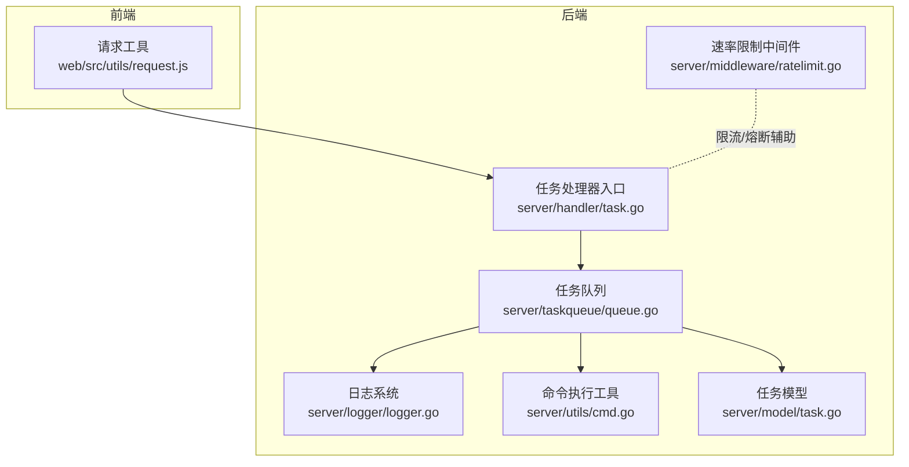
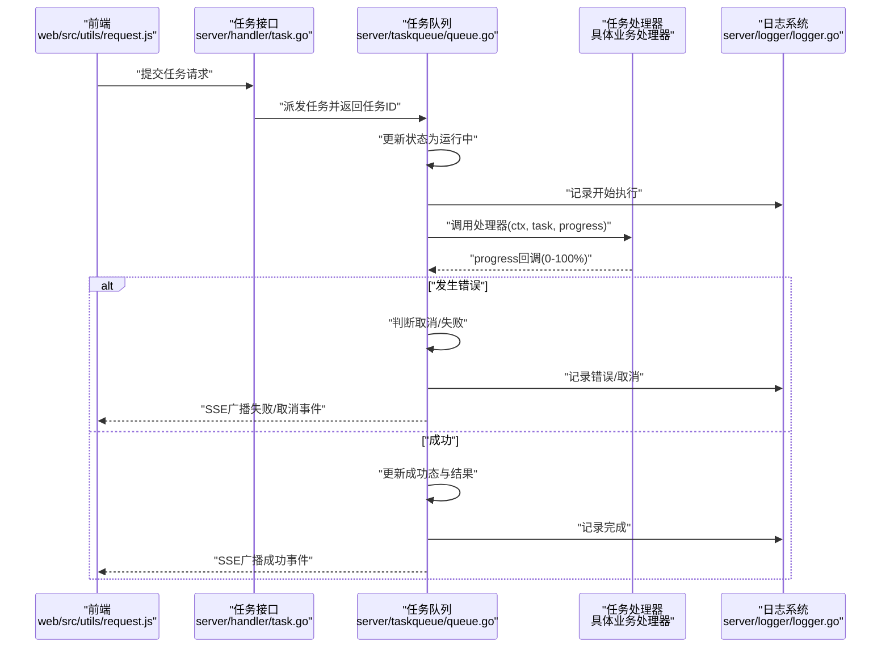
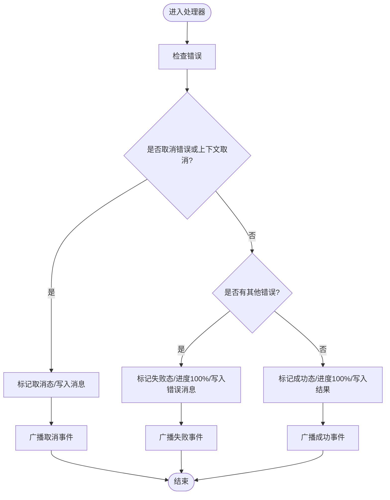
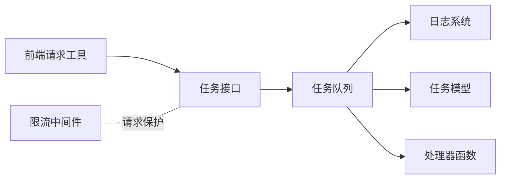

# 任务错误处理

<cite>
**本文引用的文件**
- [server/taskqueue/queue.go](file://server/taskqueue/queue.go)
- [server/logger/logger.go](file://server/logger/logger.go)
- [server/utils/cmd.go](file://server/utils/cmd.go)
- [server/middleware/ratelimit.go](file://server/middleware/ratelimit.go)
- [web/src/utils/request.js](file://web/src/utils/request.js)
- [server/model/task.go](file://server/model/task.go)
- [server/handler/task.go](file://server/handler/task.go)
</cite>

## 目录
1. [引言](#引言)
2. [项目结构](#项目结构)
3. [核心组件](#核心组件)
4. [架构总览](#架构总览)
5. [详细组件分析](#详细组件分析)
6. [依赖关系分析](#依赖关系分析)
7. [性能考量](#性能考量)
8. [故障排查指南](#故障排查指南)
9. [结论](#结论)
10. [附录](#附录)

## 引言
本文件聚焦于任务错误处理系统，围绕任务取消、执行失败与系统异常三类错误进行分类与处理策略说明；阐述错误恢复机制（自动重试、退避与上限限制）的设计现状与扩展建议；梳理错误日志记录体系（格式、级别、审计追踪）；解释用户侧错误提示与本地化反馈；并给出错误监控与告警的实践方向及常见问题诊断方法。

## 项目结构
任务错误处理涉及后端任务队列、日志系统、命令执行工具、速率限制中间件以及前端请求拦截与高风险挑战流程。下图展示与错误处理相关的关键模块及其交互：

图表来源
- [server/taskqueue/queue.go:1-354](file://server/taskqueue/queue.go#L1-L354)
- [server/logger/logger.go:1-218](file://server/logger/logger.go#L1-L218)
- [server/utils/cmd.go:130-159](file://server/utils/cmd.go#L130-L159)
- [server/middleware/ratelimit.go:55-120](file://server/middleware/ratelimit.go#L55-L120)
- [server/handler/task.go](file://server/handler/task.go)
- [server/model/task.go](file://server/model/task.go)
- [web/src/utils/request.js:113-145](file://web/src/utils/request.js#L113-L145)

章节来源
- [server/taskqueue/queue.go:1-354](file://server/taskqueue/queue.go#L1-L354)
- [server/logger/logger.go:1-218](file://server/logger/logger.go#L1-L218)
- [server/utils/cmd.go:130-159](file://server/utils/cmd.go#L130-L159)
- [server/middleware/ratelimit.go:55-120](file://server/middleware/ratelimit.go#L55-L120)
- [web/src/utils/request.js:113-145](file://web/src/utils/request.js#L113-L145)

## 核心组件
- 任务队列与处理器
  - 任务类型定义、状态机与事件推送在任务队列中统一管理，支持取消、失败、成功三种最终态。
  - 处理器查找失败会记录告警并广播失败事件。
- 错误分类与处理策略
  - 取消：区分用户主动取消与上下文取消，分别写入取消态并停止后续处理。
  - 失败：捕获业务错误，写入失败态、进度至100%，并广播失败事件。
  - 成功：写入成功态与结果，进度至100%，并广播成功事件。
- 日志系统
  - 使用结构化日志，按类型分离 app/request/cmd/libvirt，支持文件轮转与终端输出级别分离。
- 命令执行与超时/取消
  - 提供带上下文与超时的命令执行封装，便于任务内部步骤级错误定位与资源回收。
- 速率限制与异常保护
  - 限流中间件提供请求节流与窗口清理，避免瞬时高峰放大错误传播。
- 前端高风险挑战与错误重试
  - 高风险场景触发挑战与令牌注入，支持静默重试与取消分支。

章节来源
- [server/taskqueue/queue.go:19-354](file://server/taskqueue/queue.go#L19-L354)
- [server/logger/logger.go:31-84](file://server/logger/logger.go#L31-L84)
- [server/utils/cmd.go:130-159](file://server/utils/cmd.go#L130-L159)
- [server/middleware/ratelimit.go:55-120](file://server/middleware/ratelimit.go#L55-L120)
- [web/src/utils/request.js:113-145](file://web/src/utils/request.js#L113-L145)

## 架构总览
下图展示从请求到任务执行、错误处理与事件广播的完整链路：

图表来源
- [server/handler/task.go](file://server/handler/task.go)
- [server/taskqueue/queue.go:222-354](file://server/taskqueue/queue.go#L222-L354)
- [server/logger/logger.go:31-84](file://server/logger/logger.go#L31-L84)

## 详细组件分析

### 任务队列与错误处理
- 错误分类
  - 取消：当错误等于预定义取消错误或上下文被取消时，标记为取消态并停止后续处理。
  - 失败：其他错误均视为失败，写入失败态、进度100%与错误消息。
  - 成功：无错误返回时标记成功态与结果。
- 进度与事件
  - 进度回调同时更新内存状态并广播SSE事件，保证前端实时反馈。
- 处理器缺失
  - 若找不到对应处理器，立即标记失败并记录告警，避免悬挂任务。

图表来源
- [server/taskqueue/queue.go:288-354](file://server/taskqueue/queue.go#L288-L354)

章节来源
- [server/taskqueue/queue.go:19-354](file://server/taskqueue/queue.go#L19-L354)

### 日志系统与审计追踪
- 结构化日志
  - 按类型分离日志文件（应用、请求、命令、libvirt），便于审计与检索。
  - 支持文件轮转与终端输出级别独立配置，兼顾开发调试与生产稳定。
- 审计字段
  - 任务执行日志包含工作线程ID、任务ID、类型、耗时、错误详情等，便于回溯与统计。

章节来源
- [server/logger/logger.go:31-84](file://server/logger/logger.go#L31-L84)
- [server/logger/logger.go:196-210](file://server/logger/logger.go#L196-L210)

### 命令执行与超时/取消
- 上下文与超时
  - 提供带取消与超时的命令执行封装，适合任务内部步骤的资源回收与错误定位。
- 日志级别差异化
  - 静默变体仅在非零退出码时记录DEBUG日志，降低预期失败场景的日志噪音。

章节来源
- [server/utils/cmd.go:130-159](file://server/utils/cmd.go#L130-L159)

### 速率限制与异常保护
- 窗口化限流
  - 基于分钟级窗口的计数限流，超过阈值阻断请求并返回剩余次数与重置时间。
- 清理机制
  - 定期清理过期条目，避免内存膨胀。

章节来源
- [server/middleware/ratelimit.go:55-120](file://server/middleware/ratelimit.go#L55-L120)

### 前端高风险挑战与错误重试
- 高风险挑战
  - 首次高风险错误时弹窗提示并要求验证，验证通过后注入令牌并重试。
- 取消与静默
  - 用户取消挑战时抛出自定义取消错误，避免继续重试。

章节来源
- [web/src/utils/request.js:113-145](file://web/src/utils/request.js#L113-L145)

## 依赖关系分析
- 组件耦合
  - 任务队列依赖日志系统进行结构化记录；依赖任务模型维护状态；依赖处理器函数实现具体业务。
  - 前端请求工具与后端任务接口通过SSE事件驱动状态同步。
- 外部依赖
  - 日志系统基于结构化日志与文件轮转库；命令执行依赖系统进程与环境变量。
- 循环依赖规避
  - 通过接口与钩子变量（如服务层钩子）避免反向导入，保持模块边界清晰。

图表来源
- [server/taskqueue/queue.go:1-354](file://server/taskqueue/queue.go#L1-L354)
- [server/logger/logger.go:1-218](file://server/logger/logger.go#L1-L218)
- [server/model/task.go](file://server/model/task.go)
- [server/handler/task.go](file://server/handler/task.go)
- [web/src/utils/request.js:113-145](file://web/src/utils/request.js#L113-L145)
- [server/middleware/ratelimit.go:55-120](file://server/middleware/ratelimit.go#L55-L120)

## 性能考量
- 队列与广播
  - 进度回调与事件广播在高频步骤中可能带来并发压力，建议在处理器内部合并进度上报频率。
- 日志开销
  - 结构化日志与文件轮转具备良好性能，但在高并发下仍需关注I/O瓶颈，必要时引入异步写入或批量落盘。
- 命令执行
  - 对外部命令执行应设置合理超时与取消，避免长时间阻塞任务线程。
- 限流策略
  - 限流阈值与清理周期需结合业务峰值调整，防止误伤正常流量。

## 故障排查指南
- 任务未找到处理器
  - 现象：任务失败且消息包含“未找到任务处理器”。
  - 排查：确认任务类型是否正确注册；核对处理器初始化顺序；检查日志中告警记录。
  - 章节来源
    - [server/taskqueue/queue.go:272-286](file://server/taskqueue/queue.go#L272-L286)
- 任务被取消
  - 现象：任务状态为取消，消息为“任务已被用户取消”。
  - 排查：确认前端是否触发取消；检查上下文取消信号；查看日志中取消记录。
  - 章节来源
    - [server/taskqueue/queue.go:308-322](file://server/taskqueue/queue.go#L308-L322)
- 任务执行失败
  - 现象：任务状态为失败，消息包含错误详情。
  - 排查：查看日志中错误字段与堆栈；核对处理器逻辑；检查外部依赖（网络、磁盘、libvirt）。
  - 章节来源
    - [server/taskqueue/queue.go:323-337](file://server/taskqueue/queue.go#L323-L337)
- 前端高风险挑战失败
  - 现象：首次高风险错误后弹窗，用户取消或验证失败。
  - 排查：确认挑战弹窗是否正确显示；检查令牌注入与重试逻辑；避免重复挑战。
  - 章节来源
    - [web/src/utils/request.js:113-145](file://web/src/utils/request.js#L113-L145)
- 速率限制导致请求失败
  - 现象：短时间内大量请求被拒绝，返回剩余次数与重置时间。
  - 排查：调整限流阈值或重试策略；避免短时间内的突发请求。
  - 章节来源
    - [server/middleware/ratelimit.go:55-120](file://server/middleware/ratelimit.go#L55-L120)

## 结论
本系统以任务队列为中枢，结合结构化日志、命令执行封装与前端高风险挑战机制，实现了对任务取消、执行失败与系统异常的分类处理与可观测性保障。建议在现有基础上补充自动重试与退避策略、完善错误监控与告警指标，以进一步提升系统的韧性与可运维性。

## 附录
- 错误恢复机制建议
  - 自动重试：针对瞬时性失败（如网络抖动、资源竞争）引入指数退避与最大重试次数限制。
  - 退避算法：采用二进制指数退避加随机抖动，避免雪崩效应。
  - 最大重试次数：按任务类型设定上限，超过后转人工介入。
- 错误监控与告警
  - 指标：错误率、P95/P99耗时、活跃任务数、队列积压。
  - 告警：错误率突增、任务积压超阈、单任务耗时异常。
- 用户友好提示
  - 本地化：将错误消息与状态文案本地化，配合SSE事件实时反馈。
  - 可操作性：提供重试按钮、取消按钮与帮助链接，减少用户困惑。