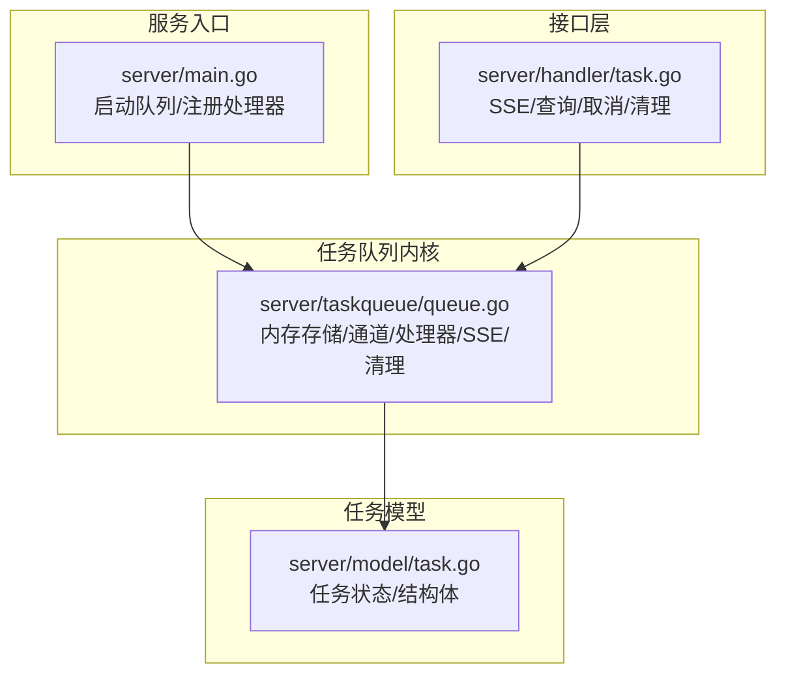
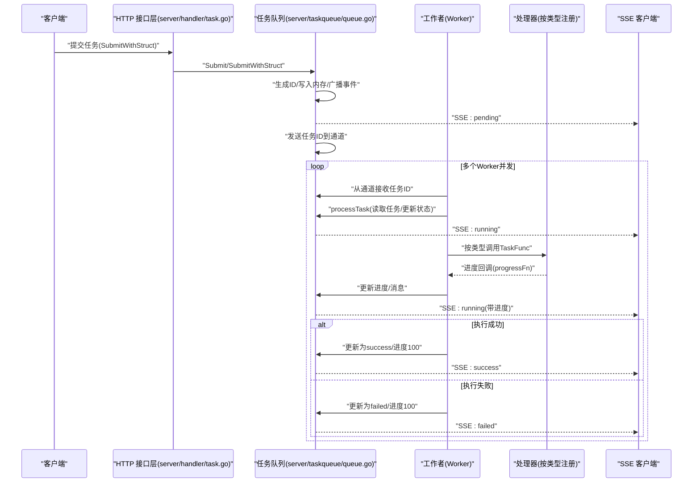
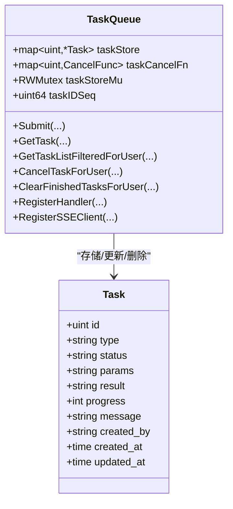
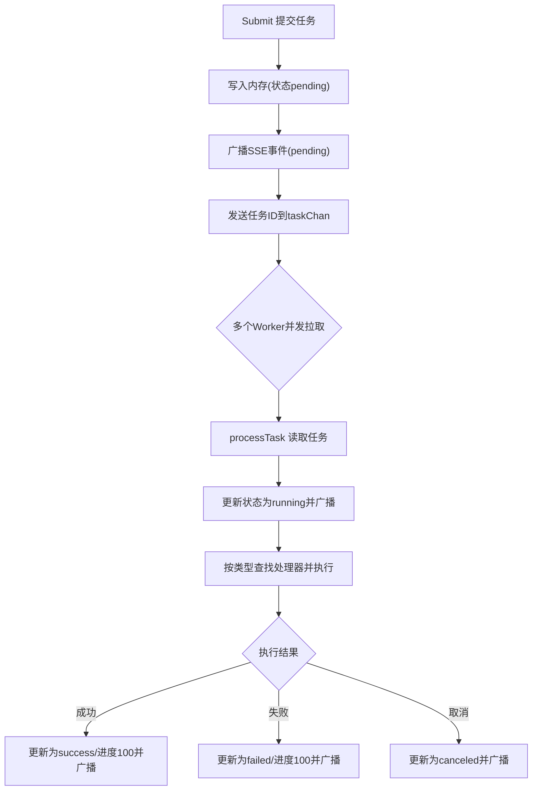
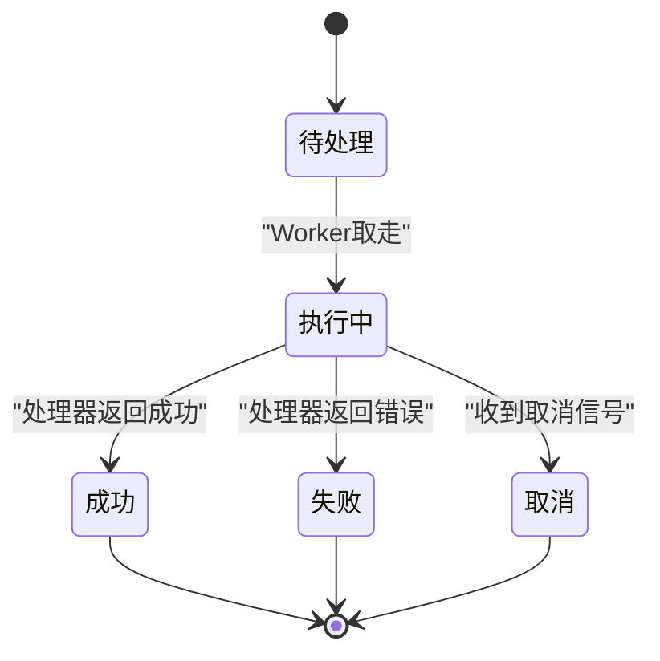
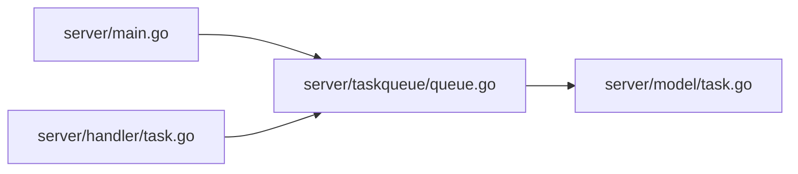

# 任务队列架构

<cite>
**本文引用的文件**
- [server\taskqueue\queue.go](file://server/taskqueue/queue.go)
- [server\model\task.go](file://server/model/task.go)
- [server\handler\task.go](file://server/handler/task.go)
- [server\main.go](file://server/main.go)
</cite>

## 目录
1. [引言](#引言)
2. [项目结构](#项目结构)
3. [核心组件](#核心组件)
4. [架构总览](#架构总览)
5. [详细组件分析](#详细组件分析)
6. [依赖关系分析](#依赖关系分析)
7. [性能考虑](#性能考虑)
8. [故障排查指南](#故障排查指南)
9. [结论](#结论)

## 引言
本文件面向任务队列子系统的架构与实现，围绕以下目标展开：  
- 解释内存任务存储机制、任务ID生成策略与并发安全控制；  
- 说明任务通道的设计与工作原理（任务分发与负载均衡）；  
- 阐述任务生命周期管理（创建、排队、执行、完成/失败/取消）；  
- 解释任务存储的数据结构设计（状态映射与元数据管理）；  
- 提供性能优化实践（缓冲区管理与内存使用策略）。  

本任务队列采用纯内存存储与基于通道的异步分发，配合 SSE 实时事件推送，满足高并发下的低延迟任务执行与可观测性需求。

## 项目结构
任务队列相关代码主要分布在如下模块：
- 任务队列内核：server/taskqueue/queue.go（任务存储、处理器注册、通道分发、SSE、清理等）
- 任务数据模型：server/model/task.go（任务状态常量、任务结构体）
- 任务接口层：server/handler/task.go（SSE 进度流、查询、取消、清理等 HTTP 接口）
- 入口与处理器注册：server/main.go（启动队列、注册各任务处理器）

图表来源
- [server\taskqueue\queue.go:1-562](file://server/taskqueue/queue.go#L1-L562)
- [server\model\task.go:1-76](file://server/model/task.go#L1-L76)
- [server\handler\task.go:1-195](file://server/handler/task.go#L1-L195)
- [server\main.go:88-630](file://server/main.go#L88-L630)

章节来源
- [server\taskqueue\queue.go:1-562](file://server/taskqueue/queue.go#L1-L562)
- [server\model\task.go:1-76](file://server/model/task.go#L1-L76)
- [server\handler\task.go:1-195](file://server/handler/task.go#L1-L195)
- [server\main.go:88-630](file://server/main.go#L88-L630)

## 核心组件
- 任务存储与并发控制：全局 map 存储任务与取消函数，配合 RWMutex 保证读写并发安全；原子自增 ID 序列确保唯一性。
- 任务通道：有界通道（容量 100），作为任务分发的“队列”，多个消费者（Worker）并发拉取执行。
- 处理器注册：按任务类型注册 TaskFunc，运行时按类型查找并调用。
- SSE 事件中心：维护客户端通道集合，广播任务状态变更事件。
- 生命周期管理：统一在 processTask 中完成状态流转与结果上报。
- 清理策略：手动清理与自动清理（超过 24 小时的结束态任务）。

章节来源
- [server\taskqueue\queue.go:41-181](file://server/taskqueue/queue.go#L41-L181)
- [server\model\task.go:7-76](file://server/model/task.go#L7-L76)
- [server\handler\task.go:87-130](file://server/handler/task.go#L87-L130)

## 架构总览
下图展示从提交任务到执行完成的端到端流程，以及 SSE 的事件推送路径。

图表来源
- [server\handler\task.go:15-49](file://server/handler/task.go#L15-L49)
- [server\taskqueue\queue.go:183-354](file://server/taskqueue/queue.go#L183-L354)
- [server\model\task.go:63-76](file://server/model/task.go#L63-L76)

## 详细组件分析

### 内存任务存储与并发安全
- 存储结构
  - 任务主表：以任务ID为键，存储任务对象指针，便于快速定位与更新。
  - 取消函数表：以任务ID为键，存储对应的 context.CancelFunc，用于运行中任务的取消。
  - 读写锁：RWMutex 保护上述两个表，读多写少场景下提升并发性能。
- 并发控制
  - 读路径：读锁保护遍历与查找，避免竞态。
  - 写路径：写锁保护插入、更新、删除与取消函数登记/移除。
  - 原子自增：任务ID序列使用原子操作，保证线程安全且单调递增。
- 访问控制
  - 用户可见性：根据创建者与角色进行访问过滤，管理员可查看所有任务。
  - 状态过滤：仅允许查看/操作处于“结束态”的任务（成功/失败/取消）。

图表来源
- [server\taskqueue\queue.go:43-117](file://server/taskqueue/queue.go#L43-L117)
- [server\model\task.go:63-76](file://server/model/task.go#L63-L76)

章节来源
- [server\taskqueue\queue.go:43-117](file://server/taskqueue/queue.go#L43-L117)
- [server\model\task.go:63-76](file://server/model/task.go#L63-L76)

### 任务ID生成策略
- 使用原子自增计数器生成全局唯一任务ID，避免重复与回绕风险。
- 生成过程在线程安全的上下文中进行，适合高并发场景。

章节来源
- [server\taskqueue\queue.go:50-53](file://server/taskqueue/queue.go#L50-L53)

### 任务通道与分发（负载均衡）
- 通道容量：100，具备背压能力，防止内存暴涨。
- 并发消费者：Start(workerCount) 启动多个 Worker 协程，共享消费通道，天然实现“轮询式”负载均衡。
- 分发算法：Go channel 的内置调度即为公平分发，无需额外策略。

图表来源
- [server\taskqueue\queue.go:171-181](file://server/taskqueue/queue.go#L171-L181)
- [server\taskqueue\queue.go:222-354](file://server/taskqueue/queue.go#L222-L354)

章节来源
- [server\taskqueue\queue.go:171-181](file://server/taskqueue/queue.go#L171-L181)
- [server\taskqueue\queue.go:222-354](file://server/taskqueue/queue.go#L222-L354)

### 任务生命周期管理
- 创建：Submit/SubmitWithStruct 生成ID、初始化状态、写入内存、广播事件、入通道。
- 排队：进入有界通道，等待 Worker 取走。
- 执行：Worker processTask 读取任务、创建可取消上下文、更新状态为 running、广播事件、调用对应处理器。
- 完成/失败/取消：根据执行结果与取消信号更新最终状态，广播事件并记录耗时。
- 清理：手动清理与自动清理（超过24小时的结束态任务）。

图表来源
- [server\taskqueue\queue.go:252-353](file://server/taskqueue/queue.go#L252-L353)
- [server\model\task.go:7-14](file://server/model/task.go#L7-L14)

章节来源
- [server\taskqueue\queue.go:183-220](file://server/taskqueue/queue.go#L183-L220)
- [server\taskqueue\queue.go:229-353](file://server/taskqueue/queue.go#L229-L353)
- [server\model\task.go:7-14](file://server/model/task.go#L7-L14)

### 任务存储的数据结构设计
- 任务状态映射：pending/running/success/failed/canceled，由处理器与队列内核共同维护。
- 元数据管理：包含任务类型、参数、结果、进度、消息、创建者、创建/更新时间戳。
- 访问控制：按用户与角色过滤，管理员可越权访问。

章节来源
- [server\model\task.go:7-76](file://server/model/task.go#L7-L76)
- [server\taskqueue\queue.go:377-449](file://server/taskqueue/queue.go#L377-L449)

### SSE 事件中心与前端交互
- 客户端注册/注销：RegisterSSEClient/UnregisterSSEClient 维护事件通道集合。
- 广播策略：broadcastEvent 对每个通道尝试非阻塞发送，避免慢消费者拖垮生产者。
- 接口层：SSETaskProgress 提供 Server-Sent Events 流，按用户维度过滤事件。

章节来源
- [server\taskqueue\queue.go:121-154](file://server/taskqueue/queue.go#L121-L154)
- [server\handler\task.go:87-130](file://server/handler/task.go#L87-L130)

### 处理器注册与任务执行
- 注册方式：RegisterHandler 按任务类型注册 TaskFunc。
- 执行入口：processTask 在 Worker 中按类型查找处理器并执行。
- 取消机制：运行中任务通过 CancelFunc 触发 context 取消，处理器需定期检查 ctx.Done()。

章节来源
- [server\taskqueue\queue.go:158-167](file://server/taskqueue/queue.go#L158-L167)
- [server\taskqueue\queue.go:267-286](file://server/taskqueue/queue.go#L267-L286)
- [server\main.go:88-630](file://server/main.go#L88-L630)

## 依赖关系分析
- 任务队列内核依赖任务模型（状态常量与结构体）。
- 接口层依赖任务队列内核提供的查询、取消、清理与 SSE 能力。
- 入口模块负责启动队列与注册各类任务处理器。

图表来源
- [server\main.go:88-89](file://server/main.go#L88-L89)
- [server\taskqueue\queue.go:1-17](file://server/taskqueue/queue.go#L1-L17)
- [server\model\task.go:1-6](file://server/model/task.go#L1-L6)
- [server\handler\task.go:1-13](file://server/handler/task.go#L1-L13)

章节来源
- [server\main.go:88-89](file://server/main.go#L88-L89)
- [server\taskqueue\queue.go:1-17](file://server/taskqueue/queue.go#L1-L17)
- [server\handler\task.go:1-13](file://server/handler/task.go#L1-L13)

## 性能考虑
- 通道容量与背压
  - 当前通道容量为 100，建议结合业务峰值吞吐评估是否需要扩容，避免频繁阻塞。
  - 若上游提交速率远超执行速率，应考虑限流或拆分任务类型。
- 并发消费者数量
  - Start(workerCount) 参数决定并发度，建议按 CPU 核心数与任务 I/O 特性调优。
- 写路径优化
  - 读写锁分离有效降低写竞争；若写压力过大，可考虑按任务类型分桶或分片。
- SSE 广播
  - 默认客户端缓冲区大小为 50，广播采用非阻塞发送，避免阻塞生产者；如客户端过多或网络慢，可适当降低广播频率或增加缓冲。
- 清理策略
  - 自动清理每小时触发一次，仅清理超过 24 小时的结束态任务，避免内存无限增长。
- JSON 参数序列化
  - SubmitWithStruct 使用 JSON 编码参数，注意参数体积与序列化成本；必要时可改为二进制或压缩。

章节来源
- [server\taskqueue\queue.go:171-181](file://server/taskqueue/queue.go#L171-L181)
- [server\taskqueue\queue.go:121-154](file://server/taskqueue/queue.go#L121-L154)
- [server\taskqueue\queue.go:531-561](file://server/taskqueue/queue.go#L531-L561)
- [server\taskqueue\queue.go:213-220](file://server/taskqueue/queue.go#L213-L220)

## 故障排查指南
- 任务未被消费
  - 检查 Start(workerCount) 是否正确启动；确认通道未被阻塞。
  - 查看日志中“任务已提交/Worker获取任务失败”等提示。
- 任务状态异常
  - 确认处理器是否注册；检查 processTask 中的状态更新逻辑。
- 取消无效
  - 确认运行中任务是否已登记 CancelFunc；处理器是否正确检查 ctx.Done()。
- SSE 不推送
  - 检查客户端注册/注销流程；确认广播通道未被阻塞。
- 权限问题
  - 管理员可越权访问；普通用户仅能看到自身任务。

章节来源
- [server\taskqueue\queue.go:173-181](file://server/taskqueue/queue.go#L173-L181)
- [server\taskqueue\queue.go:230-353](file://server/taskqueue/queue.go#L230-L353)
- [server\taskqueue\queue.go:458-501](file://server/taskqueue/queue.go#L458-L501)
- [server\handler\task.go:87-130](file://server/handler/task.go#L87-L130)
- [server\handler\task.go:132-170](file://server/handler/task.go#L132-L170)

## 结论
该任务队列以“内存存储 + 有界通道 + 多消费者 + SSE 实时推送”为核心，具备良好的并发性能与可观测性。通过原子自增 ID、读写锁与非阻塞广播等机制，兼顾了正确性与效率。建议在生产环境中结合业务特征调整通道容量与并发度，并关注处理器的取消与进度回调实现，以获得更稳定的执行体验。