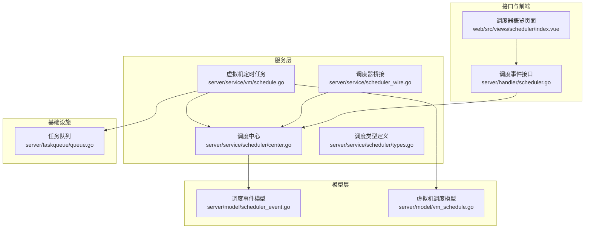
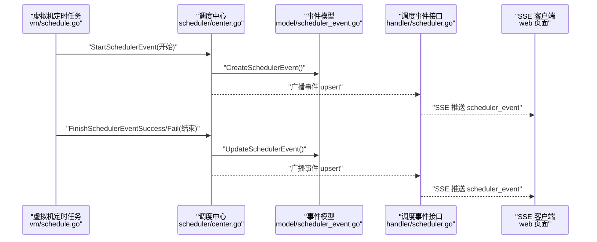
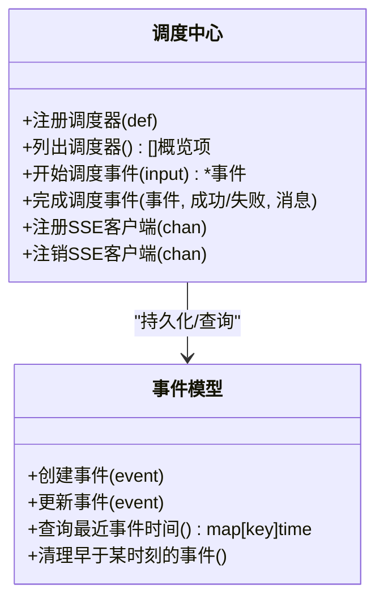
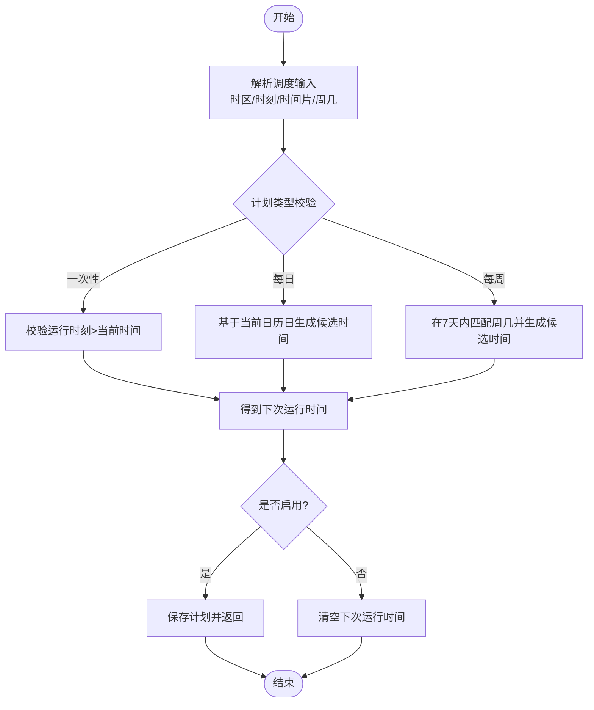
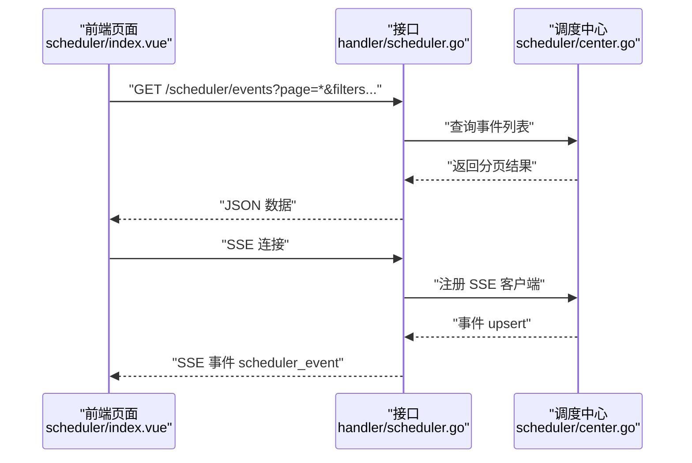
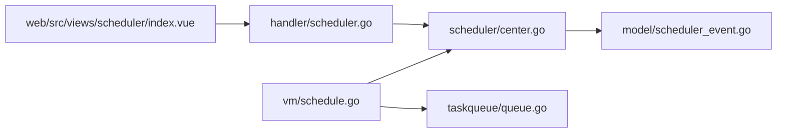

# 定时任务管理

<cite>
**本文引用的文件**
- [server/service/scheduler/center.go](file://server/service/scheduler/center.go)
- [server/service/scheduler/types.go](file://server/service/scheduler/types.go)
- [server/service/scheduler/deps.go](file://server/service/scheduler/deps.go)
- [server/service/scheduler_wire.go](file://server/service/scheduler_wire.go)
- [server/handler/scheduler.go](file://server/handler/scheduler.go)
- [server/model/scheduler_event.go](file://server/model/scheduler_event.go)
- [server/model/vm_schedule.go](file://server/model/vm_schedule.go)
- [server/service/vm/schedule.go](file://server/service/vm/schedule.go)
- [server/taskqueue/queue.go](file://server/taskqueue/queue.go)
- [web/src/views/scheduler/index.vue](file://web/src/views/scheduler/index.vue)
</cite>

## 目录
1. [引言](#引言)
2. [项目结构](#项目结构)
3. [核心组件](#核心组件)
4. [架构总览](#架构总览)
5. [详细组件分析](#详细组件分析)
6. [依赖分析](#依赖分析)
7. [性能考虑](#性能考虑)
8. [故障排查指南](#故障排查指南)
9. [结论](#结论)
10. [附录](#附录)

## 引言
本文件面向“定时任务管理系统”的设计与实现，聚焦调度中心、任务调度算法、优先级与并发控制、任务创建与配置、执行监控、生命周期管理、依赖关系处理以及调试与性能优化等主题。系统通过“调度器注册—事件记录—SSE 实时推送—前端展示”的闭环，实现对虚拟机定时任务（如开机、关机、删除等）的统一编排与可观测性。

## 项目结构
定时任务相关能力主要分布在以下模块：
- 调度中心与事件管理：server/service/scheduler、server/model/scheduler_event.go
- 虚拟机定时任务业务：server/service/vm/schedule.go、server/model/vm_schedule.go
- 任务队列与并发控制：server/taskqueue/queue.go
- 接口与前端：server/handler/scheduler.go、web/src/views/scheduler/index.vue
- 类型与钩子桥接：server/service/scheduler/types.go、server/service/scheduler_wire.go



图表来源
- [server/service/scheduler/center.go:1-127](file://server/service/scheduler/center.go#L1-L127)
- [server/service/vm/schedule.go:243-643](file://server/service/vm/schedule.go#L243-L643)
- [server/service/scheduler_wire.go:1-87](file://server/service/scheduler_wire.go#L1-L87)
- [server/model/scheduler_event.go:88-135](file://server/model/scheduler_event.go#L88-L135)
- [server/model/vm_schedule.go](file://server/model/vm_schedule.go)
- [server/handler/scheduler.go:56-137](file://server/handler/scheduler.go#L56-L137)
- [web/src/views/scheduler/index.vue:1-33](file://web/src/views/scheduler/index.vue#L1-L33)
- [server/taskqueue/queue.go:50-110](file://server/taskqueue/queue.go#L50-L110)

章节来源
- [server/service/scheduler/center.go:1-127](file://server/service/scheduler/center.go#L1-L127)
- [server/service/vm/schedule.go:243-643](file://server/service/vm/schedule.go#L243-L643)
- [server/handler/scheduler.go:56-137](file://server/handler/scheduler.go#L56-L137)
- [web/src/views/scheduler/index.vue:1-33](file://web/src/views/scheduler/index.vue#L1-L33)

## 核心组件
- 调度中心（注册、列表、事件生命周期）
  - 注册调度器、列出调度器、按分组排序、查询最近事件时间
  - 开始/结束调度事件，广播事件变更
- 调度事件模型
  - 事件持久化、清理历史事件、聚合最近事件时间
- 虚拟机定时任务
  - 解析调度表达式（一次性/每日/每周）、计算下次运行时间、执行动作（开机/关机/删除）
  - 进度回调、事件上报、执行结果回写
- 任务队列
  - 任务存储、活跃任务检测、取消函数管理
- 接口与前端
  - 分页查询调度事件、SSE 实时推送、前端概览卡片

章节来源
- [server/service/scheduler/center.go:24-122](file://server/service/scheduler/center.go#L24-L122)
- [server/model/scheduler_event.go:88-135](file://server/model/scheduler_event.go#L88-L135)
- [server/service/vm/schedule.go:243-643](file://server/service/vm/schedule.go#L243-L643)
- [server/taskqueue/queue.go:50-110](file://server/taskqueue/queue.go#L50-L110)
- [server/handler/scheduler.go:56-137](file://server/handler/scheduler.go#L56-L137)
- [web/src/views/scheduler/index.vue:1-33](file://web/src/views/scheduler/index.vue#L1-L33)

## 架构总览
调度中心采用“注册表+事件模型+SSE”的架构，虚拟机定时任务通过调度器桥接进入统一事件流，前端通过 SSE 实时感知事件变化。



图表来源
- [server/service/vm/schedule.go:257-292](file://server/service/vm/schedule.go#L257-L292)
- [server/service/scheduler/center.go:78-122](file://server/service/scheduler/center.go#L78-L122)
- [server/model/scheduler_event.go:88-135](file://server/model/scheduler_event.go#L88-L135)
- [server/handler/scheduler.go:85-115](file://server/handler/scheduler.go#L85-L115)

## 详细组件分析

### 组件A：调度中心与事件管理
- 职责
  - 注册调度器定义（键、名称、分组、描述、启用状态）
  - 列出调度器并按分组/名称排序，补充最近事件时间
  - 管理 SSE 客户端连接与事件广播
  - 创建/完成调度事件，更新状态与时间戳
- 关键数据结构
  - 调度器注册表（线程安全映射）
  - SSE Hub（客户端通道集合）



图表来源
- [server/service/scheduler/center.go:14-122](file://server/service/scheduler/center.go#L14-L122)
- [server/model/scheduler_event.go:88-135](file://server/model/scheduler_event.go#L88-L135)

章节来源
- [server/service/scheduler/center.go:24-122](file://server/service/scheduler/center.go#L24-L122)
- [server/model/scheduler_event.go:88-135](file://server/model/scheduler_event.go#L88-L135)

### 组件B：虚拟机定时任务与调度表达式
- 调度表达式解析与执行计划
  - 支持一次性、每日、每周三种类型
  - 解析时区、运行时刻、每日时间片、周几集合
  - 计算下一次运行时间，若禁用则清空下次运行时间
- 执行动作与进度
  - 根据事件类型与动作约束（如电源事件仅支持开机/关机；生命周期事件当前仅支持删除）
  - 执行前标记运行中，完成后回写执行状态与消息
  - 通过进度回调与事件上报，保证可观测性



图表来源
- [server/service/vm/schedule.go:533-642](file://server/service/vm/schedule.go#L533-L642)

章节来源
- [server/service/vm/schedule.go:243-643](file://server/service/vm/schedule.go#L243-L643)

### 组件C：任务执行监控与生命周期
- 生命周期
  - 启动：创建运行中事件，记录触发原因
  - 执行：进度回调、动作执行
  - 结束：成功/失败，记录结果/错误消息，更新完成时间
- 监控
  - SSE 广播事件变更
  - 接口支持分页查询事件，过滤条件包含调度器键、状态、虚拟机名、时间范围
  - 前端概览卡片显示启用状态、分组、描述、最近事件时间



图表来源
- [server/handler/scheduler.go:56-137](file://server/handler/scheduler.go#L56-L137)
- [server/service/scheduler/center.go:124-127](file://server/service/scheduler/center.go#L124-L127)
- [web/src/views/scheduler/index.vue:1-33](file://web/src/views/scheduler/index.vue#L1-L33)

章节来源
- [server/handler/scheduler.go:56-137](file://server/handler/scheduler.go#L56-L137)
- [web/src/views/scheduler/index.vue:1-33](file://web/src/views/scheduler/index.vue#L1-L33)

### 组件D：任务队列与并发控制
- 任务存储与活跃任务检测
  - 内存态的任务存储表，支持读写锁保护
  - 活跃任务判断：同类型且状态为等待/运行的任务
- 取消与更新
  - 存储取消函数，便于外部取消任务
  - 更新任务字段并刷新更新时间

章节来源
- [server/taskqueue/queue.go:50-110](file://server/taskqueue/queue.go#L50-L110)

### 组件E：调度器桥接与类型定义
- 桥接
  - 将调度器函数注入到其他子包（如内存子包），实现解耦
  - 提供类型别名，保持对外 API 兼容
- 类型
  - 定义调度器定义、列表项、事件消息、事件输入等类型

章节来源
- [server/service/scheduler_wire.go:1-87](file://server/service/scheduler_wire.go#L1-L87)
- [server/service/scheduler/types.go](file://server/service/scheduler/types.go)
- [server/service/scheduler/deps.go](file://server/service/scheduler/deps.go)

## 依赖分析
- 组件耦合
  - 调度中心依赖事件模型进行持久化与查询
  - 虚拟机定时任务通过调度中心上报事件，形成统一事件源
  - 接口层依赖调度中心进行事件查询与 SSE 广播
  - 前端依赖接口进行事件订阅与概览展示
- 外部依赖
  - 时间解析与时区处理
  - SSE 协议与前端事件流



图表来源
- [server/service/vm/schedule.go:243-643](file://server/service/vm/schedule.go#L243-L643)
- [server/service/scheduler/center.go:14-122](file://server/service/scheduler/center.go#L14-L122)
- [server/model/scheduler_event.go:88-135](file://server/model/scheduler_event.go#L88-L135)
- [server/handler/scheduler.go:56-137](file://server/handler/scheduler.go#L56-L137)
- [web/src/views/scheduler/index.vue:1-33](file://web/src/views/scheduler/index.vue#L1-L33)
- [server/taskqueue/queue.go:50-110](file://server/taskqueue/queue.go#L50-L110)

## 性能考虑
- 事件查询与排序
  - 列表接口支持分页与多维过滤，建议前端按需传参，避免全量拉取
  - 后端按分组与名称排序，利于前端展示与检索
- SSE 广播
  - 使用带缓冲的通道，减少阻塞；注意客户端断开时及时注销
- 任务并发
  - 通过活跃任务检测避免重复执行同类任务
  - 取消函数用于快速终止长时间运行任务
- 时间计算
  - 下次运行时间计算在本地时区解析后比较，避免跨时区误差

[本节为通用指导，无需特定文件引用]

## 故障排查指南
- 事件未显示
  - 检查接口是否正确注册 SSE 客户端，确认连接状态与事件通道
  - 核对过滤参数（调度器键、状态、时间范围）是否导致结果为空
- 事件状态异常
  - 确认事件创建与完成流程是否成对出现
  - 检查事件清理策略是否误删
- 调度未生效
  - 校验计划类型与运行时刻合法性
  - 确认启用状态与下次运行时间是否被清空
- 执行卡住
  - 检查任务队列活跃任务检测与取消函数是否正常工作
  - 查看进度回调与事件上报是否持续

章节来源
- [server/handler/scheduler.go:85-137](file://server/handler/scheduler.go#L85-L137)
- [server/service/scheduler/center.go:78-122](file://server/service/scheduler/center.go#L78-L122)
- [server/model/scheduler_event.go:118-135](file://server/model/scheduler_event.go#L118-L135)
- [server/service/vm/schedule.go:243-643](file://server/service/vm/schedule.go#L243-L643)
- [server/taskqueue/queue.go:70-110](file://server/taskqueue/queue.go#L70-L110)

## 结论
该定时任务管理系统以“调度中心—事件模型—SSE—前端”为核心路径，实现了对虚拟机定时任务的统一编排与可观测性。通过清晰的调度表达式解析、严格的执行约束、完善的事件生命周期与并发控制，系统具备良好的可维护性与扩展性。建议在生产环境中结合分页查询、SSE 缓冲与任务取消机制，进一步提升稳定性与用户体验。

[本节为总结，无需特定文件引用]

## 附录
- 调度器注册与事件上报流程（序列图）
  
  ```mermaid
sequenceDiagram
participant VM as "虚拟机定时任务"
participant Center as "调度中心"
participant Model as "事件模型"
participant Handler as "接口"
participant SSE as "SSE 客户端"
VM->>Center : "StartSchedulerEvent(开始)"
Center->>Model : "CreateSchedulerEvent()"
Center-->>Handler : "广播 upsert"
Handler-->>SSE : "推送 scheduler_event"
VM->>Center : "FinishSchedulerEventSuccess/Fail(结束)"
Center->>Model : "UpdateSchedulerEvent()"
Center-->>Handler : "广播 upsert"
Handler-->>SSE : "推送 scheduler_event"
```

  图表来源
  - [server/service/vm/schedule.go:257-292](file://server/service/vm/schedule.go#L257-L292)
  - [server/service/scheduler/center.go:78-122](file://server/service/scheduler/center.go#L78-L122)
  - [server/model/scheduler_event.go:88-135](file://server/model/scheduler_event.go#L88-L135)
  - [server/handler/scheduler.go:85-115](file://server/handler/scheduler.go#L85-L115)