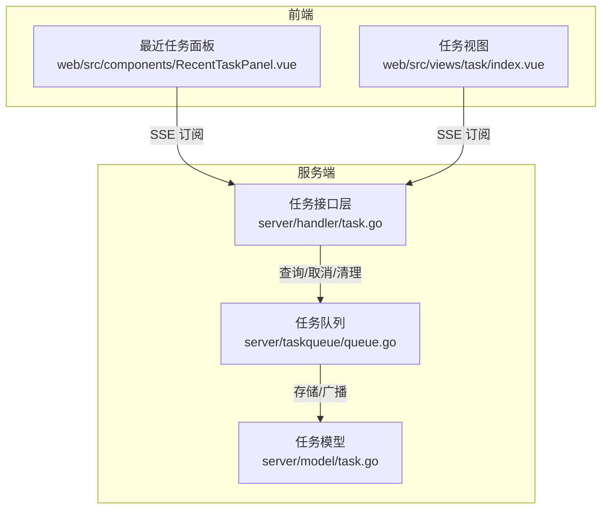
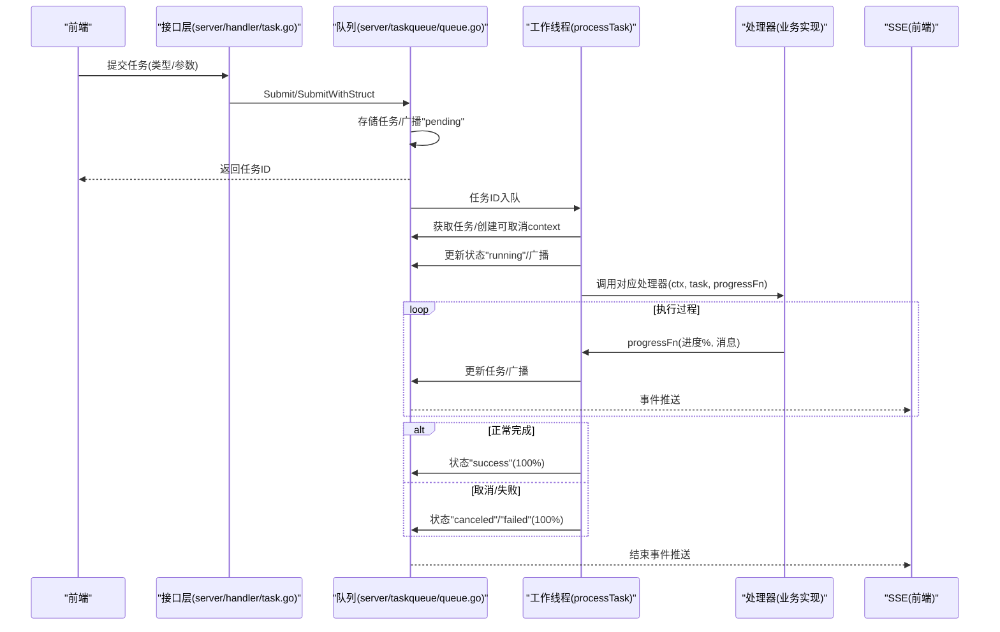
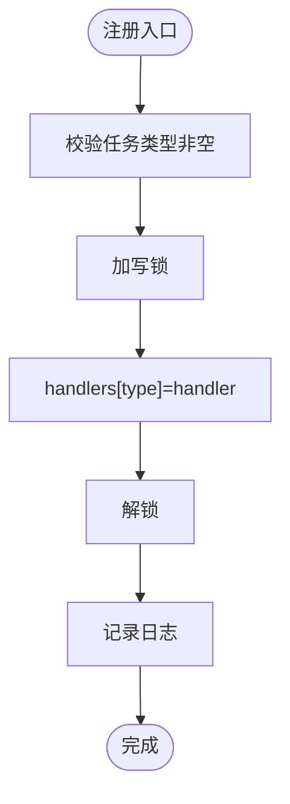
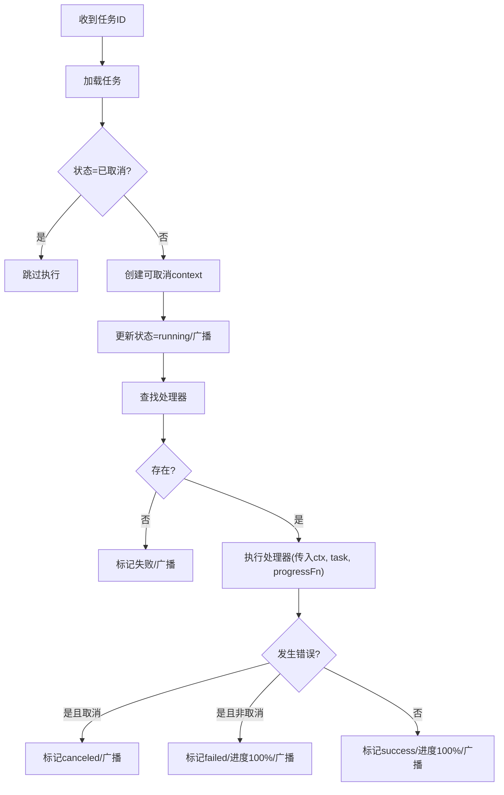
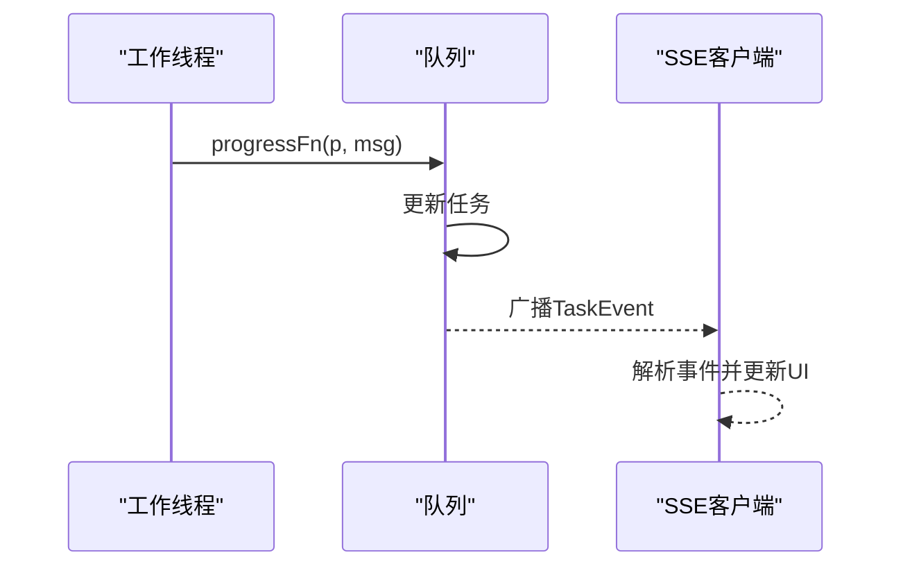
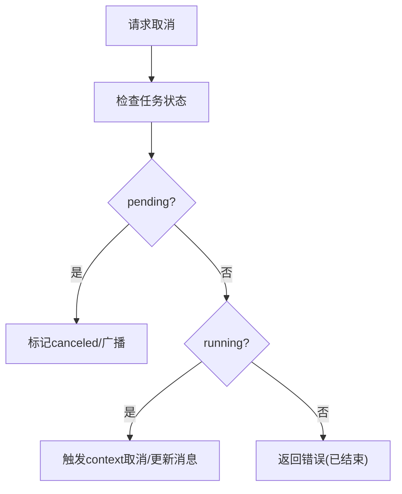
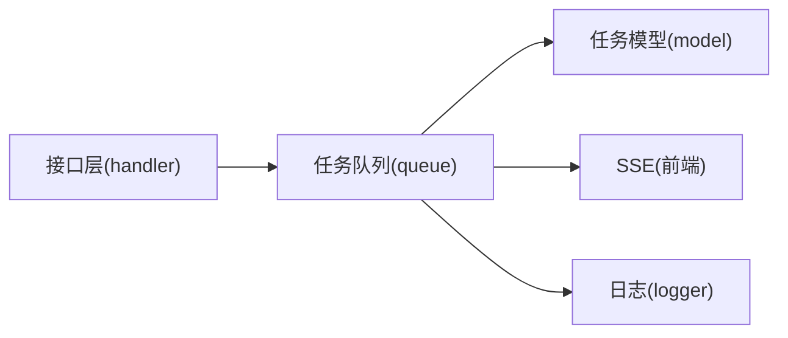

# 异步任务处理

<cite>
**本文引用的文件**
- [server\taskqueue\queue.go](file://server/taskqueue/queue.go)
- [server\model\task.go](file://server/model/task.go)
- [server\handler\task.go](file://server/handler/task.go)
- [web\src\components\RecentTaskPanel.vue](file://web/src/components/RecentTaskPanel.vue)
- [web\src\views\task\index.vue](file://web/src/views/task/index.vue)
</cite>

## 目录
1. [简介](#简介)
2. [项目结构](#项目结构)
3. [核心组件](#核心组件)
4. [架构总览](#架构总览)
5. [详细组件分析](#详细组件分析)
6. [依赖分析](#依赖分析)
7. [性能考虑](#性能考虑)
8. [故障排查指南](#故障排查指南)
9. [结论](#结论)
10. [附录](#附录)

## 简介
本文件系统性地梳理了该仓库中的异步任务处理子系统，覆盖任务处理器注册机制、任务执行与上下文管理、进度回调与事件广播、任务取消与资源清理、任务参数传递与序列化、以及最佳实践与性能优化建议。目标是帮助开发者快速理解并正确扩展异步任务能力。

## 项目结构
异步任务处理相关的核心代码分布在以下模块：
- 任务队列与处理器：server/taskqueue/queue.go
- 任务数据模型：server/model/task.go
- HTTP 接口层（查询、SSE、取消、清理）：server/handler/task.go
- 前端展示与订阅：web/src/components/RecentTaskPanel.vue、web/src/views/task/index.vue

图表来源
- [server\taskqueue\queue.go:1-562](file://server/taskqueue/queue.go#L1-L562)
- [server\model\task.go:1-76](file://server/model/task.go#L1-L76)
- [server\handler\task.go:1-195](file://server/handler/task.go#L1-L195)
- [web\src\components\RecentTaskPanel.vue:332-367](file://web/src/components/RecentTaskPanel.vue#L332-L367)
- [web\src\views\task\index.vue:119-148](file://web/src/views/task/index.vue#L119-L148)

章节来源
- [server\taskqueue\queue.go:1-562](file://server/taskqueue/queue.go#L1-L562)
- [server\model\task.go:1-76](file://server/model/task.go#L1-L76)
- [server\handler\task.go:1-195](file://server/handler/task.go#L1-L195)
- [web\src\components\RecentTaskPanel.vue:332-367](file://web/src/components/RecentTaskPanel.vue#L332-L367)
- [web\src\views\task\index.vue:119-148](file://web/src/views/task/index.vue#L119-L148)

## 核心组件
- 任务模型与状态
  - 任务状态：等待中、执行中、成功、失败、已取消
  - 任务类型：涵盖克隆、模板制作/导出/导入、快照、网络/防火墙、存储、迁移、调度等
  - 字段包含：ID、类型、状态、参数（JSON 字符串）、结果（JSON 字符串）、进度（0-100）、消息、创建者、创建/更新时间
- 任务处理器接口
  - 函数签名接收 context（用于取消信号）、任务对象、进度回调（进度百分比+消息），返回结果字符串与错误
- 任务队列与工作线程
  - 内存存储任务与取消函数映射，带读写锁保护
  - 任务通道承载待执行任务 ID，多工作线程并发消费
  - 启动自动清理协程，按时间窗口清理历史任务
- SSE 事件中心
  - 客户端注册/注销，事件广播，带背压（丢弃阻塞事件）

章节来源
- [server\model\task.go:7-76](file://server/model/task.go#L7-L76)
- [server\taskqueue\queue.go:28-39](file://server/taskqueue/queue.go#L28-L39)
- [server\taskqueue\queue.go:43-117](file://server/taskqueue/queue.go#L43-L117)
- [server\taskqueue\queue.go:171-181](file://server/taskqueue/queue.go#L171-L181)
- [server\taskqueue\queue.go:121-154](file://server/taskqueue/queue.go#L121-L154)

## 架构总览
异步任务从“提交”到“执行完成”的全链路如下：

图表来源
- [server\handler\task.go:183-221](file://server/handler/task.go#L183-L221)
- [server\taskqueue\queue.go:229-354](file://server/taskqueue/queue.go#L229-L354)
- [server\taskqueue\queue.go:288-301](file://server/taskqueue/queue.go#L288-L301)
- [web\src\components\RecentTaskPanel.vue:332-367](file://web/src/components/RecentTaskPanel.vue#L332-L367)

## 详细组件分析

### 任务处理器注册机制
- 注册接口
  - RegisterHandler(taskType string, handler TaskFunc)
  - 使用读写锁保护处理器表，键为任务类型字符串
- 注册时机与约束
  - 通常在服务启动阶段完成各业务类型的处理器注册
  - 未注册的类型在执行时会直接失败并广播失败事件
- 处理器职责
  - 严格遵守 TaskFunc 约定：接收 context、任务、进度回调；返回结果字符串与错误
  - 在执行过程中周期性调用进度回调以驱动前端实时更新

图表来源
- [server\taskqueue\queue.go:161-167](file://server/taskqueue/queue.go#L161-L167)

章节来源
- [server\taskqueue\queue.go:158-167](file://server/taskqueue/queue.go#L158-L167)

### 任务执行流程与上下文管理
- 提交与入队
  - Submit/SubmitWithStruct 创建任务对象，写入内存存储，广播“等待中”事件，发送至任务通道
- 工作线程消费
  - worker 循环从通道取任务 ID，processTask 加载任务并检查状态
- 上下文与取消
  - 为每个任务创建可取消的 context，并保存取消函数
  - 运行中任务若被取消，将在下一次进度回调或错误判断时检测到取消并更新状态
- 状态流转
  - pending -> running -> success/failed/canceled
  - 每次状态变更均更新任务并广播事件

图表来源
- [server\taskqueue\queue.go:229-354](file://server/taskqueue/queue.go#L229-L354)

章节来源
- [server\taskqueue\queue.go:183-221](file://server/taskqueue/queue.go#L183-L221)
- [server\taskqueue\queue.go:229-354](file://server/taskqueue/queue.go#L229-L354)

### 进度回调机制与事件广播
- 进度回调
  - progressFn 接收进度百分比与消息，原子更新任务并广播事件
  - 前端通过 SSE 订阅实时接收任务进度
- SSE 客户端管理
  - RegisterSSEClient/UnregisterSSEClient 管理事件通道集合
  - broadcastEvent 对每个客户端通道尝试发送，避免阻塞
- 前端集成
  - 通过 EventSource 订阅 /api/task/sse，监听 connected 与 task_progress 事件
  - 任务结束状态时刷新详情，保证最终一致性

图表来源
- [server\taskqueue\queue.go:288-301](file://server/taskqueue/queue.go#L288-L301)
- [server\taskqueue\queue.go:143-154](file://server/taskqueue/queue.go#L143-L154)
- [server\handler\task.go:87-130](file://server/handler/task.go#L87-L130)
- [web\src\components\RecentTaskPanel.vue:332-367](file://web/src/components/RecentTaskPanel.vue#L332-L367)

章节来源
- [server\taskqueue\queue.go:126-154](file://server/taskqueue/queue.go#L126-L154)
- [server\handler\task.go:87-130](file://server/handler/task.go#L87-L130)
- [web\src\components\RecentTaskPanel.vue:332-367](file://web/src/components/RecentTaskPanel.vue#L332-L367)

### 任务取消机制与资源清理
- 取消策略
  - 等待中：直接标记取消并广播
  - 运行中：触发 context 取消信号；状态在 processTask 中检测到取消后更新
- 取消信号传播
  - 通过 context.Canceled 与自定义 ErrTaskCanceled 双重判定
- 资源清理
  - defer 中确保取消函数被移除
  - 自动清理：每小时扫描，删除超过 24 小时的历史任务（仅结束态）
  - 手动清理：管理员可清理指定用户可访问的已结束任务

图表来源
- [server\taskqueue\queue.go:458-501](file://server/taskqueue/queue.go#L458-L501)
- [server\taskqueue\queue.go:309-322](file://server/taskqueue/queue.go#L309-L322)
- [server\taskqueue\queue.go:531-561](file://server/taskqueue/queue.go#L531-L561)

章节来源
- [server\taskqueue\queue.go:453-501](file://server/taskqueue/queue.go#L453-L501)
- [server\taskqueue\queue.go:503-527](file://server/taskqueue/queue.go#L503-L527)
- [server\taskqueue\queue.go:529-561](file://server/taskqueue/queue.go#L529-L561)

### 任务参数传递与序列化
- 参数传递
  - Submit 接受 params 为字符串（期望为 JSON）
  - SubmitWithStruct 将结构体序列化为 JSON 字符串后再提交
- 类型转换与校验
  - 处理器侧需自行反序列化 JSON 并进行参数校验
  - 建议在提交前进行严格的参数校验，避免无效任务进入队列
- 结果与消息
  - 处理器返回的结果字符串通常为 JSON
  - 进度回调的消息用于前端展示

章节来源
- [server\taskqueue\queue.go:183-221](file://server/taskqueue/queue.go#L183-L221)
- [server\taskqueue\queue.go:288-301](file://server/taskqueue/queue.go#L288-L301)

### 查询与权限控制
- 查询接口
  - 支持分页、按状态与类型过滤、按用户角色过滤
  - 用户只能访问自身创建或管理员可见的任务
- 权限判定
  - admin 角色可访问全部；普通用户仅能访问自身任务
  - GetTaskForUser 与 GetTaskListFilteredForUser 均采用相同规则

章节来源
- [server\taskqueue\queue.go:358-449](file://server/taskqueue/queue.go#L358-L449)
- [server\handler\task.go:15-85](file://server/handler/task.go#L15-L85)

## 依赖分析
- 组件耦合
  - 处理器注册与执行解耦：通过字符串类型键关联，降低耦合
  - SSE 与任务队列通过事件结构体解耦，便于扩展
- 外部依赖
  - Gin（HTTP 路由与响应）
  - 日志组件（记录任务生命周期事件）
- 潜在风险
  - 内存存储：适合中小规模任务；大规模场景建议引入持久化与分布式队列
  - SSE 客户端无背压保护：在高并发广播时可能丢弃部分事件

图表来源
- [server\handler\task.go:1-195](file://server/handler/task.go#L1-L195)
- [server\taskqueue\queue.go:1-562](file://server/taskqueue/queue.go#L1-L562)
- [server\model\task.go:1-76](file://server/model/task.go#L1-L76)

章节来源
- [server\handler\task.go:1-195](file://server/handler/task.go#L1-L195)
- [server\taskqueue\queue.go:1-562](file://server/taskqueue/queue.go#L1-L562)
- [server\model\task.go:1-76](file://server/model/task.go#L1-L76)

## 性能考虑
- 并发与吞吐
  - 通过 workerCount 控制并发度，结合任务通道容量平衡吞吐与资源占用
  - 任务通道容量默认 100，可根据业务峰值调整
- 内存与 GC
  - 任务与事件均为短生命周期对象，注意避免大对象驻留
  - SSE 客户端通道容量建议合理设置，避免内存膨胀
- 取消与中断
  - 处理器应定期检查 ctx.Done() 或 ctx.Err()，缩短取消延迟
- 广播与网络
  - SSE 广播采用非阻塞发送，必要时可增加缓冲或降频
- 自动清理
  - 24 小时清理策略减少历史任务堆积，建议根据业务保留策略调整

## 故障排查指南
- 常见问题定位
  - 未找到处理器：检查 RegisterHandler 是否正确注册对应任务类型
  - 任务长时间 pending：检查任务通道是否积压、worker 是否存活
  - 取消无效：确认处理器是否正确处理 context 取消信号
  - SSE 不更新：检查前端 EventSource 连接状态与权限过滤
- 错误码与提示
  - 任务不存在/无权访问：接口层返回相应错误码与消息
  - 清理失败：查看日志与权限角色

章节来源
- [server\handler\task.go:132-194](file://server/handler/task.go#L132-L194)
- [server\taskqueue\queue.go:272-286](file://server/taskqueue/queue.go#L272-L286)
- [server\taskqueue\queue.go:458-501](file://server/taskqueue/queue.go#L458-L501)

## 结论
该异步任务系统以简洁的内存队列与 SSE 广播为核心，提供了完整的任务生命周期管理：注册、提交、执行、进度上报、取消与清理。通过清晰的接口与事件模型，既满足了前端实时交互需求，也为业务扩展提供了稳定基座。建议在生产环境中结合持久化与分布式队列方案，进一步提升可靠性与可扩展性。

## 附录
- 最佳实践
  - 明确任务类型枚举与参数规范，提交前严格校验
  - 处理器内实现细粒度进度回调，保持 UI 流畅
  - 在关键步骤检查 context 取消，确保及时响应
  - 合理设置 worker 数量与通道容量，避免资源争用
  - SSE 客户端侧做好重连与去抖处理
- 性能优化建议
  - 优先使用 SubmitWithStruct 进行结构化参数传递，减少重复序列化
  - 对高频事件进行节流，避免过度广播
  - 使用后台清理策略定期回收历史任务，控制内存占用
  - 如需跨节点扩展，考虑引入消息中间件与持久化存储