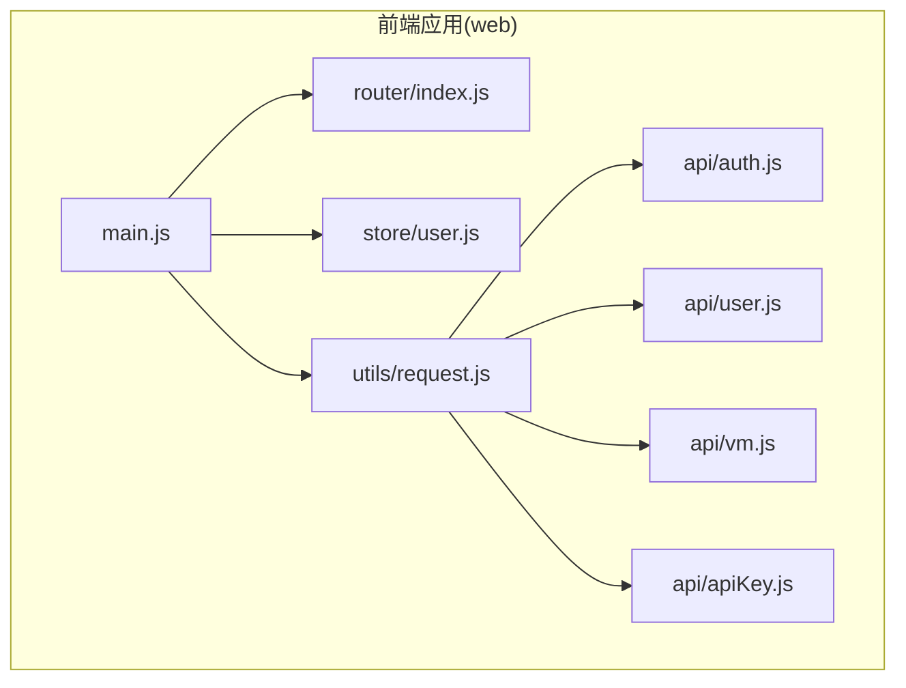
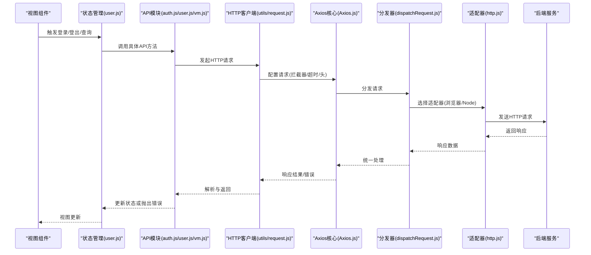
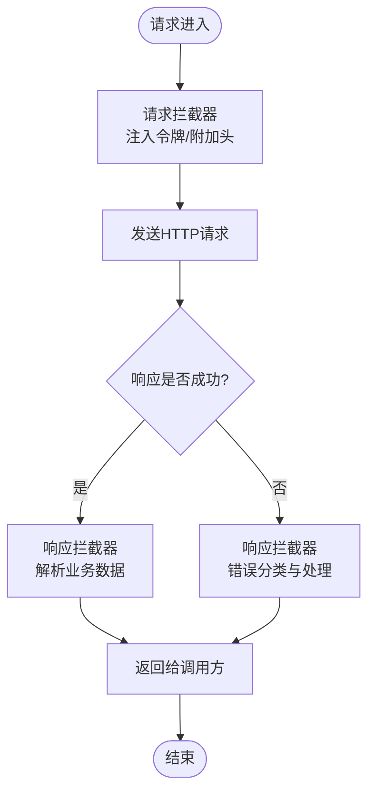
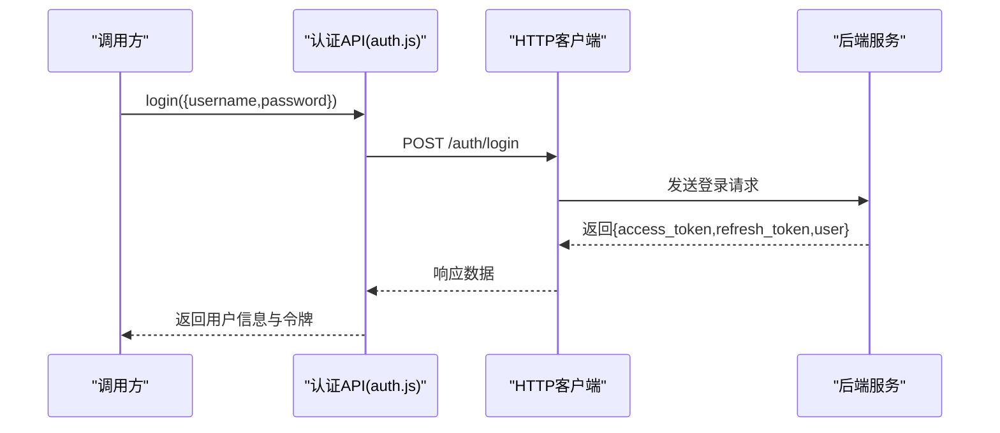
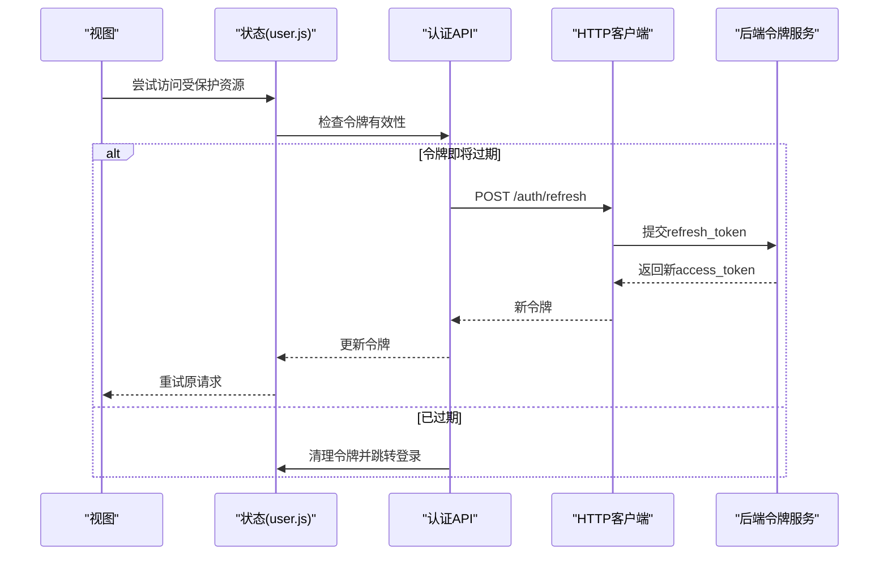
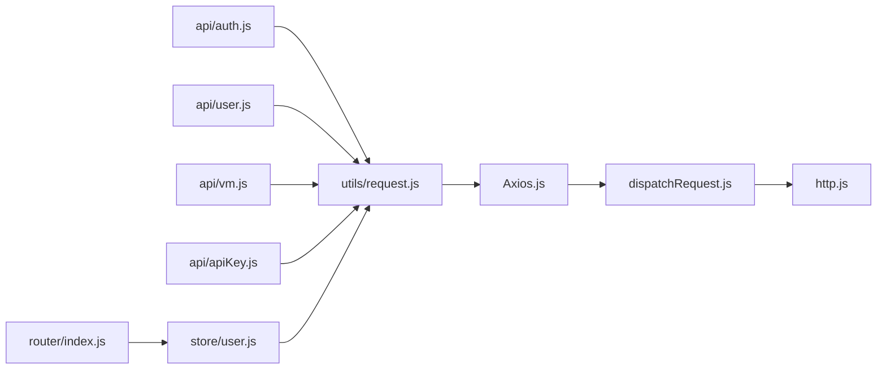

# API客户端

<cite>
**本文引用的文件**
- [request.js](file://web/src/utils/request.js)
- [auth.js](file://web/src/api/auth.js)
- [user.js](file://web/src/api/user.js)
- [vm.js](file://web/src/api/vm.js)
- [apiKey.js](file://web/src/api/apiKey.js)
- [user.js](file://web/src/store/user.js)
- [router.js](file://web/src/router/index.js)
- [main.js](file://web/src/main.js)
- [package.json](file://web/package.json)
- [axios.js](file://web/node_modules/axios/lib/core/Axios.js)
- [dispatch.js](file://web/node_modules/axios/lib/core/dispatchRequest.js)
- [adapters.js](file://web/node_modules/axios/lib/adapters/http.js)
</cite>

## 目录
1. [简介](#简介)
2. [项目结构](#项目结构)
3. [核心组件](#核心组件)
4. [架构总览](#架构总览)
5. [详细组件分析](#详细组件分析)
6. [依赖分析](#依赖分析)
7. [性能考虑](#性能考虑)
8. [故障排查指南](#故障排查指南)
9. [结论](#结论)
10. [附录](#附录)

## 简介
本文件面向前端Web应用中的API客户端，系统性梳理基于Axios的HTTP客户端配置与使用，涵盖请求/响应拦截器、错误处理、认证令牌管理与自动刷新、API接口封装与调用方式（认证、用户、虚拟机），以及并发请求、超时控制、版本管理与兼容性策略等最佳实践。内容以仓库中实际文件为依据，避免臆测，确保可追溯。

## 项目结构
前端位于 web/src 目录，API封装在 web/src/api 下，通用HTTP客户端封装在 web/src/utils/request.js 中；状态管理与路由分别在 web/src/store 和 web/src/router 中；入口文件为 web/src/main.js；依赖通过 web/package.json 管理。

图表来源
- [main.js](file://web/src/main.js)
- [router.js](file://web/src/router/index.js)
- [user.js](file://web/src/store/user.js)
- [request.js](file://web/src/utils/request.js)
- [auth.js](file://web/src/api/auth.js)
- [user.js](file://web/src/api/user.js)
- [vm.js](file://web/src/api/vm.js)
- [apiKey.js](file://web/src/api/apiKey.js)

章节来源
- [main.js](file://web/src/main.js)
- [router.js](file://web/src/router/index.js)
- [user.js](file://web/src/store/user.js)
- [request.js](file://web/src/utils/request.js)

## 核心组件
- Axios HTTP客户端封装：统一配置基础URL、超时、请求头、拦截器与错误处理，作为所有API模块的底层依赖。
- 认证API模块：登录、登出、获取当前用户信息、刷新令牌等。
- 用户API模块：用户信息查询、更新、配额等。
- 虚拟机API模块：虚拟机列表、详情、操作等。
- API密钥模块：API密钥的创建、删除、列表等。
- 状态管理：集中存储认证状态、用户信息、令牌等。
- 路由守卫：根据认证状态进行页面跳转与权限控制。

章节来源
- [request.js](file://web/src/utils/request.js)
- [auth.js](file://web/src/api/auth.js)
- [user.js](file://web/src/api/user.js)
- [vm.js](file://web/src/api/vm.js)
- [apiKey.js](file://web/src/api/apiKey.js)
- [user.js](file://web/src/store/user.js)
- [router.js](file://web/src/router/index.js)

## 架构总览
下图展示从视图到API层的整体调用链路，以及Axios拦截器对请求/响应的统一处理。

图表来源
- [request.js](file://web/src/utils/request.js)
- [auth.js](file://web/src/api/auth.js)
- [user.js](file://web/src/api/user.js)
- [vm.js](file://web/src/api/vm.js)
- [axios.js](file://web/node_modules/axios/lib/core/Axios.js)
- [dispatch.js](file://web/node_modules/axios/lib/core/dispatchRequest.js)
- [adapters.js](file://web/node_modules/axios/lib/adapters/http.js)

## 详细组件分析

### Axios客户端封装与拦截器
- 基础配置
  - 基础URL：通过环境变量或常量设置，保证开发/生产环境切换。
  - 超时：统一设置请求超时时间，避免长时间挂起。
  - 默认请求头：如Content-Type、Accept等，必要时注入认证令牌。
- 请求拦截器
  - 在发送前注入认证令牌（若存在）。
  - 可扩展：统一添加traceId、版本号、语言等头部。
  - 并发控制：可在此处限制同时请求数或合并重复请求。
- 响应拦截器
  - 成功响应：统一解析数据结构，剥离包装字段，返回业务数据。
  - 错误响应：捕获HTTP状态码与业务错误码，触发全局提示或重定向。
- 错误处理
  - 网络错误：提示网络异常或重试。
  - 业务错误：根据错误码执行不同策略（如401跳转登录、429限流退避）。
  - 异常兜底：未知错误统一上报与记录。

图表来源
- [request.js](file://web/src/utils/request.js)

章节来源
- [request.js](file://web/src/utils/request.js)

### 认证API模块
- 主要能力
  - 登录：提交用户名/密码，接收访问令牌与刷新令牌。
  - 刷新：使用刷新令牌换取新的访问令牌。
  - 获取当前用户：携带访问令牌获取用户信息。
  - 登出：清理本地令牌与用户信息。
- 参数与响应
  - 请求参数：遵循后端接口定义，注意敏感字段加密与防抖。
  - 响应解析：剥离包装字段，返回用户对象与角色信息。
- 错误处理
  - 401：触发刷新流程或强制登录。
  - 429：提示稍后再试并退避重试。
  - 其他错误：弹窗提示或记录日志。

图表来源
- [auth.js](file://web/src/api/auth.js)
- [request.js](file://web/src/utils/request.js)

章节来源
- [auth.js](file://web/src/api/auth.js)

### 用户API模块
- 主要能力
  - 查询用户列表/详情。
  - 更新用户资料、配额、SSH密钥等。
  - 操作用户API密钥（增删查改）。
- 参数与响应
  - 分页参数：page/size或cursor。
  - 过滤条件：按状态、角色、时间范围等筛选。
  - 响应格式：统一的分页结构或单对象。
- 错误处理
  - 权限不足：跳转无权限页面或隐藏按钮。
  - 数据冲突：提示唯一约束冲突。
  - 服务器异常：显示错误并允许重试。

章节来源
- [user.js](file://web/src/api/user.js)

### 虚拟机API模块
- 主要能力
  - 列表与详情：支持过滤、排序、分页。
  - 操作：启动、停止、重启、迁移、快照、克隆等。
  - 监控：实时状态、统计信息。
- 参数与响应
  - 大多数操作采用幂等设计，支持并发调用。
  - 响应可能包含任务ID，用于轮询进度。
- 错误处理
  - 资源不存在：提示刷新页面。
  - 操作冲突：提示当前状态不可执行。
  - 网络中断：自动重试或提示离线模式。

章节来源
- [vm.js](file://web/src/api/vm.js)

### API密钥模块
- 主要能力
  - 创建：生成一次性密钥，仅首次可见。
  - 删除：销毁密钥，立即失效。
  - 列表：查看有效密钥及其创建时间。
- 安全建议
  - 密钥生成后只在创建时展示一次，避免泄露。
  - 删除后立即从本地缓存移除。

章节来源
- [apiKey.js](file://web/src/api/apiKey.js)

### 认证令牌管理与自动刷新
- 存储策略
  - 访问令牌：内存或安全存储，随应用会话存在。
  - 刷新令牌：持久化存储，配合过期时间使用。
- 自动刷新
  - 401拦截：检测未授权时尝试刷新。
  - 刷新失败：清空本地状态并跳转登录。
  - 防抖：避免并发刷新导致的重复请求。
- 路由守卫
  - 登录态校验：未登录禁止访问受保护路由。
  - 登出清理：清除令牌与用户信息，重置路由。

图表来源
- [user.js](file://web/src/store/user.js)
- [auth.js](file://web/src/api/auth.js)
- [request.js](file://web/src/utils/request.js)

章节来源
- [user.js](file://web/src/store/user.js)
- [auth.js](file://web/src/api/auth.js)

### 请求参数处理与响应解析
- 请求参数
  - 必填校验：在调用前进行非空与格式校验。
  - 序列化：日期、布尔值、枚举值按约定转换。
  - 过滤：移除空值或默认值，减少传输体积。
- 响应解析
  - 统一结构：{code,data,msg}或类似包装。
  - 类型转换：数字、时间戳、布尔值转换为合适类型。
  - 错误映射：将HTTP状态码映射为业务错误码。

章节来源
- [request.js](file://web/src/utils/request.js)
- [auth.js](file://web/src/api/auth.js)
- [user.js](file://web/src/api/user.js)
- [vm.js](file://web/src/api/vm.js)

### 错误处理与异常策略
- 网络层
  - 超时：统一超时时间，超过则提示重试。
  - DNS/连接失败：提示检查网络或代理。
- 业务层
  - 401：自动刷新或跳转登录。
  - 403：提示权限不足。
  - 429：指数退避重试或提示稍后再试。
  - 5xx：提示服务器异常并记录日志。
- 用户体验
  - 成功提示：轻提示或静默成功。
  - 失败提示：明确错误原因与解决建议。
  - 加载态：长耗时操作显示加载动画。

章节来源
- [request.js](file://web/src/utils/request.js)

### 并发请求与超时处理
- 并发控制
  - 合并重复请求：对相同参数的请求去重。
  - 限流：限制同时请求数，避免雪崩。
  - 优先级：高优请求优先执行。
- 超时策略
  - 不同接口设置不同超时阈值。
  - 超时后可自动重试有限次数。
- 取消请求
  - 页面切换或组件卸载时取消未完成请求，防止内存泄漏。

章节来源
- [request.js](file://web/src/utils/request.js)

### API版本管理与兼容性
- 版本策略
  - 路径版本：/api/v1/... 或 /api/v2/...
  - 头部版本：X-API-Version。
  - 兼容性：旧版本接口保留过渡期，逐步淘汰。
- 升级路径
  - 通知：在UI提示升级或迁移。
  - 回滚：提供回滚方案与降级逻辑。
- 测试
  - 兼容性测试：覆盖多版本接口行为。

章节来源
- [request.js](file://web/src/utils/request.js)

## 依赖分析
- Axios核心
  - Axios.js：发起请求与处理配置。
  - dispatchRequest.js：请求分发与适配。
  - http.js：HTTP适配器实现。
- 前端集成
  - utils/request.js：对外暴露统一的HTTP客户端。
  - api/*：各领域API模块基于request.js封装。
  - store/user.js：集中管理认证状态与令牌。
  - router/index.js：路由守卫结合认证状态。

图表来源
- [axios.js](file://web/node_modules/axios/lib/core/Axios.js)
- [dispatch.js](file://web/node_modules/axios/lib/core/dispatchRequest.js)
- [adapters.js](file://web/node_modules/axios/lib/adapters/http.js)
- [request.js](file://web/src/utils/request.js)
- [auth.js](file://web/src/api/auth.js)
- [user.js](file://web/src/api/user.js)
- [vm.js](file://web/src/api/vm.js)
- [apiKey.js](file://web/src/api/apiKey.js)
- [user.js](file://web/src/store/user.js)
- [router.js](file://web/src/router/index.js)

章节来源
- [package.json](file://web/package.json)

## 性能考虑
- 减少请求体积：压缩参数、剔除冗余字段。
- 缓存策略：对静态或低频数据启用缓存，设置合理过期时间。
- 预加载：对高频入口提前拉取必要数据。
- 图片与静态资源：CDN加速与懒加载。
- 错误重试：指数退避，避免对后端造成压力。

## 故障排查指南
- 常见问题
  - 401未授权：检查令牌是否过期或被撤销，确认刷新流程是否生效。
  - 403禁止访问：核对用户角色与资源权限。
  - 429请求频繁：降低请求频率或增加节流。
  - 网络超时：检查网络连通性与代理设置。
- 排查步骤
  - 打开浏览器开发者工具，查看Network面板与Console日志。
  - 确认请求头是否包含正确的令牌与版本信息。
  - 检查拦截器是否正确注入令牌与附加头。
  - 核对后端返回的错误码与消息，定位具体原因。
- 日志与监控
  - 对关键接口埋点，记录请求耗时与成功率。
  - 错误上报：统一收集并上报至监控平台。

章节来源
- [request.js](file://web/src/utils/request.js)
- [auth.js](file://web/src/api/auth.js)

## 结论
本API客户端以Axios为核心，通过统一的请求/响应拦截器实现一致的错误处理与令牌管理，并围绕认证、用户、虚拟机与API密钥等模块构建清晰的接口封装。配合路由守卫与状态管理，形成完整的前端调用链路。建议在后续迭代中完善版本管理策略、增强并发控制与缓存机制，并持续优化错误提示与用户体验。

## 附录
- 最佳实践清单
  - 所有请求均通过utils/request.js发起，避免绕过拦截器。
  - 严格区分业务错误与网络错误，采用差异化处理策略。
  - 对高风险操作（删除、修改）增加二次确认。
  - 使用TypeScript或JSDoc规范参数与返回值类型。
  - 对长耗时操作提供进度反馈与取消能力。
  - 定期清理过期缓存与无效令牌，保持系统健康。