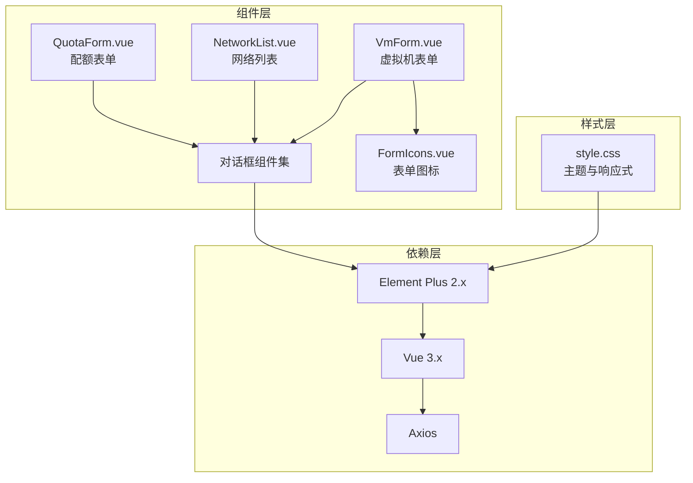
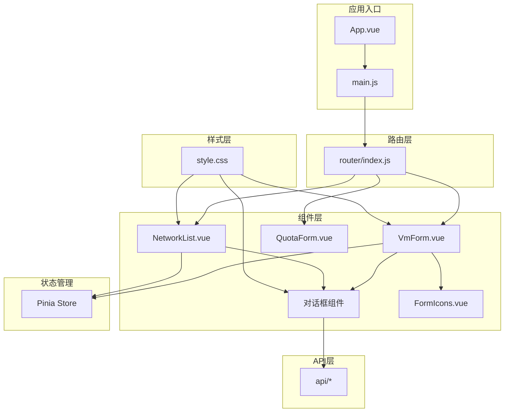
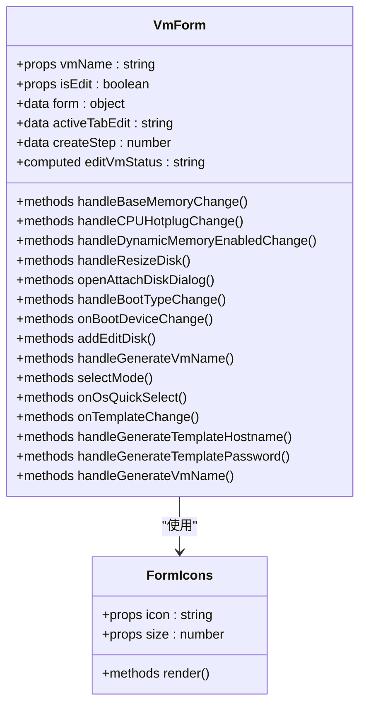
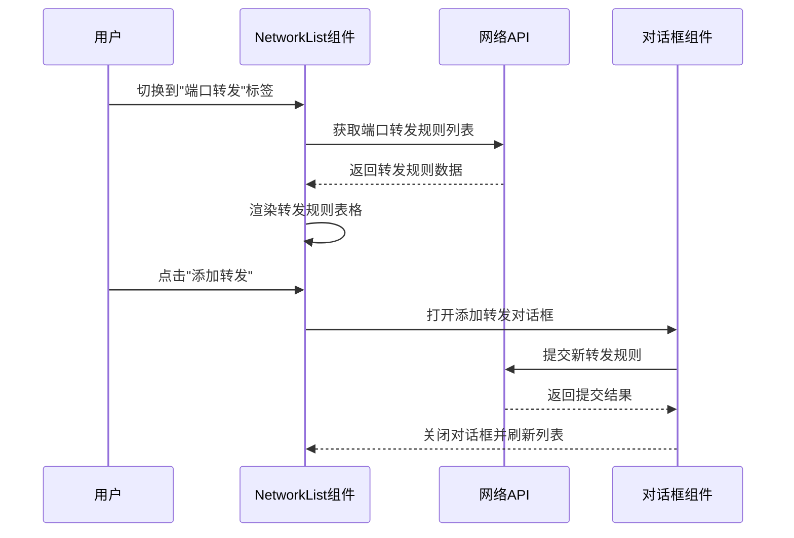
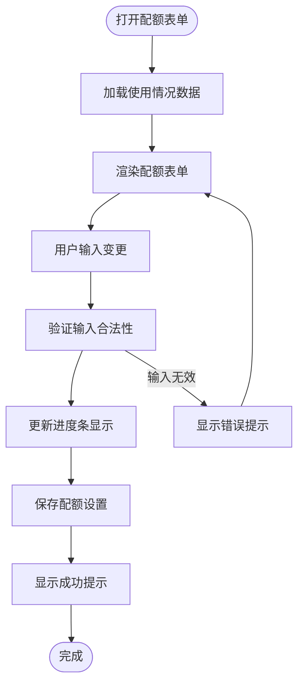
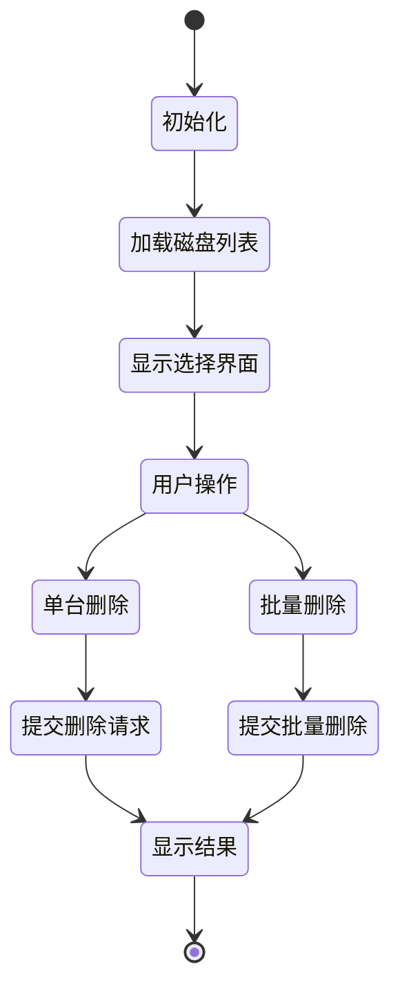
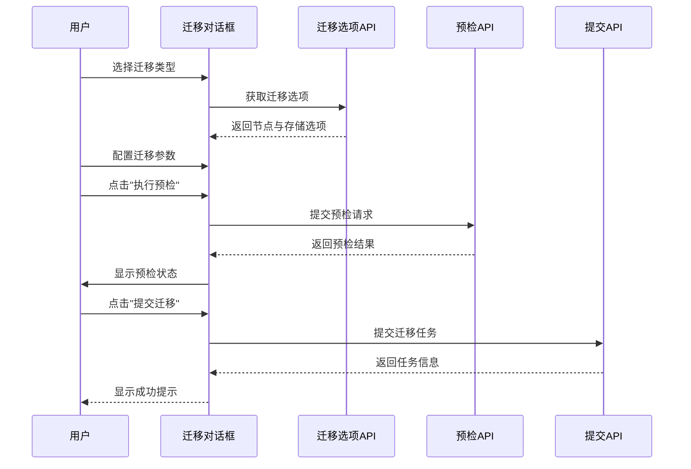
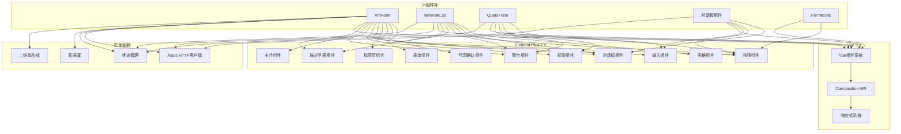

# UI组件库

<cite>
**本文档引用的文件**
- [VmForm.vue](file://web/src/components/VmForm.vue)
- [FormIcons.vue](file://web/src/components/icons/FormIcons.vue)
- [NetworkList.vue](file://web/src/components/NetworkList.vue)
- [QuotaForm.vue](file://web/src/components/QuotaForm.vue)
- [TemplateForm.vue](file://web/src/components/TemplateForm.vue)
- [VmDeleteDialog.vue](file://web/src/components/VmDeleteDialog.vue)
- [VmGroupDialog.vue](file://web/src/components/VmGroupDialog.vue)
- [VmMigrationDialog.vue](file://web/src/components/VmMigrationDialog.vue)
- [VmMonitorPanel.vue](file://web/src/components/VmMonitorPanel.vue)
- [VmReinstallDialog.vue](file://web/src/components/VmReinstallDialog.vue)
- [style.css](file://web/src/style.css)
- [package.json](file://web/package.json)
</cite>

## 目录
1. [简介](#简介)
2. [项目结构](#项目结构)
3. [核心组件](#核心组件)
4. [架构概览](#架构概览)
5. [详细组件分析](#详细组件分析)
6. [依赖关系分析](#依赖关系分析)
7. [性能考虑](#性能考虑)
8. [故障排除指南](#故障排除指南)
9. [结论](#结论)
10. [附录](#附录)

## 简介
本文件为QVMConsole项目的UI组件库详细文档，专注于Element Plus组件库的使用与定制实践。文档涵盖表单组件、表格组件和对话框组件的应用，深入解析自定义组件的设计与实现，包括表单图标组件、网络列表组件和虚拟机表单组件。同时阐述组件的属性定义、事件处理与插槽使用，样式定制与主题配置（CSS变量与样式覆盖），组件复用与组合的设计模式，以及组件测试与文档编写的最佳实践，并提供响应式设计与移动端适配的实现方案。

## 项目结构
前端项目采用Vue 3 + Element Plus技术栈，组件集中位于web/src/components目录，样式统一在web/src/style.css中进行主题与响应式适配。各组件围绕虚拟机管理场景构建，形成完整的UI组件库生态。

**图表来源**
- [VmForm.vue:1-800](file://web/src/components/VmForm.vue#L1-L800)
- [NetworkList.vue:1-800](file://web/src/components/NetworkList.vue#L1-L800)
- [QuotaForm.vue:1-339](file://web/src/components/QuotaForm.vue#L1-L339)
- [FormIcons.vue:1-139](file://web/src/components/icons/FormIcons.vue#L1-L139)
- [style.css:1-730](file://web/src/style.css#L1-L730)
- [package.json:11-24](file://web/package.json#L11-L24)

**章节来源**
- [package.json:11-24](file://web/package.json#L11-L24)

## 核心组件
本节概述UI组件库的核心组成，重点介绍表单、表格与对话框三大类组件的职责与协作关系。

- 表单组件
  - VmForm：虚拟机创建与编辑的综合表单，支持双栏布局、步骤引导与选项卡组织，集成Element Plus表单验证与交互组件。
  - QuotaForm：资源配额配置表单，提供CPU、内存、存储、网络等维度的配额设置与使用情况可视化。
  - TemplateForm：模板制作表单，支持模板类型选择、分类配置与初始化方式设置。

- 表格组件
  - NetworkList：网络管理表格，包含端口转发、静态IP、网口管理、运行状态与网络诊断等功能模块，使用Element Plus表格组件实现复杂数据展示与交互。

- 对话框组件
  - VmDeleteDialog：虚拟机删除确认对话框，支持单台与批量删除，磁盘选择与转移逻辑。
  - VmGroupDialog：虚拟机分组编辑对话框。
  - VmMigrationDialog：虚拟机迁移对话框，支持热迁移与冷迁移预检与提交。
  - VmReinstallDialog：虚拟机重装系统对话框，模板选择与凭据配置。
  - VmMonitorPanel：虚拟机监控面板，提供监视器命令执行与状态查看。

**章节来源**
- [VmForm.vue:1-800](file://web/src/components/VmForm.vue#L1-L800)
- [NetworkList.vue:1-800](file://web/src/components/NetworkList.vue#L1-L800)
- [QuotaForm.vue:1-339](file://web/src/components/QuotaForm.vue#L1-L339)
- [TemplateForm.vue:1-202](file://web/src/components/TemplateForm.vue#L1-L202)
- [VmDeleteDialog.vue:1-249](file://web/src/components/VmDeleteDialog.vue#L1-L249)
- [VmGroupDialog.vue:1-91](file://web/src/components/VmGroupDialog.vue#L1-L91)
- [VmMigrationDialog.vue:1-749](file://web/src/components/VmMigrationDialog.vue#L1-L749)
- [VmMonitorPanel.vue:1-450](file://web/src/components/VmMonitorPanel.vue#L1-L450)
- [VmReinstallDialog.vue:1-390](file://web/src/components/VmReinstallDialog.vue#L1-L390)

## 架构概览
UI组件库采用组件化架构，围绕虚拟机生命周期管理构建，通过Element Plus组件实现统一的UI体验与交互一致性。

**图表来源**
- [style.css:1-730](file://web/src/style.css#L1-L730)
- [package.json:11-24](file://web/package.json#L11-L24)

## 详细组件分析

### 虚拟机表单组件（VmForm）
VmForm是虚拟机管理的核心表单组件，采用Element Plus的el-dialog、el-form、el-tabs等组件实现复杂的表单交互。

**图表来源**
- [VmForm.vue:1-800](file://web/src/components/VmForm.vue#L1-L800)
- [FormIcons.vue:1-139](file://web/src/components/icons/FormIcons.vue#L1-L139)

组件特性与实现要点：

- 双栏布局与响应式设计
  - 使用el-row与el-col实现双栏布局，在移动端自动切换为单列模式
  - 支持选项卡与步骤引导两种交互模式，满足不同场景需求

- 表单验证与数据绑定
  - 集成Element Plus表单验证机制，支持必填项、范围限制等验证规则
  - 使用v-model双向绑定实现数据流控制

- 高级配置管理
  - 支持CPU热插拔、动态内存、PCIe热插槽等高级硬件配置
  - 提供SMBIOS、RTC、QEMU Guest Agent等系统级配置入口

- 事件处理与状态管理
  - 通过computed属性实现响应式状态管理
  - 使用watch监听表单变化，自动更新相关配置

**章节来源**
- [VmForm.vue:1-800](file://web/src/components/VmForm.vue#L1-L800)
- [FormIcons.vue:1-139](file://web/src/components/icons/FormIcons.vue#L1-L139)

### 网络列表组件（NetworkList）
NetworkList组件提供虚拟机网络管理的完整解决方案，包含端口转发、静态IP、网口管理、运行状态与网络诊断等多个功能模块。

**图表来源**
- [NetworkList.vue:1-800](file://web/src/components/NetworkList.vue#L1-L800)

组件功能模块：

- 端口转发管理
  - 支持TCP/UDP协议的端口转发规则配置
  - 提供批量删除、状态监控与访问地址复制功能
  - 集成白名单检测与安全提示

- 静态IP绑定
  - 支持DHCP租约绑定与静态IP分配
  - 提供IP绑定状态监控与解绑操作

- 网口管理
  - 支持多网口配置与VPC交换机绑定
  - 提供安全组规则管理与带宽限制配置
  - 支持网口热插拔与运行状态监控

- 网络诊断
  - 集成网络抓包功能，支持多种过滤条件
  - 提供实时诊断输出与邻居表查看

**章节来源**
- [NetworkList.vue:1-800](file://web/src/components/NetworkList.vue#L1-L800)

### 配额表单组件（QuotaForm）
QuotaForm组件专门用于资源配额的配置与管理，提供直观的配额设置界面与使用情况可视化。

**图表来源**
- [QuotaForm.vue:1-339](file://web/src/components/QuotaForm.vue#L1-L339)

组件特点：

- 多维度配额管理
  - 计算资源：CPU核心数、内存、虚拟机数量
  - 存储资源：磁盘容量、存储配额
  - 网络资源：端口转发、公网IP、快照数量
  - 带宽与流量配额

- 实时使用情况可视化
  - 使用进度条直观展示配额使用比例
  - 支持不同配额类型的特殊提示与警告

- 灵活的输入控制
  - 支持数值输入与开关控制
  - 提供合理的默认值与范围限制

**章节来源**
- [QuotaForm.vue:1-339](file://web/src/components/QuotaForm.vue#L1-L339)

### 对话框组件族
对话框组件提供统一的模态交互体验，涵盖虚拟机管理的各种操作场景。

#### 删除确认对话框（VmDeleteDialog）

**图表来源**
- [VmDeleteDialog.vue:1-249](file://web/src/components/VmDeleteDialog.vue#L1-L249)

#### 迁移对话框（VmMigrationDialog）
迁移对话框支持虚拟机与硬盘的热迁移与冷迁移，提供完整的预检与执行流程。

**图表来源**
- [VmMigrationDialog.vue:1-749](file://web/src/components/VmMigrationDialog.vue#L1-L749)

**章节来源**
- [VmDeleteDialog.vue:1-249](file://web/src/components/VmDeleteDialog.vue#L1-L249)
- [VmMigrationDialog.vue:1-749](file://web/src/components/VmMigrationDialog.vue#L1-L749)

## 依赖关系分析
UI组件库的依赖关系清晰，主要依赖Element Plus组件库与Vue 3生态系统。

**图表来源**
- [package.json:11-24](file://web/package.json#L11-L24)

**章节来源**
- [package.json:11-24](file://web/package.json#L11-L24)

## 性能考虑
UI组件库在性能方面采取了多项优化措施：

- 组件懒加载与按需引入
  - Element Plus组件按需引入，减少打包体积
  - 大型组件（如图表）按需加载

- 响应式设计优化
  - 移动端适配采用媒体查询与CSS变量
  - 表格组件支持横向滚动，避免布局重排

- 数据处理优化
  - 使用computed属性缓存计算结果
  - 避免不必要的DOM更新

- 网络请求优化
  - API调用使用防抖与节流
  - 批量操作合并请求

## 故障排除指南
常见问题与解决方案：

### 表单验证问题
- 症状：表单验证不生效或提示不准确
- 解决方案：检查表单规则定义，确保验证函数返回正确的Promise状态

### 对话框显示异常
- 症状：对话框无法正常显示或遮罩层问题
- 解决方案：检查append-to-body属性设置，确保DOM结构正确

### 移动端适配问题
- 症状：移动端布局错乱或触摸交互异常
- 解决方案：检查媒体查询断点设置，确保CSS优先级正确

**章节来源**
- [style.css:43-330](file://web/src/style.css#L43-L330)

## 结论
本UI组件库通过Element Plus组件库实现了统一的用户体验，涵盖了虚拟机管理的完整场景。组件设计注重可复用性与可扩展性，提供了丰富的配置选项与良好的响应式支持。通过合理的架构设计与性能优化，组件库能够满足生产环境的高可用性要求。

## 附录

### 组件属性定义参考
- 表单组件通用属性
  - v-model：双向数据绑定
  - :rules：表单验证规则
  - :disabled：禁用状态
  - :loading：加载状态

- Element Plus组件常用属性
  - size：尺寸控制（small/medium/large/default）
  - type：类型控制（primary/warning/danger/info/success）
  - effect：视觉效果（dark/light/plain)
  - disabled：禁用状态

### 样式定制与主题配置
- CSS变量体系
  - 设计系统变量：颜色、阴影、圆角、过渡等
  - 暗色主题适配：通过html.dark伪类切换
  - Element Plus主题变量：通过CSS自定义属性覆盖

- 样式覆盖策略
  - 使用scoped样式隔离组件样式
  - 通过深度选择器覆盖Element Plus组件样式
  - 媒体查询实现响应式适配

### 组件测试与文档编写
- 测试策略
  - 单元测试：针对组件逻辑与方法
  - 集成测试：组件间交互与数据流
  - 端到端测试：用户操作流程验证

- 文档编写规范
  - 组件API文档：属性、事件、插槽说明
  - 使用示例：基础用法与高级配置
  - 最佳实践：性能优化与可访问性

**章节来源**
- [style.css:1-730](file://web/src/style.css#L1-L730)
- [package.json:11-24](file://web/package.json#L11-L24)