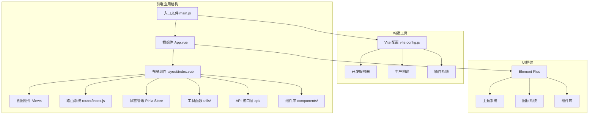
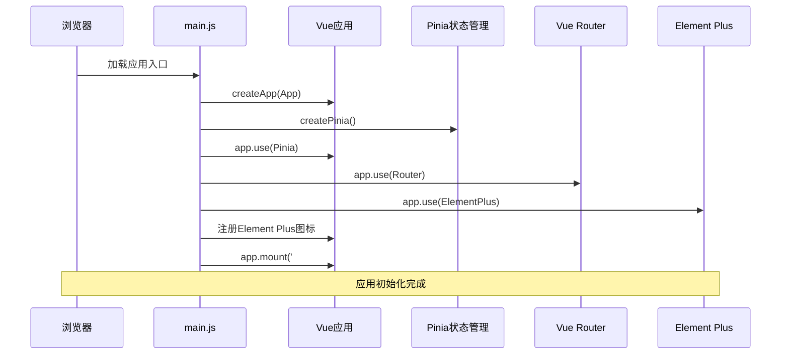
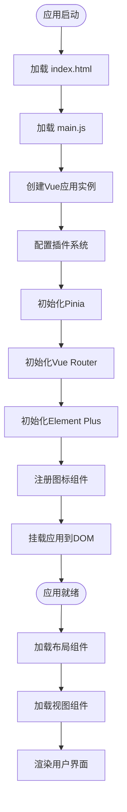
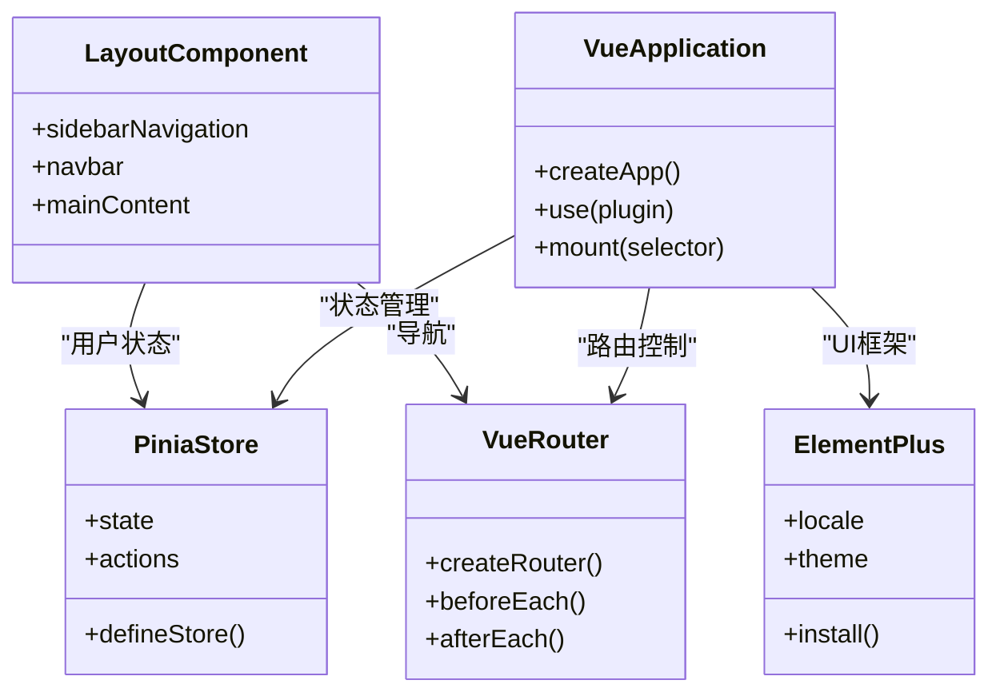
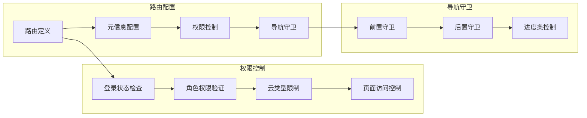
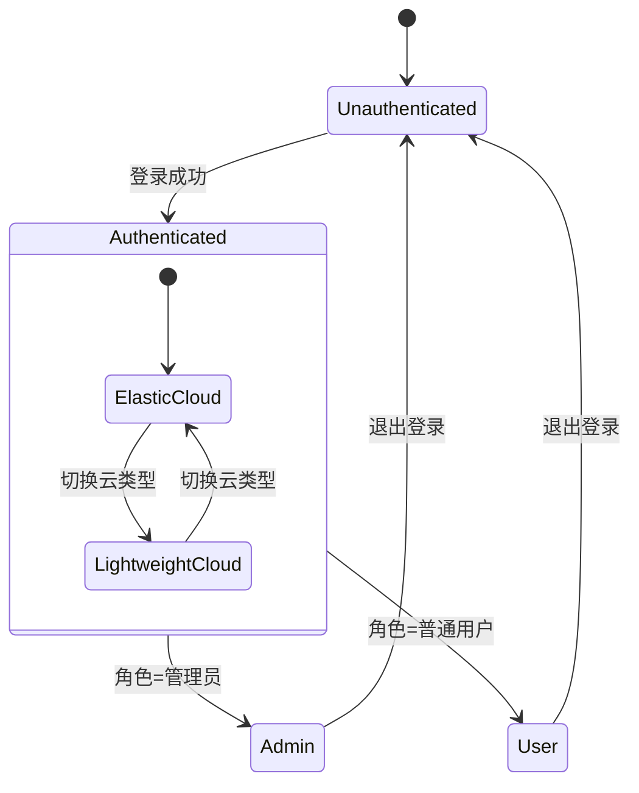
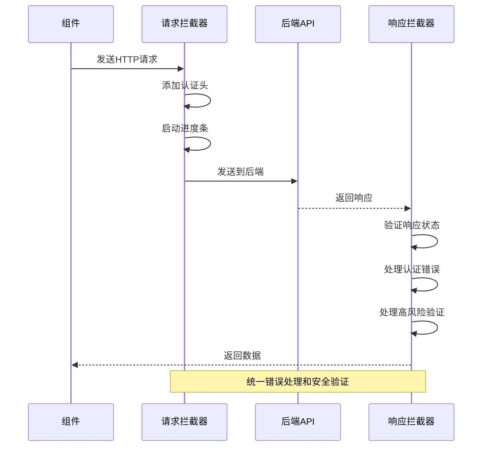
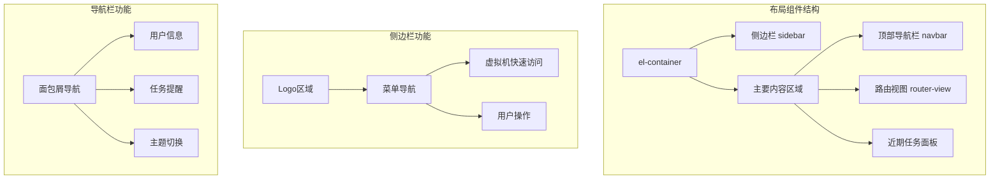
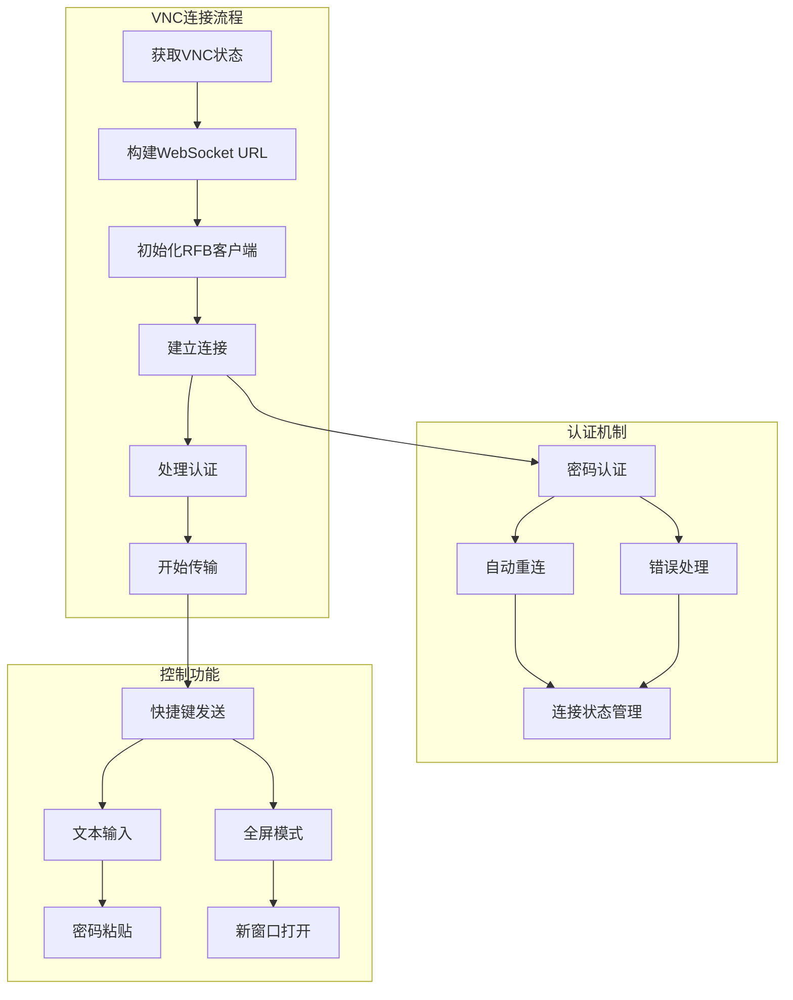
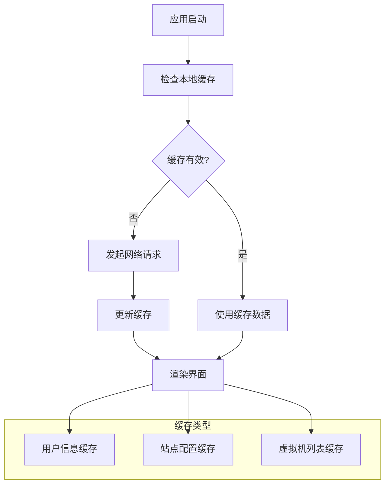

# Vue.js应用结构

<cite>
**本文档引用的文件**
- [main.js](file://web/src/main.js)
- [App.vue](file://web/src/App.vue)
- [vite.config.js](file://web/vite.config.js)
- [package.json](file://web/package.json)
- [index.html](file://web/index.html)
- [router/index.js](file://web/src/router/index.js)
- [store/user.js](file://web/src/store/user.js)
- [utils/site.js](file://web/src/utils/site.js)
- [utils/request.js](file://web/src/utils/request.js)
- [layout/index.vue](file://web/src/layout/index.vue)
- [api/auth.js](file://web/src/api/auth.js)
- [views/dashboard/index.vue](file://web/src/views/dashboard/index.vue)
- [components/VncConsole.vue](file://web/src/components/VncConsole.vue)
- [style.css](file://web/src/style.css)
</cite>

## 目录
1. [引言](#引言)
2. [项目结构](#项目结构)
3. [核心组件](#核心组件)
4. [架构概览](#架构概览)
5. [详细组件分析](#详细组件分析)
6. [依赖分析](#依赖分析)
7. [性能考虑](#性能考虑)
8. [故障排除指南](#故障排除指南)
9. [结论](#结论)

## 引言

这是一个基于Vue.js 3构建的现代化前端应用，采用Vite作为构建工具，集成了Element Plus UI框架、Pinia状态管理、Vue Router路由系统等核心技术栈。该应用提供了完整的虚拟机管理控制台功能，包括用户认证、虚拟机监控、VNC远程控制等核心业务功能。

## 项目结构

### 整体架构设计



**图表来源**
- [main.js:1-26](file://web/src/main.js#L1-L26)
- [App.vue:1-64](file://web/src/App.vue#L1-L64)
- [vite.config.js:1-27](file://web/vite.config.js#L1-L27)

### 目录组织原则

应用采用功能驱动的模块化组织方式：

- **src/**: 源代码目录
  - **api/**: API接口封装层
  - **components/**: 可复用组件
  - **layout/**: 布局组件
  - **router/**: 路由配置
  - **store/**: 状态管理
  - **utils/**: 工具函数
  - **views/**: 页面视图组件
- **public/**: 静态资源
- **构建配置**: vite.config.js, package.json

**章节来源**
- [main.js:1-26](file://web/src/main.js#L1-L26)
- [package.json:1-30](file://web/package.json#L1-L30)

## 核心组件

### 应用入口点 main.js

应用入口点负责初始化Vue应用实例、配置插件系统和全局依赖注入：



**图表来源**
- [main.js:13-25](file://web/src/main.js#L13-L25)

### 根组件 App.vue

根组件作为应用的顶层容器，提供国际化支持和全局样式配置：

- **国际化配置**: 使用Element Plus的简体中文语言包
- **全局样式**: 定义CSS变量和响应式设计
- **文档标题**: 动态更新浏览器标题

**章节来源**
- [App.vue:1-64](file://web/src/App.vue#L1-L64)
- [main.js:17-19](file://web/src/main.js#L17-L19)

## 架构概览

### 应用启动流程



**图表来源**
- [index.html:12-24](file://web/index.html#L12-L24)
- [main.js:13-25](file://web/src/main.js#L13-L25)

### 系统架构组件



**图表来源**
- [main.js:15-19](file://web/src/main.js#L15-L19)
- [layout/index.vue:1-800](file://web/src/layout/index.vue#L1-L800)

## 详细组件分析

### 路由系统分析

路由系统采用Vue Router 5，实现了完整的权限控制和页面导航功能：



**图表来源**
- [router/index.js:9-180](file://web/src/router/index.js#L9-L180)

#### 路由权限控制机制

路由系统实现了多层次的权限控制：

1. **公开路径**: 登录、邀请注册、密码重置等无需认证
2. **令牌验证**: 检查localStorage中的token
3. **角色权限**: 管理员特殊权限
4. **云类型限制**: 区分弹性云和轻量云的不同功能

**章节来源**
- [router/index.js:148-177](file://web/src/router/index.js#L148-L177)

### 状态管理系统

应用使用Pinia作为状态管理解决方案，主要包含用户状态和虚拟机状态：



**图表来源**
- [store/user.js:4-49](file://web/src/store/user.js#L4-L49)

#### 用户状态管理

用户状态持久化存储在localStorage中，包括：
- 认证令牌(token)
- 用户信息(username, role)
- 云类型(cloud_type)
- 安全配置(security)

**章节来源**
- [store/user.js:1-49](file://web/src/store/user.js#L1-L49)

### 请求拦截器系统

应用实现了完整的HTTP请求拦截器，提供统一的错误处理和安全验证：



**图表来源**
- [utils/request.js:46-206](file://web/src/utils/request.js#L46-L206)

#### 高风险操作处理

应用实现了复杂的高风险操作验证机制：

1. **428状态码处理**: 触发高风险验证流程
2. **TOTP验证**: Google Authenticator等二次验证
3. **邮箱验证码**: 6位数字验证码
4. **恢复码机制**: 16位恢复码用于紧急情况

**章节来源**
- [utils/request.js:121-145](file://web/src/utils/request.js#L121-L145)

### 布局系统分析

布局组件提供了完整的应用界面框架，包括侧边栏导航、顶部导航栏和主要内容区域：



**图表来源**
- [layout/index.vue:1-800](file://web/src/layout/index.vue#L1-L800)

#### 响应式设计实现

布局系统实现了完整的移动端适配：

- **移动端检测**: 自适应侧边栏折叠
- **触摸手势**: 支持移动端滑动手势
- **字体缩放**: 根据屏幕尺寸调整字体大小
- **组件重排**: 关键组件在小屏幕下的重新排列

**章节来源**
- [layout/index.vue:517-577](file://web/src/layout/index.vue#L517-L577)

### VNC控制台组件

VNC控制台组件集成了noVNC技术，提供了完整的远程桌面控制功能：



**图表来源**
- [components/VncConsole.vue:252-320](file://web/src/components/VncConsole.vue#L252-L320)

#### VNC安全特性

组件实现了多重安全保护机制：

1. **对外暴露控制**: 可选择监听内网或公网
2. **密码保护**: 支持最多8位密码
3. **连接验证**: 实时连接状态监控
4. **异常处理**: 完善的错误恢复机制

**章节来源**
- [components/VncConsole.vue:468-497](file://web/src/components/VncConsole.vue#L468-L497)

## 依赖分析

### 核心依赖关系

```mermaid
graph TB
subgraph "Vue生态"
A[Vue 3.5.30] --> B[Vue Router 5.0.3]
A --> C[Pinia 3.0.4]
A --> D[Element Plus 2.13.5]
end
subgraph "构建工具"
E[Vite 8.0.0] --> F[@vitejs/plugin-vue]
E --> G[开发服务器]
E --> H[生产构建]
end
subgraph "第三方库"
I[axios 1.15.2] --> J[HTTP客户端]
K[echarts 6.0.0] --> L[数据可视化]
M[@novnc/novnc 1.7.0] --> N[VNC客户端]
O[xterm 5.3.0] --> P[终端模拟]
end
subgraph "开发依赖"
Q[nprogress 0.2.0] --> R[进度条]
S[qrcode 1.5.4] --> T[二维码生成]
end
```

**图表来源**
- [package.json:11-28](file://web/package.json#L11-L28)

### 开发与生产环境差异

| 特性 | 开发环境 | 生产环境 |
|------|----------|----------|
| **构建工具** | Vite开发服务器 | Vite生产构建 |
| **代理配置** | 本地API代理 | 静态资源部署 |
| **调试工具** | Vue DevTools | 生产优化 |
| **代码分割** | 按需加载 | 预构建优化 |
| **压缩策略** | 开发友好 | 代码压缩 |
| **Source Map** | 完整映射 | 简化映射 |

**章节来源**
- [vite.config.js:14-26](file://web/vite.config.js#L14-L26)
- [package.json:6-10](file://web/package.json#L6-L10)

## 性能考虑

### 代码分割策略

应用采用了智能的代码分割策略：

1. **路由级别的懒加载**: 使用动态导入实现按需加载
2. **组件级别的延迟加载**: 大型组件按需加载
3. **第三方库分离**: 独立打包常用的第三方库
4. **CSS模块化**: 按页面分离样式文件

### 缓存策略



### 性能优化技巧

1. **虚拟滚动**: 大列表使用虚拟滚动提升性能
2. **防抖节流**: 输入框和搜索功能使用防抖
3. **图片懒加载**: 非关键图片延迟加载
4. **组件缓存**: 频繁访问的组件使用keep-alive

## 故障排除指南

### 常见问题诊断

#### 登录认证问题

**症状**: 无法登录或频繁掉线
**排查步骤**:
1. 检查localStorage中的token是否有效
2. 验证后端API是否正常响应
3. 确认网络连接稳定
4. 检查浏览器Cookie设置

**解决方案**:
- 清除浏览器缓存重新登录
- 检查服务器时间同步
- 验证SSL证书有效性

#### VNC连接失败

**症状**: VNC无法连接或连接不稳定
**排查步骤**:
1. 检查虚拟机状态是否为运行或暂停
2. 验证VNC服务是否正常启动
3. 确认防火墙设置允许连接
4. 检查WebSocket连接状态

**解决方案**:
- 重启VNC服务
- 调整防火墙规则
- 检查网络延迟
- 尝试不同浏览器

#### 性能问题

**症状**: 页面加载缓慢或操作卡顿
**排查步骤**:
1. 检查网络请求响应时间
2. 分析浏览器性能指标
3. 监控内存使用情况
4. 检查第三方库版本

**解决方案**:
- 启用代码压缩
- 实施缓存策略
- 优化图片资源
- 减少不必要的组件渲染

**章节来源**
- [utils/request.js:147-206](file://web/src/utils/request.js#L147-L206)
- [components/VncConsole.vue:252-320](file://web/src/components/VncConsole.vue#L252-L320)

## 结论

该Vue.js应用展现了现代前端开发的最佳实践，具有以下特点：

1. **架构清晰**: 采用模块化设计，职责分离明确
2. **技术先进**: 使用Vue 3 Composition API和最新的生态系统
3. **用户体验**: 完善的响应式设计和交互体验
4. **安全性强**: 多层次的安全验证和防护机制
5. **可维护性**: 良好的代码组织和文档规范

应用在虚拟机管理领域提供了完整的技术解决方案，通过合理的架构设计和性能优化，为用户提供了稳定可靠的远程管理体验。未来可以在微服务架构、容器化部署等方面进一步优化，以适应更大规模的应用场景。