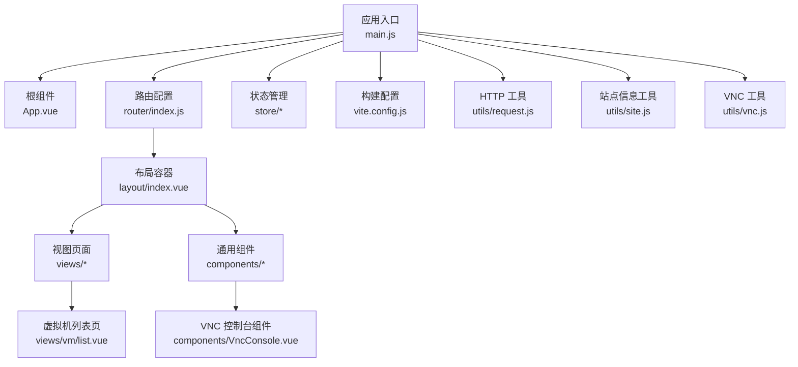
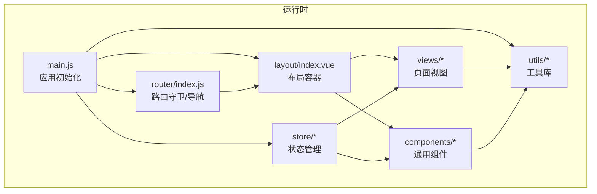
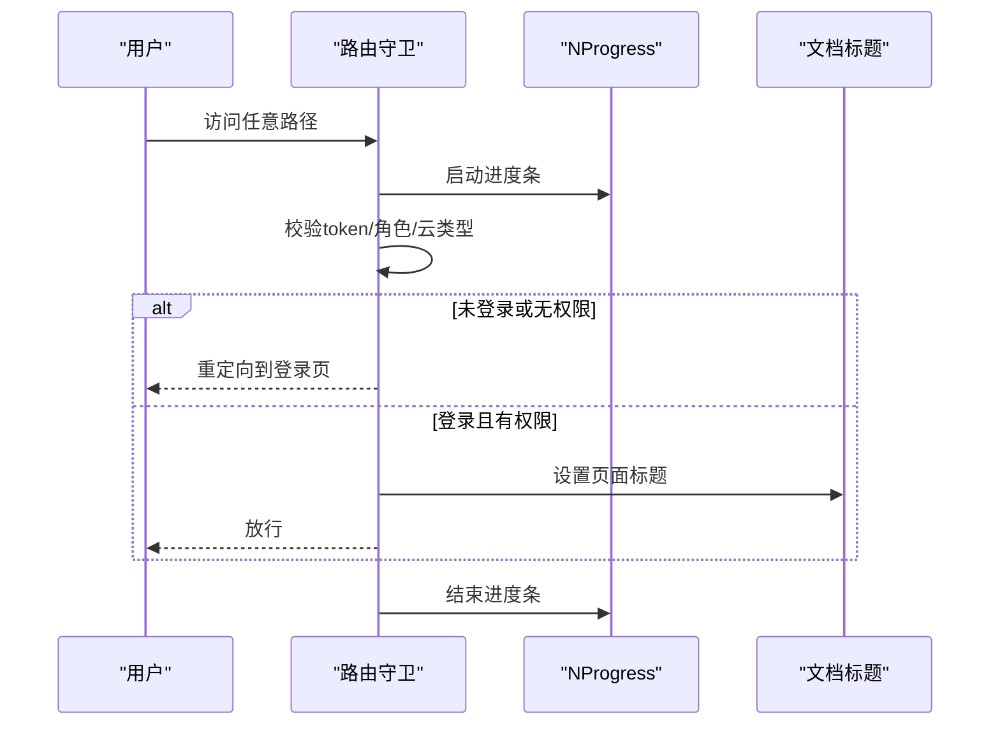
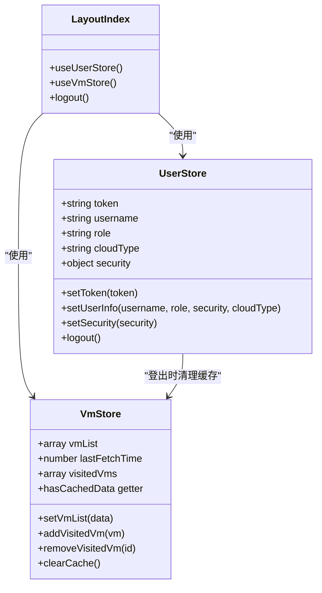
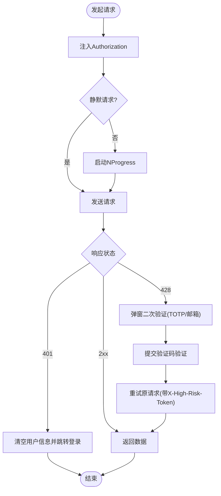
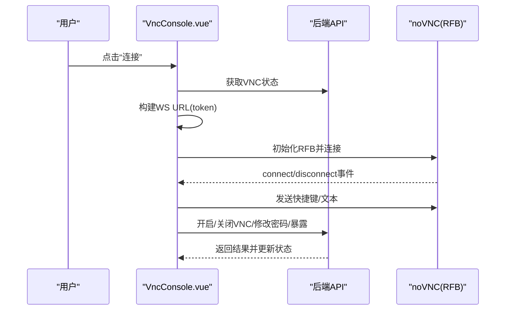
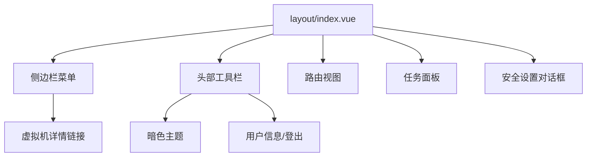
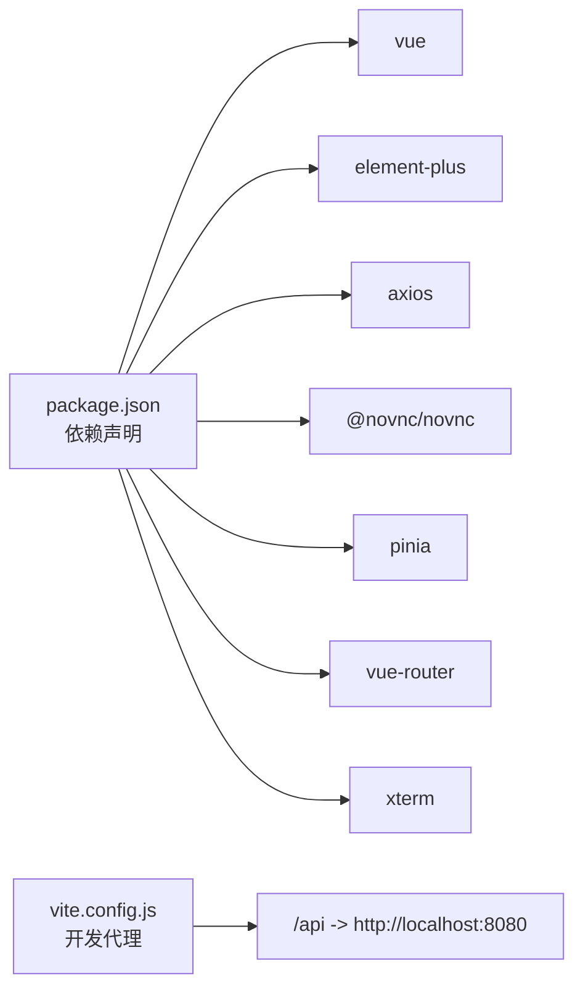

# 前端应用架构

<cite>
**本文档引用的文件**
- [package.json](file://web/package.json)
- [main.js](file://web/src/main.js)
- [router/index.js](file://web/src/router/index.js)
- [store/user.js](file://web/src/store/user.js)
- [store/vm.js](file://web/src/store/vm.js)
- [App.vue](file://web/src/App.vue)
- [vite.config.js](file://web/vite.config.js)
- [layout/index.vue](file://web/src/layout/index.vue)
- [utils/request.js](file://web/src/utils/request.js)
- [utils/site.js](file://web/src/utils/site.js)
- [utils/vnc.js](file://web/src/utils/vnc.js)
- [components/VncConsole.vue](file://web/src/components/VncConsole.vue)
- [views/vm/list.vue](file://web/src/views/vm/list.vue)
</cite>

## 目录
1. [引言](#引言)
2. [项目结构](#项目结构)
3. [核心组件](#核心组件)
4. [架构总览](#架构总览)
5. [详细组件分析](#详细组件分析)
6. [依赖分析](#依赖分析)
7. [性能考虑](#性能考虑)
8. [故障排除指南](#故障排除指南)
9. [结论](#结论)
10. [附录](#附录)

## 引言
本文件面向Open虚拟机管理控制台前端应用，系统性梳理基于Vue.js 3的前端架构设计，涵盖组件层次、路由配置、状态管理、UI组件设计与复用策略、HTTP客户端与VNC集成、开发与部署流程等。目标是帮助开发者快速理解并高效扩展该前端应用。

## 项目结构
前端位于web目录，采用Vite作为构建工具，使用Vue 3 + Element Plus + Pinia + Vue Router的现代前端技术栈。项目采用按功能域划分的目录结构，核心模块包括：
- 应用入口与全局配置：main.js、App.vue、vite.config.js
- 路由与导航：router/index.js、layout/index.vue
- 状态管理：store/user.js、store/vm.js
- 工具库：utils/request.js、utils/site.js、utils/vnc.js
- 组件与页面：components/VncConsole.vue、views/vm/list.vue等

**图表来源**
- [main.js:1-26](file://web/src/main.js#L1-L26)
- [router/index.js:1-180](file://web/src/router/index.js#L1-L180)
- [layout/index.vue:1-120](file://web/src/layout/index.vue#L1-L120)
- [utils/request.js:1-60](file://web/src/utils/request.js#L1-L60)
- [utils/site.js:1-58](file://web/src/utils/site.js#L1-L58)
- [utils/vnc.js:1-60](file://web/src/utils/vnc.js#L1-L60)
- [components/VncConsole.vue:1-60](file://web/src/components/VncConsole.vue#L1-L60)
- [views/vm/list.vue:1-60](file://web/src/views/vm/list.vue#L1-L60)

**章节来源**
- [package.json:1-30](file://web/package.json#L1-L30)
- [main.js:1-26](file://web/src/main.js#L1-L26)
- [vite.config.js:1-27](file://web/vite.config.js#L1-L27)

## 核心组件
- 应用入口与初始化：创建Vue实例、安装Element Plus、Pinia、路由；全局注册图标组件；引入全局样式。
- 根组件：提供语言环境配置与标题同步。
- 路由系统：定义登录、仪表盘、虚拟机列表/详情、模板、网络、存储、用户、调度、设置、任务中心、关于等页面；内置前置守卫进行鉴权与权限控制。
- 状态管理：Pinia Store，包含用户信息与虚拟机列表缓存；持久化到localStorage。
- HTTP客户端：基于Axios封装，统一请求头、鉴权令牌注入、响应拦截与高风险操作二次验证。
- VNC工具：noVNC封装，提供快捷键、文本输入、全屏、对外暴露开关等能力。
- 布局与导航：侧边栏菜单、面包屑标题、暗色主题、任务面板、安全设置对话框等。

**章节来源**
- [main.js:1-26](file://web/src/main.js#L1-L26)
- [App.vue:1-64](file://web/src/App.vue#L1-L64)
- [router/index.js:1-180](file://web/src/router/index.js#L1-L180)
- [store/user.js:1-49](file://web/src/store/user.js#L1-L49)
- [store/vm.js:1-61](file://web/src/store/vm.js#L1-L61)
- [utils/request.js:1-209](file://web/src/utils/request.js#L1-L209)
- [utils/vnc.js:1-316](file://web/src/utils/vnc.js#L1-L316)
- [layout/index.vue:1-120](file://web/src/layout/index.vue#L1-L120)

## 架构总览
前端采用“入口初始化 → 路由驱动 → 布局容器 → 视图页面/组件 → 工具库”的分层架构。路由负责页面导航与权限校验，布局容器承载菜单、头部、任务面板等公共UI；视图与组件聚焦业务功能；工具库提供HTTP与VNC等横切能力。

**图表来源**
- [main.js:1-26](file://web/src/main.js#L1-L26)
- [router/index.js:143-179](file://web/src/router/index.js#L143-L179)
- [layout/index.vue:1-120](file://web/src/layout/index.vue#L1-L120)
- [utils/request.js:1-60](file://web/src/utils/request.js#L1-L60)
- [store/user.js:1-49](file://web/src/store/user.js#L1-L49)
- [store/vm.js:1-61](file://web/src/store/vm.js#L1-L61)

## 详细组件分析

### 路由与导航
- 路由结构：登录、邀请注册、重置密码、仪表盘、虚拟机列表/详情、模板、网络、存储、用户、调度、设置、任务中心、关于等。
- 权限控制：前置守卫检查token与角色；轻量云场景限制非管理员可见范围；禁止访问未开放路径。
- 进度条与标题：NProgress全局进度；applyDocumentTitle设置页面标题；同步站点标题。

**图表来源**
- [router/index.js:148-177](file://web/src/router/index.js#L148-L177)
- [utils/site.js:44-48](file://web/src/utils/site.js#L44-L48)

**章节来源**
- [router/index.js:1-180](file://web/src/router/index.js#L1-L180)
- [utils/site.js:1-58](file://web/src/utils/site.js#L1-L58)

### 状态管理（Pinia）
- 用户Store：token、用户名、角色、云类型、安全信息持久化；登出清理缓存与虚拟机列表缓存。
- 虚拟机Store：虚拟机列表缓存、最近访问列表、缓存时间戳；提供清除缓存方法。
- 设计要点：模块化拆分、与路由守卫配合、与布局容器交互。

**图表来源**
- [store/user.js:1-49](file://web/src/store/user.js#L1-L49)
- [store/vm.js:1-61](file://web/src/store/vm.js#L1-L61)
- [layout/index.vue:476-499](file://web/src/layout/index.vue#L476-L499)

**章节来源**
- [store/user.js:1-49](file://web/src/store/user.js#L1-L49)
- [store/vm.js:1-61](file://web/src/store/vm.js#L1-L61)
- [layout/index.vue:476-499](file://web/src/layout/index.vue#L476-L499)

### HTTP客户端与安全
- Axios封装：统一baseURL、超时、请求头注入Authorization；响应拦截统一错误提示与401登出。
- 高风险操作：428状态触发二次验证，支持TOTP与邮箱验证码；自动注入X-High-Risk-Token。
- 进度条：并发请求计数，避免重复启动/结束NProgress。

**图表来源**
- [utils/request.js:46-206](file://web/src/utils/request.js#L46-L206)

**章节来源**
- [utils/request.js:1-209](file://web/src/utils/request.js#L1-L209)

### VNC控制台组件
- noVNC集成：根据token构建WebSocket URL；连接/断开；认证回调；异常处理。
- 快捷键与文本输入：提供常用组合键与逐字符发送文本；支持Caps Lock与特殊字符映射。
- UI交互：开启/关闭VNC、修改密码、对外暴露开关、全屏、在新窗口打开、粘贴密码等。

**图表来源**
- [components/VncConsole.vue:252-330](file://web/src/components/VncConsole.vue#L252-L330)
- [utils/vnc.js:129-168](file://web/src/utils/vnc.js#L129-L168)

**章节来源**
- [components/VncConsole.vue:1-637](file://web/src/components/VncConsole.vue#L1-L637)
- [utils/vnc.js:1-316](file://web/src/utils/vnc.js#L1-L316)

### 布局容器与导航
- 侧边栏：按角色与云类型动态渲染菜单项；移动端折叠；最近访问虚拟机列表。
- 头部：暗色主题切换、任务面板、用户下拉菜单、安全设置对话框。
- 页面标题：结合路由meta与站点标题同步。

**图表来源**
- [layout/index.vue:1-120](file://web/src/layout/index.vue#L1-L120)

**章节来源**
- [layout/index.vue:1-120](file://web/src/layout/index.vue#L1-L120)

### 虚拟机列表页
- 搜索、分组、视图切换（卡片/列表）、批量操作、自动刷新、分页。
- 资源使用进度条、IP加载、磁盘占用查询、更多操作下拉菜单。
- 轻量云模式下的特殊面板与限制。

**章节来源**
- [views/vm/list.vue:1-800](file://web/src/views/vm/list.vue#L1-L800)

## 依赖分析
- 运行时依赖：Vue 3、Element Plus、Axios、@novnc/novnc、Pinia、vue-router、xterm等。
- 构建依赖：Vite插件、ES模块脚本。
- 代理与服务端：开发环境通过Vite代理将/api前缀转发至后端，支持WebSocket。

**图表来源**
- [package.json:11-28](file://web/package.json#L11-L28)
- [vite.config.js:17-24](file://web/vite.config.js#L17-L24)

**章节来源**
- [package.json:1-30](file://web/package.json#L1-L30)
- [vite.config.js:1-27](file://web/vite.config.js#L1-L27)

## 性能考虑
- 路由懒加载：路由组件使用动态导入，减少首屏体积。
- 请求并发控制：NProgress计数避免重复启动；高风险二次验证避免频繁弹窗。
- 组件级优化：VNC组件在断开时释放资源；列表页分页与分组渲染降低DOM压力。
- 样式与主题：Element Plus按需引入与CSS变量，支持暗色主题切换。

[本节为通用指导，无需特定文件引用]

## 故障排除指南
- 登录态失效：401响应触发用户登出与跳转登录。
- 高风险操作被阻：428状态触发二次验证，支持TOTP与邮箱验证码；取消验证抛出特定错误。
- VNC连接异常：断开事件捕获并提示；认证失败提示密码错误；异常断开提示。
- 站点标题不同步：同步公共设置后写入localStorage并更新document.title。

**章节来源**
- [utils/request.js:147-206](file://web/src/utils/request.js#L147-L206)
- [components/VncConsole.vue:286-315](file://web/src/components/VncConsole.vue#L286-L315)
- [utils/site.js:50-57](file://web/src/utils/site.js#L50-L57)

## 结论
该前端应用以Vue 3为核心，结合Element Plus与Pinia，形成清晰的分层架构：入口初始化、路由驱动、布局容器、视图与组件、工具库。通过HTTP工具与VNC工具实现与后端的稳定交互，借助Pinia实现跨组件的状态共享与持久化。整体设计具备良好的可维护性与扩展性，适合在现有基础上持续迭代。

## 附录

### 前端开发指南
- 组件开发：遵循单一职责，使用Composition API；在layout中统一处理权限与标题；通过utils封装横切逻辑。
- 样式定制：利用Element Plus主题变量与CSS变量；保持暗色主题一致性；组件样式作用域化。
- 性能优化：路由组件懒加载；列表分页与分组；避免不必要的响应式数据；合理使用watch与computed。
- 安全：严格遵守高风险操作二次验证流程；避免在前端存储敏感信息；对用户输入进行校验与清理。

[本节为通用指导，无需特定文件引用]

### 前端部署与构建
- 构建命令：使用Vite进行生产构建，输出静态资源。
- 代理配置：开发环境通过Vite代理将/api前缀转发至后端，支持WebSocket。
- 环境变量：可通过VITE_APP_BASE_API覆盖默认baseURL。

**章节来源**
- [package.json:6-10](file://web/package.json#L6-L10)
- [vite.config.js:1-27](file://web/vite.config.js#L1-L27)