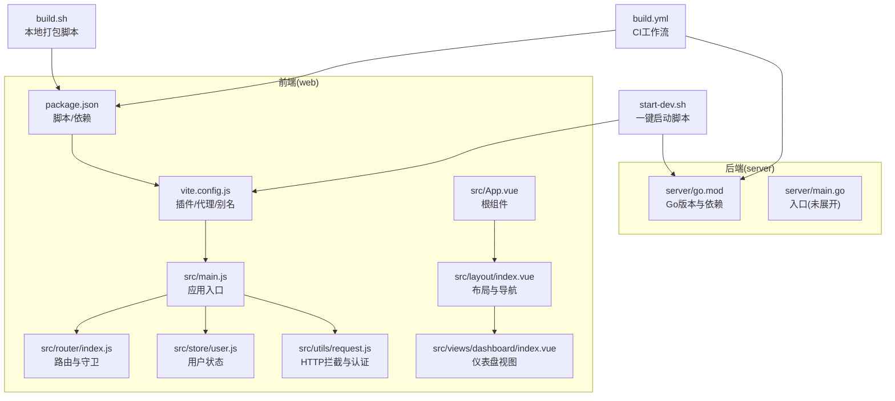
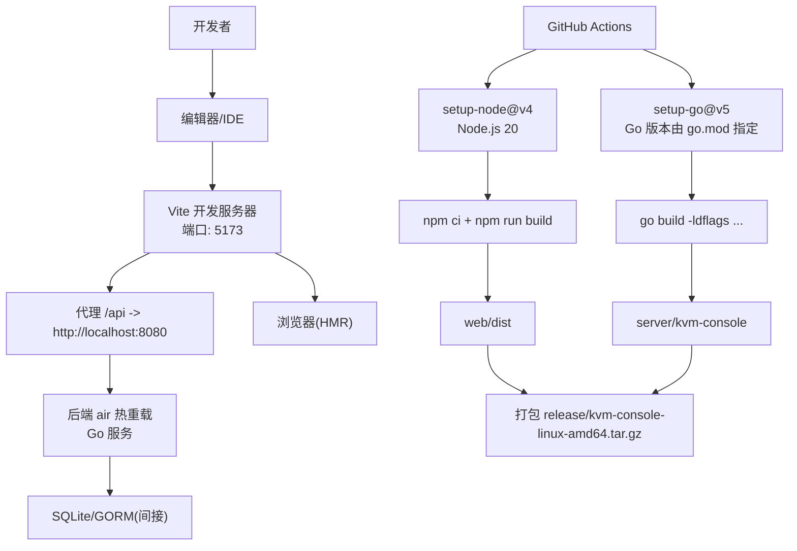
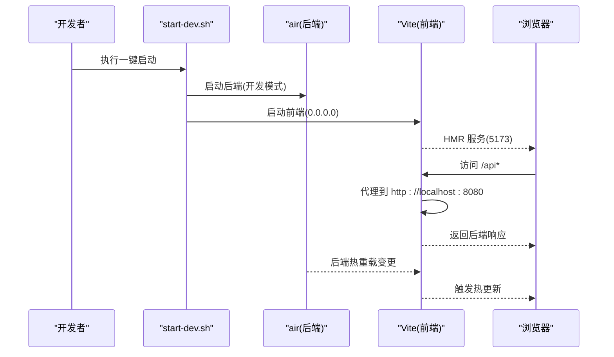
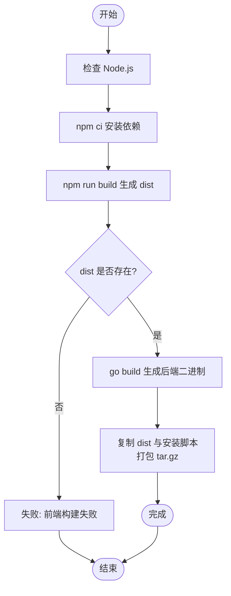
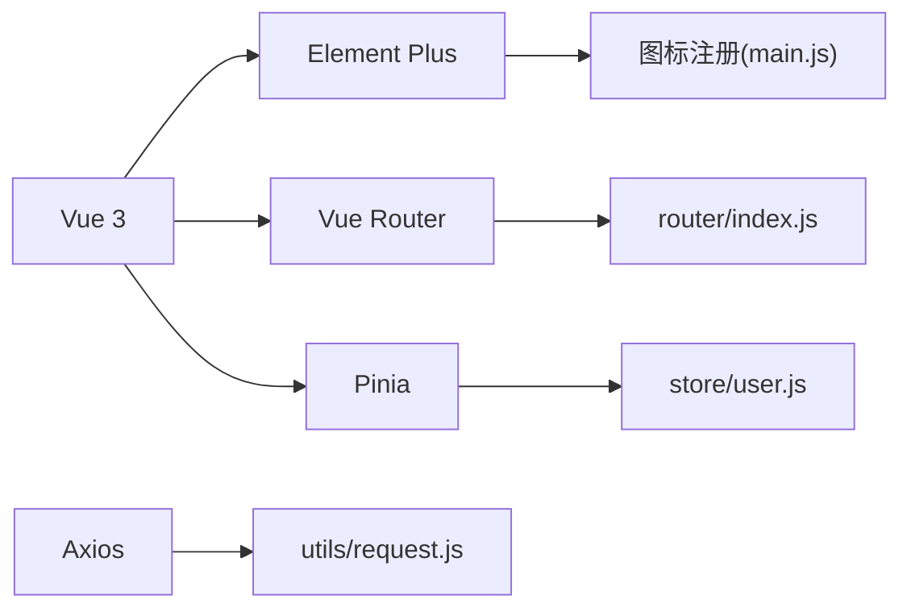

# 开发指南

<cite>
**本文引用的文件**
- [package.json](file://web/package.json)
- [vite.config.js](file://web/vite.config.js)
- [README.md](file://web/README.md)
- [start-dev.sh](file://start-dev.sh)
- [build.sh](file://build.sh)
- [build.yml](file://.github/workflows/build.yml)
- [go.mod](file://server/go.mod)
- [main.js](file://web/src/main.js)
- [router/index.js](file://web/src/router/index.js)
- [store/user.js](file://web/src/store/user.js)
- [utils/request.js](file://web/src/utils/request.js)
- [App.vue](file://web/src/App.vue)
- [layout/index.vue](file://web/src/layout/index.vue)
- [views/dashboard/index.vue](file://web/src/views/dashboard/index.vue)
</cite>

## 目录
1. [简介](#简介)
2. [项目结构](#项目结构)
3. [核心组件](#核心组件)
4. [架构总览](#架构总览)
5. [详细组件分析](#详细组件分析)
6. [依赖关系分析](#依赖关系分析)
7. [性能考虑](#性能考虑)
8. [故障排查指南](#故障排查指南)
9. [结论](#结论)
10. [附录](#附录)

## 简介
本指南面向前端开发者，覆盖开发环境搭建、依赖安装、开发服务器启动与热重载、代码规范与ESLint使用、构建流程与打包优化、组件开发最佳实践、调试技巧与工具、性能优化策略以及部署前检查清单与测试流程。文档中的所有技术细节均来自仓库现有文件，确保可操作与可追溯。

## 项目结构
前端位于 web 目录，采用 Vue 3 + Vite 技术栈；后端位于 server 目录，采用 Go 语言。开发脚本提供一键启动前后端服务的能力，并通过 GitHub Actions 实现 CI 构建与打包。

**图表来源**
- [package.json:1-30](file://web/package.json#L1-L30)
- [vite.config.js:1-27](file://web/vite.config.js#L1-L27)
- [main.js:1-26](file://web/src/main.js#L1-L26)
- [router/index.js:1-180](file://web/src/router/index.js#L1-L180)
- [store/user.js:1-49](file://web/src/store/user.js#L1-L49)
- [utils/request.js:1-209](file://web/src/utils/request.js#L1-L209)
- [App.vue:1-64](file://web/src/App.vue#L1-L64)
- [layout/index.vue:1-1516](file://web/src/layout/index.vue#L1-L1516)
- [views/dashboard/index.vue:1-1081](file://web/src/views/dashboard/index.vue#L1-L1081)
- [start-dev.sh:1-111](file://start-dev.sh#L1-L111)
- [build.sh:1-182](file://build.sh#L1-L182)
- [build.yml:1-144](file://.github/workflows/build.yml#L1-L144)
- [go.mod:1-51](file://server/go.mod#L1-L51)

**章节来源**
- [package.json:1-30](file://web/package.json#L1-L30)
- [vite.config.js:1-27](file://web/vite.config.js#L1-L27)
- [README.md:1-6](file://web/README.md#L1-L6)
- [start-dev.sh:1-111](file://start-dev.sh#L1-L111)
- [build.sh:1-182](file://build.sh#L1-L182)
- [build.yml:1-144](file://.github/workflows/build.yml#L1-L144)
- [go.mod:1-51](file://server/go.mod#L1-L51)

## 核心组件
- 应用入口与全局配置
  - 应用初始化、插件注册、国际化与主题、图标全局注册等，参见 [main.js:1-26](file://web/src/main.js#L1-L26)。
  - 根组件负责标题同步与站点标题同步，参见 [App.vue:1-64](file://web/src/App.vue#L1-L64)。
- 路由与导航
  - 路由定义、懒加载、前置守卫与标题设置，参见 [router/index.js:1-180](file://web/src/router/index.js#L1-L180)。
  - 布局组件包含侧边栏、顶部导航、任务面板、暗黑模式切换等，参见 [layout/index.vue:1-1516](file://web/src/layout/index.vue#L1-L1516)。
- 状态管理
  - 用户状态持久化与登出清理，参见 [store/user.js:1-49](file://web/src/store/user.js#L1-L49)。
- HTTP 请求与拦截
  - Axios 实例、超时、进度条、鉴权头注入、高风险操作二次验证流程、401登出等，参见 [utils/request.js:1-209](file://web/src/utils/request.js#L1-L209)。
- 视图与页面
  - 仪表盘视图展示资源监控、配额与虚拟机列表，参见 [views/dashboard/index.vue:1-1081](file://web/src/views/dashboard/index.vue#L1-L1081)。

**章节来源**
- [main.js:1-26](file://web/src/main.js#L1-L26)
- [App.vue:1-64](file://web/src/App.vue#L1-L64)
- [router/index.js:1-180](file://web/src/router/index.js#L1-L180)
- [layout/index.vue:1-1516](file://web/src/layout/index.vue#L1-L1516)
- [store/user.js:1-49](file://web/src/store/user.js#L1-L49)
- [utils/request.js:1-209](file://web/src/utils/request.js#L1-L209)
- [views/dashboard/index.vue:1-1081](file://web/src/views/dashboard/index.vue#L1-L1081)

## 架构总览
前端通过 Vite 提供开发服务器与热重载，路由守卫控制访问权限，Pinia 管理状态，Axios 统一处理请求与响应拦截。后端通过 air 实现 Go 热重载，前端通过代理将 /api 前缀转发到后端。CI 使用 GitHub Actions 在 Ubuntu 上分别安装 Node 与 Go，执行前端构建与后端编译，最终打包为发行包。

**图表来源**
- [vite.config.js:14-25](file://web/vite.config.js#L14-L25)
- [start-dev.sh:92-106](file://start-dev.sh#L92-L106)
- [build.yml:37-71](file://.github/workflows/build.yml#L37-L71)
- [go.mod:3-3](file://server/go.mod#L3-L3)

**章节来源**
- [vite.config.js:1-27](file://web/vite.config.js#L1-L27)
- [start-dev.sh:1-111](file://start-dev.sh#L1-L111)
- [build.yml:1-144](file://.github/workflows/build.yml#L1-L144)
- [go.mod:1-51](file://server/go.mod#L1-L51)

## 详细组件分析

### 开发环境与启动
- Node.js 与包管理
  - 推荐使用 Node.js 20（CI 中固定），使用 npm 作为包管理器，生产依赖与开发依赖在 [package.json:1-30](file://web/package.json#L1-L30) 中声明。
- 一键启动脚本
  - [start-dev.sh:1-111](file://start-dev.sh#L1-L111) 同时启动后端 air 热重载与前端 Vite 开发服务器，设置日志级别与终端输出，支持清理与信号处理。
- Vite 开发服务器
  - [vite.config.js:14-25](file://web/vite.config.js#L14-L25) 配置端口、host、代理到后端，支持 WebSocket（noVNC 需要）。
- 路由与权限
  - [router/index.js:148-177](file://web/src/router/index.js#L148-L177) 实现登录态校验与角色限制，结合 NProgress 展示页面加载进度。
- 应用入口与主题
  - [main.js:1-26](file://web/src/main.js#L1-L26) 注册 Element Plus、Pinia、路由与图标，[App.vue:1-64](file://web/src/App.vue#L1-L64) 同步文档标题。

**图表来源**
- [start-dev.sh:92-106](file://start-dev.sh#L92-L106)
- [vite.config.js:14-25](file://web/vite.config.js#L14-L25)

**章节来源**
- [package.json:1-30](file://web/package.json#L1-L30)
- [vite.config.js:1-27](file://web/vite.config.js#L1-L27)
- [router/index.js:148-177](file://web/src/router/index.js#L148-L177)
- [main.js:1-26](file://web/src/main.js#L1-L26)
- [App.vue:1-64](file://web/src/App.vue#L1-L64)
- [start-dev.sh:1-111](file://start-dev.sh#L1-L111)

### 代码规范与 ESLint 使用
- 当前仓库未提供 ESLint 配置文件与脚本，建议在 web 目录新增 ESLint 配置与 lint 脚本，以保证团队一致性。
- 建议遵循 Vue 3 与 TypeScript 最佳实践（如需 TS），并结合 Prettier 统一样式。

[本节为通用指导，不直接分析具体文件，因此不附加“章节来源”]

### 构建流程与打包优化
- 本地构建脚本
  - [build.sh:96-119](file://build.sh#L96-L119) 检查 Node 环境，执行 npm ci 与 npm run build，产出 web/dist；随后构建后端二进制，复制前端静态文件与安装脚本，打包为 release/kvm-console-linux-amd64.tar.gz。
- CI 构建
  - [build.yml:37-87](file://.github/workflows/build.yml#L37-L87) 固定 Node 20，按顺序安装依赖、构建前端、设置 Go（读取 server/go.mod）、构建后端，最后打包产物。
- 生产构建优化建议
  - 在 Vite 中启用压缩与代码分割（基于路由懒加载已实现），合理拆分第三方库与业务代码，开启 Gzip/Brotli 压缩（由服务器或 CDN 处理）。

**图表来源**
- [build.sh:96-145](file://build.sh#L96-L145)
- [build.yml:45-87](file://.github/workflows/build.yml#L45-L87)

**章节来源**
- [build.sh:1-182](file://build.sh#L1-L182)
- [build.yml:1-144](file://.github/workflows/build.yml#L1-L144)

### 组件开发最佳实践
- 组件设计原则
  - 单一职责：每个组件聚焦一个功能域，如 [layout/index.vue:1-1516](file://web/src/layout/index.vue#L1-L1516) 聚焦布局与导航。
  - 可复用性：将通用 UI 抽象为可复用组件（如图标、表单控件），并在 [main.js:21-23](file://web/src/main.js#L21-L23) 中全局注册。
  - 状态下沉：用户状态通过 Pinia 管理，避免跨层级传递，参见 [store/user.js:1-49](file://web/src/store/user.js#L1-L49)。
- 代码组织
  - 页面级组件按路由划分，如 [views/dashboard/index.vue:1-1081](file://web/src/views/dashboard/index.vue#L1-L1081)。
  - 工具与 API 封装在 utils 与 api 目录，便于复用与测试。
- 路由与权限
  - 使用路由元信息与前置守卫控制访问，参见 [router/index.js:148-177](file://web/src/router/index.js#L148-L177)。

**章节来源**
- [layout/index.vue:1-1516](file://web/src/layout/index.vue#L1-L1516)
- [main.js:21-23](file://web/src/main.js#L21-L23)
- [store/user.js:1-49](file://web/src/store/user.js#L1-L49)
- [router/index.js:148-177](file://web/src/router/index.js#L148-L177)
- [views/dashboard/index.vue:1-1081](file://web/src/views/dashboard/index.vue#L1-L1081)

### 调试技巧与开发工具
- Vite 热重载
  - 修改任意源码后，浏览器自动刷新或局部热替换，提升迭代效率。
- 代理与 WebSocket
  - [vite.config.js:17-24](file://web/vite.config.js#L17-L24) 配置 /api 代理与 ws 支持，适配 noVNC 等场景。
- 日志与环境变量
  - [start-dev.sh:74-90](file://start-dev.sh#L74-L90) 提供日志目录、级别、压缩、终端输出等环境变量，便于定位问题。
- Axios 拦截器
  - [utils/request.js:46-62](file://web/src/utils/request.js#L46-L62) 注入鉴权头，[utils/request.js:147-206](file://web/src/utils/request.js#L147-L206) 统一错误处理与 401 登出。
- 路由守卫
  - [router/index.js:148-177](file://web/src/router/index.js#L148-L177) 在进入与离开时进行进度条与标题设置。

**章节来源**
- [vite.config.js:1-27](file://web/vite.config.js#L1-L27)
- [start-dev.sh:74-90](file://start-dev.sh#L74-L90)
- [utils/request.js:46-62](file://web/src/utils/request.js#L46-L62)
- [utils/request.js:147-206](file://web/src/utils/request.js#L147-L206)
- [router/index.js:148-177](file://web/src/router/index.js#L148-L177)

### 性能优化策略
- 代码分割
  - 路由懒加载已在 [router/index.js:13-13](file://web/src/router/index.js#L13-L13) 实现，减少首屏体积。
- 图表与渲染
  - [views/dashboard/index.vue:538-581](file://web/src/views/dashboard/index.vue#L538-L581) 使用 ECharts 渲染环形图，注意在组件卸载时释放实例，避免内存泄漏。
- 请求与进度
  - [utils/request.js:9-23](file://web/src/utils/request.js#L9-L23) 通过计数器控制 NProgress 的启停，避免并发请求导致的进度异常。
- 暗黑模式与本地存储
  - [layout/index.vue:579-589](file://web/src/layout/index.vue#L579-L589) 使用 localStorage 切换主题，减少重复计算。

**章节来源**
- [router/index.js:13-13](file://web/src/router/index.js#L13-L13)
- [views/dashboard/index.vue:538-581](file://web/src/views/dashboard/index.vue#L538-L581)
- [utils/request.js:9-23](file://web/src/utils/request.js#L9-L23)
- [layout/index.vue:579-589](file://web/src/layout/index.vue#L579-L589)

## 依赖关系分析
- 前端依赖
  - Vue 3、Element Plus、Vue Router、Pinia、Axios、NProgress、xterm、ECharts 等，详见 [package.json:11-28](file://web/package.json#L11-L28)。
- 后端依赖
  - Go 版本由 [go.mod](file://server/go.mod#L3) 指定，使用 Gin、JWT、WebSocket、SQLite 等，详见 [go.mod:5-15](file://server/go.mod#L5-L15)。
- 开发与构建
  - Vite 插件与别名在 [vite.config.js:7-13](file://web/vite.config.js#L7-L13)；CI 使用 Node 20 与 Go 版本由 go.mod 指定，详见 [build.yml:37-59](file://.github/workflows/build.yml#L37-L59)。

**图表来源**
- [package.json:11-28](file://web/package.json#L11-L28)
- [main.js:1-26](file://web/src/main.js#L1-L26)
- [router/index.js:1-180](file://web/src/router/index.js#L1-L180)
- [store/user.js:1-49](file://web/src/store/user.js#L1-L49)
- [utils/request.js:1-209](file://web/src/utils/request.js#L1-L209)

**章节来源**
- [package.json:1-30](file://web/package.json#L1-L30)
- [go.mod:1-51](file://server/go.mod#L1-L51)
- [vite.config.js:1-27](file://web/vite.config.js#L1-L27)
- [build.yml:37-59](file://.github/workflows/build.yml#L37-L59)

## 性能考虑
- 首屏优化
  - 路由懒加载与按需引入组件，减少初始包体积。
- 资源加载
  - 合理拆分 vendor 与业务代码，利用浏览器缓存策略。
- 图表与动画
  - 对高频更新的图表组件，注意销毁与重绘频率，避免阻塞主线程。
- 网络请求
  - 统一拦截器处理错误与鉴权，避免重复请求与无效重试。

[本节为通用指导，不直接分析具体文件，因此不附加“章节来源”]

## 故障排查指南
- 启动失败
  - 检查 Node 与 npm 是否安装，参考 [build.yml:37-43](file://.github/workflows/build.yml#L37-L43) 与 [build.sh:99-101](file://build.sh#L99-L101)。
  - 确认 air 是否安装并可执行，参考 [start-dev.sh:40-53](file://start-dev.sh#L40-L53)。
- 代理与跨域
  - 确认 [vite.config.js:17-24](file://web/vite.config.js#L17-L24) 中 /api 代理指向正确地址。
- 登录与权限
  - 检查 [router/index.js:148-177](file://web/src/router/index.js#L148-L177) 的守卫逻辑与本地存储 token。
- 请求错误
  - 查看 [utils/request.js:147-206](file://web/src/utils/request.js#L147-L206) 的错误处理与 401 登出逻辑。
- CI 构建失败
  - 关注 Node 与 Go 版本匹配，参考 [build.yml:37-59](file://.github/workflows/build.yml#L37-L59) 与 [go.mod](file://server/go.mod#L3)。

**章节来源**
- [build.yml:37-59](file://.github/workflows/build.yml#L37-L59)
- [build.sh:99-101](file://build.sh#L99-L101)
- [start-dev.sh:40-53](file://start-dev.sh#L40-L53)
- [vite.config.js:17-24](file://web/vite.config.js#L17-L24)
- [router/index.js:148-177](file://web/src/router/index.js#L148-L177)
- [utils/request.js:147-206](file://web/src/utils/request.js#L147-L206)
- [go.mod](file://server/go.mod#L3)

## 结论
本指南基于仓库现有文件，系统梳理了前端开发的环境、启动、构建、组件与性能优化等关键环节。建议后续补充 ESLint 配置与脚本、完善单元测试与端到端测试，并在 CI 中增加质量门禁（如 Lint、测试覆盖率等），以进一步提升代码质量与交付稳定性。

## 附录
- 开发命令
  - 启动开发：参考 [start-dev.sh:96-106](file://start-dev.sh#L96-L106)。
  - 构建生产：参考 [build.sh:96-119](file://build.sh#L96-L119) 或 [build.yml:45-53](file://.github/workflows/build.yml#L45-L53)。
- 关键配置
  - Vite：[vite.config.js:1-27](file://web/vite.config.js#L1-L27)
  - 依赖与脚本：[package.json:1-30](file://web/package.json#L1-L30)
  - 后端版本：[go.mod](file://server/go.mod#L3)