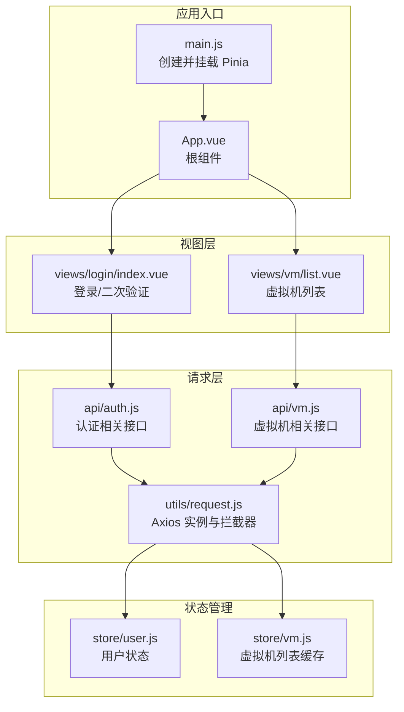
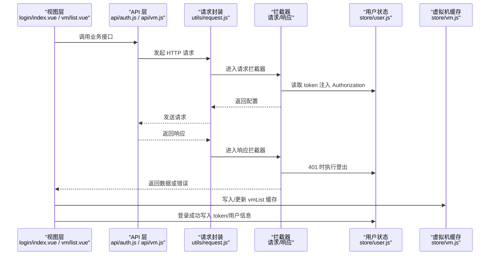
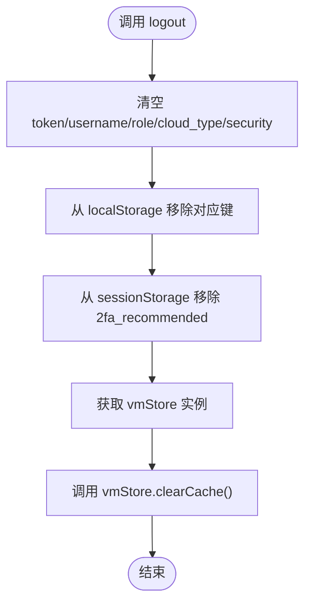
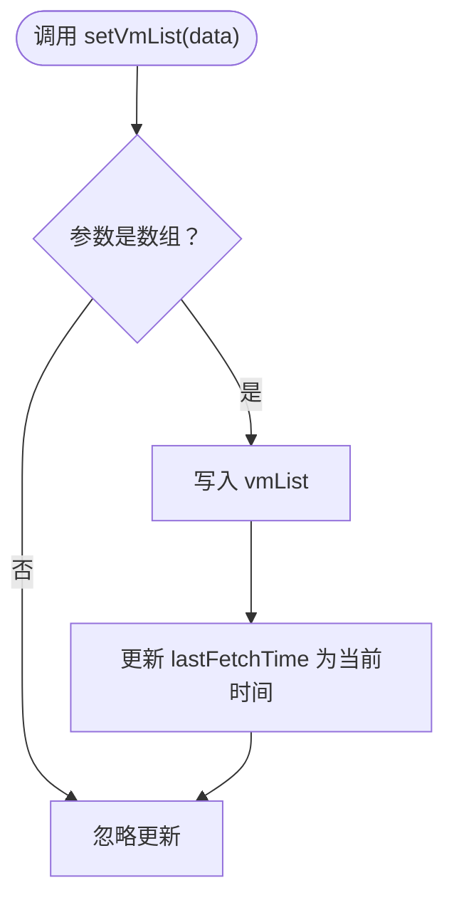
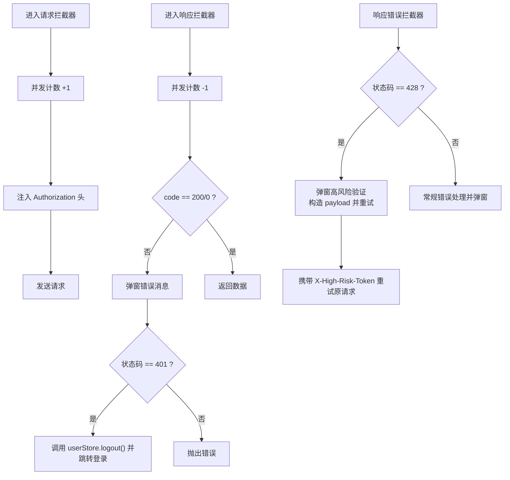
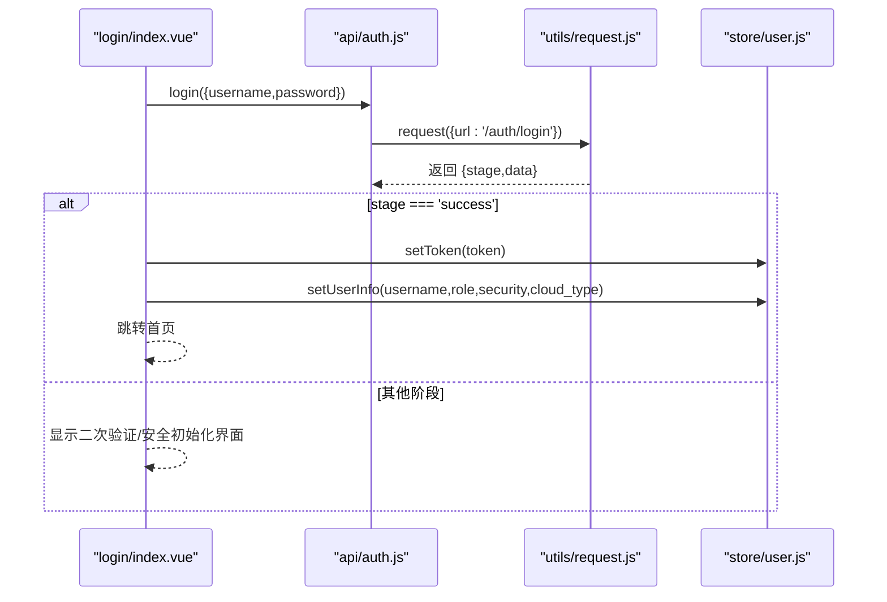
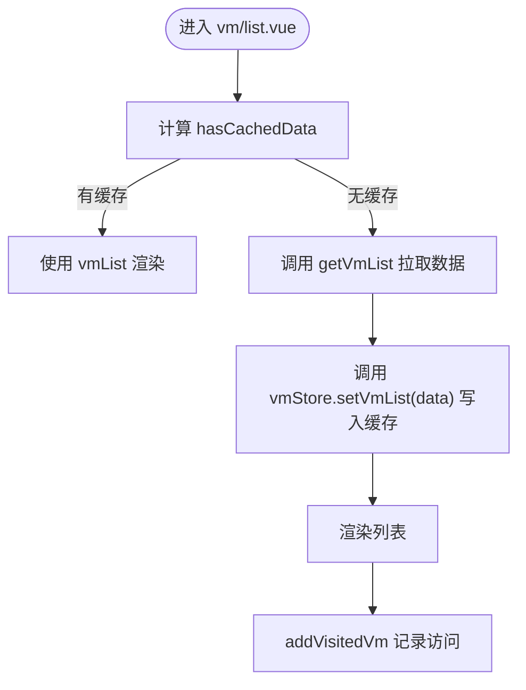
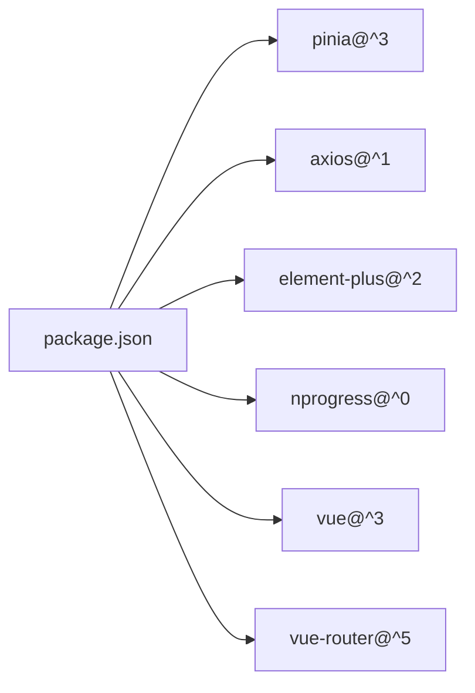

# 状态管理

<cite>
**本文引用的文件**
- [main.js](file://web/src/main.js)
- [App.vue](file://web/src/App.vue)
- [user.js](file://web/src/store/user.js)
- [vm.js](file://web/src/store/vm.js)
- [auth.js](file://web/src/api/auth.js)
- [vm.js](file://web/src/api/vm.js)
- [request.js](file://web/src/utils/request.js)
- [login/index.vue](file://web/src/views/login/index.vue)
- [vm/list.vue](file://web/src/views/vm/list.vue)
- [package.json](file://web/package.json)
</cite>

## 目录
1. [引言](#引言)
2. [项目结构](#项目结构)
3. [核心组件](#核心组件)
4. [架构总览](#架构总览)
5. [详细组件分析](#详细组件分析)
6. [依赖分析](#依赖分析)
7. [性能考虑](#性能考虑)
8. [故障排查指南](#故障排查指南)
9. [结论](#结论)
10. [附录](#附录)

## 引言
本文件聚焦于前端状态管理，基于仓库中现有的 Pinia 状态管理与 Axios 请求封装，系统性梳理用户状态与虚拟机列表缓存的组织结构、模块化设计与交互流程。内容涵盖：
- 用户状态与虚拟机状态的定义、变更与获取机制
- API 请求的状态管理（loading、错误、高风险二次验证）
- 数据持久化（本地存储与会话存储）
- 状态同步与数据更新最佳实践
- 调试与开发工具使用建议
- 跨组件状态共享与通信机制

## 项目结构
前端位于 web/src 目录，关键文件如下：
- 应用入口与状态注入：main.js、App.vue
- 状态管理：store/user.js、store/vm.js
- API 封装与请求拦截：utils/request.js、api/auth.js、api/vm.js
- 使用示例：views/login/index.vue、views/vm/list.vue
- 依赖声明：package.json

图表来源
- [main.js:1-26](file://web/src/main.js#L1-L26)
- [App.vue:1-64](file://web/src/App.vue#L1-L64)
- [user.js:1-49](file://web/src/store/user.js#L1-L49)
- [vm.js:1-61](file://web/src/store/vm.js#L1-L61)
- [request.js:1-209](file://web/src/utils/request.js#L1-L209)
- [auth.js:1-180](file://web/src/api/auth.js#L1-L180)
- [vm.js:1-705](file://web/src/api/vm.js#L1-L705)
- [login/index.vue:1-1133](file://web/src/views/login/index.vue#L1-L1133)
- [vm/list.vue:1-2768](file://web/src/views/vm/list.vue#L1-L2768)

章节来源
- [main.js:1-26](file://web/src/main.js#L1-L26)
- [package.json:1-30](file://web/package.json#L1-L30)

## 核心组件
- Pinia 注入与全局配置：在应用入口创建并安装 Pinia，供全局使用。
- 用户状态模块（user.js）：集中管理 token、用户名、角色、云类型、安全配置等，并与本地存储联动；提供登出清理逻辑。
- 虚拟机列表缓存模块（vm.js）：维护 vmList、lastFetchTime、visitedVms，提供缓存写入、访问记录、清空缓存等动作。
- 请求封装与拦截（request.js）：统一 baseURL、请求并发 loading、鉴权头注入、401 自动登出、高风险二次验证流程。
- 视图层使用示例：登录页触发认证流程并写入用户状态；虚拟机列表页触发 API 请求并写入 vm 列表缓存。

章节来源
- [user.js:1-49](file://web/src/store/user.js#L1-L49)
- [vm.js:1-61](file://web/src/store/vm.js#L1-L61)
- [request.js:1-209](file://web/src/utils/request.js#L1-L209)
- [login/index.vue:1-1133](file://web/src/views/login/index.vue#L1-L1133)
- [vm/list.vue:1-2768](file://web/src/views/vm/list.vue#L1-L2768)

## 架构总览
整体状态流以“视图层 → API 层 → 请求拦截器 → 状态模块”为主线，结合本地存储实现持久化与跨会话恢复。

图表来源
- [login/index.vue:506-552](file://web/src/views/login/index.vue#L506-L552)
- [vm/list.vue:1-800](file://web/src/views/vm/list.vue#L1-L800)
- [auth.js:7-20](file://web/src/api/auth.js#L7-L20)
- [vm.js:4-10](file://web/src/api/vm.js#L4-L10)
- [request.js:46-206](file://web/src/utils/request.js#L46-L206)
- [user.js:12-46](file://web/src/store/user.js#L12-L46)
- [vm.js:22-58](file://web/src/store/vm.js#L22-L58)

## 详细组件分析

### 用户状态模块（store/user.js）
- 状态定义
  - token：登录令牌，持久化到 localStorage
  - username、role：用户标识，持久化到 localStorage
  - cloudType：云类型，默认 elastic，持久化到 localStorage
  - security：安全配置对象，持久化到 localStorage
- 行为（Actions）
  - setToken：更新 token 并同步到 localStorage
  - setUserInfo：批量设置用户信息与安全配置，并持久化
  - setSecurity：更新安全配置并持久化
  - logout：清空用户状态与相关持久化项，清除 vm 列表缓存
- 依赖
  - 在 logout 中调用 vm 模块的 clearCache，实现跨模块状态同步

图表来源
- [user.js:31-46](file://web/src/store/user.js#L31-L46)
- [vm.js:53-58](file://web/src/store/vm.js#L53-L58)

章节来源
- [user.js:1-49](file://web/src/store/user.js#L1-L49)

### 虚拟机列表缓存模块（store/vm.js）
- 状态定义
  - vmList：虚拟机列表数组
  - lastFetchTime：最近一次拉取时间戳
  - visitedVms：最近访问的虚拟机列表（用于侧边栏）
- Getter
  - hasCachedData：判断是否已有缓存（列表非空且时间戳有效）
- Actions
  - setVmList：写入列表并更新时间戳
  - addVisitedVm/removeVisitedVm：维护访问记录
  - clearCache：清空所有缓存数据

图表来源
- [vm.js:22-29](file://web/src/store/vm.js#L22-L29)

章节来源
- [vm.js:1-61](file://web/src/store/vm.js#L1-L61)

### 请求封装与拦截（utils/request.js）
- 实例与拦截器
  - 创建 axios 实例 service 与 rawClient
  - 请求拦截：并发计数 + NProgress 开始；注入 Authorization 头（若存在 token 且未显式设置）
  - 响应拦截：并发计数 - NProgress 结束；校验 code；401 自动登出并跳转登录
- 高风险二次验证
  - 428 状态触发高风险挑战：根据 method 弹窗提示（TOTP/邮箱），构造 payload 调用 /auth/high-risk/verify，携带 verification_token 重试原请求
- 错误处理
  - 统一弹窗提示错误消息；对 401 特殊处理

图表来源
- [request.js:46-206](file://web/src/utils/request.js#L46-L206)

章节来源
- [request.js:1-209](file://web/src/utils/request.js#L1-L209)

### 登录与二次验证流程（views/login/index.vue）
- 流程要点
  - 校验用户协议勾选；发起登录请求；根据返回 stage 决策后续步骤
  - 阶段二：根据允许的方法（TOTP/邮箱/恢复码）发送验证码并验证
  - 安全初始化：管理员可配置 SMTP、绑定邮箱、绑定 2FA；完成后保存并应用会话
  - 登录成功后：调用 userStore.setToken 与 setUserInfo，写入持久化并跳转首页
- 与状态的关系
  - 登录成功后写入 token 与用户信息，触发用户状态持久化
  - 登录流程中涉及多个 API 调用，均由 request.js 统一处理 loading 与错误

图表来源
- [login/index.vue:506-526](file://web/src/views/login/index.vue#L506-L526)
- [auth.js:7-20](file://web/src/api/auth.js#L7-L20)
- [request.js:147-206](file://web/src/utils/request.js#L147-L206)
- [user.js:12-30](file://web/src/store/user.js#L12-L30)

章节来源
- [login/index.vue:1-1133](file://web/src/views/login/index.vue#L1-L1133)
- [auth.js:1-180](file://web/src/api/auth.js#L1-L180)
- [request.js:1-209](file://web/src/utils/request.js#L1-L209)
- [user.js:1-49](file://web/src/store/user.js#L1-L49)

### 虚拟机列表页（views/vm/list.vue）
- 功能要点
  - 支持自动刷新、分组视图、卡片/列表视图切换
  - 搜索、分页、批量操作（开机/关机/删除）
  - 加载虚拟机 IP、磁盘占用、资源使用等数据
- 与状态的关系
  - 通过 vm.js 的 setVmList 写入 vmList 缓存，利用 hasCachedData 判断是否需要重新拉取
  - 通过 visitedVms 记录最近访问的虚拟机，便于侧边栏展示

图表来源
- [vm/list.vue:1-800](file://web/src/views/vm/list.vue#L1-L800)
- [vm.js:17-20](file://web/src/store/vm.js#L17-L20)
- [vm.js:22-29](file://web/src/store/vm.js#L22-L29)
- [vm.js:31-46](file://web/src/store/vm.js#L31-L46)

章节来源
- [vm/list.vue:1-2768](file://web/src/views/vm/list.vue#L1-L2768)
- [vm.js:1-61](file://web/src/store/vm.js#L1-L61)

## 依赖分析
- 状态管理：Pinia（store/user.js、store/vm.js）
- HTTP 客户端：Axios（utils/request.js）
- UI 框架：Element Plus（main.js、App.vue）
- 进度条：NProgress（utils/request.js）
- Vue 生态：Vue 3、Vue Router（main.js、App.vue）

图表来源
- [package.json:11-23](file://web/package.json#L11-L23)

章节来源
- [package.json:1-30](file://web/package.json#L1-L30)

## 性能考虑
- 请求并发与 Loading
  - 通过 request.js 的并发计数与 NProgress 控制全局 loading，避免重复遮罩叠加
- 缓存策略
  - vm.js 的 vmList + lastFetchTime 提供简单缓存，减少重复请求
  - 建议：在路由离开或组件卸载时，结合 keep-alive 或手动 clearCache，平衡内存与性能
- 本地存储
  - user.js 将 token、用户信息持久化，减少重复登录成本；注意 key 命名一致性与清理时机

## 故障排查指南
- 登录后立即 401
  - 检查请求拦截器是否正确注入 Authorization；确认 token 是否写入 userStore 且未过期
- 高风险操作被阻断
  - 428 状态会触发二次验证弹窗；确认弹窗输入格式与验证码发送流程
- 列表数据不更新
  - 检查 vmStore.hasCachedData 与 lastFetchTime；必要时调用 clearCache 后重新拉取
- 全局 loading 不消失
  - 确认请求/响应拦截器的并发计数逻辑；避免静默请求导致计数异常

章节来源
- [request.js:46-206](file://web/src/utils/request.js#L46-L206)
- [user.js:12-46](file://web/src/store/user.js#L12-L46)
- [vm.js:17-20](file://web/src/store/vm.js#L17-L20)
- [vm.js:53-58](file://web/src/store/vm.js#L53-L58)

## 结论
本项目采用 Pinia 管理用户与虚拟机列表缓存，结合 Axios 的统一拦截器实现请求状态管理与高风险二次验证。通过本地存储实现状态持久化，配合 getters 与 actions 达成清晰的模块化职责与跨组件共享。建议在复杂场景引入更细粒度的缓存 TTL、批量更新与错误边界，以进一步提升稳定性与可维护性。

## 附录

### 状态持久化方案
- 用户状态
  - token、username、role、cloud_type、security 持久化到 localStorage
  - 2FA 推荐项持久化到 sessionStorage
- 虚拟机列表
  - vmList、visitedVms 仅驻留在内存；可通过 clearCache 清理
  - 建议：在需要时将 vmList 序列化到 localStorage，结合 lastFetchTime 实现带 TTL 的缓存

章节来源
- [user.js:5-46](file://web/src/store/user.js#L5-L46)
- [vm.js:8-14](file://web/src/store/vm.js#L8-L14)
- [vm.js:53-58](file://web/src/store/vm.js#L53-L58)

### 跨组件状态共享与通信
- Pinia Store
  - 在任意组件通过 defineStore/useStore 获取 userStore/vmStore，实现跨组件共享
- 视图层通信
  - 通过路由参数、查询参数或事件总线传递少量状态；优先使用 Pinia 管理核心状态

章节来源
- [main.js:15-17](file://web/src/main.js#L15-L17)
- [login/index.vue:333-334](file://web/src/views/login/index.vue#L333-L334)
- [vm/list.vue:1-800](file://web/src/views/vm/list.vue#L1-L800)