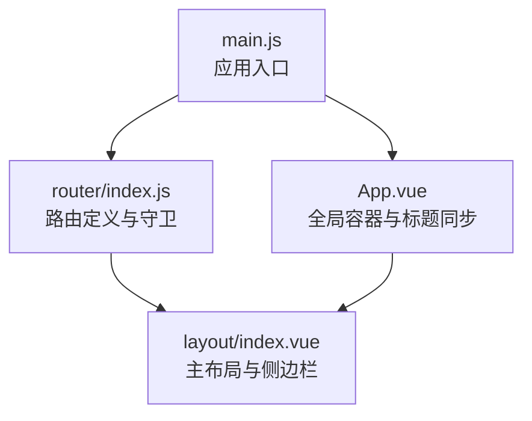
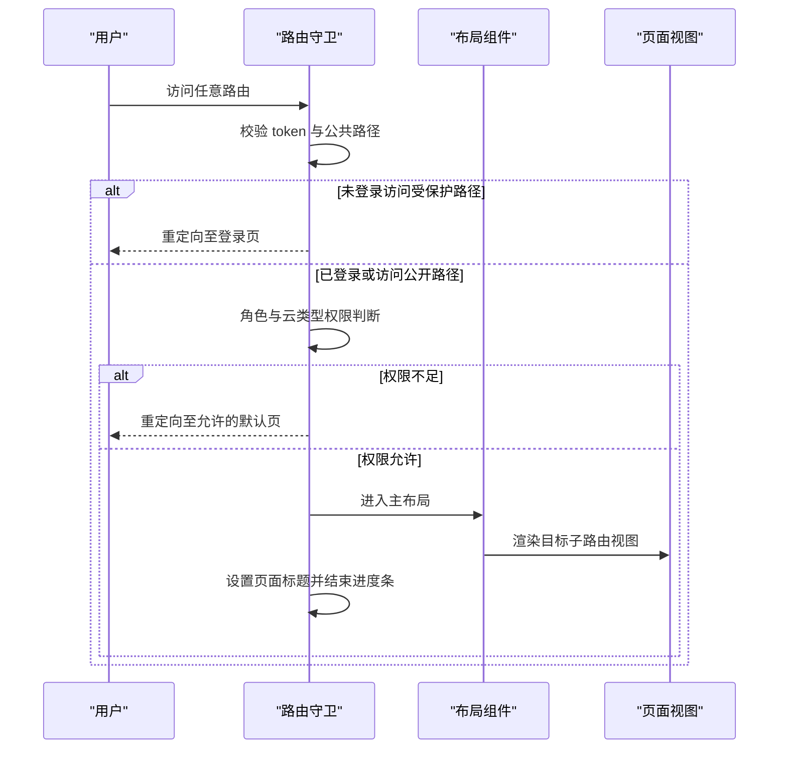
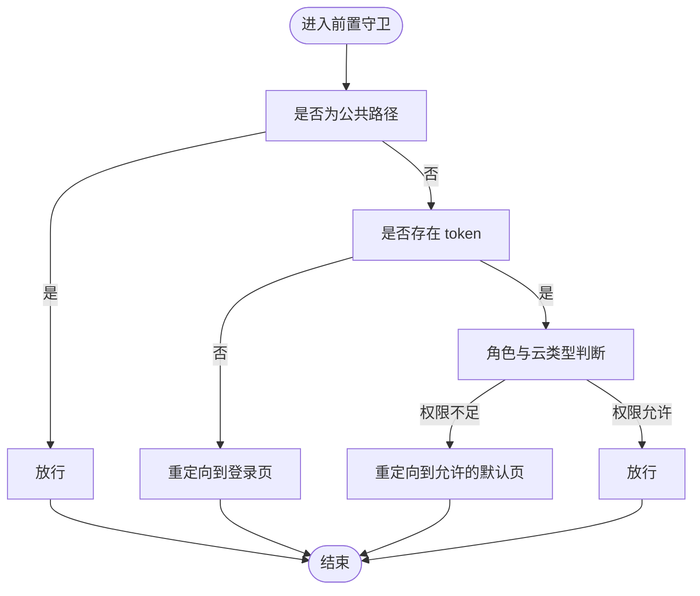
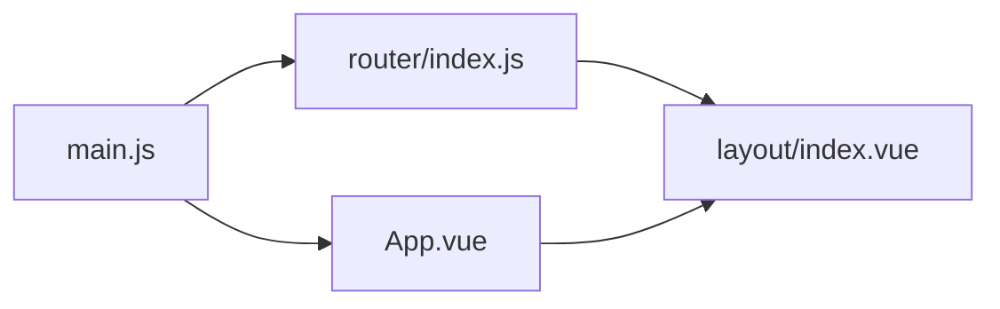

# 路由系统

<cite>
**本文档引用的文件**
- [web/src/router/index.js](file://web/src/router/index.js)
- [web/src/main.js](file://web/src/main.js)
- [web/src/App.vue](file://web/src/App.vue)
- [web/src/layout/index.vue](file://web/src/layout/index.vue)
</cite>

## 目录
1. [简介](#简介)
2. [项目结构](#项目结构)
3. [核心组件](#核心组件)
4. [架构总览](#架构总览)
5. [详细组件分析](#详细组件分析)
6. [依赖关系分析](#依赖关系分析)
7. [性能考虑](#性能考虑)
8. [故障排查指南](#故障排查指南)
9. [结论](#结论)

## 简介
本文件面向前端路由系统，基于 Vue Router 实现，覆盖路由定义、嵌套与动态路由、路由守卫、页面布局、懒加载与代码分割、参数与查询字符串处理、路由元信息与页面标题管理、以及 404 错误页与错误路由处理等主题。文档同时结合主应用入口与全局布局组件，帮助读者从整体到细节全面理解该路由体系。

## 项目结构
路由系统主要位于前端工程 web/src 下，核心文件包括：
- 路由定义与守卫：web/src/router/index.js
- 应用入口与插件安装：web/src/main.js
- 全局应用容器与标题同步：web/src/App.vue
- 主布局与侧边栏导航：web/src/layout/index.vue

图表来源
- [web/src/main.js](file://web/src/main.js)
- [web/src/router/index.js](file://web/src/router/index.js)
- [web/src/App.vue](file://web/src/App.vue)
- [web/src/layout/index.vue](file://web/src/layout/index.vue)

章节来源
- [web/src/main.js](file://web/src/main.js)
- [web/src/router/index.js](file://web/src/router/index.js)
- [web/src/App.vue](file://web/src/App.vue)
- [web/src/layout/index.vue](file://web/src/layout/index.vue)

## 核心组件
- 路由器实例与历史模式：使用 Web History 创建路由器，集中管理路由表与导航行为。
- 路由表：包含登录、邀请注册、重置密码、VNC 窗口、以及主布局下的多级子路由。
- 路由守卫：前置守卫负责鉴权与权限控制；后置守卫负责页面标题与进度条收尾。
- 布局组件：提供侧边栏导航、顶部导航、路由视图容器与任务面板等。
- 懒加载：通过动态 import 实现按需加载，配合打包工具进行代码分割。

章节来源
- [web/src/router/index.js](file://web/src/router/index.js)
- [web/src/layout/index.vue](file://web/src/layout/index.vue)

## 架构总览
路由系统采用“主布局 + 子路由”的嵌套结构，根路径 "/" 加载主布局组件，内部 children 定义各业务模块路由。全局守卫在进入前进行令牌校验与角色限制，离开后统一设置页面标题并结束进度条。

图表来源
- [web/src/router/index.js](file://web/src/router/index.js)
- [web/src/layout/index.vue](file://web/src/layout/index.vue)

## 详细组件分析

### 路由定义与嵌套
- 根路径 "/" 使用 Layout 组件作为父容器，并通过 children 定义多个子路由。
- 子路由涵盖仪表盘、虚拟机列表、虚拟机详情、模板管理、网络、公网 IP、防火墙、存储池、节点管理、我的存储、用户管理、调度事件、系统设置、接口文档、任务中心、关于项目等。
- 子路由中包含动态参数示例，如 "/vm/detail/:id"，用于展示指定虚拟机详情。
- 子路由中包含查询参数示例，如 "/my-storage" 携带 tab 查询参数，用于切换存储子页签。

章节来源
- [web/src/router/index.js](file://web/src/router/index.js)

### 动态路由与重定向
- 动态路由："/vm/detail/:id" 通过路由参数传递虚拟机标识，便于在组件中读取并加载对应数据。
- 重定向："/ovs" 重定向到 "/network"，简化导航路径。

章节来源
- [web/src/router/index.js](file://web/src/router/index.js)

### 路由守卫与权限控制
- 前置守卫：
  - 校验公共路径白名单（登录、邀请注册、重置密码）。
  - 若非公共路径且无 token，则重定向到登录页。
  - 对轻量云用户进行额外权限限制：禁止访问除允许列表外的路由；对根路径 "/" 或 "/dashboard" 进行默认跳转。
- 后置守卫：
  - 在每次导航完成后设置页面标题。
  - 结束 NProgress 进度条。

图表来源
- [web/src/router/index.js](file://web/src/router/index.js)

章节来源
- [web/src/router/index.js](file://web/src/router/index.js)

### 页面布局系统与侧边栏导航
- 主布局组件提供：
  - 侧边栏：根据用户角色与云类型动态渲染菜单项；支持移动端折叠与遮罩；支持“最近访问的虚拟机”动态菜单。
  - 顶部导航：包含折叠按钮、页面标题、内测提示、任务徽章、暗色模式切换、云类型标签与用户下拉菜单。
  - 路由视图容器：使用过渡动画渲染子路由组件。
  - 近期任务面板：支持展开/折叠、拖拽高度调整、实时任务流。
- 侧边栏菜单：
  - 支持 router 属性直接跳转。
  - 通过 activeMenu 计算属性与路由查询参数联动，保持菜单高亮与页签一致。

章节来源
- [web/src/layout/index.vue](file://web/src/layout/index.vue)

### 路由懒加载与代码分割
- 所有页面组件均通过动态 import 实现懒加载，例如：
  - 登录页、邀请注册、重置密码、VNC 窗口、仪表盘、虚拟机列表、虚拟机详情、模板管理、网络、防火墙、存储池、节点管理、我的存储、用户管理、调度事件、系统设置、接口文档、任务中心、关于项目等。
- 懒加载与打包工具配合实现按需加载与代码分割，提升首屏性能。

章节来源
- [web/src/router/index.js](file://web/src/router/index.js)

### 路由参数传递与查询字符串处理
- 动态参数：通过 "/vm/detail/:id" 传递虚拟机 ID，在组件中可通过路由参数读取。
- 查询参数：通过 "/my-storage?tab=..." 传递页签参数，布局组件根据查询参数计算 activeMenu，保证菜单与页签一致。

章节来源
- [web/src/router/index.js](file://web/src/router/index.js)
- [web/src/layout/index.vue](file://web/src/layout/index.vue)

### 路由元信息与页面标题管理
- 元信息：每个路由定义包含 meta 字段，如 title、icon、adminOnly、hidden 等。
- 标题同步：
  - 前置守卫结束后调用标题设置函数。
  - App.vue 中监听路由变化，实时更新页面标题。
- 图标：侧边栏菜单项使用 meta.icon 渲染图标。

章节来源
- [web/src/router/index.js](file://web/src/router/index.js)
- [web/src/App.vue](file://web/src/App.vue)

### 404 页面与错误路由处理
- 当前路由表未显式声明通配符 404 路由。若访问不存在的路径，将不会匹配任何路由，导致无法渲染任何视图。
- 建议补充通配符 404 路由，指向一个静态的 404 页面组件，以提供友好的错误提示与返回入口。

章节来源
- [web/src/router/index.js](file://web/src/router/index.js)

## 依赖关系分析
- main.js 将路由插件注入应用，使全局可使用 $router/$route。
- App.vue 通过监听路由变化实现标题同步。
- layout/index.vue 作为主布局，承载侧边栏、顶部导航与路由视图。
- router/index.js 定义路由表与守卫，驱动导航流程。

图表来源
- [web/src/main.js](file://web/src/main.js)
- [web/src/router/index.js](file://web/src/router/index.js)
- [web/src/App.vue](file://web/src/App.vue)
- [web/src/layout/index.vue](file://web/src/layout/index.vue)

章节来源
- [web/src/main.js](file://web/src/main.js)
- [web/src/router/index.js](file://web/src/router/index.js)
- [web/src/App.vue](file://web/src/App.vue)
- [web/src/layout/index.vue](file://web/src/layout/index.vue)

## 性能考虑
- 懒加载与代码分割：所有页面组件均采用动态 import，减少初始包体积，提升首屏加载速度。
- 进度条：前置守卫开启 NProgress，后置守卫结束，提升用户感知的导航流畅度。
- 布局组件：侧边栏菜单按角色与云类型动态渲染，避免不必要的 DOM 开销。

## 故障排查指南
- 无法进入受保护页面
  - 检查 localStorage 中 token 是否存在；若缺失，会被重定向到登录页。
  - 检查角色与云类型限制逻辑，确认当前路径是否在允许列表中。
- 页面标题未更新
  - 确认 meta.title 是否正确设置；检查后置守卫是否执行。
- 侧边栏菜单高亮异常
  - 检查 activeMenu 计算逻辑与路由路径、查询参数是否一致。
- VNC 窗口路由无法访问
  - 确认动态路由 "/vm/:id/vnc-window" 的参数传递与组件加载逻辑。

章节来源
- [web/src/router/index.js](file://web/src/router/index.js)
- [web/src/App.vue](file://web/src/App.vue)
- [web/src/layout/index.vue](file://web/src/layout/index.vue)

## 结论
该路由系统以 Vue Router 为核心，结合主布局与守卫机制，实现了清晰的嵌套结构、灵活的动态路由、完善的权限控制与良好的用户体验。通过懒加载与代码分割优化了性能，配合元信息与标题同步提升了可维护性。建议后续补充 404 错误路由与更细粒度的错误处理，进一步完善健壮性与可运维性。