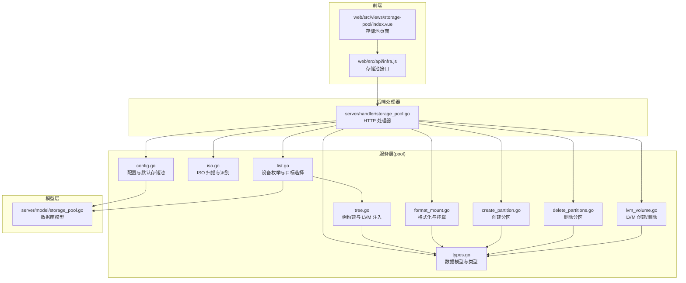
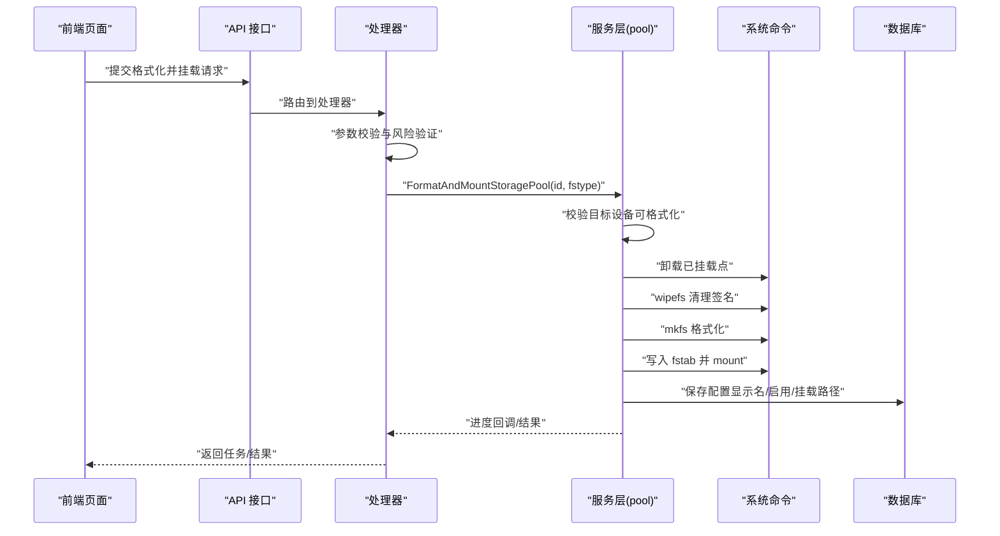
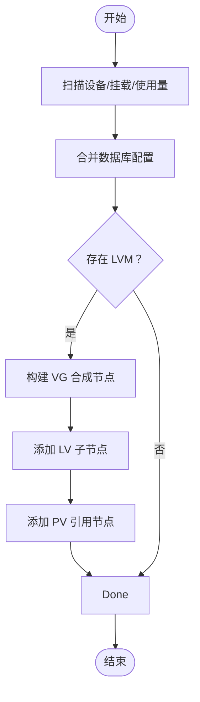
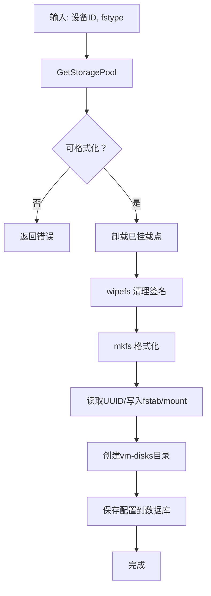
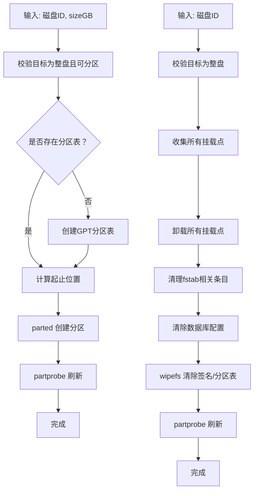
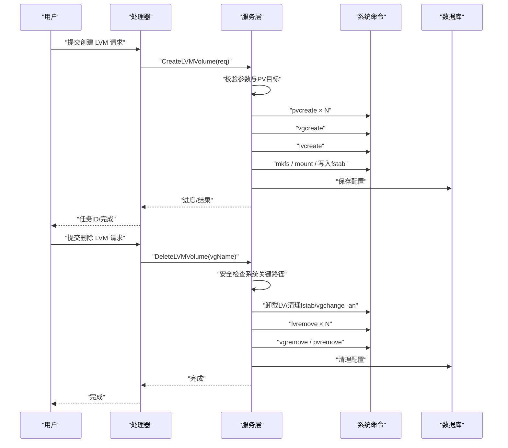
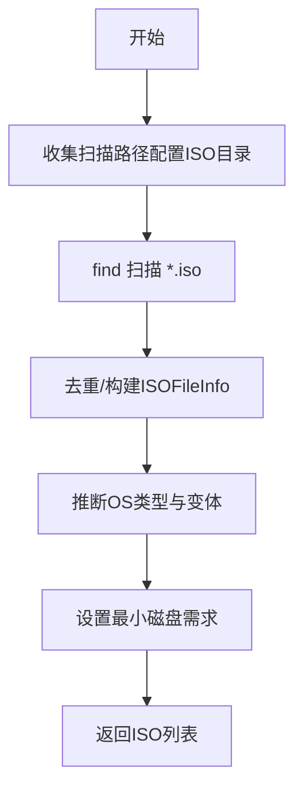
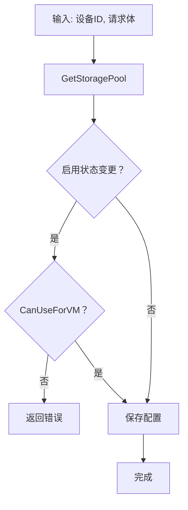
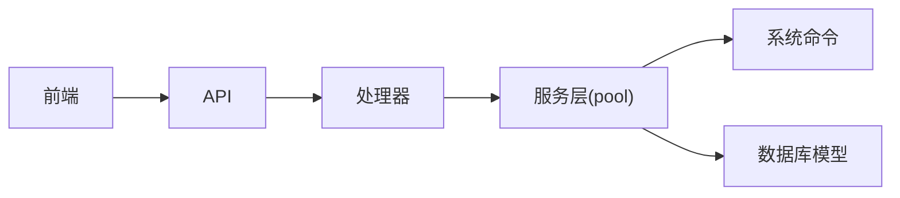

# 存储池管理

<cite>
**本文档引用的文件**
- [server/handler/storage_pool.go](file://server/handler/storage_pool.go)
- [server/model/storage_pool.go](file://server/model/storage_pool.go)
- [server/service/storage/pool/types.go](file://server/service/storage/pool/types.go)
- [server/service/storage/pool/tree.go](file://server/service/storage/pool/tree.go)
- [server/service/storage/pool/list.go](file://server/service/storage/pool/list.go)
- [server/service/storage/pool/format_mount.go](file://server/service/storage/pool/format_mount.go)
- [server/service/storage/pool/create_partition.go](file://server/service/storage/pool/create_partition.go)
- [server/service/storage/pool/delete_partitions.go](file://server/service/storage/pool/delete_partitions.go)
- [server/service/storage/pool/lvm_volume.go](file://server/service/storage/pool/lvm_volume.go)
- [server/service/storage/pool/iso.go](file://server/service/storage/pool/iso.go)
- [server/service/storage/pool/config.go](file://server/service/storage/pool/config.go)
- [web/src/api/infra.js](file://web/src/api/infra.js)
- [web/src/views/storage-pool/index.vue](file://web/src/views/storage-pool/index.vue)
</cite>

## 目录
1. [简介](#简介)
2. [项目结构](#项目结构)
3. [核心组件](#核心组件)
4. [架构总览](#架构总览)
5. [详细组件分析](#详细组件分析)
6. [依赖分析](#依赖分析)
7. [性能考虑](#性能考虑)
8. [故障排查指南](#故障排查指南)
9. [结论](#结论)
10. [附录](#附录)

## 简介
本文件系统性阐述存储池管理功能的设计与实现，覆盖以下方面：
- 存储池的创建、配置与管理：包括基于文件系统的格式化与挂载、磁盘分区的创建与删除、LVM 卷组的创建与删除。
- 存储池树形结构管理：统一展示块设备、分区、LVM VG/LV、挂载点与使用率，支持层级注入与过滤。
- ISO 镜像存储与识别：扫描全局 ISO 目录，推断操作系统类型与最小磁盘需求。
- 动态配置与默认存储池：支持更新显示名与启用状态、设置默认存储位置。
- 性能优化策略、容量监控与故障恢复机制：通过进度回调、安全检查与回滚策略保障操作可靠性。
- 最佳实践与常见问题解决方案：提供操作建议与排障指引。

## 项目结构
存储池管理功能主要分布在服务层的 pool 包，配合模型层与处理器层进行前后端交互；前端通过 API 调用实现可视化管理。

**图表来源**
- [server/handler/storage_pool.go:1-254](file://server/handler/storage_pool.go#L1-L254)
- [server/service/storage/pool/types.go:1-159](file://server/service/storage/pool/types.go#L1-L159)
- [server/service/storage/pool/tree.go:1-532](file://server/service/storage/pool/tree.go#L1-L532)
- [server/service/storage/pool/list.go:1-224](file://server/service/storage/pool/list.go#L1-L224)
- [server/service/storage/pool/format_mount.go:1-224](file://server/service/storage/pool/format_mount.go#L1-L224)
- [server/service/storage/pool/create_partition.go:1-178](file://server/service/storage/pool/create_partition.go#L1-L178)
- [server/service/storage/pool/delete_partitions.go:1-233](file://server/service/storage/pool/delete_partitions.go#L1-L233)
- [server/service/storage/pool/lvm_volume.go:1-924](file://server/service/storage/pool/lvm_volume.go#L1-L924)
- [server/service/storage/pool/iso.go:1-151](file://server/service/storage/pool/iso.go#L1-L151)
- [server/service/storage/pool/config.go:1-103](file://server/service/storage/pool/config.go#L1-L103)
- [server/model/storage_pool.go:1-16](file://server/model/storage_pool.go#L1-L16)
- [web/src/api/infra.js:1-62](file://web/src/api/infra.js#L1-L62)
- [web/src/views/storage-pool/index.vue:688-744](file://web/src/views/storage-pool/index.vue#L688-L744)

**章节来源**
- [server/handler/storage_pool.go:1-254](file://server/handler/storage_pool.go#L1-L254)
- [server/service/storage/pool/types.go:1-159](file://server/service/storage/pool/types.go#L1-L159)
- [server/service/storage/pool/tree.go:1-532](file://server/service/storage/pool/tree.go#L1-L532)
- [server/service/storage/pool/list.go:1-224](file://server/service/storage/pool/list.go#L1-L224)
- [server/service/storage/pool/format_mount.go:1-224](file://server/service/storage/pool/format_mount.go#L1-L224)
- [server/service/storage/pool/create_partition.go:1-178](file://server/service/storage/pool/create_partition.go#L1-L178)
- [server/service/storage/pool/delete_partitions.go:1-233](file://server/service/storage/pool/delete_partitions.go#L1-L233)
- [server/service/storage/pool/lvm_volume.go:1-924](file://server/service/storage/pool/lvm_volume.go#L1-L924)
- [server/service/storage/pool/iso.go:1-151](file://server/service/storage/pool/iso.go#L1-L151)
- [server/service/storage/pool/config.go:1-103](file://server/service/storage/pool/config.go#L1-L103)
- [server/model/storage_pool.go:1-16](file://server/model/storage_pool.go#L1-L16)
- [web/src/api/infra.js:1-62](file://web/src/api/infra.js#L1-L62)
- [web/src/views/storage-pool/index.vue:688-744](file://web/src/views/storage-pool/index.vue#L688-L744)

## 核心组件
- 数据模型与类型
  - HostStoragePoolInfo：存储池节点信息，包含设备标识、类型、容量、挂载点、使用率、LVM 扩展字段等。
  - VMStorageTarget：创建虚拟机可选的存储目标。
  - UpdateHostStoragePoolConfigRequest：更新显示名与启用状态的请求体。
  - ISOFileInfo：ISO 文件信息，含 OS 类型与最小磁盘需求。
- 存储池树构建与 LVM 注入
  - 通过 lsblk/findmnt/df 采集设备与挂载信息，结合数据库配置生成树形结构。
  - 注入 LVM VG/LV 层级，移除冗余 dm 节点，标记 PV 节点容量为 0 以避免重复统计。
- 设备枚举与目标选择
  - 统一列出宿主机块设备，过滤不可用节点，生成可选的 VM 存储目标。
- 文件系统格式化与挂载
  - 校验目标设备可格式化性，卸载已挂载点，清理旧签名，写入 fstab 并创建 vm-disks 目录。
- 磁盘分区管理
  - 创建分区：检测/创建 GPT 分区表，计算起止位置，调用 parted 创建分区并刷新内核分区表。
  - 删除分区：卸载所有挂载点，清理 fstab 与数据库配置，擦除分区表或文件系统签名。
- LVM 管理
  - 创建 LVM：批量 pvcreate → vgcreate → lvcreate → mkfs → mount → 写入 fstab → 保存配置。
  - 删除 LVM：卸载 LV、清理 fstab、vgchange -an、lvremove、vgremove、pvremove、清理配置。
- ISO 管理
  - 扫描配置的 ISO 目录，遍历 *.iso，推断 OS 类型与最小磁盘需求。
- 配置与默认存储池
  - 更新显示名与启用状态；设置默认存储池并事务性地取消其他默认项。
- 前端集成
  - API 定义与页面交互：列表、详情、配置、格式化挂载、分区创建/删除、LVM 创建/删除、ISO 列表。

**章节来源**
- [server/service/storage/pool/types.go:8-82](file://server/service/storage/pool/types.go#L8-L82)
- [server/service/storage/pool/tree.go:15-99](file://server/service/storage/pool/tree.go#L15-L99)
- [server/service/storage/pool/list.go:14-88](file://server/service/storage/pool/list.go#L14-L88)
- [server/service/storage/pool/format_mount.go:17-128](file://server/service/storage/pool/format_mount.go#L17-L128)
- [server/service/storage/pool/create_partition.go:14-178](file://server/service/storage/pool/create_partition.go#L14-L178)
- [server/service/storage/pool/delete_partitions.go:14-233](file://server/service/storage/pool/delete_partitions.go#L14-L233)
- [server/service/storage/pool/lvm_volume.go:68-167](file://server/service/storage/pool/lvm_volume.go#L68-L167)
- [server/service/storage/pool/iso.go:13-151](file://server/service/storage/pool/iso.go#L13-L151)
- [server/service/storage/pool/config.go:13-95](file://server/service/storage/pool/config.go#L13-L95)
- [web/src/api/infra.js:1-62](file://web/src/api/infra.js#L1-L62)
- [web/src/views/storage-pool/index.vue:688-744](file://web/src/views/storage-pool/index.vue#L688-L744)

## 架构总览
存储池管理采用分层架构：
- 前端：通过 API 发起操作请求，渲染存储池树与操作按钮。
- 处理器层：接收请求，绑定参数，调用服务层执行业务逻辑，提交任务队列或直接执行。
- 服务层：封装系统命令调用、设备扫描、权限与安全校验、进度回调与回滚策略。
- 模型层：持久化存储池配置（显示名、启用状态、默认项、挂载路径）。

**图表来源**
- [server/handler/storage_pool.go:77-108](file://server/handler/storage_pool.go#L77-L108)
- [server/service/storage/pool/format_mount.go:17-128](file://server/service/storage/pool/format_mount.go#L17-L128)
- [server/service/storage/pool/config.go:13-37](file://server/service/storage/pool/config.go#L13-L37)

## 详细组件分析

### 存储池树形结构与 LVM 注入
- 树构建流程
  - 读取 lsblk 输出，解析设备树。
  - 读取 findmnt 与 df 输出，构建挂载与使用量映射。
  - 加载数据库配置，合并显示名、启用状态、默认项与挂载路径。
  - 注入 LVM：扫描 VG/LV/PV，移除 LV 的 dm 节点，标记 PV 节点容量为 0，为 VG 创建合成节点并挂载 LV/PV 子节点。
- 关键规则
  - 可格式化判定：排除只读、loop/rom、内存盘、系统盘、LVM/RAID/ZFS 成员及其子成员、已挂载设备。
  - 可用作 VM 存储：需存在挂载路径且挂载点非空。
  - 系统盘保护：若挂载点为根或关键路径，则禁用格式化与启用。

**图表来源**
- [server/service/storage/pool/tree.go:15-99](file://server/service/storage/pool/tree.go#L15-L99)
- [server/service/storage/pool/tree.go:313-407](file://server/service/storage/pool/tree.go#L313-L407)

**章节来源**
- [server/service/storage/pool/tree.go:15-99](file://server/service/storage/pool/tree.go#L15-L99)
- [server/service/storage/pool/tree.go:313-407](file://server/service/storage/pool/tree.go#L313-L407)

### 文件系统格式化与挂载
- 核心步骤
  - 校验目标设备可格式化性（调用 canFormatStorageNode）。
  - 若已挂载，先卸载（支持杀进程后重试），避免“设备被占用”。
  - wipefs 清理旧签名，mkfs 格式化，读取 UUID，写入 fstab，mount 挂载，创建 vm-disks 目录，保存配置。
- 安全与兼容
  - 不使用 lazy unmount，防止内核仍持有引用导致 mkfs 失败。
  - 支持多种文件系统类型，按类型选择合适 mkfs 参数。
  - 为 libvirt 自定义存储目录配置 AppArmor 访问。

**图表来源**
- [server/service/storage/pool/format_mount.go:17-128](file://server/service/storage/pool/format_mount.go#L17-L128)
- [server/service/storage/pool/tree.go:123-180](file://server/service/storage/pool/tree.go#L123-L180)

**章节来源**
- [server/service/storage/pool/format_mount.go:17-128](file://server/service/storage/pool/format_mount.go#L17-L128)
- [server/service/storage/pool/tree.go:123-180](file://server/service/storage/pool/tree.go#L123-L180)

### 磁盘分区的创建与删除
- 创建分区
  - 校验目标为整盘且可分区（排除只读、系统盘、内存盘、LVM/RAID/ZFS 成员）。
  - 若无分区表则创建 GPT；计算起止边界并使用 parted 创建 primary ext4 分区；刷新内核分区表。
- 删除分区
  - 收集所有挂载点（含子分区），逐一卸载（含 lazy 方案）。
  - 清理 fstab 中相关条目，清除数据库配置，wipefs 清除分区表或签名，刷新分区表。
  - 支持直接格式化挂载的无分区磁盘场景。

**图表来源**
- [server/service/storage/pool/create_partition.go:14-178](file://server/service/storage/pool/create_partition.go#L14-L178)
- [server/service/storage/pool/delete_partitions.go:14-233](file://server/service/storage/pool/delete_partitions.go#L14-L233)

**章节来源**
- [server/service/storage/pool/create_partition.go:14-178](file://server/service/storage/pool/create_partition.go#L14-L178)
- [server/service/storage/pool/delete_partitions.go:14-233](file://server/service/storage/pool/delete_partitions.go#L14-L233)

### LVM 卷组的创建与删除
- 创建 LVM
  - 参数校验：至少一个 PV、卷组名、LV 名、LV 大小、文件系统类型、挂载路径等。
  - 顺序执行：批量 pvcreate → vgcreate → lvcreate → mkfs → mount → 写入 fstab → 保存配置。
  - 支持线性/条带/镜像 LV，自动补全百分比大小表达式。
- 删除 LVM
  - 安全校验：拒绝删除挂载于系统关键路径的 VG。
  - 顺序执行：卸载所有 LV → 清理 fstab → vgchange -an → lvremove → vgremove → pvremove → 清理数据库配置。

**图表来源**
- [server/handler/storage_pool.go:179-239](file://server/handler/storage_pool.go#L179-L239)
- [server/service/storage/pool/lvm_volume.go:68-167](file://server/service/storage/pool/lvm_volume.go#L68-L167)
- [server/service/storage/pool/lvm_volume.go:699-800](file://server/service/storage/pool/lvm_volume.go#L699-L800)

**章节来源**
- [server/handler/storage_pool.go:179-239](file://server/handler/storage_pool.go#L179-L239)
- [server/service/storage/pool/lvm_volume.go:68-167](file://server/service/storage/pool/lvm_volume.go#L68-L167)
- [server/service/storage/pool/lvm_volume.go:699-800](file://server/service/storage/pool/lvm_volume.go#L699-L800)

### ISO 镜像存储与识别
- 扫描策略
  - 读取配置的 ISO 目录，使用 find 遍历顶层 *.iso 文件，去重后构建 ISOFileInfo。
- OS 类型推断
  - 基于文件名关键字匹配 Windows/Linux 发行版与版本，设定最小磁盘需求（Windows 默认 20G，其他默认 10G）。

**图表来源**
- [server/service/storage/pool/iso.go:13-80](file://server/service/storage/pool/iso.go#L13-L80)
- [server/service/storage/pool/iso.go:82-151](file://server/service/storage/pool/iso.go#L82-L151)

**章节来源**
- [server/service/storage/pool/iso.go:13-80](file://server/service/storage/pool/iso.go#L13-L80)
- [server/service/storage/pool/iso.go:82-151](file://server/service/storage/pool/iso.go#L82-L151)

### 配置与默认存储池
- 更新配置
  - 校验目标设备可作为 VM 存储（启用时），保存显示名、启用状态、挂载路径。
- 设置默认存储池
  - 事务性地将其他默认项置为 false，仅设置当前设备为默认，同时确保其可作为 VM 存储。

**图表来源**
- [server/service/storage/pool/config.go:13-37](file://server/service/storage/pool/config.go#L13-L37)

**章节来源**
- [server/service/storage/pool/config.go:13-37](file://server/service/storage/pool/config.go#L13-L37)

## 依赖分析
- 组件耦合
  - 处理器层依赖服务层各模块（格式化、分区、LVM、ISO、配置、树构建）。
  - 服务层依赖系统命令工具（lsblk/findmnt/parted/wipefs/mkfs/mount/vgs/lvs/pvs 等）。
  - 服务层依赖数据库模型持久化配置。
- 外部依赖
  - Linux 系统工具链与文件系统工具。
  - 前端通过 API 与后端交互，页面负责展示与用户交互。

**图表来源**
- [server/handler/storage_pool.go:1-254](file://server/handler/storage_pool.go#L1-L254)
- [server/service/storage/pool/format_mount.go:1-224](file://server/service/storage/pool/format_mount.go#L1-L224)
- [server/service/storage/pool/lvm_volume.go:1-924](file://server/service/storage/pool/lvm_volume.go#L1-L924)
- [server/model/storage_pool.go:1-16](file://server/model/storage_pool.go#L1-L16)
- [web/src/api/infra.js:1-62](file://web/src/api/infra.js#L1-L62)

**章节来源**
- [server/handler/storage_pool.go:1-254](file://server/handler/storage_pool.go#L1-L254)
- [server/service/storage/pool/format_mount.go:1-224](file://server/service/storage/pool/format_mount.go#L1-L224)
- [server/service/storage/pool/lvm_volume.go:1-924](file://server/service/storage/pool/lvm_volume.go#L1-L924)
- [server/model/storage_pool.go:1-16](file://server/model/storage_pool.go#L1-L16)
- [web/src/api/infra.js:1-62](file://web/src/api/infra.js#L1-L62)

## 性能考虑
- I/O 优化
  - LVM 条带（striped）与镜像（mirrored）模式可提升吞吐与可靠性，需根据硬件与工作负载权衡。
  - 优先使用现代文件系统（如 XFS/Btrfs）以获得更好的大文件与快照性能。
- 进度与并发
  - 通过进度回调反馈长耗时步骤，提升用户体验。
  - 分步执行（pvcreate/vgcreate/lvcreate/mkfs/mount）便于定位问题与回滚。
- 资源隔离
  - 为 vm-disks 目录配置 AppArmor 规则，避免 libvirt 访问受限导致性能下降。
- 监控与告警
  - 结合树构建中的使用率与可用空间，定期检查存储池健康状况，及时扩容或迁移。

## 故障排查指南
- 格式化失败
  - 现象：mkfs 报错或“设备被占用”。
  - 排查：确认设备未被挂载；若存在挂载点，先正常卸载再杀进程后重试；避免使用 lazy unmount。
  - 参考：[server/service/storage/pool/format_mount.go:34-69](file://server/service/storage/pool/format_mount.go#L34-L69)
- 分区创建失败
  - 现象：parted 报错或分区表未更新。
  - 排查：确认磁盘类型与权限；若无分区表则先创建 GPT；partprobe 失败不影响内核自动检测，可忽略。
  - 参考：[server/service/storage/pool/create_partition.go:27-82](file://server/service/storage/pool/create_partition.go#L27-L82)
- 删除分区/磁盘失败
  - 现象：无法卸载或 fstab 清理不彻底。
  - 排查：收集所有挂载点（含子分区），逐一卸载并清理 fstab；必要时使用 lazy unmount；最后 wipefs 清理。
  - 参考：[server/service/storage/pool/delete_partitions.go:28-92](file://server/service/storage/pool/delete_partitions.go#L28-L92)
- LVM 删除失败
  - 现象：lvremove/vgremove/pvremove 失败。
  - 排查：确保系统关键路径未被挂载；先 vgchange -an 停用 VG；逐个 LV 强制卸载；检查权限与设备占用。
  - 参考：[server/service/storage/pool/lvm_volume.go:700-800](file://server/service/storage/pool/lvm_volume.go#L700-L800)
- 可用性判断错误
  - 现象：设备显示不可用或无法启用。
  - 排查：检查只读、系统盘、内存盘、LVM/RAID/ZFS 成员、已挂载状态；查看状态原因。
  - 参考：[server/service/storage/pool/tree.go:123-180](file://server/service/storage/pool/tree.go#L123-L180)

**章节来源**
- [server/service/storage/pool/format_mount.go:34-69](file://server/service/storage/pool/format_mount.go#L34-L69)
- [server/service/storage/pool/create_partition.go:27-82](file://server/service/storage/pool/create_partition.go#L27-L82)
- [server/service/storage/pool/delete_partitions.go:28-92](file://server/service/storage/pool/delete_partitions.go#L28-L92)
- [server/service/storage/pool/lvm_volume.go:700-800](file://server/service/storage/pool/lvm_volume.go#L700-L800)
- [server/service/storage/pool/tree.go:123-180](file://server/service/storage/pool/tree.go#L123-L180)

## 结论
存储池管理功能通过统一的树形结构抽象与 LVM 注入，实现了对块设备、分区与逻辑卷的一体化管理。结合安全校验、进度回调与回滚策略，保障了高风险操作的可靠性。配合 ISO 扫描与识别、动态配置与默认存储池设置，满足了虚拟机创建与运维的多样化需求。建议在生产环境中遵循最佳实践，定期监控容量与健康状况，确保稳定与高性能。

## 附录
- 前端 API 与页面
  - API 定义：存储池列表、详情、配置、默认设置、格式化挂载、分区创建/删除、LVM 创建/删除、ISO 列表。
  - 页面交互：展示树形结构、筛选可用项、弹窗配置、触发高风险操作。
  - 参考：
    - [web/src/api/infra.js:1-62](file://web/src/api/infra.js#L1-L62)
    - [web/src/views/storage-pool/index.vue:688-744](file://web/src/views/storage-pool/index.vue#L688-L744)