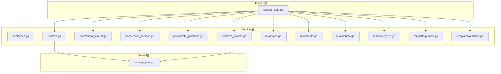
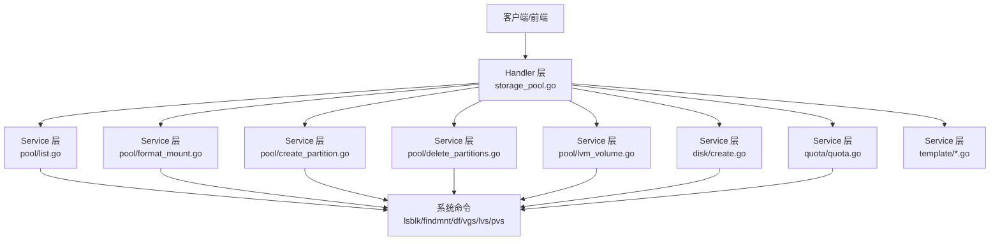
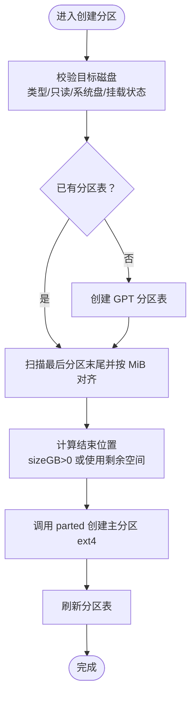
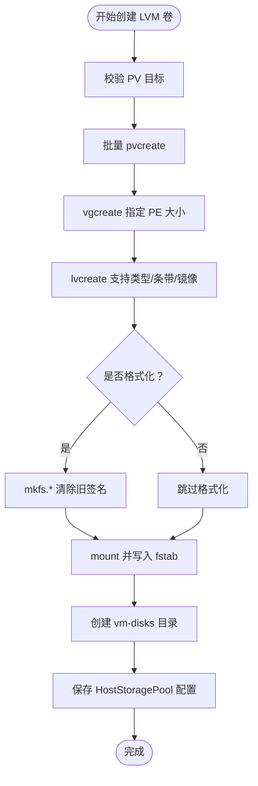
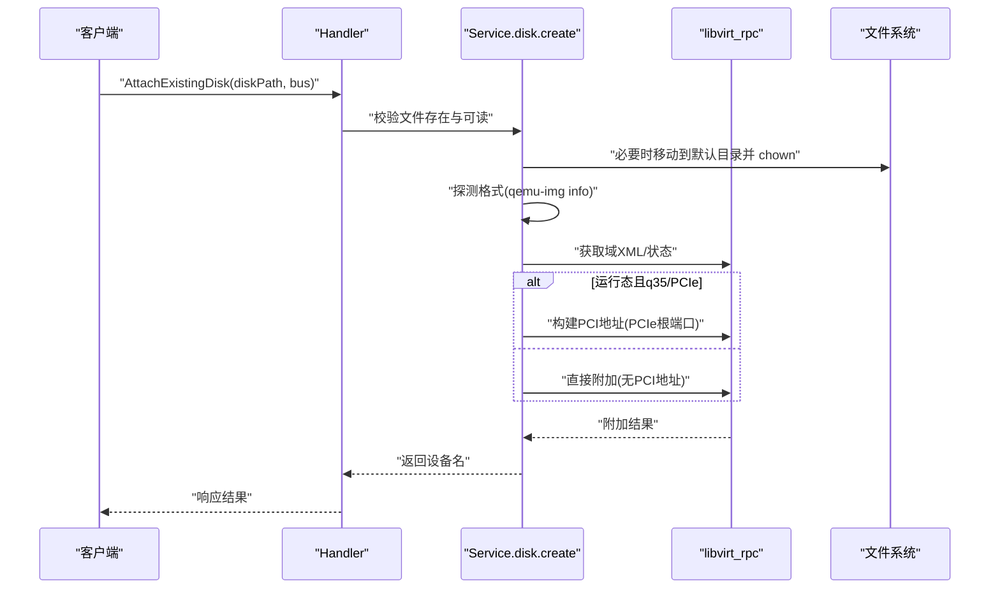
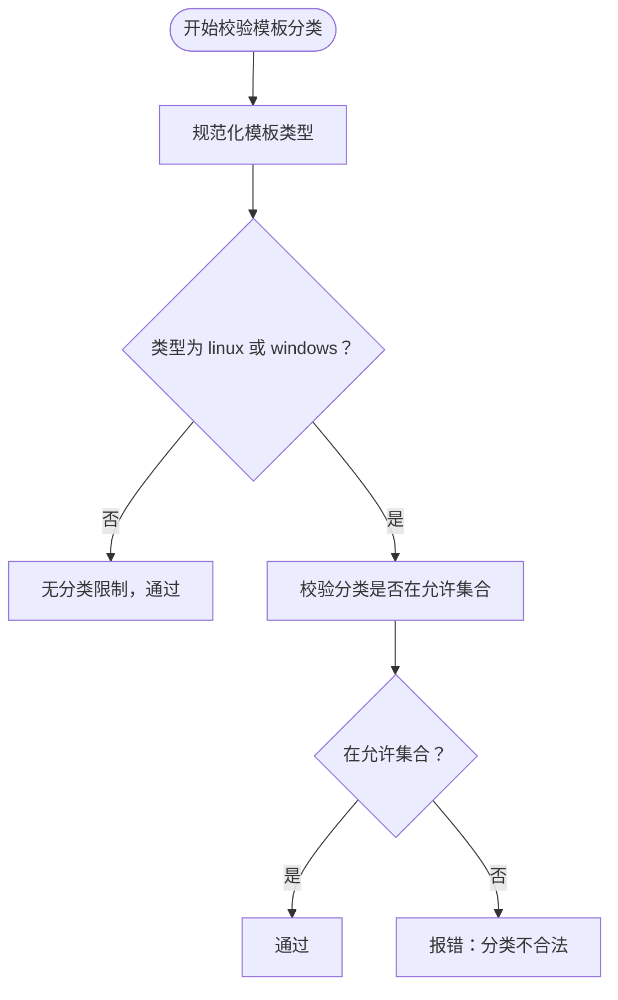
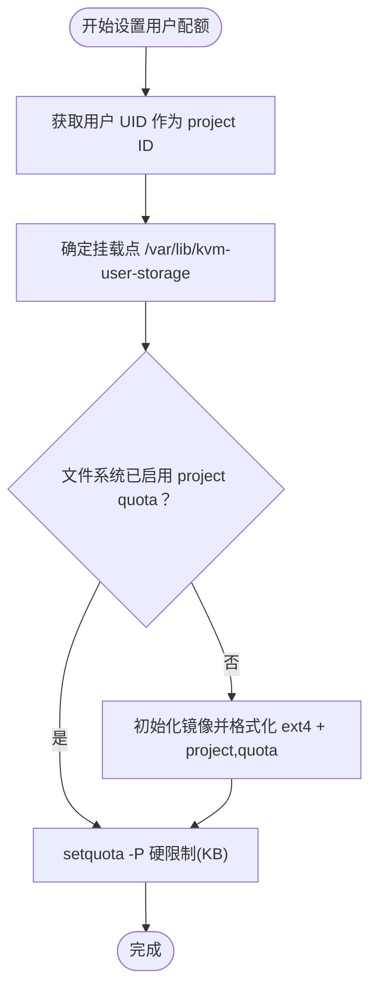
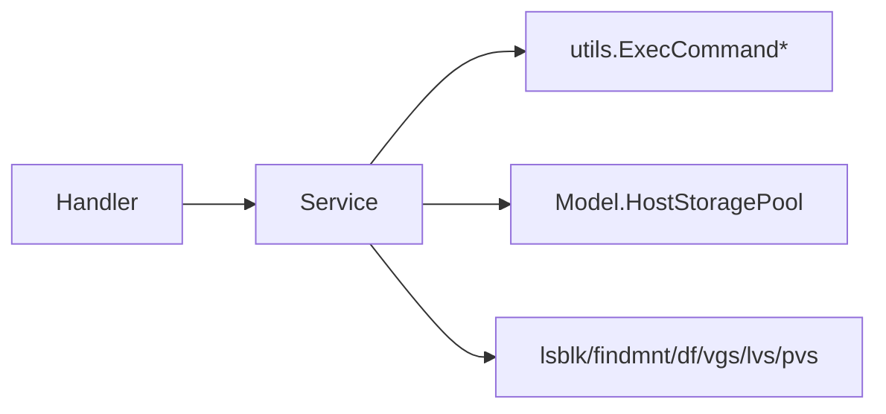

# 存储管理

<cite>
**本文档引用的文件**
- [server/handler/storage_pool.go](file://server/handler/storage_pool.go)
- [server/model/storage_pool.go](file://server/model/storage_pool.go)
- [server/service/storage/pool/types.go](file://server/service/storage/pool/types.go)
- [server/service/storage/pool/list.go](file://server/service/storage/pool/list.go)
- [server/service/storage/pool/format_mount.go](file://server/service/storage/pool/format_mount.go)
- [server/service/storage/pool/create_partition.go](file://server/service/storage/pool/create_partition.go)
- [server/service/storage/pool/delete_partitions.go](file://server/service/storage/pool/delete_partitions.go)
- [server/service/storage/pool/lvm_volume.go](file://server/service/storage/pool/lvm_volume.go)
- [server/service/storage/disk/types.go](file://server/service/storage/disk/types.go)
- [server/service/storage/disk/create.go](file://server/service/storage/disk/create.go)
- [server/service/storage/quota/quota.go](file://server/service/storage/quota/quota.go)
- [server/handler/template.go](file://server/handler/template.go)
- [server/service/template/types.go](file://server/service/template/types.go)
- [server/service/template/validation.go](file://server/service/template/validation.go)
- [server/service/template/publish.go](file://server/service/template/publish.go)
</cite>

## 目录
1. [简介](#简介)
2. [项目结构](#项目结构)
3. [核心组件](#核心组件)
4. [架构总览](#架构总览)
5. [详细组件分析](#详细组件分析)
6. [依赖分析](#依赖分析)
7. [性能考虑](#性能考虑)
8. [故障排查指南](#故障排查指南)
9. [结论](#结论)
10. [附录](#附录)

## 简介
本文件面向 Open 虚拟机管理控制台的“存储管理”能力，系统化梳理以下主题：
- 存储池管理：LVM 卷组、文件系统存储与磁盘分区的配置与生命周期管理
- 磁盘管理：虚拟机磁盘的创建、附加、迁移与性能调优
- 模板管理：模板制作、发布、版本与分类管理
- LVM 卷管理：卷组创建、逻辑卷管理与快照能力
- 存储配额与监控：用户级存储配额、文件系统项目配额与监控
- 性能优化与故障恢复：IOPS 限制、热插拔、PCIe 热插槽与回退策略

## 项目结构
存储管理相关代码主要分布在如下模块：
- Handler 层：对外暴露 REST 接口，接收请求并调用服务层
- Model 层：持久化存储池配置
- Service 层：存储池枚举与树构建、LVM 操作、磁盘操作、配额与模板管理
- Utils 层：系统命令执行与文件系统辅助

**图表来源**
- [server/handler/storage_pool.go:1-254](file://server/handler/storage_pool.go#L1-L254)
- [server/model/storage_pool.go:1-16](file://server/model/storage_pool.go#L1-L16)
- [server/service/storage/pool/types.go:1-159](file://server/service/storage/pool/types.go#L1-L159)
- [server/service/storage/pool/list.go:1-224](file://server/service/storage/pool/list.go#L1-L224)
- [server/service/storage/pool/format_mount.go:1-224](file://server/service/storage/pool/format_mount.go#L1-L224)
- [server/service/storage/pool/create_partition.go:1-178](file://server/service/storage/pool/create_partition.go#L1-L178)
- [server/service/storage/pool/delete_partitions.go:1-233](file://server/service/storage/pool/delete_partitions.go#L1-L233)
- [server/service/storage/pool/lvm_volume.go:1-924](file://server/service/storage/pool/lvm_volume.go#L1-L924)
- [server/service/storage/disk/types.go:1-34](file://server/service/storage/disk/types.go#L1-L34)
- [server/service/storage/disk/create.go:1-362](file://server/service/storage/disk/create.go#L1-L362)
- [server/service/storage/quota/quota.go:1-453](file://server/service/storage/quota/quota.go#L1-L453)
- [server/handler/template.go:1-284](file://server/handler/template.go#L1-L284)
- [server/service/template/types.go:1-423](file://server/service/template/types.go#L1-L423)
- [server/service/template/publish.go:1-62](file://server/service/template/publish.go#L1-L62)
- [server/service/template/validation.go:1-35](file://server/service/template/validation.go#L1-L35)

**章节来源**
- [server/handler/storage_pool.go:1-254](file://server/handler/storage_pool.go#L1-L254)
- [server/service/storage/pool/list.go:1-224](file://server/service/storage/pool/list.go#L1-L224)

## 核心组件
- 存储池模型与类型
  - HostStoragePool：持久化存储池配置（设备 ID、显示名、启用状态、默认状态、挂载路径）
  - HostStoragePoolInfo/VMStorageTarget：存储池树形结构与虚拟机可选落盘目标
- 存储池服务
  - 列表与树构建：读取 lsblk/findmnt/df 输出，合并配置与 LVM 信息
  - 格式化与挂载：支持 ext4/xfs/btrfs 等文件系统，写入 fstab 并创建 vm-disks 目录
  - 分区管理：创建/删除分区，GPT 分区表与对齐
  - LVM 管理：创建卷组/逻辑卷、格式化挂载、删除卷组与回滚
- 磁盘服务
  - 虚拟机磁盘创建与附加：qcow2/raw，支持 virtio/scsi/sata/ide，热插拔与 PCIe 地址分配
  - IOPS 限制：额外磁盘参数支持 IOPS_total/read/write
- 配额服务
  - 用户级存储配额：ext4 项目配额（project quota），按目录统计与限制
  - 存储文件系统：回环镜像 + ext4 + prjquota
- 模板服务
  - 模板元数据：类型、分类、默认硬件配置、可见性与禁用状态
  - 发布与验证：分类合法性校验、默认配置规范化

**章节来源**
- [server/model/storage_pool.go:1-16](file://server/model/storage_pool.go#L1-L16)
- [server/service/storage/pool/types.go:1-159](file://server/service/storage/pool/types.go#L1-L159)
- [server/service/storage/pool/format_mount.go:1-224](file://server/service/storage/pool/format_mount.go#L1-L224)
- [server/service/storage/pool/create_partition.go:1-178](file://server/service/storage/pool/create_partition.go#L1-L178)
- [server/service/storage/pool/delete_partitions.go:1-233](file://server/service/storage/pool/delete_partitions.go#L1-L233)
- [server/service/storage/pool/lvm_volume.go:1-924](file://server/service/storage/pool/lvm_volume.go#L1-L924)
- [server/service/storage/disk/types.go:1-34](file://server/service/storage/disk/types.go#L1-L34)
- [server/service/storage/disk/create.go:1-362](file://server/service/storage/disk/create.go#L1-L362)
- [server/service/storage/quota/quota.go:1-453](file://server/service/storage/quota/quota.go#L1-L453)
- [server/service/template/types.go:1-423](file://server/service/template/types.go#L1-L423)
- [server/service/template/publish.go:1-62](file://server/service/template/publish.go#L1-L62)
- [server/service/template/validation.go:1-35](file://server/service/template/validation.go#L1-L35)

## 架构总览
存储管理采用“Handler -> Service -> 系统命令”的分层设计，Service 层负责业务编排与系统交互，Handler 层负责鉴权与任务提交。

**图表来源**
- [server/handler/storage_pool.go:1-254](file://server/handler/storage_pool.go#L1-L254)
- [server/service/storage/pool/list.go:1-224](file://server/service/storage/pool/list.go#L1-L224)
- [server/service/storage/pool/format_mount.go:1-224](file://server/service/storage/pool/format_mount.go#L1-L224)
- [server/service/storage/pool/create_partition.go:1-178](file://server/service/storage/pool/create_partition.go#L1-L178)
- [server/service/storage/pool/delete_partitions.go:1-233](file://server/service/storage/pool/delete_partitions.go#L1-L233)
- [server/service/storage/pool/lvm_volume.go:1-924](file://server/service/storage/pool/lvm_volume.go#L1-L924)
- [server/service/storage/disk/create.go:1-362](file://server/service/storage/disk/create.go#L1-L362)
- [server/service/storage/quota/quota.go:1-453](file://server/service/storage/quota/quota.go#L1-L453)

## 详细组件分析

### 存储池管理（文件系统与分区）
- 列表与树构建
  - 读取 lsblk、findmnt、df 输出，构建设备树，注入 LVM 信息（VG/LV/PV）
  - 合并数据库中的 HostStoragePool 配置，标注可否用于虚拟机
- 格式化与挂载
  - 支持 ext4/xfs/btrfs；卸载旧挂载、擦除签名、写入 fstab、挂载并创建 vm-disks 目录
  - 为 libvirt 自定义存储目录配置 AppArmor 访问
- 分区管理
  - 创建分区：检测/创建 GPT 分区表，计算起止位置并对齐，支持“使用剩余空间”
  - 删除分区：卸载、清理 fstab、清除签名/分区表，刷新内核分区表
- 关键流程图（创建分区）

**图表来源**
- [server/service/storage/pool/create_partition.go:14-83](file://server/service/storage/pool/create_partition.go#L14-L83)

**章节来源**
- [server/service/storage/pool/list.go:14-88](file://server/service/storage/pool/list.go#L14-L88)
- [server/service/storage/pool/format_mount.go:17-128](file://server/service/storage/pool/format_mount.go#L17-L128)
- [server/service/storage/pool/create_partition.go:14-83](file://server/service/storage/pool/create_partition.go#L14-L83)
- [server/service/storage/pool/delete_partitions.go:14-93](file://server/service/storage/pool/delete_partitions.go#L14-L93)

### LVM 卷管理（卷组、逻辑卷与快照）
- 创建 LVM 存储卷
  - 校验 PV 目标（非只读、非系统盘、未挂载、非 LVM/RAID/ZFS）
  - pvcreate → vgcreate → lvcreate（支持 linear/striped/mirrored）
  - 可选 mkfs（none 跳过）→ mount → 写入 fstab → 创建 vm-disks 目录 → 保存 HostStoragePool 配置
- 删除 LVM 存储卷
  - 卸载 LV（含强制卸载）→ 清理 fstab → vgchange -an → lvremove → vgremove → pvremove → 清理 DB 配置
  - 安全校验：禁止删除挂载于系统关键路径的卷组
- LVM 信息扫描
  - vgs/lvs/pvs 解析，构建 VG/LV/PV 结构，识别 LV 类型（linear/striped/mirrored/raid/thin-pool/thin/snapshot）
  - findmnt blkid 解析挂载与文件系统类型，解决 /dev/mapper 与 /dev/vg/lv 格式差异
- 快照与镜像
  - 通过 LV 类型识别与属性解析支持快照与镜像场景
- 关键流程图（创建 LVM 卷）

**图表来源**
- [server/service/storage/pool/lvm_volume.go:68-167](file://server/service/storage/pool/lvm_volume.go#L68-L167)

**章节来源**
- [server/service/storage/pool/lvm_volume.go:68-167](file://server/service/storage/pool/lvm_volume.go#L68-L167)
- [server/service/storage/pool/lvm_volume.go:381-652](file://server/service/storage/pool/lvm_volume.go#L381-L652)
- [server/service/storage/pool/lvm_volume.go:699-800](file://server/service/storage/pool/lvm_volume.go#L699-L800)

### 磁盘管理（创建、附加与性能调优）
- 虚拟机磁盘创建
  - 默认 virtio，支持 scsi/sata/ide；qcow2/raw；自动分配设备名（vdX/sdX/hdX）
  - 运行态 VM：自动填充 PCIe 根端口地址；若无可用插槽，尝试降级到 scsi（需已有 virtio-scsi 控制器）
- 附加现有磁盘
  - 校验文件存在与可读；必要时移动至默认目录并修正权限；自动探测格式并附加
- 性能调优
  - 额外磁盘参数支持 IOPS_total/read/write（管理员可见）
  - qemu-img discard=detect_zeroes=unmap，提升空间回收与性能
- 关键序列图（附加现有磁盘）

**图表来源**
- [server/service/storage/disk/create.go:157-270](file://server/service/storage/disk/create.go#L157-L270)

**章节来源**
- [server/service/storage/disk/types.go:5-34](file://server/service/storage/disk/types.go#L5-L34)
- [server/service/storage/disk/create.go:15-113](file://server/service/storage/disk/create.go#L15-L113)
- [server/service/storage/disk/create.go:157-270](file://server/service/storage/disk/create.go#L157-L270)

### 模板管理（制作、发布与版本）
- 模板元数据
  - 类型（linux/windows/fnos/other）、分类（Linux: Ubuntu/Debian；Windows: WindowsServer2022/10/2012R2）
  - 默认硬件配置（vcpu/ram/disk_size/disk_bus/nic/video/cpu_topology_mode/首次引导重启模式）
  - 可见性与禁用状态
- 发布与更新
  - UpdateTemplatePublish/UpdateTemplateMeta：更新管理员名称、显示名、可见性、禁用、分类与默认配置
  - 分类合法性校验：仅 linux/windows 模板支持设置二级分类
- 关键流程图（模板分类校验）

**图表来源**
- [server/service/template/validation.go:8-35](file://server/service/template/validation.go#L8-L35)

**章节来源**
- [server/handler/template.go:15-82](file://server/handler/template.go#L15-L82)
- [server/service/template/types.go:50-126](file://server/service/template/types.go#L50-L126)
- [server/service/template/publish.go:7-43](file://server/service/template/publish.go#L7-L43)
- [server/service/template/validation.go:8-35](file://server/service/template/validation.go#L8-L35)

### 存储配额控制与监控
- 用户级存储配额（ext4 项目配额）
  - 为用户 ISO 与文件共享目录绑定同一 project ID，内核强制限制写入
  - /etc/projects 与 /etc/projid 管理 project 映射；chattr +P -p 设置目录项目属性
  - setquota(repquota) 设置/查询硬限制（KB）
- 存储文件系统
  - 回环镜像文件（sparse）+ ext4 + project,quota 特性 + prjquota 挂载
  - 自动初始化与挂载；EnsureStorageFilesystem 支持镜像缺失时自动创建
- 关键流程图（用户配额设置）

**图表来源**
- [server/service/storage/quota/quota.go:328-380](file://server/service/storage/quota/quota.go#L328-L380)
- [server/service/storage/quota/quota.go:122-154](file://server/service/storage/quota/quota.go#L122-L154)

**章节来源**
- [server/service/storage/quota/quota.go:13-453](file://server/service/storage/quota/quota.go#L13-L453)

## 依赖分析
- Handler 与 Service 的耦合
  - Handler 仅负责参数校验、鉴权与任务提交，业务逻辑集中在 Service，降低耦合度
- Service 与系统命令的依赖
  - 通过 utils.ExecCommandContextWithTimeout 统一封装系统命令调用，便于超时控制与错误处理
- 数据模型与持久化
  - HostStoragePool 仅保存展示与调度策略，容量/挂载等运行时信息通过系统命令读取，避免状态漂移
- 模板与分类约束
  - 分类合法性校验在模板服务内部完成，避免跨包循环依赖

**图表来源**
- [server/handler/storage_pool.go:1-254](file://server/handler/storage_pool.go#L1-L254)
- [server/service/storage/pool/list.go:90-151](file://server/service/storage/pool/list.go#L90-L151)
- [server/service/storage/pool/lvm_volume.go:217-233](file://server/service/storage/pool/lvm_volume.go#L217-L233)
- [server/model/storage_pool.go:1-16](file://server/model/storage_pool.go#L1-L16)

**章节来源**
- [server/service/storage/pool/list.go:14-88](file://server/service/storage/pool/list.go#L14-L88)
- [server/service/storage/pool/lvm_volume.go:217-233](file://server/service/storage/pool/lvm_volume.go#L217-L233)

## 性能考虑
- 磁盘热插拔与 PCIe 热插槽
  - 运行态 VM：优先填充 PCIe 根端口地址；若无可用插槽，自动降级到 scsi（需已有 virtio-scsi 控制器）
  - 通过 discard=detect_zeroes=unmap 减少写放大与碎片
- IOPS 限制
  - 额外磁盘参数支持 IOPS_total/read/write，管理员可按需限制资源争用
- 文件系统与配额
  - ext4 + project quota 提供细粒度配额控制；回环镜像减少物理磁盘占用
- LVM 条带与镜像
  - striped/mirrored 可提升吞吐与可靠性，stripes/mirrors 缺省值合理化

[本节为通用指导，无需具体文件分析]

## 故障排查指南
- 格式化失败
  - 现象：mkfs 报“设备被使用”
  - 处理：确保卸载并使用正常卸载而非 lazy unmount；必要时 fuser -km 强制终止占用进程
  - 参考：[server/service/storage/pool/format_mount.go:34-69](file://server/service/storage/pool/format_mount.go#L34-L69)
- 分区创建失败
  - 现象：parted 报错或 partprobe 无法识别
  - 处理：确认磁盘未挂载、未加入 LVM/RAID/ZFS；检查是否有子分区成员；刷新分区表
  - 参考：[server/service/storage/pool/create_partition.go:85-128](file://server/service/storage/pool/create_partition.go#L85-L128)
- LVM 删除失败
  - 现象：无法删除 LV/VG/PV 或系统关键路径保护
  - 处理：检查挂载点是否位于 / /boot /usr /var /home；卸载后重试；回滚清理
  - 参考：[server/service/storage/pool/lvm_volume.go:732-746](file://server/service/storage/pool/lvm_volume.go#L732-L746)
- 磁盘热插拔失败
  - 现象：PCIe 插槽已满
  - 处理：自动降级到 scsi；若无 virtio-scsi 控制器，建议关机后再添加
  - 参考：[server/service/storage/disk/create.go:298-347](file://server/service/storage/disk/create.go#L298-L347)
- 配额不生效
  - 现象：repquota 无记录或 setquota 失败
  - 处理：检查 quota 工具安装、文件系统启用 prjquota、/etc/projects 与 /etc/projid 存在
  - 参考：[server/service/storage/quota/quota.go:411-418](file://server/service/storage/quota/quota.go#L411-L418)

**章节来源**
- [server/service/storage/pool/format_mount.go:34-69](file://server/service/storage/pool/format_mount.go#L34-L69)
- [server/service/storage/pool/create_partition.go:85-128](file://server/service/storage/pool/create_partition.go#L85-L128)
- [server/service/storage/pool/lvm_volume.go:732-746](file://server/service/storage/pool/lvm_volume.go#L732-L746)
- [server/service/storage/disk/create.go:298-347](file://server/service/storage/disk/create.go#L298-L347)
- [server/service/storage/quota/quota.go:411-418](file://server/service/storage/quota/quota.go#L411-L418)

## 结论
本存储管理方案以清晰的分层与严谨的系统命令封装实现了：
- 存储池的全生命周期管理（格式化、分区、LVM 卷组与逻辑卷）
- 虚拟机磁盘的灵活创建与热插拔，兼顾性能与稳定性
- 模板的分类与发布管理，保障克隆体验与合规性
- 用户级存储配额与文件系统项目配额，满足多租户隔离需求
建议在生产环境结合监控与告警完善容量预警与配额审计。

[本节为总结，无需具体文件分析]

## 附录
- 关键术语
  - LVM：逻辑卷管理（PV/VG/LV）
  - IOPS：每秒输入输出次数
  - PCIe：高性能扩展插槽
  - 项目配额：ext4 的 per-directory 配额机制
- 常用命令
  - lsblk/findmnt/df：设备与挂载信息
  - vgs/lvs/pvs：LVM 信息
  - parted/partprobe：分区与内核分区表
  - mkfs.*：文件系统格式化
  - setquota/repquota：项目配额
  - blkid/findmnt：文件系统类型与挂载点解析

[本节为概览，无需具体文件分析]