# 模板管理

<cite>
**本文引用的文件**
- [types.go](file://server/service/template/types.go)
- [meta.go](file://server/service/template/meta.go)
- [publish.go](file://server/service/template/publish.go)
- [validation.go](file://server/service/template/validation.go)
- [disk_info.go](file://server/service/template/disk_info.go)
- [boot_detect.go](file://server/service/template/boot_detect.go)
- [prepare.go](file://server/service/template/prepare.go)
- [query.go](file://server/service/template/query.go)
- [list.go](file://server/service/template/list.go)
- [hash.go](file://server/service/template/hash.go)
- [transfer.go](file://server/service/template/transfer.go)
- [delete.go](file://server/service/template/delete.go)
- [vm_sources.go](file://server/service/template/vm_sources.go)
- [template.go](file://server/handler/template.go)
</cite>

## 目录
1. [简介](#简介)
2. [项目结构](#项目结构)
3. [核心组件](#核心组件)
4. [架构总览](#架构总览)
5. [详细组件分析](#详细组件分析)
6. [依赖分析](#依赖分析)
7. [性能考虑](#性能考虑)
8. [故障排除指南](#故障排除指南)
9. [结论](#结论)
10. [附录](#附录)

## 简介
本文件面向模板管理系统，围绕虚拟机模板的制作、元数据管理与发布、引导检测、磁盘信息提取与模板验证、模板传输与同步、查询与检索、版本与哈希校验、来源管理与生命周期管理等主题进行系统化说明。文档既提供代码级的实现细节，也给出面向非技术读者的可操作建议与最佳实践。

## 项目结构
模板管理模块位于 server/service/template 目录，采用“领域模型 + 业务逻辑 + 传输与导入导出”的分层组织方式：
- 数据模型与常量：types.go
- 元数据加载/保存/归一化：meta.go
- 发布与可见性更新：publish.go
- 分类校验：validation.go
- 磁盘信息与并发缓存：disk_info.go
- 引导类型检测与 NVRAM 处理：boot_detect.go
- 模板制作（从 VM 生成模板）：prepare.go
- 查询与检索（按名称/节点 ID、最小磁盘、可见性校验）：query.go
- 列表与树构建、VM 关联统计：list.go
- 哈希计算与完整性校验：hash.go
- 导出/导入/预览/传输：transfer.go
- 删除与提升/热提升（含 backing 改写与运行中 VM 处理）：delete.go
- VM 模板来源元数据（libvirt XML 注入/读取）：vm_sources.go
- HTTP 接口适配器（Handler）：template.go

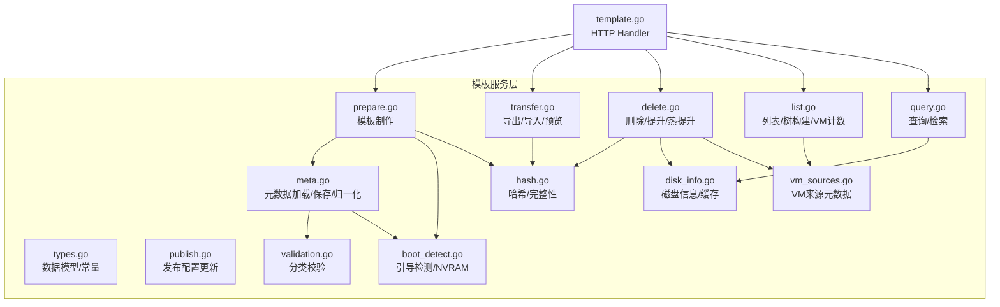

图表来源
- [types.go:1-423](file://server/service/template/types.go#L1-L423)
- [meta.go:1-441](file://server/service/template/meta.go#L1-L441)
- [publish.go:1-62](file://server/service/template/publish.go#L1-L62)
- [validation.go:1-35](file://server/service/template/validation.go#L1-L35)
- [disk_info.go:1-127](file://server/service/template/disk_info.go#L1-L127)
- [boot_detect.go:1-161](file://server/service/template/boot_detect.go#L1-L161)
- [prepare.go:1-142](file://server/service/template/prepare.go#L1-L142)
- [query.go:1-127](file://server/service/template/query.go#L1-L127)
- [list.go:1-262](file://server/service/template/list.go#L1-L262)
- [hash.go:1-72](file://server/service/template/hash.go#L1-L72)
- [transfer.go:1-682](file://server/service/template/transfer.go#L1-L682)
- [delete.go:1-699](file://server/service/template/delete.go#L1-L699)
- [vm_sources.go:1-93](file://server/service/template/vm_sources.go#L1-L93)
- [template.go:1-284](file://server/handler/template.go#L1-L284)

章节来源
- [types.go:1-423](file://server/service/template/types.go#L1-L423)
- [template.go:1-284](file://server/handler/template.go#L1-L284)

## 核心组件
- 数据模型与常量
  - TemplateMeta：模板元数据（类型、分类、引导类型、NVRAM、默认硬件配置、模板族标识、节点关系、可见性、禁用标志、来源 VM、创建时间、哈希与大小等）
  - TemplateInfo：模板信息（文件名、实际/虚拟大小、类型/分类/引导类型、是否默认、路径、导出状态与下载路径、节点关系、哈希状态、树结构统计等）
  - TemplateDefaultConfig：默认硬件配置（vcpu、内存、磁盘大小、磁盘总线、网卡模型、显卡模型、CPU 拓扑模式、首次启动重启模式）
  - 常量：模板来源元数据 URI/键、引导检测超时、删除模式、磁盘信息并发上限、默认分类、正则匹配模式等
- 关键流程
  - 制作模板：从 VM 复制磁盘、检测引导类型、收集默认硬件配置、写入元数据、设置不可变属性
  - 发布与可见性：更新管理员名称、显示名称、分类、默认硬件配置、可见性与禁用标志
  - 查询与检索：按名称/节点 ID 查询、最小磁盘尺寸、克隆可见性校验
  - 导出/导入：打包导出模板树、预览导入、校验哈希与清单、写入元数据
  - 删除与提升：级联删除、静默提升子节点、热提升（在线切换 backing 并 pivot 运行中 VM）
  - 来源管理：在 VM 的 libvirt XML 中注入/读取模板来源元数据

章节来源
- [types.go:50-126](file://server/service/template/types.go#L50-L126)
- [types.go:138-196](file://server/service/template/types.go#L138-L196)
- [types.go:150-179](file://server/service/template/types.go#L150-L179)
- [types.go:215-243](file://server/service/template/types.go#L215-L243)
- [types.go:269-321](file://server/service/template/types.go#L269-L321)

## 架构总览
模板管理的端到端流程包括：
- 制作模板：Handler 接收请求 -> 提交异步任务 -> 服务层执行 PrepareTemplate -> 复制磁盘、检测引导、收集默认配置、写入元数据与哈希 -> 设置文件不可变
- 发布配置：Handler 接收请求 -> 服务层 UpdateTemplatePublish -> 归一化分类与默认配置 -> 保存元数据
- 查询检索：Handler 查询 -> 服务层 ListTemplates/GetTemplateInfoByName/ResolveCloneDiskSizeGB -> 构建模板树/填充磁盘信息/校验可见性
- 传输与同步：导出打包清单与磁盘 -> 预览导入校验 -> 写入模板与元数据 -> 设置不可变
- 生命周期：删除预览 -> 根据模式执行级联删除/提升/热提升 -> 对运行中 VM 执行 blockpull/pivot 等操作

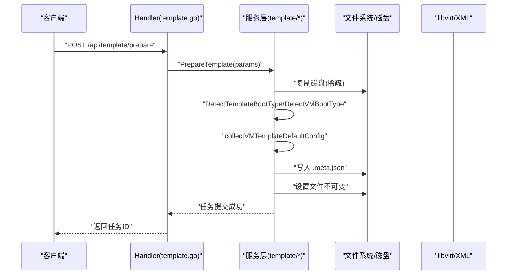

图表来源
- [template.go:54-82](file://server/handler/template.go#L54-L82)
- [prepare.go:15-116](file://server/service/template/prepare.go#L15-L116)

## 详细组件分析

### 组件A：模板元数据与默认配置
- 加载与保存
  - 加载：读取 .meta.json，若缺失返回空；保存：写入并设置不可变属性，失败回滚
  - 归一化：类型标准化、分类标准化、引导类型解析、NVRAM 路径补全、默认配置规范化
- 默认配置采集：从 VM 的域信息、磁盘信息、网络信息、视频模型、CPU 拓扑等汇总
- 视图模型：TemplateInfo 与 TemplateMeta 的差异与映射关系

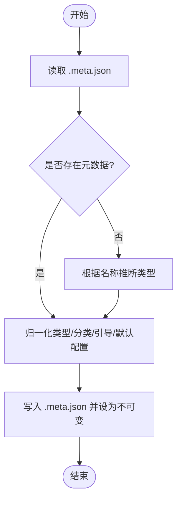

图表来源
- [meta.go:31-58](file://server/service/template/meta.go#L31-L58)
- [meta.go:281-334](file://server/service/template/meta.go#L281-L334)
- [meta.go:338-391](file://server/service/template/meta.go#L338-L391)

章节来源
- [meta.go:21-87](file://server/service/template/meta.go#L21-L87)
- [meta.go:281-334](file://server/service/template/meta.go#L281-L334)
- [meta.go:338-391](file://server/service/template/meta.go#L338-L391)

### 组件B：引导检测与 NVRAM 管理
- 引导类型检测：优先使用 VM 的 DomainXML firmware 属性，其次使用 virt-filesystems 检测文件系统/EFI
- NVRAM 路径提取与拷贝：从 VM XML 提取 nvram 路径，复制到模板目录并设置权限
- 导出时补齐缺失的引导类型：若元数据未设置则检测并写回

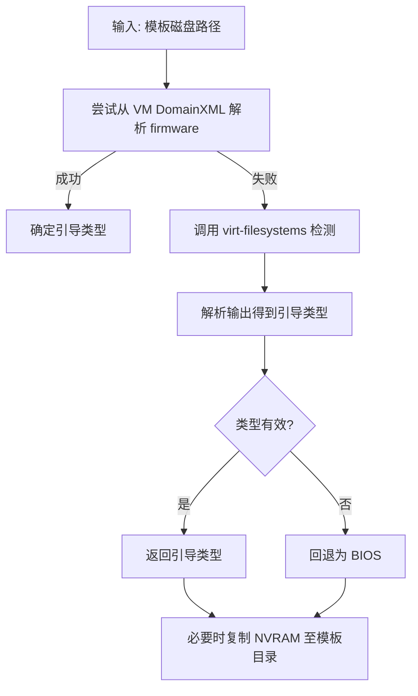

图表来源
- [boot_detect.go:65-104](file://server/service/template/boot_detect.go#L65-L104)
- [boot_detect.go:120-160](file://server/service/template/boot_detect.go#L120-L160)

章节来源
- [boot_detect.go:44-104](file://server/service/template/boot_detect.go#L44-L104)
- [boot_detect.go:120-160](file://server/service/template/boot_detect.go#L120-L160)

### 组件C：模板制作流程
- 输入参数：VM 名称、模板名称、显示名称、类型、分类、用户与密码
- 步骤：确保模板目录存在、校验模板名、获取 VM 磁盘路径、校验 VM 状态（需关机）、复制磁盘、检测引导类型、收集默认配置、写入元数据、计算哈希、设置不可变
- 来源模板解析：从 VM 模板来源元数据或 fallback 模板名解析父模板，建立模板族关系

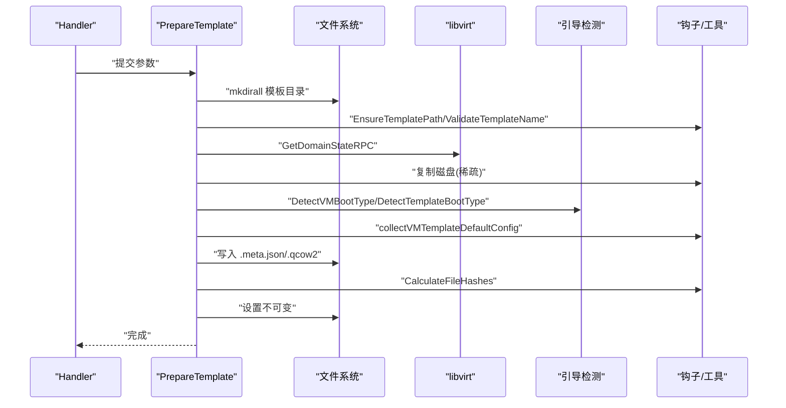

图表来源
- [prepare.go:15-116](file://server/service/template/prepare.go#L15-L116)
- [vm_sources.go:118-141](file://server/service/template/vm_sources.go#L118-L141)

章节来源
- [prepare.go:15-116](file://server/service/template/prepare.go#L15-L116)
- [vm_sources.go:118-141](file://server/service/template/vm_sources.go#L118-L141)

### 组件D：查询与检索机制
- 按名称/节点 ID 查询模板信息
- 计算模板最小磁盘大小（基于 qemu-img info）
- 克隆可见性校验：管理员可强制查看，普通用户需 CloneVisible 且 Disabled=false
- 列表构建：扫描 .qcow2 文件，加载元数据，归一化，批量填充磁盘信息，构建模板树，统计 VM 数量与层级

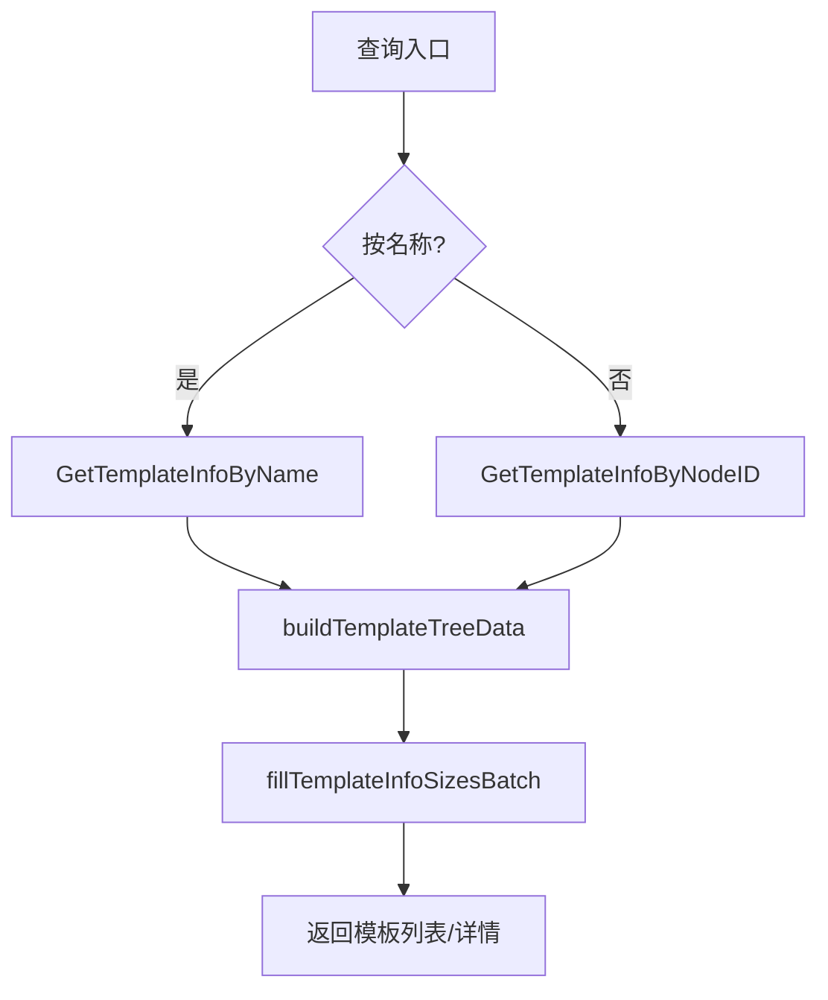

图表来源
- [query.go:36-127](file://server/service/template/query.go#L36-L127)
- [list.go:21-156](file://server/service/template/list.go#L21-L156)

章节来源
- [query.go:13-127](file://server/service/template/query.go#L13-L127)
- [list.go:21-156](file://server/service/template/list.go#L21-L156)

### 组件E：模板传输与同步
- 导出
  - 选择根节点或当前节点，构建清单（包含每个节点的磁盘与元数据），写入 manifest.json，打包 tar.gz
  - 生成下载路径与文件大小
- 导入预览
  - 解压模板包，读取清单，校验模板 UID、节点 ID、文件名冲突、磁盘文件存在性
  - 生成预览令牌，记录会话，过期清理
- 导入
  - 单文件 qcow2 导入（兼容旧版）或模板包导入
  - 校验磁盘格式与哈希一致性，写入模板与元数据，设置不可变
- 目录与命名
  - 导出目录、导入临时目录、导出文件名与元数据文件名规范

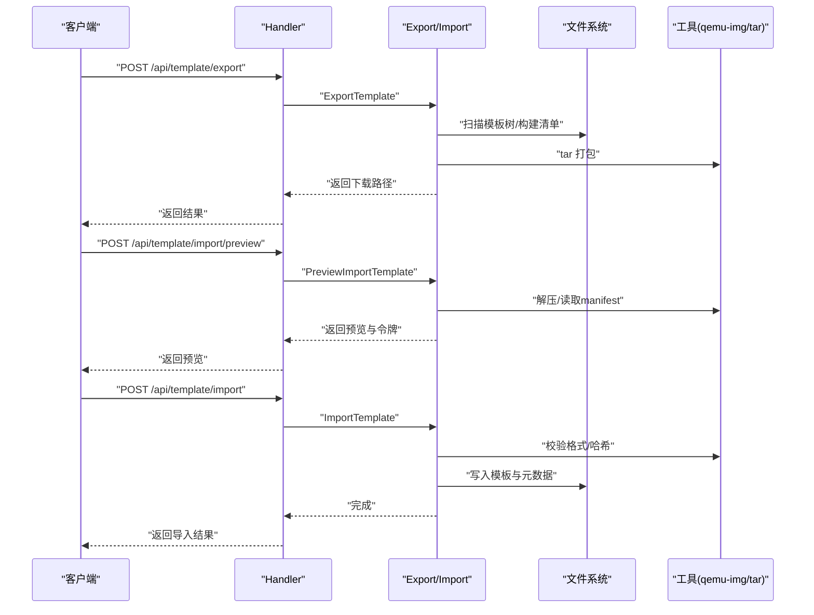

图表来源
- [transfer.go:256-341](file://server/service/template/transfer.go#L256-L341)
- [transfer.go:376-473](file://server/service/template/transfer.go#L376-L473)
- [transfer.go:503-603](file://server/service/template/transfer.go#L503-L603)

章节来源
- [transfer.go:256-341](file://server/service/template/transfer.go#L256-L341)
- [transfer.go:376-473](file://server/service/template/transfer.go#L376-L473)
- [transfer.go:503-603](file://server/service/template/transfer.go#L503-L603)

### 组件F：版本管理、哈希校验与完整性验证
- 哈希计算：对模板磁盘计算 MD5、SHA256 与文件大小
- 完整性校验：对比元数据中的哈希与大小，若缺失或不一致则标记为异常
- 磁盘信息缓存：基于 stat/modtime 的缓存，避免重复调用 qemu-img
- 并发优化：批量填充磁盘信息时限制工作协程数量

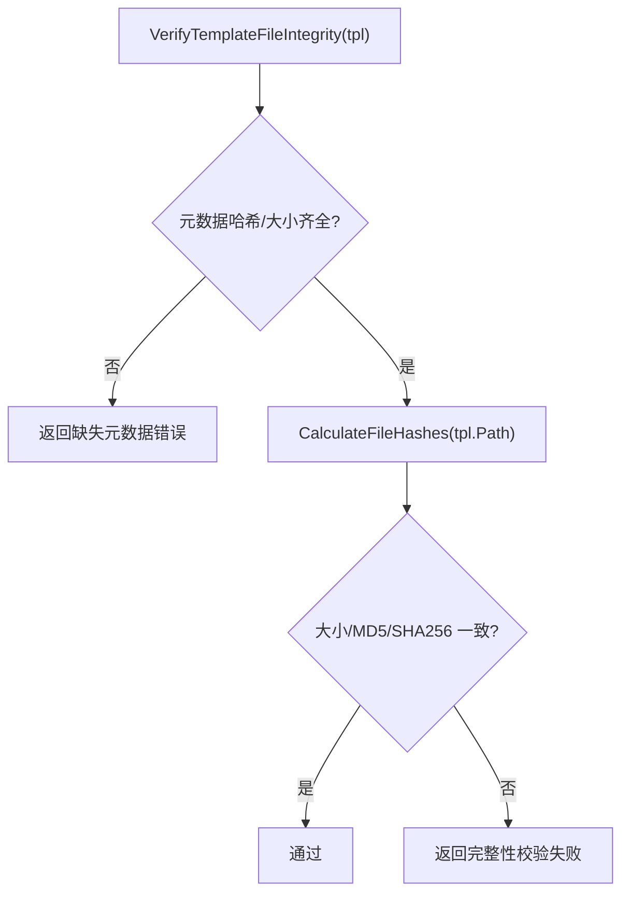

图表来源
- [hash.go:36-49](file://server/service/template/hash.go#L36-L49)
- [disk_info.go:90-126](file://server/service/template/disk_info.go#L90-L126)

章节来源
- [hash.go:13-49](file://server/service/template/hash.go#L13-L49)
- [disk_info.go:33-71](file://server/service/template/disk_info.go#L33-L71)

### 组件G：来源管理与 VM 源配置
- VM 源扫描：遍历 /etc/libvirt/qemu/*.xml，解析模板来源元数据（名称、节点 ID、克隆模式）
- 写入来源：将模板来源元数据写入 VM 的 libvirt XML 元数据区域
- 读取来源：从 VM 的 libvirt XML 读取模板来源元数据

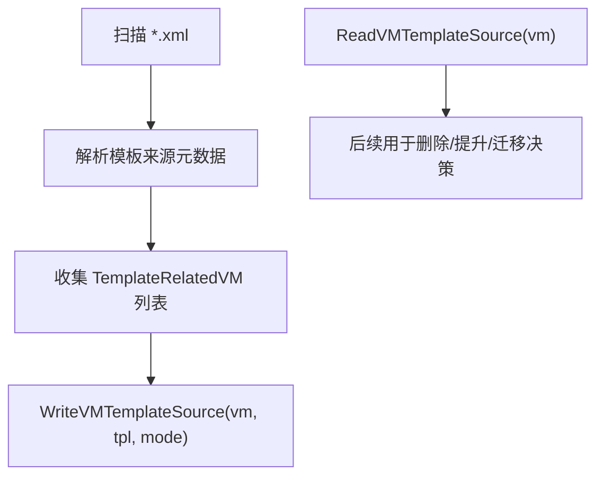

图表来源
- [vm_sources.go:14-52](file://server/service/template/vm_sources.go#L14-L52)
- [vm_sources.go:54-92](file://server/service/template/vm_sources.go#L54-L92)

章节来源
- [vm_sources.go:14-92](file://server/service/template/vm_sources.go#L14-L92)

### 组件H：生命周期管理与删除策略
- 删除预览：收集模板子树、关联 VM、统计直接/树形 VM 数量、判断提升/热提升可行性
- 删除模式
  - 级联删除：删除模板文件与关联 VM（需要确认）
  - 静默提升：将子模板提升为直接继承父模板的 backing，直接 VM 重定向到父模板
  - 热提升：在线 pivot 运行中 VM 的 backing，支持 running/shut off 状态
- 安全约束：确保 backing 链正确、无外部快照、磁盘可离开旧 backing

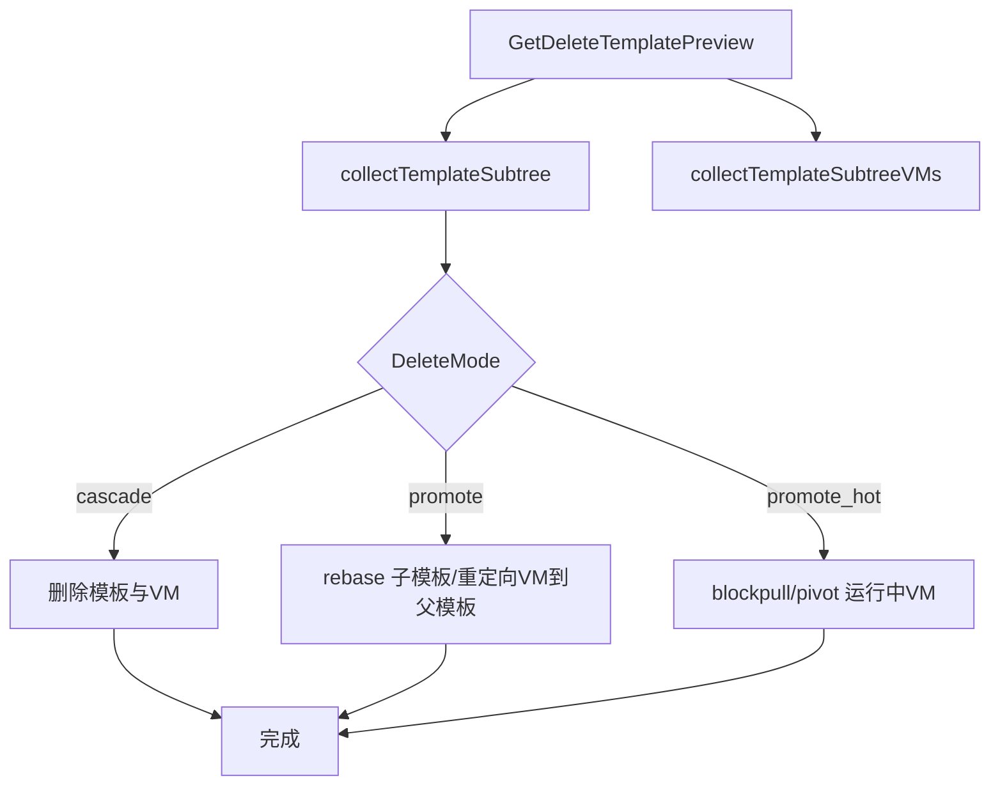

图表来源
- [delete.go:123-154](file://server/service/template/delete.go#L123-L154)
- [delete.go:222-296](file://server/service/template/delete.go#L222-L296)
- [delete.go:298-378](file://server/service/template/delete.go#L298-L378)

章节来源
- [delete.go:16-121](file://server/service/template/delete.go#L16-L121)
- [delete.go:222-378](file://server/service/template/delete.go#L222-L378)

## 依赖分析
- 模块内依赖
  - types.go 为所有组件提供数据契约
  - meta.go 依赖 libvirt_rpc/vm_xml/utils/config 等进行 XML 解析与系统调用
  - boot_detect.go 依赖 utils/exec 与 libvirt_rpc
  - disk_info.go 依赖 utils/cmd 与全局缓存
  - transfer.go 依赖 utils/cmd、config、正则与上下文超时控制
  - delete.go 依赖 utils/cmd、libvirt/virsh、钩子函数进行磁盘改写与运行中 VM 处理
- 外部依赖
  - qemu-img：磁盘格式检测、info、rebase、blockpull/blockcopy/pivot
  - virsh：metadata、blockcopy、blockpull、domain 更新
  - libvirt RPC：获取域 XML、状态、信息
  - 文件系统：模板目录、导出/导入目录、不可变属性

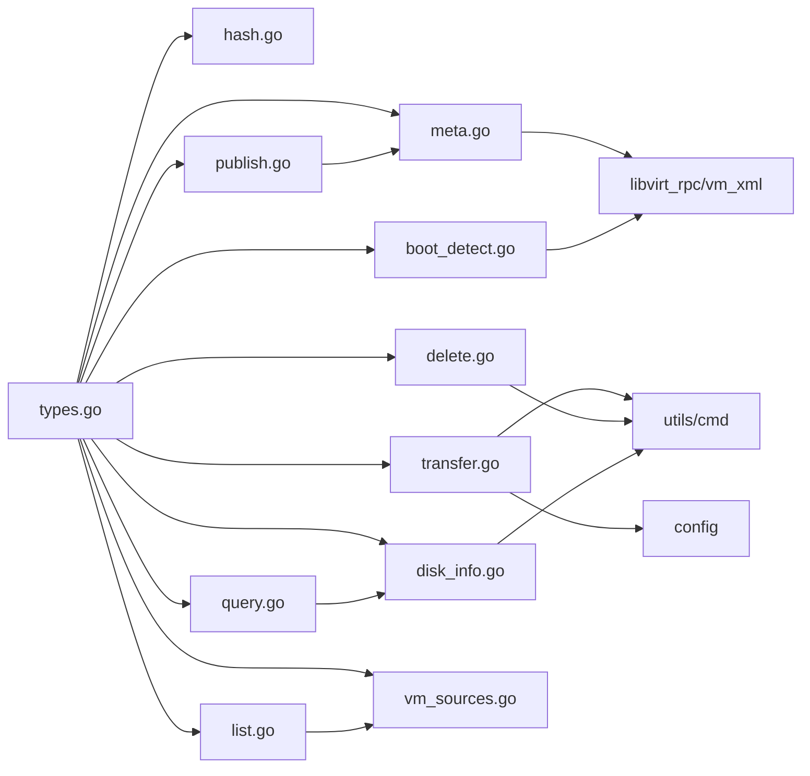

图表来源
- [types.go:1-423](file://server/service/template/types.go#L1-L423)
- [meta.go:1-19](file://server/service/template/meta.go#L1-L19)
- [boot_detect.go:1-14](file://server/service/template/boot_detect.go#L1-L14)
- [disk_info.go:1-8](file://server/service/template/disk_info.go#L1-L8)
- [hash.go:1-11](file://server/service/template/hash.go#L1-L11)
- [transfer.go:1-15](file://server/service/template/transfer.go#L1-L15)
- [delete.go:1-14](file://server/service/template/delete.go#L1-L14)
- [list.go:1-10](file://server/service/template/list.go#L1-L10)
- [query.go:1-11](file://server/service/template/query.go#L1-L11)
- [publish.go:1-5](file://server/service/template/publish.go#L1-L5)
- [vm_sources.go:1-12](file://server/service/template/vm_sources.go#L1-L12)

章节来源
- [types.go:1-423](file://server/service/template/types.go#L1-L423)
- [meta.go:1-19](file://server/service/template/meta.go#L1-L19)
- [boot_detect.go:1-14](file://server/service/template/boot_detect.go#L1-L14)
- [disk_info.go:1-8](file://server/service/template/disk_info.go#L1-L8)
- [hash.go:1-11](file://server/service/template/hash.go#L1-L11)
- [transfer.go:1-15](file://server/service/template/transfer.go#L1-L15)
- [delete.go:1-14](file://server/service/template/delete.go#L1-L14)
- [list.go:1-10](file://server/service/template/list.go#L1-L10)
- [query.go:1-11](file://server/service/template/query.go#L1-L11)
- [publish.go:1-5](file://server/service/template/publish.go#L1-L5)
- [vm_sources.go:1-12](file://server/service/template/vm_sources.go#L1-L12)

## 性能考虑
- 磁盘信息并发：批量填充磁盘信息时限制最大工作协程数，避免过多 qemu-img 并发导致资源争用
- 缓存策略：基于 stat/modtime 的磁盘信息缓存，减少重复 IO
- 稀疏复制：制作与导入均使用稀疏复制，降低 IO 与存储压力
- 上下文超时：关键命令（复制、打包、rebase、pivot）均设置超时，避免长时间阻塞
- 清理策略：导入预览会定期清理过期临时文件，释放空间

章节来源
- [disk_info.go:33-71](file://server/service/template/disk_info.go#L33-L71)
- [disk_info.go:90-126](file://server/service/template/disk_info.go#L90-L126)
- [transfer.go:147-171](file://server/service/template/transfer.go#L147-L171)
- [delete.go:456-473](file://server/service/template/delete.go#L456-L473)

## 故障排除指南
- 制作模板失败
  - VM 处于运行态：需先关机
  - 模板名不合法或已存在：检查命名规则与目录
  - 磁盘复制失败：检查磁盘路径与权限
- 发布配置更新失败
  - 分类不合法：仅 Linux/Windows 支持二级分类
  - 默认配置不合法：自动规范化，若全部为 0 则忽略
- 导出失败
  - 模板不存在或清单不完整：检查模板树与 manifest
  - 压缩失败：检查导出目录权限与磁盘空间
- 导入失败
  - 模板包不合法：缺少 manifest 或包含非法路径
  - 哈希不匹配：模板包与磁盘不一致，拒绝导入
  - 文件名冲突：模板文件名已存在
- 删除失败
  - 存在运行中 VM：需关机或选择热提升
  - 外部快照：需先删除外部快照
  - backing 不匹配：磁盘当前 backing 非预期模板，拒绝自动改写
- 完整性校验失败
  - 元数据缺失：补充哈希与大小
  - 磁盘被篡改：重新制作模板或修复磁盘

章节来源
- [prepare.go:30-41](file://server/service/template/prepare.go#L30-L41)
- [validation.go:8-34](file://server/service/template/validation.go#L8-L34)
- [transfer.go:376-473](file://server/service/template/transfer.go#L376-L473)
- [transfer.go:503-603](file://server/service/template/transfer.go#L503-L603)
- [delete.go:184-220](file://server/service/template/delete.go#L184-L220)
- [delete.go:382-414](file://server/service/template/delete.go#L382-L414)
- [hash.go:36-49](file://server/service/template/hash.go#L36-L49)

## 结论
模板管理系统围绕“元数据驱动 + 磁盘链式管理 + 安全删除/提升”构建，具备完善的制作、发布、查询、传输、校验与生命周期管理能力。通过引导检测、哈希校验与 NVRAM 管理，保障模板质量与兼容性；通过导出/导入与模板包机制，实现跨节点同步与版本演进；通过删除预览与多种删除模式，兼顾安全性与灵活性。

## 附录
- 最佳实践
  - 制作模板前确保 VM 已关机并清理环境
  - 使用默认硬件配置收集功能，避免手工配置偏差
  - 定期导出模板树，保留模板族版本
  - 导入前先预览，核对模板 UID、节点 ID、文件名与哈希
  - 删除前先预览，确认关联 VM 列表与删除模式
  - 对关键模板启用不可变属性，防止误删
- 常见问题
  - 引导类型识别不准：检查 VM DomainXML 与 EFI 分区
  - 磁盘信息不准确：检查 qemu-img 输出与缓存失效
  - 运行中 VM 热提升失败：检查外部快照与 backing 链