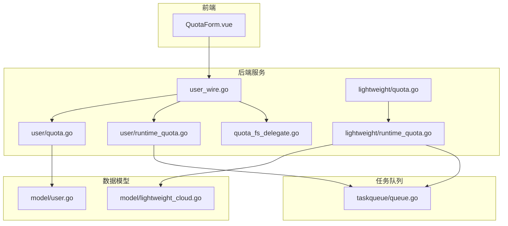
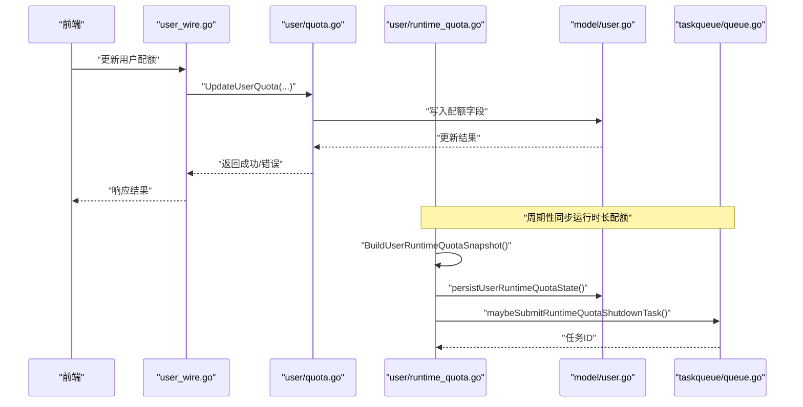
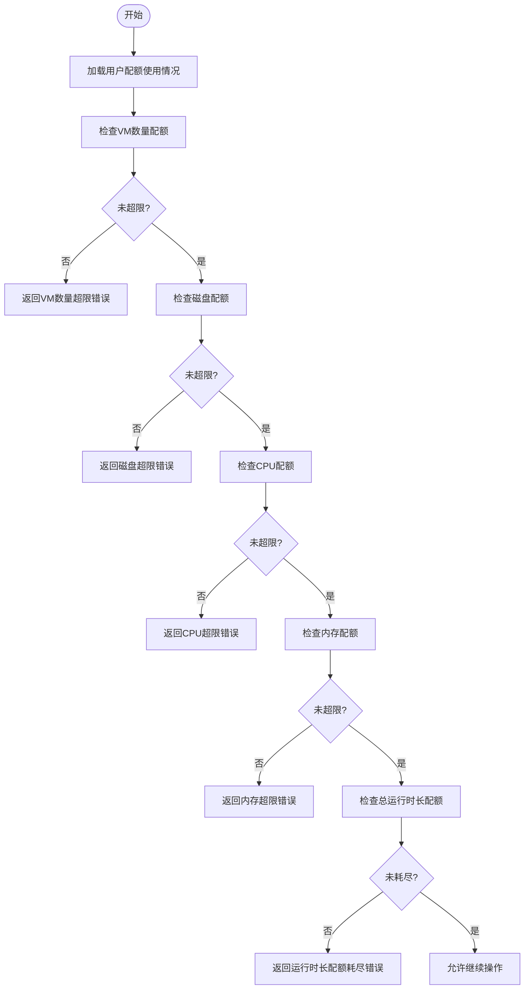
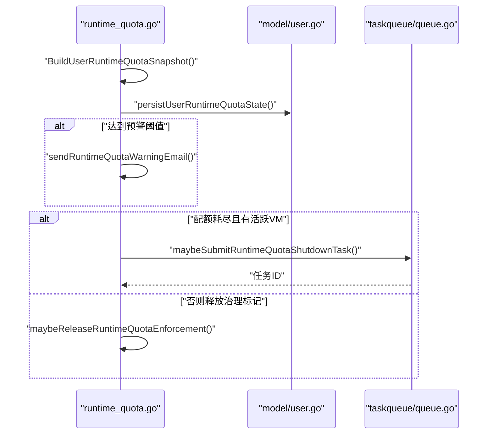
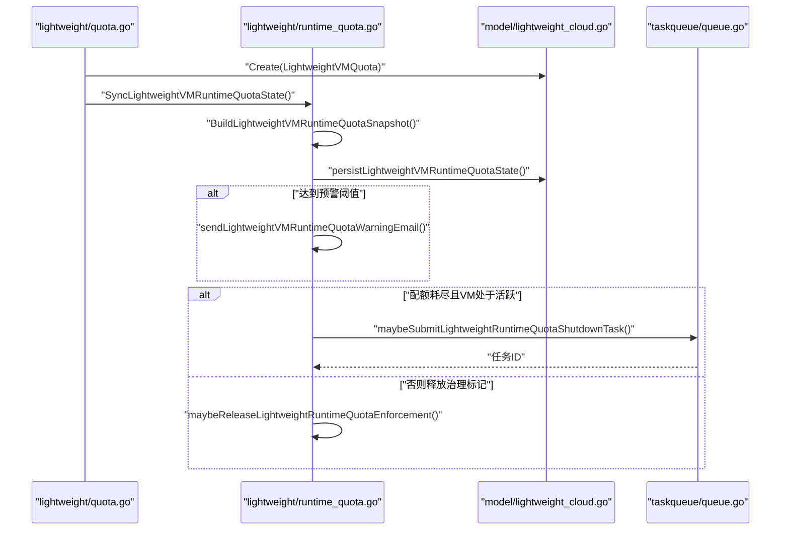
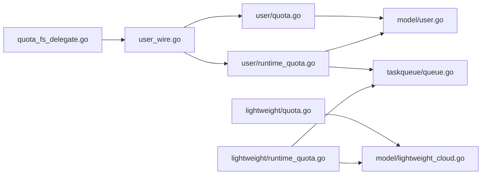

# 配额控制

<cite>
**本文引用的文件**
- [server/service/user/quota.go](file://server/service/user/quota.go)
- [server/service/user/runtime_quota.go](file://server/service/user/runtime_quota.go)
- [server/service/lightweight/runtime_quota.go](file://server/service/lightweight/runtime_quota.go)
- [server/service/lightweight/quota.go](file://server/service/lightweight/quota.go)
- [server/service/quota_fs_delegate.go](file://server/service/quota_fs_delegate.go)
- [server/service/user_wire.go](file://server/service/user_wire.go)
- [server/handler/user.go](file://server/handler/user.go)
- [server/model/user.go](file://server/model/user.go)
- [server/model/lightweight_cloud.go](file://server/model/lightweight_cloud.go)
- [server/taskqueue/queue.go](file://server/taskqueue/queue.go)
- [web/src/components/QuotaForm.vue](file://web/src/components/QuotaForm.vue)
</cite>

## 目录
1. [简介](#简介)
2. [项目结构](#项目结构)
3. [核心组件](#核心组件)
4. [架构总览](#架构总览)
5. [详细组件分析](#详细组件分析)
6. [依赖关系分析](#依赖关系分析)
7. [性能考量](#性能考量)
8. [故障排查指南](#故障排查指南)
9. [结论](#结论)
10. [附录](#附录)

## 简介
本文件面向“存储配额控制系统”，系统性梳理用户与轻量云虚拟机的配额计算、分配、监控与执行机制，覆盖以下关键能力：
- 用户维度配额：CPU/内存/磁盘/VM数量/总运行时长等多维配额校验与使用统计
- 轻量云配额：按单 VM 的运行时长配额与自动关机/预警联动
- 运行时配额检查：周期性同步、预警阈值、自动关机任务
- 动态调整与审计：管理员通过接口调整配额；系统持久化配额状态并支持审计
- 告警与恢复：邮件预警、自动关机任务、配额解除与恢复流程
- 性能与稳定性：批量同步、并发保护、任务队列解耦

## 项目结构
围绕配额控制的关键代码分布在服务层、模型层与前端组件中：
- 服务层：用户配额校验、运行时长配额同步与执行、轻量云配额与运行时长控制、配额文件系统代理
- 模型层：用户与轻量云配额数据结构及数据库访问
- 前端：配额表单组件，用于展示与编辑配额参数

图表来源
- [server/service/user_wire.go:422-449](file://server/service/user_wire.go#L422-L449)
- [server/service/user/quota.go:112-149](file://server/service/user/quota.go#L112-L149)
- [server/service/user/runtime_quota.go:155-304](file://server/service/user/runtime_quota.go#L155-L304)
- [server/service/lightweight/quota.go:86-121](file://server/service/lightweight/quota.go#L86-L121)
- [server/service/lightweight/runtime_quota.go:1-200](file://server/service/lightweight/runtime_quota.go#L1-L200)
- [server/service/quota_fs_delegate.go:51-76](file://server/service/quota_fs_delegate.go#L51-L76)
- [server/model/user.go](file://server/model/user.go)
- [server/model/lightweight_cloud.go](file://server/model/lightweight_cloud.go)
- [server/taskqueue/queue.go](file://server/taskqueue/queue.go)
- [web/src/components/QuotaForm.vue](file://web/src/components/QuotaForm.vue)

章节来源
- [server/service/user_wire.go:422-449](file://server/service/user_wire.go#L422-L449)
- [server/service/user/quota.go:112-149](file://server/service/user/quota.go#L112-L149)
- [server/service/user/runtime_quota.go:155-304](file://server/service/user/runtime_quota.go#L155-L304)
- [server/service/lightweight/quota.go:86-121](file://server/service/lightweight/quota.go#L86-L121)
- [server/service/lightweight/runtime_quota.go:1-200](file://server/service/lightweight/runtime_quota.go#L1-L200)
- [server/service/quota_fs_delegate.go:51-76](file://server/service/quota_fs_delegate.go#L51-L76)
- [server/model/user.go](file://server/model/user.go)
- [server/model/lightweight_cloud.go](file://server/model/lightweight_cloud.go)
- [server/taskqueue/queue.go](file://server/taskqueue/queue.go)
- [web/src/components/QuotaForm.vue](file://web/src/components/QuotaForm.vue)

## 核心组件
- 用户配额校验与使用统计
  - 在创建/编辑资源时进行多维配额检查，包括VM数量、磁盘容量、CPU/内存总量、总运行时长配额
  - 使用统计来源于数据库查询与聚合，返回当前已用与上限
- 用户运行时长配额同步与执行
  - 定期扫描活跃VM集合，计算用户维度累计运行时长配额，持久化状态
  - 达到阈值或耗尽时触发邮件预警，并在满足条件时提交自动关机任务
- 轻量云配额与运行时长控制
  - 单VM运行时长配额独立管理，支持独立预警与自动关机
  - 创建轻量云VM时初始化配额并应用带宽策略
- 配额文件系统代理
  - 提供配额工具可用性检测与全量用户配额同步钩子，避免循环依赖
- 前端配额表单
  - 展示与编辑用户配额参数，调用后端接口完成更新

章节来源
- [server/service/user/quota.go:112-149](file://server/service/user/quota.go#L112-L149)
- [server/service/user/runtime_quota.go:155-304](file://server/service/user/runtime_quota.go#L155-L304)
- [server/service/lightweight/runtime_quota.go:1-200](file://server/service/lightweight/runtime_quota.go#L1-L200)
- [server/service/lightweight/quota.go:86-121](file://server/service/lightweight/quota.go#L86-L121)
- [server/service/quota_fs_delegate.go:51-76](file://server/service/quota_fs_delegate.go#L51-L76)
- [web/src/components/QuotaForm.vue](file://web/src/components/QuotaForm.vue)

## 架构总览
系统采用“服务层-模型层-任务队列”分层设计，配额校验前置于资源操作，运行时长配额通过定时同步与任务队列实现自动化治理。

图表来源
- [server/service/user_wire.go:422-449](file://server/service/user_wire.go#L422-L449)
- [server/service/user/quota.go:112-149](file://server/service/user/quota.go#L112-L149)
- [server/service/user/runtime_quota.go:155-304](file://server/service/user/runtime_quota.go#L155-L304)
- [server/model/user.go](file://server/model/user.go)
- [server/taskqueue/queue.go](file://server/taskqueue/queue.go)

## 详细组件分析

### 用户配额校验与使用统计
- 多维配额检查逻辑
  - VM数量、磁盘容量、CPU/内存总量、总运行时长配额均在创建/编辑资源前进行校验
  - 当任一维度超限时，返回明确的错误信息，包含已用量与上限
- 使用统计
  - 通过查询与聚合得到当前已用值，结合上限判断是否允许继续操作
- 关键路径
  - handler接收请求，调用服务层接口进行配额校验
  - 服务层根据当前使用与请求量计算是否越界

图表来源
- [server/service/user/quota.go:112-149](file://server/service/user/quota.go#L112-L149)

章节来源
- [server/service/user/quota.go:112-149](file://server/service/user/quota.go#L112-L149)
- [server/handler/user.go:484-524](file://server/handler/user.go#L484-L524)

### 用户运行时长配额同步与执行
- 快照构建
  - 根据上次观测时间与当前时间差增量累计使用秒数
  - 计算剩余秒数与是否达到配额
- 状态持久化
  - 更新已用秒数、活跃VM计数、最后观测时间等字段
- 预警与执行
  - 达到预警阈值时发送邮件并清除已发时间戳
  - 配额耗尽且存在活跃VM时提交自动关机任务，防止资源滥用
- 并发与幂等
  - 通过标记位避免重复提交任务，确保治理动作幂等

图表来源
- [server/service/user/runtime_quota.go:155-304](file://server/service/user/runtime_quota.go#L155-L304)
- [server/model/user.go](file://server/model/user.go)
- [server/taskqueue/queue.go](file://server/taskqueue/queue.go)

章节来源
- [server/service/user/runtime_quota.go:155-304](file://server/service/user/runtime_quota.go#L155-L304)

### 轻量云配额与运行时长控制
- 单VM配额
  - 为每个轻量云VM单独维护运行时长配额，支持独立的预警与自动关机
- 生命周期
  - 创建VM时初始化配额并应用带宽策略
  - 同步时填充流量、端口转发、快照等使用统计
- 执行机制
  - 与用户级运行时长配额类似，但作用域限定在单VM

图表来源
- [server/service/lightweight/quota.go:86-121](file://server/service/lightweight/quota.go#L86-L121)
- [server/service/lightweight/runtime_quota.go:1-200](file://server/service/lightweight/runtime_quota.go#L1-L200)
- [server/model/lightweight_cloud.go](file://server/model/lightweight_cloud.go)
- [server/taskqueue/queue.go](file://server/taskqueue/queue.go)

章节来源
- [server/service/lightweight/quota.go:86-121](file://server/service/lightweight/quota.go#L86-L121)
- [server/service/lightweight/runtime_quota.go:1-200](file://server/service/lightweight/runtime_quota.go#L1-L200)

### 配额文件系统代理与全量同步
- 工具可用性检测
  - 提供配额相关工具可用性检查，保障后续配额统计与同步的可靠性
- 全量用户配额同步
  - 通过钩子函数遍历用户列表，提供用户名与最大存储配额，供外部模块使用
- 解耦设计
  - 通过变量钩子避免quota包对service的直接依赖，降低循环依赖风险

章节来源
- [server/service/quota_fs_delegate.go:51-76](file://server/service/quota_fs_delegate.go#L51-L76)

### 前端配额表单与管理员操作
- 表单组件
  - 展示用户配额参数，支持编辑并提交至后端
- 管理员更新配额
  - 通过接口更新用户配额，非轻量云类型支持更新全部配额项

章节来源
- [web/src/components/QuotaForm.vue](file://web/src/components/QuotaForm.vue)
- [server/handler/user.go:484-524](file://server/handler/user.go#L484-L524)

## 依赖关系分析
- 组件内聚与耦合
  - 用户配额校验与运行时长配额分别位于不同文件，职责清晰
  - 轻量云配额与运行时长配额独立实现，便于扩展与维护
- 外部依赖
  - 数据库模型提供持久化能力
  - 任务队列用于异步执行自动关机等治理动作
  - 前端组件负责用户交互与参数传递

图表来源
- [server/service/user/quota.go:112-149](file://server/service/user/quota.go#L112-L149)
- [server/service/user/runtime_quota.go:155-304](file://server/service/user/runtime_quota.go#L155-L304)
- [server/service/lightweight/quota.go:86-121](file://server/service/lightweight/quota.go#L86-L121)
- [server/service/lightweight/runtime_quota.go:1-200](file://server/service/lightweight/runtime_quota.go#L1-L200)
- [server/service/quota_fs_delegate.go:51-76](file://server/service/quota_fs_delegate.go#L51-L76)
- [server/service/user_wire.go:422-449](file://server/service/user_wire.go#L422-L449)
- [server/model/user.go](file://server/model/user.go)
- [server/model/lightweight_cloud.go](file://server/model/lightweight_cloud.go)
- [server/taskqueue/queue.go](file://server/taskqueue/queue.go)

章节来源
- [server/service/user/quota.go:112-149](file://server/service/user/quota.go#L112-L149)
- [server/service/user/runtime_quota.go:155-304](file://server/service/user/runtime_quota.go#L155-L304)
- [server/service/lightweight/quota.go:86-121](file://server/service/lightweight/quota.go#L86-L121)
- [server/service/lightweight/runtime_quota.go:1-200](file://server/service/lightweight/runtime_quota.go#L1-L200)
- [server/service/quota_fs_delegate.go:51-76](file://server/service/quota_fs_delegate.go#L51-L76)
- [server/service/user_wire.go:422-449](file://server/service/user_wire.go#L422-L449)
- [server/model/user.go](file://server/model/user.go)
- [server/model/lightweight_cloud.go](file://server/model/lightweight_cloud.go)
- [server/taskqueue/queue.go](file://server/taskqueue/queue.go)

## 性能考量
- 批量同步与并发保护
  - 运行时长配额支持批量同步与活跃VM集合输入，减少重复扫描成本
  - 通过标记位避免重复提交任务，降低抖动与资源浪费
- 异步治理
  - 自动关机等动作通过任务队列异步执行，避免阻塞主流程
- 数据一致性
  - 状态更新采用原子更新，确保并发场景下的数据正确性

## 故障排查指南
- 预警邮件发送失败
  - 观察日志中的“发送配额预警邮件失败”提示，确认邮件服务配置与收件人有效
- 自动关机任务提交失败
  - 检查任务队列可用性与权限；查看任务ID与重试策略
- 配额状态不同步
  - 确认运行时长配额同步周期与主机活跃VM集合采集是否正常
- 轻量云VM无法开机
  - 检查该VM的运行时长配额是否耗尽，必要时调整配额或等待恢复

章节来源
- [server/service/user/runtime_quota.go:155-304](file://server/service/user/runtime_quota.go#L155-L304)
- [server/service/lightweight/runtime_quota.go:1-200](file://server/service/lightweight/runtime_quota.go#L1-L200)

## 结论
本系统通过“前置校验+周期同步+异步治理”的组合拳，实现了对用户与轻量云VM配额的精细化管控。用户维度支持多维配额与总运行时长治理，轻量云维度支持单VM独立治理。配合邮件预警与自动关机任务，系统在保障资源公平使用的同时，提供了可审计、可恢复的闭环能力。

## 附录

### 配额策略配置方法
- 管理员通过前端表单或后端接口设置用户配额上限，包括CPU/内存/磁盘/VM数量/总运行时长等
- 轻量云VM在创建时初始化独立配额并应用带宽策略

章节来源
- [web/src/components/QuotaForm.vue](file://web/src/components/QuotaForm.vue)
- [server/handler/user.go:484-524](file://server/handler/user.go#L484-L524)
- [server/service/lightweight/quota.go:86-121](file://server/service/lightweight/quota.go#L86-L121)

### 配额触发的告警机制
- 预警阈值：当剩余运行时长低于阈值时触发邮件预警
- 发送条件：仅在首次达到阈值区间时发送，避免重复打扰
- 清理条件：当剩余时长高于阈值时清除已发时间戳

章节来源
- [server/service/user/runtime_quota.go:155-304](file://server/service/user/runtime_quota.go#L155-L304)
- [server/service/lightweight/runtime_quota.go:1-200](file://server/service/lightweight/runtime_quota.go#L1-L200)

### 配额恢复的自动化流程
- 自动关机：当配额耗尽且存在活跃VM时，提交自动关机任务
- 治理释放：当配额未耗尽或VM不再活跃时，释放治理标记，恢复正常运行

章节来源
- [server/service/user/runtime_quota.go:284-304](file://server/service/user/runtime_quota.go#L284-L304)
- [server/service/lightweight/runtime_quota.go:234-260](file://server/service/lightweight/runtime_quota.go#L234-L260)