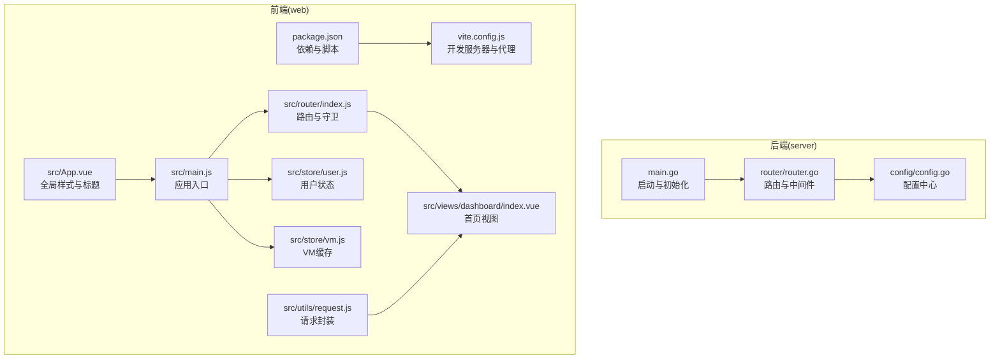
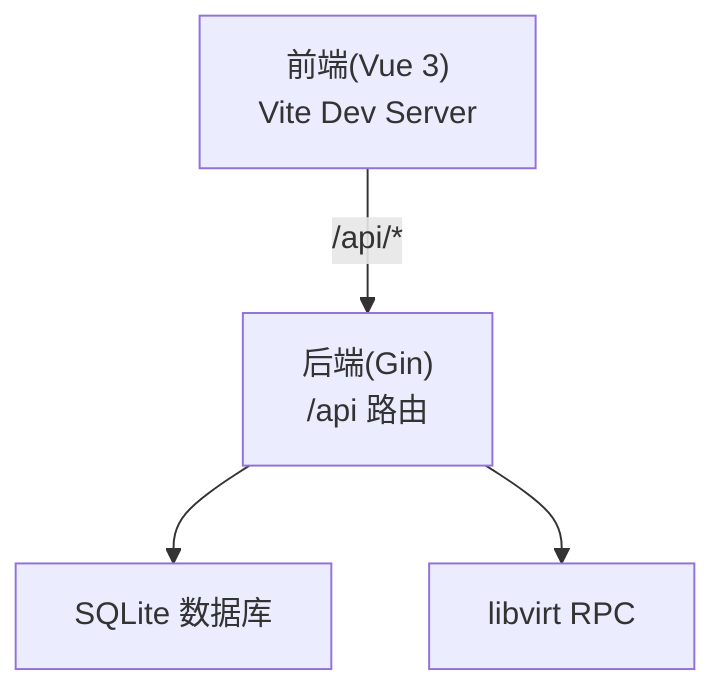
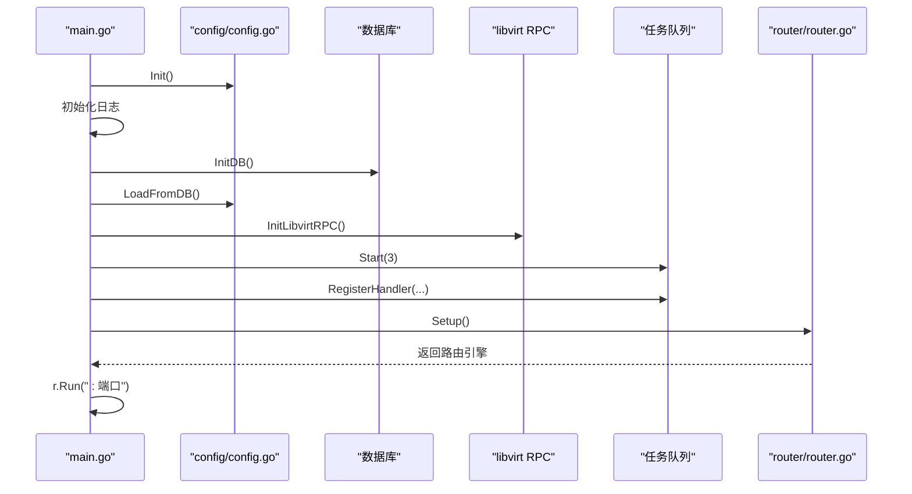
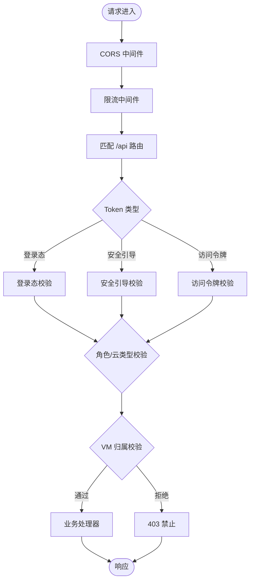
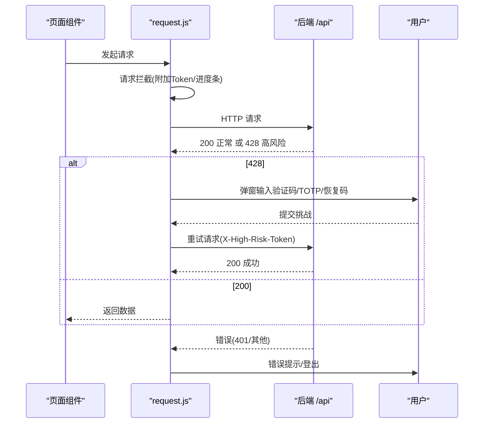
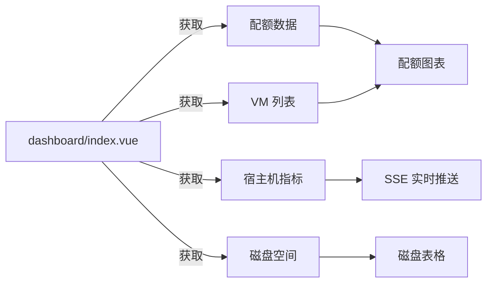
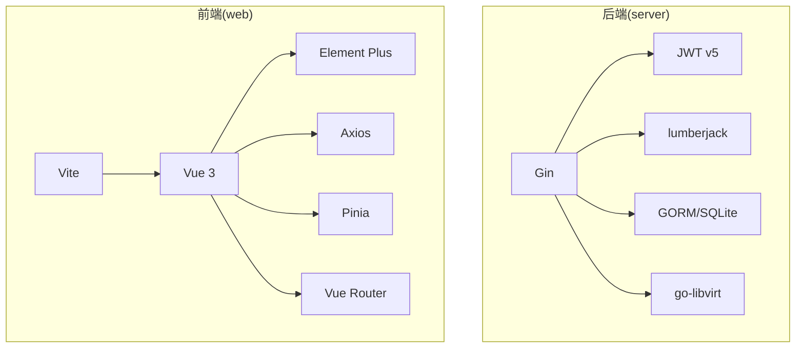

# 开发指南

<cite>
**本文引用的文件**
- [server/main.go](file://server/main.go)
- [server/go.mod](file://server/go.mod)
- [server/config/config.go](file://server/config/config.go)
- [server/router/router.go](file://server/router/router.go)
- [web/package.json](file://web/package.json)
- [web/vite.config.js](file://web/vite.config.js)
- [web/src/main.js](file://web/src/main.js)
- [web/src/App.vue](file://web/src/App.vue)
- [web/src/router/index.js](file://web/src/router/index.js)
- [web/src/store/user.js](file://web/src/store/user.js)
- [web/src/store/vm.js](file://web/src/store/vm.js)
- [web/src/utils/request.js](file://web/src/utils/request.js)
- [web/src/views/dashboard/index.vue](file://web/src/views/dashboard/index.vue)
- [start-dev.sh](file://start-dev.sh)
- [build.sh](file://build.sh)
- [.github/workflows/build.yml](file://.github/workflows/build.yml)
</cite>

## 目录
1. [简介](#简介)
2. [项目结构](#项目结构)
3. [核心组件](#核心组件)
4. [架构总览](#架构总览)
5. [详细组件分析](#详细组件分析)
6. [依赖关系分析](#依赖关系分析)
7. [性能考量](#性能考量)
8. [故障排查指南](#故障排查指南)
9. [结论](#结论)
10. [附录](#附录)

## 简介
本开发指南面向希望参与 Open 虚拟机管理控制台项目的开发者，涵盖开发环境搭建、代码规范与最佳实践、调试与工具使用、测试策略、贡献流程、CI/CD 与自动化部署，以及常见问题与性能优化建议。项目采用前后端分离架构：后端基于 Go 语言与 Gin 框架，提供 REST API；前端基于 Vue 3 + Vite，使用 Element Plus 组件库与 Pinia 状态管理。

## 项目结构
- 后端 server
  - 配置与启动：main.go 负责初始化配置、日志、数据库、RPC 连接、任务队列与路由注册，并启动 HTTP 服务。
  - 路由与中间件：router/router.go 定义 API 分组与鉴权策略，集成 CORS、限流、请求日志与安全中间件。
  - 配置中心：config/config.go 提供全局配置结构与环境变量映射，支持安全检查与持久化设置同步。
- 前端 web
  - 包管理与构建：package.json 定义依赖与脚本；vite.config.js 提供代理与开发服务器配置。
  - 应用入口：src/main.js 初始化应用、插件与国际化；src/App.vue 提供全局样式与标题同步。
  - 路由与权限：src/router/index.js 定义页面路由与登录守卫；结合 src/store/user.js 管理用户状态。
  - 状态管理：src/store/vm.js 管理虚拟机列表缓存；src/utils/request.js 统一封装 Axios 请求拦截与高风险操作挑战流程。
  - 页面示例：src/views/dashboard/index.vue 展示管理员与用户视角的数据面板与图表。

**图表来源**
- [server/main.go:31-128](file://server/main.go#L31-L128)
- [server/router/router.go:18-485](file://server/router/router.go#L18-L485)
- [server/config/config.go:157-249](file://server/config/config.go#L157-L249)
- [web/package.json:1-30](file://web/package.json#L1-L30)
- [web/vite.config.js:1-27](file://web/vite.config.js#L1-L27)
- [web/src/main.js:1-26](file://web/src/main.js#L1-L26)
- [web/src/App.vue:1-64](file://web/src/App.vue#L1-L64)
- [web/src/router/index.js:1-180](file://web/src/router/index.js#L1-L180)
- [web/src/store/user.js:1-49](file://web/src/store/user.js#L1-L49)
- [web/src/store/vm.js:1-61](file://web/src/store/vm.js#L1-L61)
- [web/src/utils/request.js:1-209](file://web/src/utils/request.js#L1-L209)
- [web/src/views/dashboard/index.vue:1-1081](file://web/src/views/dashboard/index.vue#L1-L1081)

**章节来源**
- [server/main.go:31-128](file://server/main.go#L31-L128)
- [server/router/router.go:18-485](file://server/router/router.go#L18-L485)
- [server/config/config.go:157-249](file://server/config/config.go#L157-L249)
- [web/package.json:1-30](file://web/package.json#L1-L30)
- [web/vite.config.js:1-27](file://web/vite.config.js#L1-L27)
- [web/src/main.js:1-26](file://web/src/main.js#L1-L26)
- [web/src/App.vue:1-64](file://web/src/App.vue#L1-L64)
- [web/src/router/index.js:1-180](file://web/src/router/index.js#L1-L180)
- [web/src/store/user.js:1-49](file://web/src/store/user.js#L1-L49)
- [web/src/store/vm.js:1-61](file://web/src/store/vm.js#L1-L61)
- [web/src/utils/request.js:1-209](file://web/src/utils/request.js#L1-L209)
- [web/src/views/dashboard/index.vue:1-1081](file://web/src/views/dashboard/index.vue#L1-L1081)

## 核心组件
- 后端启动与初始化
  - 初始化配置、日志、数据库与 libvirt RPC 连接，加载持久化系统设置，注册任务处理器并启动任务队列与定时任务。
- 路由与鉴权
  - 分层鉴权：登录态、安全引导、高风险操作三类 Token 类型；管理员专用路由；VM 归属权限校验。
- 配置中心
  - 支持环境变量与数据库持久化配置，提供安全检查（默认密钥警告）、配置项映射与 .env 同步。
- 前端应用
  - 应用入口初始化 Element Plus、路由与 Pinia；路由守卫实现登录态与角色控制；请求封装统一处理高风险挑战与错误提示。

**章节来源**
- [server/main.go:31-128](file://server/main.go#L31-L128)
- [server/router/router.go:18-485](file://server/router/router.go#L18-L485)
- [server/config/config.go:157-249](file://server/config/config.go#L157-L249)
- [web/src/main.js:1-26](file://web/src/main.js#L1-L26)
- [web/src/router/index.js:148-177](file://web/src/router/index.js#L148-L177)
- [web/src/utils/request.js:147-206](file://web/src/utils/request.js#L147-L206)

## 架构总览
后端通过 Gin 提供 REST API，前端通过 Axios 调用 /api 前缀接口；开发时 Vite 代理将 /api 请求转发到后端。静态资源在生产环境由后端提供，开发环境由 Vite 提供。

**图表来源**
- [web/vite.config.js:17-24](file://web/vite.config.js#L17-L24)
- [server/router/router.go:35-485](file://server/router/router.go#L35-L485)
- [server/main.go:58-71](file://server/main.go#L58-L71)

**章节来源**
- [web/vite.config.js:17-24](file://web/vite.config.js#L17-L24)
- [server/router/router.go:35-485](file://server/router/router.go#L35-L485)
- [server/main.go:58-71](file://server/main.go#L58-L71)

## 详细组件分析

### 后端启动流程
- 初始化配置与日志
- 初始化数据库与持久化设置
- 建立 libvirt RPC 连接
- 启动任务队列与定时任务
- 注册任务处理器（克隆、模板、快照、存储、迁移、防火墙等）
- 设置路由并启动 HTTP 服务

**图表来源**
- [server/main.go:31-128](file://server/main.go#L31-L128)
- [server/config/config.go:157-249](file://server/config/config.go#L157-L249)
- [server/router/router.go:18-485](file://server/router/router.go#L18-L485)

**章节来源**
- [server/main.go:31-128](file://server/main.go#L31-L128)

### 路由与鉴权流程
- 全局中间件：CORS、限流、请求日志与恢复
- 鉴权中间件：按 Token 类型与角色分级授权
- VM 归属校验：非管理员用户仅可操作自身 VM
- 管理员专用路由：节点、存储池、防火墙、OVS 等

**图表来源**
- [server/router/router.go:18-485](file://server/router/router.go#L18-L485)

**章节来源**
- [server/router/router.go:18-485](file://server/router/router.go#L18-L485)

### 前端请求与高风险挑战流程
- 请求拦截：自动附加 Bearer Token，统一进度条
- 响应拦截：统一错误提示与 401 登出
- 高风险挑战：当后端返回 428 时弹窗输入邮箱验证码或 TOTP/恢复码，携带验证令牌重试

**图表来源**
- [web/src/utils/request.js:147-206](file://web/src/utils/request.js#L147-L206)

**章节来源**
- [web/src/utils/request.js:147-206](file://web/src/utils/request.js#L147-L206)

### 首页视图与数据流
- 管理员：实时资源监控环形图、宿主机 24 小时图表、挂载磁盘空间、VM 资源追踪
- 用户：资源总览与配额详情、云类型切换、VM 资源追踪
- SSE 实时推送：管理员端宿主机指标通过 SSE 实时更新

**图表来源**
- [web/src/views/dashboard/index.vue:259-636](file://web/src/views/dashboard/index.vue#L259-L636)

**章节来源**
- [web/src/views/dashboard/index.vue:259-636](file://web/src/views/dashboard/index.vue#L259-L636)

## 依赖关系分析
- 后端依赖
  - Web 框架：Gin
  - 数据库：GORM + SQLite
  - 加解密：JWT v5、crypto
  - 日志：lumberjack
  - libvirt：go-libvirt
- 前端依赖
  - 运行时：Vue 3、Element Plus、Axios、Pinia、Vue Router
  - 构建：Vite、@vitejs/plugin-vue

**图表来源**
- [server/go.mod:5-15](file://server/go.mod#L5-L15)
- [web/package.json:11-28](file://web/package.json#L11-L28)

**章节来源**
- [server/go.mod:5-15](file://server/go.mod#L5-L15)
- [web/package.json:11-28](file://web/package.json#L11-L28)

## 性能考量
- 后端
  - 任务队列并发：启动 3 个工作协程处理异步任务，避免阻塞主请求。
  - 定时任务：资源采集、调度事件清理、端口转发探测、JWT 轮换等后台任务降低峰值压力。
  - 日志轮转：支持大小与备份数限制，避免磁盘膨胀。
- 前端
  - 虚拟机列表缓存：Pinia store 缓存 VM 列表与最近访问记录，减少重复请求。
  - 图表渲染：ECharts 按需初始化，断开时释放实例，避免内存泄漏。
  - SSE：管理员端资源监控使用 SSE 实时推送，降低轮询开销。

**章节来源**
- [server/main.go:88-98](file://server/main.go#L88-L98)
- [web/src/store/vm.js:1-61](file://web/src/store/vm.js#L1-L61)
- [web/src/views/dashboard/index.vue:587-616](file://web/src/views/dashboard/index.vue#L587-L616)

## 故障排查指南
- 启动失败（libvirt 连接）
  - 现象：启动时报错终止
  - 排查：确认 libvirt 服务状态与 go-libvirt 连接配置
  - 参考：[server/main.go:67-71](file://server/main.go#L67-L71)
- 默认密钥安全警告
  - 现象：生产环境拒绝启动或开发模式警告
  - 排查：设置 KVM_JWT_SECRET 环境变量，建议使用强随机密钥
  - 参考：[server/config/config.go:251-283](file://server/config/config.go#L251-L283)
- 前端无法访问后端接口
  - 现象：跨域或 404
  - 排查：确认 Vite 代理配置与后端路由前缀
  - 参考：[web/vite.config.js:17-24](file://web/vite.config.js#L17-L24)
- 高风险操作被拦截
  - 现象：428 状态码
  - 排查：按弹窗提示输入邮箱验证码或 TOTP/恢复码
  - 参考：[web/src/utils/request.js:173-145](file://web/src/utils/request.js#L173-L145)

**章节来源**
- [server/main.go:67-71](file://server/main.go#L67-L71)
- [server/config/config.go:251-283](file://server/config/config.go#L251-L283)
- [web/vite.config.js:17-24](file://web/vite.config.js#L17-L24)
- [web/src/utils/request.js:173-145](file://web/src/utils/request.js#L173-L145)

## 结论
本指南提供了从环境搭建到 CI/CD 的完整开发路径，明确了前后端职责边界与交互方式，并给出了调试、测试与性能优化的实操建议。建议在开发过程中严格遵循配置安全检查与鉴权策略，充分利用任务队列与 SSE 提升用户体验与系统稳定性。

## 附录

### 开发环境搭建
- Go 环境
  - 版本要求：参考 server/go.mod 中 go 1.25.4
  - 依赖：air（热重载）、go-libvirt、Gin、GORM、JWT、lumberjack
  - 参考：[server/go.mod:3](file://server/go.mod#L3)
- Node.js 环境
  - 推荐版本：v20+
  - 依赖：Vue 3、Element Plus、Axios、Pinia、Vue Router、Vite
  - 参考：[web/package.json:11-28](file://web/package.json#L11-L28)
- 一键启动
  - 使用 start-dev.sh 同时启动后端 air 与前端 vite，自动安装依赖与代理
  - 参考：[start-dev.sh:1-111](file://start-dev.sh#L1-L111)

**章节来源**
- [server/go.mod:3](file://server/go.mod#L3)
- [web/package.json:11-28](file://web/package.json#L11-L28)
- [start-dev.sh:1-111](file://start-dev.sh#L1-L111)

### 代码规范与最佳实践
- Go 代码风格
  - 使用 gofmt/goimports 格式化；包名与目录保持一致；错误处理优先返回错误而非 panic；结构体字段首字母大写暴露给 JSON。
- Vue 组件设计
  - 组件职责单一；使用 Composition API；Pinia 管理跨组件状态；Element Plus 组件统一风格；路由守卫集中处理权限。
- API 设计原则
  - RESTful 路由命名清晰；鉴权分级明确；错误码与消息统一；对高风险操作增加二次验证。

**章节来源**
- [server/router/router.go:18-485](file://server/router/router.go#L18-L485)
- [web/src/router/index.js:148-177](file://web/src/router/index.js#L148-L177)
- [web/src/utils/request.js:147-206](file://web/src/utils/request.js#L147-L206)

### 调试技巧与开发工具
- 后端
  - air 热重载：修改代码自动重启
  - 日志：通过 KVM_LOG_* 环境变量精细控制日志级别与输出
  - 参考：[start-dev.sh:88-90](file://start-dev.sh#L88-L90)
- 前端
  - Vite：端口 5173，代理 /api 到后端
  - Vue DevTools：检查组件树与状态
  - 参考：[web/vite.config.js:14-24](file://web/vite.config.js#L14-L24)

**章节来源**
- [start-dev.sh:88-90](file://start-dev.sh#L88-L90)
- [web/vite.config.js:14-24](file://web/vite.config.js#L14-L24)

### 测试策略
- 单元测试
  - Go：为关键服务模块（如配置、路由中间件、工具函数）编写单元测试，使用 testify 或内置 testing。
- 集成测试
  - Go：使用 httptest 或真实 SQLite 数据库，模拟路由与中间件链路。
- 端到端测试
  - 前端：使用 Playwright/Cypress，覆盖登录、VM 列表、创建/删除、VNC 等关键流程。
- 建议
  - 为高风险操作（删除 VM、修改配额、迁移）增加端到端回归用例。

[本节为通用指导，不直接分析具体文件]

### 贡献指南
- 提交规范
  - 标题：feat/fix/docs/chore(scope): 描述
  - 说明：简述变更动机与影响
- Pull Request
  - 必须包含测试与文档更新
  - 代码审查至少一名维护者同意
- 代码审查标准
  - 代码可读性、安全性（鉴权与输入校验）、性能与可扩展性

[本节为通用指导，不直接分析具体文件]

### CI/CD 与自动化部署
- 工作流
  - 触发：workflow_dispatch 输入版本号与存储位置
  - 步骤：安装 Node.js 与 Go、构建前端与后端、打包发行包、上传 Artifact 或 OSS
- 产物
  - kvm-console-linux-amd64.tar.gz，包含后端二进制、web-dist 与安装脚本
- 参考：[build.yml:1-144](file://.github/workflows/build.yml#L1-L144)

**章节来源**
- [.github/workflows/build.yml:1-144](file://.github/workflows/build.yml#L1-L144)

### 构建与打包
- 本地构建
  - build.sh 支持跳过前端/后端构建，指定版本号，生成 release/kvm-console-linux-amd64.tar.gz
- 参考：[build.sh:1-182](file://build.sh#L1-L182)

**章节来源**
- [build.sh:1-182](file://build.sh#L1-L182)