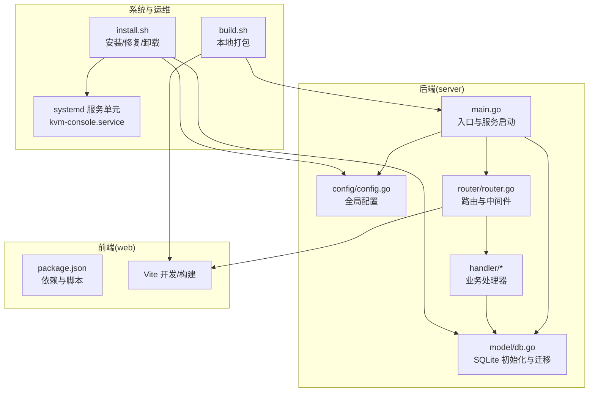
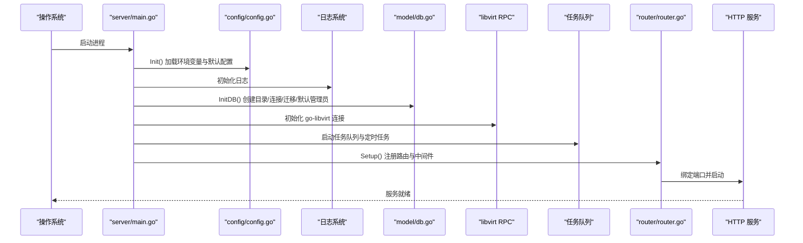
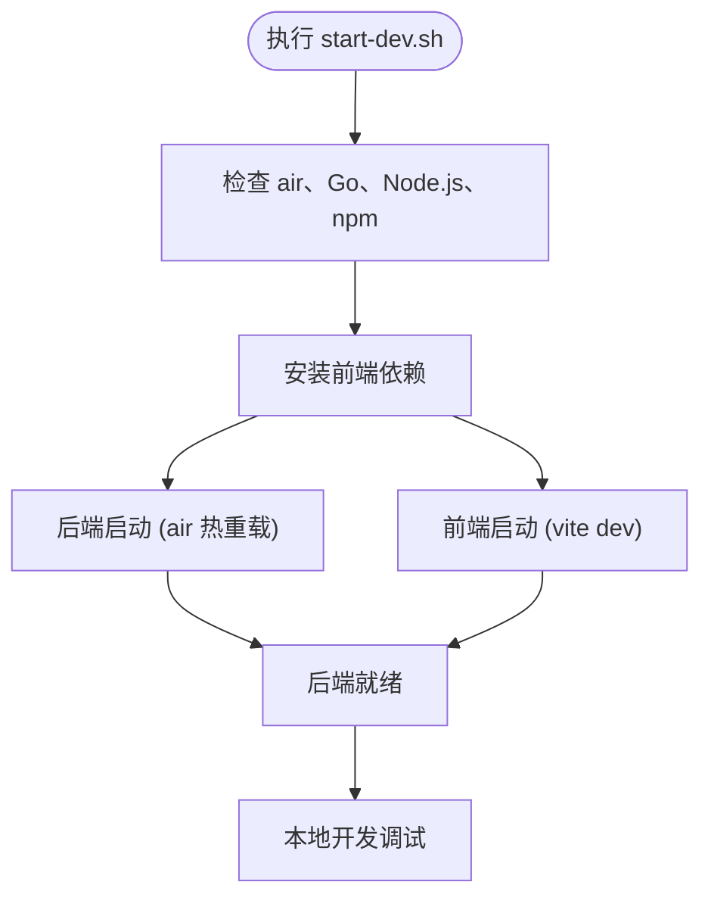
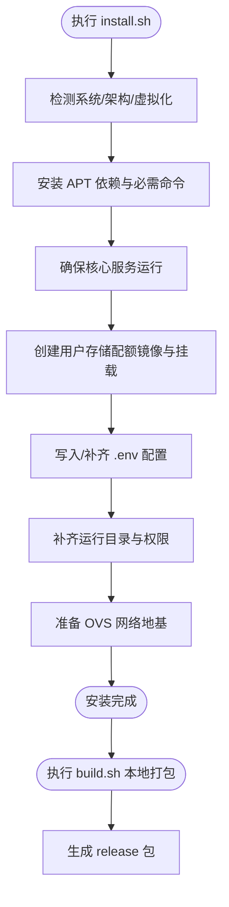

# 快速开始

<cite>
**本文引用的文件**
- [server/main.go](file://server/main.go)
- [server/config/config.go](file://server/config/config.go)
- [server/model/db.go](file://server/model/db.go)
- [server/router/router.go](file://server/router/router.go)
- [server/handler/auth.go](file://server/handler/auth.go)
- [install.sh](file://install.sh)
- [start-dev.sh](file://start-dev.sh)
- [build.sh](file://build.sh)
- [DEPENDENCIES.md](file://DEPENDENCIES.md)
- [server/go.mod](file://server/go.mod)
- [web/package.json](file://web/package.json)
</cite>

## 目录
1. [简介](#简介)
2. [项目结构](#项目结构)
3. [核心组件](#核心组件)
4. [架构总览](#架构总览)
5. [详细组件分析](#详细组件分析)
6. [依赖分析](#依赖分析)
7. [性能注意事项](#性能注意事项)
8. [故障排除指南](#故障排除指南)
9. [结论](#结论)
10. [附录](#附录)

## 简介
本指南面向首次接触 Open 虚拟机管理控制台（QVMConsole）的用户，目标是在最短时间内完成安装部署、配置与首次运行，掌握初始管理员账户设置与基本功能验证流程。文档涵盖：
- 环境准备与依赖安装
- 开发环境与生产环境两种部署方式
- 首次运行配置向导与初始管理员账户设置
- 基本功能验证与常见问题排查

## 项目结构
项目采用前后端分离架构：
- 后端：基于 Go 的 Gin Web 服务，负责 API、业务逻辑、数据库与系统集成
- 前端：基于 Vue 3 + Vite 的单页应用（SPA），通过 /api 前缀与后端交互
- 安装与打包：提供一键安装脚本与本地打包脚本，便于快速部署与发布

图表来源
- [server/main.go:31-128](file://server/main.go#L31-L128)
- [server/config/config.go:157-249](file://server/config/config.go#L157-L249)
- [server/model/db.go:57-113](file://server/model/db.go#L57-L113)
- [server/router/router.go:18-484](file://server/router/router.go#L18-L484)
- [install.sh:19-26](file://install.sh#L19-L26)
- [build.sh:21-164](file://build.sh#L21-L164)
- [web/package.json:6-28](file://web/package.json#L6-L28)

章节来源
- [server/main.go:31-128](file://server/main.go#L31-L128)
- [server/config/config.go:157-249](file://server/config/config.go#L157-L249)
- [server/model/db.go:57-113](file://server/model/db.go#L57-L113)
- [server/router/router.go:18-484](file://server/router/router.go#L18-L484)
- [install.sh:19-26](file://install.sh#L19-L26)
- [build.sh:21-164](file://build.sh#L21-L164)
- [web/package.json:6-28](file://web/package.json#L6-L28)

## 核心组件
- 入口与启动：后端主程序负责初始化配置、日志、数据库、RPC 连接、任务队列与路由，随后启动 HTTP 服务
- 配置系统：集中式配置，支持环境变量与数据库持久化设置，提供安全校验与 .env 同步
- 数据层：SQLite 数据库存储用户、系统设置、网络与虚拟机相关元数据，自动迁移与默认管理员初始化
- 路由与中间件：统一 CORS、限流、鉴权与请求日志；按角色与权限划分 API 分组
- 安装与打包：一键安装脚本补齐系统依赖、服务单元、目录与 .env；本地打包脚本产出可分发包

章节来源
- [server/main.go:31-128](file://server/main.go#L31-L128)
- [server/config/config.go:157-249](file://server/config/config.go#L157-L249)
- [server/model/db.go:57-113](file://server/model/db.go#L57-L113)
- [server/router/router.go:18-484](file://server/router/router.go#L18-L484)

## 架构总览
后端启动流程概览如下：

图表来源
- [server/main.go:31-128](file://server/main.go#L31-L128)
- [server/config/config.go:157-249](file://server/config/config.go#L157-L249)
- [server/model/db.go:57-113](file://server/model/db.go#L57-L113)
- [server/router/router.go:18-484](file://server/router/router.go#L18-L484)

## 详细组件分析

### 安装与部署（开发环境 vs 生产环境）
- 开发环境
  - 一键启动：启动后端（air 热重载）与前端（vite dev），自动设置日志与端口
  - 依赖：Go、Node.js、air、前端依赖
  - 适合：本地调试、热更新、快速迭代
- 生产环境
  - 一键安装：安装系统依赖、服务单元、目录、.env、用户存储配额、OVS 网络地基、核心服务
  - 本地打包：构建后端二进制与前端静态资源，生成发行包
  - 适合：稳定运行、系统级服务管理

章节来源
- [start-dev.sh:1-111](file://start-dev.sh#L1-L111)
- [DEPENDENCIES.md:1-198](file://DEPENDENCIES.md#L1-L198)
- [install.sh:1-1124](file://install.sh#L1-L1124)
- [build.sh:1-182](file://build.sh#L1-L182)

### 环境准备与依赖安装
- 系统与硬件
  - Debian/Ubuntu 系列，x86_64，开启 CPU 虚拟化（BIOS/UEFI）
  - 核心服务：libvirtd、openvswitch-switch、ssh
- 依赖包
  - APT 依赖清单覆盖 QEMU、libvirt、OVS、dnsmasq、LVM、nftables、iptables、tcpdump 等
  - 必需命令校验：virsh、qemu-img、virt-install、ovs-vsctl、nft、iptables、tc 等
- 可选组件
  - polkitd/policykit-1（授权相关）
  - kvm_stat（性能指标辅助）

章节来源
- [install.sh:42-110](file://install.sh#L42-L110)
- [install.sh:265-311](file://install.sh#L265-L311)

### 数据库配置与初始化
- 数据库驱动：SQLite
- 初始化流程
  - 创建数据目录
  - 连接数据库并执行自动迁移
  - 兼容性迁移（字段补齐、索引重建）
  - 初始化默认管理员账户（用户名、密码来自配置）
- 默认管理员
  - 若数据库中无管理员，自动创建，密码来自配置项

章节来源
- [server/model/db.go:57-113](file://server/model/db.go#L57-L113)
- [server/model/db.go:315-344](file://server/model/db.go#L315-L344)

### 配置系统与安全校验
- 配置来源优先级：环境变量 > 数据库持久化设置 > 默认值
- 关键配置项
  - 服务端口、数据库路径、JWT 密钥、VM 凭据密钥、安全密钥
  - 网络后端（OVS）、网桥、DHCP、子网前缀、端口范围
  - 带宽限制、救援 ISO、SMTP、动态内存调度、日志级别等
- 安全校验
  - 默认 JWT 密钥禁止生产环境启动（开发模式除外）
  - VM 凭据密钥与安全密钥若与 JWT 密钥相同且非默认，发出安全警告

章节来源
- [server/config/config.go:157-249](file://server/config/config.go#L157-L249)
- [server/config/config.go:251-283](file://server/config/config.go#L251-L283)

### 路由与权限控制
- 路由分组
  - 公共接口：版本、设置
  - 认证：登录、邀请、忘记密码、邮箱验证码、TOTP 等
  - 管理员设置：系统设置、SMTP 测试、日志管理、JWT 轮换
  - 虚拟机管理：列表、详情、操作、克隆、快照、VNC、磁盘、PCI 直通
  - 网络与 VPC：静态 IP、端口转发、防火墙、宿主机网桥、公网 IP、网络诊断
  - 存储池：列表、格式化挂载、分区、卷管理
  - 节点与迁移：节点列表、探测、迁移接管
  - 用户管理：列表、配额、SSH、状态、流量重置、删除
  - 用户自助：配额、VM 列表、克隆/创建、导出/导入、用户存储
  - 宿主机监控：统计、CPU/磁盘、KSM/ZRAM、PCI 设备
  - 任务队列：列表、进度、取消、清理
  - 调度事件中心：事件列表、SSE 实时推送
- 中间件
  - CORS、限流、鉴权、请求日志、VM 归属校验、弹性云限制等

章节来源
- [server/router/router.go:18-484](file://server/router/router.go#L18-L484)

### 首次运行与配置向导
- 安装后默认管理员
  - 若数据库中无管理员，安装脚本会创建默认管理员（用户名、密码来自 .env）
- 登录与安全初始化
  - 登录后若需要安全初始化（如绑定邮箱、开启 TOTP），系统会返回引导阶段
  - 管理员可跳过安全初始化
- 配置持久化
  - 通过系统设置页面修改的配置会同步到 .env 文件（仅持久化可持久化项）

章节来源
- [server/model/db.go:315-344](file://server/model/db.go#L315-L344)
- [server/handler/auth.go:101-200](file://server/handler/auth.go#L101-L200)
- [server/config/config.go:756-800](file://server/config/config.go#L756-L800)

### 基本功能验证
- 登录与权限
  - 使用默认管理员账户登录，进入系统
- 虚拟机管理
  - 创建/克隆/重装/删除虚拟机
  - 查看统计、VNC、快照、磁盘、PCI 直通
- 网络与 VPC
  - 创建网桥、静态 IP、端口转发、防火墙策略
  - 创建 VPC 交换机与安全组，绑定 VM
- 存储池
  - 初始化用户存储配额镜像，挂载到 VM
- 任务队列
  - 查看任务进度与取消

章节来源
- [server/router/router.go:108-431](file://server/router/router.go#L108-L431)

## 依赖分析
- 后端依赖
  - Web 框架：Gin
  - 数据库：GORM + SQLite
  - 安全：JWT、bcrypt
  - 网络：Open vSwitch、iptables/nftables、dnsmasq
  - 其他：libvirt RPC、websocket、日志轮转
- 前端依赖
  - Vue 3、Element Plus、Axios、ECharts、Pinia、Vue Router、xterm、QRCode 等

章节来源
- [server/go.mod:5-15](file://server/go.mod#L5-L15)
- [web/package.json:11-28](file://web/package.json#L11-L28)

## 性能注意事项
- 日志级别与输出
  - 文件日志与终端日志可分别配置，避免生产环境过度输出
- 限流与并发
  - 公开接口与认证接口分别限流，防止滥用
- 磁盘 IOPS 限制
  - 可针对磁盘设置 IOPS 限制，避免单台 VM 影响宿主机
- 动态内存调度
  - 可配置内存回收阈值、观察周期与冷却时间，平衡性能与稳定性

章节来源
- [server/config/config.go:106-115](file://server/config/config.go#L106-L115)
- [server/config/config.go:132-136](file://server/config/config.go#L132-L136)

## 故障排除指南
- 安装失败
  - 缺少系统依赖：根据安装脚本提示安装缺失包
  - 核心服务未运行：检查 libvirtd、openvswitch-switch、ssh 状态
  - KVM 硬件虚拟化未开启：在 BIOS/UEFI 中启用 VT-x/AMD-V
- 首次登录异常
  - 默认管理员未创建：检查 .env 中管理员用户名/密码，或确认数据库初始化是否成功
  - 安全初始化：若提示需要完成安全初始化，按引导流程完成
- 数据库问题
  - 迁移失败：检查 SQLite 权限与磁盘空间；查看日志定位具体错误
- 网络与 OVS
  - OVS 未启动：安装脚本会尝试启动，若失败可通过诊断功能修复
  - DHCP/网桥：检查网桥地址、DHCP 范围与 iptables 规则
- 生产环境启动被拒绝
  - 默认 JWT 密钥：生产环境必须设置随机强密钥，否则启动被拒绝

章节来源
- [install.sh:148-178](file://install.sh#L148-L178)
- [install.sh:313-327](file://install.sh#L313-L327)
- [server/model/db.go:57-113](file://server/model/db.go#L57-L113)
- [server/config/config.go:262-283](file://server/config/config.go#L262-L283)

## 结论
通过本快速开始指南，您可以在几分钟内完成环境准备、安装部署与首次运行验证。开发环境适合快速迭代，生产环境提供稳定的系统级服务与完善的网络/存储基础设施。遇到问题时，可依据“故障排除指南”逐项排查，结合日志与安装脚本诊断功能快速定位并解决问题。

## 附录

### 开发环境一键启动流程

图表来源
- [start-dev.sh:37-111](file://start-dev.sh#L37-L111)

### 生产环境安装与打包流程

图表来源
- [install.sh:126-146](file://install.sh#L126-L146)
- [install.sh:265-311](file://install.sh#L265-L311)
- [install.sh:355-423](file://install.sh#L355-L423)
- [install.sh:477-565](file://install.sh#L477-L565)
- [install.sh:576-625](file://install.sh#L576-L625)
- [install.sh:745-800](file://install.sh#L745-L800)
- [build.sh:96-164](file://build.sh#L96-L164)