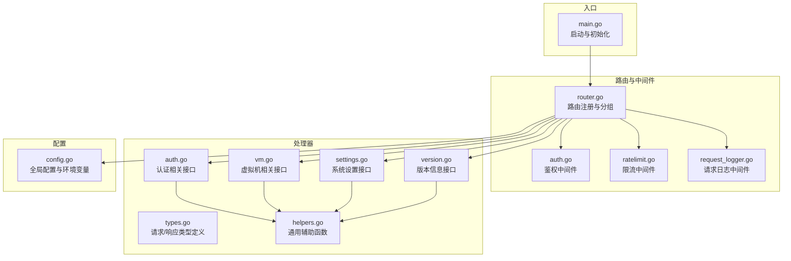
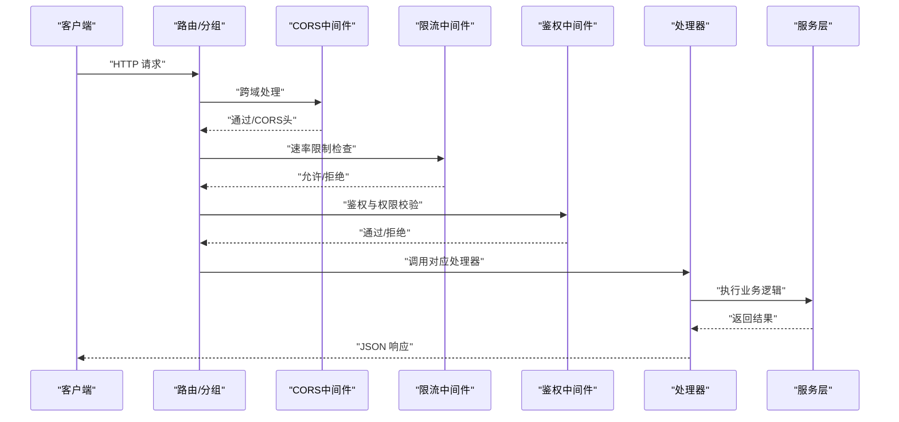
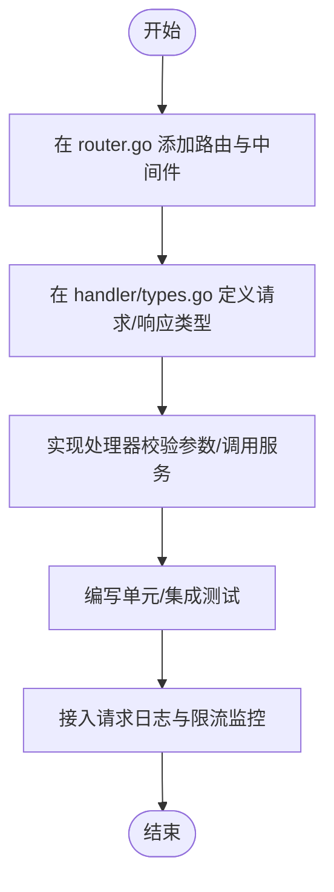
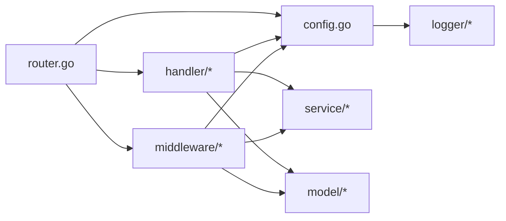

# API扩展

<cite>
**本文引用的文件**
- [server/router/router.go](file://server/router/router.go)
- [server/main.go](file://server/main.go)
- [server/handler/types.go](file://server/handler/types.go)
- [server/middleware/auth.go](file://server/middleware/auth.go)
- [server/middleware/ratelimit.go](file://server/middleware/ratelimit.go)
- [server/middleware/request_logger.go](file://server/middleware/request_logger.go)
- [server/handler/helpers.go](file://server/handler/helpers.go)
- [server/config/config.go](file://server/config/config.go)
- [server/handler/version.go](file://server/handler/version.go)
- [server/handler/auth.go](file://server/handler/auth.go)
- [server/handler/vm.go](file://server/handler/vm.go)
- [server/handler/settings.go](file://server/handler/settings.go)
</cite>

## 目录
1. [引言](#引言)
2. [项目结构](#项目结构)
3. [核心组件](#核心组件)
4. [架构总览](#架构总览)
5. [详细组件分析](#详细组件分析)
6. [依赖分析](#依赖分析)
7. [性能考量](#性能考量)
8. [故障排查指南](#故障排查指南)
9. [结论](#结论)
10. [附录](#附录)

## 引言
本指南面向希望在现有系统基础上扩展API的开发者，围绕路由系统扩展、自定义处理器开发、版本控制策略、安全扩展（权限、速率限制、访问日志）、最佳实践（文档生成、测试覆盖、性能监控）以及完整扩展示例进行系统讲解。读者无需深入Go语言即可理解并落地实施。

## 项目结构
后端采用“路由-中间件-处理器-服务层”的清晰分层：
- 路由层：集中注册所有API路由，按模块分组并挂载中间件
- 中间件层：统一处理鉴权、速率限制、CORS、请求日志
- 处理器层：实现业务接口，负责参数校验、响应封装、错误码定义
- 配置层：全局配置、环境变量、安全校验
- 服务层：具体业务逻辑（由处理器调用）

图表来源
- [server/main.go:118-128](file://server/main.go#L118-L128)
- [server/router/router.go:19-485](file://server/router/router.go#L19-L485)
- [server/middleware/auth.go:75-199](file://server/middleware/auth.go#L75-L199)
- [server/middleware/ratelimit.go:173-197](file://server/middleware/ratelimit.go#L173-L197)
- [server/middleware/request_logger.go:11-69](file://server/middleware/request_logger.go#L11-L69)
- [server/handler/auth.go:101-202](file://server/handler/auth.go#L101-L202)
- [server/handler/vm.go:81-126](file://server/handler/vm.go#L81-L126)
- [server/handler/settings.go:166-179](file://server/handler/settings.go#L166-L179)
- [server/handler/version.go:17-49](file://server/handler/version.go#L17-L49)
- [server/handler/types.go:9-59](file://server/handler/types.go#L9-L59)
- [server/handler/helpers.go:17-31](file://server/handler/helpers.go#L17-L31)
- [server/config/config.go:157-249](file://server/config/config.go#L157-L249)

章节来源
- [server/router/router.go:19-485](file://server/router/router.go#L19-L485)
- [server/main.go:118-128](file://server/main.go#L118-L128)

## 核心组件
- 路由注册器：集中定义路由、分组、中间件挂载，支持公开/认证/管理员等多层级权限
- 中间件体系：鉴权、速率限制、CORS、请求日志
- 处理器：实现具体业务接口，统一响应结构与错误码
- 配置系统：环境变量驱动，支持安全校验与运行时调整

章节来源
- [server/router/router.go:19-485](file://server/router/router.go#L19-L485)
- [server/middleware/auth.go:75-199](file://server/middleware/auth.go#L75-L199)
- [server/middleware/ratelimit.go:173-197](file://server/middleware/ratelimit.go#L173-L197)
- [server/middleware/request_logger.go:11-69](file://server/middleware/request_logger.go#L11-L69)
- [server/handler/helpers.go:17-31](file://server/handler/helpers.go#L17-L31)
- [server/config/config.go:157-249](file://server/config/config.go#L157-L249)

## 架构总览
下图展示了从请求进入至响应返回的关键流转，包括路由分组、中间件链路与处理器调用。

图表来源
- [server/router/router.go:19-485](file://server/router/router.go#L19-L485)
- [server/middleware/ratelimit.go:173-197](file://server/middleware/ratelimit.go#L173-L197)
- [server/middleware/auth.go:75-199](file://server/middleware/auth.go#L75-L199)
- [server/handler/auth.go:101-202](file://server/handler/auth.go#L101-L202)

## 详细组件分析

### 路由系统扩展机制
- 路由分组：通过嵌套分组实现模块化组织，如 /api/auth、/api/vm、/api/settings 等
- 中间件挂载：在分组层面挂载鉴权、管理员、弹性云限制等中间件，影响该组内所有路由
- URL模式匹配：基于 Gin 的路径参数与通配符支持，例如 /api/vm/:name
- 全局中间件：CORS、限流、请求日志在最外层生效

扩展步骤
1) 在 router.go 中定位目标分组或新建分组
2) 在分组内注册新路由，指定 HTTP 方法与处理器
3) 根据需要挂载中间件（如 AuthMiddleware、AdminMiddleware、ElasticCloudOnlyMiddleware）
4) 如需公开接口，将路径加入公开白名单（参考 ratelimit.go 中的 publicPaths）

章节来源
- [server/router/router.go:35-485](file://server/router/router.go#L35-L485)
- [server/middleware/ratelimit.go:134-154](file://server/middleware/ratelimit.go#L134-L154)

### 自定义API处理器开发
- 参数验证：使用结构体 tag（如 binding:"required"）与 ShouldBindJSON 实现
- 响应封装：统一返回 { code, message, data } 结构；错误码遵循 4xx/5xx 标准
- 错误处理：根据场景返回 400、401、403、404、429、500 等
- 辅助函数：利用 helpers.go 中的统一错误响应与参数解析工具

示例要点
- 登录接口：Login 使用 LoginRequest 结构体接收用户名/密码，校验用户状态与密码哈希
- 虚拟机列表：GetVmList 读取查询参数并调用服务层获取缓存VM列表
- 系统设置：GetSettings 返回当前配置快照，UpdateSettingsRequest 支持部分字段更新

章节来源
- [server/handler/auth.go:101-202](file://server/handler/auth.go#L101-L202)
- [server/handler/vm.go:81-126](file://server/handler/vm.go#L81-L126)
- [server/handler/settings.go:166-179](file://server/handler/settings.go#L166-L179)
- [server/handler/helpers.go:17-31](file://server/handler/helpers.go#L17-L31)
- [server/handler/types.go:9-59](file://server/handler/types.go#L9-L59)

### API版本控制策略
- 版本标识：通过版本信息接口返回版本与构建时间
- 向后兼容：保持既有字段与语义不变；新增字段采用可选方式
- 废弃策略：不直接删除接口，而是标记为废弃并在响应中提示替代方案
- 配置驱动：通过配置项控制行为（如维护模式、限速、日志级别）

章节来源
- [server/handler/version.go:17-49](file://server/handler/version.go#L17-L49)
- [server/config/config.go:157-249](file://server/config/config.go#L157-L249)

### API安全扩展
- 权限控制
  - 鉴权中间件：支持 access/bootstrap/login/high_risk 等多种令牌类型
  - 管理员中间件：仅 admin 可访问
  - VM访问中间件：非 admin 用户仅能操作自身VM
  - 弹性云限制：禁止轻量云用户访问弹性云自助能力
- 速率限制
  - IP级滑动窗口限频，支持公开/认证两类阈值
  - 公开接口白名单，超限返回 429 并附带 Retry-After
- 访问日志
  - 按状态码分级记录，包含方法、路径、耗时、客户端IP、用户等

章节来源
- [server/middleware/auth.go:75-199](file://server/middleware/auth.go#L75-L199)
- [server/middleware/auth.go:243-278](file://server/middleware/auth.go#L243-L278)
- [server/middleware/ratelimit.go:11-28](file://server/middleware/ratelimit.go#L11-L28)
- [server/middleware/ratelimit.go:60-105](file://server/middleware/ratelimit.go#L60-L105)
- [server/middleware/ratelimit.go:134-154](file://server/middleware/ratelimit.go#L134-L154)
- [server/middleware/ratelimit.go:173-197](file://server/middleware/ratelimit.go#L173-L197)
- [server/middleware/request_logger.go:11-69](file://server/middleware/request_logger.go#L11-L69)

### API扩展最佳实践
- 文档生成
  - 基于路由与处理器注释生成接口文档，保持接口签名与示例一致
- 测试覆盖
  - 单元测试覆盖参数校验、错误分支与边界条件
  - 集成测试覆盖中间件链路与端到端流程
- 性能监控
  - 通过请求日志统计 P95/P99 延迟与错误率
  - 限流指标与告警联动，防止雪崩

[本节为通用指导，不直接分析具体文件]

### 完整API扩展示例（从路由配置到处理器实现）
- 步骤1：在路由层注册新路由
  - 在 router.go 中定位目标分组，添加新路由并挂载所需中间件
  - 示例参考：[server/router/router.go:104-120](file://server/router/router.go#L104-L120)
- 步骤2：定义请求/响应类型
  - 在 handler/types.go 中新增结构体，使用 binding 标签声明必填字段
  - 示例参考：[server/handler/types.go:9-59](file://server/handler/types.go#L9-L59)
- 步骤3：实现处理器
  - 在对应 handler 文件中编写处理函数，使用 ShouldBindJSON 校验参数
  - 使用 helpers.go 中的统一错误响应与参数解析工具
  - 示例参考：[server/handler/auth.go:101-202](file://server/handler/auth.go#L101-L202)
- 步骤4：接入服务层
  - 在处理器中调用服务层方法，处理业务逻辑并返回结果
  - 示例参考：[server/handler/vm.go:81-126](file://server/handler/vm.go#L81-L126)
- 步骤5：配置与安全
  - 在 config.go 中新增配置项（如有需要）
  - 在 ratelimit.go 中将公开接口加入白名单（如有需要）
  - 示例参考：[server/config/config.go:157-249](file://server/config/config.go#L157-L249)，[server/middleware/ratelimit.go:134-154](file://server/middleware/ratelimit.go#L134-L154)

图表来源
- [server/router/router.go:104-120](file://server/router/router.go#L104-L120)
- [server/handler/types.go:9-59](file://server/handler/types.go#L9-L59)
- [server/handler/auth.go:101-202](file://server/handler/auth.go#L101-L202)
- [server/middleware/ratelimit.go:134-154](file://server/middleware/ratelimit.go#L134-L154)
- [server/middleware/request_logger.go:11-69](file://server/middleware/request_logger.go#L11-L69)

## 依赖分析
- 路由依赖：router 依赖 handler、middleware、config
- 处理器依赖：handler 依赖 service、model、config、logger
- 中间件依赖：auth/ratelimit/request_logger 依赖 config、model、service
- 配置依赖：config 为全局单例，被其他模块读取

图表来源
- [server/router/router.go:19-485](file://server/router/router.go#L19-L485)
- [server/config/config.go:157-249](file://server/config/config.go#L157-L249)

章节来源
- [server/router/router.go:19-485](file://server/router/router.go#L19-L485)
- [server/config/config.go:157-249](file://server/config/config.go#L157-L249)

## 性能考量
- 限流策略：合理设置公开/认证接口的每分钟限额，避免突发流量冲击
- 日志级别：生产环境建议降低高频接口日志级别，减少IO开销
- 缓存与异步：对高频查询使用缓存，复杂操作使用任务队列异步执行
- 资源回收：及时关闭数据库连接与外部资源，避免泄漏

[本节为通用指导，不直接分析具体文件]

## 故障排查指南
- 鉴权失败
  - 检查 Authorization 头格式与令牌类型是否匹配
  - 确认用户状态与安全更新时间
  - 参考：[server/middleware/auth.go:118-199](file://server/middleware/auth.go#L118-L199)
- 速率受限
  - 查看 X-RateLimit-* 响应头与 Retry-After
  - 核对路径是否在公开白名单
  - 参考：[server/middleware/ratelimit.go:173-197](file://server/middleware/ratelimit.go#L173-L197)
- 请求异常
  - 查看请求日志中的状态码、耗时、用户信息
  - 参考：[server/middleware/request_logger.go:11-69](file://server/middleware/request_logger.go#L11-L69)
- 参数错误
  - 检查结构体 tag 与 ShouldBindJSON 的错误提示
  - 参考：[server/handler/auth.go:101-202](file://server/handler/auth.go#L101-L202)

章节来源
- [server/middleware/auth.go:118-199](file://server/middleware/auth.go#L118-L199)
- [server/middleware/ratelimit.go:173-197](file://server/middleware/ratelimit.go#L173-L197)
- [server/middleware/request_logger.go:11-69](file://server/middleware/request_logger.go#L11-L69)
- [server/handler/auth.go:101-202](file://server/handler/auth.go#L101-L202)

## 结论
通过明确的路由分组、完善的中间件链路、规范的处理器与统一的错误码设计，系统提供了清晰的API扩展路径。结合版本控制、安全中间件与性能监控，可快速、安全地交付高质量的API能力。

[本节为总结性内容，不直接分析具体文件]

## 附录
- 启动流程：main.go 初始化配置、数据库、中间件与路由，然后启动HTTP服务
  - 参考：[server/main.go:118-128](file://server/main.go#L118-L128)
- 配置加载：支持环境变量与数据库持久化配置，启动后进行安全校验
  - 参考：[server/config/config.go:157-249](file://server/config/config.go#L157-L249)

章节来源
- [server/main.go:118-128](file://server/main.go#L118-L128)
- [server/config/config.go:157-249](file://server/config/config.go#L157-L249)