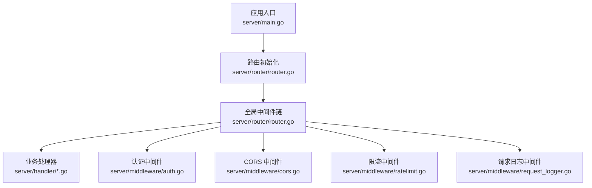
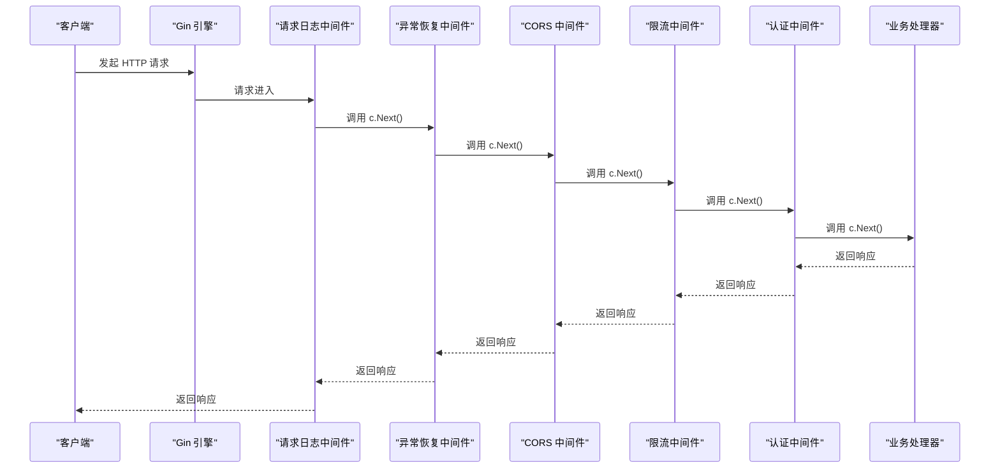
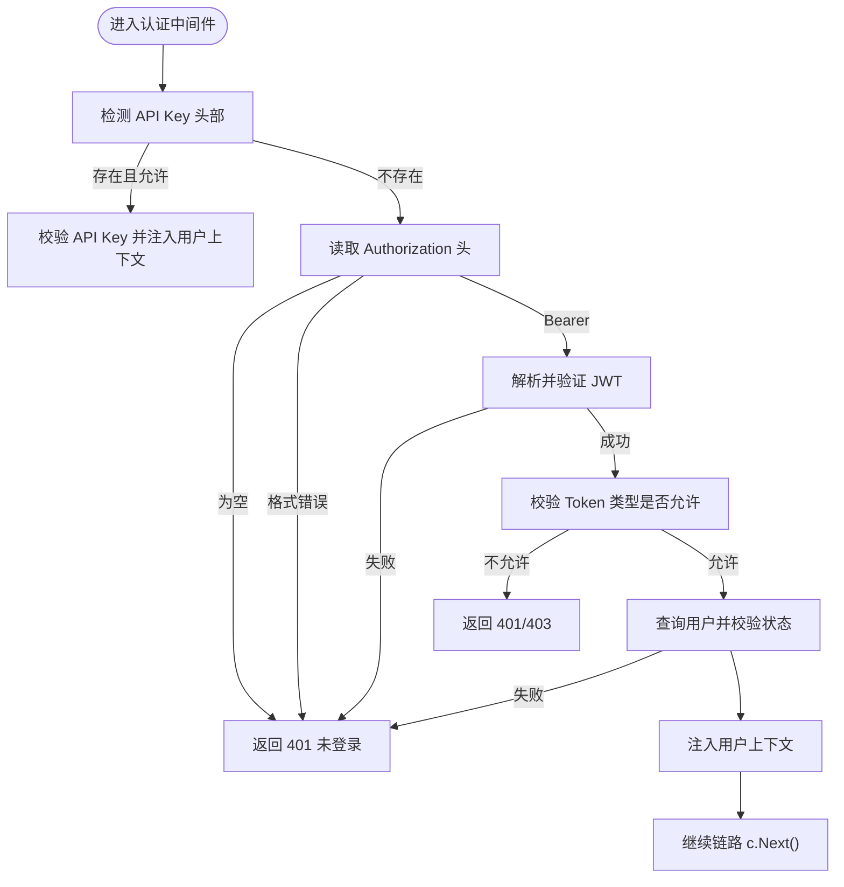
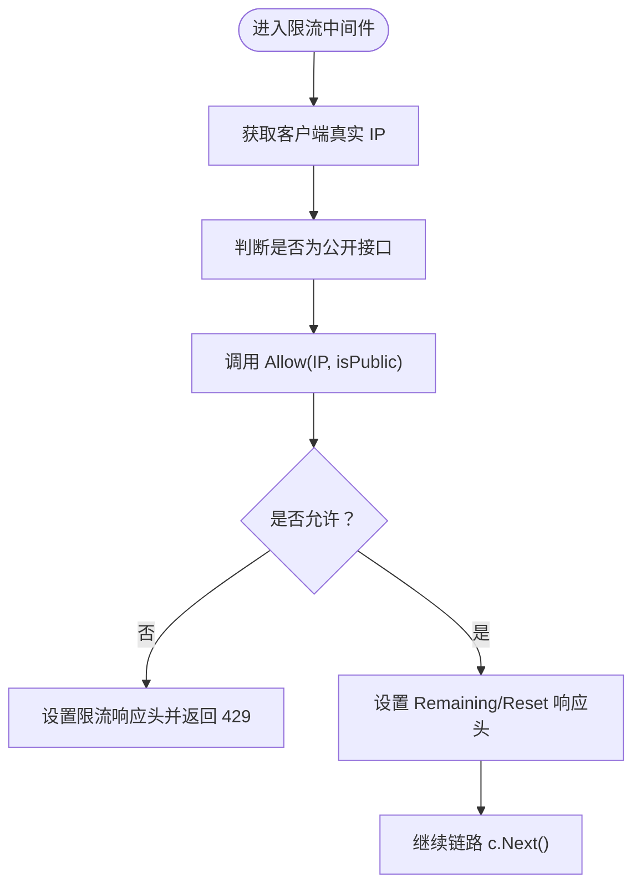
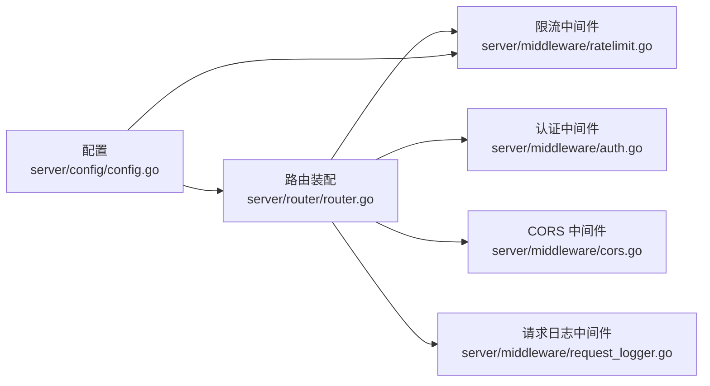

# 中间件开发

<cite>
**本文引用的文件**
- [server/middleware/auth.go](file://server/middleware/auth.go)
- [server/middleware/cors.go](file://server/middleware/cors.go)
- [server/middleware/ratelimit.go](file://server/middleware/ratelimit.go)
- [server/middleware/request_logger.go](file://server/middleware/request_logger.go)
- [server/router/router.go](file://server/router/router.go)
- [server/config/config.go](file://server/config/config.go)
- [server/main.go](file://server/main.go)
- [server/handler/auth.go](file://server/handler/auth.go)
</cite>

## 目录
1. [简介](#简介)
2. [项目结构](#项目结构)
3. [核心组件](#核心组件)
4. [架构总览](#架构总览)
5. [详细组件分析](#详细组件分析)
6. [依赖分析](#依赖分析)
7. [性能考量](#性能考量)
8. [故障排查指南](#故障排查指南)
9. [结论](#结论)
10. [附录](#附录)

## 简介
本指南面向中间件开发者，基于实际代码库深入讲解中间件的执行顺序与链式调用机制，涵盖认证、CORS、限流与请求日志四类中间件的设计与实现要点，并系统阐述中间件生命周期（请求前处理、响应后处理、错误处理）、与处理器的协作模式（上下文传递与状态管理）、最佳实践（性能优化、配置管理、安全考虑），以及自定义中间件的完整开发示例与测试方法。

## 项目结构
中间件位于 server/middleware 目录，路由在 server/router/router.go 中集中装配，全局中间件按顺序注册，形成标准的 Gin 中间件链式调用流程。

图表来源
- [server/main.go:118-128](file://server/main.go#L118-L128)
- [server/router/router.go:18-485](file://server/router/router.go#L18-L485)

章节来源
- [server/router/router.go:18-485](file://server/router/router.go#L18-L485)
- [server/main.go:118-128](file://server/main.go#L118-L128)

## 核心组件
- 认证中间件：支持多种 Token 类型（访问、登录态、引导、高风险），支持 API Key 与 JWT 双通道认证，内置角色与权限校验。
- CORS 中间件：统一跨域头设置与预检处理。
- 限流中间件：基于滑动窗口的 IP 级限流，区分公开与认证接口，支持配置化限速与清理周期。
- 请求日志中间件：基于 Gin 上下文与状态码分级记录，支持从上下文提取用户信息。

章节来源
- [server/middleware/auth.go:75-324](file://server/middleware/auth.go#L75-L324)
- [server/middleware/cors.go:7-24](file://server/middleware/cors.go#L7-L24)
- [server/middleware/ratelimit.go:11-211](file://server/middleware/ratelimit.go#L11-L211)
- [server/middleware/request_logger.go:11-70](file://server/middleware/request_logger.go#L11-L70)

## 架构总览
Gin 中间件链在路由初始化阶段一次性装配，随后每次请求按注册顺序依次执行，每个中间件可选择调用 c.Next() 放行至下一个中间件或处理器，或在发生错误时中断并返回响应。

图表来源
- [server/router/router.go:20-33](file://server/router/router.go#L20-L33)
- [server/middleware/request_logger.go:12-69](file://server/middleware/request_logger.go#L12-L69)
- [server/middleware/cors.go:8-23](file://server/middleware/cors.go#L8-L23)
- [server/middleware/ratelimit.go:173-197](file://server/middleware/ratelimit.go#L173-L197)
- [server/middleware/auth.go:90-198](file://server/middleware/auth.go#L90-L198)

## 详细组件分析

### 认证中间件
- 设计要点
  - 支持多 Token 类型与来源：JWT Bearer 与 API Key（多头部兼容）。
  - 动态白名单：根据路由组配置允许的 Token 类型。
  - 用户状态校验：账户存在性、启用状态、安全更新时间、登录有效性等。
  - 角色与资源权限：管理员、弹性云限制、VM 归属校验。
  - 上下文注入：将用户信息、角色、认证类型等写入 gin.Context，供后续中间件与处理器使用。
- 生命周期
  - 请求前：解析凭证、校验 Token、查询用户、状态校验、注入上下文。
  - 响应后：无需处理。
  - 错误处理：认证失败、权限不足、账户状态异常时立即返回并终止链路。
- 与处理器协作
  - 处理器通过 c.Get("user_id"/"username"/"role"/"current_user") 获取上下文信息。
  - 处理器可结合中间件提供的权限中间件（如管理员、VM 归属）进行二次校验。

图表来源
- [server/middleware/auth.go:90-198](file://server/middleware/auth.go#L90-L198)
- [server/middleware/auth.go:231-241](file://server/middleware/auth.go#L231-L241)

章节来源
- [server/middleware/auth.go:75-324](file://server/middleware/auth.go#L75-L324)
- [server/router/router.go:54-86](file://server/router/router.go#L54-L86)

### CORS 中间件
- 设计要点
  - 统一设置允许源、方法、头部与暴露头部。
  - 对预检请求（OPTIONS）直接返回 204。
- 生命周期
  - 请求前：设置跨域相关响应头；若为 OPTIONS，直接结束请求。
  - 响应后：无需处理。
- 与处理器协作
  - 作为全局中间件，对所有路由生效，无需处理器额外处理。

章节来源
- [server/middleware/cors.go:7-24](file://server/middleware/cors.go#L7-L24)

### 限流中间件
- 设计要点
  - 滑动窗口算法：每分钟为窗口，统计单 IP 的请求次数。
  - 区分公开与认证接口：公开接口默认限速，认证接口可配置不限制。
  - 清理策略：定期清理过期窗口条目，避免内存膨胀。
  - 响应头：X-RateLimit-Limit、X-RateLimit-Remaining、X-RateLimit-Reset、Retry-After。
- 生命周期
  - 请求前：计算剩余次数与重置时间，超限返回 429。
  - 响应后：无需处理。
- 与处理器协作
  - 通过响应头向客户端反馈限流状态；处理器无需感知。

图表来源
- [server/middleware/ratelimit.go:156-171](file://server/middleware/ratelimit.go#L156-L171)
- [server/middleware/ratelimit.go:173-197](file://server/middleware/ratelimit.go#L173-L197)

章节来源
- [server/middleware/ratelimit.go:11-211](file://server/middleware/ratelimit.go#L11-L211)
- [server/router/router.go:26-33](file://server/router/router.go#L26-L33)

### 请求日志中间件
- 设计要点
  - 使用 c.Next() 后续处理，计算耗时与状态码。
  - 按状态码分级记录（错误、警告、信息）。
  - 从上下文提取用户名，增强可观测性。
- 生命周期
  - 请求前：记录开始时间与请求元信息。
  - 响应后：根据状态码分级输出日志。
- 与处理器协作
  - 通过 gin.Context 注入用户信息，日志中间件自动读取。

章节来源
- [server/middleware/request_logger.go:11-70](file://server/middleware/request_logger.go#L11-L70)

### 中间件与处理器协作模式
- 上下文传递
  - 认证中间件将用户信息注入 gin.Context，处理器通过键值获取。
- 状态管理
  - 中间件在链路中设置状态（如角色、认证类型），处理器据此决定业务逻辑分支。
- 路由组与中间件组合
  - 路由组可叠加多个中间件，形成“栈式”权限控制链。

章节来源
- [server/middleware/auth.go:231-241](file://server/middleware/auth.go#L231-L241)
- [server/router/router.go:54-485](file://server/router/router.go#L54-L485)

## 依赖分析
- 中间件之间无直接依赖，耦合度低，便于独立演进。
- 路由层负责装配顺序与组合策略，中间件职责单一，符合关注点分离原则。
- 配置层（server/config/config.go）为限流与日志等提供参数来源。

图表来源
- [server/router/router.go:18-485](file://server/router/router.go#L18-L485)
- [server/config/config.go:229-230](file://server/config/config.go#L229-L230)

章节来源
- [server/router/router.go:18-485](file://server/router/router.go#L18-L485)
- [server/config/config.go:229-230](file://server/config/config.go#L229-L230)

## 性能考量
- 中间件链顺序影响整体延迟：将高频低成本中间件置于前部（如 CORS、限流），将昂贵校验（认证、鉴权）靠后。
- 限流实现采用滑动窗口与定期清理，避免无限增长；合理设置清理周期与阈值。
- 认证中间件在解析 Token 与查询用户时可能成为热点，建议配合缓存与索引优化。
- 日志中间件仅在响应后输出，避免阻塞业务处理。

## 故障排查指南
- 认证失败
  - 检查 Authorization 头格式与 Bearer 前缀。
  - 确认 Token 类型与路由组允许的类型匹配。
  - 核对用户状态与安全更新时间。
- CORS 问题
  - 确认预检请求是否正确返回 204。
  - 检查允许的源、方法与头部是否覆盖前端需求。
- 限流触发
  - 查看响应头 X-RateLimit-Remaining 与 X-RateLimit-Reset。
  - 调整 KVM_RATE_LIMIT_PUBLIC/KVM_RATE_LIMIT_AUTH 环境变量。
- 日志异常
  - 确认日志级别与输出配置，检查上下文是否正确注入用户名。

章节来源
- [server/middleware/auth.go:120-198](file://server/middleware/auth.go#L120-L198)
- [server/middleware/cors.go:16-22](file://server/middleware/cors.go#L16-L22)
- [server/middleware/ratelimit.go:180-196](file://server/middleware/ratelimit.go#L180-L196)
- [server/middleware/request_logger.go:38-67](file://server/middleware/request_logger.go#L38-L67)

## 结论
本项目中间件体系遵循“单一职责、链式组合”的设计思想，通过明确的生命周期与上下文传递机制，实现了认证、跨域、限流与日志等横切能力的模块化与可配置化。建议在新增中间件时保持与现有链路的兼容性，严格控制执行顺序与错误处理，确保系统稳定性与可观测性。

## 附录

### 自定义中间件开发步骤
- 定义函数签名
  - 返回 gin.HandlerFunc，接收 *gin.Context。
- 实现请求前处理
  - 读取请求上下文，必要时设置响应头或写入上下文。
- 决策是否放行
  - 调用 c.Next() 放行；若发生错误，设置状态码并返回。
- 实现响应后处理
  - 在 c.Next() 之后执行，通常用于日志、指标上报等。
- 注册中间件
  - 在路由初始化处按需注册，注意顺序与作用域。

章节来源
- [server/middleware/request_logger.go:12-69](file://server/middleware/request_logger.go#L12-L69)
- [server/router/router.go:18-485](file://server/router/router.go#L18-L485)

### 测试方法
- 单元测试
  - 使用 httptest 与 gin 的测试工具构造请求，断言中间件行为（如状态码、响应头、上下文键值）。
- 集成测试
  - 通过路由层组装最小链路，模拟真实请求路径，验证中间件组合效果。
- 性能测试
  - 使用压测工具对限流与认证中间件进行并发测试，评估吞吐与延迟。

### 最佳实践清单
- 性能优化
  - 将低成本中间件前置，昂贵逻辑后置；避免在中间件中进行阻塞 IO。
- 配置管理
  - 通过环境变量与配置文件统一管理限流阈值、日志级别等参数。
- 安全考虑
  - 严格校验 Token 类型与来源；避免泄露敏感上下文信息；启用 CORS 白名单策略。
- 可观测性
  - 在日志中间件中记录关键上下文（用户、路径、状态码、耗时）；为限流中间件提供清晰的响应头。