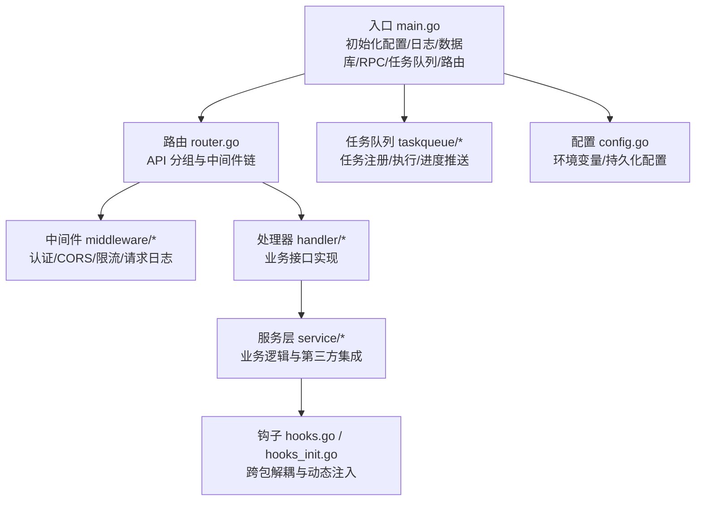
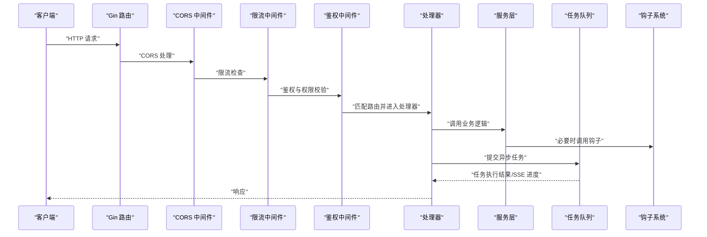
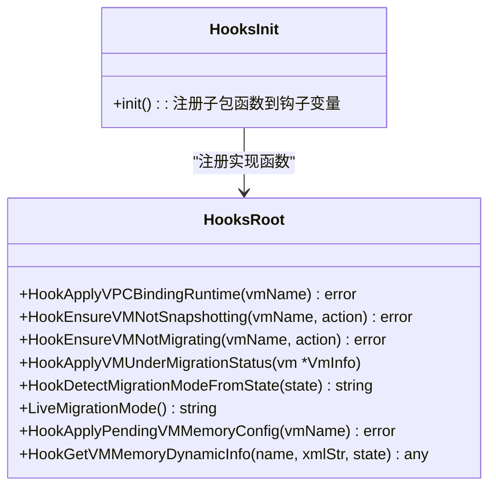
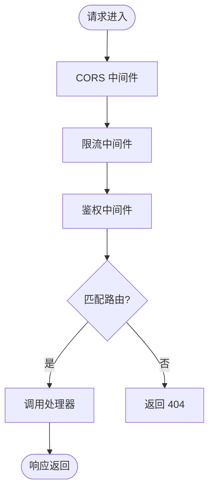
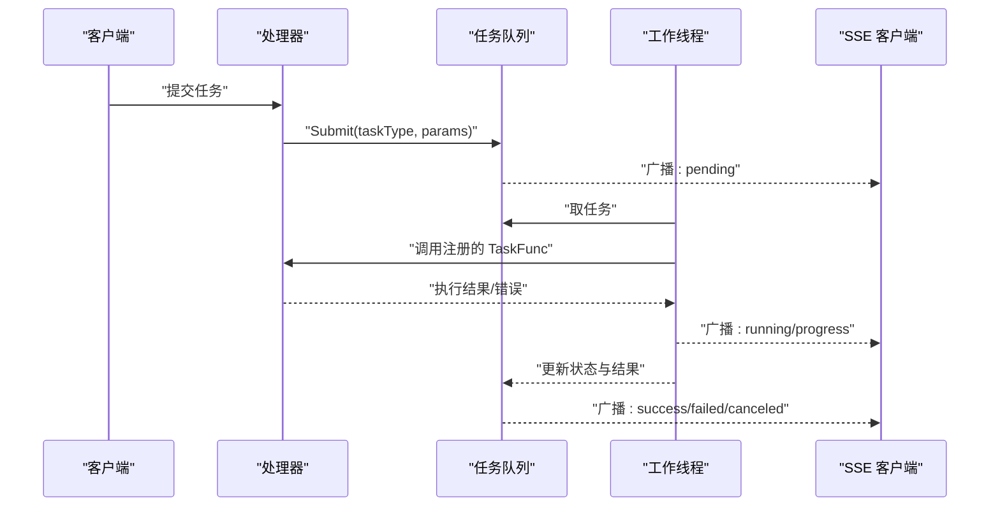
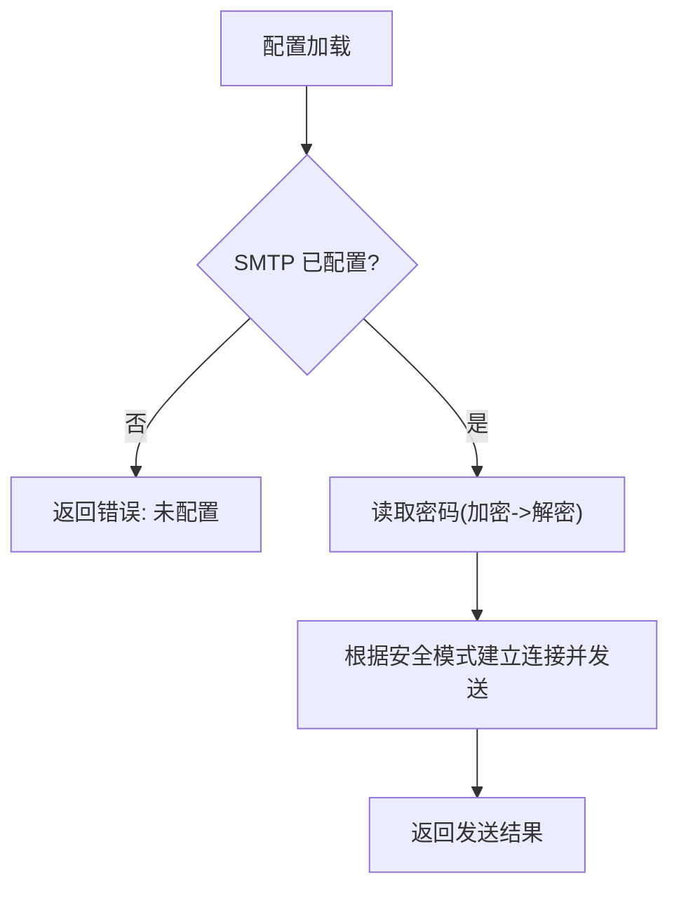
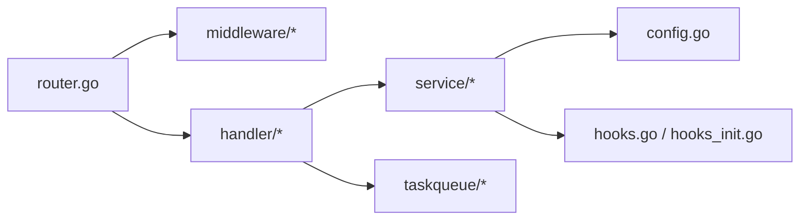

# 扩展开发

<cite>
**本文引用的文件**
- [server/main.go](file://server/main.go)
- [server/router/router.go](file://server/router/router.go)
- [server/middleware/auth.go](file://server/middleware/auth.go)
- [server/middleware/request_logger.go](file://server/middleware/request_logger.go)
- [server/middleware/cors.go](file://server/middleware/cors.go)
- [server/middleware/ratelimit.go](file://server/middleware/ratelimit.go)
- [server/taskqueue/queue.go](file://server/taskqueue/queue.go)
- [server/config/config.go](file://server/config/config.go)
- [server/service/hooks.go](file://server/service/hooks.go)
- [server/service/hooks_init.go](file://server/service/hooks_init.go)
- [server/service/security/smtp.go](file://server/service/security/smtp.go)
- [server/handler/auth.go](file://server/handler/auth.go)
- [server/handler/types.go](file://server/handler/types.go)
</cite>

## 目录
1. [简介](#简介)
2. [项目结构](#项目结构)
3. [核心组件](#核心组件)
4. [架构总览](#架构总览)
5. [详细组件分析](#详细组件分析)
6. [依赖分析](#依赖分析)
7. [性能考量](#性能考量)
8. [故障排查指南](#故障排查指南)
9. [结论](#结论)
10. [附录](#附录)

## 简介
本指南面向希望在 Open 虚拟机管理控制台中进行扩展开发的工程师，系统讲解插件开发机制（钩子系统）、自定义处理器与中间件的注册流程、API 扩展方法、第三方系统集成（LDAP、SMTP、外部存储）以及最佳实践与安全注意事项。文档基于仓库现有代码进行深度解析，帮助读者快速掌握从路由到任务队列、从中间件到钩子系统的完整扩展路径。

## 项目结构
后端采用 Go 语言与 Gin 框架，按职责划分为以下层次：
- 入口与启动：server/main.go 负责初始化配置、日志、数据库、RPC、任务队列与路由。
- 路由层：server/router/router.go 定义 API 分组、鉴权中间件链与具体路由。
- 中间件层：server/middleware/* 提供认证、CORS、限流、请求日志等横切能力。
- 处理器层：server/handler/* 实现业务接口的具体处理逻辑。
- 服务层：server/service/* 实现业务领域逻辑与第三方集成（如 SMTP）。
- 任务队列：server/taskqueue/* 提供异步任务注册、执行与进度推送。
- 配置与钩子：server/config/* 提供配置加载；server/service/hooks.go 与 hooks_init.go 提供钩子系统。

图表来源
- [server/main.go:31-128](file://server/main.go#L31-L128)
- [server/router/router.go:18-485](file://server/router/router.go#L18-L485)

章节来源
- [server/main.go:31-128](file://server/main.go#L31-L128)
- [server/router/router.go:18-485](file://server/router/router.go#L18-L485)

## 核心组件
- 路由与中间件：Gin 路由组与多层中间件组合，统一处理 CORS、限流、鉴权与日志。
- 任务队列：内存任务存储、SSE 事件广播、可取消执行、自动清理。
- 钩子系统：通过变量注入避免包循环依赖，实现跨模块协作。
- 配置体系：环境变量优先，支持数据库持久化覆盖，提供安全校验。
- 第三方集成：SMTP 邮件发送、认证流程、API Key 与 JWT 令牌策略。

章节来源
- [server/router/router.go:18-485](file://server/router/router.go#L18-L485)
- [server/middleware/auth.go:75-199](file://server/middleware/auth.go#L75-L199)
- [server/middleware/ratelimit.go:173-197](file://server/middleware/ratelimit.go#L173-L197)
- [server/middleware/request_logger.go:11-69](file://server/middleware/request_logger.go#L11-L69)
- [server/taskqueue/queue.go:158-181](file://server/taskqueue/queue.go#L158-L181)
- [server/service/hooks.go:7-81](file://server/service/hooks.go#L7-L81)
- [server/config/config.go:157-283](file://server/config/config.go#L157-L283)

## 架构总览
下图展示了从请求进入、中间件处理、路由匹配到处理器执行与服务层调用的整体流程，并标注了任务队列与钩子系统的参与位置。

图表来源
- [server/router/router.go:18-485](file://server/router/router.go#L18-L485)
- [server/middleware/auth.go:75-199](file://server/middleware/auth.go#L75-L199)
- [server/middleware/ratelimit.go:173-197](file://server/middleware/ratelimit.go#L173-L197)
- [server/taskqueue/queue.go:183-221](file://server/taskqueue/queue.go#L183-L221)
- [server/service/hooks.go:31-81](file://server/service/hooks.go#L31-L81)

## 详细组件分析

### 钩子系统设计与实现
钩子系统通过变量注入实现跨包解耦，避免直接 import 导致的循环依赖。服务层在 hooks.go 中声明钩子变量，在 hooks_init.go 中由子包注册具体实现，从而实现“根包函数”被“子包函数”间接调用。

图表来源
- [server/service/hooks.go:7-81](file://server/service/hooks.go#L7-L81)
- [server/service/hooks_init.go:10-42](file://server/service/hooks_init.go#L10-L42)

章节来源
- [server/service/hooks.go:7-81](file://server/service/hooks.go#L7-L81)
- [server/service/hooks_init.go:10-42](file://server/service/hooks_init.go#L10-L42)

### 自定义处理器与中间件注册机制
- 中间件注册：在路由 Setup 中按需组合中间件，形成全局与局部中间件链，支持 CORS、限流、鉴权与请求日志。
- 处理器注册：在路由组下将具体路径映射到 handler 包中的函数。
- 中间件示例：
  - 鉴权中间件：支持 JWT 与 API Key，校验用户状态与角色。
  - 限流中间件：基于滑动窗口实现 IP 级限频。
  - 请求日志中间件：按状态码分级记录请求信息。
  - CORS 中间件：统一暴露与预检处理。

图表来源
- [server/router/router.go:18-485](file://server/router/router.go#L18-L485)
- [server/middleware/auth.go:75-199](file://server/middleware/auth.go#L75-L199)
- [server/middleware/ratelimit.go:173-197](file://server/middleware/ratelimit.go#L173-L197)
- [server/middleware/request_logger.go:11-69](file://server/middleware/request_logger.go#L11-L69)
- [server/middleware/cors.go:7-23](file://server/middleware/cors.go#L7-L23)

章节来源
- [server/router/router.go:18-485](file://server/router/router.go#L18-L485)
- [server/middleware/auth.go:75-199](file://server/middleware/auth.go#L75-L199)
- [server/middleware/ratelimit.go:173-197](file://server/middleware/ratelimit.go#L173-L197)
- [server/middleware/request_logger.go:11-69](file://server/middleware/request_logger.go#L11-L69)
- [server/middleware/cors.go:7-23](file://server/middleware/cors.go#L7-L23)

### 任务队列与异步处理
任务队列提供任务提交、执行、取消与进度广播能力，支持 SSE 推送与自动清理。处理器通过 RegisterHandler 注册不同类型任务的执行函数，任务执行过程中可调用服务层逻辑并上报进度。

图表来源
- [server/taskqueue/queue.go:183-221](file://server/taskqueue/queue.go#L183-L221)
- [server/taskqueue/queue.go:222-354](file://server/taskqueue/queue.go#L222-L354)
- [server/main.go:130-819](file://server/main.go#L130-L819)

章节来源
- [server/taskqueue/queue.go:158-181](file://server/taskqueue/queue.go#L158-L181)
- [server/taskqueue/queue.go:222-354](file://server/taskqueue/queue.go#L222-L354)
- [server/main.go:130-819](file://server/main.go#L130-L819)

### API 扩展方法
- 添加路由：在 router.go 的相应分组下新增路由与处理器映射。
- 中间件应用：在路由组或具体路由上挂载所需中间件（如鉴权、管理员权限、弹性云限制等）。
- 处理器实现：在 handler/* 中编写业务逻辑，必要时调用 service/* 与 taskqueue/*。
- 参数与响应：参考 handler/types.go 中的请求结构体，保持前后端契约一致。

章节来源
- [server/router/router.go:18-485](file://server/router/router.go#L18-L485)
- [server/handler/types.go:9-59](file://server/handler/types.go#L9-L59)

### 第三方系统集成

#### SMTP 邮件服务
- 配置项：SMTP 主机、端口、用户名、发件人、安全模式、超时等。
- 发送流程：构造邮件头与正文，根据安全模式建立连接并发送。
- 测试配置：支持不依赖全局配置的测试发送。
- 加解密：密码以加密形式存储，运行时解密使用。

图表来源
- [server/config/config.go:198-205](file://server/config/config.go#L198-L205)
- [server/service/security/smtp.go:45-51](file://server/service/security/smtp.go#L45-L51)
- [server/service/security/smtp.go:181-266](file://server/service/security/smtp.go#L181-L266)

章节来源
- [server/config/config.go:198-205](file://server/config/config.go#L198-L205)
- [server/service/security/smtp.go:45-51](file://server/service/security/smtp.go#L45-L51)
- [server/service/security/smtp.go:181-266](file://server/service/security/smtp.go#L181-L266)

#### LDAP 认证与外部存储对接
- LDAP：当前代码未发现 LDAP 相关实现，若需扩展可在 service 层新增认证模块并在 handler 层提供相应路由与中间件。
- 外部存储：可通过服务层抽象存储接口，结合配置与钩子系统实现多后端适配（如 S3、NFS 等），在处理器中暴露统一 API。

说明：以上为概念性扩展方向，具体实现需遵循现有中间件与钩子模式。

## 依赖分析
- 路由依赖中间件：router.go 依赖 middleware/* 提供的中间件。
- 处理器依赖服务层：handler/* 依赖 service/* 实现业务逻辑。
- 服务层依赖配置与钩子：service/* 依赖 config.GlobalConfig 与 hooks/*。
- 任务队列独立：taskqueue/* 与 handler/service 解耦，通过注册机制接入。

图表来源
- [server/router/router.go:18-485](file://server/router/router.go#L18-L485)
- [server/middleware/auth.go:75-199](file://server/middleware/auth.go#L75-L199)
- [server/taskqueue/queue.go:158-181](file://server/taskqueue/queue.go#L158-L181)
- [server/service/hooks.go:7-81](file://server/service/hooks.go#L7-L81)
- [server/config/config.go:157-283](file://server/config/config.go#L157-L283)

章节来源
- [server/router/router.go:18-485](file://server/router/router.go#L18-L485)
- [server/middleware/auth.go:75-199](file://server/middleware/auth.go#L75-L199)
- [server/taskqueue/queue.go:158-181](file://server/taskqueue/queue.go#L158-L181)
- [server/service/hooks.go:7-81](file://server/service/hooks.go#L7-L81)
- [server/config/config.go:157-283](file://server/config/config.go#L157-L283)

## 性能考量
- 限流策略：基于滑动窗口的 IP 级限流，支持公开与认证接口差异化配置，防止滥用。
- 日志分级：请求日志按状态码分级，便于定位问题与评估性能。
- 任务队列并发：通过 Start(workerCount) 启动多个工作协程，合理设置并发数以平衡吞吐与资源占用。
- 钩子延迟解析：钩子采用调用时解析，避免初始化顺序导致的循环依赖，提升模块化程度。

章节来源
- [server/middleware/ratelimit.go:60-105](file://server/middleware/ratelimit.go#L60-L105)
- [server/middleware/request_logger.go:38-67](file://server/middleware/request_logger.go#L38-L67)
- [server/taskqueue/queue.go:173-181](file://server/taskqueue/queue.go#L173-L181)
- [server/service/hooks.go:55-81](file://server/service/hooks.go#L55-L81)

## 故障排查指南
- 认证失败：检查 JWT 密钥、用户状态与安全更新时间戳；确认中间件是否正确设置用户上下文。
- 限流触发：查看 X-RateLimit-* 响应头与限流配置，调整 Public/AuthPerMinute。
- 请求日志：关注状态码分级日志，定位异常请求与错误堆栈。
- 任务取消：确认任务状态与取消流程，检查 SSE 进度推送是否正常。
- SMTP 发送：核对 SMTP 配置、安全模式与密码加解密流程。

章节来源
- [server/middleware/auth.go:162-194](file://server/middleware/auth.go#L162-L194)
- [server/middleware/ratelimit.go:180-196](file://server/middleware/ratelimit.go#L180-L196)
- [server/middleware/request_logger.go:38-67](file://server/middleware/request_logger.go#L38-L67)
- [server/taskqueue/queue.go:453-501](file://server/taskqueue/queue.go#L453-L501)
- [server/service/security/smtp.go:181-266](file://server/service/security/smtp.go#L181-L266)

## 结论
通过钩子系统、中间件链、任务队列与配置体系，Open 控制台提供了清晰的扩展路径。开发者可按需新增路由与处理器，利用中间件实现统一的安全与合规控制，借助任务队列承载耗时任务，并通过钩子系统实现模块间的低耦合协作。第三方集成（如 SMTP）可按现有模式扩展，建议在新增功能时遵循中间件与钩子的既有约定，确保一致性与可维护性。

## 附录
- 安全建议
  - 禁止使用默认 JWT 密钥，生产环境必须设置强密钥并通过环境变量注入。
  - 对高风险操作启用二次验证与高风险令牌校验。
  - 严格控制管理员中间件与弹性云限制中间件的应用范围。
- 部署与测试
  - 使用环境变量覆盖默认配置，必要时通过数据库持久化配置。
  - 在开发阶段可启用开发模式，生产环境务必关闭。
  - 对新增中间件与处理器进行端到端测试，重点关注限流与鉴权行为。

章节来源
- [server/config/config.go:251-283](file://server/config/config.go#L251-L283)
- [server/handler/auth.go:101-200](file://server/handler/auth.go#L101-L200)