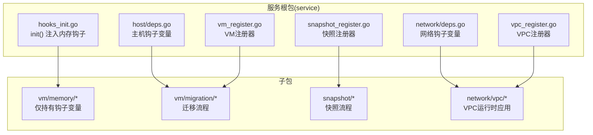
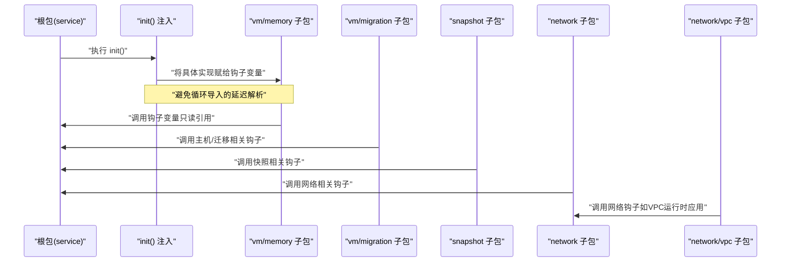
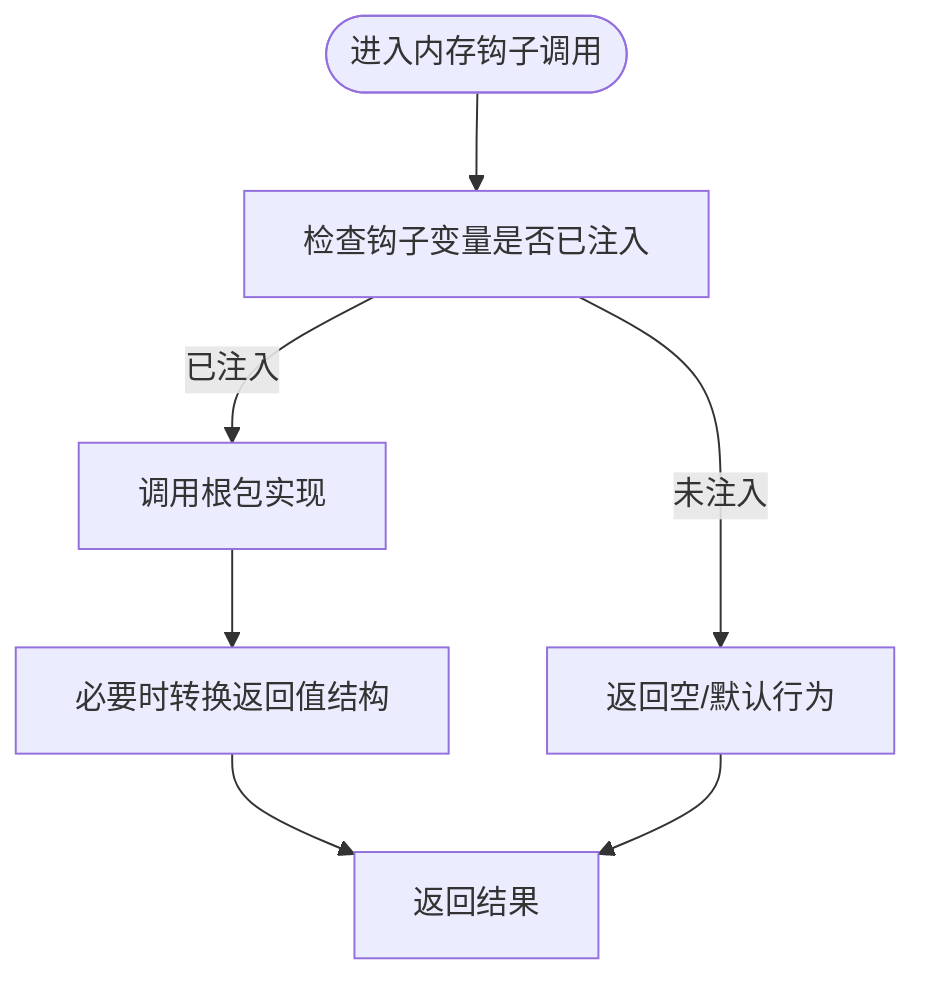
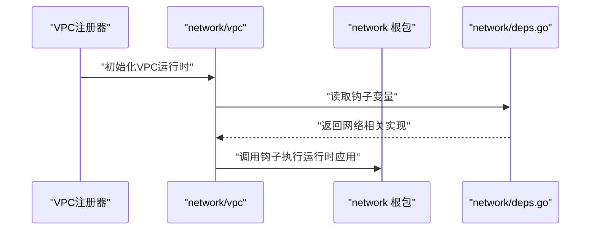
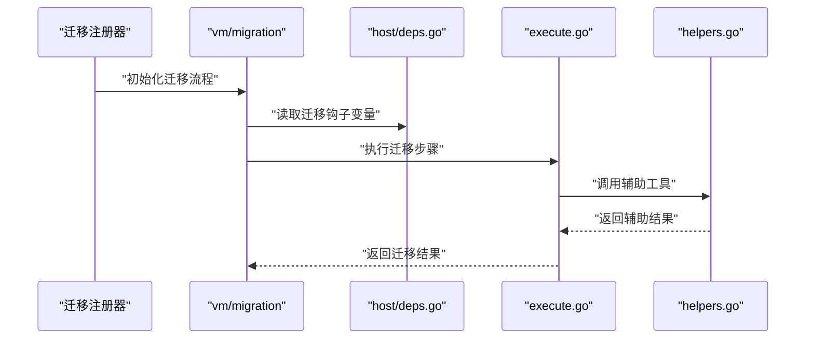
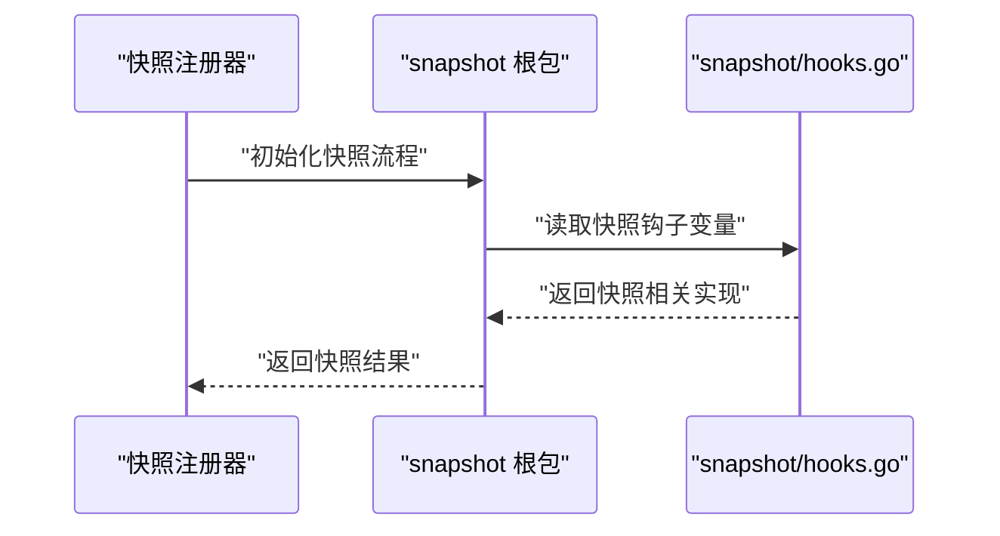
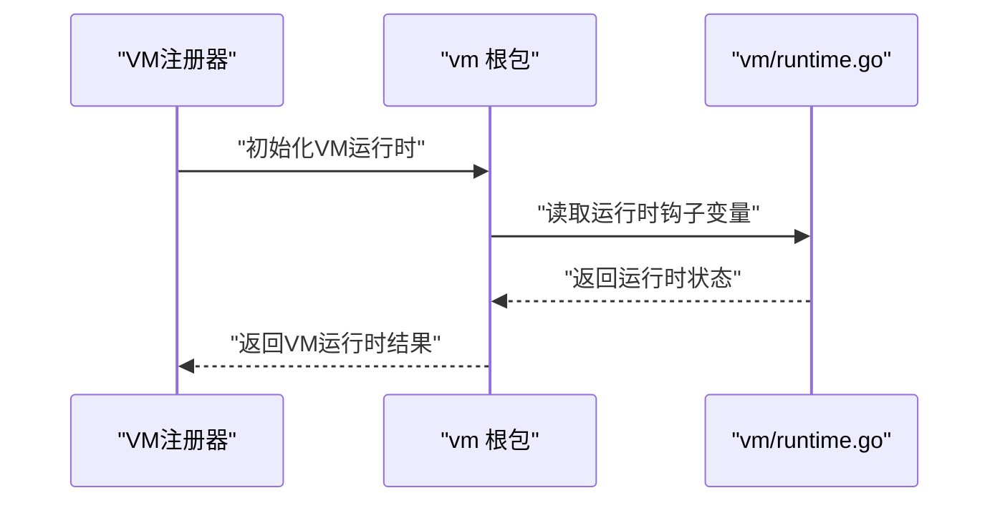
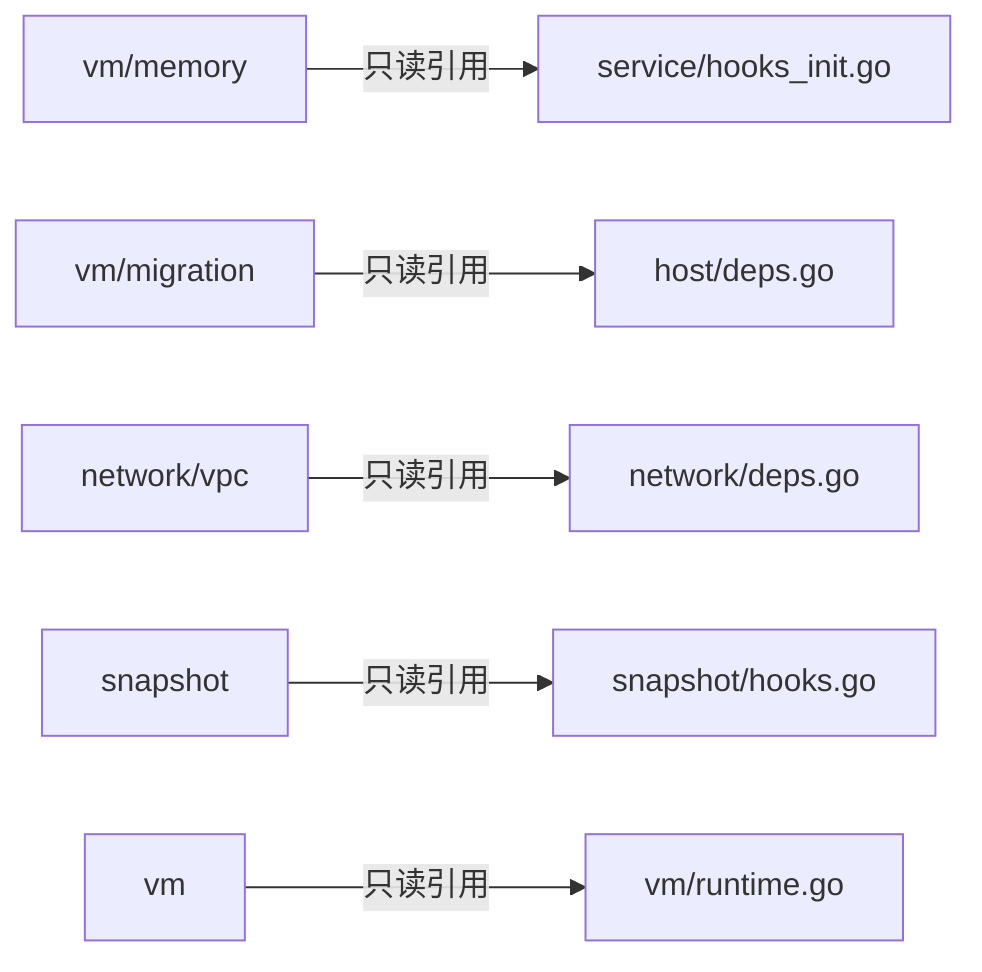

# 插件系统

<cite>
**本文引用的文件**
- [server/service/hooks_init.go](file://server/service/hooks_init.go)
- [server/service/host/deps.go](file://server/service/host/deps.go)
- [server/service/network/deps.go](file://server/service/network/deps.go)
- [server/service/snapshot/hooks.go](file://server/service/snapshot/hooks.go)
- [server/service/vm/migration/execute.go](file://server/service/vm/migration/execute.go)
- [server/service/vm/migration/helpers.go](file://server/service/vm/migration/helpers.go)
- [server/service/vm/migration/register.go](file://server/service/vm/migration/register.go)
- [server/service/vm/memory/config.go](file://server/service/vm/memory/config.go)
- [server/service/vm/memory/types.go](file://server/service/vm/memory/types.go)
- [server/service/vm/runtime.go](file://server/service/vm/runtime.go)
- [server/service/vpc_register.go](file://server/service/vpc_register.go)
- [server/service/snapshot_register.go](file://server/service/snapshot_register.go)
- [server/service/vm_register.go](file://server/service/vm_register.go)
- [server/main.go](file://server/main.go)
</cite>

## 目录
1. [引言](#引言)
2. [项目结构](#项目结构)
3. [核心组件](#核心组件)
4. [架构总览](#架构总览)
5. [详细组件分析](#详细组件分析)
6. [依赖关系分析](#依赖关系分析)
7. [性能考虑](#性能考虑)
8. [故障排查指南](#故障排查指南)
9. [结论](#结论)
10. [附录：插件开发最佳实践与示例](#附录插件开发最佳实践与示例)

## 引言
本指南面向希望在Open虚拟机管理控制台中开发“插件”（以钩子形式）的开发者，系统性讲解以下主题：
- 钩子系统设计原理：通过根包变量调用子包函数，实现反向依赖解耦与避免循环导入
- init()注册机制：在包初始化阶段完成钩子函数的注入，确保运行时可用
- 各类钩子类型与典型实现：VPC绑定运行时钩子、虚拟机迁移钩子、快照钩子、内存钩子
- 延迟解析与初始化顺序：通过变量与init()的配合，解决初始化先后问题
- 开发最佳实践：命名规范、参数约定、错误处理策略
- 完整示例与测试建议：基于仓库现有实现路径进行可操作指导

## 项目结构
Open服务端采用分层+按功能域划分的组织方式，插件化能力主要体现在“钩子”（Hook）变量与“注册器”（register.go）模式上：
- 根包负责声明钩子变量（如主机、网络、内存等），并在init()中注入具体实现
- 子包仅持有对根包钩子的只读引用，不直接导入根包，从而避免循环导入
- 注册器文件集中暴露注册入口，便于统一初始化

图示来源
- [server/service/hooks_init.go:10-42](file://server/service/hooks_init.go#L10-L42)
- [server/service/host/deps.go:11-28](file://server/service/host/deps.go#L11-L28)
- [server/service/network/deps.go:72-105](file://server/service/network/deps.go#L72-L105)
- [server/service/vpc_register.go](file://server/service/vpc_register.go)
- [server/service/snapshot_register.go](file://server/service/snapshot_register.go)
- [server/service/vm_register.go](file://server/service/vm_register.go)

章节来源
- [server/service/hooks_init.go:1-42](file://server/service/hooks_init.go#L1-L42)
- [server/service/host/deps.go:1-28](file://server/service/host/deps.go#L1-L28)
- [server/service/network/deps.go:72-105](file://server/service/network/deps.go#L72-L105)

## 核心组件
- 钩子变量（Hook Variables）
  - 在根包中以全局变量形式声明，类型为函数签名或带返回值的函数指针
  - 子包仅持有这些变量的只读引用，不直接导入根包，避免循环导入
- 初始化注入（init() Registration）
  - 在根包的init()中，将具体实现赋给钩子变量，形成“延迟解析”
  - 这样既保证了运行时可用，又避免了编译期的循环依赖
- 注册器（Registerers）
  - 各功能域提供register.go文件，作为对外暴露的初始化入口
  - 调用方只需加载对应注册器即可完成钩子装配

章节来源
- [server/service/hooks_init.go:10-42](file://server/service/hooks_init.go#L10-L42)
- [server/service/host/deps.go:11-28](file://server/service/host/deps.go#L11-L28)
- [server/service/network/deps.go:72-105](file://server/service/network/deps.go#L72-L105)

## 架构总览
下图展示“根包声明钩子 → init()注入实现 → 子包调用”的完整链路，以及与迁移、快照、内存、VPC等模块的交互。

图示来源
- [server/service/hooks_init.go:10-42](file://server/service/hooks_init.go#L10-L42)
- [server/service/host/deps.go:11-28](file://server/service/host/deps.go#L11-L28)
- [server/service/network/deps.go:72-105](file://server/service/network/deps.go#L72-L105)

## 详细组件分析

### 内存钩子（VM Memory Hooks）
- 设计要点
  - 根包声明钩子变量，子包仅持有只读引用
  - init()中将具体实现注入到钩子变量，形成延迟解析
- 关键实现位置
  - 根包注入：[server/service/hooks_init.go:10-42](file://server/service/hooks_init.go#L10-L42)
  - 子包钩子接口：[server/service/vm/memory/config.go](file://server/service/vm/memory/config.go)
  - 子包数据模型：[server/service/vm/memory/types.go](file://server/service/vm/memory/types.go)
- 典型调用场景
  - 获取动态内存信息、缓存统计、宿主机内存状态、维护模式判断、memballoon配置注入等

图示来源
- [server/service/hooks_init.go:10-42](file://server/service/hooks_init.go#L10-L42)
- [server/service/vm/memory/config.go](file://server/service/vm/memory/config.go)
- [server/service/vm/memory/types.go](file://server/service/vm/memory/types.go)

章节来源
- [server/service/hooks_init.go:10-42](file://server/service/hooks_init.go#L10-L42)
- [server/service/vm/memory/config.go](file://server/service/vm/memory/config.go)
- [server/service/vm/memory/types.go](file://server/service/vm/memory/types.go)

### VPC 绑定运行时钩子（VPC Runtime Apply Hooks）
- 设计要点
  - 网络根包声明钩子变量，供VPC子包在运行时应用网络策略
  - 通过注册器集中暴露VPC初始化逻辑
- 关键实现位置
  - 网络钩子接口：[server/service/network/deps.go:72-105](file://server/service/network/deps.go#L72-L105)
  - VPC注册器：[server/service/vpc_register.go](file://server/service/vpc_register.go)
  - VPC运行时应用：[server/service/network/vpc/runtime_apply.go](file://server/service/network/vpc/runtime_apply.go)

图示来源
- [server/service/network/deps.go:72-105](file://server/service/network/deps.go#L72-L105)
- [server/service/vpc_register.go](file://server/service/vpc_register.go)

章节来源
- [server/service/network/deps.go:72-105](file://server/service/network/deps.go#L72-L105)
- [server/service/vpc_register.go](file://server/service/vpc_register.go)

### 虚拟机迁移钩子（VM Migration Hooks）
- 设计要点
  - 主机根包声明迁移相关钩子变量，迁移流程在执行前/后调用
  - 通过注册器集中暴露迁移初始化逻辑
- 关键实现位置
  - 主机钩子接口：[server/service/host/deps.go:11-28](file://server/service/host/deps.go#L11-L28)
  - 迁移注册器：[server/service/vm/migration/register.go](file://server/service/vm/migration/register.go)
  - 迁移执行流程：[server/service/vm/migration/execute.go](file://server/service/vm/migration/execute.go)
  - 迁移辅助工具：[server/service/vm/migration/helpers.go](file://server/service/vm/migration/helpers.go)

图示来源
- [server/service/host/deps.go:11-28](file://server/service/host/deps.go#L11-L28)
- [server/service/vm/migration/register.go](file://server/service/vm/migration/register.go)
- [server/service/vm/migration/execute.go](file://server/service/vm/migration/execute.go)
- [server/service/vm/migration/helpers.go](file://server/service/vm/migration/helpers.go)

章节来源
- [server/service/host/deps.go:11-28](file://server/service/host/deps.go#L11-L28)
- [server/service/vm/migration/register.go](file://server/service/vm/migration/register.go)
- [server/service/vm/migration/execute.go](file://server/service/vm/migration/execute.go)
- [server/service/vm/migration/helpers.go](file://server/service/vm/migration/helpers.go)

### 快照钩子（Snapshot Hooks）
- 设计要点
  - 快照根包声明钩子变量，用于在快照生命周期内执行扩展逻辑
  - 通过注册器集中暴露快照初始化逻辑
- 关键实现位置
  - 快照钩子定义：[server/service/snapshot/hooks.go](file://server/service/snapshot/hooks.go)
  - 快照注册器：[server/service/snapshot_register.go](file://server/service/snapshot_register.go)

图示来源
- [server/service/snapshot/hooks.go](file://server/service/snapshot/hooks.go)
- [server/service/snapshot_register.go](file://server/service/snapshot_register.go)

章节来源
- [server/service/snapshot/hooks.go](file://server/service/snapshot/hooks.go)
- [server/service/snapshot_register.go](file://server/service/snapshot_register.go)

### VM 运行时钩子（VM Runtime Hooks）
- 设计要点
  - VM根包声明运行时钩子变量，供各子系统在运行时查询/同步状态
  - 通过注册器集中暴露VM初始化逻辑
- 关键实现位置
  - VM运行时钩子：[server/service/vm/runtime.go](file://server/service/vm/runtime.go)
  - VM注册器：[server/service/vm_register.go](file://server/service/vm_register.go)

图示来源
- [server/service/vm/runtime.go](file://server/service/vm/runtime.go)
- [server/service/vm_register.go](file://server/service/vm_register.go)

章节来源
- [server/service/vm/runtime.go](file://server/service/vm/runtime.go)
- [server/service/vm_register.go](file://server/service/vm_register.go)

## 依赖关系分析
- 解耦策略
  - 子包仅持有根包钩子变量的只读引用，避免直接导入根包
  - init()在根包中完成注入，形成延迟解析，避免编译期循环导入
- 关键依赖链
  - 内存子包依赖根包钩子变量（由hooks_init.go注入）
  - 迁移子包依赖主机钩子变量（由host/deps.go声明）
  - VPC子包依赖网络钩子变量（由network/deps.go声明）
  - 快照/VM子包依赖各自注册器与钩子变量

图示来源
- [server/service/hooks_init.go:10-42](file://server/service/hooks_init.go#L10-L42)
- [server/service/host/deps.go:11-28](file://server/service/host/deps.go#L11-L28)
- [server/service/network/deps.go:72-105](file://server/service/network/deps.go#L72-L105)
- [server/service/snapshot/hooks.go](file://server/service/snapshot/hooks.go)
- [server/service/vm/runtime.go](file://server/service/vm/runtime.go)

章节来源
- [server/service/hooks_init.go:10-42](file://server/service/hooks_init.go#L10-L42)
- [server/service/host/deps.go:11-28](file://server/service/host/deps.go#L11-L28)
- [server/service/network/deps.go:72-105](file://server/service/network/deps.go#L72-L105)
- [server/service/snapshot/hooks.go](file://server/service/snapshot/hooks.go)
- [server/service/vm/runtime.go](file://server/service/vm/runtime.go)

## 性能考虑
- 钩子调用开销
  - 钩子为函数指针调用，开销极低；建议在高频路径中避免重复判断钩子是否为空
- 初始化时机
  - init()注入发生在包加载阶段，避免运行时反复查找实现
- 并发安全
  - 钩子变量在初始化后不应再修改；如需支持热插拔，应引入锁或原子替换策略

## 故障排查指南
- 常见问题
  - 钩子未注入导致调用失败：确认根包init()是否被执行
  - 循环导入：确保子包仅持有钩子变量，不直接导入根包
  - 返回值结构不匹配：确保钩子实现与声明一致
- 排查步骤
  - 检查对应注册器是否被调用
  - 检查根包init()中的注入逻辑
  - 检查子包对钩子变量的调用点

章节来源
- [server/service/hooks_init.go:10-42](file://server/service/hooks_init.go#L10-L42)
- [server/service/host/deps.go:11-28](file://server/service/host/deps.go#L11-L28)
- [server/service/network/deps.go:72-105](file://server/service/network/deps.go#L72-L105)

## 结论
Open的插件系统以“钩子变量 + init()注入 + 注册器”为核心，实现了根包与子包之间的松耦合与反向依赖解耦。该模式有效避免了循环导入，同时提供了清晰的扩展点。开发者可据此在内存、迁移、快照、VPC等模块中快速扩展功能，保持系统整体稳定性与可维护性。

## 附录：插件开发最佳实践与示例

### 命名规范
- 钩子变量命名
  - 使用“HookXxx”前缀，语义明确，如HookApplyPendingVMMemoryConfig、HookGetVPCSwitchForVM
- 函数签名
  - 保持一致性：输入参数尽量使用结构体或明确的标识符，返回值包含错误类型
- 注册器命名
  - 使用“xxx_register.go”，集中暴露初始化入口

### 参数传递与错误处理
- 参数传递
  - 优先使用结构体参数，便于扩展与版本兼容
  - 对于跨包调用，尽量传递最小必要字段
- 错误处理
  - 所有钩子实现必须返回错误类型，调用方应显式处理
  - 对于可选钩子，先判断是否为空再调用

### 开发步骤示例（以新增一个“磁盘配额钩子”为例）
- 步骤1：在根包声明钩子变量
  - 在对应根包（如storage/disk）的deps.go中添加钩子变量
- 步骤2：在根包init()中注入实现
  - 在hooks_init.go中将具体实现赋给钩子变量
- 步骤3：在子包中调用钩子
  - 子包仅持有钩子变量，不导入根包
- 步骤4：提供注册器
  - 新增register.go，集中暴露初始化逻辑
- 步骤5：编写测试
  - 单元测试覆盖钩子注入与调用路径
  - 集成测试验证初始化顺序与运行时行为

### 测试方法
- 单元测试
  - 针对钩子变量的注入与调用进行断言
- 集成测试
  - 加载对应注册器，验证初始化链路与运行时行为
- 回归测试
  - 确保新增钩子不影响既有钩子的调用路径

章节来源
- [server/service/hooks_init.go:10-42](file://server/service/hooks_init.go#L10-L42)
- [server/service/host/deps.go:11-28](file://server/service/host/deps.go#L11-L28)
- [server/service/network/deps.go:72-105](file://server/service/network/deps.go#L72-L105)
- [server/service/vm/migration/register.go](file://server/service/vm/migration/register.go)
- [server/service/snapshot_register.go](file://server/service/snapshot_register.go)
- [server/service/vm_register.go](file://server/service/vm_register.go)
- [server/service/vpc_register.go](file://server/service/vpc_register.go)