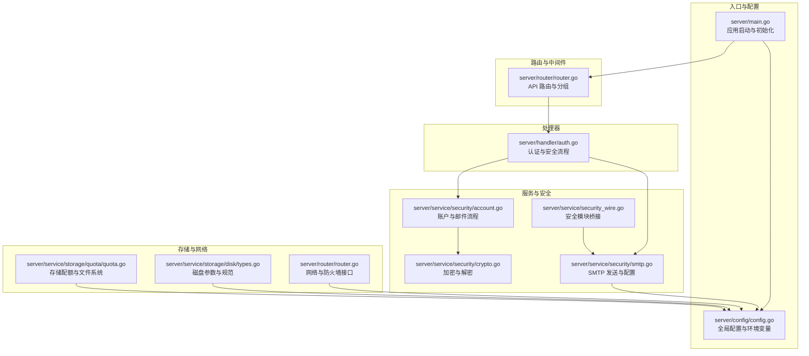
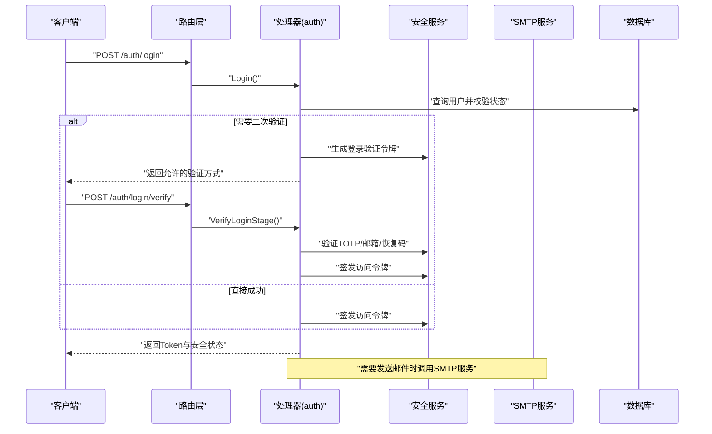
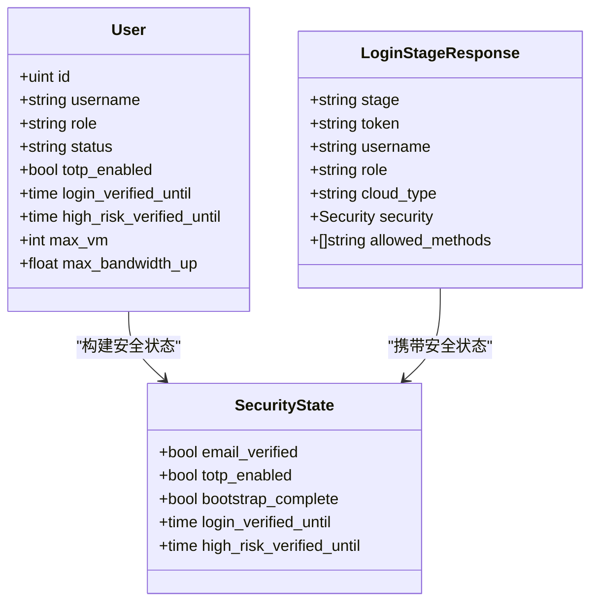
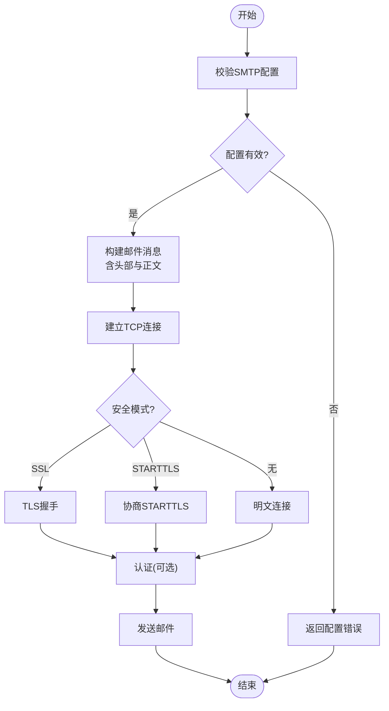
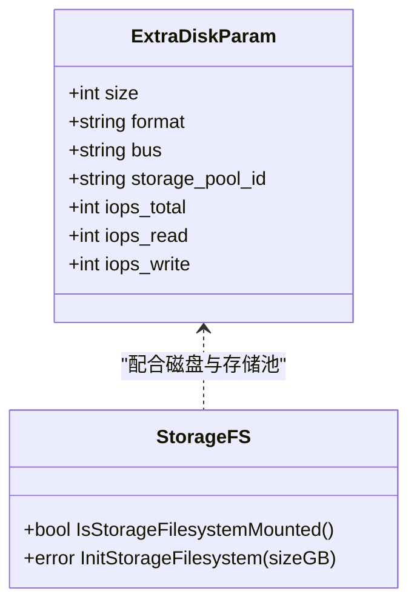
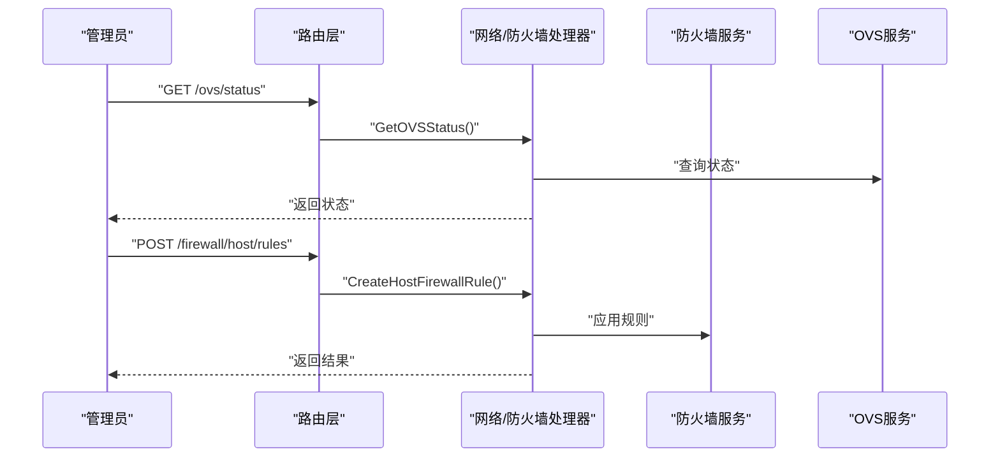
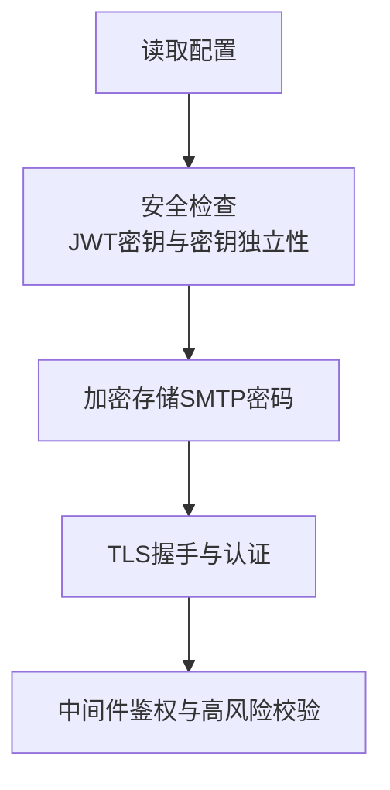
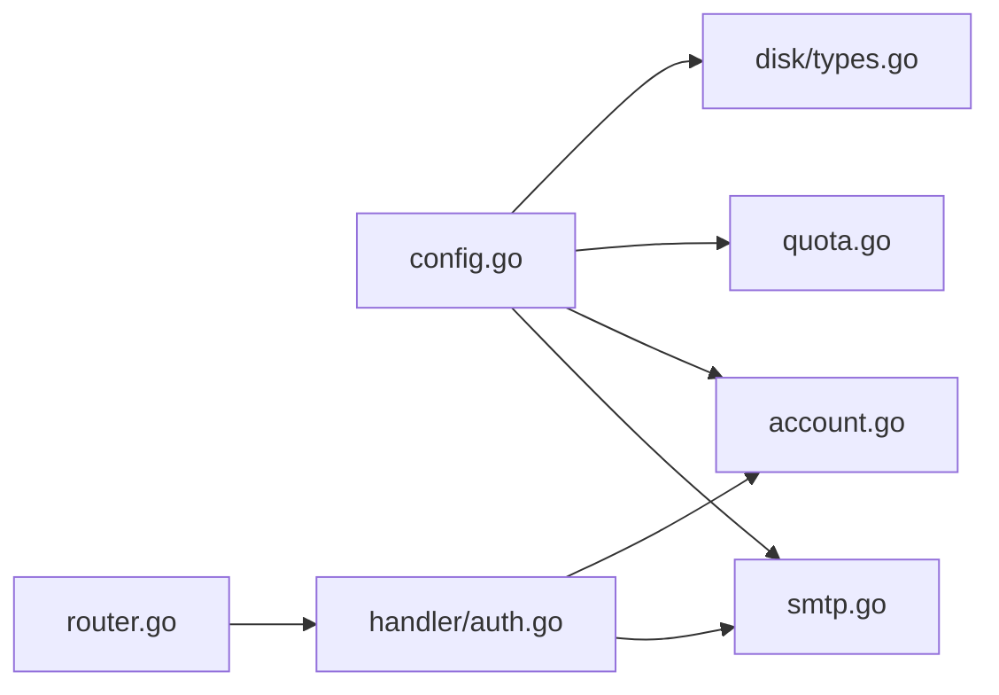

# 第三方集成

<cite>
**本文引用的文件**
- [server/main.go](file://server/main.go)
- [server/config/config.go](file://server/config/config.go)
- [server/service/security/smtp.go](file://server/service/security/smtp.go)
- [server/service/security/account.go](file://server/service/security/account.go)
- [server/service/security/crypto.go](file://server/service/security/crypto.go)
- [server/handler/auth.go](file://server/handler/auth.go)
- [server/model/user.go](file://server/model/user.go)
- [server/service/security_wire.go](file://server/service/security_wire.go)
- [server/service/storage/quota/quota.go](file://server/service/storage/quota/quota.go)
- [server/service/storage/disk/types.go](file://server/service/storage/disk/types.go)
- [server/router/router.go](file://server/router/router.go)
- [web/src/views/api-docs/endpointDocs.js](file://web/src/views/api-docs/endpointDocs.js)
- [web/src/views/api-docs/index.vue](file://web/src/views/api-docs/index.vue)
- [AGENTS.md](file://AGENTS.md)
- [DEPENDENCIES.md](file://DEPENDENCIES.md)
</cite>

## 目录
1. [简介](#简介)
2. [项目结构](#项目结构)
3. [核心组件](#核心组件)
4. [架构总览](#架构总览)
5. [详细组件分析](#详细组件分析)
6. [依赖分析](#依赖分析)
7. [性能考量](#性能考量)
8. [故障排除指南](#故障排除指南)
9. [结论](#结论)
10. [附录](#附录)

## 简介
本指南面向需要在系统中集成第三方系统的开发者，围绕以下主题提供从架构到实现细节的完整说明：
- LDAP 认证集成：用户同步、权限映射与会话管理
- SMTP 邮件服务集成：邮件发送、模板渲染与错误处理
- 外部存储系统集成：对象存储、块存储与文件系统对接
- 网络设备集成：路由器、交换机与防火墙的 API 调用
- 安全考虑：凭据管理、加密传输与访问控制
- 实现示例与故障排除

本项目以 Go 编写的后端服务为核心，提供 REST API，并通过前端 Vue 应用提供管理界面。后端采用配置驱动、任务队列与模块化设计，便于扩展第三方能力。

## 项目结构
后端采用分层与模块化组织：
- 配置层：集中管理运行时配置与环境变量映射
- 路由层：定义 API 分组与鉴权中间件
- 处理器层：实现业务接口，负责请求解析与响应封装
- 服务层：封装业务逻辑，协调模型与外部系统
- 模型层：数据库实体定义
- 安全子系统：认证、授权、加密与邮件发送
- 存储子系统：磁盘、卷与配额管理
- 网络子系统：VPC、防火墙与 OVS 网络

**图表来源**
- [server/main.go:1-128](file://server/main.go#L1-L128)
- [server/config/config.go:154-249](file://server/config/config.go#L154-L249)
- [server/router/router.go:335-362](file://server/router/router.go#L335-L362)
- [server/handler/auth.go:101-202](file://server/handler/auth.go#L101-L202)
- [server/service/security/smtp.go:160-266](file://server/service/security/smtp.go#L160-L266)
- [server/service/security/account.go:228-247](file://server/service/security/account.go#L228-L247)
- [server/service/security/crypto.go:15-73](file://server/service/security/crypto.go#L15-L73)
- [server/service/security_wire.go:65-179](file://server/service/security_wire.go#L65-L179)
- [server/service/storage/quota/quota.go:318-339](file://server/service/storage/quota/quota.go#L318-L339)
- [server/service/storage/disk/types.go:5-33](file://server/service/storage/disk/types.go#L5-L33)

**章节来源**
- [server/main.go:31-128](file://server/main.go#L31-L128)
- [server/config/config.go:154-249](file://server/config/config.go#L154-L249)
- [server/router/router.go:335-362](file://server/router/router.go#L335-L362)

## 核心组件
- 配置中心：集中管理 SMTP、JWT、日志、网络与存储等配置项，支持从环境变量与数据库加载
- 安全与认证：基于 JWT 的会话管理，支持引导流程、邮箱与 TOTP 二次验证，以及密码重置与邀请注册
- 邮件服务：SMTP 发送、SSL/TLS/STARTTLS 支持、密码加密存储与测试配置
- 存储系统：磁盘参数标准化、文件系统挂载与配额、卷管理
- 网络与防火墙：VPC、安全组、端口转发与宿主机防火墙规则管理

**章节来源**
- [server/config/config.go:154-249](file://server/config/config.go#L154-L249)
- [server/service/security/smtp.go:160-266](file://server/service/security/smtp.go#L160-L266)
- [server/service/security/account.go:228-247](file://server/service/security/account.go#L228-L247)
- [server/service/storage/quota/quota.go:318-339](file://server/service/storage/quota/quota.go#L318-L339)
- [server/service/storage/disk/types.go:5-33](file://server/service/storage/disk/types.go#L5-L33)

## 架构总览
系统启动时完成配置加载、数据库初始化、安全检查与任务队列启动，随后注册路由并对外提供 API。认证流程贯穿登录、二次验证、引导与会话签发；邮件服务贯穿邀请、密码重置与通知；存储与网络模块为虚拟机生命周期提供支撑。

**图表来源**
- [server/handler/auth.go:101-202](file://server/handler/auth.go#L101-L202)
- [server/handler/auth.go:352-429](file://server/handler/auth.go#L352-L429)
- [server/service/security/account.go:228-247](file://server/service/security/account.go#L228-L247)
- [server/service/security/smtp.go:160-266](file://server/service/security/smtp.go#L160-L266)

## 详细组件分析

### LDAP 认证集成（用户同步、权限映射与会话管理）
- 用户模型与角色
  - 用户实体包含角色、状态、配额与安全状态字段，支持区分管理员与普通用户
  - 角色与状态用于控制访问与功能启用
- 登录与会话
  - 登录接口完成凭据校验与状态检查，支持引导流程与二次验证
  - 二次验证支持邮箱验证码、TOTP 与恢复码，验证通过后签发访问令牌
- 权限映射
  - 角色与状态决定用户可访问的资源与操作
  - 安全状态包含登录验证窗口、高风险信任窗口与引导标记
- 用户同步
  - 可通过邀请注册与密码重置流程同步用户信息
  - 系统支持将用户密码同步至系统用户，保证虚拟机登录一致性

**图表来源**
- [server/model/user.go:9-56](file://server/model/user.go#L9-L56)
- [server/handler/auth.go:21-30](file://server/handler/auth.go#L21-L30)
- [server/service/security/account.go:497-513](file://server/service/security/account.go#L497-L513)

**章节来源**
- [server/model/user.go:9-56](file://server/model/user.go#L9-L56)
- [server/handler/auth.go:101-202](file://server/handler/auth.go#L101-L202)
- [server/handler/auth.go:352-429](file://server/handler/auth.go#L352-L429)
- [server/service/security/account.go:497-513](file://server/service/security/account.go#L497-L513)

### SMTP 邮件服务集成（发送、模板与错误处理）
- 配置与测试
  - 支持从配置读取 SMTP 主机、端口、用户名、发件人、安全模式与超时
  - 提供测试配置校验与发送能力，支持 SSL/TLS/STARTTLS
- 加密存储
  - SMTP 密码采用 AES-GCM 加密存储，使用安全密钥派生
- 发送流程
  - 根据配置建立连接，按需启动 TLS，进行认证（如需要），发送邮件正文
  - 错误处理覆盖连接失败、认证失败、发件/收件人设置失败与数据写入失败
- 模板渲染
  - 邮件正文采用纯文本格式，头部进行 UTF-8 Base64 编码
  - 可在业务层拼装模板内容后调用发送接口

**图表来源**
- [server/service/security/smtp.go:79-158](file://server/service/security/smtp.go#L79-L158)
- [server/service/security/smtp.go:181-266](file://server/service/security/smtp.go#L181-L266)
- [server/service/security/crypto.go:15-73](file://server/service/security/crypto.go#L15-L73)

**章节来源**
- [server/config/config.go:97-106](file://server/config/config.go#L97-L106)
- [server/service/security/smtp.go:79-158](file://server/service/security/smtp.go#L79-L158)
- [server/service/security/smtp.go:181-266](file://server/service/security/smtp.go#L181-L266)
- [server/service/security/crypto.go:15-73](file://server/service/security/crypto.go#L15-L73)

### 外部存储系统集成（对象存储、块存储与文件系统）
- 磁盘参数与规范
  - 磁盘参数包含大小、格式、总线类型与存储池等，支持 IOPS 限制
  - 总线类型规范化为已知集合，确保与虚拟硬件兼容
- 文件系统与配额
  - 支持检测挂载状态、初始化镜像文件、格式化与挂载
  - 支持启用 project 配额，对目录与文件进行配额追踪
- 卷管理
  - 提供卷创建与删除接口，配合存储池管理

**图表来源**
- [server/service/storage/disk/types.go:5-33](file://server/service/storage/disk/types.go#L5-L33)
- [server/service/storage/quota/quota.go:318-339](file://server/service/storage/quota/quota.go#L318-L339)

**章节来源**
- [server/service/storage/disk/types.go:5-33](file://server/service/storage/disk/types.go#L5-L33)
- [server/service/storage/quota/quota.go:318-339](file://server/service/storage/quota/quota.go#L318-L339)

### 网络设备集成（路由器、交换机与防火墙）
- OVS 网络诊断
  - 提供状态、端口、租约查询与网络检查/修复接口，管理员可用
- 宿主机防火墙
  - 支持规则创建、更新、删除、默认规则添加与连接关闭影响预览与执行
- VPC 与安全组
  - 提供交换机、安全组与端口转发管理接口，支持 NAT 与静态 IP

**图表来源**
- [server/router/router.go:335-362](file://server/router/router.go#L335-L362)

**章节来源**
- [server/router/router.go:335-362](file://server/router/router.go#L335-L362)

### 安全考虑（凭据管理、加密传输与访问控制）
- 凭据管理
  - JWT 密钥与安全密钥独立配置，启动时进行安全检查
  - SMTP 密码采用 AES-GCM 加密存储，密钥来自安全密钥
- 加密传输
  - SMTP 支持 SSL/TLS 与 STARTTLS，最小 TLS 版本约束
- 访问控制
  - 路由层对管理员接口进行中间件保护
  - 高风险操作需二次验证或高风险令牌

**图表来源**
- [server/config/config.go:251-283](file://server/config/config.go#L251-L283)
- [server/service/security/crypto.go:15-73](file://server/service/security/crypto.go#L15-L73)
- [server/service/security/smtp.go:217-263](file://server/service/security/smtp.go#L217-L263)
- [server/router/router.go:335-362](file://server/router/router.go#L335-L362)

**章节来源**
- [server/config/config.go:251-283](file://server/config/config.go#L251-L283)
- [server/service/security/crypto.go:15-73](file://server/service/security/crypto.go#L15-L73)
- [server/service/security/smtp.go:217-263](file://server/service/security/smtp.go#L217-L263)
- [server/router/router.go:335-362](file://server/router/router.go#L335-L362)

## 依赖分析
- 配置依赖：所有模块通过全局配置读取 SMTP、网络与日志等参数
- 安全依赖：认证与邮件流程相互依赖，加密模块为敏感数据提供保障
- 存储依赖：磁盘参数与文件系统模块共同支撑虚拟机磁盘生命周期
- 网络依赖：路由层将请求分发至相应处理器，处理器调用服务层实现业务

**图表来源**
- [server/config/config.go:154-249](file://server/config/config.go#L154-L249)
- [server/service/security/smtp.go:160-266](file://server/service/security/smtp.go#L160-L266)
- [server/service/security/account.go:228-247](file://server/service/security/account.go#L228-L247)
- [server/service/storage/quota/quota.go:318-339](file://server/service/storage/quota/quota.go#L318-L339)
- [server/service/storage/disk/types.go:5-33](file://server/service/storage/disk/types.go#L5-L33)
- [server/handler/auth.go:101-202](file://server/handler/auth.go#L101-L202)
- [server/router/router.go:335-362](file://server/router/router.go#L335-L362)

**章节来源**
- [server/config/config.go:154-249](file://server/config/config.go#L154-L249)
- [server/service/security/smtp.go:160-266](file://server/service/security/smtp.go#L160-L266)
- [server/service/security/account.go:228-247](file://server/service/security/account.go#L228-L247)
- [server/service/storage/quota/quota.go:318-339](file://server/service/storage/quota/quota.go#L318-L339)
- [server/service/storage/disk/types.go:5-33](file://server/service/storage/disk/types.go#L5-L33)
- [server/handler/auth.go:101-202](file://server/handler/auth.go#L101-L202)
- [server/router/router.go:335-362](file://server/router/router.go#L335-L362)

## 性能考量
- 启动阶段：配置加载、数据库初始化、RPC 连接与任务队列启动，建议在容器或 systemd 中管理健康检查
- 任务队列：耗时操作（克隆、导入、迁移、快照）通过任务队列异步执行，避免阻塞请求
- 磁盘 IOPS：支持为磁盘设置 IOPS 限制，结合默认配额控制资源占用
- 网络带宽：全局上下行带宽限制与观察周期可调，动态内存调度减少资源争用

[本节为通用指导，不直接分析具体文件]

## 故障排除指南
- SMTP 发送失败
  - 检查 SMTP 配置是否完整（主机、端口、发件人）
  - 确认安全模式与超时设置，尝试使用测试配置验证
  - 若使用认证，确认用户名与加密存储的密码正确
- JWT 密钥问题
  - 启动时若检测到默认密钥，将拒绝启动（开发模式除外）
  - 建议为不同用途设置独立密钥，避免回退
- 用户登录异常
  - 检查用户状态（待邀请、禁用）、邮箱验证与 TOTP 绑定
  - 二次验证失败时，确认验证码或 TOTP 代码有效性
- 存储文件系统
  - 检查挂载点是否已挂载，镜像文件是否存在
  - 初始化失败时查看权限与空间配额
- 网络与防火墙
  - OVS 状态异常时，使用诊断接口检查端口与租约
  - 宿主机防火墙规则冲突时，先预览影响再执行

**章节来源**
- [server/service/security/smtp.go:160-266](file://server/service/security/smtp.go#L160-L266)
- [server/config/config.go:251-283](file://server/config/config.go#L251-L283)
- [server/handler/auth.go:101-202](file://server/handler/auth.go#L101-L202)
- [server/service/storage/quota/quota.go:318-339](file://server/service/storage/quota/quota.go#L318-L339)
- [server/router/router.go:335-362](file://server/router/router.go#L335-L362)

## 结论
本指南提供了第三方系统集成的完整蓝图：认证与邮件服务、存储与网络模块的实现要点与安全实践。通过配置驱动、模块化设计与任务队列，系统具备良好的扩展性与稳定性。建议在生产环境中严格管理密钥与凭证，启用 TLS 与二次验证，并对关键操作进行审计与监控。

[本节为总结性内容，不直接分析具体文件]

## 附录
- 开发环境依赖与安装步骤参考
- 外部程序可通过 API Key 调用兼容接口，登录、注册、邀请、找回密码、安全初始化、邮箱与 2FA 等流程不接受 API Key
- 新增接口需默认兼容 API Key 调用，并保留二次验证

**章节来源**
- [DEPENDENCIES.md:1-198](file://DEPENDENCIES.md#L1-L198)
- [web/src/views/api-docs/index.vue:14-26](file://web/src/views/api-docs/index.vue#L14-L26)
- [web/src/views/api-docs/endpointDocs.js:104-130](file://web/src/views/api-docs/endpointDocs.js#L104-L130)
- [AGENTS.md:15-15](file://AGENTS.md#L15-L15)