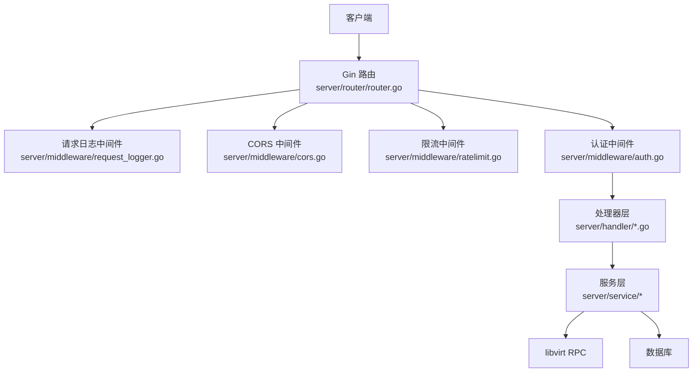
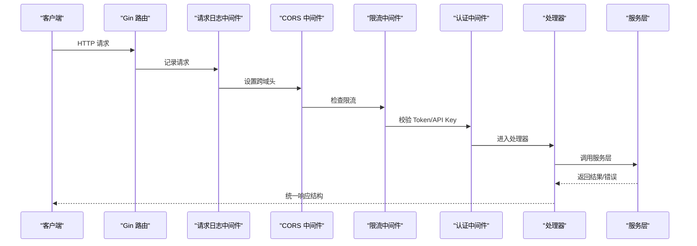
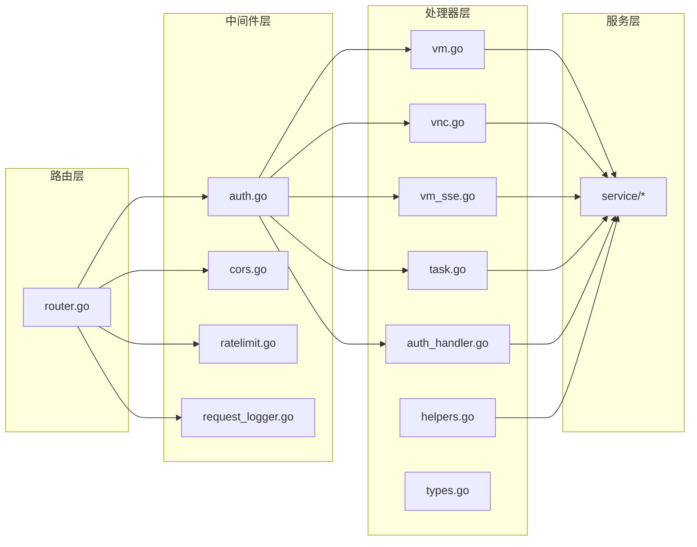

# 自定义处理器

<cite>
**本文档引用的文件**
- [router.go](file://server/router/router.go)
- [auth.go](file://server/middleware/auth.go)
- [cors.go](file://server/middleware/cors.go)
- [ratelimit.go](file://server/middleware/ratelimit.go)
- [request_logger.go](file://server/middleware/request_logger.go)
- [types.go](file://server/handler/types.go)
- [vm_sse.go](file://server/handler/vm_sse.go)
- [vnc.go](file://server/handler/vnc.go)
- [helpers.go](file://server/handler/helpers.go)
- [auth_handler.go](file://server/handler/auth.go)
- [vm_handler.go](file://server/handler/vm.go)
- [task_handler.go](file://server/handler/task.go)
- [main.go](file://server/main.go)
</cite>

## 目录
1. [简介](#简介)
2. [项目结构](#项目结构)
3. [核心组件](#核心组件)
4. [架构总览](#架构总览)
5. [详细组件分析](#详细组件分析)
6. [依赖关系分析](#依赖关系分析)
7. [性能考虑](#性能考虑)
8. [故障排查指南](#故障排查指南)
9. [结论](#结论)
10. [附录](#附录)

## 简介
本指南面向希望在现有系统中开发“自定义处理器”的工程师，系统讲解处理器层的设计架构、HTTP 请求处理流程与中间件集成、处理器注册机制（路由配置与依赖注入）、不同类型处理器的开发方法（RESTful API、WebSocket、SSE），以及处理器与服务层的交互模式、依赖关系管理与错误传播策略。文档同时提供最佳实践（请求验证、响应格式化、异常处理）与完整开发示例及调试技巧。

## 项目结构
系统采用分层架构，处理器层位于 server/handler，路由层位于 server/router，中间件层位于 server/middleware，入口位于 server/main.go。处理器通过 Gin Engine 路由注册，统一经由中间件链路（认证、CORS、限流、请求日志）进入业务逻辑，并调用服务层完成具体功能。

图示来源
- [router.go:19-485](file://server/router/router.go#L19-L485)
- [request_logger.go:12-69](file://server/middleware/request_logger.go#L12-L69)
- [cors.go:8-23](file://server/middleware/cors.go#L8-L23)
- [ratelimit.go:174-197](file://server/middleware/ratelimit.go#L174-L197)
- [auth.go:76-199](file://server/middleware/auth.go#L76-L199)

章节来源
- [router.go:19-485](file://server/router/router.go#L19-L485)
- [main.go:118-128](file://server/main.go#L118-L128)

## 核心组件
- 路由与注册
  - Gin Engine 初始化与全局中间件装配，随后按模块分组注册路由，处理器函数直接绑定到具体路径与 HTTP 方法。
- 中间件体系
  - 认证中间件：支持多种 Token 类型与 API Key 认证，支持管理员与 VM 访问控制。
  - CORS 中间件：统一跨域头与预检处理。
  - 限流中间件：基于滑动窗口的 IP 级限流，区分公开与认证接口。
  - 请求日志中间件：按状态码分级记录请求信息。
- 处理器层
  - 统一响应结构与错误处理；提供通用工具函数（请求解析、参数校验、SSE/WebSocket 辅助）。
- 服务层交互
  - 处理器只负责输入输出与流程编排，具体业务逻辑下沉至服务层，便于测试与复用。

章节来源
- [router.go:19-485](file://server/router/router.go#L19-L485)
- [auth.go:76-199](file://server/middleware/auth.go#L76-L199)
- [cors.go:8-23](file://server/middleware/cors.go#L8-L23)
- [ratelimit.go:174-197](file://server/middleware/ratelimit.go#L174-L197)
- [request_logger.go:12-69](file://server/middleware/request_logger.go#L12-L69)
- [helpers.go:17-179](file://server/handler/helpers.go#L17-L179)

## 架构总览
下图展示从客户端到处理器再到服务层的整体调用链，以及中间件在其中的插入点。

图示来源
- [router.go:19-485](file://server/router/router.go#L19-L485)
- [request_logger.go:12-69](file://server/middleware/request_logger.go#L12-L69)
- [cors.go:8-23](file://server/middleware/cors.go#L8-L23)
- [ratelimit.go:174-197](file://server/middleware/ratelimit.go#L174-L197)
- [auth.go:76-199](file://server/middleware/auth.go#L76-L199)

## 详细组件分析

### RESTful API 处理器
- 设计要点
  - 统一响应结构：处理器返回 JSON，包含 code、message、data 字段；错误通过状态码与 code 字段表达。
  - 参数解析与校验：使用 Gin 的 ShouldBindJSON/ShouldBindQuery 并结合自定义校验函数。
  - 错误处理：对服务层返回的特定错误进行分类处理（如 libvirt 不可用、资源冲突等）。
- 示例参考
  - 虚拟机列表与详情：处理器负责组装查询参数、调用服务层并返回统一结构。
  - 任务列表与详情：支持分页、过滤与权限控制，SSE 实时推送任务进度。
- 最佳实践
  - 始终在入口处解析并校验参数，尽早返回错误。
  - 对外部依赖（libvirt、数据库）的错误进行分类与降级处理。
  - 使用工具函数统一错误响应，保持一致性。

章节来源
- [vm_handler.go:81-126](file://server/handler/vm.go#L81-L126)
- [task_handler.go:15-85](file://server/handler/task.go#L15-L85)
- [helpers.go:17-31](file://server/handler/helpers.go#L17-L31)

### WebSocket 处理器
- 设计要点
  - 使用 Gorilla WebSocket 升级器，支持二进制子协议。
  - 与服务层协作获取 VNC 连接信息（Unix Socket/TCP），建立双向转发。
  - 注意升级失败与连接失败的错误处理与日志记录。
- 示例参考
  - VNC WebSocket 代理：处理器负责升级、连接后端 VNC、双向转发字节流。
- 最佳实践
  - 严格校验 VM 名称与访问权限。
  - 对上游/下游读写错误进行捕获并优雅关闭连接。
  - 生产环境建议限制来源与子协议。

章节来源
- [vnc.go:149-222](file://server/handler/vnc.go#L149-L222)

### SSE（Server-Sent Events）处理器
- 设计要点
  - 设置正确的响应头（text/event-stream），保持长连接。
  - 使用定时器周期性拉取服务层数据，通过 c.SSEvent 推送事件。
  - 对客户端断开进行感知，及时释放资源。
- 示例参考
  - 虚拟机列表与详情的 SSE：处理器负责初始化、定时推送与错误降级。
  - 任务进度的 SSE：处理器注册事件通道，向订阅者推送进度事件。
- 最佳实践
  - 合理设置心跳间隔，避免过度轮询。
  - 对服务层不可用场景进行降级（如推送空列表）。

章节来源
- [vm_sse.go:14-57](file://server/handler/vm_sse.go#L14-L57)
- [vm_sse.go:59-99](file://server/handler/vm_sse.go#L59-L99)
- [task_handler.go:87-130](file://server/handler/task.go#L87-L130)

### 处理器与服务层交互模式
- 依赖关系管理
  - 处理器通过服务层封装业务逻辑，避免直接耦合底层实现（如 libvirt、数据库）。
  - 服务层内部可能进一步拆分模块，处理器仅感知服务层接口。
- 错误传播
  - 服务层返回错误时，处理器根据错误类型决定响应状态码与 message。
  - 对于外部依赖不可用的情况，提供降级策略（如 SSE 推送空数据）。
- 数据结构
  - 处理器定义请求体结构（如 VmOperateRequest、VncPasswordRequest），并在处理器中进行绑定与校验。

章节来源
- [types.go:9-59](file://server/handler/types.go#L9-L59)
- [helpers.go:17-31](file://server/handler/helpers.go#L17-L31)

### 认证与授权中间件
- 支持多种 Token 类型与 API Key 认证，自动识别来源（Header、Query）。
- 提供管理员权限、VM 访问控制、轻量云限制等细粒度控制。
- 与处理器配合，确保只有具备相应权限的用户才能访问对应资源。

章节来源
- [auth.go:76-199](file://server/middleware/auth.go#L76-L199)
- [auth.go:244-278](file://server/middleware/auth.go#L244-L278)

### 跨域与限流中间件
- CORS 中间件统一设置允许的方法、头与暴露头，处理 OPTIONS 预检。
- 限流中间件基于滑动窗口统计每 IP 每分钟请求数，区分公开与认证接口，支持清理过期条目。

章节来源
- [cors.go:8-23](file://server/middleware/cors.go#L8-L23)
- [ratelimit.go:174-197](file://server/middleware/ratelimit.go#L174-L197)

## 依赖关系分析
处理器层与中间件层、服务层之间的依赖关系如下：

图示来源
- [router.go:19-485](file://server/router/router.go#L19-L485)
- [auth.go:76-199](file://server/middleware/auth.go#L76-L199)
- [cors.go:8-23](file://server/middleware/cors.go#L8-L23)
- [ratelimit.go:174-197](file://server/middleware/ratelimit.go#L174-L197)
- [request_logger.go:12-69](file://server/middleware/request_logger.go#L12-L69)
- [vm.go:81-126](file://server/handler/vm.go#L81-L126)
- [vnc.go:149-222](file://server/handler/vnc.go#L149-L222)
- [vm_sse.go:14-57](file://server/handler/vm_sse.go#L14-L57)
- [task.go:87-130](file://server/handler/task.go#L87-L130)
- [auth_handler.go:101-202](file://server/handler/auth.go#L101-L202)
- [helpers.go:17-31](file://server/handler/helpers.go#L17-L31)
- [types.go:9-59](file://server/handler/types.go#L9-L59)

## 性能考虑
- 中间件链路
  - 请求日志中间件按状态码分级记录，避免高频错误日志造成性能抖动。
  - 限流中间件使用滑动窗口与定期清理，降低内存占用。
- SSE 与 WebSocket
  - SSE 使用定时器推送，应合理设置间隔，避免频繁查询服务层。
  - WebSocket 双向转发需注意缓冲区大小与错误处理，防止内存泄漏。
- 服务层调用
  - 对外部依赖（libvirt、数据库）的调用应尽量批量化与缓存化，减少重复查询。

## 故障排查指南
- 常见问题定位
  - 认证失败：检查 Token 类型、签名密钥、过期时间与用户状态。
  - 跨域失败：确认 CORS 中间件是否生效，浏览器开发者工具查看响应头。
  - 限流触发：检查客户端 IP、路径是否命中公开/认证接口分类。
  - SSE/WS 断连：关注客户端断开信号与上游/下游读写错误。
- 日志与监控
  - 请求日志中间件按状态码分级记录，便于快速定位错误。
  - 对关键路径增加日志埋点，记录上下文信息（用户、路径、耗时）。

章节来源
- [auth.go:101-199](file://server/middleware/auth.go#L101-L199)
- [cors.go:8-23](file://server/middleware/cors.go#L8-L23)
- [ratelimit.go:174-197](file://server/middleware/ratelimit.go#L174-L197)
- [request_logger.go:12-69](file://server/middleware/request_logger.go#L12-L69)

## 结论
本系统的处理器层以 Gin 为核心，通过中间件实现统一的安全、跨域与限流策略，处理器专注于请求解析、参数校验与响应格式化，并将复杂业务下沉至服务层。针对 RESTful API、WebSocket 与 SSE 三类场景，系统提供了清晰的开发范式与最佳实践。遵循本文档的规范，可高效、稳定地扩展新的处理器。

## 附录

### 自定义处理器开发步骤
- 步骤一：设计请求与响应结构
  - 在处理器层定义请求体结构（如 types.go 中的结构体），并在处理器中绑定与校验。
- 步骤二：编写处理器函数
  - 在处理器文件中实现具体逻辑，调用服务层接口，统一返回响应结构。
- 步骤三：注册路由
  - 在路由文件中为处理器函数绑定路径与 HTTP 方法。
- 步骤四：接入中间件
  - 根据需求在路由组上挂载认证、管理员、VM 访问等中间件。
- 步骤五：测试与调试
  - 使用 Swagger 或 curl 进行接口测试，关注日志与限流行为。

章节来源
- [types.go:9-59](file://server/handler/types.go#L9-L59)
- [router.go:19-485](file://server/router/router.go#L19-L485)
- [auth.go:76-199](file://server/middleware/auth.go#L76-L199)

### 调试技巧
- 使用请求日志中间件观察请求生命周期与状态码分布。
- 对 SSE/WS 场景，关注客户端断开信号与上游/下游错误，及时释放资源。
- 对外部依赖错误进行分类处理，必要时提供降级策略（如 SSE 推送空数据）。

章节来源
- [request_logger.go:12-69](file://server/middleware/request_logger.go#L12-L69)
- [vm_sse.go:14-57](file://server/handler/vm_sse.go#L14-L57)
- [vnc.go:149-222](file://server/handler/vnc.go#L149-L222)