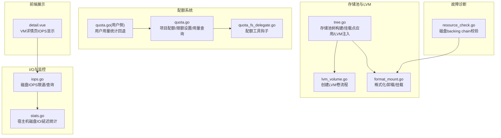
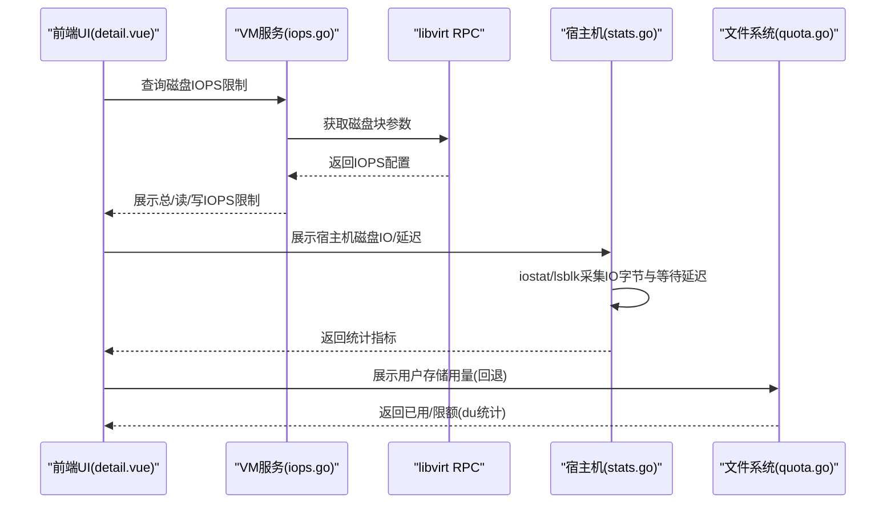
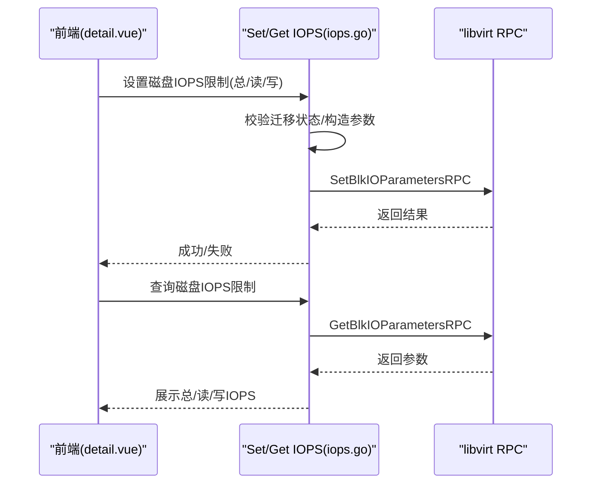
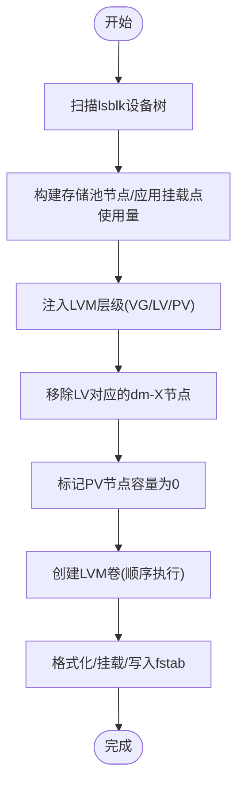
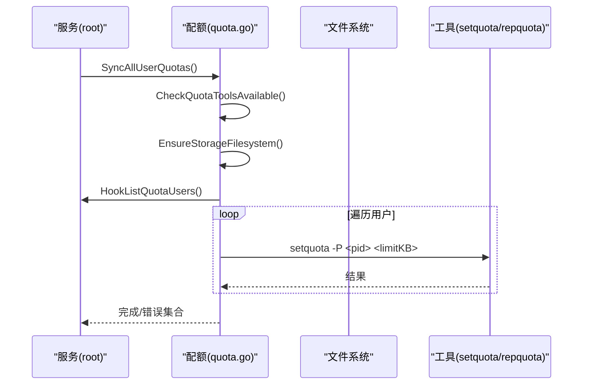
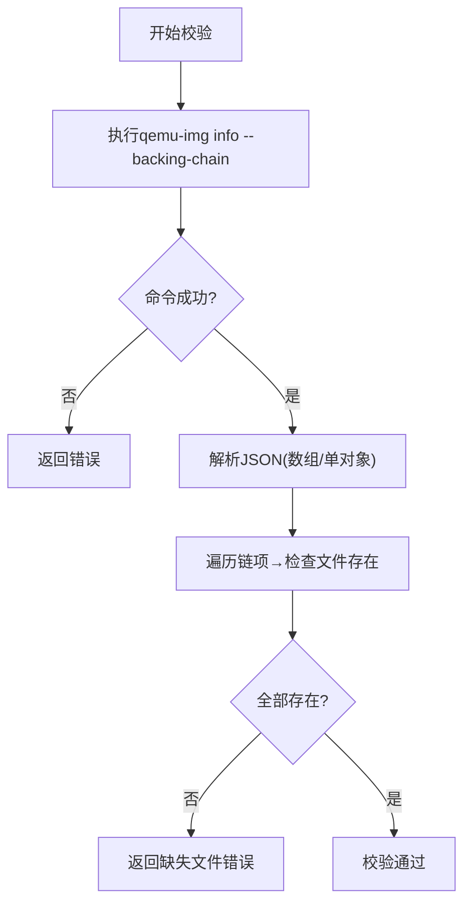
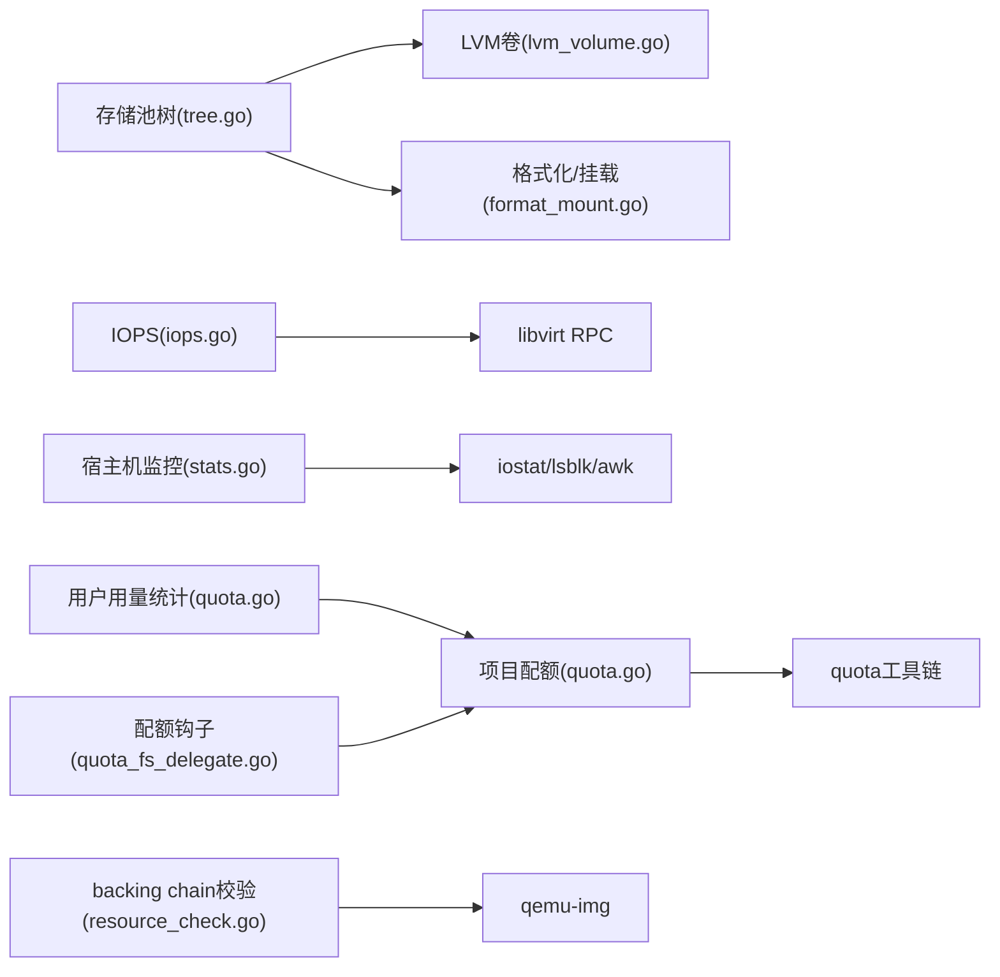

# 存储性能问题排查

<cite>
**本文档引用的文件**
- [iops.go](file://server/service/storage/disk/iops.go)
- [tree.go](file://server/service/storage/pool/tree.go)
- [lvm_volume.go](file://server/service/storage/pool/lvm_volume.go)
- [quota.go](file://server/service/storage/quota/quota.go)
- [quota.go](file://server/service/user/quota.go)
- [quota_fs_delegate.go](file://server/service/quota_fs_delegate.go)
- [stats.go](file://server/service/host/stats.go)
- [resource_check.go](file://server/service/host/resource_check.go)
- [format_mount.go](file://server/service/storage/pool/format_mount.go)
- [detail.vue](file://web/src/views/vm/detail.vue)
</cite>

## 目录
1. [简介](#简介)
2. [项目结构](#项目结构)
3. [核心组件](#核心组件)
4. [架构总览](#架构总览)
5. [详细组件分析](#详细组件分析)
6. [依赖关系分析](#依赖关系分析)
7. [性能考量](#性能考量)
8. [故障排查指南](#故障排查指南)
9. [结论](#结论)
10. [附录](#附录)

## 简介
本指南面向Open虚拟机管理控制台的存储性能问题排查，覆盖磁盘I/O性能监控（读写速度、延迟、吞吐）、存储配额系统（空间统计、限额检查、超限处理）、存储池配置优化（LVM卷管理、文件系统选择与挂载参数）、磁盘故障诊断（坏块检测、文件系统修复、数据完整性校验）以及存储性能优化建议（缓存策略、I/O调度、设备配置）。文档结合代码实现与前端展示，帮助运维与开发人员快速定位与解决存储相关问题。

## 项目结构
围绕存储与性能相关的关键模块分布如下：
- 存储池与LVM：存储池树构建、LVM卷创建与挂载、格式化与卸载
- I/O限速与监控：磁盘IOPS限速、宿主机磁盘IO统计
- 配额系统：Linux项目配额（ext4+prjquota）与用户用量统计
- 故障诊断：磁盘镜像backing chain校验、挂载点清理、文件系统修复
- 前端展示：VM详情页磁盘IOPS显示

**图表来源**
- [tree.go:15-99](file://server/service/storage/pool/tree.go#L15-L99)
- [lvm_volume.go:68-75](file://server/service/storage/pool/lvm_volume.go#L68-L75)
- [format_mount.go:45-85](file://server/service/storage/pool/format_mount.go#L45-L85)
- [iops.go:12-68](file://server/service/storage/disk/iops.go#L12-L68)
- [stats.go:232-264](file://server/service/host/stats.go#L232-L264)
- [quota.go:122-154](file://server/service/storage/quota/quota.go#L122-L154)
- [quota.go:76-85](file://server/service/user/quota.go#L76-L85)
- [quota_fs_delegate.go:58-76](file://server/service/quota_fs_delegate.go#L58-L76)
- [resource_check.go:56-90](file://server/service/host/resource_check.go#L56-L90)
- [detail.vue:563-581](file://web/src/views/vm/detail.vue#L563-L581)

**章节来源**
- [tree.go:15-99](file://server/service/storage/pool/tree.go#L15-L99)
- [lvm_volume.go:68-75](file://server/service/storage/pool/lvm_volume.go#L68-L75)
- [format_mount.go:45-85](file://server/service/storage/pool/format_mount.go#L45-L85)
- [iops.go:12-68](file://server/service/storage/disk/iops.go#L12-L68)
- [stats.go:232-264](file://server/service/host/stats.go#L232-L264)
- [quota.go:122-154](file://server/service/storage/quota/quota.go#L122-L154)
- [quota.go:76-85](file://server/service/user/quota.go#L76-L85)
- [quota_fs_delegate.go:58-76](file://server/service/quota_fs_delegate.go#L58-L76)
- [resource_check.go:56-90](file://server/service/host/resource_check.go#L56-L90)
- [detail.vue:563-581](file://web/src/views/vm/detail.vue#L563-L581)

## 核心组件
- 存储池树与LVM注入：解析lsblk树，合并LVM VG/LV/PV层级，标注挂载点与使用率，过滤不可用节点，确保VM可用存储节点正确识别。
- LVM卷创建：按顺序执行pvcreate→vgcreate→lvcreate→mkfs→mount→写入fstab→持久化配置，支持批量设备与卷组命名校验。
- 磁盘IOPS限速：支持总IOPS与读/写IOPS分别限速，区分开机/关机状态的参数生效范围，XML解析提取iotune配置。
- 宿主机磁盘IO与延迟：通过iostat与lsblk汇总宿主机磁盘IO字节，计算平均等待延迟，辅助定位I/O瓶颈。
- 项目配额系统：基于ext4+prjquota，按用户project ID统计ISO/共享目录用量，repquota查询限额与已用空间，setquota设置硬限制。
- 用户用量统计回退：当项目配额不可用时，回退到du统计用户ISO与共享目录大小。
- 磁盘镜像backing chain校验：解析qemu-img输出，逐项检查链路文件是否存在，保障快照/克隆链完整。
- 前端IOPS展示：在VM详情页展示各磁盘设备的总IOPS、读IOPS、写IOPS及是否受限状态。

**章节来源**
- [tree.go:313-407](file://server/service/storage/pool/tree.go#L313-L407)
- [lvm_volume.go:68-75](file://server/service/storage/pool/lvm_volume.go#L68-L75)
- [iops.go:12-68](file://server/service/storage/disk/iops.go#L12-L68)
- [stats.go:232-264](file://server/service/host/stats.go#L232-L264)
- [quota.go:122-154](file://server/service/storage/quota/quota.go#L122-L154)
- [quota.go:76-85](file://server/service/user/quota.go#L76-L85)
- [resource_check.go:56-90](file://server/service/host/resource_check.go#L56-L90)
- [detail.vue:563-581](file://web/src/views/vm/detail.vue#L563-L581)

## 架构总览
存储子系统围绕“存储池树→LVM卷管理→文件系统挂载→配额统计→I/O限速→监控观测”的闭环工作流展开。前端通过VM详情页直观呈现IOPS限制状态；后端通过libvirt与shell命令实现I/O限速与磁盘统计；配额系统通过内核项目配额在文件系统层面强制限制写入。

**图表来源**
- [detail.vue:563-581](file://web/src/views/vm/detail.vue#L563-L581)
- [iops.go:70-96](file://server/service/storage/disk/iops.go#L70-L96)
- [stats.go:232-264](file://server/service/host/stats.go#L232-L264)
- [quota.go:76-85](file://server/service/user/quota.go#L76-L85)

## 详细组件分析

### 组件A：磁盘I/O性能监控与限速
- 功能要点
  - 设置/查询磁盘IOPS限制，支持总IOPS与读/写IOPS分别限速，XML解析iotune配置。
  - 区分开机/关机状态的参数生效标志位，保证配置持久化与实时生效。
  - 前端VM详情页展示各磁盘设备的IOPS限制状态与数值。
- 关键流程
  - 设置IOPS：校验迁移状态→构造TypedParam→根据状态选择生效标志→调用libvirt RPC。
  - 查询IOPS：获取磁盘块参数→遍历参数字段→填充结构体。
  - 解析XML：逐行扫描disk/iotune标签→提取total/read/write字段→构建映射。

**图表来源**
- [iops.go:19-68](file://server/service/storage/disk/iops.go#L19-L68)
- [iops.go:70-96](file://server/service/storage/disk/iops.go#L70-L96)
- [iops.go:98-163](file://server/service/storage/disk/iops.go#L98-L163)
- [detail.vue:563-581](file://web/src/views/vm/detail.vue#L563-L581)

**章节来源**
- [iops.go:12-68](file://server/service/storage/disk/iops.go#L12-L68)
- [iops.go:70-96](file://server/service/storage/disk/iops.go#L70-L96)
- [iops.go:98-163](file://server/service/storage/disk/iops.go#L98-L163)
- [detail.vue:563-581](file://web/src/views/vm/detail.vue#L563-L581)

### 组件B：存储池配置与LVM优化
- 功能要点
  - 存储池树构建：解析lsblk设备树，应用挂载点使用量，标注系统盘与不可用节点。
  - LVM注入：将VG/LV/PV层级注入树，移除冗余dm-X节点，标记PV引用节点容量为0避免重复统计。
  - LVM卷创建：按顺序执行pvcreate→vgcreate→lvcreate→mkfs→mount→写入fstab→持久化配置。
  - 格式化与挂载：支持卸载残留、擦除文件系统标记、按类型构建mkfs参数、读取UUID等。
- 关键流程
  - LVM注入：构建vg→lv映射→移除lv对应的dm节点→为vg创建合成节点→为lv构建节点→为pv创建引用节点。
  - 卷创建：校验设备与卷组名称→执行一系列命令→写入配置→返回结果。

**图表来源**
- [tree.go:313-407](file://server/service/storage/pool/tree.go#L313-L407)
- [tree.go:409-469](file://server/service/storage/pool/tree.go#L409-L469)
- [lvm_volume.go:68-75](file://server/service/storage/pool/lvm_volume.go#L68-L75)
- [format_mount.go:45-85](file://server/service/storage/pool/format_mount.go#L45-L85)

**章节来源**
- [tree.go:313-407](file://server/service/storage/pool/tree.go#L313-L407)
- [tree.go:409-469](file://server/service/storage/pool/tree.go#L409-L469)
- [lvm_volume.go:68-75](file://server/service/storage/pool/lvm_volume.go#L68-L75)
- [format_mount.go:45-85](file://server/service/storage/pool/format_mount.go#L45-L85)

### 组件C：存储配额系统与监控
- 功能要点
  - 项目配额：ext4+prjquota，按用户UID映射project ID，统一ISO/共享目录用量统计。
  - 限额设置：setquota设置硬限制（KB），支持取消限制与清理/etc/projects与/etc/projid。
  - 用量查询：repquota -Ps查询项目配额，解析已用与硬限制，支持人类可读格式。
  - 工具可用性检查：校验setquota/repquota是否存在，必要时提示安装quota工具。
  - 用户用量统计回退：当项目配额不可用时，使用du统计用户ISO与共享目录大小。
  - 钩子注册：quota_fs_delegate将用户列表钩子注入配额同步流程。
- 关键流程
  - 初始化存储文件系统：创建镜像→ext4+project,quota格式化→挂载loop+prjquota→启用quota。
  - 同步配额：检查工具→确保挂载→拉取用户列表→逐个设置限额→聚合错误。

**图表来源**
- [quota.go:420-452](file://server/service/storage/quota/quota.go#L420-L452)
- [quota.go:318-380](file://server/service/storage/quota/quota.go#L318-L380)
- [quota.go:122-154](file://server/service/storage/quota/quota.go#L122-L154)
- [quota_fs_delegate.go:58-76](file://server/service/quota_fs_delegate.go#L58-L76)

**章节来源**
- [quota.go:122-154](file://server/service/storage/quota/quota.go#L122-L154)
- [quota.go:226-284](file://server/service/storage/quota/quota.go#L226-L284)
- [quota.go:318-380](file://server/service/storage/quota/quota.go#L318-L380)
- [quota.go:420-452](file://server/service/storage/quota/quota.go#L420-L452)
- [quota.go:76-85](file://server/service/user/quota.go#L76-L85)
- [quota_fs_delegate.go:58-76](file://server/service/quota_fs_delegate.go#L58-L76)

### 组件D：磁盘故障诊断与数据完整性
- 功能要点
  - 磁盘镜像backing chain校验：调用qemu-img info --backing-chain --output=json，解析JSON链，逐项检查链文件是否存在。
  - 卸载与清理：支持多轮umount重试、按设备路径卸载、残留检测与报错。
  - 文件系统修复：在Windows磁盘扩容场景中，通过ntfsclone/ntfsfix修复与扩展NTFS文件系统。
- 关键流程
  - backing chain校验：执行命令→解析JSON→遍历链→检查文件存在性→返回错误或成功。
  - 卸载清理：读取/proc/mounts→循环umount→失败则fuser -km→按设备路径umount→最终残留检测。

**图表来源**
- [resource_check.go:56-90](file://server/service/host/resource_check.go#L56-L90)

**章节来源**
- [resource_check.go:56-90](file://server/service/host/resource_check.go#L56-L90)
- [format_mount.go:45-85](file://server/service/storage/pool/format_mount.go#L45-L85)

## 依赖关系分析
- 组件耦合
  - 存储池树与LVM注入依赖lsblk/findmnt/df输出与数据库配置映射，确保节点ID规范化与挂载点一致性。
  - I/O限速依赖libvirt RPC与VM运行状态，XML解析与参数构造相互独立。
  - 配额系统依赖quota工具链与ext4+prjquota特性，用量统计可回退至du。
  - 宿主机监控依赖iostat/lsblk/awk等系统命令，与存储池树无直接耦合。
- 外部依赖
  - libvirt：设置/获取磁盘块参数。
  - shell命令：qemu-img、iostat、lsblk、findmnt、df、mkfs、mount、umount、setquota、repquota、quotaon等。
- 循环依赖规避
  - 配额系统通过函数变量钩子注入用户列表，避免服务层与配额层直接导入导致循环。

**图表来源**
- [tree.go:15-99](file://server/service/storage/pool/tree.go#L15-L99)
- [lvm_volume.go:68-75](file://server/service/storage/pool/lvm_volume.go#L68-L75)
- [format_mount.go:45-85](file://server/service/storage/pool/format_mount.go#L45-L85)
- [iops.go:19-68](file://server/service/storage/disk/iops.go#L19-L68)
- [stats.go:232-264](file://server/service/host/stats.go#L232-L264)
- [quota.go:122-154](file://server/service/storage/quota/quota.go#L122-L154)
- [quota.go:76-85](file://server/service/user/quota.go#L76-L85)
- [quota_fs_delegate.go:58-76](file://server/service/quota_fs_delegate.go#L58-L76)
- [resource_check.go:56-90](file://server/service/host/resource_check.go#L56-L90)

**章节来源**
- [tree.go:15-99](file://server/service/storage/pool/tree.go#L15-L99)
- [lvm_volume.go:68-75](file://server/service/storage/pool/lvm_volume.go#L68-L75)
- [format_mount.go:45-85](file://server/service/storage/pool/format_mount.go#L45-L85)
- [iops.go:19-68](file://server/service/storage/disk/iops.go#L19-L68)
- [stats.go:232-264](file://server/service/host/stats.go#L232-L264)
- [quota.go:122-154](file://server/service/storage/quota/quota.go#L122-L154)
- [quota.go:76-85](file://server/service/user/quota.go#L76-L85)
- [quota_fs_delegate.go:58-76](file://server/service/quota_fs_delegate.go#L58-L76)
- [resource_check.go:56-90](file://server/service/host/resource_check.go#L56-L90)

## 性能考量
- I/O限速策略
  - 在高并发场景下，优先使用总IOPS限制，避免读/写IOPS叠加导致误判；仅在需要精细化控制时启用读/写分离限速。
  - 对于热数据盘，适当提高IOPS上限并结合缓存策略；对于冷数据盘，降低IOPS限制以减少争抢。
- 文件系统与挂载参数
  - ext4+prjquota适合多租户配额统计；挂载参数建议启用异步提交与延迟刷新，平衡性能与可靠性。
  - 对于SSD，可考虑关闭barrier或使用noatime减少元数据写放大；对HDD，适度增大io_scheduler队列深度。
- LVM与卷管理
  - LV striping可提升顺序吞吐，但会增加随机写开销；建议根据业务模式选择linear或striped。
  - VG扩展时尽量保持PE大小一致，避免碎片化；定期检查PV使用率，避免单盘过载。
- 宿主机监控
  - 使用iostat 1秒采样观察r_await与w_await，结合lsblk累计扇区变化评估吞吐与延迟趋势。
  - 对于多盘阵列，关注每块盘的负载均衡，避免热点。

[本节为通用指导，无需具体文件分析]

## 故障排查指南
- 磁盘I/O性能异常
  - 步骤：确认VM是否处于运行态→查看IOPS限制是否设置→对比宿主机iostat延迟与吞吐→检查存储池树中对应设备是否被正确识别。
  - 关联文件：[iops.go:19-68](file://server/service/storage/disk/iops.go#L19-L68)、[stats.go:232-264](file://server/service/host/stats.go#L232-L264)、[tree.go:182-187](file://server/service/storage/pool/tree.go#L182-L187)
- 存储配额超限
  - 步骤：检查quota工具是否可用→确认项目配额是否启用→repquota查询用户用量→若不可用则回退到du统计→调整限额或清理空间。
  - 关联文件：[quota.go:411-418](file://server/service/storage/quota/quota.go#L411-L418)、[quota.go:226-284](file://server/service/storage/quota/quota.go#L226-L284)、[quota.go:76-85](file://server/service/user/quota.go#L76-L85)
- 磁盘镜像链损坏
  - 步骤：执行qemu-img info --backing-chain --output=json→解析JSON→逐项检查链文件是否存在→定位缺失文件并恢复。
  - 关联文件：[resource_check.go:56-90](file://server/service/host/resource_check.go#L56-L90)
- 卸载失败或残留
  - 步骤：fuser -km杀进程→umount重试→按设备路径umount→最后残留检测与报错。
  - 关联文件：[format_mount.go:45-85](file://server/service/storage/pool/format_mount.go#L45-L85)
- 前端IOPS显示异常
  - 步骤：确认VM磁盘IOPS限制是否设置→检查XML中iotune配置→核对前端渲染逻辑。
  - 关联文件：[iops.go:98-163](file://server/service/storage/disk/iops.go#L98-L163)、[detail.vue:563-581](file://web/src/views/vm/detail.vue#L563-L581)

**章节来源**
- [iops.go:19-68](file://server/service/storage/disk/iops.go#L19-L68)
- [stats.go:232-264](file://server/service/host/stats.go#L232-L264)
- [tree.go:182-187](file://server/service/storage/pool/tree.go#L182-L187)
- [quota.go:411-418](file://server/service/storage/quota/quota.go#L411-L418)
- [quota.go:226-284](file://server/service/storage/quota/quota.go#L226-L284)
- [quota.go:76-85](file://server/service/user/quota.go#L76-L85)
- [resource_check.go:56-90](file://server/service/host/resource_check.go#L56-L90)
- [format_mount.go:45-85](file://server/service/storage/pool/format_mount.go#L45-L85)
- [detail.vue:563-581](file://web/src/views/vm/detail.vue#L563-L581)

## 结论
通过将存储池树、LVM卷管理、项目配额与I/O限速有机结合，并辅以宿主机监控与磁盘镜像链校验，Open虚拟机管理控制台能够有效支撑大规模多租户环境下的存储性能与稳定性。建议在生产环境中：
- 明确I/O限速策略并结合业务类型动态调整；
- 采用ext4+prjquota进行配额统计，定期同步限额；
- 优化LVM布局与文件系统挂载参数，平衡吞吐与可靠性；
- 建立自动化监控与告警机制，及时发现并处置I/O瓶颈与配额风险。

[本节为总结性内容，无需具体文件分析]

## 附录
- 快速检查清单
  - I/O限速：确认VM磁盘IOPS限制设置与生效标志；前端IOPS显示正常。
  - 配额：quota工具可用；项目配额启用；repquota用量正确；用户用量统计回退正常。
  - 存储池：LSBLK树正确；LVM层级注入无冗余；挂载点与使用量准确。
  - 宿主机：iostat延迟与吞吐稳定；lsblk累计IO字节可追踪。
  - 磁盘链：qemu-img backing chain完整；链文件均存在。

[本节为补充性内容，无需具体文件分析]