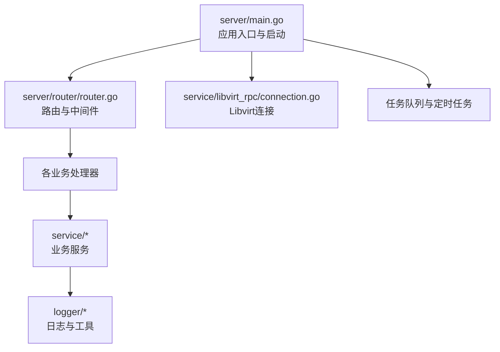
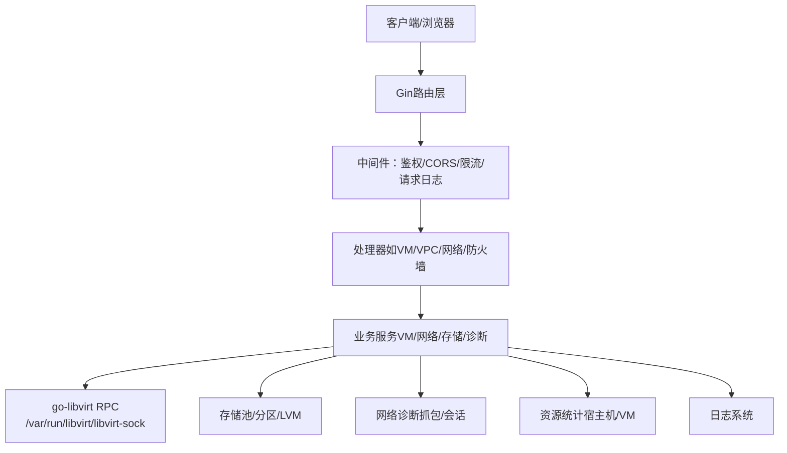
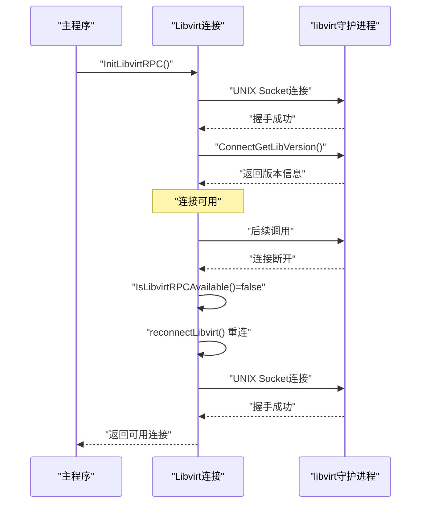
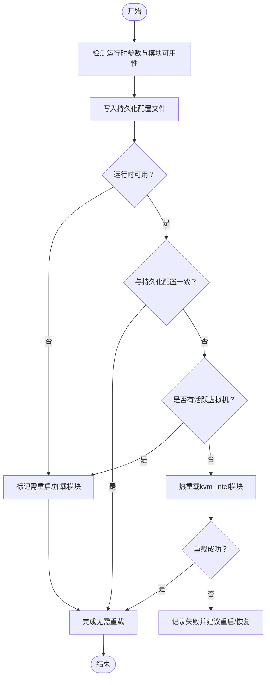
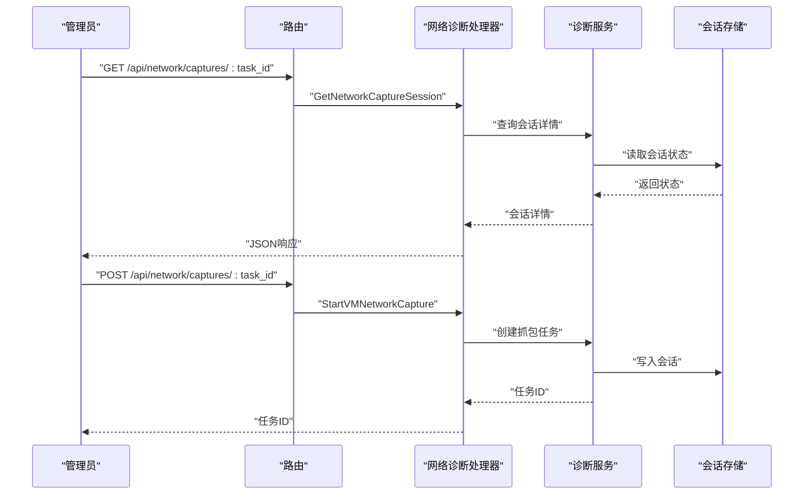
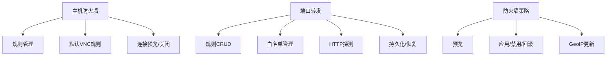
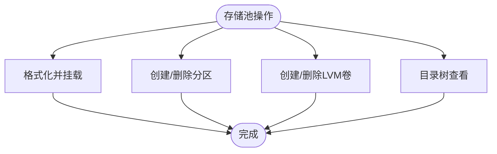
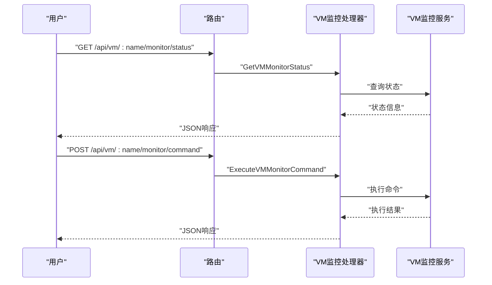
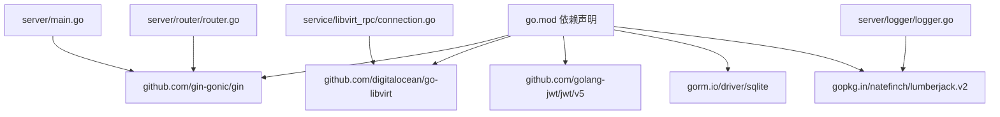

# 故障排除

<cite>
**本文档引用的文件**
- [server/main.go](file://server/main.go)
- [server/go.mod](file://server/go.mod)
- [server/router/router.go](file://server/router/router.go)
- [server/service/kvm_module.go](file://server/service/kvm_module.go)
- [server/service/libvirt_rpc/connection.go](file://server/service/libvirt_rpc/connection.go)
- [server/handler/vm_monitor.go](file://server/handler/vm_monitor.go)
- [server/handler/network_diagnostics.go](file://server/handler/network_diagnostics.go)
- [server/service/network/diagnostics/types.go](file://server/service/network/diagnostics/types.go)
- [server/service/network/diagnostics/session_store.go](file://server/service/network/diagnostics/session_store.go)
- [server/service/network/diagnostics/capture.go](file://server/service/network/diagnostics/capture.go)
- [server/service/firewall/host.go](file://server/service/firewall/host.go)
- [server/service/firewall/host_rules.go](file://server/service/firewall/host_rules.go)
- [server/service/firewall/host_portfwd.go](file://server/service/firewall/host_portfwd.go)
- [server/service/storage/pool/format_mount.go](file://server/service/storage/pool/format_mount.go)
- [server/service/storage/pool/tree.go](file://server/service/storage/pool/tree.go)
- [server/service/host/resource_check.go](file://server/service/host/resource_check.go)
- [server/service/host/stats_collector.go](file://server/service/host/stats_collector.go)
- [server/service/vm/stats.go](file://server/service/vm/stats.go)
- [server/logger/logger.go](file://server/logger/logger.go)
- [server/middleware/request_logger.go](file://server/middleware/request_logger.go)
- [server/middleware/ratelimit.go](file://server/middleware/ratelimit.go)
</cite>

## 目录
1. [简介](#简介)
2. [项目结构](#项目结构)
3. [核心组件](#核心组件)
4. [架构总览](#架构总览)
5. [详细组件分析](#详细组件分析)
6. [依赖关系分析](#依赖关系分析)
7. [性能考虑](#性能考虑)
8. [故障排除指南](#故障排除指南)
9. [结论](#结论)
10. [附录](#附录)

## 简介
本指南面向Open虚拟机管理控制台的运维与开发人员，聚焦于常见问题的诊断与解决，涵盖虚拟机启动失败、网络连接异常、存储访问问题、性能瓶颈、虚拟化相关问题（KVM模块、Libvirt连接、QEMU进程）、网络诊断（防火墙、端口转发、DNS）、以及系统维护与修复最佳实践。文档结合代码实现，提供可操作的排障步骤与可视化流程图。

## 项目结构
后端采用Go语言，基于Gin框架提供REST API，并通过go-libvirt与本地libvirt进行通信。系统包含以下关键层次：
- 入口与启动：主程序负责初始化配置、日志、数据库、Libvirt连接、任务队列与定时任务，随后启动HTTP服务。
- 路由与中间件：统一注册API分组与鉴权、CORS、限流等中间件。
- 业务服务层：虚拟机生命周期、网络、存储、防火墙、诊断、统计等子域服务。
- 工具与日志：命令执行、日志轮转与输出、请求追踪与速率限制。

图表来源
- [server/main.go:31-128](file://server/main.go#L31-L128)
- [server/router/router.go:18-485](file://server/router/router.go#L18-L485)
- [server/service/libvirt_rpc/connection.go:20-98](file://server/service/libvirt_rpc/connection.go#L20-L98)

章节来源
- [server/main.go:31-128](file://server/main.go#L31-L128)
- [server/router/router.go:18-485](file://server/router/router.go#L18-L485)

## 核心组件
- 启动与初始化：配置加载、日志系统、数据库、Libvirt连接、任务队列、定时任务、网络恢复与路由注册。
- 路由与中间件：全局CORS、限流、请求日志、鉴权与权限控制。
- Libvirt RPC：连接建立、健康检查、自动重连与可用性检测。
- KVM模块管理：Intel KVM unrestricted guest状态检测与切换。
- 网络诊断：抓包会话管理、下载与清理、VM网络诊断入口。
- 防火墙与端口转发：主机防火墙规则、端口转发策略与预览。
- 存储池：格式化挂载、分区管理、LVM卷管理。
- 统计与监控：宿主机与虚拟机资源采集、历史数据查询。

章节来源
- [server/main.go:39-128](file://server/main.go#L39-L128)
- [server/router/router.go:18-485](file://server/router/router.go#L18-L485)
- [server/service/libvirt_rpc/connection.go:20-98](file://server/service/libvirt_rpc/connection.go#L20-L98)
- [server/service/kvm_module.go:12-241](file://server/service/kvm_module.go#L12-L241)

## 架构总览
下图展示从客户端请求到后端处理、Libvirt交互与系统资源的状态流转。

图表来源
- [server/router/router.go:18-485](file://server/router/router.go#L18-L485)
- [server/service/libvirt_rpc/connection.go:14-18](file://server/service/libvirt_rpc/connection.go#L14-L18)
- [server/logger/logger.go](file://server/logger/logger.go)

## 详细组件分析

### Libvirt连接与重连机制
- 初始化：启动阶段必须成功建立到本地libvirt的UNIX Socket连接，并验证版本。
- 运行期：提供可用性检测与自动重连，最多三次指数退避重试。
- 降级策略：当RPC不可用时，调用方可回退至virsh命令方式。

图表来源
- [server/service/libvirt_rpc/connection.go:20-121](file://server/service/libvirt_rpc/connection.go#L20-L121)

章节来源
- [server/service/libvirt_rpc/connection.go:20-121](file://server/service/libvirt_rpc/connection.go#L20-L121)
- [server/main.go:67-71](file://server/main.go#L67-L71)

### KVM模块状态与切换
- 状态检测：读取内核参数、持久化配置、活跃VM数量与是否可运行时切换。
- 切换流程：写入modprobe配置 → 若运行时可用且无活跃VM则热重载 → 失败时提示重启或恢复模块。
- 适用场景：启用/禁用Intel KVM unrestricted guest兼容模式。

图表来源
- [server/service/kvm_module.go:109-240](file://server/service/kvm_module.go#L109-L240)

章节来源
- [server/service/kvm_module.go:109-240](file://server/service/kvm_module.go#L109-L240)

### 网络诊断与抓包
- 抓包会话：创建、查询、下载、删除抓包任务，支持按任务ID管理。
- 诊断入口：VM网络诊断API，便于定位网络问题。
- 会话存储：抓包会话的生命周期管理与状态维护。

图表来源
- [server/router/router.go:282-286](file://server/router/router.go#L282-L286)
- [server/handler/network_diagnostics.go](file://server/handler/network_diagnostics.go)
- [server/service/network/diagnostics/session_store.go](file://server/service/network/diagnostics/session_store.go)
- [server/service/network/diagnostics/capture.go](file://server/service/network/diagnostics/capture.go)

章节来源
- [server/router/router.go:282-286](file://server/router/router.go#L282-L286)
- [server/service/network/diagnostics/types.go](file://server/service/network/diagnostics/types.go)
- [server/service/network/diagnostics/session_store.go](file://server/service/network/diagnostics/session_store.go)
- [server/service/network/diagnostics/capture.go](file://server/service/network/diagnostics/capture.go)

### 防火墙与端口转发
- 主机防火墙：状态查询、规则增删改查、默认VNC规则、连接预览与关闭。
- 端口转发：规则列表、增删改、批量删除、白名单、HTTP探测、持久化与恢复。
- 策略应用：防火墙策略预览与应用，GeoIP更新。

图表来源
- [server/router/router.go:308-333](file://server/router/router.go#L308-L333)
- [server/service/firewall/host.go](file://server/service/firewall/host.go)
- [server/service/firewall/host_rules.go](file://server/service/firewall/host_rules.go)
- [server/service/firewall/host_portfwd.go](file://server/service/firewall/host_portfwd.go)

章节来源
- [server/router/router.go:308-333](file://server/router/router.go#L308-L333)
- [server/service/firewall/host.go](file://server/service/firewall/host.go)
- [server/service/firewall/host_rules.go](file://server/service/firewall/host_rules.go)
- [server/service/firewall/host_portfwd.go](file://server/service/firewall/host_portfwd.go)

### 存储池与磁盘管理
- 格式化与挂载：对存储池设备进行格式化与挂载，支持进度回调。
- 分区管理：创建/删除分区，支持指定大小。
- LVM卷：创建/删除逻辑卷，支持进度回调。
- 目录树：存储池目录结构展示与辅助工具。

图表来源
- [server/router/router.go:346-362](file://server/router/router.go#L346-L362)
- [server/service/storage/pool/format_mount.go](file://server/service/storage/pool/format_mount.go)
- [server/service/storage/pool/tree.go](file://server/service/storage/pool/tree.go)

章节来源
- [server/router/router.go:346-362](file://server/router/router.go#L346-L362)
- [server/service/storage/pool/format_mount.go](file://server/service/storage/pool/format_mount.go)
- [server/service/storage/pool/tree.go](file://server/service/storage/pool/tree.go)

### 虚拟机监控与QEMU Monitor
- 监控状态：查询虚拟机监控器状态。
- 命令执行：安全地执行QEMU Monitor命令（普通用户仅开放安全子集）。

图表来源
- [server/router/router.go:181-184](file://server/router/router.go#L181-L184)
- [server/handler/vm_monitor.go:16-77](file://server/handler/vm_monitor.go#L16-L77)

章节来源
- [server/router/router.go:181-184](file://server/router/router.go#L181-L184)
- [server/handler/vm_monitor.go:16-77](file://server/handler/vm_monitor.go#L16-L77)

## 依赖关系分析
- 运行时依赖：go-libvirt、Gin、JWT、WebSocket、SQLite ORM等。
- 关键耦合点：路由与处理器、处理器与服务、服务与Libvirt、服务与日志/工具模块。

图表来源
- [server/go.mod:5-15](file://server/go.mod#L5-L15)
- [server/main.go:3-25](file://server/main.go#L3-L25)
- [server/router/router.go:3-16](file://server/router/router.go#L3-L16)
- [server/service/libvirt_rpc/connection.go:3-12](file://server/service/libvirt_rpc/connection.go#L3-L12)
- [server/logger/logger.go](file://server/logger/logger.go)

章节来源
- [server/go.mod:5-15](file://server/go.mod#L5-L15)
- [server/main.go:3-25](file://server/main.go#L3-L25)

## 性能考虑
- 资源采集：后台定时采集宿主机与虚拟机统计信息，支持历史查询。
- 统计接口：提供SSE与历史数据接口，便于前端实时展示。
- 中间件：请求日志与限流中间件有助于观察系统负载与异常流量。

章节来源
- [server/service/host/stats_collector.go](file://server/service/host/stats_collector.go)
- [server/service/vm/stats.go](file://server/service/vm/stats.go)
- [server/router/router.go:433-451](file://server/router/router.go#L433-L451)
- [server/middleware/request_logger.go](file://server/middleware/request_logger.go)
- [server/middleware/ratelimit.go](file://server/middleware/ratelimit.go)

## 故障排除指南

### 一、虚拟机启动失败
- 排查步骤
  1) 检查Libvirt连接状态与可用性，若RPC不可用，回退到virsh命令方式。
  2) 查看虚拟机监控器状态与命令执行能力，确认QEMU Monitor可用。
  3) 检查宿主机资源（CPU/内存/磁盘I/O），确认无资源瓶颈。
  4) 核对KVM模块状态，必要时切换unrestricted guest参数并重启生效。
- 相关接口与实现
  - Libvirt连接与重连：[server/service/libvirt_rpc/connection.go:20-121](file://server/service/libvirt_rpc/connection.go#L20-L121)
  - VM监控状态与命令：[server/router/router.go:181-184](file://server/router/router.go#L181-184), [server/handler/vm_monitor.go:16-77](file://server/handler/vm_monitor.go#L16-77)
  - 资源统计：[server/service/host/stats_collector.go](file://server/service/host/stats_collector.go), [server/service/vm/stats.go](file://server/service/vm/stats.go)

章节来源
- [server/service/libvirt_rpc/connection.go:20-121](file://server/service/libvirt_rpc/connection.go#L20-L121)
- [server/handler/vm_monitor.go:16-77](file://server/handler/vm_monitor.go#L16-L77)
- [server/service/host/stats_collector.go](file://server/service/host/stats_collector.go)
- [server/service/vm/stats.go](file://server/service/vm/stats.go)

### 二、网络连接问题
- 排查步骤
  1) 使用网络诊断API创建抓包任务，下载并分析抓包文件。
  2) 检查主机防火墙状态与规则，预览并应用策略。
  3) 核查端口转发规则、白名单与HTTP探测状态。
  4) 对比VPC安全组与ACL策略，确认规则一致性。
- 相关接口与实现
  - 抓包会话管理：[server/router/router.go:282-286](file://server/router/router.go#L282-286)
  - 防火墙与端口转发：[server/router/router.go:308-333](file://server/router/router.go#L308-333), [server/service/firewall/host.go](file://server/service/firewall/host.go), [server/service/firewall/host_portfwd.go](file://server/service/firewall/host_portfwd.go)
  - VPC与安全组：[server/router/router.go:288-306](file://server/router/router.go#L288-306)

章节来源
- [server/router/router.go:282-286](file://server/router/router.go#L282-L286)
- [server/router/router.go:308-333](file://server/router/router.go#L308-L333)
- [server/router/router.go:288-306](file://server/router/router.go#L288-L306)
- [server/service/firewall/host.go](file://server/service/firewall/host.go)
- [server/service/firewall/host_portfwd.go](file://server/service/firewall/host_portfwd.go)

### 三、存储访问异常
- 排查步骤
  1) 检查存储池格式化与挂载状态，确认文件系统类型与挂载点。
  2) 核对分区创建/删除任务，确认目标设备ID与大小。
  3) 检查LVM卷创建/删除任务，确认VG/LV名称与状态。
  4) 查看存储池目录树，定位文件路径与权限问题。
- 相关接口与实现
  - 存储池管理：[server/router/router.go:346-362](file://server/router/router.go#L346-362)
  - 格式化与挂载：[server/service/storage/pool/format_mount.go](file://server/service/storage/pool/format_mount.go)
  - 分区管理：[server/service/storage/pool/tree.go](file://server/service/storage/pool/tree.go)

章节来源
- [server/router/router.go:346-362](file://server/router/router.go#L346-L362)
- [server/service/storage/pool/format_mount.go](file://server/service/storage/pool/format_mount.go)
- [server/service/storage/pool/tree.go](file://server/service/storage/pool/tree.go)

### 四、性能问题排查
- CPU使用率过高
  - 使用宿主机统计接口查看CPU利用率与负载，结合任务队列与定时任务观察热点。
  - 检查是否存在大量并发任务导致CPU争用。
- 内存泄漏
  - 结合宿主机与虚拟机内存统计，观察趋势变化；排查长时间运行的任务与缓存。
- 磁盘I/O瓶颈
  - 通过VM磁盘IOPS设置与监控，定位高I/O负载的虚拟机与磁盘设备。
  - 检查存储池格式化与挂载状态，避免文件系统层面的性能问题。
- 相关接口与实现
  - 宿主机统计：[server/router/router.go:433-451](file://server/router/router.go#L433-451), [server/service/host/stats_collector.go](file://server/service/host/stats_collector.go)
  - VM统计：[server/router/router.go:119-122](file://server/router/router.go#L119-122), [server/service/vm/stats.go](file://server/service/vm/stats.go)
  - 磁盘IOPS：[server/router/router.go:195-196](file://server/router/router.go#L195-196)

章节来源
- [server/router/router.go:433-451](file://server/router/router.go#L433-L451)
- [server/router/router.go:119-122](file://server/router/router.go#L119-L122)
- [server/router/router.go:195-196](file://server/router/router.go#L195-L196)
- [server/service/host/stats_collector.go](file://server/service/host/stats_collector.go)
- [server/service/vm/stats.go](file://server/service/vm/stats.go)

### 五、虚拟化相关问题
- KVM模块加载
  - 检查运行时参数与模块可用性，若无活跃VM可热重载；否则建议重启。
  - 若模块被占用，先关闭所有虚拟机再重试。
- Libvirt连接
  - 启动阶段必须成功连接UNIX Socket；运行期自动重连，失败时回退到virsh。
- QEMU进程管理
  - 通过VM监控状态与命令接口进行安全的管理操作。
- 相关接口与实现
  - KVM模块：[server/service/kvm_module.go:109-240](file://server/service/kvm_module.go#L109-240)
  - Libvirt连接：[server/service/libvirt_rpc/connection.go:20-121](file://server/service/libvirt_rpc/connection.go#L20-121)
  - VM监控：[server/handler/vm_monitor.go:16-77](file://server/handler/vm_monitor.go#L16-77)

章节来源
- [server/service/kvm_module.go:109-240](file://server/service/kvm_module.go#L109-L240)
- [server/service/libvirt_rpc/connection.go:20-121](file://server/service/libvirt_rpc/connection.go#L20-L121)
- [server/handler/vm_monitor.go:16-77](file://server/handler/vm_monitor.go#L16-L77)

### 六、网络连接问题诊断技巧
- 防火墙配置
  - 使用主机防火墙状态查询与规则管理，预览变更后再应用。
- 端口转发
  - 检查规则列表、白名单、HTTP探测与持久化状态，确保规则一致。
- DNS解析
  - 通过网络诊断与抓包定位DNS查询路径与响应时间。
- 相关接口与实现
  - 防火墙与端口转发：[server/router/router.go:308-333](file://server/router/router.go#L308-333), [server/service/firewall/host.go](file://server/service/firewall/host.go), [server/service/firewall/host_portfwd.go](file://server/service/firewall/host_portfwd.go)
  - 抓包与诊断：[server/router/router.go:282-286](file://server/router/router.go#L282-286)

章节来源
- [server/router/router.go:308-333](file://server/router/router.go#L308-L333)
- [server/router/router.go:282-286](file://server/router/router.go#L282-L286)
- [server/service/firewall/host.go](file://server/service/firewall/host.go)
- [server/service/firewall/host_portfwd.go](file://server/service/firewall/host_portfwd.go)

### 七、系统维护与修复最佳实践
- 日志管理
  - 使用日志轮转与导出功能，定期清理过期日志，保留关键信息。
- 请求追踪
  - 启用请求日志中间件，结合限流策略观察异常请求与攻击行为。
- 安全初始化
  - 管理员可跳过安全初始化流程，但需确保后续安全策略到位。
- 相关接口与实现
  - 日志管理：[server/router/router.go:98-101](file://server/router/router.go#L98-101)
  - 请求日志与限流：[server/middleware/request_logger.go](file://server/middleware/request_logger.go), [server/middleware/ratelimit.go](file://server/middleware/ratelimit.go)

章节来源
- [server/router/router.go:98-101](file://server/router/router.go#L98-L101)
- [server/middleware/request_logger.go](file://server/middleware/request_logger.go)
- [server/middleware/ratelimit.go](file://server/middleware/ratelimit.go)

## 结论
本指南基于代码实现总结了Open虚拟机管理控制台的故障排除方法，覆盖虚拟化、网络、存储与性能等关键领域。建议在日常运维中结合日志、抓包与统计接口进行综合诊断，并遵循最小化变更与回滚策略，确保系统稳定运行。

## 附录
- 快速参考
  - 启动与连接：[server/main.go:31-128](file://server/main.go#L31-L128), [server/service/libvirt_rpc/connection.go:20-98](file://server/service/libvirt_rpc/connection.go#L20-L98)
  - 网络诊断：[server/router/router.go:282-286](file://server/router/router.go#L282-286)
  - 防火墙与端口转发：[server/router/router.go:308-333](file://server/router/router.go#L308-333)
  - 存储池：[server/router/router.go:346-362](file://server/router/router.go#L346-362)
  - 资源统计：[server/router/router.go:433-451](file://server/router/router.go#L433-451)