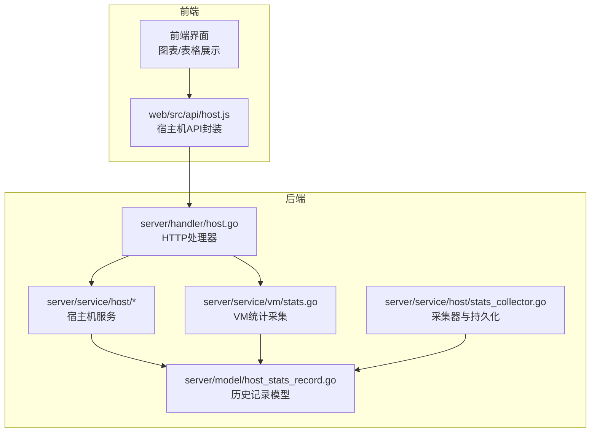
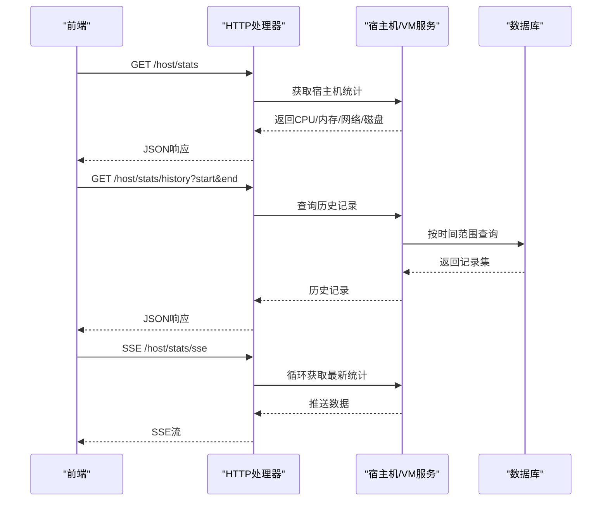
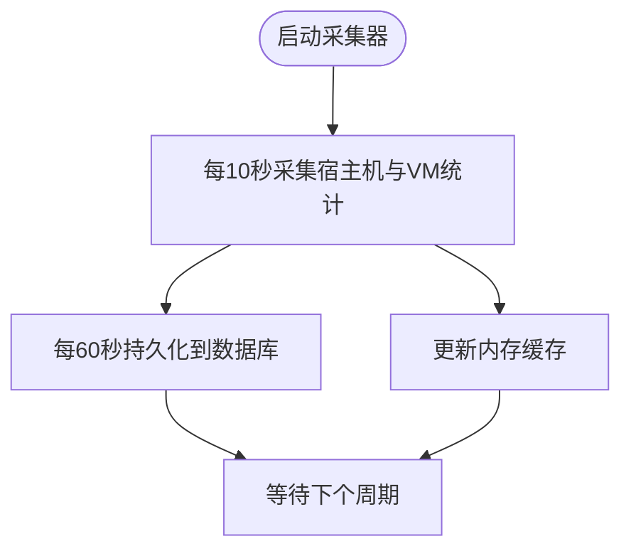
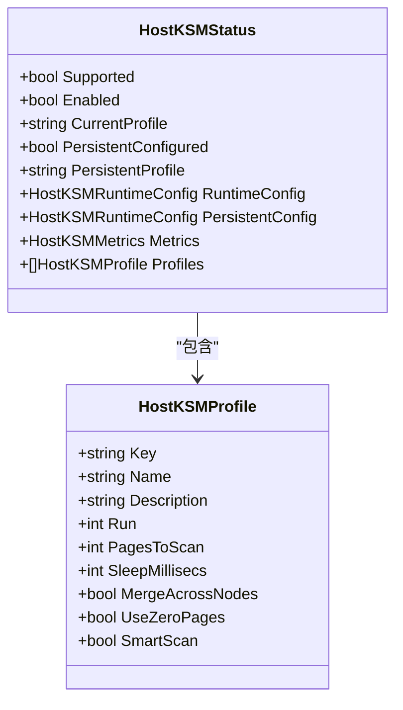
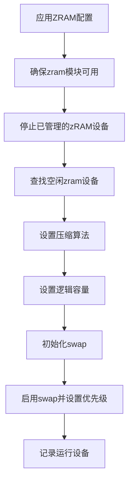
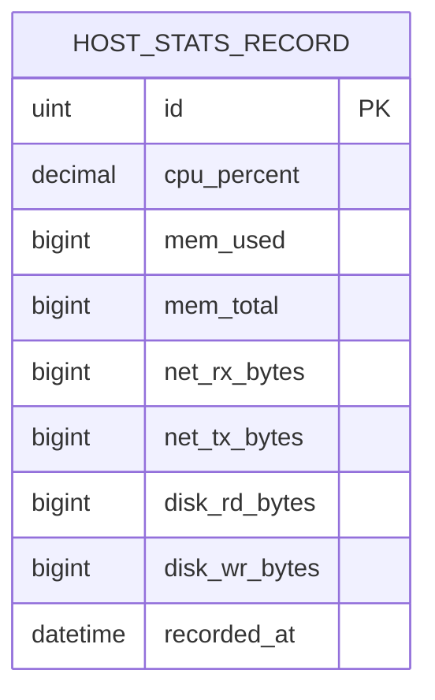
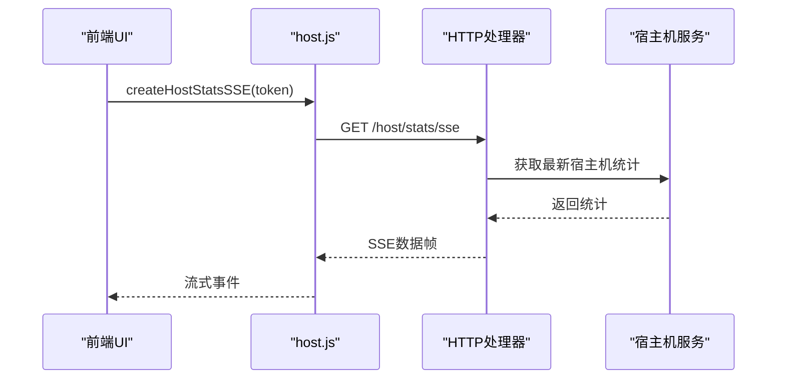
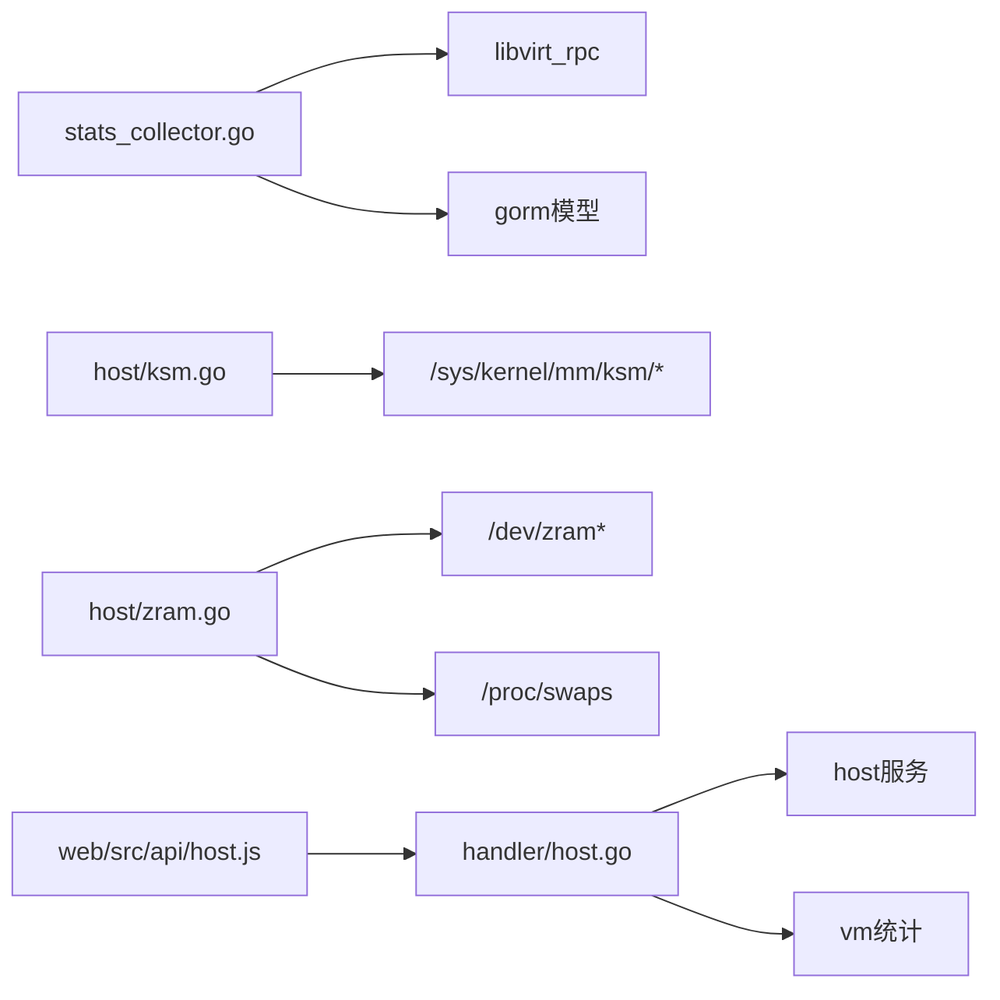

# 系统性能问题排查

<cite>
**本文引用的文件**
- [server/service/host/stats_collector.go](file://server/service/host/stats_collector.go)
- [server/service/host/ksm.go](file://server/service/host/ksm.go)
- [server/service/host/zram.go](file://server/service/host/zram.go)
- [server/handler/host.go](file://server/handler/host.go)
- [web/src/api/host.js](file://web/src/api/host.js)
- [server/model/host_stats_record.go](file://server/model/host_stats_record.go)
- [server/service/vm/stats.go](file://server/service/vm/stats.go)
- [server/config/config.go](file://server/config/config.go)
- [install.sh](file://install.sh)
</cite>

## 目录
1. [简介](#简介)
2. [项目结构](#项目结构)
3. [核心组件](#核心组件)
4. [架构总览](#架构总览)
5. [详细组件分析](#详细组件分析)
6. [依赖分析](#依赖分析)
7. [性能考虑](#性能考虑)
8. [故障排查指南](#故障排查指南)
9. [结论](#结论)
10. [附录](#附录)

## 简介
本指南面向Open虚拟机管理控制台的系统性能问题排查与优化，围绕以下目标展开：
- 系统资源监控方法：CPU使用率分析、内存占用检查、磁盘空间监控
- 主机统计收集机制：性能数据采集、历史记录分析、趋势预测
- 内存优化技术：KSM压缩、ZRAM交换、内存碎片整理
- 系统负载分析：进程分析、资源竞争检测、瓶颈识别
- 系统性能优化建议：内核参数调优、服务配置优化、硬件资源合理分配

## 项目结构
Open控制台采用前后端分离架构，后端基于Go语言实现，前端基于Vue生态。性能监控与优化主要集中在后端服务层，涉及宿主机资源采集、历史记录存储、内存优化策略（KSM/ZRAM）以及前端SSE实时推送。

**图示来源**
- [server/handler/host.go:1-304](file://server/handler/host.go#L1-L304)
- [server/service/host/stats_collector.go:1-366](file://server/service/host/stats_collector.go#L1-L366)
- [server/service/vm/stats.go:232-264](file://server/service/vm/stats.go#L232-L264)
- [server/model/host_stats_record.go:1-16](file://server/model/host_stats_record.go#L1-L16)
- [web/src/api/host.js:1-35](file://web/src/api/host.js#L1-L35)

**章节来源**
- [server/handler/host.go:1-304](file://server/handler/host.go#L1-L304)
- [server/service/host/stats_collector.go:1-366](file://server/service/host/stats_collector.go#L1-L366)
- [server/service/vm/stats.go:232-264](file://server/service/vm/stats.go#L232-L264)
- [server/model/host_stats_record.go:1-16](file://server/model/host_stats_record.go#L1-L16)
- [web/src/api/host.js:1-35](file://web/src/api/host.js#L1-L35)

## 核心组件
- 宿主机统计采集器：周期性采集宿主机CPU、内存、网络、磁盘等指标，并缓存与持久化
- 宿主机KSM服务：提供KSM参数读取、应用、持久化与状态检测
- 宿主机ZRAM服务：提供zRAM设备创建、算法选择、优先级设置与状态检测
- 历史记录模型：定义宿主机资源历史记录的数据结构，支持按时间范围查询
- 前端SSE推送：通过EventSource持续推送宿主机实时统计
- VM统计采集：补充VM层面的CPU、内存、网络、磁盘统计，用于综合负载分析

**章节来源**
- [server/service/host/stats_collector.go:34-73](file://server/service/host/stats_collector.go#L34-L73)
- [server/service/host/ksm.go:350-387](file://server/service/host/ksm.go#L350-L387)
- [server/service/host/zram.go:724-761](file://server/service/host/zram.go#L724-L761)
- [server/model/host_stats_record.go:5-16](file://server/model/host_stats_record.go#L5-L16)
- [web/src/api/host.js:32-35](file://web/src/api/host.js#L32-L35)
- [server/service/vm/stats.go:232-264](file://server/service/vm/stats.go#L232-L264)

## 架构总览
后端通过采集器定时拉取宿主机与VM的资源数据，写入内存缓存并定期持久化至数据库；前端通过REST API与SSE订阅获取实时与历史数据，支撑可视化与告警。

**图示来源**
- [server/handler/host.go:26-42](file://server/handler/host.go#L26-L42)
- [server/handler/host.go:167-227](file://server/handler/host.go#L167-L227)
- [server/handler/host.go:247-285](file://server/handler/host.go#L247-L285)
- [server/service/host/stats_collector.go:259-306](file://server/service/host/stats_collector.go#L259-L306)
- [server/model/host_stats_record.go:5-16](file://server/model/host_stats_record.go#L5-L16)

## 详细组件分析

### 宿主机统计采集器
- 采集频率：每10秒采集一次运行中VM与宿主机统计，每60秒持久化一次
- 缓存策略：内存缓存VM统计数据，宿主机统计单独缓存，避免频繁IO
- 数据持久化：将缓存快照写入数据库，支持历史查询与趋势分析
- 运行态同步：结合活跃VM集合，同步用户与轻量化VM配额状态

**图示来源**
- [server/service/host/stats_collector.go:34-73](file://server/service/host/stats_collector.go#L34-L73)
- [server/service/host/stats_collector.go:259-306](file://server/service/host/stats_collector.go#L259-L306)

**章节来源**
- [server/service/host/stats_collector.go:34-73](file://server/service/host/stats_collector.go#L34-L73)
- [server/service/host/stats_collector.go:259-306](file://server/service/host/stats_collector.go#L259-L306)

### 宿主机KSM服务
- 提供多档位配置：关闭、保守、均衡、积极、极致，覆盖不同内存压力场景
- 运行时与持久化：支持即时应用与systemd单元持久化，便于重启后恢复
- 状态检测：读取内核sysfs参数与metrics，检测当前配置与匹配的预设档位
- 参数映射：pages_to_scan、sleep_millisecs、merge_across_nodes、use_zero_pages、smart_scan

**图示来源**
- [server/service/host/ksm.go:25-81](file://server/service/host/ksm.go#L25-L81)
- [server/service/host/ksm.go:350-387](file://server/service/host/ksm.go#L350-L387)

**章节来源**
- [server/service/host/ksm.go:25-81](file://server/service/host/ksm.go#L25-L81)
- [server/service/host/ksm.go:350-387](file://server/service/host/ksm.go#L350-L387)

### 宿主机ZRAM服务
- 挡位策略：关闭、保守、均衡、积极、极致，按内存百分比与最大容量设定逻辑容量
- 设备管理：自动查找空闲zram设备、设置压缩算法、初始化swap并设置优先级
- 运行时与持久化：systemd单元持久化配置，支持开机自启
- 状态检测：读取/sys/block/*/mm_stat与/proc/swaps，检测压缩比与使用情况

**图示来源**
- [server/service/host/zram.go:671-707](file://server/service/host/zram.go#L671-L707)
- [server/service/host/zram.go:724-761](file://server/service/host/zram.go#L724-L761)

**章节来源**
- [server/service/host/zram.go:671-707](file://server/service/host/zram.go#L671-L707)
- [server/service/host/zram.go:724-761](file://server/service/host/zram.go#L724-L761)

### 历史记录模型与查询
- 数据模型：包含CPU使用率、内存使用/总量、网络收发字节、磁盘读写字节、记录时间
- 查询接口：支持按起止时间范围查询宿主机与VM的历史记录，用于趋势分析与报表

**图示来源**
- [server/model/host_stats_record.go:5-16](file://server/model/host_stats_record.go#L5-L16)

**章节来源**
- [server/model/host_stats_record.go:5-16](file://server/model/host_stats_record.go#L5-L16)
- [server/service/host/stats_collector.go:351-358](file://server/service/host/stats_collector.go#L351-L358)

### 前端SSE与API集成
- SSE接口：每5秒推送一次宿主机统计，前端通过EventSource消费
- REST接口：提供宿主机统计、历史查询、磁盘列表、KSM/ZRAM状态与切换等

**图示来源**
- [web/src/api/host.js:32-35](file://web/src/api/host.js#L32-L35)
- [server/handler/host.go:247-285](file://server/handler/host.go#L247-L285)

**章节来源**
- [web/src/api/host.js:1-35](file://web/src/api/host.js#L1-L35)
- [server/handler/host.go:247-285](file://server/handler/host.go#L247-L285)

### VM统计采集（补充）
- 通过libvirt RPC获取VM的vCPU数、CPU时间、内存统计、网络接口与磁盘设备
- 两次采样间隔1秒，计算CPU使用率；汇总网络与磁盘IO字节

**章节来源**
- [server/service/vm/stats.go:232-264](file://server/service/vm/stats.go#L232-L264)
- [server/service/host/stats_collector.go:149-223](file://server/service/host/stats_collector.go#L149-L223)

## 依赖分析
- 采集器依赖libvirt RPC获取VM状态与统计
- 宿主机KSM/ZRAM服务依赖内核sysfs与systemd单元文件
- 历史记录依赖数据库ORM模型进行持久化与查询
- 前端通过统一API封装与SSE连接后端

**图示来源**
- [server/service/host/stats_collector.go:132-147](file://server/service/host/stats_collector.go#L132-L147)
- [server/service/host/ksm.go:14-23](file://server/service/host/ksm.go#L14-L23)
- [server/service/host/zram.go:29-36](file://server/service/host/zram.go#L29-L36)
- [server/handler/host.go:1-304](file://server/handler/host.go#L1-L304)
- [web/src/api/host.js:1-35](file://web/src/api/host.js#L1-L35)

**章节来源**
- [server/service/host/stats_collector.go:132-147](file://server/service/host/stats_collector.go#L132-L147)
- [server/service/host/ksm.go:14-23](file://server/service/host/ksm.go#L14-L23)
- [server/service/host/zram.go:29-36](file://server/service/host/zram.go#L29-L36)
- [server/handler/host.go:1-304](file://server/handler/host.go#L1-L304)
- [web/src/api/host.js:1-35](file://web/src/api/host.js#L1-L35)

## 性能考虑
- 采集频率权衡：10秒采集一次兼顾实时性与开销；持久化60秒一次减少数据库压力
- 内存缓存：避免每次查询都访问数据库，提升列表与仪表盘渲染性能
- 历史数据保留：通过时间范围查询避免全量导出造成带宽与存储压力
- KSM/ZRAM策略：根据内存压力选择合适档位，避免过度扫描导致CPU抖动
- 磁盘IO监控：结合iostat与/proc/diskstats，关注延迟与吞吐变化

[本节为通用指导，无需列出具体文件来源]

## 故障排查指南

### 系统资源监控方法
- CPU使用率分析
  - 通过宿主机统计接口获取CPU使用率，结合SSE观察波动
  - 关注VM层面的CPU使用率，定位高占用VM
- 内存占用检查
  - 查看宿主机内存总量与已用值，结合KSM状态评估重复页回收效果
  - 若内存紧张，评估开启ZRAM并调整档位
- 磁盘空间监控
  - 通过磁盘列表与空间查询接口确认根分区与数据分区使用情况
  - 结合磁盘IO字节与延迟指标，识别IO瓶颈

**章节来源**
- [server/handler/host.go:26-42](file://server/handler/host.go#L26-L42)
- [server/service/vm/stats.go:232-264](file://server/service/vm/stats.go#L232-L264)
- [server/handler/host.go:229-245](file://server/handler/host.go#L229-L245)

### 主机统计收集机制
- 数据采集
  - 确认采集器是否正常运行，检查日志与定时器
  - 核对libvirt连接状态与权限
- 历史记录分析
  - 使用历史查询接口按天/周/月筛选，观察趋势
  - 对比峰值时段与业务高峰，定位异常
- 趋势预测
  - 基于历史记录计算移动平均与标准差，识别异常波动
  - 结合VM数量与规格变化，评估资源增长趋势

**章节来源**
- [server/service/host/stats_collector.go:34-73](file://server/service/host/stats_collector.go#L34-L73)
- [server/service/host/stats_collector.go:351-358](file://server/service/host/stats_collector.go#L351-L358)

### 内存优化技术
- KSM压缩
  - 选择均衡/积极/极致档位，观察pages_shared与general_profit指标
  - 若CPU开销过大，切换到保守或关闭
- ZRAM交换
  - 在内存压力大时启用均衡/积极/极致，注意压缩算法与优先级
  - 关注压缩比与swap使用情况，避免频繁换页
- 内存碎片整理
  - 通过KSM合并重复页缓解碎片
  - 合理设置ZRAM容量，减少匿名页压力

**章节来源**
- [server/service/host/ksm.go:25-81](file://server/service/host/ksm.go#L25-L81)
- [server/service/host/ksm.go:350-387](file://server/service/host/ksm.go#L350-L387)
- [server/service/host/zram.go:38-84](file://server/service/host/zram.go#L38-L84)
- [server/service/host/zram.go:724-761](file://server/service/host/zram.go#L724-L761)

### 系统负载分析
- 进程分析
  - 结合VM统计的CPU与内存使用，定位高负载进程
- 资源竞争检测
  - 观察磁盘IO延迟与吞吐，识别争用热点
- 瓶颈识别
  - 通过SSE与历史曲线对比，识别周期性或突发性瓶颈

**章节来源**
- [server/service/vm/stats.go:232-264](file://server/service/vm/stats.go#L232-L264)
- [server/handler/host.go:247-285](file://server/handler/host.go#L247-L285)

### 系统性能优化建议
- 内核参数调优
  - KSM参数：pages_to_scan、sleep_millisecs、merge_across_nodes、use_zero_pages、smart_scan
  - ZRAM参数：comp_algorithm、disksize、priority
- 服务配置优化
  - 合理设置采集频率与持久化周期，避免过密导致IO放大
  - 使用systemd单元持久化KSM/ZRAM配置，保证重启一致性
- 硬件资源合理分配
  - 根据VM密度与工作负载选择合适的KSM/ZRAM档位
  - 为高IO需求VM预留磁盘与网络带宽，避免争用

**章节来源**
- [server/service/host/ksm.go:325-348](file://server/service/host/ksm.go#L325-L348)
- [server/service/host/zram.go:671-707](file://server/service/host/zram.go#L671-L707)
- [server/service/host/stats_collector.go:34-73](file://server/service/host/stats_collector.go#L34-L73)

## 结论
通过采集器的周期性统计、历史记录的持久化与查询、KSM/ZRAM的动态优化，以及前端SSE的实时推送，Open虚拟机管理控制台能够有效支撑系统性能问题的排查与优化。建议在实际运维中结合业务特征，动态调整采集与优化策略，确保在性能与稳定性之间取得最佳平衡。

[本节为总结性内容，无需列出具体文件来源]

## 附录

### 常用环境变量与默认值
- 默认磁盘IOPS：total/read/write
- 批量克隆并发：batch_clone_max_concurrency
- 其他网络/VPC相关默认项

**章节来源**
- [install.sh:558-562](file://install.sh#L558-L562)
- [server/config/config.go:431-449](file://server/config/config.go#L431-L449)