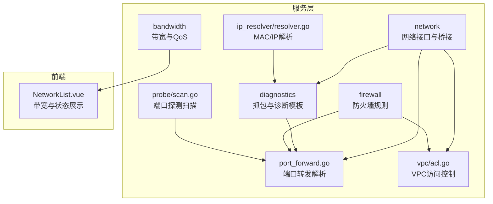
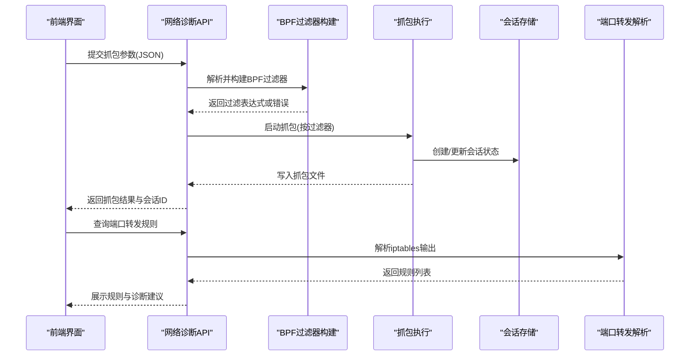
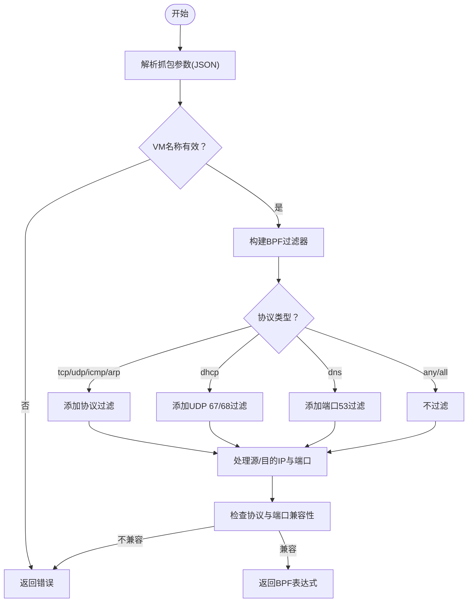
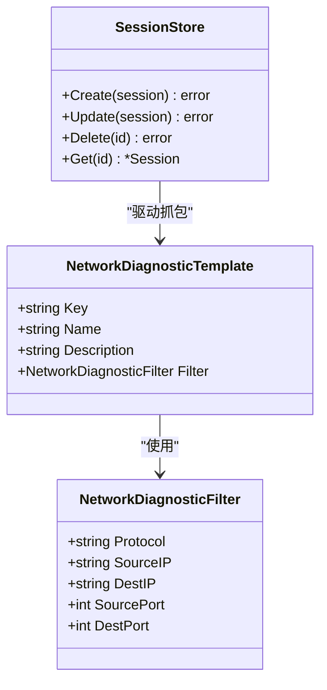
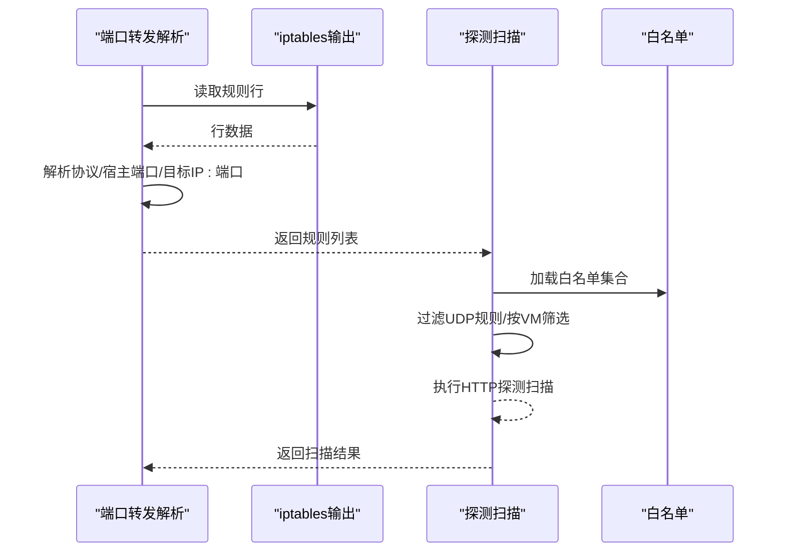
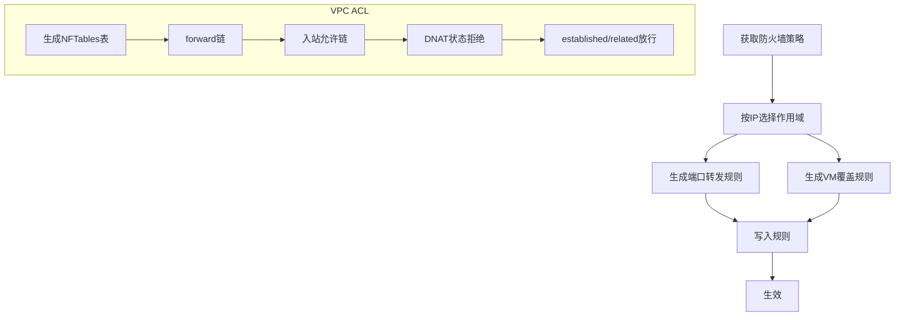
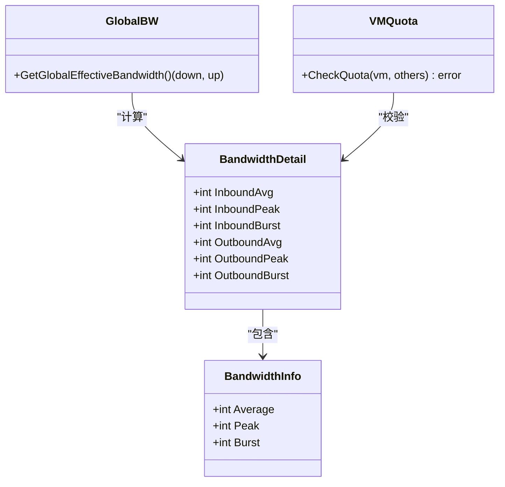
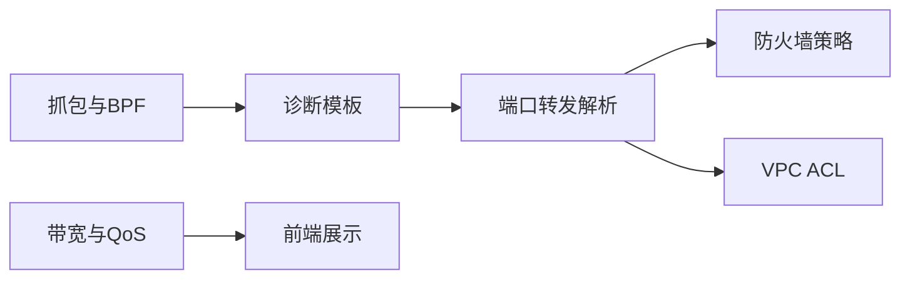

# 网络连接问题排查

<cite>
**本文引用的文件**
- [server/service/network/diagnostics/capture_bpf.go](file://server/service/network/diagnostics/capture_bpf.go)
- [server/service/network/diagnostics/templates.go](file://server/service/network/diagnostics/templates.go)
- [server/service/network/diagnostics/session_store.go](file://server/service/network/diagnostics/session_store.go)
- [server/service/network/diagnostics/types.go](file://server/service/network/diagnostics/types.go)
- [server/service/network/port_forward.go](file://server/service/network/port_forward.go)
- [server/service/firewall/rules.go](file://server/service/firewall/rules.go)
- [server/service/firewall/exemption.go](file://server/service/firewall/exemption.go)
- [server/service/network/vpc/acl.go](file://server/service/network/vpc/acl.go)
- [server/service/bandwidth/types.go](file://server/service/bandwidth/types.go)
- [server/service/bandwidth/global.go](file://server/service/bandwidth/global.go)
- [server/service/bandwidth/ovs.go](file://server/service/bandwidth/ovs.go)
- [server/service/bandwidth/tc.go](file://server/service/bandwidth/tc.go)
- [server/service/bandwidth/quota.go](file://server/service/bandwidth/quota.go)
- [server/service/bandwidth/vm.go](file://server/service/bandwidth/vm.go)
- [server/service/network/probe/scan.go](file://server/service/network/probe/scan.go)
- [server/service/ip_resolver/resolver.go](file://server/service/ip_resolver/resolver.go)
- [web/src/components/NetworkList.vue](file://web/src/components/NetworkList.vue)
</cite>

## 目录
1. [简介](#简介)
2. [项目结构](#项目结构)
3. [核心组件](#核心组件)
4. [架构概览](#架构概览)
5. [详细组件分析](#详细组件分析)
6. [依赖关系分析](#依赖关系分析)
7. [性能考量](#性能考量)
8. [故障排查指南](#故障排查指南)
9. [结论](#结论)
10. [附录](#附录)

## 简介
本指南面向Open虚拟机管理控制台的网络连接问题排查，围绕以下目标展开：
- 网络抓包工具使用：BPF过滤器构建、会话管理、抓包文件分析
- 网络诊断模板应用：常见网络问题的预设诊断方案与自定义规则
- 防火墙规则检查：端口转发配置验证、规则冲突检测、访问控制列表分析
- 网络性能诊断：延迟测试、带宽测量、丢包率分析
- 快速定位方法：ping测试、traceroute分析、DNS解析验证

## 项目结构
网络相关能力主要分布在服务层的network、firewall、bandwidth、diagnostics子模块，并通过Web前端组件展示运行时状态与诊断结果。

图示来源
- [server/service/network/port_forward.go:101-154](file://server/service/network/port_forward.go#L101-L154)
- [server/service/network/diagnostics/templates.go:9-41](file://server/service/network/diagnostics/templates.go#L9-L41)
- [server/service/network/vpc/acl.go:17-54](file://server/service/network/vpc/acl.go#L17-L54)
- [server/service/bandwidth/types.go:12-51](file://server/service/bandwidth/types.go#L12-L51)
- [server/service/network/probe/scan.go:21-52](file://server/service/network/probe/scan.go#L21-L52)
- [server/service/ip_resolver/resolver.go:379-421](file://server/service/ip_resolver/resolver.go#L379-L421)
- [web/src/components/NetworkList.vue:331-343](file://web/src/components/NetworkList.vue#L331-L343)

章节来源
- [server/service/network/port_forward.go:101-154](file://server/service/network/port_forward.go#L101-L154)
- [server/service/network/diagnostics/templates.go:9-41](file://server/service/network/diagnostics/templates.go#L9-L41)
- [server/service/network/vpc/acl.go:17-54](file://server/service/network/vpc/acl.go#L17-L54)
- [server/service/bandwidth/types.go:12-51](file://server/service/bandwidth/types.go#L12-L51)
- [server/service/network/probe/scan.go:21-52](file://server/service/network/probe/scan.go#L21-L52)
- [server/service/ip_resolver/resolver.go:379-421](file://server/service/ip_resolver/resolver.go#L379-L421)
- [web/src/components/NetworkList.vue:331-343](file://web/src/components/NetworkList.vue#L331-L343)

## 核心组件
- 抓包与BPF过滤：解析抓包参数、构建BPF过滤器、支持协议与端口组合
- 诊断模板：内置ARP/DHCP/DNS模板，结合VM默认IP与端口转发规则生成定制化模板
- 会话存储：管理抓包会话生命周期与状态
- 端口转发：从iptables输出解析规则，提取协议、宿主端口、目标IP与端口
- 防火墙策略：基于策略生成入站/出站规则，支持豁免与覆盖模式
- VPC ACL：生成NFTables规则表，实现转发链与入站允许链
- 带宽与QoS：带宽单位换算、全局有效带宽、VM配额校验、tc/ovs/QoS配置
- 探测扫描：对TCP端口转发进行HTTP探测扫描，白名单过滤
- MAC/IP解析：解析邻居表与ARP扫描输出，建立MAC到IP映射

章节来源
- [server/service/network/diagnostics/capture_bpf.go:14-44](file://server/service/network/diagnostics/capture_bpf.go#L14-L44)
- [server/service/network/diagnostics/templates.go:9-41](file://server/service/network/diagnostics/templates.go#L9-L41)
- [server/service/network/diagnostics/session_store.go](file://server/service/network/diagnostics/session_store.go)
- [server/service/network/port_forward.go:101-154](file://server/service/network/port_forward.go#L101-L154)
- [server/service/firewall/rules.go:77-114](file://server/service/firewall/rules.go#L77-L114)
- [server/service/firewall/exemption.go:8-25](file://server/service/firewall/exemption.go#L8-L25)
- [server/service/network/vpc/acl.go:17-54](file://server/service/network/vpc/acl.go#L17-L54)
- [server/service/bandwidth/types.go:12-51](file://server/service/bandwidth/types.go#L12-L51)
- [server/service/bandwidth/global.go:16-56](file://server/service/bandwidth/global.go#L16-L56)
- [server/service/bandwidth/ovs.go](file://server/service/bandwidth/ovs.go)
- [server/service/bandwidth/tc.go](file://server/service/bandwidth/tc.go)
- [server/service/bandwidth/quota.go](file://server/service/bandwidth/quota.go)
- [server/service/bandwidth/vm.go:74-114](file://server/service/bandwidth/vm.go#L74-L114)
- [server/service/network/probe/scan.go:21-52](file://server/service/network/probe/scan.go#L21-L52)
- [server/service/ip_resolver/resolver.go:379-421](file://server/service/ip_resolver/resolver.go#L379-L421)

## 架构概览
下图展示了网络诊断与抓包的关键流程：从前端触发到后端解析、生成BPF过滤器、执行抓包并回传结果。

图示来源
- [server/service/network/diagnostics/capture_bpf.go:14-44](file://server/service/network/diagnostics/capture_bpf.go#L14-L44)
- [server/service/network/port_forward.go:101-154](file://server/service/network/port_forward.go#L101-L154)

## 详细组件分析

### 抓包与BPF过滤器
- 参数解析：支持JSON参数解码与VM名称校验
- 过滤器构建：支持协议过滤（tcp/udp/icmp/arp/dhcp/dns），以及针对特定IP/端口的组合过滤；对不兼容的协议与端口组合进行约束
- 输出：返回BPF表达式或错误信息

图示来源
- [server/service/network/diagnostics/capture_bpf.go:14-44](file://server/service/network/diagnostics/capture_bpf.go#L14-L44)

章节来源
- [server/service/network/diagnostics/capture_bpf.go:14-44](file://server/service/network/diagnostics/capture_bpf.go#L14-L44)

### 诊断模板与会话管理
- 模板构建：内置ARP/DHCP/DNS模板；根据VM默认IP生成“当前VM IP”模板；根据端口转发规则生成“端口转发”模板
- 会话存储：负责抓包会话的创建、状态维护与清理

图示来源
- [server/service/network/diagnostics/templates.go:9-41](file://server/service/network/diagnostics/templates.go#L9-L41)
- [server/service/network/diagnostics/session_store.go](file://server/service/network/diagnostics/session_store.go)
- [server/service/network/diagnostics/types.go:30-60](file://server/service/network/diagnostics/types.go#L30-L60)

章节来源
- [server/service/network/diagnostics/templates.go:9-41](file://server/service/network/diagnostics/templates.go#L9-L41)
- [server/service/network/diagnostics/session_store.go](file://server/service/network/diagnostics/session_store.go)
- [server/service/network/diagnostics/types.go:30-60](file://server/service/network/diagnostics/types.go#L30-L60)

### 端口转发规则解析与探测
- iptables解析：从输出中提取规则编号、协议、宿主端口、目标IP与端口，生成稳定键用于关联策略豁免
- 探测扫描：筛选TCP规则，按白名单过滤，执行HTTP探测扫描并统计匹配结果

图示来源
- [server/service/network/port_forward.go:101-154](file://server/service/network/port_forward.go#L101-L154)
- [server/service/network/probe/scan.go:21-52](file://server/service/network/probe/scan.go#L21-L52)

章节来源
- [server/service/network/port_forward.go:101-154](file://server/service/network/port_forward.go#L101-L154)
- [server/service/network/probe/scan.go:21-52](file://server/service/network/probe/scan.go#L21-L52)

### 防火墙策略与VPC ACL
- 策略规则：根据策略生成入站/出站规则，支持豁免端口转发、VM覆盖模式（仅入站/禁用/允许）
- VPC ACL：生成NFTables表，包含forward链与入站允许链，处理DNAT状态拒绝与状态放行

图示来源
- [server/service/firewall/rules.go:77-114](file://server/service/firewall/rules.go#L77-L114)
- [server/service/firewall/exemption.go:8-25](file://server/service/firewall/exemption.go#L8-L25)
- [server/service/network/vpc/acl.go:17-54](file://server/service/network/vpc/acl.go#L17-L54)

章节来源
- [server/service/firewall/rules.go:77-114](file://server/service/firewall/rules.go#L77-L114)
- [server/service/firewall/exemption.go:8-25](file://server/service/firewall/exemption.go#L8-L25)
- [server/service/network/vpc/acl.go:17-54](file://server/service/network/vpc/acl.go#L17-L54)

### 带宽与QoS
- 数据模型：带宽信息与详细指标（平均/峰值/突发），支持单位换算
- 全局有效带宽：按系统配置计算有效带宽
- VM配额校验：校验单VM与全系统带宽总和不超过配额
- OVS/tc配置：结合tc与OVS实现QoS策略

图示来源
- [server/service/bandwidth/types.go:12-51](file://server/service/bandwidth/types.go#L12-L51)
- [server/service/bandwidth/global.go:16-56](file://server/service/bandwidth/global.go#L16-L56)
- [server/service/bandwidth/vm.go:74-114](file://server/service/bandwidth/vm.go#L74-L114)

章节来源
- [server/service/bandwidth/types.go:12-51](file://server/service/bandwidth/types.go#L12-L51)
- [server/service/bandwidth/global.go:16-56](file://server/service/bandwidth/global.go#L16-L56)
- [server/service/bandwidth/vm.go:74-114](file://server/service/bandwidth/vm.go#L74-L114)

### 前端运行时状态展示
- 带宽状态：展示Cookie、流量是否存在、检查端口、下行/上行QoS、队列状态、tc/ingress等

章节来源
- [web/src/components/NetworkList.vue:331-343](file://web/src/components/NetworkList.vue#L331-L343)

## 依赖关系分析
- 抓包与诊断模板依赖端口转发解析结果，以便生成“端口转发”模板
- 防火墙策略与VPC ACL共同影响入站/出站可达性
- 带宽模块为性能诊断提供数据支撑，前端组件展示运行时状态

图示来源
- [server/service/network/diagnostics/templates.go:9-41](file://server/service/network/diagnostics/templates.go#L9-L41)
- [server/service/network/port_forward.go:101-154](file://server/service/network/port_forward.go#L101-L154)
- [server/service/firewall/rules.go:77-114](file://server/service/firewall/rules.go#L77-L114)
- [server/service/network/vpc/acl.go:17-54](file://server/service/network/vpc/acl.go#L17-L54)
- [server/service/bandwidth/types.go:12-51](file://server/service/bandwidth/types.go#L12-L51)
- [web/src/components/NetworkList.vue:331-343](file://web/src/components/NetworkList.vue#L331-L343)

## 性能考量
- 带宽单位换算：1 Mbps = 125 KB/s，便于在不同模块间统一计量
- 全局有效带宽：考虑系统预留后计算可用带宽
- VM配额校验：在新增或调整带宽时，需确保单VM与全系统总和不超过配额
- QoS实现：结合tc与OVS策略，保障公平性与稳定性

章节来源
- [server/service/bandwidth/types.go:39-50](file://server/service/bandwidth/types.go#L39-L50)
- [server/service/bandwidth/global.go:45-56](file://server/service/bandwidth/global.go#L45-L56)
- [server/service/bandwidth/vm.go:74-114](file://server/service/bandwidth/vm.go#L74-L114)

## 故障排查指南

### 网络抓包工具使用
- BPF过滤器构建
  - 支持协议过滤：tcp/udp/icmp/arp/dhcp/dns
  - 组合过滤：可同时指定源/目的IP与端口
  - 不兼容约束：arp/icmp不能与端口过滤同时使用
- 会话管理
  - 创建抓包会话，记录过滤条件与目标VM
  - 更新会话状态，回传抓包文件路径
- 抓包文件分析
  - 结合诊断模板快速定位问题（ARP/DHCP/DNS）
  - 使用“端口转发”模板检查宿主机端口到VM的入站流量

章节来源
- [server/service/network/diagnostics/capture_bpf.go:14-44](file://server/service/network/diagnostics/capture_bpf.go#L14-L44)
- [server/service/network/diagnostics/templates.go:9-41](file://server/service/network/diagnostics/templates.go#L9-L41)
- [server/service/network/diagnostics/session_store.go](file://server/service/network/diagnostics/session_store.go)

### 网络诊断模板应用
- 预设模板
  - ARP：检查ARP请求与应答
  - DHCP：检查DHCP获取地址过程
  - DNS：检查DNS查询与响应
- 自定义模板
  - 当前VM IP：仅查看当前VM IP的流量
  - 端口转发：基于规则生成模板，检查宿主机端口到VM的入站流量

章节来源
- [server/service/network/diagnostics/templates.go:9-41](file://server/service/network/diagnostics/templates.go#L9-L41)

### 防火墙规则检查
- 端口转发配置验证
  - 从iptables输出解析规则，确认协议、宿主端口、目标IP与端口
  - 关联策略豁免，确保端口转发不受区域限制阻断
- 规则冲突检测
  - 对比入站/出站规则与端口转发规则，识别重复或矛盾项
- 访问控制列表分析
  - 检查VPC ACL的forward链与入站允许链，确认状态放行与DNAT拒绝逻辑

章节来源
- [server/service/network/port_forward.go:101-154](file://server/service/network/port_forward.go#L101-L154)
- [server/service/firewall/exemption.go:8-25](file://server/service/firewall/exemption.go#L8-L25)
- [server/service/network/vpc/acl.go:17-54](file://server/service/network/vpc/acl.go#L17-L54)

### 网络性能诊断
- 延迟测试
  - 使用ping与traceroute验证连通性与路径
- 带宽测量
  - 通过带宽数据模型与前端展示，观察下行/上行平均/峰值/突发
- 丢包率分析
  - 结合状态放行与规则冲突，定位丢包环节

章节来源
- [server/service/bandwidth/types.go:12-51](file://server/service/bandwidth/types.go#L12-L51)
- [web/src/components/NetworkList.vue:331-343](file://web/src/components/NetworkList.vue#L331-L343)

### 快速定位方法
- ping测试：验证基本连通性
- traceroute分析：识别路径异常节点
- DNS解析验证：结合诊断模板与解析模块，确认DNS查询与响应

章节来源
- [server/service/ip_resolver/resolver.go:379-421](file://server/service/ip_resolver/resolver.go#L379-L421)
- [server/service/network/diagnostics/templates.go:9-41](file://server/service/network/diagnostics/templates.go#L9-L41)

## 结论
通过抓包与诊断模板、端口转发解析、防火墙与VPC ACL规则、带宽与QoS配置以及前端运行时状态展示，可以形成一套完整的网络连接问题排查体系。建议在实际操作中先用模板快速定位，再结合防火墙与带宽策略进行深入分析，并利用探测扫描与解析模块辅助验证。

## 附录
- 单位换算参考：1 Mbps = 125 KB/s
- 前端带宽状态字段：Cookie、流量存在性、检查端口、下行/上行QoS、队列状态、tc/ingress等

章节来源
- [server/service/bandwidth/types.go:39-50](file://server/service/bandwidth/types.go#L39-L50)
- [web/src/components/NetworkList.vue:331-343](file://web/src/components/NetworkList.vue#L331-L343)