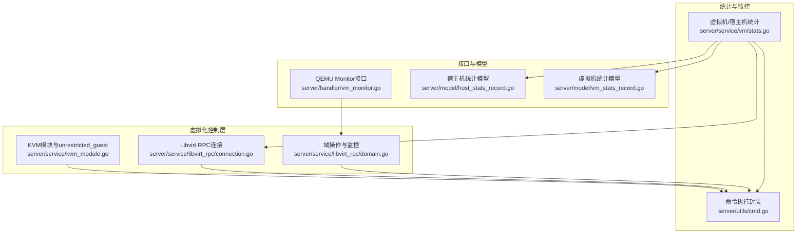
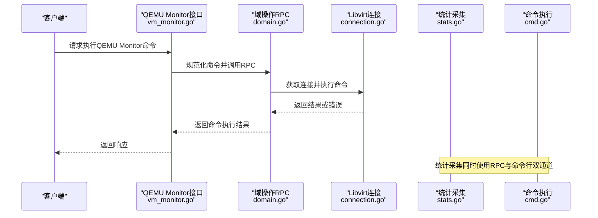
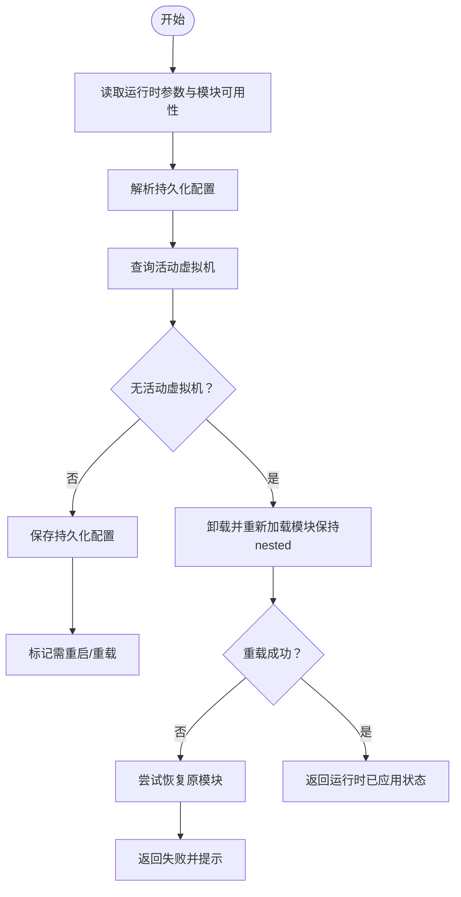
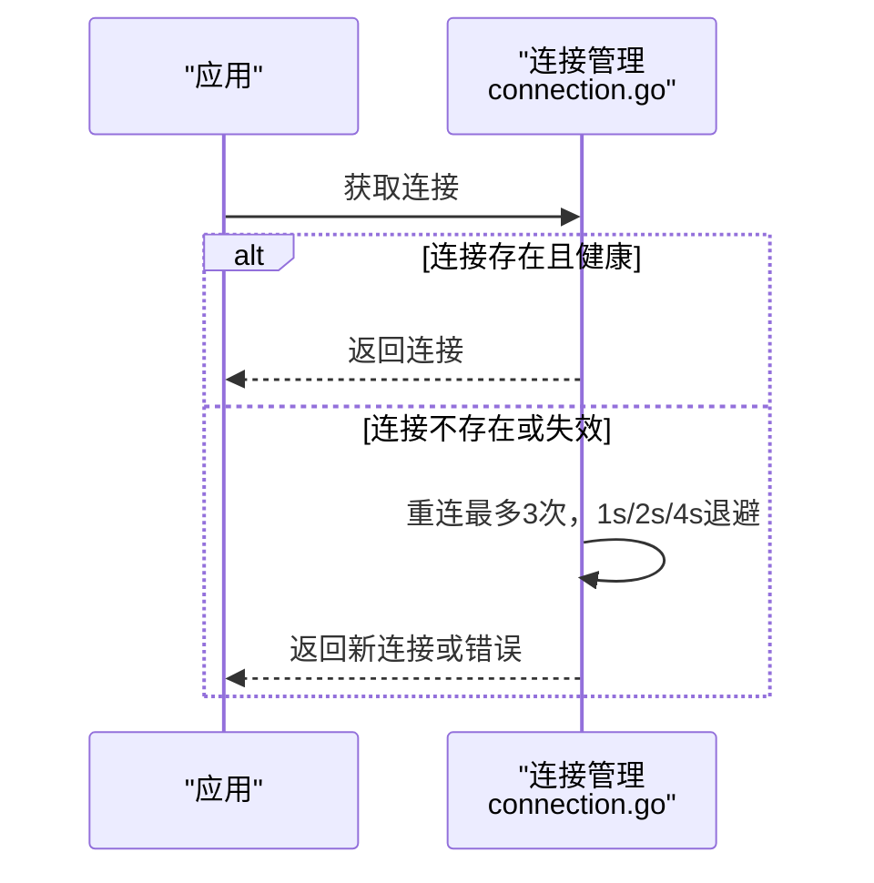
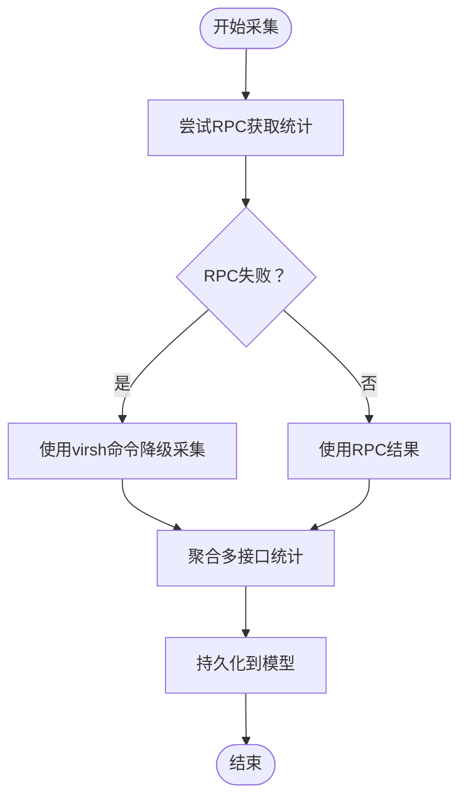
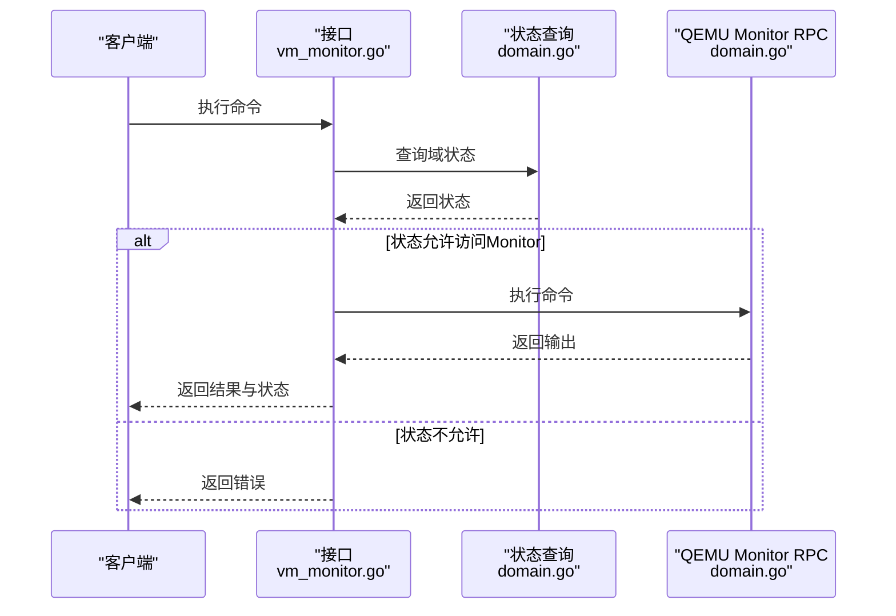
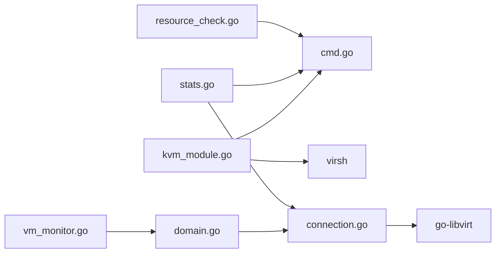

# 虚拟化问题排查

<cite>
**本文档引用的文件**
- [kvm_module.go](file://server/service/kvm_module.go)
- [connection.go](file://server/service/libvirt_rpc/connection.go)
- [domain.go](file://server/service/libvirt_rpc/domain.go)
- [stats.go](file://server/service/vm/stats.go)
- [vm_monitor.go](file://server/handler/vm_monitor.go)
- [cmd.go](file://server/utils/cmd.go)
- [helpers.go](file://server/service/host/helpers.go)
- [resource_check.go](file://server/service/host/resource_check.go)
- [host_stats_record.go](file://server/model/host_stats_record.go)
- [vm_stats_record.go](file://server/model/vm_stats_record.go)
</cite>

## 目录
1. [简介](#简介)
2. [项目结构](#项目结构)
3. [核心组件](#核心组件)
4. [架构总览](#架构总览)
5. [详细组件分析](#详细组件分析)
6. [依赖分析](#依赖分析)
7. [性能考虑](#性能考虑)
8. [故障排查指南](#故障排查指南)
9. [结论](#结论)
10. [附录](#附录)

## 简介
本指南面向Open虚拟机管理控制台的运维与开发人员，聚焦KVM模块加载、Libvirt连接、QEMU进程状态与监控等关键环节，提供系统化的诊断思路与排障步骤。内容涵盖：
- KVM模块加载失败的定位与修复
- Libvirt连接异常的检测与恢复
- QEMU进程崩溃的识别与处理
- 虚拟化环境检查命令与工具使用
- 性能监控指标的采集与解读
- 配置优化建议与常见错误码说明

## 项目结构
围绕虚拟化问题排查，系统主要涉及以下模块：
- KVM模块与Intel unrestricted_guest状态管理
- Libvirt RPC连接与自动重连机制
- 虚拟机统计与宿主机资源采集
- QEMU Monitor命令执行与状态查询
- 命令执行封装与超时/取消控制
- 宿主机资源检查与磁盘链完整性校验

**图示来源**
- [kvm_module.go:1-241](file://server/service/kvm_module.go#L1-L241)
- [connection.go:1-138](file://server/service/libvirt_rpc/connection.go#L1-L138)
- [domain.go:1-961](file://server/service/libvirt_rpc/domain.go#L1-L961)
- [stats.go:1-333](file://server/service/vm/stats.go#L1-L333)
- [cmd.go:1-250](file://server/utils/cmd.go#L1-L250)
- [vm_monitor.go:1-78](file://server/handler/vm_monitor.go#L1-L78)
- [host_stats_record.go:1-17](file://server/model/host_stats_record.go#L1-L17)
- [vm_stats_record.go:1-20](file://server/model/vm_stats_record.go#L1-L20)

**章节来源**
- [kvm_module.go:1-241](file://server/service/kvm_module.go#L1-L241)
- [connection.go:1-138](file://server/service/libvirt_rpc/connection.go#L1-L138)
- [domain.go:1-961](file://server/service/libvirt_rpc/domain.go#L1-L961)
- [stats.go:1-333](file://server/service/vm/stats.go#L1-L333)
- [cmd.go:1-250](file://server/utils/cmd.go#L1-L250)
- [vm_monitor.go:1-78](file://server/handler/vm_monitor.go#L1-L78)
- [host_stats_record.go:1-17](file://server/model/host_stats_record.go#L1-L17)
- [vm_stats_record.go:1-20](file://server/model/vm_stats_record.go#L1-L20)

## 核心组件
- KVM模块与Intel unrestricted_guest状态管理：负责检测、配置与热重载KVM模块参数，支持持久化配置与运行时一致性校验。
- Libvirt RPC连接：提供单例连接、健康探测、自动重连与版本验证，作为高性能路径优先使用。
- 虚拟机与宿主机统计：通过RPC与命令行双通道采集CPU、内存、磁盘I/O、网络等指标，并支持降级策略。
- QEMU Monitor接口：封装监视器状态查询与命令执行，支持规范化命令输入与状态回读。
- 命令执行封装：统一的命令执行、超时控制、取消与日志记录，保障稳定性与可观测性。

**章节来源**
- [kvm_module.go:1-241](file://server/service/kvm_module.go#L1-L241)
- [connection.go:1-138](file://server/service/libvirt_rpc/connection.go#L1-L138)
- [domain.go:1-961](file://server/service/libvirt_rpc/domain.go#L1-L961)
- [stats.go:1-333](file://server/service/vm/stats.go#L1-L333)
- [cmd.go:1-250](file://server/utils/cmd.go#L1-L250)
- [vm_monitor.go:1-78](file://server/handler/vm_monitor.go#L1-L78)

## 架构总览
下图展示虚拟化问题排查相关的端到端交互：客户端请求经接口层进入，根据可用性选择RPC或命令行路径，最终落盘统计与返回结果。

**图示来源**
- [vm_monitor.go:1-78](file://server/handler/vm_monitor.go#L1-L78)
- [domain.go:545-562](file://server/service/libvirt_rpc/domain.go#L545-L562)
- [connection.go:45-76](file://server/service/libvirt_rpc/connection.go#L45-L76)
- [stats.go:18-186](file://server/service/vm/stats.go#L18-L186)
- [cmd.go:23-113](file://server/utils/cmd.go#L23-L113)

## 详细组件分析

### KVM模块与unrestricted_guest状态管理
- 功能要点
  - 检测运行时与持久化配置状态
  - 在无活动虚拟机时尝试热重载以应用新参数
  - 提供“是否需要重启”与“消息提示”的状态反馈
- 关键行为
  - 读取/sys/module参数与/etc/modprobe.d配置
  - 通过virsh列出运行/暂停虚拟机以决定是否可热重载
  - 卸载/加载模块时保留nested参数并回滚失败场景

**图示来源**
- [kvm_module.go:94-240](file://server/service/kvm_module.go#L94-L240)

**章节来源**
- [kvm_module.go:1-241](file://server/service/kvm_module.go#L1-L241)

### Libvirt RPC连接与自动重连
- 功能要点
  - 启动时建立连接并验证版本
  - 提供快速可用性判断与健康探测
  - 重连采用指数退避策略，最多三次
- 关键行为
  - 单例连接，读写锁保护
  - 断线后自动重建并替换旧连接
  - 降级策略：RPC不可用时回退到virsh命令

**图示来源**
- [connection.go:45-121](file://server/service/libvirt_rpc/connection.go#L45-L121)

**章节来源**
- [connection.go:1-138](file://server/service/libvirt_rpc/connection.go#L1-L138)
- [helpers.go:17-33](file://server/service/host/helpers.go#L17-L33)

### 虚拟机与宿主机统计采集
- 功能要点
  - 优先使用RPC获取CPU、内存、磁盘I/O、网络统计
  - 通过virsh命令进行降级采集，保证在RPC不可用时仍可工作
  - 宿主机统计包含CPU使用率、内存、Swap、KSM、磁盘延迟、网络IO与运行时长等
- 关键行为
  - 两次CPU采样计算瞬时使用率
  - 动态发现网卡与磁盘设备，聚合多接口统计
  - 支持将统计结果持久化到数据库模型

**图示来源**
- [stats.go:18-287](file://server/service/vm/stats.go#L18-L287)

**章节来源**
- [stats.go:1-333](file://server/service/vm/stats.go#L1-L333)
- [host_stats_record.go:1-17](file://server/model/host_stats_record.go#L1-L17)
- [vm_stats_record.go:1-20](file://server/model/vm_stats_record.go#L1-L20)

### QEMU Monitor接口与命令执行
- 功能要点
  - 校验虚拟机状态，仅在运行/暂停时允许访问Monitor
  - 规范化命令输入，支持info类与sendkey等常用命令
  - 执行后回读最新状态，返回原始输出与状态摘要
- 关键行为
  - 通过RPC调用QEMU Monitor命令
  - 对非法或不支持的状态返回明确错误

**图示来源**
- [vm_monitor.go:16-77](file://server/handler/vm_monitor.go#L16-L77)
- [domain.go:42-66](file://server/service/libvirt_rpc/domain.go#L42-L66)
- [domain.go:545-562](file://server/service/libvirt_rpc/domain.go#L545-L562)

**章节来源**
- [vm_monitor.go:1-78](file://server/handler/vm_monitor.go#L1-L78)
- [domain.go:1-961](file://server/service/libvirt_rpc/domain.go#L1-L961)

### 命令执行封装与工具
- 功能要点
  - 统一的命令执行接口，支持超时、取消、日志记录
  - Quiet变体用于预期可能失败的查询/清理命令
  - Shell单引号转义，防止注入
- 关键行为
  - 强制C语言环境，确保输出稳定
  - 超时与取消时清理进程树，避免僵尸进程

**章节来源**
- [cmd.go:1-250](file://server/utils/cmd.go#L1-L250)

## 依赖分析
- 组件耦合
  - KVM模块管理依赖命令执行工具与virsh
  - Libvirt RPC连接为统计与域操作提供统一通道
  - 统计模块同时依赖RPC与命令行，形成高可用路径
  - QEMU Monitor接口依赖域状态查询与RPC命令执行
- 外部依赖
  - libvirt-go客户端、virsh、qemu-img、ovs-vsctl等系统工具
  - Linux内核模块参数与modprobe配置文件

**图示来源**
- [kvm_module.go:1-241](file://server/service/kvm_module.go#L1-L241)
- [connection.go:1-138](file://server/service/libvirt_rpc/connection.go#L1-L138)
- [domain.go:1-961](file://server/service/libvirt_rpc/domain.go#L1-L961)
- [stats.go:1-333](file://server/service/vm/stats.go#L1-L333)
- [vm_monitor.go:1-78](file://server/handler/vm_monitor.go#L1-L78)
- [resource_check.go:1-153](file://server/service/host/resource_check.go#L1-L153)
- [cmd.go:1-250](file://server/utils/cmd.go#L1-L250)

**章节来源**
- [kvm_module.go:1-241](file://server/service/kvm_module.go#L1-L241)
- [connection.go:1-138](file://server/service/libvirt_rpc/connection.go#L1-L138)
- [domain.go:1-961](file://server/service/libvirt_rpc/domain.go#L1-L961)
- [stats.go:1-333](file://server/service/vm/stats.go#L1-L333)
- [vm_monitor.go:1-78](file://server/handler/vm_monitor.go#L1-L78)
- [resource_check.go:1-153](file://server/service/host/resource_check.go#L1-L153)
- [cmd.go:1-250](file://server/utils/cmd.go#L1-L250)

## 性能考虑
- RPC优先策略：在连接可用时优先使用RPC，显著降低命令行开销
- 降级回退：RPC失败时自动切换到virsh，保证功能可用性
- 采样间隔：统计采集采用固定间隔采样，避免过度频繁的系统调用
- I/O延迟：宿主机磁盘延迟通过iostat采样，结合设备过滤减少噪声
- 指标聚合：对多网卡/多磁盘进行聚合，避免单点偏差

[本节为通用指导，无需特定文件分析]

## 故障排查指南

### 1. KVM模块加载失败
- 现象
  - 无法启用unrestricted_guest或模块无法热重载
  - 活动虚拟机占用模块导致无法卸载
- 诊断步骤
  - 检查模块运行时参数与可用性
  - 查看持久化配置是否正确
  - 列出活动虚拟机，确认是否可热重载
  - 若模块被占用，先关停所有虚拟机或重启宿主机
- 处理建议
  - 保存配置后若运行时状态不一致，按提示重启或重载
  - 确保nested参数与unrestricted_guest一致后再加载

**章节来源**
- [kvm_module.go:94-240](file://server/service/kvm_module.go#L94-L240)

### 2. Libvirt连接异常
- 现象
  - 连接建立失败、握手失败、socket不存在
  - 连接断开后无法自动恢复
- 诊断步骤
  - 检查libvirt-sock路径与权限
  - 观察重连日志与退避次数
  - 使用IsLibvirtRPCAvailable快速判断可用性
  - 通过错误文本特征判断是否为libvirt不可用
- 处理建议
  - 启动libvirtd服务并确保socket存在
  - RPC不可用时回退到virsh命令路径
  - 检查防火墙与SELinux策略

**章节来源**
- [connection.go:20-137](file://server/service/libvirt_rpc/connection.go#L20-L137)
- [helpers.go:17-33](file://server/service/host/helpers.go#L17-L33)

### 3. QEMU进程崩溃或Monitor不可用
- 现象
  - Monitor命令执行失败、状态不可用
  - 虚拟机处于非运行/暂停状态
- 诊断步骤
  - 获取域状态，确认是否为running/paused
  - 执行info status命令查看Monitor状态
  - 规范化命令输入，避免非法命令
- 处理建议
  - 仅在允许的状态下执行Monitor命令
  - 对于关键命令，先查询状态再执行

**章节来源**
- [domain.go:42-66](file://server/service/libvirt_rpc/domain.go#L42-L66)
- [domain.go:545-562](file://server/service/libvirt_rpc/domain.go#L545-L562)
- [vm_monitor.go:16-77](file://server/handler/vm_monitor.go#L16-L77)

### 4. 虚拟化环境检查命令
- 常用命令与用途
  - 检查KVM模块与unrestricted_guest状态：参考KVM模块管理逻辑
  - 检查libvirtd服务与socket：使用命令执行封装工具
  - 列出虚拟机状态：virsh list --all --name
  - 获取磁盘backing chain：qemu-img info --backing-chain --output=json
  - 检查OVS网桥：ovs-vsctl br-exists
- 建议
  - 使用统一命令执行封装，确保输出语言环境一致
  - 对可能失败的查询使用quiet模式，避免干扰日志

**章节来源**
- [kvm_module.go:94-107](file://server/service/kvm_module.go#L94-L107)
- [resource_check.go:56-105](file://server/service/host/resource_check.go#L56-L105)
- [cmd.go:120-150](file://server/utils/cmd.go#L120-L150)

### 5. 虚拟化性能监控指标解读
- CPU
  - 通过两次CPU时间采样计算瞬时使用率，考虑vCPU数量归一化
- 内存
  - 实际分配、可用、unused/usable等指标，关注MemAvailable与Swap使用
- 磁盘I/O
  - 读写字节数聚合，结合宿主机磁盘延迟评估性能
- 网络
  - 多网卡累计接收/发送字节，排除虚拟接口与容器接口
- 建议
  - 结合宿主机与虚拟机指标对比，定位瓶颈来源

**章节来源**
- [stats.go:18-287](file://server/service/vm/stats.go#L18-L287)

### 6. 虚拟化配置优化建议
- 内核参数
  - 保持nested与unrestricted_guest参数一致，必要时热重载
- 硬件兼容性
  - 确认Intel KVM模块可用，避免在AMD平台错误配置
- 虚拟化功能启用
  - 通过modprobe配置持久化，避免每次重启丢失
- 建议
  - 在无活动虚拟机时进行参数变更，减少业务影响

**章节来源**
- [kvm_module.go:132-240](file://server/service/kvm_module.go#L132-L240)

### 7. 常见错误与解决方案
- KVM模块热卸载失败
  - 原因：模块被使用或引用计数大于0
  - 解决：关停所有虚拟机或重启宿主机
- Libvirt连接失败
  - 原因：socket不存在、权限不足、服务未启动
  - 解决：检查libvirtd状态与socket路径
- Monitor命令执行失败
  - 原因：虚拟机状态不允许、命令非法
  - 解决：先查询状态，再执行合法命令

**章节来源**
- [kvm_module.go:169-205](file://server/service/kvm_module.go#L169-L205)
- [connection.go:124-137](file://server/service/libvirt_rpc/connection.go#L124-L137)
- [domain.go:545-562](file://server/service/libvirt_rpc/domain.go#L545-L562)

## 结论
通过KVM模块状态管理、Libvirt RPC连接与自动重连、统计采集与降级策略、以及QEMU Monitor接口的组合，系统实现了对虚拟化环境的全面可观测与可控性。遵循本文提供的诊断流程与优化建议，可有效定位并解决KVM模块加载失败、Libvirt连接异常、QEMU进程崩溃等问题，提升虚拟化平台的稳定性与性能。

[本节为总结，无需特定文件分析]

## 附录

### A. 统计模型字段说明
- 宿主机统计模型
  - CPU使用率、内存总量/已用/可用、Swap总量/已用、KSM共享页数
  - 磁盘读写字节、磁盘延迟、网络接收/发送字节、运行时长、虚拟机总数/运行中
- 虚拟机统计模型
  - CPU使用率、内存总量/已用、磁盘读写字节、网络接收/发送字节

**章节来源**
- [host_stats_record.go:1-17](file://server/model/host_stats_record.go#L1-L17)
- [vm_stats_record.go:1-20](file://server/model/vm_stats_record.go#L1-L20)