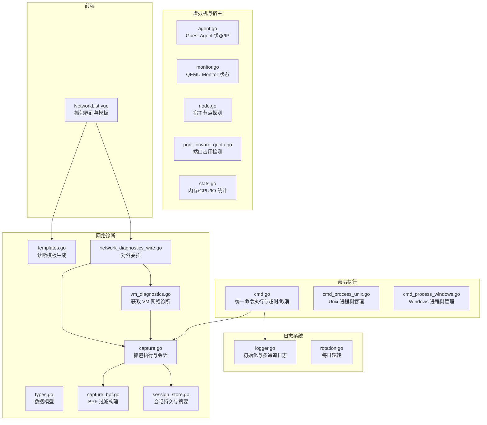
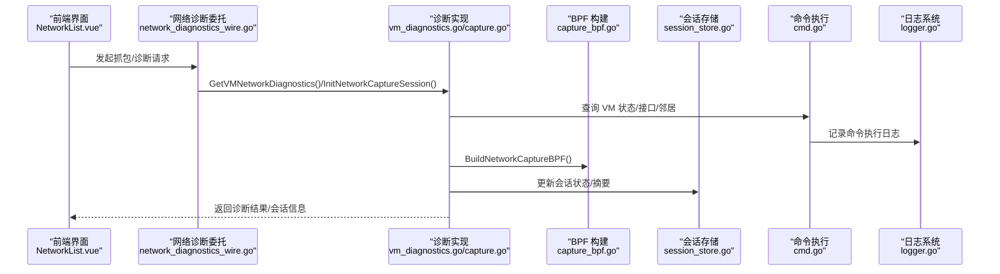
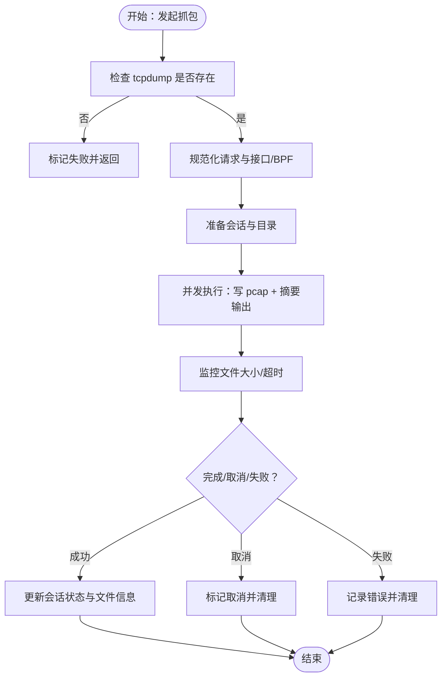
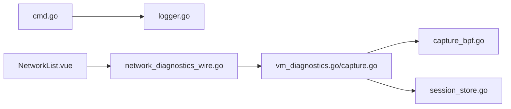

# 调试工具与命令

<cite>
**本文档引用的文件**
- [logger.go](file://server/logger/logger.go)
- [rotation.go](file://server/logger/rotation.go)
- [cmd.go](file://server/utils/cmd.go)
- [cmd_process_unix.go](file://server/utils/cmd_process_unix.go)
- [cmd_process_windows.go](file://server/utils/cmd_process_windows.go)
- [vm_diagnostics.go](file://server/service/network/diagnostics/vm_diagnostics.go)
- [types.go](file://server/service/network/diagnostics/types.go)
- [capture.go](file://server/service/network/diagnostics/capture.go)
- [capture_bpf.go](file://server/service/network/diagnostics/capture_bpf.go)
- [templates.go](file://server/service/network/diagnostics/templates.go)
- [session_store.go](file://server/service/network/diagnostics/session_store.go)
- [network_diagnostics_wire.go](file://server/service/network_diagnostics_wire.go)
- [agent.go](file://server/service/guest_agent/agent.go)
- [monitor.go](file://server/service/vm/monitor.go)
- [node.go](file://server/service/host/node.go)
- [port_forward_quota.go](file://server/service/network/port_forward_quota.go)
- [stats.go](file://server/service/vm/stats.go)
- [NetworkList.vue](file://web/src/components/NetworkList.vue)
</cite>

## 目录
1. [简介](#简介)
2. [项目结构](#项目结构)
3. [核心组件](#核心组件)
4. [架构总览](#架构总览)
5. [详细组件分析](#详细组件分析)
6. [依赖关系分析](#依赖关系分析)
7. [性能考量](#性能考量)
8. [故障排查指南](#故障排查指南)
9. [结论](#结论)
10. [附录](#附录)

## 简介
本指南面向运维与开发人员，系统性介绍 Open 虚拟机管理控制台的调试工具与命令使用方法。内容覆盖：
- 日志查看与分析：日志级别、输出目标、轮转策略与关键字检索建议
- 网络诊断命令：抓包命令、连接测试、性能测量与模板化过滤
- 虚拟机管理命令：状态检查、监控命令、资源与存储检查
- 系统状态检查：进程状态、端口监听、文件系统检查
- 最佳实践与注意事项：超时控制、并发与资源限制、安全与稳定性

## 项目结构
围绕调试主题的关键模块分布如下：
- 日志系统：server/logger 提供多通道日志与轮转
- 命令执行：server/utils/cmd 提供统一命令执行与日志记录
- 网络诊断：server/service/network/diagnostics 提供抓包、BPF 过滤、模板与会话管理
- 虚拟机与宿主：server/service 下的 vm、host、guest_agent 等模块提供状态与资源检查能力
- 前端交互：web/src/components/NetworkList.vue 展示抓包会话与模板

图表来源
- [logger.go:32-84](file://server/logger/logger.go#L32-L84)
- [cmd.go:23-113](file://server/utils/cmd.go#L23-L113)
- [vm_diagnostics.go:5-36](file://server/service/network/diagnostics/vm_diagnostics.go#L5-L36)
- [capture.go:17-188](file://server/service/network/diagnostics/capture.go#L17-L188)
- [capture_bpf.go:14-44](file://server/service/network/diagnostics/capture_bpf.go#L14-L44)
- [templates.go:9-41](file://server/service/network/diagnostics/templates.go#L9-L41)
- [session_store.go:13-106](file://server/service/network/diagnostics/session_store.go#L13-L106)
- [network_diagnostics_wire.go:36-71](file://server/service/network_diagnostics_wire.go#L36-L71)
- [agent.go:78-121](file://server/service/guest_agent/agent.go#L78-L121)
- [monitor.go:42-82](file://server/service/vm/monitor.go#L42-L82)
- [node.go:100-130](file://server/service/host/node.go#L100-L130)
- [port_forward_quota.go:183-220](file://server/service/network/port_forward_quota.go#L183-L220)
- [stats.go:197-234](file://server/service/vm/stats.go#L197-L234)
- [NetworkList.vue:439-480](file://web/src/components/NetworkList.vue#L439-L480)

章节来源
- [logger.go:32-84](file://server/logger/logger.go#L32-L84)
- [cmd.go:23-113](file://server/utils/cmd.go#L23-L113)
- [vm_diagnostics.go:5-36](file://server/service/network/diagnostics/vm_diagnostics.go#L5-L36)
- [capture.go:17-188](file://server/service/network/diagnostics/capture.go#L17-L188)
- [capture_bpf.go:14-44](file://server/service/network/diagnostics/capture_bpf.go#L14-L44)
- [templates.go:9-41](file://server/service/network/diagnostics/templates.go#L9-L41)
- [session_store.go:13-106](file://server/service/network/diagnostics/session_store.go#L13-L106)
- [network_diagnostics_wire.go:36-71](file://server/service/network_diagnostics_wire.go#L36-L71)
- [agent.go:78-121](file://server/service/guest_agent/agent.go#L78-L121)
- [monitor.go:42-82](file://server/service/vm/monitor.go#L42-L82)
- [node.go:100-130](file://server/service/host/node.go#L100-L130)
- [port_forward_quota.go:183-220](file://server/service/network/port_forward_quota.go#L183-L220)
- [stats.go:197-234](file://server/service/vm/stats.go#L197-L234)
- [NetworkList.vue:439-480](file://web/src/components/NetworkList.vue#L439-L480)

## 核心组件
- 日志系统：支持 app/request/cmd/libvirt 四类日志通道，可分别配置文件与控制台输出级别；支持按天轮转与压缩备份。
- 命令执行：统一封装命令执行、超时控制、取消、进程树清理与日志记录；提供静默执行与安静失败记录。
- 网络诊断：提供 VM 网络诊断聚合、抓包会话管理、BPF 过滤构建、模板化诊断与实时摘要。
- 虚拟机与宿主：Guest Agent 连通性与 IP 获取、QEMU Monitor 状态查询、宿主节点探测、端口占用检测、VM 资源统计。

章节来源
- [logger.go:32-84](file://server/logger/logger.go#L32-L84)
- [cmd.go:23-113](file://server/utils/cmd.go#L23-L113)
- [vm_diagnostics.go:5-36](file://server/service/network/diagnostics/vm_diagnostics.go#L5-L36)
- [capture.go:17-188](file://server/service/network/diagnostics/capture.go#L17-L188)
- [agent.go:78-121](file://server/service/guest_agent/agent.go#L78-L121)
- [monitor.go:42-82](file://server/service/vm/monitor.go#L42-L82)
- [node.go:100-130](file://server/service/host/node.go#L100-L130)
- [port_forward_quota.go:183-220](file://server/service/network/port_forward_quota.go#L183-L220)
- [stats.go:197-234](file://server/service/vm/stats.go#L197-L234)

## 架构总览
下图展示“日志—命令—网络诊断—前端”的关键交互路径，以及“命令—日志”对调试行为的支撑。

图表来源
- [network_diagnostics_wire.go:36-71](file://server/service/network_diagnostics_wire.go#L36-L71)
- [vm_diagnostics.go:5-36](file://server/service/network/diagnostics/vm_diagnostics.go#L5-L36)
- [capture.go:17-188](file://server/service/network/diagnostics/capture.go#L17-L188)
- [capture_bpf.go:14-44](file://server/service/network/diagnostics/capture_bpf.go#L14-L44)
- [session_store.go:13-106](file://server/service/network/diagnostics/session_store.go#L13-L106)
- [cmd.go:23-113](file://server/utils/cmd.go#L23-L113)
- [logger.go:32-84](file://server/logger/logger.go#L32-L84)

## 详细组件分析

### 日志系统与分析方法
- 初始化与输出配置
  - 支持按通道选择是否输出到控制台，且可为控制台设置独立级别
  - 文件输出采用滚动写入，支持最大文件大小、保留天数、压缩与备份数
- 日志级别
  - debug/info/warn/error，可通过配置切换
- 轮转机制
  - 每日凌晨 00:00 触发轮转，保证日志文件大小可控
- 分析建议
  - 关键字搜索：结合 grep/ripgrep 在对应日志文件中检索关键词
  - 时间范围：利用轮转后的文件命名与日期排序定位时间段
  - 级别过滤：通过控制台级别与文件级别区分关注点

章节来源
- [logger.go:32-84](file://server/logger/logger.go#L32-L84)
- [logger.go:196-210](file://server/logger/logger.go#L196-L210)
- [rotation.go:13-50](file://server/logger/rotation.go#L13-L50)

### 命令执行与调试命令
- 统一入口
  - 支持超时、取消、进程树清理、C 语言环境保证解析一致性
  - 成功/失败均记录到日志，便于回溯
- 常用场景
  - 网络诊断：tcpdump 抓包、ss/ netstat 端口检查
  - 虚拟机管理：virsh/qemu-agent 命令
  - 宿主检查：ssh/本地命令探测
- 注意事项
  - 长时间运行命令建议使用长时变体
  - 静默执行用于预期可能失败的查询/清理，避免噪声

章节来源
- [cmd.go:23-113](file://server/utils/cmd.go#L23-L113)
- [cmd.go:115-150](file://server/utils/cmd.go#L115-L150)
- [cmd_process_unix.go:10-24](file://server/utils/cmd_process_unix.go#L10-L24)
- [cmd_process_windows.go:7-15](file://server/utils/cmd_process_windows.go#L7-L15)

### 网络诊断与抓包命令
- 诊断流程
  - 获取 VM 网络运行状态与接口列表，识别默认可抓包接口
  - 生成邻居表、端口转发规则与诊断模板
- 抓包执行
  - 校验 tcpdump 可用性，准备会话目录与文件名
  - 并发执行：写 pcap 与实时摘要输出，监控文件大小
  - 支持 BPF 过滤、时长与大小限制
- BPF 过滤
  - 支持协议级（tcp/udp/icmp/arp/dns/dhcp）与端口级过滤
  - 模板化：内置 ARP/DHCP/DNS 与 VM 当前 IP、端口转发等模板
- 会话管理
  - 会话内存存储，限制摘要行数，定期清理过期会话
  - 支持取消、下载、删除抓包文件

图表来源
- [capture.go:90-188](file://server/service/network/diagnostics/capture.go#L90-L188)
- [capture_bpf.go:14-44](file://server/service/network/diagnostics/capture_bpf.go#L14-L44)
- [session_store.go:13-106](file://server/service/network/diagnostics/session_store.go#L13-L106)

章节来源
- [vm_diagnostics.go:5-36](file://server/service/network/diagnostics/vm_diagnostics.go#L5-L36)
- [types.go:5-115](file://server/service/network/diagnostics/types.go#L5-L115)
- [capture.go:17-188](file://server/service/network/diagnostics/capture.go#L17-L188)
- [capture_bpf.go:14-44](file://server/service/network/diagnostics/capture_bpf.go#L14-L44)
- [templates.go:9-41](file://server/service/network/diagnostics/templates.go#L9-L41)
- [session_store.go:13-106](file://server/service/network/diagnostics/session_store.go#L13-L106)
- [NetworkList.vue:439-480](file://web/src/components/NetworkList.vue#L439-L480)

### 虚拟机管理命令与状态检查
- Guest Agent
  - 检查连通性与版本，获取网卡 IP 列表（过滤环回与链路本地）
- QEMU Monitor
  - 查询运行/暂停状态下的 QEMU Monitor 输出，解析可用性
- 资源与统计
  - CPU 使用率、内存/交换使用、KSM 合并页数、磁盘 IO 延迟等
- 端口占用检测
  - 通过 ss 命令判断宿主机端口占用情况并给出进程提示

章节来源
- [agent.go:78-121](file://server/service/guest_agent/agent.go#L78-L121)
- [monitor.go:42-82](file://server/service/vm/monitor.go#L42-L82)
- [stats.go:197-234](file://server/service/vm/stats.go#L197-L234)
- [port_forward_quota.go:183-220](file://server/service/network/port_forward_quota.go#L183-L220)

### 宿主节点与系统状态检查
- 节点探测
  - 通过 SSH 执行检查命令，汇总 CAP 结果，判定在线/错误
  - 调用节点 API 探测面板可用性
- 端口监听检查
  - 使用 ss 命令与正则匹配，定位占用端口的服务进程
- 文件系统与存储
  - 存储空间检查、目录可写性验证、磁盘后端链校验

章节来源
- [node.go:100-130](file://server/service/host/node.go#L100-L130)
- [port_forward_quota.go:183-220](file://server/service/network/port_forward_quota.go#L183-L220)

## 依赖关系分析
- 日志与命令
  - 命令执行统一走 cmd.go，内部记录到 logger.CMD，便于集中分析
- 网络诊断
  - wire 层将对外调用委托给诊断实现，后者依赖 cmd 执行系统命令
  - BPF 构建与模板生成解耦，便于扩展
- 前端交互
  - NetworkList.vue 通过 wire 层与后端交互，展示诊断结果与抓包会话

图表来源
- [cmd.go:23-113](file://server/utils/cmd.go#L23-L113)
- [logger.go:32-84](file://server/logger/logger.go#L32-L84)
- [network_diagnostics_wire.go:36-71](file://server/service/network_diagnostics_wire.go#L36-L71)
- [vm_diagnostics.go:5-36](file://server/service/network/diagnostics/vm_diagnostics.go#L5-L36)
- [capture.go:17-188](file://server/service/network/diagnostics/capture.go#L17-L188)
- [capture_bpf.go:14-44](file://server/service/network/diagnostics/capture_bpf.go#L14-L44)
- [session_store.go:13-106](file://server/service/network/diagnostics/session_store.go#L13-L106)
- [NetworkList.vue:439-480](file://web/src/components/NetworkList.vue#L439-L480)

## 性能考量
- 抓包性能
  - 控制时长与大小上限，避免磁盘与内存压力
  - 并发写入与摘要输出，减少阻塞
- 日志性能
  - 合理设置文件大小与保留天数，避免频繁轮转造成 I/O 峰值
  - 控制台输出级别与通道选择，降低控制台输出开销
- 命令执行
  - 设置合理超时，避免长时间阻塞
  - 进程树清理确保子进程被正确终止

## 故障排查指南
- 抓包失败
  - 检查 tcpdump 是否安装；确认接口名称与 BPF 过滤合法
  - 查看会话状态与错误消息，必要时取消并重新发起
- 端口占用
  - 使用端口占用检测逻辑定位占用者，必要时调整端口或释放占用
- Guest Agent 不可用
  - 检查连通性与版本，确认虚拟机内 agent 正常运行
- QEMU Monitor 不可用
  - 仅在运行/暂停状态下可用，检查虚拟机状态
- 日志分析
  - 使用关键字与时间范围过滤，结合轮转文件定位问题时段
  - 关注 CMD 日志中的命令执行结果与耗时

章节来源
- [capture.go:90-188](file://server/service/network/diagnostics/capture.go#L90-L188)
- [port_forward_quota.go:183-220](file://server/service/network/port_forward_quota.go#L183-L220)
- [agent.go:78-121](file://server/service/guest_agent/agent.go#L78-L121)
- [monitor.go:42-82](file://server/service/vm/monitor.go#L42-L82)
- [logger.go:32-84](file://server/logger/logger.go#L32-L84)

## 结论
本指南梳理了 Open 虚拟机管理控制台的调试工具与命令体系，涵盖日志、网络诊断、虚拟机管理与系统状态检查等方面。通过统一的命令执行与日志记录、完善的抓包与诊断模板、以及清晰的会话管理，能够高效定位与解决常见问题。建议在生产环境中合理配置日志级别与轮转策略，严格控制抓包时长与大小，并结合模板化过滤提升诊断效率。

## 附录
- 常用命令组合示例（路径参考）
  - 抓包：初始化会话 → 构建 BPF → 并发写入与摘要 → 监控大小 → 下载/删除
    - [capture.go:17-188](file://server/service/network/diagnostics/capture.go#L17-L188)
    - [capture_bpf.go:14-44](file://server/service/network/diagnostics/capture_bpf.go#L14-L44)
  - 网络诊断：获取诊断信息 → 生成模板 → 应用模板 → 开始抓包
    - [vm_diagnostics.go:5-36](file://server/service/network/diagnostics/vm_diagnostics.go#L5-L36)
    - [templates.go:9-41](file://server/service/network/diagnostics/templates.go#L9-L41)
  - 虚拟机状态：Guest Agent 连通性与 IP → QEMU Monitor 状态 → 资源统计
    - [agent.go:78-121](file://server/service/guest_agent/agent.go#L78-L121)
    - [monitor.go:42-82](file://server/service/vm/monitor.go#L42-L82)
    - [stats.go:197-234](file://server/service/vm/stats.go#L197-L234)
  - 宿主检查：节点探测 → 端口占用检测
    - [node.go:100-130](file://server/service/host/node.go#L100-L130)
    - [port_forward_quota.go:183-220](file://server/service/network/port_forward_quota.go#L183-L220)
- 最佳实践
  - 使用模板化过滤快速聚焦问题域
  - 合理设置抓包时长与大小上限，避免影响业务
  - 通过日志级别与通道分离关注点，提高定位效率
  - 对长时间运行命令设置超时，避免资源泄露