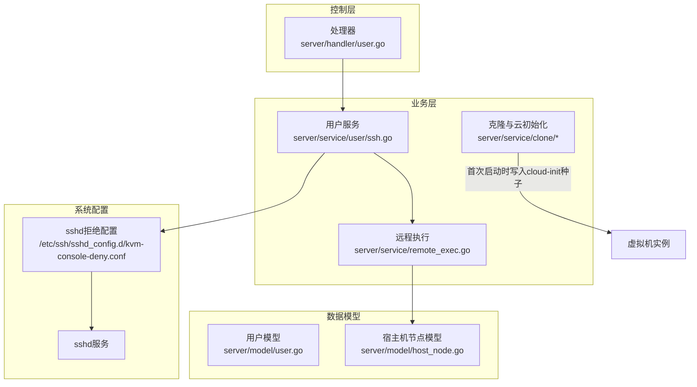
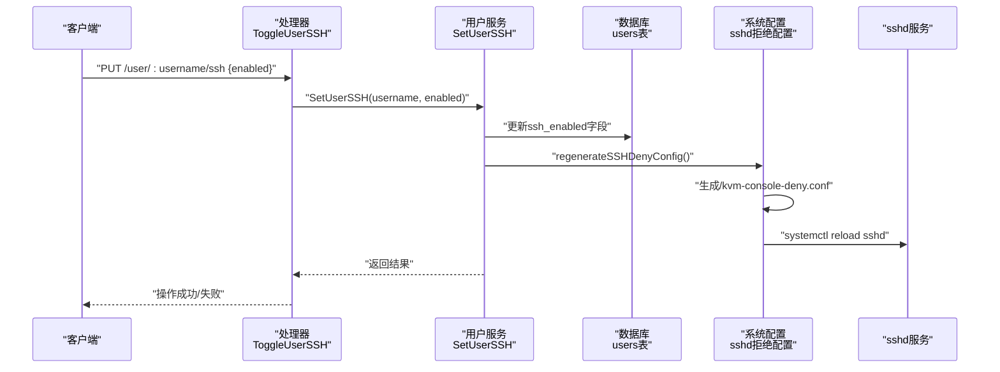
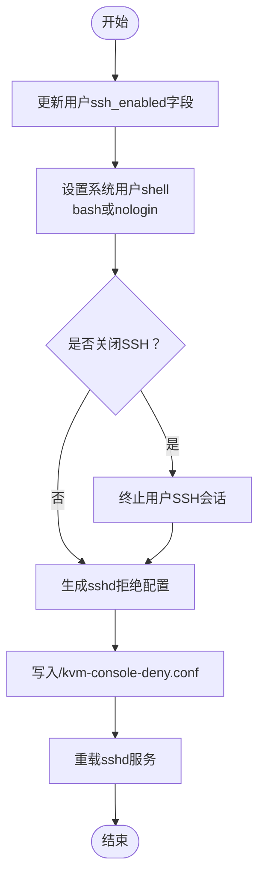
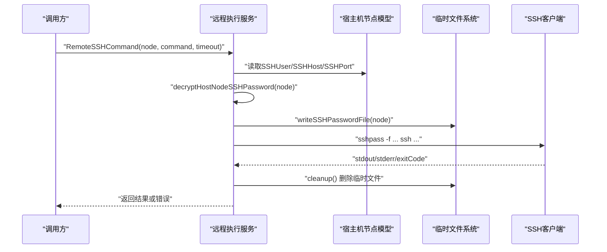
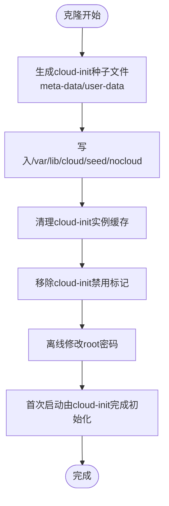
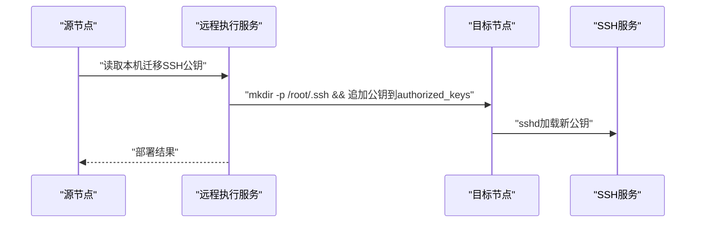
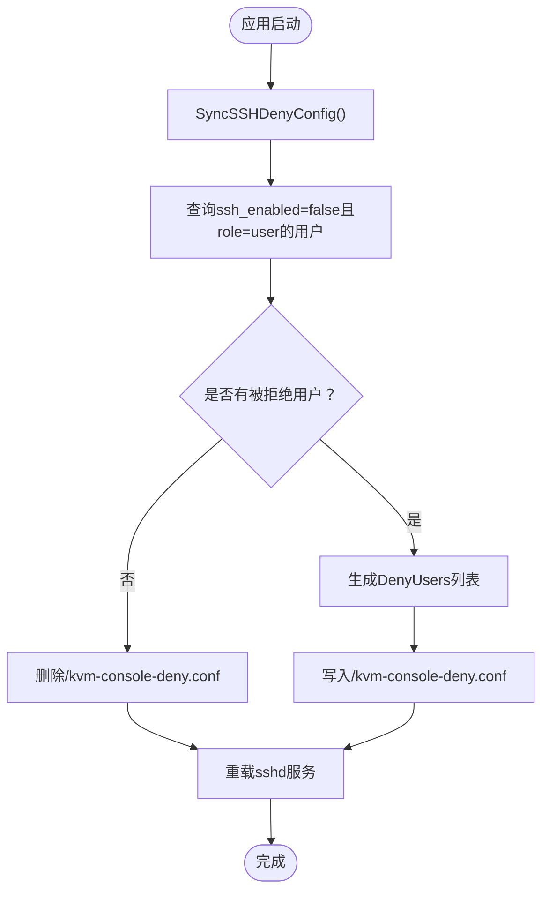
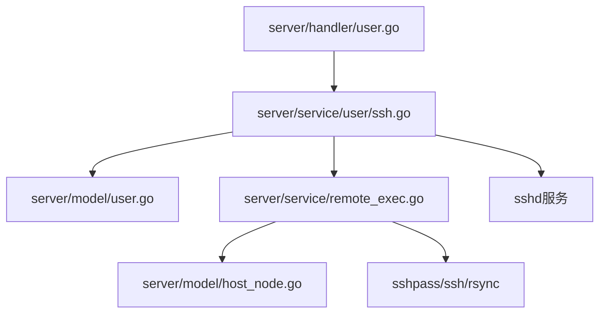

# SSH密钥管理

<cite>
**本文档引用的文件**
- [server/service/user/ssh.go](file://server/service/user/ssh.go)
- [server/handler/user.go](file://server/handler/user.go)
- [server/model/user.go](file://server/model/user.go)
- [server/model/host_node.go](file://server/model/host_node.go)
- [server/service/remote_exec.go](file://server/service/remote_exec.go)
- [server/service/clone/linux_cloudinit.go](file://server/service/clone/linux_cloudinit.go)
- [server/service/clone/linux_init.go](file://server/service/clone/linux_init.go)
- [server/main.go](file://server/main.go)
</cite>

## 目录
1. [简介](#简介)
2. [项目结构](#项目结构)
3. [核心组件](#核心组件)
4. [架构概览](#架构概览)
5. [详细组件分析](#详细组件分析)
6. [依赖分析](#依赖分析)
7. [性能考虑](#性能考虑)
8. [故障排除指南](#故障排除指南)
9. [结论](#结论)

## 简介
本文件面向Open虚拟机管理控制台的SSH密钥管理，系统性阐述以下主题：
- SSH公钥的添加、删除与管理流程
- SSH密钥在虚拟机中的部署机制与自动配置过程
- SSH访问控制策略（基于密钥认证与访问权限管理）
- SSH密钥的安全存储与传输保护措施
- 最佳实践与故障排除指南

需要特别说明的是：当前代码库未发现显式的“SSH私钥管理”逻辑（例如生成、导入、删除私钥）。系统通过“公钥部署到受管主机的authorized_keys”以及“基于sshd拒绝列表的访问控制”实现SSH访问管理。因此，本文档严格依据仓库实际实现进行说明。

## 项目结构
围绕SSH密钥管理的相关模块分布如下：
- 控制层：HTTP路由与处理器，负责接收用户请求并调用业务服务
- 业务层：用户SSH访问开关、系统级sshd配置生成与重载
- 数据模型：用户与宿主机节点的SSH相关字段
- 远程执行：通过SSH执行命令与文件同步
- 虚拟机克隆与云初始化：通过cloud-init在首次启动时完成系统初始化，避免对SSH的强依赖

**图表来源**
- [server/handler/user.go:710-743](file://server/handler/user.go#L710-L743)
- [server/service/user/ssh.go:20-117](file://server/service/user/ssh.go#L20-L117)
- [server/service/remote_exec.go:49-115](file://server/service/remote_exec.go#L49-L115)
- [server/model/user.go:46](file://server/model/user.go#L46)
- [server/model/host_node.go:12-15](file://server/model/host_node.go#L12-L15)

**章节来源**
- [server/handler/user.go:710-743](file://server/handler/user.go#L710-L743)
- [server/service/user/ssh.go:20-117](file://server/service/user/ssh.go#L20-L117)
- [server/service/remote_exec.go:49-115](file://server/service/remote_exec.go#L49-L115)
- [server/model/user.go:46](file://server/model/user.go#L46)
- [server/model/host_node.go:12-15](file://server/model/host_node.go#L12-L15)

## 核心组件
- 用户SSH访问控制服务：提供启用/禁用用户SSH访问的能力，并通过系统级sshd拒绝配置实现即时生效
- 宿主机节点SSH连接服务：封装SSH命令执行与文件同步，支持凭据安全写入临时文件并执行
- 虚拟机克隆与云初始化：通过cloud-init在首次启动时完成系统初始化，减少对SSH的依赖
- 数据模型：用户与宿主机节点的SSH相关字段，支撑访问控制与远程执行

**章节来源**
- [server/service/user/ssh.go:20-117](file://server/service/user/ssh.go#L20-L117)
- [server/service/remote_exec.go:49-115](file://server/service/remote_exec.go#L49-L115)
- [server/model/user.go:46](file://server/model/user.go#L46)
- [server/model/host_node.go:12-15](file://server/model/host_node.go#L12-L15)

## 架构概览
下图展示SSH访问控制与密钥部署的关键交互路径：

**图表来源**
- [server/handler/user.go:710-743](file://server/handler/user.go#L710-L743)
- [server/service/user/ssh.go:20-117](file://server/service/user/ssh.go#L20-L117)

## 详细组件分析

### 用户SSH访问控制服务
- 功能职责
  - 更新用户表的SSH访问开关字段
  - 根据开关状态设置系统用户的登录shell（bash或nologin）
  - 关闭SSH时终止该用户的现有会话
  - 重新生成sshd拒绝配置文件并重载服务
- 关键实现要点
  - 拒绝配置采用sshd的drop-in目录，便于集中管理
  - 通过原子写入确保配置一致性
  - 支持多种sshd服务名称（sshd/ssh）以适配不同发行版
  - 同步所有面板用户的shell，确保与数据库状态一致

**图表来源**
- [server/service/user/ssh.go:20-117](file://server/service/user/ssh.go#L20-L117)

**章节来源**
- [server/service/user/ssh.go:20-117](file://server/service/user/ssh.go#L20-L117)
- [server/model/user.go:46](file://server/model/user.go#L46)

### 宿主机节点SSH连接服务
- 功能职责
  - 通过SSH执行任意命令与文件同步
  - 将宿主机节点的SSH密码解密后写入临时文件，避免明文参数传递
  - 提供超时控制与错误清洗（过滤SSH警告信息）
- 关键实现要点
  - 使用sshpass配合临时密码文件执行SSH命令
  - 默认禁用已知主机检查与用户已知主机文件，降低交互与误判
  - 对SSH输出进行清洗，仅保留非警告类错误信息

**图表来源**
- [server/service/remote_exec.go:49-115](file://server/service/remote_exec.go#L49-L115)
- [server/model/host_node.go:12-15](file://server/model/host_node.go#L12-L15)

**章节来源**
- [server/service/remote_exec.go:49-115](file://server/service/remote_exec.go#L49-L115)
- [server/model/host_node.go:12-15](file://server/model/host_node.go#L12-L15)

### 虚拟机克隆与云初始化（减少对SSH的依赖）
- 功能职责
  - 在克隆阶段通过cloud-init NoCloud种子文件离线注入系统初始化信息
  - 无需SSH即可完成主机名、用户、密码等配置
- 关键实现要点
  - 生成meta-data与user-data并写入种子目录
  - 清理cloud-init缓存与安装器遗留配置，确保首次启动强制初始化
  - 通过virt-customize离线修改密码，避免依赖SSH交互

**图表来源**
- [server/service/clone/linux_cloudinit.go:58-82](file://server/service/clone/linux_cloudinit.go#L58-L82)
- [server/service/clone/linux_init.go:9-13](file://server/service/clone/linux_init.go#L9-L13)

**章节来源**
- [server/service/clone/linux_cloudinit.go:58-82](file://server/service/clone/linux_cloudinit.go#L58-L82)
- [server/service/clone/linux_init.go:9-13](file://server/service/clone/linux_init.go#L9-L13)

### SSH公钥部署机制与自动配置
- 当前实现现状
  - 代码库未发现显式“导入/删除/管理”SSH私钥的逻辑
  - 通过“读取本机迁移SSH公钥并在目标主机authorized_keys中追加”实现公钥部署
  - 该流程用于特定场景（如节点间迁移），并非通用的用户密钥管理
- 关键实现要点
  - 读取公钥后构造命令，确保authorized_keys目录存在且权限正确
  - 使用远程SSH命令执行部署，具备超时控制
  - 对输出进行清洗，避免将SSH警告误判为错误

**图表来源**
- [server/service/remote_exec.go:142-151](file://server/service/remote_exec.go#L142-L151)

**章节来源**
- [server/service/remote_exec.go:142-151](file://server/service/remote_exec.go#L142-L151)

### SSH访问控制策略
- 基于sshd拒绝配置的访问控制
  - 通过扫描数据库中ssh_enabled=false且角色为user的用户，生成DenyUsers列表
  - 将配置写入/etc/ssh/sshd_config.d/kvm-console-deny.conf，确保主配置包含Include指令
  - 重载sshd服务使配置生效，支持两种服务名称（sshd/ssh）
- 启动时同步
  - 应用启动时调用SyncSSHDenyConfig，确保与数据库状态一致

**图表来源**
- [server/service/user/ssh.go:70-117](file://server/service/user/ssh.go#L70-L117)
- [server/main.go:98-99](file://server/main.go#L98-L99)

**章节来源**
- [server/service/user/ssh.go:70-117](file://server/service/user/ssh.go#L70-L117)
- [server/main.go:98-99](file://server/main.go#L98-L99)

## 依赖分析
- 组件耦合
  - 处理器依赖用户服务；用户服务依赖数据库与系统配置；远程执行服务依赖宿主机节点模型与临时文件
- 外部依赖
  - sshd服务与drop-in配置目录
  - sshpass、ssh、rsync等系统工具
  - cloud-init及其种子机制

**图表来源**
- [server/handler/user.go:710-743](file://server/handler/user.go#L710-L743)
- [server/service/user/ssh.go:20-117](file://server/service/user/ssh.go#L20-L117)
- [server/service/remote_exec.go:49-115](file://server/service/remote_exec.go#L49-L115)
- [server/model/user.go:46](file://server/model/user.go#L46)
- [server/model/host_node.go:12-15](file://server/model/host_node.go#L12-L15)

**章节来源**
- [server/handler/user.go:710-743](file://server/handler/user.go#L710-L743)
- [server/service/user/ssh.go:20-117](file://server/service/user/ssh.go#L20-L117)
- [server/service/remote_exec.go:49-115](file://server/service/remote_exec.go#L49-L115)
- [server/model/user.go:46](file://server/model/user.go#L46)
- [server/model/host_node.go:12-15](file://server/model/host_node.go#L12-L15)

## 性能考虑
- 配置重载开销
  - 重载sshd服务通常不中断现有连接，但频繁触发可能带来短暂抖动
- 远程执行超时
  - 远程命令与rsync均设置超时，避免长时间阻塞
- 临时文件清理
  - 通过defer确保临时密码文件及时删除，降低磁盘占用与泄露风险

[本节为通用建议，无需具体文件分析]

## 故障排除指南
- SSH连接失败
  - 现象：返回“SSH连接失败”
  - 排查：确认宿主机节点的SSHUser、SSHHost、SSHPort配置正确；检查网络连通性；查看清洗后的stderr中是否包含真实错误
  - 参考实现位置：[server/service/remote_exec.go:74-85](file://server/service/remote_exec.go#L74-L85)
- 无法写入sshd拒绝配置
  - 现象：写入/kvm-console-deny.conf失败或sshd重载失败
  - 排查：确认drop-in目录存在且有写权限；检查主配置是否包含Include指令；尝试手动重载sshd/ssh服务
  - 参考实现位置：[server/service/user/ssh.go:94-114](file://server/service/user/ssh.go#L94-L114)
- 用户SSH仍可登录
  - 现象：禁用SSH后用户仍可登录
  - 排查：确认数据库中ssh_enabled字段已更新；检查/kvm-console-deny.conf是否生成；验证sshd重载是否成功；必要时调用SyncSSHDenyConfig进行同步
  - 参考实现位置：[server/service/user/ssh.go:152-157](file://server/service/user/ssh.go#L152-L157)
- 公钥未生效
  - 现象：公钥部署后仍无法通过公钥认证
  - 排查：确认公钥内容正确且已追加至/root/.ssh/authorized_keys；检查authorized_keys权限（600）；确认sshd已重载
  - 参考实现位置：[server/service/remote_exec.go:142-151](file://server/service/remote_exec.go#L142-L151)

**章节来源**
- [server/service/remote_exec.go:74-85](file://server/service/remote_exec.go#L74-L85)
- [server/service/user/ssh.go:94-114](file://server/service/user/ssh.go#L94-L114)
- [server/service/user/ssh.go:152-157](file://server/service/user/ssh.go#L152-L157)
- [server/service/remote_exec.go:142-151](file://server/service/remote_exec.go#L142-L151)

## 结论
- 当前系统通过“用户级SSH访问开关 + sshd拒绝配置”的组合实现SSH访问控制，无需依赖用户侧私钥管理
- 通过cloud-init在虚拟机首次启动时完成初始化，显著降低了对SSH的依赖
- 宿主机节点的SSH连接通过临时文件与严格参数化执行保障安全性
- 若需扩展到完整的“用户公钥导入/删除/管理”，可在现有基础上增加API与持久化逻辑，并复用现有的远程执行与安全策略