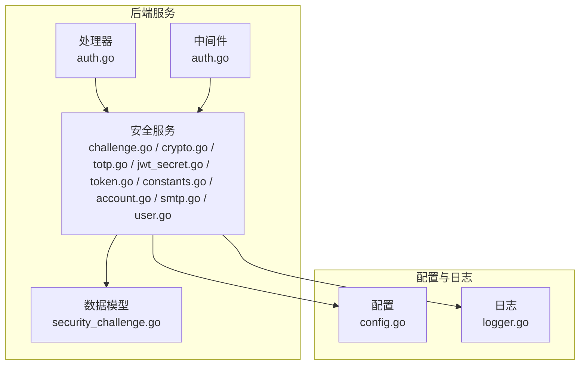
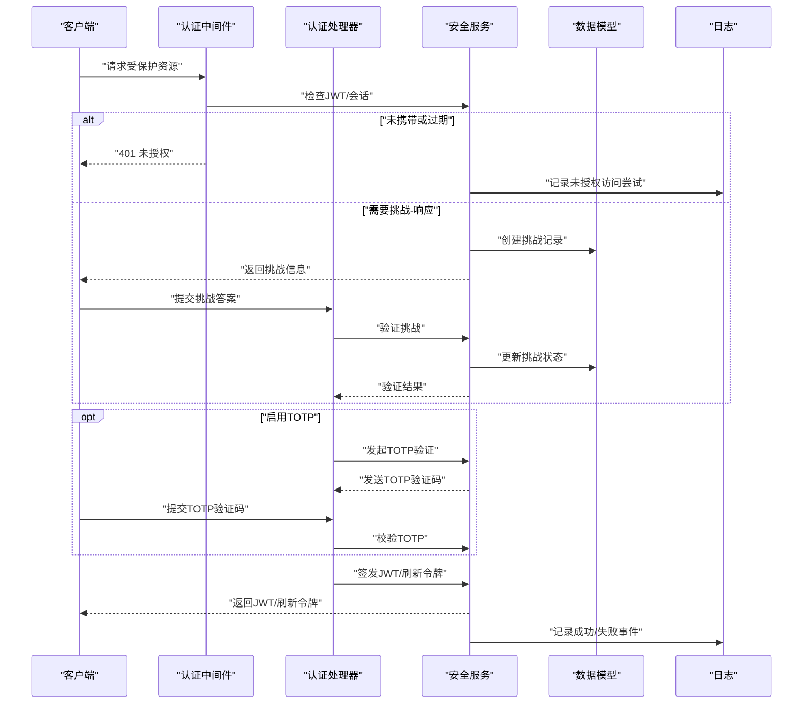
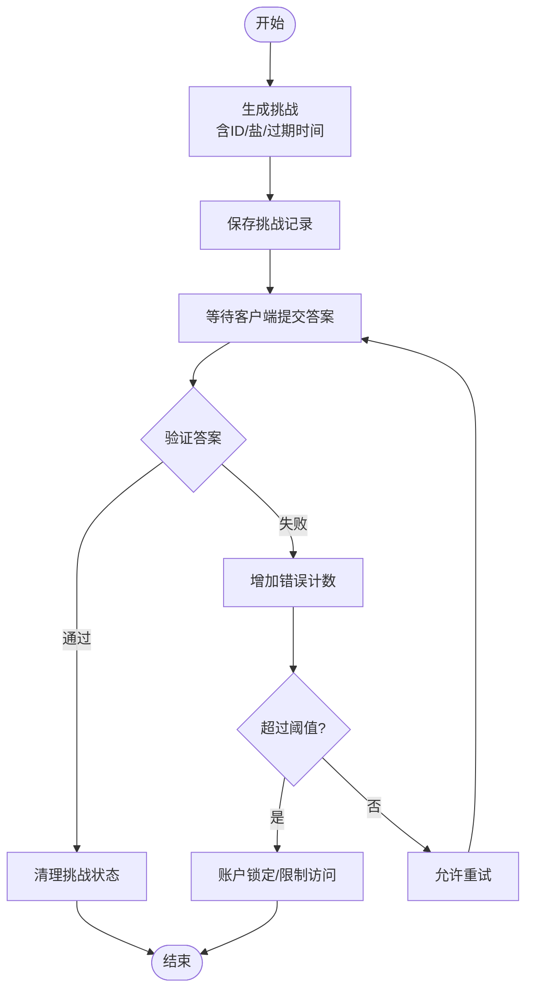
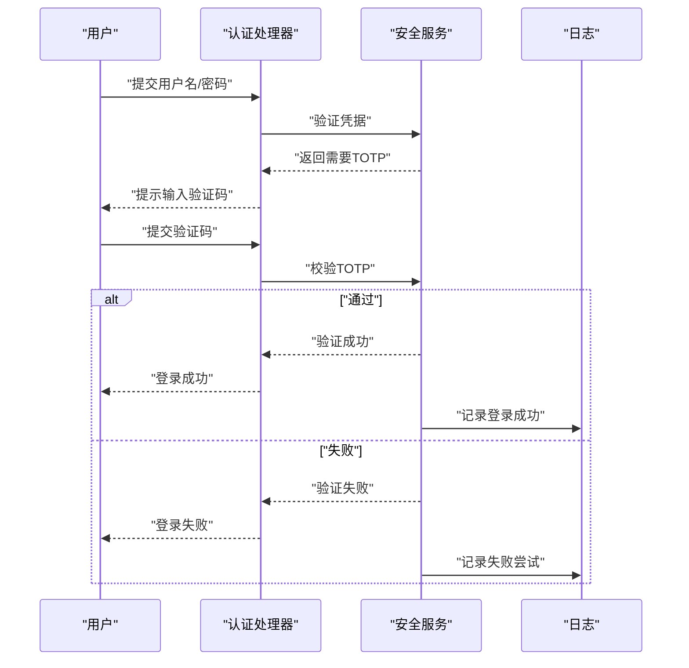
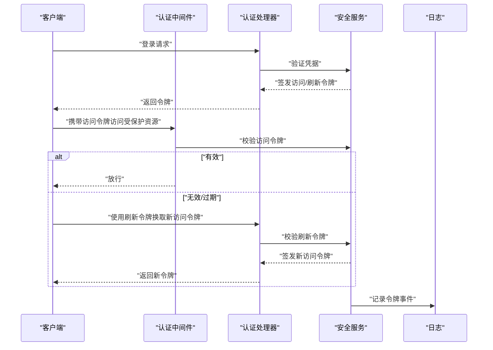
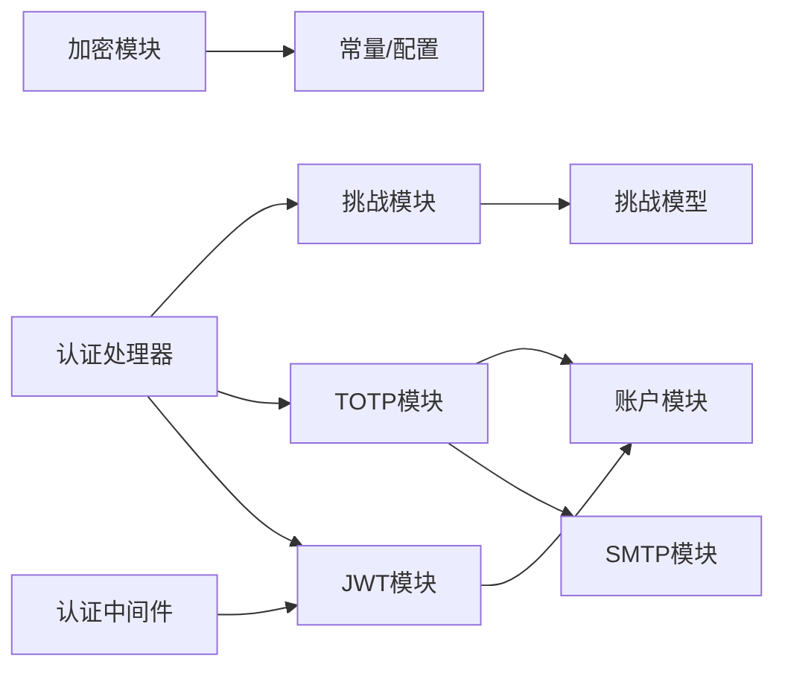

# 安全机制

<cite>
**本文引用的文件**
- [security/challenge.go](file://server/service/security/challenge.go)
- [security/crypto.go](file://server/service/security/crypto.go)
- [security/totp.go](file://server/service/security/totp.go)
- [security/jwt_secret.go](file://server/service/security/jwt_secret.go)
- [security/token.go](file://server/service/security/token.go)
- [security/constants.go](file://server/service/security/constants.go)
- [security/account.go](file://server/service/security/account.go)
- [security/smtp.go](file://server/service/security/smtp.go)
- [security/user.go](file://server/service/security/user.go)
- [model/security_challenge.go](file://server/model/security_challenge.go)
- [handler/auth.go](file://server/handler/auth.go)
- [middleware/auth.go](file://server/middleware/auth.go)
- [config.go](file://server/config/config.go)
- [logger.go](file://server/logger/logger.go)
</cite>

## 目录
1. [引言](#引言)
2. [项目结构](#项目结构)
3. [核心组件](#核心组件)
4. [架构总览](#架构总览)
5. [详细组件分析](#详细组件分析)
6. [依赖关系分析](#依赖关系分析)
7. [性能考虑](#性能考虑)
8. [故障排查指南](#故障排查指南)
9. [结论](#结论)
10. [附录](#附录)

## 引言
本文件系统性梳理Open虚拟机管理控制台的安全机制实现，重点覆盖以下方面：
- 挑战-响应安全机制：挑战类型、生成规则与验证流程
- 加密应用：密码哈希、数据加密与通信加密
- TOTP多因素认证：集成方式与配置要点
- JWT令牌管理与刷新机制
- 安全配置指南与安全审计方法

目标是帮助开发者与运维人员在不深入源码的前提下，准确理解并正确部署与维护系统的安全能力。

## 项目结构
安全相关代码主要分布在以下位置：
- 后端服务层：server/service/security 下的挑战、加密、TOTP、JWT密钥、令牌、常量、账户、SMTP、用户等模块
- 数据模型层：server/model 下的安全挑战模型
- 处理器与中间件：server/handler 与 server/middleware 中的身份认证与访问控制
- 配置与日志：server/config 与 server/logger

图示来源
- [security/challenge.go](file://server/service/security/challenge.go)
- [security/crypto.go](file://server/service/security/crypto.go)
- [security/totp.go](file://server/service/security/totp.go)
- [security/jwt_secret.go](file://server/service/security/jwt_secret.go)
- [security/token.go](file://server/service/security/token.go)
- [security/constants.go](file://server/service/security/constants.go)
- [security/account.go](file://server/service/security/account.go)
- [security/smtp.go](file://server/service/security/smtp.go)
- [security/user.go](file://server/service/security/user.go)
- [model/security_challenge.go](file://server/model/security_challenge.go)
- [handler/auth.go](file://server/handler/auth.go)
- [middleware/auth.go](file://server/middleware/auth.go)
- [config.go](file://server/config/config.go)
- [logger.go](file://server/logger/logger.go)

章节来源
- [security/challenge.go](file://server/service/security/challenge.go)
- [security/crypto.go](file://server/service/security/crypto.go)
- [security/totp.go](file://server/service/security/totp.go)
- [security/jwt_secret.go](file://server/service/security/jwt_secret.go)
- [security/token.go](file://server/service/security/token.go)
- [security/constants.go](file://server/service/security/constants.go)
- [security/account.go](file://server/service/security/account.go)
- [security/smtp.go](file://server/service/security/smtp.go)
- [security/user.go](file://server/service/security/user.go)
- [model/security_challenge.go](file://server/model/security_challenge.go)
- [handler/auth.go](file://server/handler/auth.go)
- [middleware/auth.go](file://server/middleware/auth.go)
- [config.go](file://server/config/config.go)
- [logger.go](file://server/logger/logger.go)

## 核心组件
- 挑战-响应安全机制：通过生成一次性挑战、记录挑战状态并在限定时间内完成验证，降低重放与暴力破解风险
- 密码与数据加密：采用安全的哈希算法保护用户凭据；对敏感数据进行对称加密存储
- 通信加密：通过HTTPS/TLS保障传输层安全（由配置与部署决定）
- TOTP多因素认证：基于时间的一次性验证码，提升登录安全性
- JWT令牌管理：签发、校验与刷新策略，结合短期有效期与刷新令牌
- 账户与SMTP：账户锁定策略、邮件通知与安全事件告警
- 日志与审计：统一日志输出与安全事件记录

章节来源
- [security/challenge.go](file://server/service/security/challenge.go)
- [security/crypto.go](file://server/service/security/crypto.go)
- [security/totp.go](file://server/service/security/totp.go)
- [security/jwt_secret.go](file://server/service/security/jwt_secret.go)
- [security/token.go](file://server/service/security/token.go)
- [security/constants.go](file://server/service/security/constants.go)
- [security/account.go](file://server/service/security/account.go)
- [security/smtp.go](file://server/service/security/smtp.go)
- [security/user.go](file://server/service/security/user.go)
- [model/security_challenge.go](file://server/model/security_challenge.go)
- [handler/auth.go](file://server/handler/auth.go)
- [middleware/auth.go](file://server/middleware/auth.go)
- [config.go](file://server/config/config.go)
- [logger.go](file://server/logger/logger.go)

## 架构总览
下图展示从客户端到后端服务的整体安全交互路径，涵盖挑战生成、TOTP验证、JWT签发与刷新、以及日志审计。

图示来源
- [handler/auth.go](file://server/handler/auth.go)
- [middleware/auth.go](file://server/middleware/auth.go)
- [security/challenge.go](file://server/service/security/challenge.go)
- [security/token.go](file://server/service/security/token.go)
- [security/totp.go](file://server/service/security/totp.go)
- [model/security_challenge.go](file://server/model/security_challenge.go)
- [logger.go](file://server/logger/logger.go)

## 详细组件分析

### 挑战-响应安全机制
- 挑战类型与生成规则
  - 系统在特定安全场景下生成一次性挑战，包含唯一标识、随机盐值与过期时间戳
  - 挑战记录持久化至数据库，防止重复使用与重放攻击
- 验证流程
  - 客户端提交挑战答案，服务端比对计算结果与数据库记录
  - 成功后清理挑战状态；失败累计错误次数并触发账户保护策略
- 错误处理与审计
  - 所有验证尝试均写入日志，便于追踪与审计

图示来源
- [security/challenge.go](file://server/service/security/challenge.go)
- [model/security_challenge.go](file://server/model/security_challenge.go)
- [logger.go](file://server/logger/logger.go)

章节来源
- [security/challenge.go](file://server/service/security/challenge.go)
- [model/security_challenge.go](file://server/model/security_challenge.go)
- [logger.go](file://server/logger/logger.go)

### 加密算法应用
- 密码哈希
  - 使用安全的单向哈希算法对用户密码进行加盐哈希存储
  - 登录时仅比较哈希值，不存储明文密码
- 数据加密
  - 对敏感字段（如API密钥、私有配置）采用对称加密算法进行存储
  - 加密密钥由安全的密钥管理策略生成与轮换
- 通信加密
  - 建议通过反向代理或Web服务器启用TLS，确保传输层安全
  - 本节为通用指导，具体TLS配置由部署环境负责

章节来源
- [security/crypto.go](file://server/service/security/crypto.go)
- [security/constants.go](file://server/service/security/constants.go)
- [config.go](file://server/config/config.go)

### TOTP多因素认证
- 集成方式
  - 用户绑定TOTP密钥后，登录流程中除用户名/密码外，还需输入动态验证码
  - 验证码按时间窗口滚动，通常每30秒变化一次
- 配置方法
  - 生成用户TOTP密钥并下发至认证客户端（如Google Authenticator）
  - 在登录接口中增加TOTP二次验证步骤
  - 可选：支持备份验证码用于应急恢复
- 安全建议
  - 严格限制TOTP验证失败次数
  - 记录所有TOTP验证事件，异常行为触发告警

图示来源
- [security/totp.go](file://server/service/security/totp.go)
- [handler/auth.go](file://server/handler/auth.go)
- [logger.go](file://server/logger/logger.go)

章节来源
- [security/totp.go](file://server/service/security/totp.go)
- [handler/auth.go](file://server/handler/auth.go)
- [logger.go](file://server/logger/logger.go)

### JWT令牌管理与刷新机制
- 令牌签发
  - 登录成功后签发短期有效的访问令牌；同时可签发长期有效的刷新令牌
  - 访问令牌用于日常受保护资源访问；刷新令牌用于在过期后换取新的访问令牌
- 令牌校验
  - 中间件对请求头中的访问令牌进行解析与签名验证
  - 若访问令牌无效或过期，则要求使用刷新令牌重新获取
- 刷新流程
  - 使用刷新令牌换取新的访问令牌，并可选择更新刷新令牌
  - 刷新令牌同样具备有效期与撤销机制，避免长期滥用
- 安全策略
  - 严格限制刷新令牌的使用范围与频率
  - 记录所有令牌签发与刷新事件，异常行为触发审计告警

图示来源
- [security/token.go](file://server/service/security/token.go)
- [security/jwt_secret.go](file://server/service/security/jwt_secret.go)
- [middleware/auth.go](file://server/middleware/auth.go)
- [handler/auth.go](file://server/handler/auth.go)
- [logger.go](file://server/logger/logger.go)

章节来源
- [security/token.go](file://server/service/security/token.go)
- [security/jwt_secret.go](file://server/service/security/jwt_secret.go)
- [middleware/auth.go](file://server/middleware/auth.go)
- [handler/auth.go](file://server/handler/auth.go)
- [logger.go](file://server/logger/logger.go)

### 账户与SMTP安全
- 账户保护
  - 连续失败登录达到阈值后，临时锁定账户或提高后续验证强度
  - 支持管理员手动解锁与审计日志查询
- SMTP集成
  - 通过SMTP通道发送安全通知（如登录异常、TOTP变更等）
  - 配置需启用TLS与强认证，避免明文传输
- 用户与权限
  - 用户角色与权限最小化原则，避免越权操作
  - 定期审查用户活跃度与权限分配

章节来源
- [security/account.go](file://server/service/security/account.go)
- [security/smtp.go](file://server/service/security/smtp.go)
- [security/user.go](file://server/service/security/user.go)

## 依赖关系分析
安全模块内部依赖清晰，职责分离明确：
- 挑战模块依赖数据模型以持久化挑战状态
- 加密模块依赖常量与配置以确定算法与参数
- TOTP与JWT模块依赖账户与SMTP模块以完成用户生命周期与通知
- 处理器与中间件依赖安全模块以执行认证与授权

图示来源
- [security/challenge.go](file://server/service/security/challenge.go)
- [model/security_challenge.go](file://server/model/security_challenge.go)
- [security/crypto.go](file://server/service/security/crypto.go)
- [security/constants.go](file://server/service/security/constants.go)
- [security/totp.go](file://server/service/security/totp.go)
- [security/account.go](file://server/service/security/account.go)
- [security/smtp.go](file://server/service/security/smtp.go)
- [security/token.go](file://server/service/security/token.go)
- [handler/auth.go](file://server/handler/auth.go)
- [middleware/auth.go](file://server/middleware/auth.go)

章节来源
- [security/challenge.go](file://server/service/security/challenge.go)
- [model/security_challenge.go](file://server/model/security_challenge.go)
- [security/crypto.go](file://server/service/security/crypto.go)
- [security/constants.go](file://server/service/security/constants.go)
- [security/totp.go](file://server/service/security/totp.go)
- [security/account.go](file://server/service/security/account.go)
- [security/smtp.go](file://server/service/security/smtp.go)
- [security/token.go](file://server/service/security/token.go)
- [handler/auth.go](file://server/handler/auth.go)
- [middleware/auth.go](file://server/middleware/auth.go)

## 性能考虑
- 挑战-响应
  - 控制挑战有效期与清理周期，避免数据库膨胀
  - 对频繁验证失败的IP或账户实施速率限制
- 加密
  - 选择适合业务吞吐量的加密参数，平衡安全与性能
  - 对热点数据可引入缓存，但需注意缓存中的敏感信息保护
- TOTP与JWT
  - 合理设置TOTP窗口与JWT有效期，减少不必要的刷新
  - 刷新令牌应具备撤销能力，避免被长期持有
- 日志
  - 审计日志异步落盘，避免阻塞主业务流程

## 故障排查指南
- 挑战-响应
  - 症状：客户端无法收到挑战或验证失败
  - 排查：检查挑战模型是否正常创建与清理；核对时间同步与过期逻辑
- 加密
  - 症状：登录失败或数据解密异常
  - 排查：确认哈希算法与密钥版本；检查配置项是否一致
- TOTP
  - 症状：验证码不生效
  - 排查：确认时间同步；检查TOTP密钥绑定与窗口偏移
- JWT
  - 症状：频繁要求刷新或刷新失败
  - 排查：检查刷新令牌有效性与签名；核对密钥轮换策略
- 日志
  - 症状：审计缺失或日志量过大
  - 排查：检查日志级别与轮转配置；定位高频事件并优化

章节来源
- [security/challenge.go](file://server/service/security/challenge.go)
- [security/crypto.go](file://server/service/security/crypto.go)
- [security/totp.go](file://server/service/security/totp.go)
- [security/token.go](file://server/service/security/token.go)
- [logger.go](file://server/logger/logger.go)

## 结论
本系统通过挑战-响应、密码哈希、数据加密、TOTP多因子认证与JWT令牌管理等手段构建了完整的安全体系。配合严格的账户保护与SMTP通知、完善的日志审计，能够有效抵御常见安全威胁。建议在生产环境中结合部署实践完善TLS、密钥轮换与访问控制策略，并持续进行安全评估与审计。

## 附录
- 安全配置清单
  - 启用HTTPS与强TLS参数
  - 设置合理的挑战有效期与清理周期
  - 配置TOTP与邮箱通知
  - 设定JWT有效期与刷新策略
  - 开启审计日志并定期归档
- 安全审计方法
  - 定期检查登录与令牌事件日志
  - 监控异常失败率与地理位置分布
  - 审视账户锁定与权限变更记录
  - 验证密钥轮换与加密参数合规性