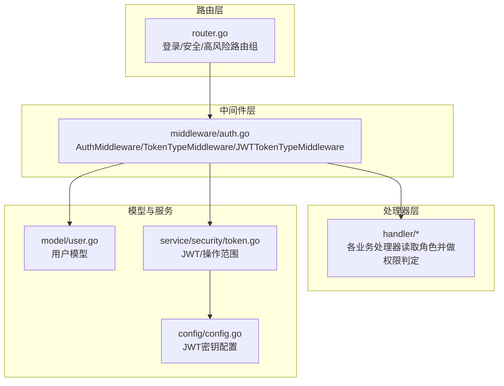
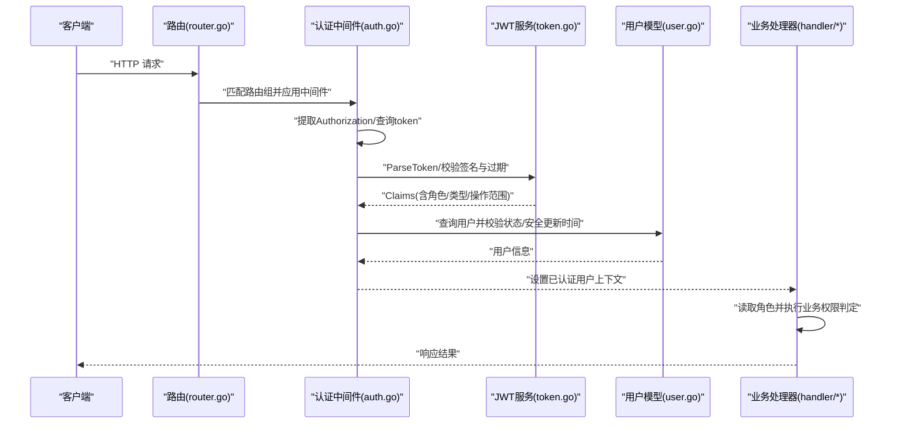
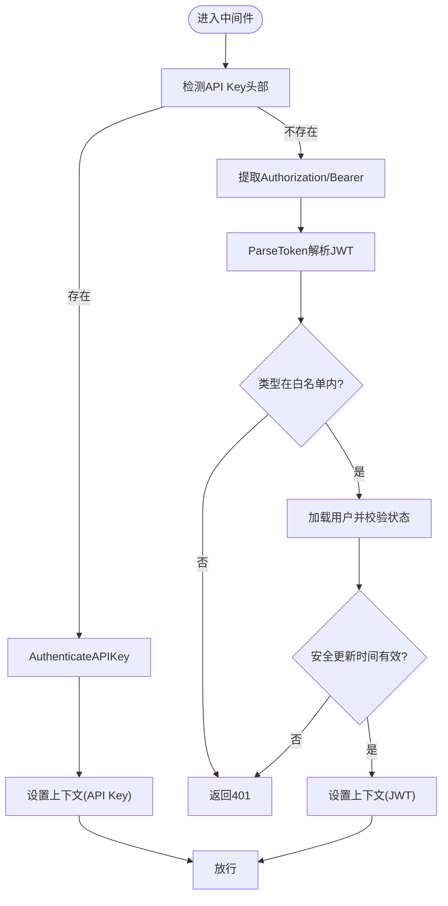
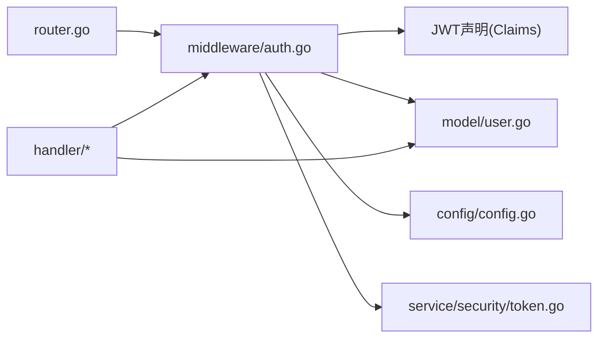

# 权限控制系统

<cite>
**本文引用的文件**
- [server/router/router.go](file://server/router/router.go)
- [server/middleware/auth.go](file://server/middleware/auth.go)
- [server/handler/auth.go](file://server/handler/auth.go)
- [server/model/user.go](file://server/model/user.go)
- [server/service/security/token.go](file://server/service/security/token.go)
- [server/service/security/jwt_secret.go](file://server/service/security/jwt_secret.go)
- [server/config/config.go](file://server/config/config.go)
- [server/handler/vm.go](file://server/handler/vm.go)
- [server/handler/network.go](file://server/handler/network.go)
- [server/handler/disk.go](file://server/handler/disk.go)
- [server/handler/clone.go](file://server/handler/clone.go)
</cite>

## 目录
1. [引言](#引言)
2. [项目结构](#项目结构)
3. [核心组件](#核心组件)
4. [架构总览](#架构总览)
5. [详细组件分析](#详细组件分析)
6. [依赖关系分析](#依赖关系分析)
7. [性能考虑](#性能考虑)
8. [故障排查指南](#故障排查指南)
9. [结论](#结论)
10. [附录](#附录)

## 引言
本文件面向Open虚拟机管理控制台的权限控制系统，聚焦于基于角色的访问控制（RBAC）模型在代码中的实现方式。内容涵盖角色定义、权限映射、访问决策机制、权限继承与组合策略、API级别权限验证流程与中间件实现、资源级权限控制（虚拟机、网络、存储等），并提供权限配置示例与调试方法。

## 项目结构
权限控制体系由“路由分组 + 中间件 + 处理器”三层协作构成：
- 路由层：按业务域与安全强度划分多个路由组，绑定不同认证/授权策略。
- 中间件层：统一处理令牌解析、类型校验、用户状态检查、会话有效性校验。
- 处理器层：在具体业务逻辑中读取用户角色并进行细粒度权限判断。

图表来源
- [server/router/router.go:54-86](file://server/router/router.go#L54-L86)
- [server/middleware/auth.go:75-199](file://server/middleware/auth.go#L75-L199)
- [server/model/user.go](file://server/model/user.go)
- [server/service/security/token.go](file://server/service/security/token.go)
- [server/config/config.go](file://server/config/config.go)

章节来源
- [server/router/router.go:54-86](file://server/router/router.go#L54-L86)
- [server/middleware/auth.go:75-199](file://server/middleware/auth.go#L75-L199)

## 核心组件
- 角色与用户模型
  - 用户模型包含角色字段，处理器通过上下文读取角色执行判定。
- 令牌与声明
  - JWT声明包含用户标识、用户名、角色、令牌类型、操作范围、签发/过期时间等。
  - 支持生成带操作范围的令牌，用于限定特定操作的访问范围。
- 中间件链路
  - 统一从请求头或查询参数提取令牌；解析后校验类型、用户存在性、状态、安全更新时间等。
  - 支持API Key与JWT两种认证方式，且可按路由组限制只允许JWT或API Key。

章节来源
- [server/model/user.go](file://server/model/user.go)
- [server/middleware/auth.go:38-73](file://server/middleware/auth.go#L38-L73)
- [server/middleware/auth.go:80-199](file://server/middleware/auth.go#L80-L199)
- [server/service/security/token.go](file://server/service/security/token.go)
- [server/config/config.go](file://server/config/config.go)

## 架构总览
下图展示从HTTP请求到业务处理的完整权限验证路径，包括路由分组、中间件拦截、令牌解析与用户状态校验、以及处理器内的角色判定。

图表来源
- [server/router/router.go:54-86](file://server/router/router.go#L54-L86)
- [server/middleware/auth.go:90-199](file://server/middleware/auth.go#L90-L199)
- [server/service/security/token.go](file://server/service/security/token.go)
- [server/model/user.go](file://server/model/user.go)

## 详细组件分析

### 路由与中间件：按安全强度分层
- 登录中间态验证组
  - 仅允许登录态令牌访问，用于发送验证码、校验登录阶段等。
- 安全初始化与安全设置组
  - 使用JWT访问令牌并允许引导流程（bootstrap）。
- 高风险验证组
  - 严格要求正式访问令牌，用于个人信息、API Key轮换、密码修改等敏感操作。

章节来源
- [server/router/router.go:54-86](file://server/router/router.go#L54-L86)

### 中间件：令牌解析与访问控制
- 令牌类型过滤
  - 支持按类型白名单放行，避免错误类型的令牌访问。
- API Key与JWT双通道
  - 若检测到API Key头部，则走API Key认证流程；否则走JWT解析。
- 用户状态与安全更新校验
  - 检查用户是否存在、是否启用、访问令牌是否针对最近的安全变更有效。

图表来源
- [server/middleware/auth.go:90-199](file://server/middleware/auth.go#L90-L199)

章节来源
- [server/middleware/auth.go:75-199](file://server/middleware/auth.go#L75-L199)

### 令牌与声明：角色与操作范围
- 声明字段
  - 包含用户ID、用户名、角色、令牌类型、操作范围、签发/过期时间。
- 操作范围令牌
  - 可生成带操作范围的访问令牌，用于限定特定操作的访问边界。
- 密钥管理
  - JWT密钥来自全局配置，确保签名一致性与安全性。

章节来源
- [server/middleware/auth.go:38-73](file://server/middleware/auth.go#L38-L73)
- [server/service/security/token.go](file://server/service/security/token.go)
- [server/config/config.go](file://server/config/config.go)

### 处理器：基于角色的资源级权限
- 角色读取
  - 在处理器中通过上下文读取角色，并据此决定是否允许操作。
- 典型场景
  - 虚拟机：普通用户仅能操作自身实例，管理员可跨域操作。
  - 网络：普通用户仅能管理自有网络，管理员可全局管理。
  - 存储：普通用户仅能操作自身卷，管理员可跨域操作。
  - 克隆/快照：根据角色限制可见性与操作范围。

章节来源
- [server/handler/vm.go](file://server/handler/vm.go)
- [server/handler/network.go:28-233](file://server/handler/network.go#L28-L233)
- [server/handler/disk.go:234-331](file://server/handler/disk.go#L234-L331)
- [server/handler/clone.go:143-144](file://server/handler/clone.go#L143-L144)
- [server/handler/clone.go:246](file://server/handler/clone.go#L246)
- [server/handler/clone.go:293](file://server/handler/clone.go#L293)
- [server/handler/clone.go:324-325](file://server/handler/clone.go#L324-L325)
- [server/handler/clone.go:397](file://server/handler/clone.go#L397)
- [server/handler/clone.go:468-469](file://server/handler/clone.go#L468-L469)

### RBAC模型与权限映射
- 角色定义
  - 系统使用字符串角色标识（如admin、user），处理器据此进行权限判定。
- 权限映射
  - 不同路由组绑定不同令牌类型策略；处理器内部再按角色细化。
- 权限继承与组合
  - 当前实现以“角色=admin时拥有最高权限”的简单继承策略为主；其他角色遵循最小权限原则。
  - 权限组合通过“路由组+角色+操作范围令牌”共同约束。

章节来源
- [server/handler/auth.go:24](file://server/handler/auth.go#L24)
- [server/handler/auth.go:213](file://server/handler/auth.go#L213)
- [server/router/router.go:54-86](file://server/router/router.go#L54-L86)
- [server/middleware/auth.go:38-73](file://server/middleware/auth.go#L38-L73)

## 依赖关系分析
- 路由依赖中间件：每个路由组选择性地绑定不同中间件，形成“按需加固”的安全策略。
- 中间件依赖服务与配置：中间件依赖JWT解析、API Key认证、用户模型与配置。
- 处理器依赖中间件上下文：处理器从上下文中读取用户与角色，执行业务权限判定。

图表来源
- [server/router/router.go:54-86](file://server/router/router.go#L54-L86)
- [server/middleware/auth.go:75-199](file://server/middleware/auth.go#L75-L199)
- [server/model/user.go](file://server/model/user.go)
- [server/service/security/token.go](file://server/service/security/token.go)
- [server/config/config.go](file://server/config/config.go)

章节来源
- [server/router/router.go:54-86](file://server/router/router.go#L54-L86)
- [server/middleware/auth.go:75-199](file://server/middleware/auth.go#L75-L199)

## 性能考虑
- 中间件开销
  - 令牌解析与用户查询为O(1)+数据库单点查询，整体开销较小。
- 缓存建议
  - 对频繁访问的用户状态与角色可引入本地缓存，减少数据库压力。
- 令牌有效期
  - 合理设置令牌TTL，平衡安全与性能；对长连接场景可采用刷新令牌机制。

## 故障排查指南
- 常见错误与定位
  - 未登录/认证格式无效：检查Authorization头或查询参数token格式。
  - Token无效或已过期：确认签名密钥一致与时间同步。
  - 账号被禁用/未激活：检查用户状态与安全更新时间。
  - 接口不支持API Key：确认路由组是否允许API Key或JWT类型。
- 调试步骤
  - 打印中间件解析后的Claims与用户状态。
  - 核对路由组绑定的中间件类型与白名单。
  - 在处理器中打印角色值，确认权限判定分支。

章节来源
- [server/middleware/auth.go:120-199](file://server/middleware/auth.go#L120-L199)

## 结论
本权限系统以“路由分层 + 中间件统一校验 + 处理器角色判定”为核心，结合JWT声明中的角色与操作范围，实现了灵活可控的RBAC模型。通过API Key与JWT双通道认证、严格的用户状态与安全更新校验，以及按路由组的差异化策略，满足了从登录态到高风险操作的多层级安全需求。后续可在角色继承与权限组合上进一步细化，以适配更复杂的权限矩阵。

## 附录

### 权限配置示例（步骤说明）
- 生成带操作范围的访问令牌
  - 使用服务侧生成函数传入用户ID、角色、令牌类型、操作范围与TTL。
- 设置路由组与中间件
  - 将敏感接口置于高风险组并绑定正式访问令牌中间件。
  - 将引导流程置于安全初始化组并允许引导令牌类型。
- 在处理器中读取角色并判定
  - 从上下文读取角色，按admin/user分别放行或拒绝。

章节来源
- [server/middleware/auth.go:38-73](file://server/middleware/auth.go#L38-L73)
- [server/router/router.go:54-86](file://server/router/router.go#L54-L86)
- [server/handler/vm.go](file://server/handler/vm.go)
- [server/handler/network.go:28-233](file://server/handler/network.go#L28-L233)
- [server/handler/disk.go:234-331](file://server/handler/disk.go#L234-L331)