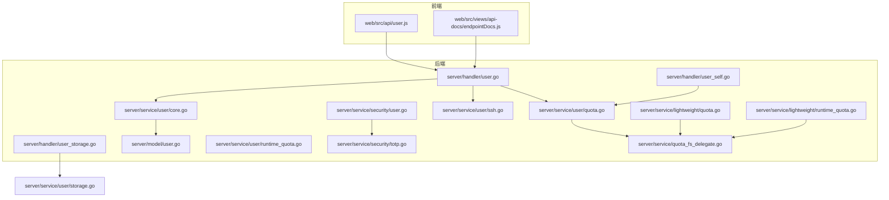
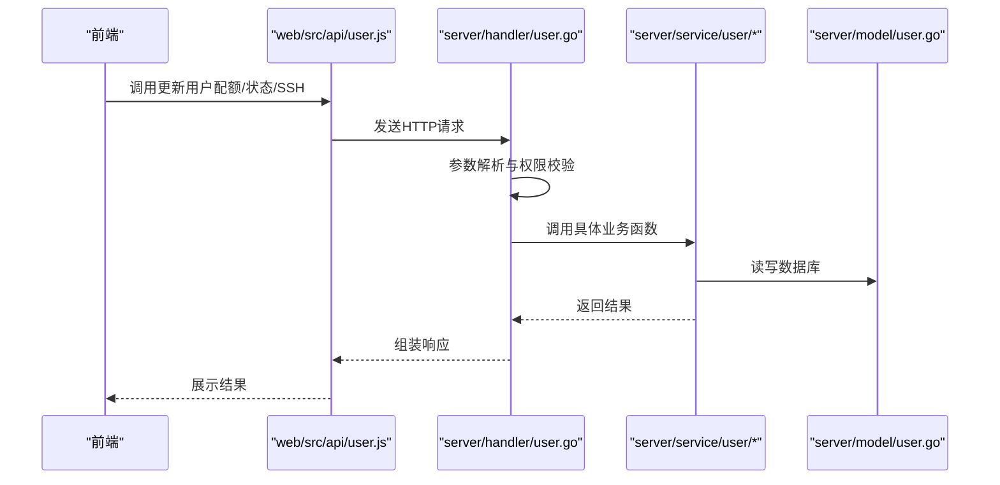
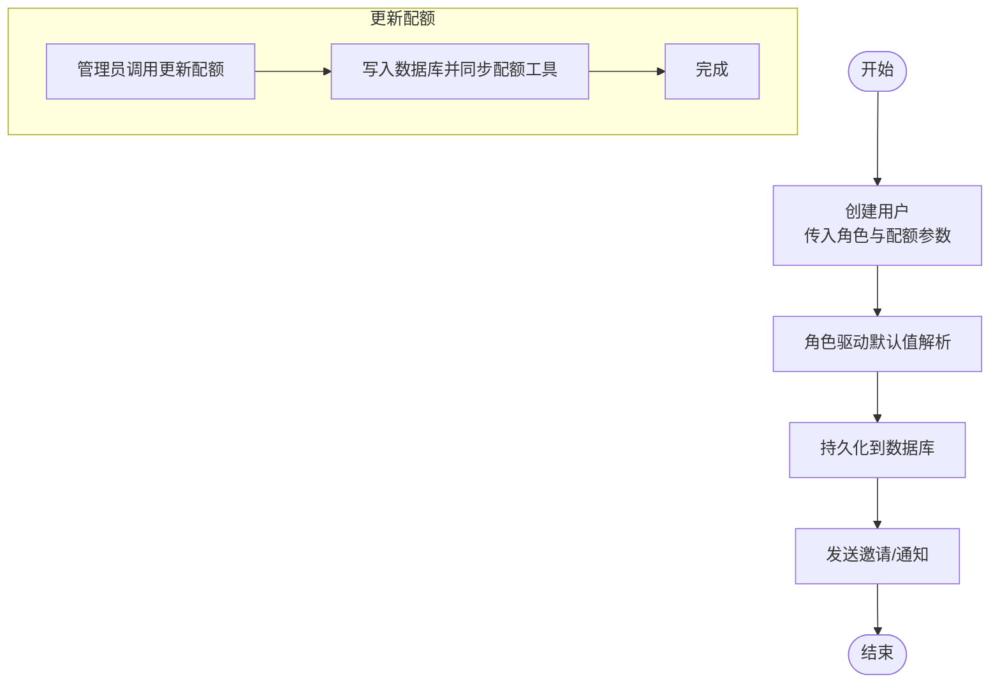
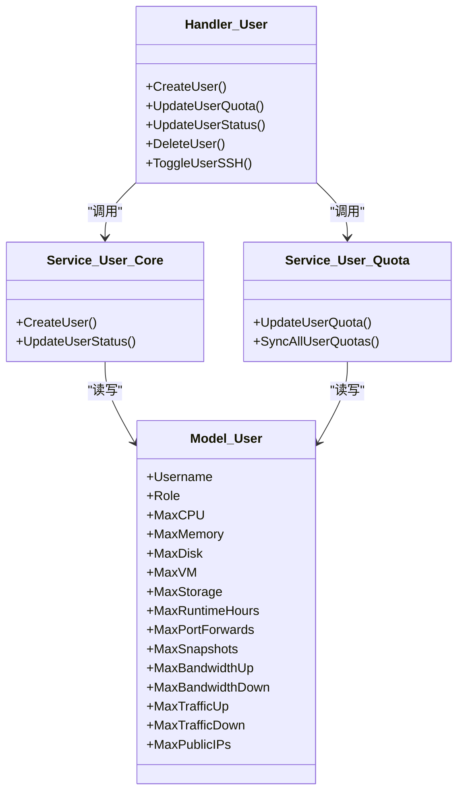
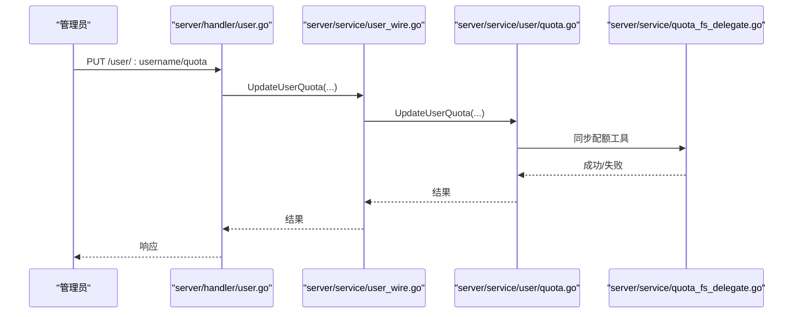
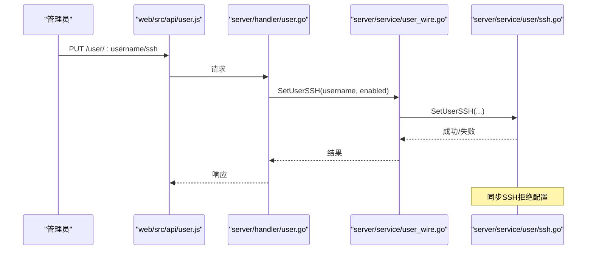
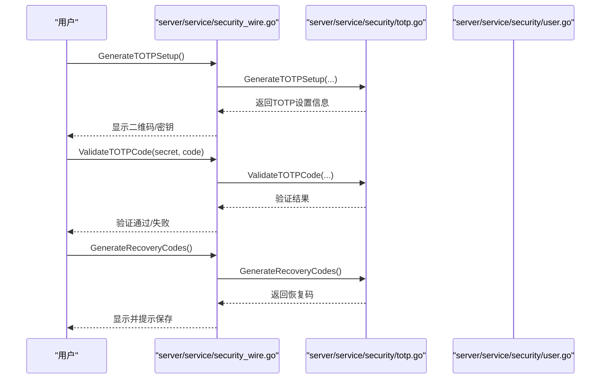
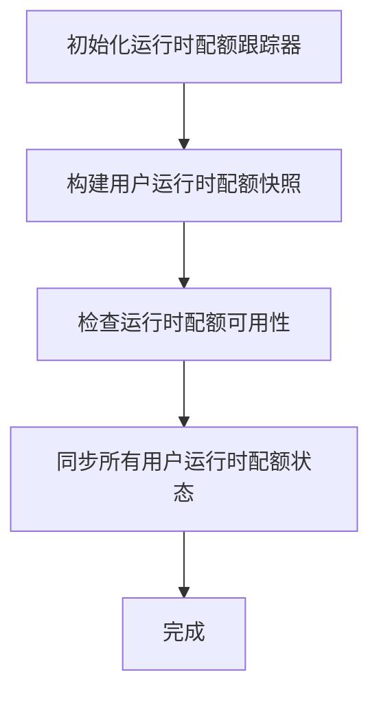
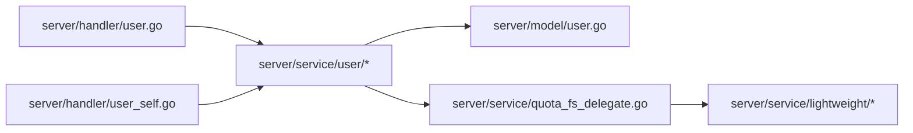

# 用户与权限管理

<cite>
**本文引用的文件**
- [server/handler/user.go](file://server/handler/user.go)
- [server/handler/user_self.go](file://server/handler/user_self.go)
- [server/handler/user_storage.go](file://server/handler/user_storage.go)
- [server/model/user.go](file://server/model/user.go)
- [server/service/user/core.go](file://server/service/user/core.go)
- [server/service/user/assign.go](file://server/service/user/assign.go)
- [server/service/user/quota.go](file://server/service/user/quota.go)
- [server/service/user/runtime_quota.go](file://server/service/user/runtime_quota.go)
- [server/service/user/ssh.go](file://server/service/user/ssh.go)
- [server/service/user/storage.go](file://server/service/user/storage.go)
- [server/service/user/types.go](file://server/service/user/types.go)
- [server/service/user_wire.go](file://server/service/user_wire.go)
- [server/service/security/user.go](file://server/service/security/user.go)
- [server/service/security/totp.go](file://server/service/security/totp.go)
- [server/service/security_wire.go](file://server/service/security_wire.go)
- [web/src/api/user.js](file://web/src/api/user.js)
- [web/src/views/api-docs/endpointDocs.js](file://web/src/views/api-docs/endpointDocs.js)
- [server/middleware/auth.go](file://server/middleware/auth.go)
- [server/handler/auth.go](file://server/handler/auth.go)
- [server/service/quota_fs_delegate.go](file://server/service/quota_fs_delegate.go)
- [server/service/storage/quota/quota.go](file://server/service/storage/quota/quota.go)
- [server/service/network/port_forward_quota.go](file://server/service/network/port_forward_quota.go)
- [server/service/traffic/quota.go](file://server/service/traffic/quota.go)
- [server/service/lightweight/quota.go](file://server/service/lightweight/quota.go)
- [server/service/lightweight/runtime_quota.go](file://server/service/lightweight/runtime_quota.go)
- [server/service/lightweight/traffic.go](file://server/service/lightweight/traffic.go)
- [server/service/lightweight/cloud.go](file://server/service/lightweight/cloud.go)
- [server/service/lightweight/wire.go](file://server/service/lightweight/wire.go)
- [server/service/lightweight/types.go](file://server/service/lightweight/types.go)
- [server/service/lightweight/provision.go](file://server/service/lightweight/provision.go)
- [server/service/lightweight/runtime_quota.go](file://server/service/lightweight/runtime_quota.go)
- [server/service/lightweight/registration.go](file://server/service/lightweight/registration.go)
- [server/service/lightweight/rate_limit.go](file://server/service/lightweight/rate_limit.go)
- [server/service/lightweight/traffic.go](file://server/service/lightweight/traffic.go)
</cite>

## 目录
1. [简介](#简介)
2. [项目结构](#项目结构)
3. [核心组件](#核心组件)
4. [架构总览](#架构总览)
5. [详细组件分析](#详细组件分析)
6. [依赖关系分析](#依赖关系分析)
7. [性能考量](#性能考量)
8. [故障排查指南](#故障排查指南)
9. [结论](#结论)
10. [附录](#附录)

## 简介
本文件面向Open虚拟机管理控制台的“用户与权限管理”主题，系统化梳理用户账户生命周期、权限与角色模型、配额体系、SSH访问控制以及安全挑战与多因素认证（MFA）集成。文档以代码为依据，结合前后端接口与服务层实现，提供可操作的最佳实践与安全配置建议。

## 项目结构
围绕用户与权限管理的关键目录与文件如下：
- 后端处理器：负责HTTP请求解析、鉴权与调用服务层
  - server/handler/user.go：用户管理API入口（创建、更新配额、状态、删除、SSH开关等）
  - server/handler/user_self.go：用户自助查询配额等
  - server/handler/user_storage.go：用户存储相关操作
- 模型层：数据库实体定义
  - server/model/user.go：用户模型
- 服务层：业务逻辑与策略
  - server/service/user/*：用户核心、配额、运行时配额、SSH、存储等
  - server/service/security/*：账号、TOTP、挑战等安全能力
  - server/service/lightweight/*：轻量化云配额与运行时配额
- 前端API封装与接口文档
  - web/src/api/user.js：前端调用后端用户管理接口
  - web/src/views/api-docs/endpointDocs.js：接口清单与风险标注

图表来源
- [server/handler/user.go:1-700](file://server/handler/user.go#L1-L700)
- [server/handler/user_self.go:1-200](file://server/handler/user_self.go#L1-L200)
- [server/handler/user_storage.go:1-300](file://server/handler/user_storage.go#L1-L300)
- [server/model/user.go:1-200](file://server/model/user.go#L1-L200)
- [server/service/user/core.go:1-300](file://server/service/user/core.go#L1-L300)
- [server/service/user/quota.go:1-350](file://server/service/user/quota.go#L1-L350)
- [server/service/user/runtime_quota.go:1-250](file://server/service/user/runtime_quota.go#L1-L250)
- [server/service/user/ssh.go:1-200](file://server/service/user/ssh.go#L1-L200)
- [server/service/security/user.go:1-200](file://server/service/security/user.go#L1-L200)
- [server/service/security/totp.go:1-200](file://server/service/security/totp.go#L1-L200)
- [server/service/lightweight/quota.go:1-200](file://server/service/lightweight/quota.go#L1-L200)
- [server/service/lightweight/runtime_quota.go:1-200](file://server/service/lightweight/runtime_quota.go#L1-L200)
- [server/service/quota_fs_delegate.go:1-100](file://server/service/quota_fs_delegate.go#L1-L100)

章节来源
- [server/handler/user.go:1-700](file://server/handler/user.go#L1-L700)
- [web/src/api/user.js:60-140](file://web/src/api/user.js#L60-L140)
- [web/src/views/api-docs/endpointDocs.js:458-472](file://web/src/views/api-docs/endpointDocs.js#L458-L472)

## 核心组件
- 用户账户管理
  - 创建：支持邀请式创建、角色与配额默认值推断、端口转发与快照上限等
  - 修改：更新配额、状态（启用/禁用）、SSH访问权限
  - 删除：级联清理用户资产与数据
  - 自助：查询个人配额
- 权限与角色
  - 角色在创建时传入；不同角色对默认配额有差异化推断
  - 管理员具备高风险操作权限（如封禁、删除用户）
- 配额管理
  - 计算资源：CPU核数、内存、虚拟机数量
  - 存储空间：磁盘容量、存储池配额
  - 网络带宽与流量：上/下行带宽上限、日流量统计与重置
  - 运行时配额：按小时累计的运行时配额与状态同步
- SSH管理
  - 开关用户SSH权限、同步SSH拒绝配置
- 安全挑战与MFA
  - TOTP设置、验证、恢复码生成与校验
  - 账号安全策略与登录保护

章节来源
- [server/handler/user.go:139-700](file://server/handler/user.go#L139-L700)
- [server/service/user/core.go:1-300](file://server/service/user/core.go#L1-L300)
- [server/service/user/quota.go:1-350](file://server/service/user/quota.go#L1-L350)
- [server/service/user/runtime_quota.go:1-250](file://server/service/user/runtime_quota.go#L1-L250)
- [server/service/user/ssh.go:1-200](file://server/service/user/ssh.go#L1-L200)
- [server/service/security/totp.go:1-200](file://server/service/security/totp.go#L1-L200)
- [server/service/security/user.go:1-200](file://server/service/security/user.go#L1-L200)

## 架构总览
用户与权限管理采用“前端API封装 → 后端处理器 → 服务层 → 数据模型”的分层架构。处理器负责参数校验与鉴权，服务层实现业务规则与配额检查，模型层映射数据库结构。

图表来源
- [web/src/api/user.js:60-140](file://web/src/api/user.js#L60-L140)
- [server/handler/user.go:448-700](file://server/handler/user.go#L448-L700)
- [server/service/user/core.go:1-300](file://server/service/user/core.go#L1-L300)
- [server/model/user.go:1-200](file://server/model/user.go#L1-L200)

## 详细组件分析

### 用户账户管理
- 创建用户
  - 支持邀请式创建，传入用户名、邮箱、角色、云类型、专用交换机ID等
  - 默认配额根据角色推断，包含CPU/内存/磁盘/虚拟机/存储/运行时小时数、端口转发、快照数、带宽与流量上限、公网IP数
  - 处理器对部分字段进行角色驱动的默认值解析
- 更新配额
  - 管理员可调整CPU、内存、磁盘、虚拟机数、存储、运行时小时、端口转发、快照、带宽与流量、公网IP等
  - 服务层执行持久化与配额工具同步
- 更新状态
  - 封禁/解封用户，影响登录与资源使用
- 删除用户
  - 删除用户及其关联资产，前端提供高风险标记
- 自助查询
  - 当前用户查询自身配额

图表来源
- [server/handler/user.go:91-139](file://server/handler/user.go#L91-L139)
- [server/handler/user.go:139-448](file://server/handler/user.go#L139-L448)
- [server/handler/user.go:448-584](file://server/handler/user.go#L448-L584)
- [server/service/user/quota.go:298-350](file://server/service/user/quota.go#L298-L350)

章节来源
- [server/handler/user.go:91-139](file://server/handler/user.go#L91-L139)
- [server/handler/user.go:139-584](file://server/handler/user.go#L139-L584)
- [server/service/user/quota.go:298-350](file://server/service/user/quota.go#L298-L350)

### 权限与角色模型
- 角色在创建时指定，并用于推断默认配额上限
- 管理员拥有高风险操作权限（如封禁、删除），并在接口文档中标注风险等级
- 中间件与处理器共同保证请求的鉴权与授权

图表来源
- [server/handler/user.go:139-700](file://server/handler/user.go#L139-L700)
- [server/service/user/core.go:1-300](file://server/service/user/core.go#L1-L300)
- [server/service/user/quota.go:1-350](file://server/service/user/quota.go#L1-L350)
- [server/model/user.go:1-200](file://server/model/user.go#L1-L200)

章节来源
- [server/handler/user.go:139-700](file://server/handler/user.go#L139-L700)
- [server/middleware/auth.go:1-200](file://server/middleware/auth.go#L1-L200)
- [server/handler/auth.go:1-100](file://server/handler/auth.go#L1-L100)

### 配额管理系统
- 配额类型
  - 计算资源：CPU核数、内存、虚拟机数量
  - 存储空间：磁盘容量、存储池配额
  - 网络带宽与流量：上/下行带宽上限、日流量统计与重置
  - 运行时配额：按小时累计的运行时配额与状态同步
- 实现要点
  - 服务层提供统一的配额更新与同步方法
  - 文件系统配额代理负责与底层配额工具交互
  - 轻量化云模块提供独立的配额与运行时配额实现

图表来源
- [server/handler/user.go:448-584](file://server/handler/user.go#L448-L584)
- [server/service/user_wire.go:296-350](file://server/service/user_wire.go#L296-L350)
- [server/service/user/quota.go:298-350](file://server/service/user/quota.go#L298-L350)
- [server/service/quota_fs_delegate.go:54-76](file://server/service/quota_fs_delegate.go#L54-L76)

章节来源
- [server/service/user/quota.go:1-350](file://server/service/user/quota.go#L1-L350)
- [server/service/quota_fs_delegate.go:54-76](file://server/service/quota_fs_delegate.go#L54-L76)
- [server/service/storage/quota/quota.go:1-120](file://server/service/storage/quota/quota.go#L1-L120)
- [server/service/network/port_forward_quota.go:1-120](file://server/service/network/port_forward_quota.go#L1-L120)
- [server/service/traffic/quota.go:1-120](file://server/service/traffic/quota.go#L1-L120)
- [server/service/lightweight/quota.go:1-200](file://server/service/lightweight/quota.go#L1-L200)
- [server/service/lightweight/runtime_quota.go:1-200](file://server/service/lightweight/runtime_quota.go#L1-L200)

### SSH管理功能
- 功能点
  - 切换用户SSH访问权限
  - 同步SSH拒绝配置，确保策略生效
- 实现路径
  - 前端通过API调用切换SSH权限
  - 服务层提供SetUserSSH、GetUserSSHStatus、SyncSSHDenyConfig等方法

图表来源
- [web/src/api/user.js:105-112](file://web/src/api/user.js#L105-L112)
- [server/handler/user.go:690-700](file://server/handler/user.go#L690-L700)
- [server/service/user_wire.go:391-401](file://server/service/user_wire.go#L391-L401)
- [server/service/user/ssh.go:1-200](file://server/service/user/ssh.go#L1-L200)

章节来源
- [web/src/api/user.js:105-112](file://web/src/api/user.js#L105-L112)
- [server/service/user_wire.go:391-401](file://server/service/user_wire.go#L391-L401)
- [server/service/user/ssh.go:1-200](file://server/service/user/ssh.go#L1-L200)

### 安全挑战与多因素认证（MFA）
- TOTP集成
  - 生成TOTP设置信息、验证TOTP验证码
  - 生成与验证恢复码，查询剩余可用恢复码数量
- 账户安全
  - 安全包提供账号相关能力，配合TOTP实现MFA
- 接口与前端
  - 安全Wire暴露TOTP与账号相关函数，供处理器与服务层调用

图表来源
- [server/service/security_wire.go:183-201](file://server/service/security_wire.go#L183-L201)
- [server/service/security/totp.go:1-200](file://server/service/security/totp.go#L1-L200)
- [server/service/security/user.go:1-200](file://server/service/security/user.go#L1-L200)

章节来源
- [server/service/security_wire.go:183-201](file://server/service/security_wire.go#L183-L201)
- [server/service/security/totp.go:1-200](file://server/service/security/totp.go#L1-L200)
- [server/service/security/user.go:1-200](file://server/service/security/user.go#L1-L200)

### 运行时配额与状态同步
- 运行时配额
  - 初始化运行时配额跟踪器
  - 为用户构建运行时配额快照
  - 提供可用性检查与状态同步
- 轻量化云
  - 提供独立的运行时配额与流量统计实现

图表来源
- [server/service/user_wire.go:405-425](file://server/service/user_wire.go#L405-L425)
- [server/service/user/runtime_quota.go:1-250](file://server/service/user/runtime_quota.go#L1-L250)
- [server/service/lightweight/runtime_quota.go:1-200](file://server/service/lightweight/runtime_quota.go#L1-L200)

章节来源
- [server/service/user_wire.go:405-425](file://server/service/user_wire.go#L405-L425)
- [server/service/user/runtime_quota.go:1-250](file://server/service/user/runtime_quota.go#L1-L250)
- [server/service/lightweight/runtime_quota.go:1-200](file://server/service/lightweight/runtime_quota.go#L1-L200)

## 依赖关系分析
- 处理器依赖服务层：所有用户管理请求最终由服务层实现
- 服务层依赖模型层：持久化用户与配额信息
- 配额同步依赖文件系统代理：将业务配额映射到底层配额工具
- 轻量化云模块与配额代理解耦，便于扩展

图表来源
- [server/handler/user.go:139-700](file://server/handler/user.go#L139-L700)
- [server/service/user/core.go:1-300](file://server/service/user/core.go#L1-L300)
- [server/model/user.go:1-200](file://server/model/user.go#L1-L200)
- [server/service/quota_fs_delegate.go:54-76](file://server/service/quota_fs_delegate.go#L54-L76)
- [server/service/lightweight/quota.go:1-200](file://server/service/lightweight/quota.go#L1-L200)

章节来源
- [server/handler/user.go:139-700](file://server/handler/user.go#L139-L700)
- [server/service/user/core.go:1-300](file://server/service/user/core.go#L1-L300)
- [server/service/quota_fs_delegate.go:54-76](file://server/service/quota_fs_delegate.go#L54-L76)

## 性能考量
- 批量同步配额：通过“同步所有用户配额”减少频繁I/O
- 运行时配额快照：降低实时查询开销
- 轻量化云配额：独立实现避免主线程阻塞
- 建议
  - 定期批量同步配额而非逐条更新
  - 对高频查询的配额数据增加缓存层
  - 控制TOTP与恢复码生成频率，避免密钥泄露风险

## 故障排查指南
- 更新配额失败
  - 检查配额工具是否可用与权限
  - 核对输入参数范围与角色默认值
- SSH权限未生效
  - 确认已调用同步SSH拒绝配置
  - 检查系统SSH服务配置与防火墙策略
- TOTP验证失败
  - 核对时间同步与密钥一致性
  - 检查恢复码是否被消耗或格式错误
- 用户状态异常
  - 确认中间件鉴权链路与处理器权限判断
  - 检查数据库状态字段与业务逻辑一致性

章节来源
- [server/service/quota_fs_delegate.go:51-76](file://server/service/quota_fs_delegate.go#L51-L76)
- [server/service/user_wire.go:399-401](file://server/service/user_wire.go#L399-L401)
- [server/service/security_wire.go:183-201](file://server/service/security_wire.go#L183-L201)
- [server/middleware/auth.go:1-200](file://server/middleware/auth.go#L1-L200)

## 结论
本系统通过清晰的分层架构实现了完整的用户与权限管理：从角色驱动的配额推断，到文件系统配额同步；从SSH访问控制到TOTP/MFA安全增强。建议在生产环境中结合配额缓存、批量同步与严格的审计日志，持续优化用户体验与安全性。

## 附录
- 接口清单与风险标注
  - 更新用户配额、状态、SSH权限、删除用户、重发邀请、重置流量配额等
- 最佳实践
  - 使用角色驱动的配额策略，避免过度授权
  - 定期审查与同步配额，确保与实际资源一致
  - 强制启用MFA，妥善保管恢复码
  - 限制高风险操作的调用频次与范围

章节来源
- [web/src/views/api-docs/endpointDocs.js:458-472](file://web/src/views/api-docs/endpointDocs.js#L458-L472)
- [web/src/api/user.js:64-130](file://web/src/api/user.js#L64-L130)