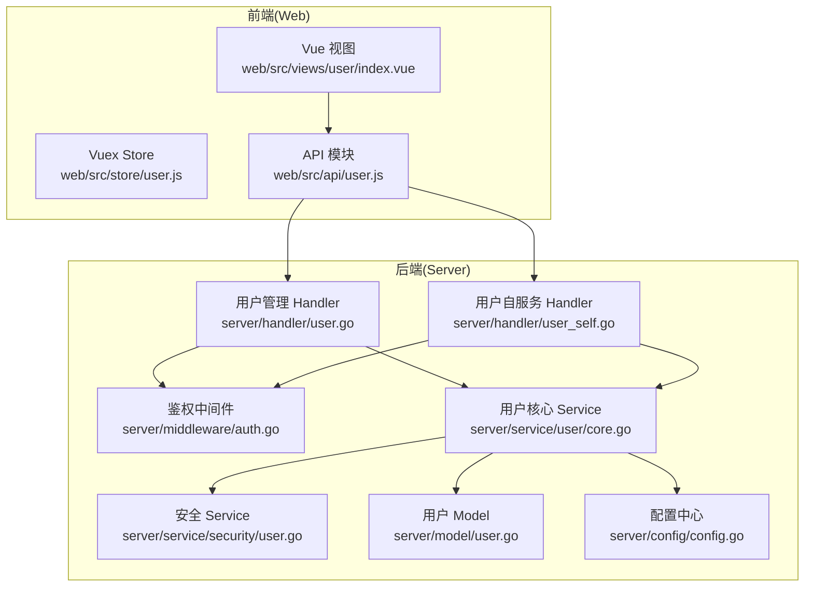
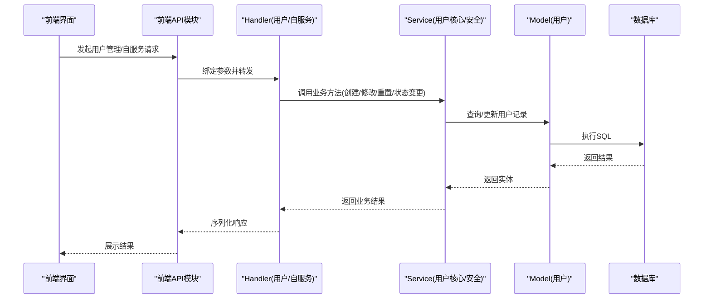
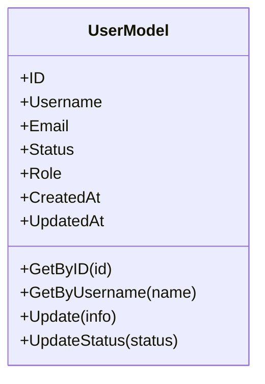
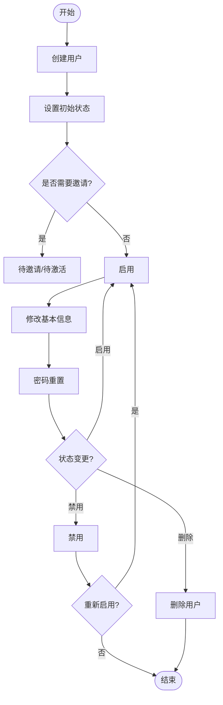
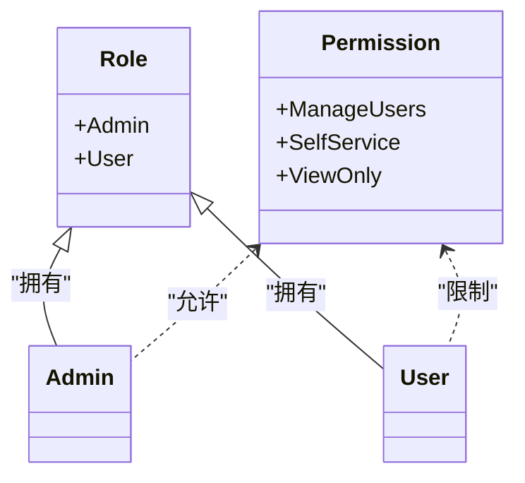
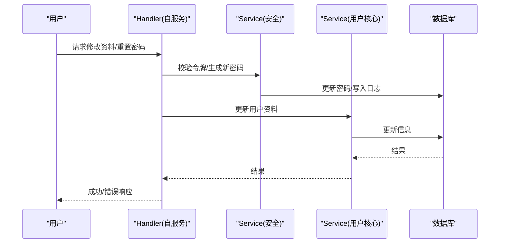
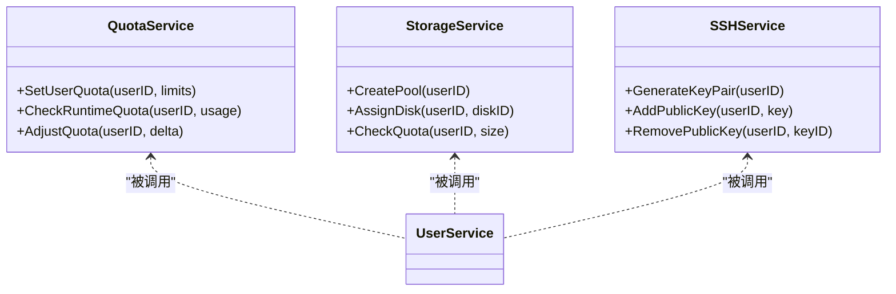
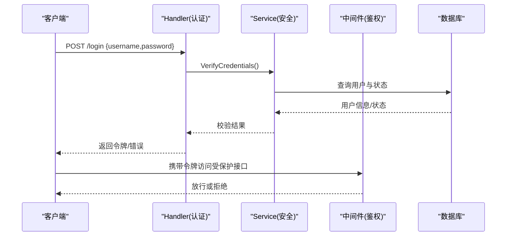
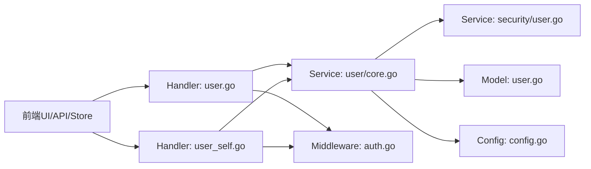

# 用户账户管理

<cite>
**本文档引用的文件**
- [server/handler/user.go](file://server/handler/user.go)
- [server/handler/user_self.go](file://server/handler/user_self.go)
- [server/model/user.go](file://server/model/user.go)
- [server/service/user/core.go](file://server/service/user/core.go)
- [server/service/security/user.go](file://server/service/security/user.go)
- [server/middleware/auth.go](file://server/middleware/auth.go)
- [server/config/config.go](file://server/config/config.go)
- [server/handler/auth.go](file://server/handler/auth.go)
- [server/service/user/types.go](file://server/service/user/types.go)
- [server/service/user/assign.go](file://server/service/user/assign.go)
- [server/service/user/quota.go](file://server/service/user/quota.go)
- [server/service/user/storage.go](file://server/service/user/storage.go)
- [server/service/user/runtime_quota.go](file://server/service/user/runtime_quota.go)
- [server/service/user/storage_vm.go](file://server/service/user/storage_vm.go)
- [server/service/user/ssh.go](file://server/service/user/ssh.go)
- [server/service/user/deps.go](file://server/service/user/deps.go)
- [server/service/user_wire.go](file://server/service/user_wire.go)
- [web/src/views/user/index.vue](file://web/src/views/user/index.vue)
- [web/src/store/user.js](file://web/src/store/user.js)
- [web/src/api/user.js](file://web/src/api/user.js)
</cite>

## 目录
1. [简介](#简介)
2. [项目结构](#项目结构)
3. [核心组件](#核心组件)
4. [架构总览](#架构总览)
5. [详细组件分析](#详细组件分析)
6. [依赖关系分析](#依赖关系分析)
7. [性能考虑](#性能考虑)
8. [故障排除指南](#故障排除指南)
9. [结论](#结论)
10. [附录](#附录)

## 简介
本文件面向Open虚拟机管理控制台的用户账户管理，系统性梳理从“用户创建、基本信息修改、密码管理、状态控制到删除”的完整生命周期；阐明管理员与普通用户的权限差异；解释用户自服务功能（个人资料修改、密码重置、账户激活）的实现；并提供最佳实践与安全配置建议（密码策略、账户锁定等）。内容基于后端Go服务与前端Vue应用的实际代码实现进行归纳总结。

## 项目结构
用户账户管理涉及后端Handler、Model、Service以及前端Store与API模块的协同工作。后端采用分层设计：Handler负责HTTP接口与请求参数绑定；Service封装业务逻辑（如用户创建、角色分配、配额、存储等）；Model定义数据结构与数据库交互；Middleware提供鉴权与限流等横切能力。前端通过API模块调用后端接口，Store管理用户态与全局状态。

图表来源
- [server/handler/user.go:1-200](file://server/handler/user.go#L1-L200)
- [server/handler/user_self.go:1-200](file://server/handler/user_self.go#L1-L200)
- [server/service/user/core.go:1-200](file://server/service/user/core.go#L1-L200)
- [server/service/security/user.go:1-200](file://server/service/security/user.go#L1-L200)
- [server/model/user.go:1-200](file://server/model/user.go#L1-L200)
- [server/middleware/auth.go:1-200](file://server/middleware/auth.go#L1-L200)
- [server/config/config.go:1-200](file://server/config/config.go#L1-L200)
- [web/src/views/user/index.vue:1-200](file://web/src/views/user/index.vue#L1-L200)
- [web/src/store/user.js:1-200](file://web/src/store/user.js#L1-L200)
- [web/src/api/user.js:1-200](file://web/src/api/user.js#L1-L200)

章节来源
- [server/handler/user.go:1-200](file://server/handler/user.go#L1-L200)
- [server/handler/user_self.go:1-200](file://server/handler/user_self.go#L1-L200)
- [server/service/user/core.go:1-200](file://server/service/user/core.go#L1-L200)
- [server/service/security/user.go:1-200](file://server/service/security/user.go#L1-L200)
- [server/model/user.go:1-200](file://server/model/user.go#L1-L200)
- [server/middleware/auth.go:1-200](file://server/middleware/auth.go#L1-L200)
- [server/config/config.go:1-200](file://server/config/config.go#L1-L200)
- [web/src/views/user/index.vue:1-200](file://web/src/views/user/index.vue#L1-L200)
- [web/src/store/user.js:1-200](file://web/src/store/user.js#L1-L200)
- [web/src/api/user.js:1-200](file://web/src/api/user.js#L1-L200)

## 核心组件
- 用户模型与数据持久化：定义用户字段、状态枚举、默认值与约束，提供查询与更新接口。
- 用户核心服务：封装用户创建、角色分配、状态变更、配额与存储管理等核心业务。
- 安全服务：处理密码策略、加密存储、登录验证、会话与令牌管理。
- 鉴权中间件：统一拦截请求，校验访问令牌与权限级别。
- Handler接口：暴露REST风格的管理与自服务能力，绑定请求参数与响应格式。
- 前端Store与API：维护当前用户状态、发起用户相关请求并与后端交互。

章节来源
- [server/model/user.go:1-200](file://server/model/user.go#L1-L200)
- [server/service/user/core.go:1-200](file://server/service/user/core.go#L1-L200)
- [server/service/security/user.go:1-200](file://server/service/security/user.go#L1-L200)
- [server/middleware/auth.go:1-200](file://server/middleware/auth.go#L1-L200)
- [server/handler/user.go:1-200](file://server/handler/user.go#L1-L200)
- [server/handler/user_self.go:1-200](file://server/handler/user_self.go#L1-L200)
- [web/src/store/user.js:1-200](file://web/src/store/user.js#L1-L200)
- [web/src/api/user.js:1-200](file://web/src/api/user.js#L1-L200)

## 架构总览
用户账户管理遵循“前端视图—API—Handler—Service—Model—数据库”的标准调用链路。管理员通过管理界面或API进行用户全量操作；普通用户通过自服务接口修改个人信息与密码。鉴权中间件在入口处统一拦截，确保只有具备相应权限的用户才能访问对应资源。

图表来源
- [server/handler/user.go:1-200](file://server/handler/user.go#L1-L200)
- [server/handler/user_self.go:1-200](file://server/handler/user_self.go#L1-L200)
- [server/service/user/core.go:1-200](file://server/service/user/core.go#L1-L200)
- [server/service/security/user.go:1-200](file://server/service/security/user.go#L1-L200)
- [server/model/user.go:1-200](file://server/model/user.go#L1-L200)

## 详细组件分析

### 用户模型与状态
- 字段与约束：用户名唯一、邮箱唯一、状态枚举（启用、禁用、待邀请、待激活等）、创建时间与更新时间等。
- 默认值：系统管理员用户名可通过配置项设置；其他字段按需设置默认值。
- 数据库交互：提供按ID/用户名查询、批量查询、更新状态与信息等常用操作。

图表来源
- [server/model/user.go:1-200](file://server/model/user.go#L1-L200)

章节来源
- [server/model/user.go:1-200](file://server/model/user.go#L1-L200)
- [server/config/config.go:60-100](file://server/config/config.go#L60-L100)

### 用户生命周期管理
- 创建：管理员创建用户时可指定初始状态（如待邀请/待激活），并生成初始凭证或邀请链接。
- 基本信息修改：支持修改用户名、邮箱等；需满足唯一性与格式要求。
- 密码管理：支持管理员重置密码与用户自服务重置；重置流程通常包含令牌校验与时效控制。
- 状态控制：支持启用/禁用、删除（软删/硬删）、重置登录失败计数等。
- 删除：管理员可删除用户，同时清理其关联的API Key、配额与存储等资源。

图表来源
- [server/handler/user.go:1-200](file://server/handler/user.go#L1-L200)
- [server/service/user/core.go:1-200](file://server/service/user/core.go#L1-L200)
- [server/service/security/user.go:1-200](file://server/service/security/user.go#L1-L200)

章节来源
- [server/handler/user.go:1-200](file://server/handler/user.go#L1-L200)
- [server/service/user/core.go:1-200](file://server/service/user/core.go#L1-L200)
- [server/service/security/user.go:1-200](file://server/service/security/user.go#L1-L200)

### 用户角色与权限差异
- 管理员：可执行所有用户管理操作（创建、修改、删除、状态变更、重置密码、分配角色等）。
- 普通用户：仅能访问自服务接口，修改个人信息与重置密码，无法越权访问他人账户或执行管理操作。
- 权限判定：Handler在执行敏感操作前由鉴权中间件检查用户角色与目标资源权限。

图表来源
- [server/handler/user.go:1-200](file://server/handler/user.go#L1-L200)
- [server/middleware/auth.go:1-200](file://server/middleware/auth.go#L1-L200)
- [server/service/user/types.go:1-200](file://server/service/user/types.go#L1-L200)

章节来源
- [server/handler/user.go:1-200](file://server/handler/user.go#L1-L200)
- [server/middleware/auth.go:1-200](file://server/middleware/auth.go#L1-L200)
- [server/service/user/types.go:1-200](file://server/service/user/types.go#L1-L200)

### 用户自服务功能
- 个人资料修改：用户可修改邮箱、联系方式等非敏感信息，需满足唯一性与格式校验。
- 密码重置：支持通过邮箱发送重置令牌，校验令牌后完成密码更新。
- 账户激活：对于待邀请/待激活用户，接收邀请后完成激活流程。

图表来源
- [server/handler/user_self.go:1-200](file://server/handler/user_self.go#L1-L200)
- [server/service/security/user.go:1-200](file://server/service/security/user.go#L1-L200)
- [server/service/user/core.go:1-200](file://server/service/user/core.go#L1-L200)

章节来源
- [server/handler/user_self.go:1-200](file://server/handler/user_self.go#L1-L200)
- [server/service/security/user.go:1-200](file://server/service/security/user.go#L1-L200)
- [server/service/user/core.go:1-200](file://server/service/user/core.go#L1-L200)

### 配额、存储与SSH管理
- 配额管理：为用户分配计算、存储、网络等资源配额，支持动态调整与运行时配额检查。
- 存储管理：管理用户专属存储池与磁盘配额，防止超配。
- SSH管理：为用户创建/管理SSH密钥，用于虚拟机访问与自动化运维。

图表来源
- [server/service/user/quota.go:1-200](file://server/service/user/quota.go#L1-L200)
- [server/service/user/runtime_quota.go:1-200](file://server/service/user/runtime_quota.go#L1-L200)
- [server/service/user/storage.go:1-200](file://server/service/user/storage.go#L1-L200)
- [server/service/user/storage_vm.go:1-200](file://server/service/user/storage_vm.go#L1-L200)
- [server/service/user/ssh.go:1-200](file://server/service/user/ssh.go#L1-L200)

章节来源
- [server/service/user/quota.go:1-200](file://server/service/user/quota.go#L1-L200)
- [server/service/user/runtime_quota.go:1-200](file://server/service/user/runtime_quota.go#L1-L200)
- [server/service/user/storage.go:1-200](file://server/service/user/storage.go#L1-L200)
- [server/service/user/storage_vm.go:1-200](file://server/service/user/storage_vm.go#L1-L200)
- [server/service/user/ssh.go:1-200](file://server/service/user/ssh.go#L1-L200)

### 登录与鉴权流程
- 登录：接收用户名/密码，校验凭据与账户状态（启用/禁用/待激活）。
- 令牌：成功登录后签发访问令牌，后续请求携带令牌访问受保护资源。
- 速率限制：可配置登录速率限制，降低暴力破解风险。
- 中间件：统一拦截校验令牌有效性与权限范围。

图表来源
- [server/handler/auth.go:1-200](file://server/handler/auth.go#L1-L200)
- [server/service/security/user.go:1-200](file://server/service/security/user.go#L1-L200)
- [server/middleware/auth.go:1-200](file://server/middleware/auth.go#L1-L200)
- [server/config/config.go:220-240](file://server/config/config.go#L220-L240)

章节来源
- [server/handler/auth.go:1-200](file://server/handler/auth.go#L1-L200)
- [server/service/security/user.go:1-200](file://server/service/security/user.go#L1-L200)
- [server/middleware/auth.go:1-200](file://server/middleware/auth.go#L1-L200)
- [server/config/config.go:220-240](file://server/config/config.go#L220-L240)

## 依赖关系分析
- Handler依赖Service与中间件；Service依赖Model与配置；前端API依赖后端Handler；Store依赖API。
- 关键耦合点：Handler与Service之间通过接口契约解耦；Service内部按职责拆分（核心、安全、配额、存储、SSH）。
- 外部依赖：数据库ORM、SMTP（邮件通知）、环境变量配置。

图表来源
- [server/handler/user.go:1-200](file://server/handler/user.go#L1-L200)
- [server/handler/user_self.go:1-200](file://server/handler/user_self.go#L1-L200)
- [server/service/user/core.go:1-200](file://server/service/user/core.go#L1-L200)
- [server/service/security/user.go:1-200](file://server/service/security/user.go#L1-L200)
- [server/model/user.go:1-200](file://server/model/user.go#L1-L200)
- [server/middleware/auth.go:1-200](file://server/middleware/auth.go#L1-L200)
- [server/config/config.go:1-200](file://server/config/config.go#L1-L200)

章节来源
- [server/handler/user.go:1-200](file://server/handler/user.go#L1-L200)
- [server/handler/user_self.go:1-200](file://server/handler/user_self.go#L1-L200)
- [server/service/user/core.go:1-200](file://server/service/user/core.go#L1-L200)
- [server/service/security/user.go:1-200](file://server/service/security/user.go#L1-L200)
- [server/model/user.go:1-200](file://server/model/user.go#L1-L200)
- [server/middleware/auth.go:1-200](file://server/middleware/auth.go#L1-L200)
- [server/config/config.go:1-200](file://server/config/config.go#L1-L200)

## 性能考虑
- 查询优化：对用户名/邮箱建立唯一索引，避免重复查询；分页查询与条件过滤减少负载。
- 缓存策略：对频繁读取的用户基础信息进行短期缓存，降低数据库压力。
- 并发控制：用户状态变更与配额调整需加锁或使用事务，保证一致性。
- 日志与审计：记录关键操作（创建、修改、删除、状态变更）便于追踪与回溯。

## 故障排除指南
- 登录失败/账户被禁用：检查用户状态是否为启用；确认是否存在登录失败次数过多导致的临时锁定。
- 密码重置无效：确认重置令牌是否过期、是否正确传递至后端；检查SMTP配置是否正确。
- 用户名/邮箱冲突：确保唯一性约束生效；在提交前做前端校验与后端去重。
- 权限不足：确认当前用户角色与目标资源权限；检查中间件是否正确拦截无权访问的请求。
- 配额超限：检查用户配额设置与当前用量；必要时提升配额或释放资源。

章节来源
- [server/handler/auth.go:100-130](file://server/handler/auth.go#L100-L130)
- [server/service/security/user.go:1-200](file://server/service/security/user.go#L1-L200)
- [server/service/user/core.go:1-200](file://server/service/user/core.go#L1-L200)
- [server/middleware/auth.go:1-200](file://server/middleware/auth.go#L1-L200)

## 结论
Open虚拟机管理控制台的用户账户管理体系以清晰的分层架构实现完整的生命周期管理与权限控制。通过Handler、Service、Model与中间件的协作，既满足管理员的集中管控需求，又为普通用户提供便捷的自服务能力。结合合理的安全配置与最佳实践，可有效保障系统的安全性与稳定性。

## 附录
- 前端用户管理界面：提供用户列表、创建、编辑、删除与状态切换等操作入口。
- 前端Store：维护当前登录用户信息与全局状态，驱动UI渲染与路由守卫。
- 前端API：封装用户相关请求，统一处理错误与重定向。

章节来源
- [web/src/views/user/index.vue:1-200](file://web/src/views/user/index.vue#L1-L200)
- [web/src/store/user.js:1-200](file://web/src/store/user.js#L1-L200)
- [web/src/api/user.js:1-200](file://web/src/api/user.js#L1-L200)