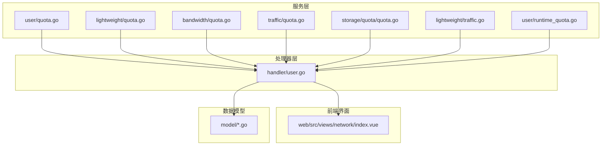
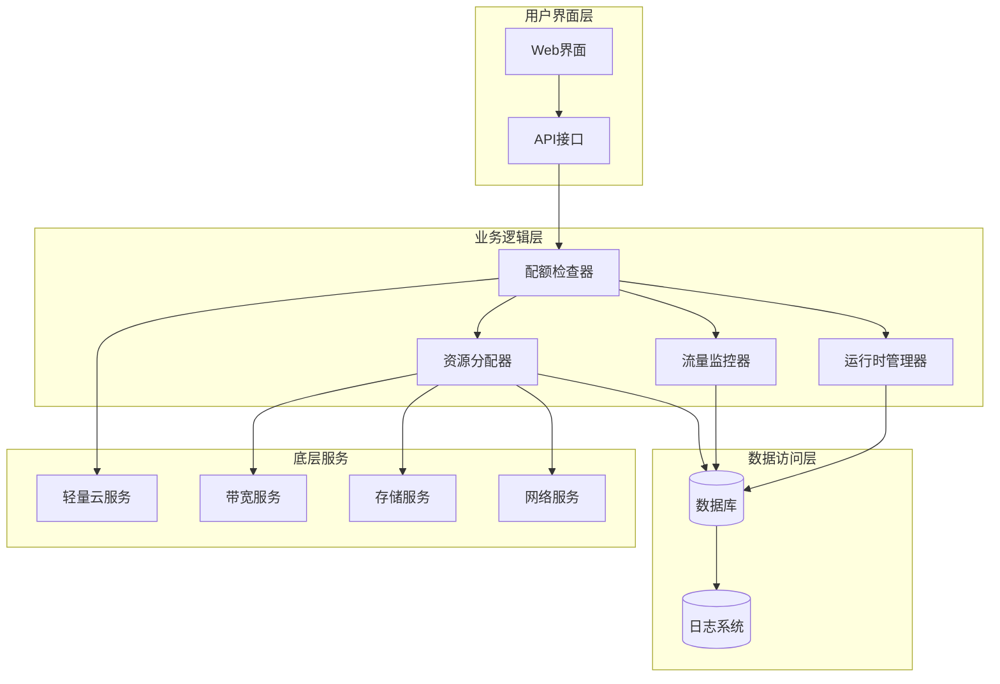
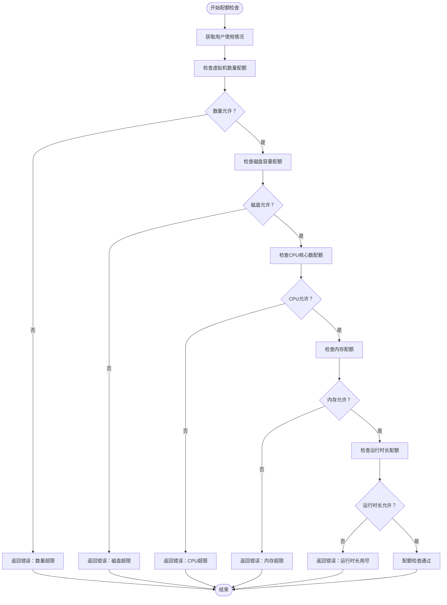
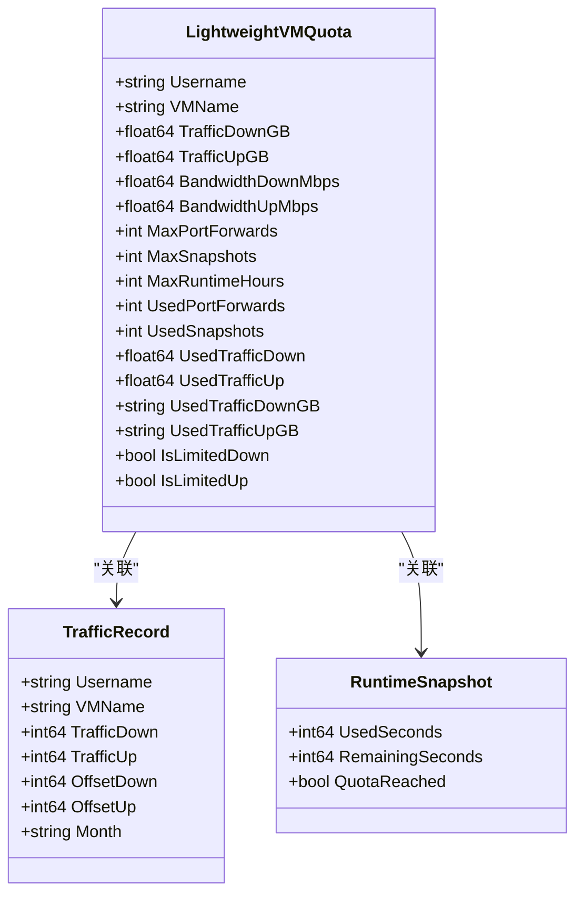
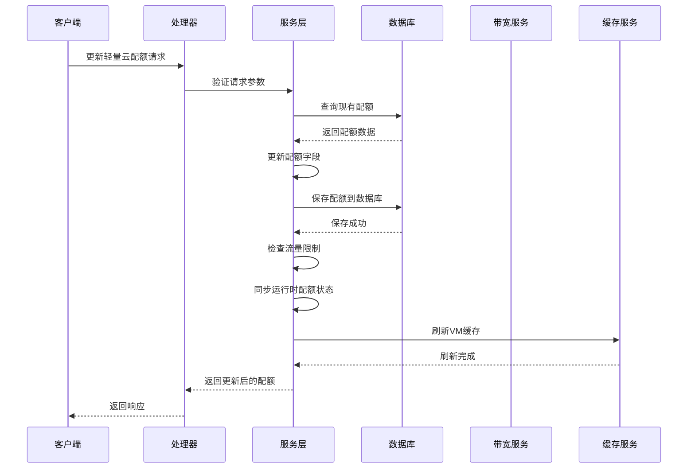
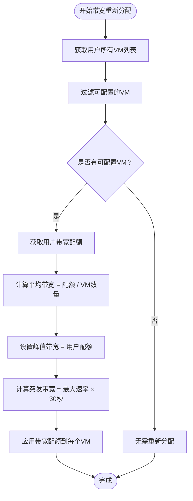
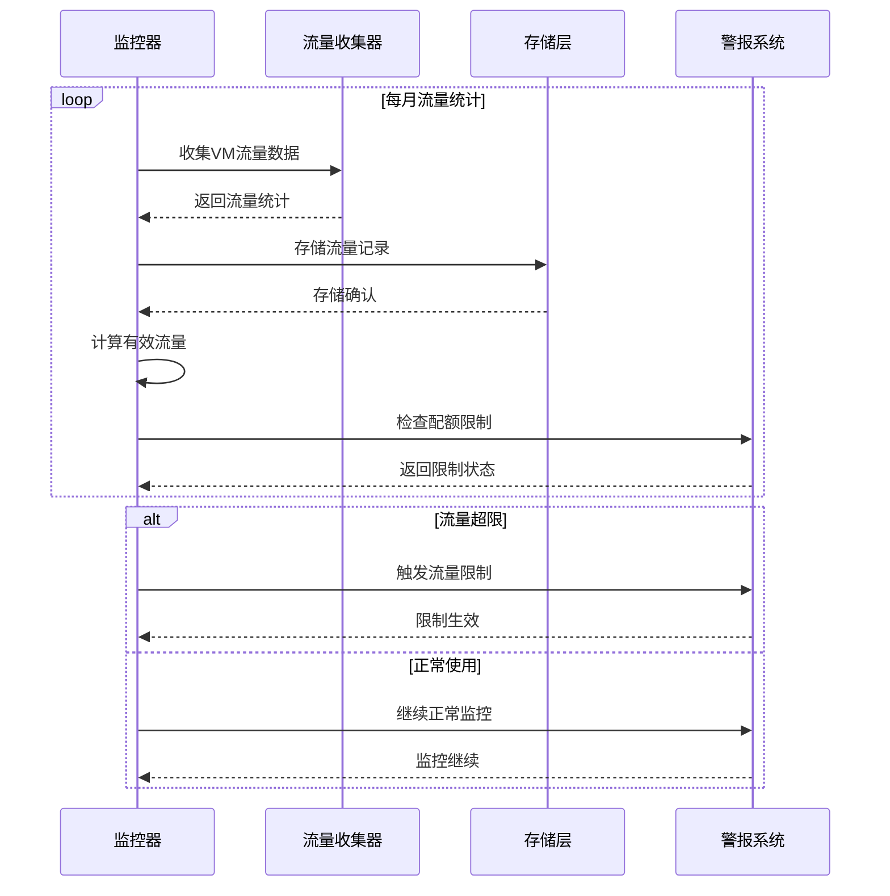
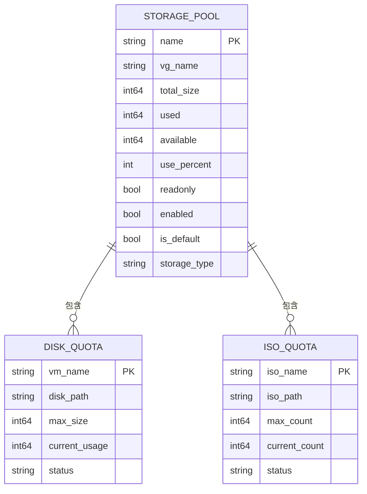
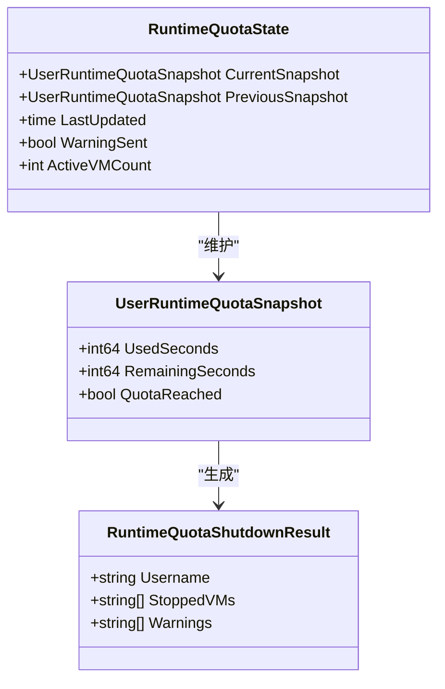
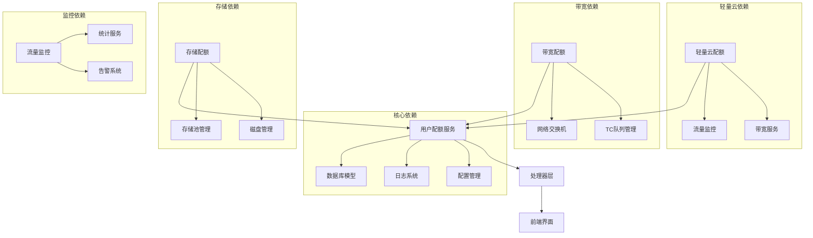

# 配额管理系统

<cite>
**本文档引用的文件**
- [server/service/user/quota.go](file://server/service/user/quota.go)
- [server/service/lightweight/quota.go](file://server/service/lightweight/quota.go)
- [server/service/lightweight/traffic.go](file://server/service/lightweight/traffic.go)
- [server/service/traffic/quota.go](file://server/service/traffic/quota.go)
- [server/service/storage/quota/quota.go](file://server/service/storage/quota/quota.go)
- [server/service/bandwidth/quota.go](file://server/service/bandwidth/quota.go)
- [server/service/bandwidth/vm.go](file://server/service/bandwidth/vm.go)
- [server/service/user/runtime_quota.go](file://server/service/user/runtime_quota.go)
- [server/service/user/types.go](file://server/service/user/types.go)
- [server/service/storage/pool/types.go](file://server/service/storage/pool/types.go)
- [server/handler/user.go](file://server/handler/user.go)
- [web/src/views/network/index.vue](file://web/src/views/network/index.vue)
</cite>

## 目录
1. [简介](#简介)
2. [项目结构](#项目结构)
3. [核心组件](#核心组件)
4. [架构概览](#架构概览)
5. [详细组件分析](#详细组件分析)
6. [依赖关系分析](#依赖关系分析)
7. [性能考虑](#性能考虑)
8. [故障排除指南](#故障排除指南)
9. [结论](#结论)
10. [附录](#附录)

## 简介

Open虚拟机管理控制台的配额管理系统是一个多层次、分布式的资源管理框架，旨在确保系统资源的合理分配和使用。该系统涵盖了计算资源、存储空间、网络带宽和运行时长等多个维度的配额管理。

系统采用分层设计模式，通过服务层、处理器层和前端界面的协同工作，实现了对虚拟机资源的精细化管控。配额管理不仅包括静态的资源上限控制，还具备动态调整和实时监控能力。

## 项目结构

配额管理系统在代码库中的组织结构如下：



**图表来源**
- [server/service/user/quota.go:1-200](file://server/service/user/quota.go#L1-L200)
- [server/service/lightweight/quota.go:1-150](file://server/service/lightweight/quota.go#L1-L150)
- [server/handler/user.go:1-100](file://server/handler/user.go#L1-L100)

**章节来源**
- [server/service/user/quota.go:1-200](file://server/service/user/quota.go#L1-L200)
- [server/service/lightweight/quota.go:1-150](file://server/service/lightweight/quota.go#L1-L150)
- [server/handler/user.go:1-100](file://server/handler/user.go#L1-L100)

## 核心组件

### 计算资源配额管理

计算资源配额主要涵盖CPU核心数、内存大小和虚拟机数量的限制。系统通过以下组件实现：

- **CPU配额控制**：基于用户已分配虚拟机的总核心数进行累加检查
- **内存配额控制**：基于用户已分配虚拟机的总内存容量进行累加检查  
- **虚拟机数量配额**：直接检查用户当前拥有的虚拟机数量

### 存储空间配额管理

存储空间配额管理包括磁盘容量和存储池使用的配额控制：

- **磁盘容量配额**：检查新创建磁盘的容量是否超出用户配额
- **存储池使用配额**：监控存储池的可用空间和使用率
- **存储分类管理**：支持ISO、共享存储、磁盘等不同类型的存储配额

### 网络带宽配额管理

网络带宽配额采用多层次的管理策略：

- **用户级带宽配额**：基于用户总数进行带宽资源的重新分配
- **VM级带宽配额**：针对单个虚拟机的带宽限制和调整
- **流量监控**：实时监控和记录网络流量使用情况

### 运行时长配额管理

运行时长配额提供灵活的资源使用时间控制：

- **总运行时长配额**：限制用户的累计运行时间
- **动态配额调整**：根据使用情况进行配额的动态调整
- **自动关机机制**：当配额耗尽时自动执行关机操作

**章节来源**
- [server/service/user/quota.go:112-149](file://server/service/user/quota.go#L112-L149)
- [server/service/lightweight/quota.go:52-121](file://server/service/lightweight/quota.go#L52-L121)
- [server/service/bandwidth/quota.go:1-100](file://server/service/bandwidth/quota.go#L1-L100)

## 架构概览

配额管理系统的整体架构采用分层设计，各层职责明确：



**图表来源**
- [server/service/user/quota.go:112-149](file://server/service/user/quota.go#L112-L149)
- [server/service/lightweight/quota.go:52-121](file://server/service/lightweight/quota.go#L52-L121)
- [server/service/bandwidth/quota.go:30-100](file://server/service/bandwidth/quota.go#L30-L100)

## 详细组件分析

### 用户配额检查组件

用户配额检查是整个系统的核心组件，负责验证用户的所有资源请求是否符合配额限制。

#### 配额检查流程



**图表来源**
- [server/service/user/quota.go:112-149](file://server/service/user/quota.go#L112-L149)

#### 配额检查实现细节

配额检查采用累加式验证方式，确保资源使用的总体合规性：

1. **虚拟机数量检查**：直接比较当前数量与配额上限
2. **磁盘容量检查**：验证新增磁盘容量与现有使用量的总和
3. **CPU核心数检查**：累加所有已分配虚拟机的核心数
4. **内存容量检查**：累加所有已分配虚拟机的内存容量
5. **运行时长检查**：验证配额状态和使用情况

**章节来源**
- [server/service/user/quota.go:112-149](file://server/service/user/quota.go#L112-L149)

### 轻量云配额管理组件

轻量云配额管理专门针对轻量云虚拟机的特殊需求设计，提供了更精细的资源控制能力。

#### 轻量云配额数据结构



**图表来源**
- [server/service/lightweight/quota.go:52-121](file://server/service/lightweight/quota.go#L52-L121)
- [server/service/lightweight/traffic.go:78-112](file://server/service/lightweight/traffic.go#L78-L112)

#### 轻量云配额更新流程



**图表来源**
- [server/service/lightweight/quota.go:52-94](file://server/service/lightweight/quota.go#L52-L94)

**章节来源**
- [server/service/lightweight/quota.go:52-121](file://server/service/lightweight/quota.go#L52-L121)
- [server/service/lightweight/traffic.go:78-112](file://server/service/lightweight/traffic.go#L78-L112)

### 带宽配额管理组件

带宽配额管理提供了灵活的网络资源分配和控制机制。

#### 用户带宽重新分配算法



**图表来源**
- [server/service/bandwidth/quota.go:30-100](file://server/service/bandwidth/quota.go#L30-L100)

#### VM带宽配置管理

带宽服务支持多种配置模式：

1. **持久化配置**：基于VM的长期配置进行带宽设置
2. **动态调整**：根据实时使用情况进行带宽调整
3. **VPC集成**：与VPC网络交换机的带宽管理集成

**章节来源**
- [server/service/bandwidth/quota.go:1-100](file://server/service/bandwidth/quota.go#L1-L100)
- [server/service/bandwidth/vm.go:1-42](file://server/service/bandwidth/vm.go#L1-L42)

### 流量配额监控组件

流量配额监控提供了实时的网络使用情况跟踪和报告功能。

#### 流量统计和监控流程



**图表来源**
- [server/service/lightweight/traffic.go:100-112](file://server/service/lightweight/traffic.go#L100-L112)

**章节来源**
- [server/service/lightweight/traffic.go:78-112](file://server/service/lightweight/traffic.go#L78-L112)
- [server/service/traffic/quota.go:1-100](file://server/service/traffic/quota.go#L1-L100)

### 存储配额管理组件

存储配额管理涵盖了存储池、磁盘和ISO镜像等多种存储资源的配额控制。

#### 存储配额数据模型



**图表来源**
- [server/service/storage/pool/types.go:28-49](file://server/service/storage/pool/types.go#L28-L49)
- [server/service/storage/quota/quota.go:1-100](file://server/service/storage/quota/quota.go#L1-L100)

**章节来源**
- [server/service/storage/pool/types.go:28-49](file://server/service/storage/pool/types.go#L28-L49)
- [server/service/storage/quota/quota.go:1-100](file://server/service/storage/quota/quota.go#L1-L100)

### 运行时长配额管理组件

运行时长配额管理提供了灵活的资源使用时间控制和自动化管理功能。

#### 运行时长配额快照



**图表来源**
- [server/service/user/types.go:105-117](file://server/service/user/types.go#L105-L117)
- [server/service/user/runtime_quota.go:155-193](file://server/service/user/runtime_quota.go#L155-L193)

**章节来源**
- [server/service/user/runtime_quota.go:155-193](file://server/service/user/runtime_quota.go#L155-L193)
- [server/service/user/types.go:105-117](file://server/service/user/types.go#L105-L117)

## 依赖关系分析

配额管理系统各组件之间的依赖关系错综复杂，形成了一个完整的资源管理体系。



**图表来源**
- [server/service/user/quota.go:112-149](file://server/service/user/quota.go#L112-L149)
- [server/service/lightweight/quota.go:52-121](file://server/service/lightweight/quota.go#L52-L121)
- [server/service/bandwidth/quota.go:30-100](file://server/service/bandwidth/quota.go#L30-L100)

**章节来源**
- [server/service/user/quota.go:112-149](file://server/service/user/quota.go#L112-L149)
- [server/service/lightweight/quota.go:52-121](file://server/service/lightweight/quota.go#L52-L121)
- [server/service/bandwidth/quota.go:30-100](file://server/service/bandwidth/quota.go#L30-L100)

## 性能考虑

配额管理系统在设计时充分考虑了性能优化和资源效率：

### 缓存策略
- **配额数据缓存**：热门用户的配额信息缓存在内存中
- **统计结果缓存**：频繁查询的统计数据进行缓存
- **配置信息缓存**：系统配置信息的本地缓存

### 异步处理
- **批量配额更新**：多个VM的配额更新采用批量处理
- **异步流量统计**：流量统计采用异步方式进行
- **后台任务调度**：定期任务通过任务队列管理

### 数据库优化
- **索引优化**：为常用查询字段建立数据库索引
- **连接池管理**：数据库连接池的合理配置
- **查询优化**：避免N+1查询问题

## 故障排除指南

### 常见问题诊断

#### 配额检查失败
**症状**：用户操作被拒绝，提示配额超限
**排查步骤**：
1. 检查用户当前的使用情况统计
2. 验证配额配置的正确性
3. 确认数据库连接状态
4. 查看相关日志信息

#### 带宽分配异常
**症状**：VM带宽设置不生效或配置丢失
**排查步骤**：
1. 检查网络交换机状态
2. 验证TC队列配置
3. 确认带宽服务运行状态
4. 查看带宽配置日志

#### 流量监控失效
**症状**：流量统计数据不准确或缺失
**排查步骤**：
1. 检查流量收集器状态
2. 验证统计服务配置
3. 确认数据库写入权限
4. 查看监控日志

**章节来源**
- [server/service/user/quota.go:112-149](file://server/service/user/quota.go#L112-L149)
- [server/service/lightweight/traffic.go:78-112](file://server/service/lightweight/traffic.go#L78-L112)

## 结论

Open虚拟机管理控制台的配额管理系统是一个功能完善、设计合理的资源管理框架。系统通过多层次的配额控制、实时的监控机制和灵活的管理策略，有效保障了系统资源的合理利用和稳定运行。

### 主要优势
- **全面的资源覆盖**：涵盖计算、存储、网络和运行时长等所有关键资源
- **灵活的管理策略**：支持静态配额和动态调整两种管理模式
- **完善的监控体系**：提供实时监控和历史统计功能
- **良好的扩展性**：模块化设计便于功能扩展和维护

### 发展建议
- **智能化配额调整**：引入机器学习算法进行智能配额预测
- **可视化管理界面**：增强配额管理的可视化程度
- **多租户隔离**：加强不同租户间的资源隔离能力
- **成本优化**：提供资源使用成本分析和优化建议

## 附录

### 配额配置示例

#### 用户配额配置
```json
{
  "max_vm": 10,
  "max_cpu": 40,
  "max_memory": 100,
  "max_disk": 500,
  "max_runtime_hours": 160,
  "max_bandwidth_up": 100,
  "max_bandwidth_down": 100,
  "max_traffic_down": 1000,
  "max_traffic_up": 1000
}
```

#### 轻量云配额配置
```json
{
  "vm_name": "lightweight-vm-01",
  "traffic_down_gb": 100,
  "traffic_up_gb": 100,
  "bandwidth_down_mbps": 100,
  "bandwidth_up_mbps": 100,
  "max_port_forwards": 10,
  "max_snapshots": 5,
  "max_runtime_hours": 160
}
```

### 配额监控指标

#### 实时监控指标
- **CPU使用率**：当前CPU使用百分比
- **内存使用率**：当前内存使用百分比  
- **磁盘使用率**：当前磁盘使用百分比
- **网络带宽使用**：当前网络带宽使用情况
- **运行时长剩余**：剩余可使用运行时间

#### 历史统计指标
- **月度流量统计**：按月统计的网络流量使用
- **峰值使用记录**：历史最高资源使用记录
- **平均使用率**：长期平均资源使用情况
- **配额使用趋势**：配额使用的历史趋势分析

**章节来源**
- [web/src/views/network/index.vue:284-303](file://web/src/views/network/index.vue#L284-L303)
- [server/handler/user.go:29-41](file://server/handler/user.go#L29-L41)