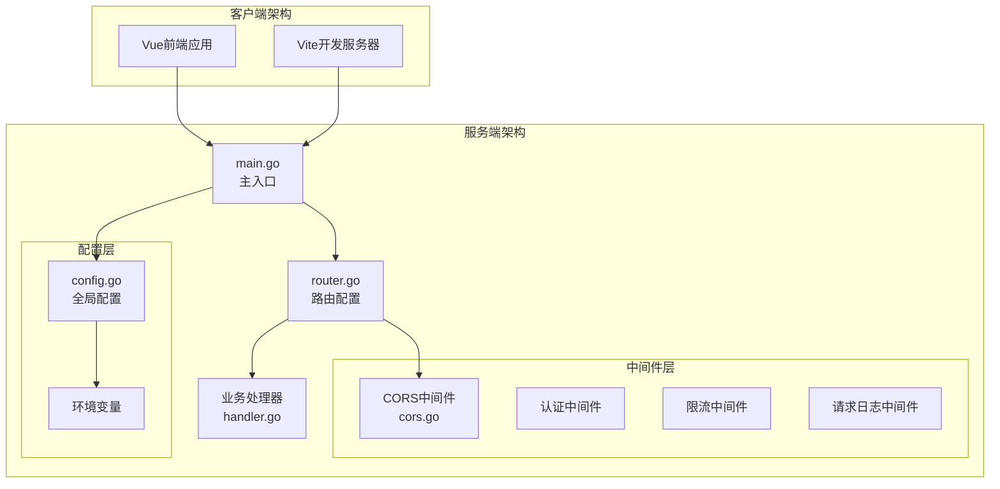
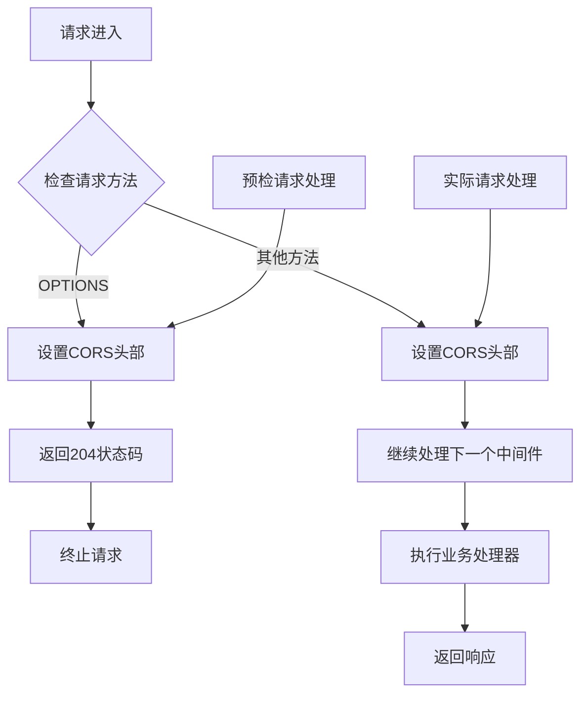
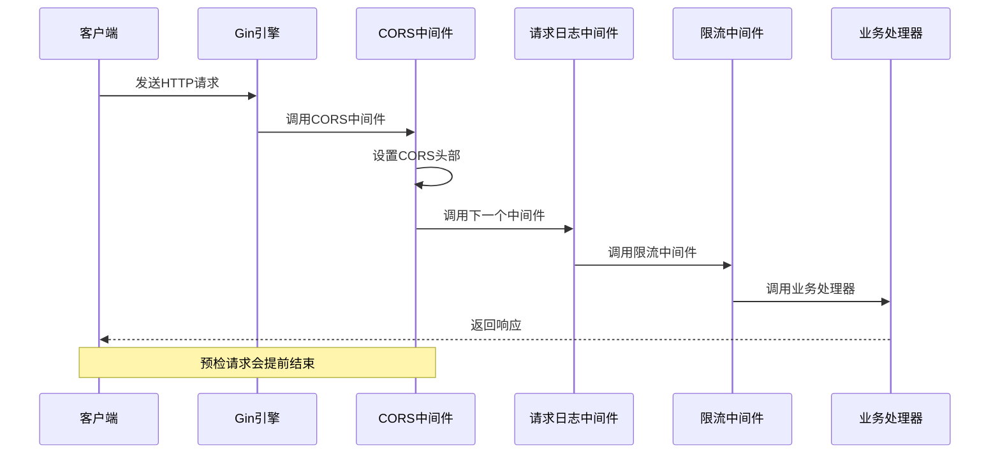
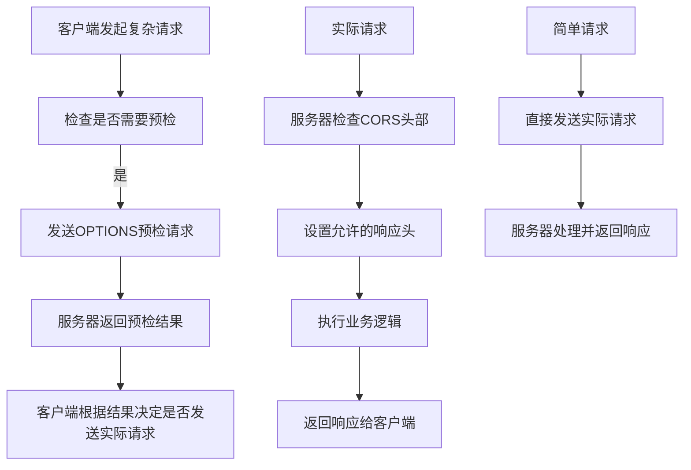
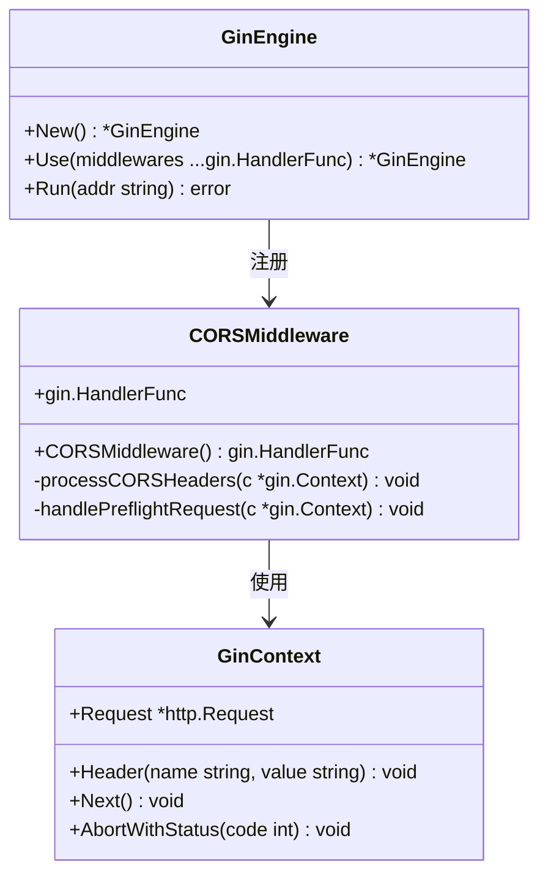
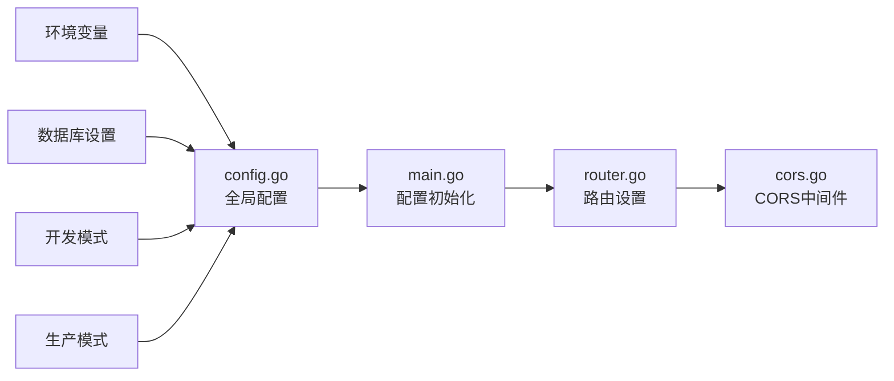
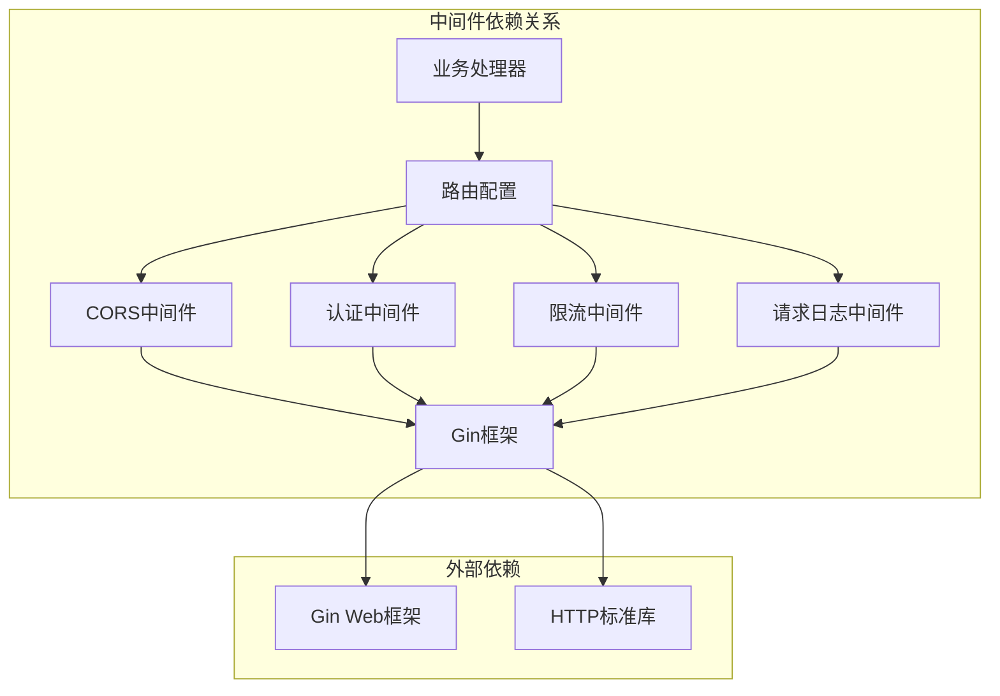
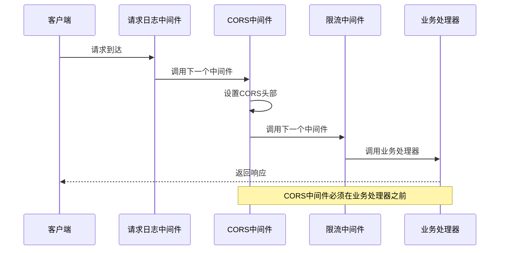

# CORS跨域中间件

<cite>
**本文档引用的文件**
- [cors.go](file://server/middleware/cors.go)
- [router.go](file://server/router/router.go)
- [config.go](file://server/config/config.go)
- [main.go](file://server/main.go)
</cite>

## 目录
1. [简介](#简介)
2. [项目结构](#项目结构)
3. [核心组件](#核心组件)
4. [架构概览](#架构概览)
5. [详细组件分析](#详细组件分析)
6. [依赖关系分析](#依赖关系分析)
7. [性能考量](#性能考量)
8. [故障排除指南](#故障排除指南)
9. [结论](#结论)

## 简介

Open虚拟机管理控制台采用Gin框架构建，提供了完整的CORS跨域中间件实现。该中间件位于server/middleware/cors.go文件中，为整个API服务提供统一的跨域资源共享支持。

CORS（Cross-Origin Resource Sharing）是现代Web应用中处理跨域请求的重要机制。在Open虚拟机管理控制台中，前端Vue应用与后端Go服务分离部署，需要通过CORS中间件来处理浏览器的同源策略限制。

## 项目结构

Open虚拟机管理控制台的CORS中间件实现遵循了清晰的模块化设计：



**图表来源**
- [main.go:31-128](file://server/main.go#L31-L128)
- [router.go:18-485](file://server/router/router.go#L18-L485)
- [cors.go:7-24](file://server/middleware/cors.go#L7-L24)

**章节来源**
- [main.go:31-128](file://server/main.go#L31-L128)
- [router.go:18-485](file://server/router/router.go#L18-L485)

## 核心组件

### CORS中间件实现

CORS中间件位于server/middleware/cors.go文件中，采用简洁而有效的实现方式：



**图表来源**
- [cors.go:8-23](file://server/middleware/cors.go#L8-L23)

### 配置选项详解

CORS中间件提供了以下关键配置选项：

| 配置项 | 默认值 | 描述 |
|--------|--------|------|
| Access-Control-Allow-Origin | "*" | 允许的源域名，支持通配符 |
| Access-Control-Allow-Methods | "GET, POST, PUT, DELETE, OPTIONS, PATCH" | 允许的HTTP方法 |
| Access-Control-Allow-Headers | 多个自定义头部 | 允许的请求头字段 |
| Access-Control-Expose-Headers | "Content-Length, Content-Type" | 允许暴露的响应头 |
| Access-Control-Max-Age | "86400" | 预检请求缓存时间（秒） |

**章节来源**
- [cors.go:10-14](file://server/middleware/cors.go#L10-L14)

## 架构概览

### 中间件链路

CORS中间件在整个中间件链路中扮演着关键角色：



**图表来源**
- [router.go:21-33](file://server/router/router.go#L21-L33)
- [cors.go:8-23](file://server/middleware/cors.go#L8-L23)

### 预检请求处理流程

预检请求（Preflight Request）是CORS机制中的重要概念：



**图表来源**
- [cors.go:16-19](file://server/middleware/cors.go#L16-L19)

**章节来源**
- [router.go:23-33](file://server/router/router.go#L23-L33)

## 详细组件分析

### CORS中间件类图



**图表来源**
- [cors.go:7-24](file://server/middleware/cors.go#L7-L24)

### 配置安全性分析

CORS中间件的安全配置体现了多层次的安全策略：

| 安全层面 | 实现方式 | 作用 |
|----------|----------|------|
| 源控制 | 允许所有源（*） | 简化开发和部署 |
| 方法白名单 | 显式声明允许方法 | 防止恶意方法滥用 |
| 头部控制 | 自定义API密钥头部 | 保护敏感认证信息 |
| 缓存控制 | 24小时预检缓存 | 平衡安全性和性能 |

**章节来源**
- [cors.go:10-14](file://server/middleware/cors.go#L10-L14)

### 环境集成

CORS中间件与全局配置系统的集成：



**图表来源**
- [config.go:157-249](file://server/config/config.go#L157-L249)
- [main.go:39-66](file://server/main.go#L39-L66)

**章节来源**
- [config.go:157-249](file://server/config/config.go#L157-L249)
- [main.go:39-66](file://server/main.go#L39-L66)

## 依赖关系分析

### 中间件依赖图



**图表来源**
- [router.go:3-16](file://server/router/router.go#L3-L16)
- [cors.go:3-5](file://server/middleware/cors.go#L3-L5)

### 中间件执行顺序

中间件的执行顺序对CORS功能至关重要：



**图表来源**
- [router.go:21-33](file://server/router/router.go#L21-L33)

**章节来源**
- [router.go:21-33](file://server/router/router.go#L21-L33)

## 性能考量

### 预检请求缓存

CORS中间件通过Access-Control-Max-Age头实现了预检请求缓存机制：

- **缓存时间**：86400秒（24小时）
- **性能收益**：减少重复的预检请求开销
- **适用场景**：频繁的跨域请求场景

### 内存和CPU开销

CORS中间件的性能特征：

| 操作类型 | 内存开销 | CPU开销 | I/O开销 |
|----------|----------|---------|---------|
| 预检请求处理 | 低 | 低 | 无 |
| 实际请求处理 | 低 | 低 | 无 |
| 头部设置 | 极低 | 极低 | 无 |

## 故障排除指南

### 常见问题及解决方案

#### 1. 预检请求失败

**症状**：浏览器显示CORS错误，预检请求返回403状态码

**原因分析**：
- 预检请求被其他中间件拦截
- CORS头部设置不完整
- 预检缓存时间过短

**解决方案**：
- 确保CORS中间件在路由配置中正确注册
- 检查中间件执行顺序
- 验证Access-Control-Max-Age配置

#### 2. 自定义头部不生效

**症状**：自定义API密钥头部被浏览器拒绝

**原因分析**：
- Access-Control-Allow-Headers未包含自定义头部
- 头部大小写不匹配
- 预检请求未正确缓存

**解决方案**：
- 在Access-Control-Allow-Headers中添加自定义头部
- 确保头部名称大小写正确
- 检查预检请求缓存配置

#### 3. 开发环境与生产环境差异

**开发环境特点**：
- 使用localhost:3000或其他开发服务器端口
- 可能需要更宽松的CORS策略
- 开发模式下可能有不同的安全要求

**生产环境特点**：
- 严格的源域名白名单
- 最小化暴露的头部和方法
- 更短的预检缓存时间

**章节来源**
- [cors.go:16-19](file://server/middleware/cors.go#L16-L19)
- [config.go:192-193](file://server/config/config.go#L192-L193)

### 调试技巧

#### 1. 启用详细日志

```bash
# 设置开发模式
export KVM_DEVELOPMENT_MODE=true

# 启用详细日志
export KVM_LOG_LEVEL=debug
```

#### 2. 浏览器开发者工具

- 查看Network标签页中的CORS相关请求
- 检查Response Headers中的CORS相关字段
- 分析预检请求的详细信息

#### 3. 服务器端调试

```go
// 在CORS中间件中添加调试信息
func CORSMiddleware() gin.HandlerFunc {
    return func(c *gin.Context) {
        log.Printf("CORS请求: %s %s", c.Request.Method, c.Request.URL.Path)
        // ... 其他逻辑
    }
}
```

## 结论

Open虚拟机管理控制台的CORS跨域中间件实现了简洁而有效的跨域资源共享机制。通过合理的配置和安全策略，该中间件为前端应用提供了可靠的跨域访问能力。

### 主要优势

1. **简洁实现**：代码量少，易于理解和维护
2. **全面覆盖**：支持常见的CORS场景和头部配置
3. **性能优化**：通过预检请求缓存提升性能
4. **安全考虑**：在开发和生产环境中提供适当的安全平衡

### 最佳实践建议

1. **生产环境配置**：建议将Access-Control-Allow-Origin设置为具体的域名而非通配符
2. **最小权限原则**：只暴露必要的HTTP方法和头部字段
3. **定期审查**：定期审查CORS配置以适应业务需求变化
4. **监控告警**：建立CORS相关的监控和告警机制

该CORS中间件为Open虚拟机管理控制台提供了坚实的跨域访问基础，支持了前后端分离的现代化Web应用架构。