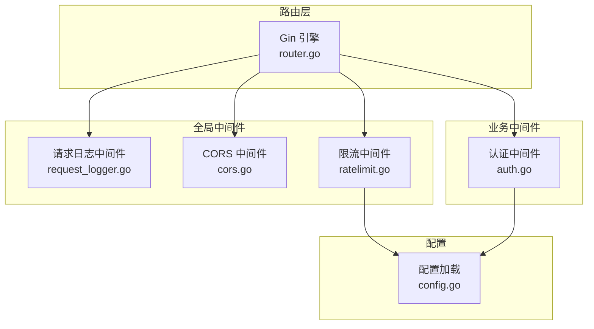
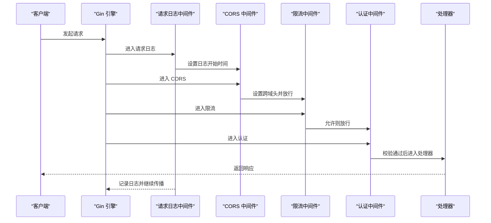
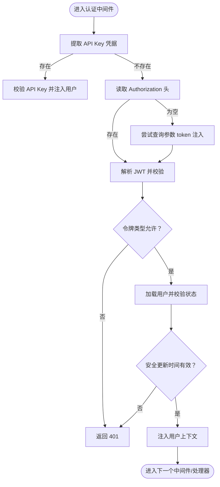
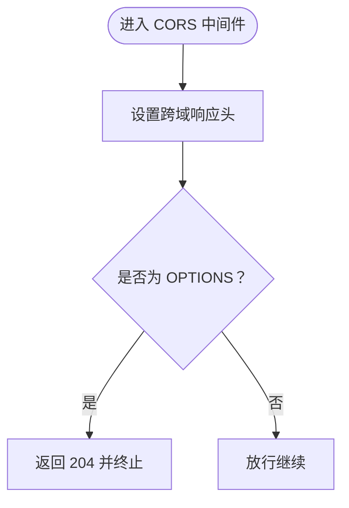
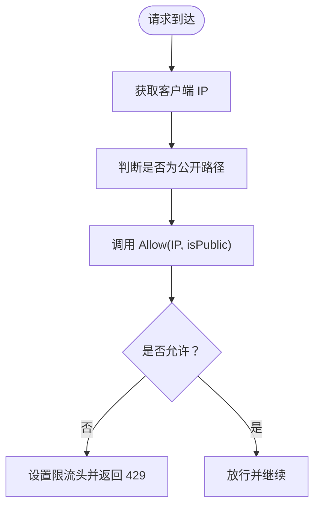
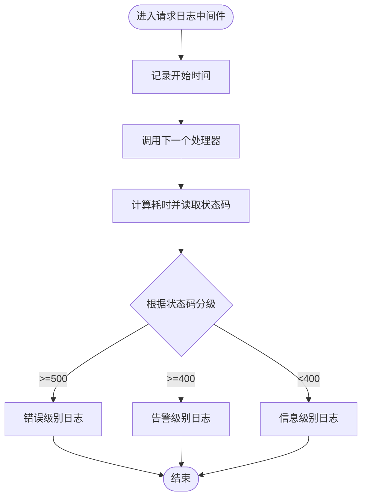
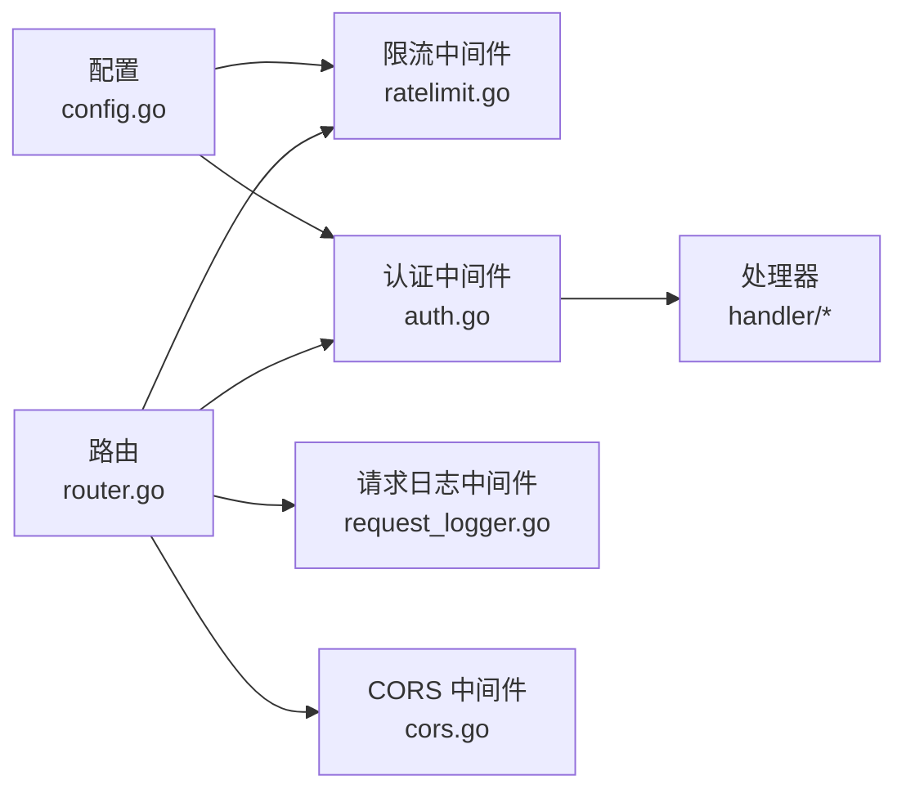

# 中间件系统

<cite>
**本文引用的文件**
- [auth.go](file://server/middleware/auth.go)
- [cors.go](file://server/middleware/cors.go)
- [ratelimit.go](file://server/middleware/ratelimit.go)
- [request_logger.go](file://server/middleware/request_logger.go)
- [router.go](file://server/router/router.go)
- [config.go](file://server/config/config.go)
- [jwt_secret.go](file://server/service/security/jwt_secret.go)
- [token.go](file://server/service/security/token.go)
- [auth.go](file://server/handler/auth.go)
</cite>

## 目录
1. [简介](#简介)
2. [项目结构](#项目结构)
3. [核心组件](#核心组件)
4. [架构总览](#架构总览)
5. [详细组件分析](#详细组件分析)
6. [依赖分析](#依赖分析)
7. [性能考量](#性能考量)
8. [故障排查指南](#故障排查指南)
9. [结论](#结论)
10. [附录](#附录)

## 简介
本文件系统性梳理 Open 虚拟机管理控制台的中间件体系，重点覆盖以下方面：
- 认证中间件：JWT 令牌生成与验证、API Key 认证、用户身份注入与权限校验流程
- CORS 中间件：跨域请求处理与安全策略配置
- 限流中间件：基于滑动窗口的 IP 级限流、公开与认证接口差异化策略
- 请求日志中间件：按状态码分级记录请求信息与性能指标
- 中间件执行顺序、配置选项与自定义扩展方法
- 实际配置示例与最佳实践建议

## 项目结构
中间件位于 server/middleware 目录，路由在 server/router/router.go 中统一挂载全局中间件，并在各业务路由组中叠加细粒度中间件。

图表来源
- [router.go:18-539](file://server/router/router.go#L18-L539)
- [request_logger.go:11-70](file://server/middleware/request_logger.go#L11-L70)
- [cors.go:7-24](file://server/middleware/cors.go#L7-L24)
- [ratelimit.go:11-211](file://server/middleware/ratelimit.go#L11-L211)
- [config.go:19-824](file://server/config/config.go#L19-L824)

章节来源
- [router.go:18-539](file://server/router/router.go#L18-L539)

## 核心组件
- 认证中间件（JWT + API Key）
  - 支持 Bearer Token 与 API Key 两种认证方式
  - 令牌类型区分（access/login/bootstrap 等）
  - 用户状态与安全更新时间校验
  - 将用户信息注入上下文，供后续处理器使用
- CORS 中间件
  - 统一设置跨域响应头
  - 放行常见方法与自定义头部
  - 对预检请求快速返回
- 限流中间件
  - 滑动窗口算法，按 IP 与路径类型统计
  - 公开接口与认证接口差异化阈值
  - 清理过期条目，避免内存膨胀
- 请求日志中间件
  - 按状态码分级记录
  - 输出方法、路径、耗时、客户端 IP、用户等关键指标

章节来源
- [auth.go:17-324](file://server/middleware/auth.go#L17-L324)
- [cors.go:7-24](file://server/middleware/cors.go#L7-L24)
- [ratelimit.go:11-211](file://server/middleware/ratelimit.go#L11-L211)
- [request_logger.go:11-70](file://server/middleware/request_logger.go#L11-L70)

## 架构总览
中间件在 Gin 引擎初始化阶段按顺序挂载，形成“全局中间件 → 路由组中间件 → 处理器”的链式调用。

图表来源
- [router.go:18-539](file://server/router/router.go#L18-L539)
- [request_logger.go:11-70](file://server/middleware/request_logger.go#L11-L70)
- [cors.go:7-24](file://server/middleware/cors.go#L7-L24)
- [ratelimit.go:173-197](file://server/middleware/ratelimit.go#L173-L197)
- [auth.go:75-199](file://server/middleware/auth.go#L75-L199)

## 详细组件分析

### 认证中间件（JWT 与 API Key）
- 令牌结构与签发
  - Claims 包含用户标识、角色、令牌类型、操作范围与标准声明
  - 支持按 TTL 生成不同类型的令牌（默认 access、login、bootstrap 等）
  - 使用配置中的 JWT 密钥进行签名
- 令牌解析与校验
  - 解析 Bearer Token，校验签名与有效期
  - 若未提供 Authorization，则尝试从查询参数 token 注入
- 认证流程
  - 优先尝试 API Key（支持多种头部与前缀）
  - 不允许 API Key 时，仅接受 JWT
  - 校验用户存在性、状态、安全更新时间等
  - 将用户信息注入上下文（user_id、username、role、token_type、auth_type、current_user 等）
- 角色与资源权限
  - 管理员中间件：校验 role=admin
  - 轻量云限制：禁止轻量云用户访问弹性云自助能力
  - VM 访问中间件：非管理员需校验 VM 归属（读取本地访问文件）

图表来源
- [auth.go:75-199](file://server/middleware/auth.go#L75-L199)
- [auth.go:201-241](file://server/middleware/auth.go#L201-L241)

章节来源
- [auth.go:17-324](file://server/middleware/auth.go#L17-L324)
- [jwt_secret.go:32-55](file://server/service/security/jwt_secret.go#L32-L55)
- [token.go:14-88](file://server/service/security/token.go#L14-L88)
- [auth.go:101-200](file://server/handler/auth.go#L101-L200)

### CORS 中间件
- 关键行为
  - 设置允许源、方法、头部与暴露头
  - 设置预检缓存时长
  - 对 OPTIONS 预检请求直接返回
- 安全策略
  - 允许常见业务头部（含自定义 API Key 与高风险令牌头）
  - 默认允许任意源（生产环境建议按需收紧）

图表来源
- [cors.go:7-24](file://server/middleware/cors.go#L7-L24)

章节来源
- [cors.go:7-24](file://server/middleware/cors.go#L7-L24)

### 限流中间件（滑动窗口）
- 配置项
  - 公开接口每 IP 每分钟上限
  - 认证接口每 IP 每分钟上限（0 表示不限制）
  - 清理周期
- 算法与行为
  - 滑动窗口：每分钟为一个窗口，超过上限则阻断
  - 公开路径白名单：登录、邀请、忘记密码等接口
  - 通过 X-RateLimit-* 与 Retry-After 响应头反馈剩余次数与重置时间
- IP 获取策略
  - 优先 X-Forwarded-For 第一个 IP，其次 X-Real-IP，最后回退到客户端 IP

图表来源
- [ratelimit.go:134-154](file://server/middleware/ratelimit.go#L134-L154)
- [ratelimit.go:156-171](file://server/middleware/ratelimit.go#L156-L171)
- [ratelimit.go:173-197](file://server/middleware/ratelimit.go#L173-L197)
- [ratelimit.go:60-105](file://server/middleware/ratelimit.go#L60-L105)

章节来源
- [ratelimit.go:11-211](file://server/middleware/ratelimit.go#L11-L211)
- [config.go:229-230](file://server/config/config.go#L229-L230)

### 请求日志中间件
- 记录内容
  - 方法、路径（含查询串）、状态码、耗时、客户端 IP、用户（来自上下文）
- 分级策略
  - 5xx：错误级别
  - 4xx：告警级别
  - 2xx/3xx：信息级别
- 与认证中间件协作
  - 通过上下文读取 username，若存在则记录

图表来源
- [request_logger.go:11-70](file://server/middleware/request_logger.go#L11-L70)

章节来源
- [request_logger.go:11-70](file://server/middleware/request_logger.go#L11-L70)

## 依赖分析
- 中间件与配置
  - 限流中间件读取配置中的公开/认证限流阈值
  - 认证中间件读取 JWT 密钥与 VM 访问目录
- 中间件与路由
  - 全局中间件：请求日志、CORS、限流
  - 路由组中间件：按需叠加认证、管理员、VM 访问等中间件
- 中间件之间的耦合
  - 认证中间件为后续中间件与处理器提供用户上下文
  - 限流中间件对公开路径与认证路径采用不同策略，降低误伤

图表来源
- [config.go:19-824](file://server/config/config.go#L19-L824)
- [router.go:18-539](file://server/router/router.go#L18-L539)
- [auth.go:17-324](file://server/middleware/auth.go#L17-L324)
- [ratelimit.go:11-211](file://server/middleware/ratelimit.go#L11-L211)

章节来源
- [router.go:18-539](file://server/router/router.go#L18-L539)
- [config.go:19-824](file://server/config/config.go#L19-L824)

## 性能考量
- 限流中间件
  - 滑动窗口 + 定期清理，时间复杂度 O(1) 查询与更新，空间复杂度随活跃 IP 增长
  - 建议合理设置清理周期，避免内存无限增长
- 认证中间件
  - JWT 解析与用户查询为 O(1)+数据库查询，建议配合索引与缓存
- CORS 中间件
  - 仅设置响应头与短路 OPTIONS，开销极低
- 请求日志中间件
  - 仅在请求结束后记录，避免阻塞主处理流程

## 故障排查指南
- 认证失败（401）
  - 检查 Authorization 头格式是否为 Bearer Token
  - 确认 JWT 密钥与签名一致，必要时轮换密钥并通知客户端更新
  - 核对用户状态与安全更新时间，确保未被禁用或已重新登录
- CORS 失败
  - 确认客户端请求头是否包含允许的自定义头部
  - 生产环境建议限制 Access-Control-Allow-Origin
- 429 限流
  - 检查是否命中公开路径白名单
  - 调整 KVM_RATE_LIMIT_PUBLIC/KVM_RATE_LIMIT_AUTH 配置
  - 关注 X-RateLimit-Remaining 与 Retry-After 响应头
- 日志异常
  - 确认日志级别与输出目标配置
  - 检查是否有错误堆栈被收集

章节来源
- [auth.go:120-199](file://server/middleware/auth.go#L120-L199)
- [cors.go:10-14](file://server/middleware/cors.go#L10-L14)
- [ratelimit.go:180-191](file://server/middleware/ratelimit.go#L180-L191)
- [request_logger.go:38-67](file://server/middleware/request_logger.go#L38-L67)

## 结论
本中间件体系以“全局中间件 + 路由组中间件”组合实现横切关注点，具备清晰的职责边界与可扩展性。认证中间件通过 JWT 与 API Key 双通道保障安全；CORS 中间件简化跨域接入；限流中间件以滑动窗口实现精准防刷；请求日志中间件提供可观测性。结合合理的配置与最佳实践，可在保证安全性的同时提升用户体验与系统稳定性。

## 附录

### 中间件执行顺序与挂载点
- 全局顺序
  - 请求日志中间件 → 恢复中间件（内置）→ CORS 中间件 → 全局限流中间件
- 路由组叠加
  - 认证接口组：登录态令牌中间件
  - 安全初始化组：JWT 类型中间件（支持 bootstrap/access）
  - 高风险操作组：仅允许 access 令牌
  - 管理员接口组：管理员中间件
  - VM 访问组：VM 访问中间件、轻量云限制中间件

章节来源
- [router.go:18-539](file://server/router/router.go#L18-L539)

### 配置选项与示例
- 限流配置（环境变量）
  - KVM_RATE_LIMIT_PUBLIC：公开接口每 IP 每分钟上限（默认 20）
  - KVM_RATE_LIMIT_AUTH：认证接口每 IP 每分钟上限（默认 0，表示不限制）
- JWT 配置
  - KVM_JWT_SECRET：JWT 密钥（生产环境必须替换默认值）
  - KVM_JWT_EXPIRE_HOURS：JWT 过期小时数（默认 24）
  - KVM_JWT_SECRET_ROTATE_HOURS：密钥轮换间隔（0 表示禁用）
- VM 访问目录
  - KVM_VM_ACCESS_DIR：VM 归属校验文件目录（默认 /etc/libvirt/vm-access）

章节来源
- [config.go:229-230](file://server/config/config.go#L229-L230)
- [config.go:163-167](file://server/config/config.go#L163-L167)
- [config.go:183](file://server/config/config.go#L183)

### 自定义扩展方法
- 新增认证类型
  - 在认证中间件中扩展凭据提取逻辑（如 OIDC/JWT 头部）
  - 在令牌类型白名单中加入新类型并编写对应中间件
- 新增限流策略
  - 在 isPublicPath 中添加新路径
  - 在 Allow 中增加更细粒度的限流维度（如用户 ID、来源 IP 组）
- 新增日志字段
  - 在请求日志中间件中读取上下文中的新键并记录
- CORS 策略调整
  - 限定允许源与方法，避免使用通配符
  - 仅暴露必要的响应头

章节来源
- [auth.go:201-241](file://server/middleware/auth.go#L201-L241)
- [ratelimit.go:134-154](file://server/middleware/ratelimit.go#L134-L154)
- [request_logger.go:25-32](file://server/middleware/request_logger.go#L25-L32)
- [cors.go:10-14](file://server/middleware/cors.go#L10-L14)