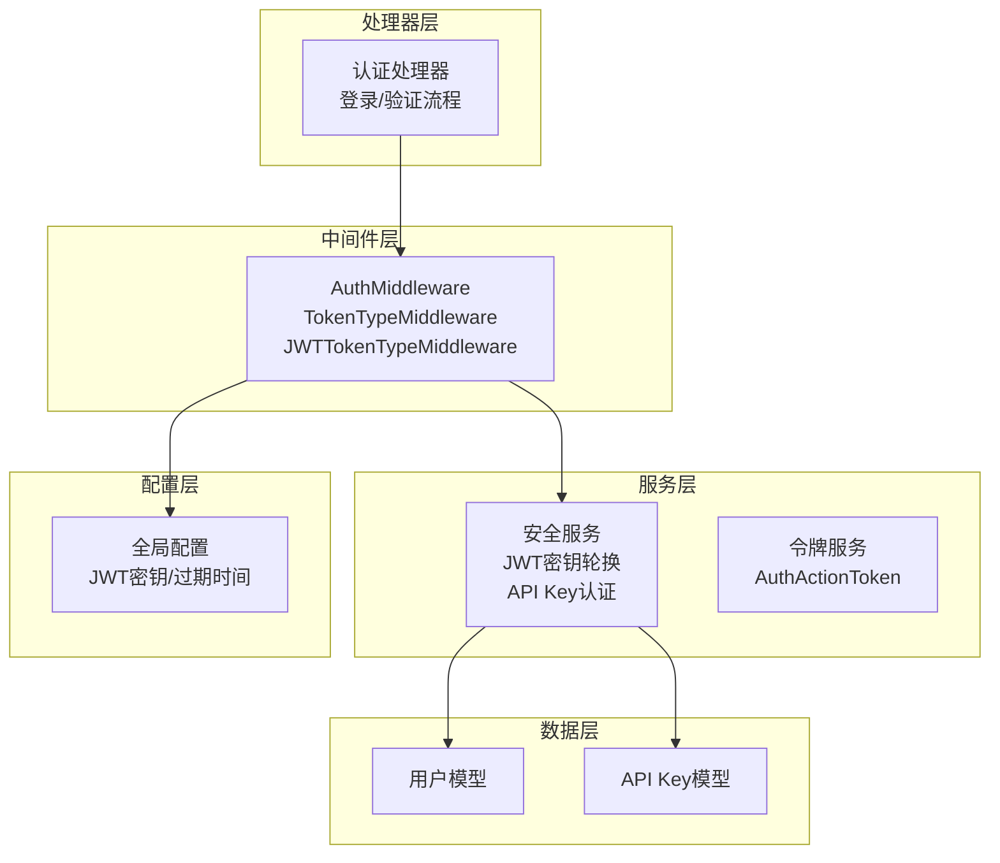
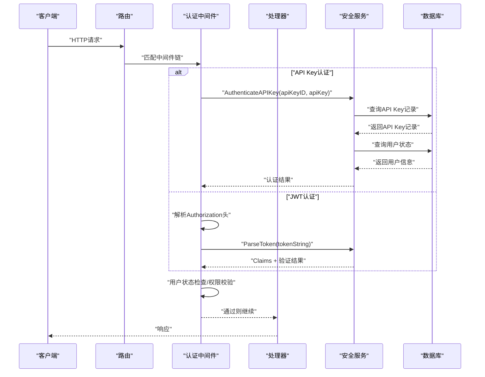
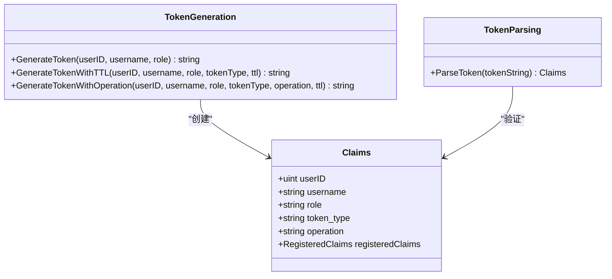
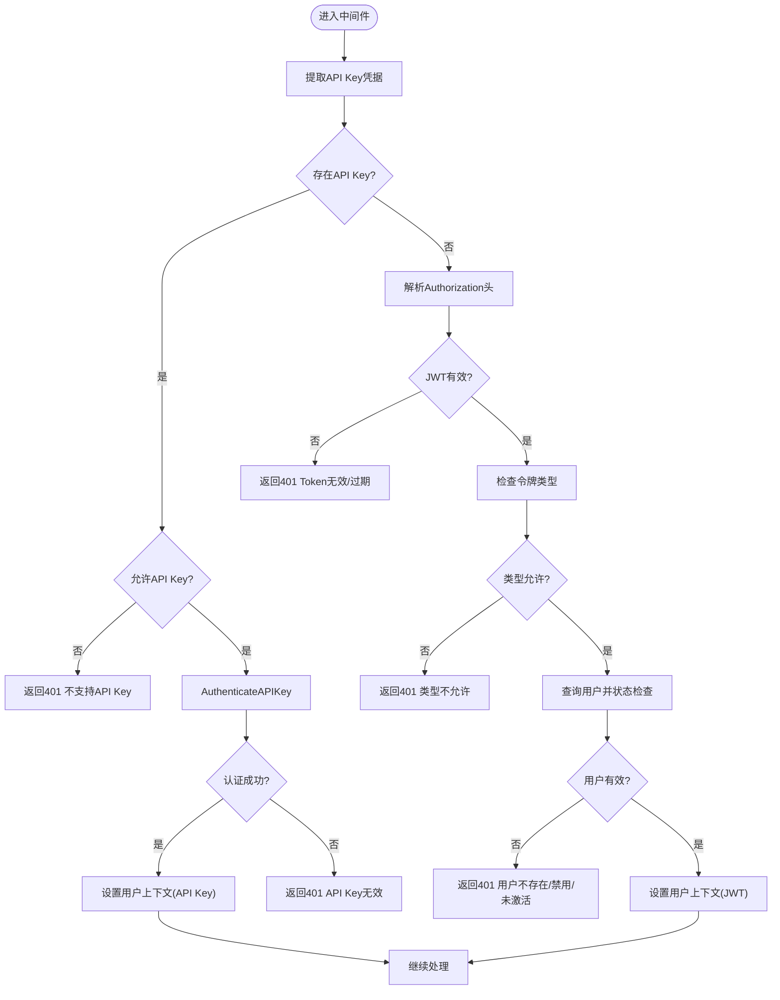
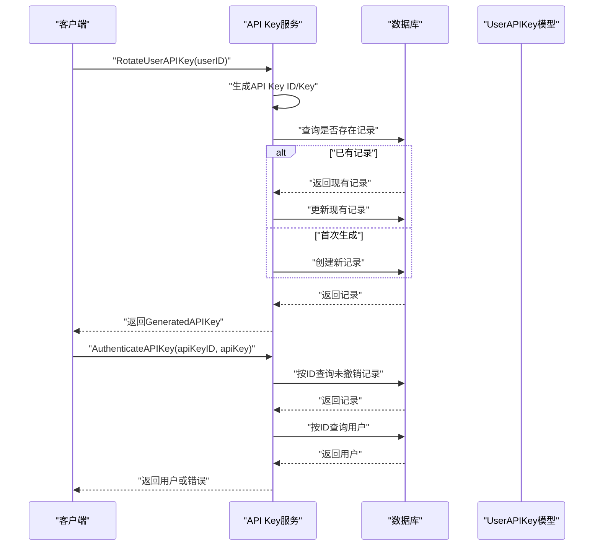
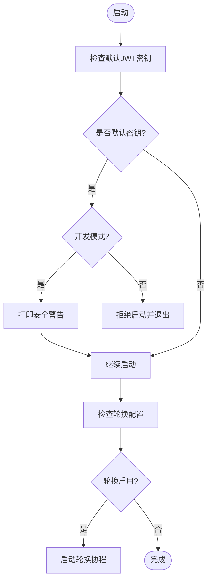
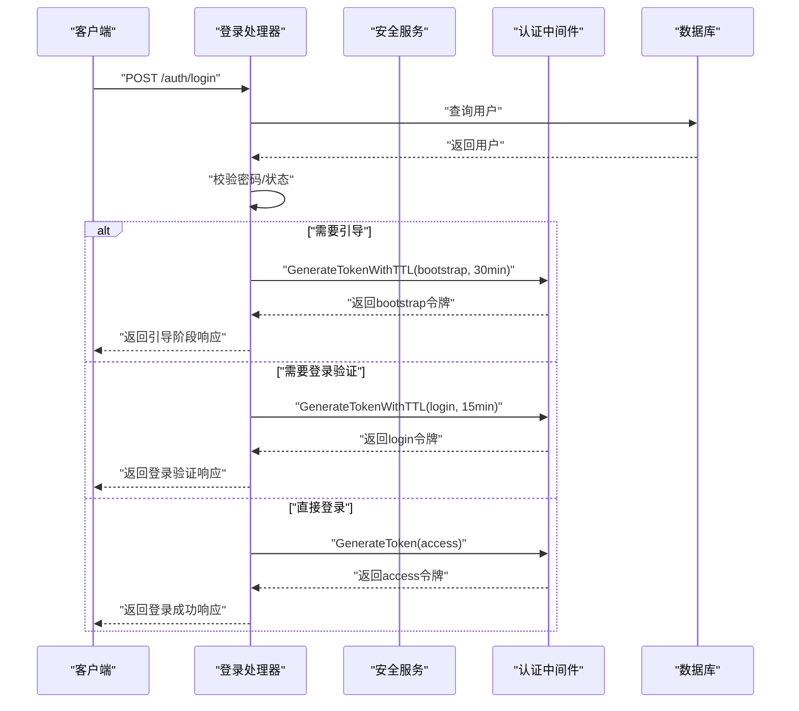
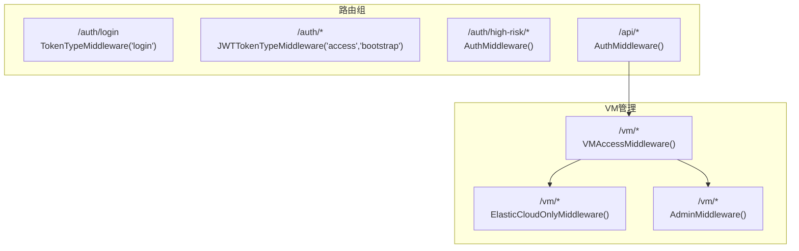
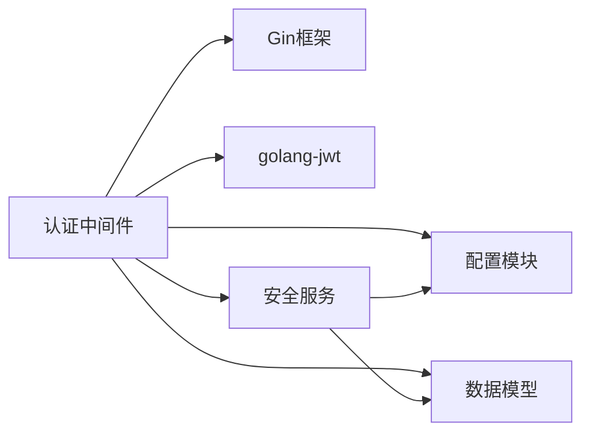

# 认证中间件

<cite>
**本文引用的文件**
- [server/middleware/auth.go](file://server/middleware/auth.go)
- [server/service/security/token.go](file://server/service/security/token.go)
- [server/service/security/jwt_secret.go](file://server/service/security/jwt_secret.go)
- [server/service/security/constants.go](file://server/service/security/constants.go)
- [server/service/api_key.go](file://server/service/api_key.go)
- [server/model/user_api_key.go](file://server/model/user_api_key.go)
- [server/model/user.go](file://server/model/user.go)
- [server/handler/auth.go](file://server/handler/auth.go)
- [server/config/config.go](file://server/config/config.go)
- [server/router/router.go](file://server/router/router.go)
</cite>

## 目录
1. [简介](#简介)
2. [项目结构](#项目结构)
3. [核心组件](#核心组件)
4. [架构概览](#架构概览)
5. [详细组件分析](#详细组件分析)
6. [依赖分析](#依赖分析)
7. [性能考虑](#性能考虑)
8. [故障排除指南](#故障排除指南)
9. [结论](#结论)
10. [附录](#附录)

## 简介
本文件详细阐述Open虚拟机管理控制台的认证中间件系统，重点涵盖：
- JWT令牌生成与解析机制：Claims结构设计、签名算法、有效期管理
- AuthMiddleware与TokenTypeMiddleware的认证类型支持：API Key认证与JWT认证的混合使用
- 用户身份验证流程：从令牌提取到用户状态检查的完整过程
- 认证失败的错误处理与安全考虑
- 具体配置示例与使用场景：管理员认证、VM访问控制等

## 项目结构
认证中间件位于server/middleware目录，配合服务层的安全模块、配置模块以及处理器模块共同实现完整的认证体系。

**图表来源**
- [server/middleware/auth.go:1-324](file://server/middleware/auth.go#L1-L324)
- [server/service/security/jwt_secret.go:1-132](file://server/service/security/jwt_secret.go#L1-L132)
- [server/service/api_key.go:1-179](file://server/service/api_key.go#L1-L179)
- [server/config/config.go:1-824](file://server/config/config.go#L1-L824)

**章节来源**
- [server/middleware/auth.go:1-324](file://server/middleware/auth.go#L1-L324)
- [server/config/config.go:1-824](file://server/config/config.go#L1-L824)

## 核心组件
- Claims结构：承载用户标识、角色、令牌类型、操作范围及标准声明（过期时间、签发时间）
- 令牌生成函数：支持默认访问令牌、指定TTL、带操作范围的令牌
- 令牌解析函数：基于配置中的JWT密钥进行签名验证
- 认证中间件族：AuthMiddleware、TokenTypeMiddleware、JWTTokenTypeMiddleware
- API Key认证服务：API Key生成、轮换、撤销与校验
- 安全配置：JWT密钥轮换、密钥持久化、开发模式安全检查

**章节来源**
- [server/middleware/auth.go:17-73](file://server/middleware/auth.go#L17-L73)
- [server/service/security/jwt_secret.go:23-55](file://server/service/security/jwt_secret.go#L23-L55)
- [server/service/api_key.go:54-147](file://server/service/api_key.go#L54-L147)
- [server/config/config.go:158-283](file://server/config/config.go#L158-L283)

## 架构概览
认证系统采用多层架构：
- 请求进入后，中间件根据路由配置选择合适的认证策略
- 支持API Key与JWT两种认证方式，可混合使用
- JWT采用HS256签名，密钥来自全局配置
- API Key采用哈希校验，结合用户状态检查
- 中间件还负责用户权限与资源访问控制

**图表来源**
- [server/middleware/auth.go:90-198](file://server/middleware/auth.go#L90-L198)
- [server/service/api_key.go:118-147](file://server/service/api_key.go#L118-L147)
- [server/handler/auth.go:101-202](file://server/handler/auth.go#L101-L202)

## 详细组件分析

### JWT Claims结构与令牌生命周期
- Claims字段：
  - 用户标识：userID、username
  - 角色与令牌类型：role、token_type
  - 操作范围：operation（可选）
  - 标准声明：过期时间、签发时间
- 令牌生成：
  - 默认访问令牌：使用配置的JWT过期小时数
  - 指定TTL令牌：支持自定义有效期
  - 带操作范围令牌：用于高风险操作的细粒度授权
- 令牌解析：
  - 使用配置中的JWT密钥进行HS256签名验证
  - 若未指定令牌类型，默认视为访问令牌

**图表来源**
- [server/middleware/auth.go:17-73](file://server/middleware/auth.go#L17-L73)

**章节来源**
- [server/middleware/auth.go:17-73](file://server/middleware/auth.go#L17-L73)

### 认证中间件族与混合认证支持
- AuthMiddleware：仅允许正式访问令牌（access）
- TokenTypeMiddleware：允许指定类型的令牌集合
- JWTTokenTypeMiddleware：仅允许JWT，不接受API Key
- 混合认证流程：
  - 优先尝试API Key认证（当请求头包含API Key或ApiKey前缀时）
  - 若API Key不可用或不允许API Key，则回退到JWT认证
  - 对JWT进行签名验证与类型检查
  - 校验用户存在性、状态、安全更新时间等

**图表来源**
- [server/middleware/auth.go:90-198](file://server/middleware/auth.go#L90-L198)

**章节来源**
- [server/middleware/auth.go:75-198](file://server/middleware/auth.go#L75-L198)

### API Key认证机制
- API Key生成与轮换：
  - 自动生成API Key ID与API Key
  - API Key ID使用固定前缀，API Key使用固定前缀并进行哈希存储
  - 支持轮换现有API Key并保持唯一性
- API Key校验：
  - 根据API Key ID查找未撤销的记录
  - 对比哈希值与明文API Key
  - 校验用户状态（必须为激活状态）
  - 更新最后使用时间
- API Key模型：
  - 包含用户ID、API Key ID、哈希值、前缀、最后使用时间、撤销时间等

**图表来源**
- [server/service/api_key.go:54-147](file://server/service/api_key.go#L54-L147)
- [server/model/user_api_key.go:9-26](file://server/model/user_api_key.go#L9-L26)

**章节来源**
- [server/service/api_key.go:54-147](file://server/service/api_key.go#L54-L147)
- [server/model/user_api_key.go:9-26](file://server/model/user_api_key.go#L9-L26)

### JWT密钥轮换与安全配置
- 密钥轮换：
  - 生成新的随机密钥并写入.env文件
  - 更新运行时配置与数据库记录
  - 自动轮换仅在生产模式且配置启用时生效
- 安全检查：
  - 拒绝使用默认JWT密钥启动（开发模式除外）
  - 提示为不同用途设置独立密钥
- 配置项：
  - JWT密钥、JWT过期小时数、密钥轮换间隔等

**图表来源**
- [server/config/config.go:251-283](file://server/config/config.go#L251-L283)
- [server/service/security/jwt_secret.go:94-131](file://server/service/security/jwt_secret.go#L94-L131)

**章节来源**
- [server/config/config.go:158-283](file://server/config/config.go#L158-L283)
- [server/service/security/jwt_secret.go:32-55](file://server/service/security/jwt_secret.go#L32-L55)

### 用户身份验证流程与处理器集成
- 登录流程：
  - 校验用户名与密码
  - 根据安全状态决定是否进入引导阶段或登录验证阶段
  - 生成相应类型的令牌（bootstrap/login/access）
- 高风险操作：
  - 通过TOTP/邮箱/恢复码验证
  - 生成短期高风险令牌，限定操作范围
- 用户信息获取：
  - 读取当前用户上下文并构建安全状态

**图表来源**
- [server/handler/auth.go:101-202](file://server/handler/auth.go#L101-L202)
- [server/middleware/auth.go:27-56](file://server/middleware/auth.go#L27-L56)

**章节来源**
- [server/handler/auth.go:101-202](file://server/handler/auth.go#L101-L202)

### 路由与中间件使用场景
- 登录中间态验证：仅允许login类型的令牌访问
- 安全初始化与安全设置：允许JWT访问（access/bootstrap）
- 高风险操作：需要access令牌访问
- VM管理：结合VMAccessMiddleware与ElasticCloudOnlyMiddleware、AdminMiddleware实现细粒度权限控制

**图表来源**
- [server/router/router.go:54-86](file://server/router/router.go#L54-L86)
- [server/router/router.go:103-306](file://server/router/router.go#L103-L306)
- [server/middleware/auth.go:243-308](file://server/middleware/auth.go#L243-L308)

**章节来源**
- [server/router/router.go:54-86](file://server/router/router.go#L54-L86)
- [server/router/router.go:103-306](file://server/router/router.go#L103-L306)

## 依赖分析
- 中间件依赖：
  - Gin框架：路由与上下文处理
  - golang-jwt：JWT生成与解析
  - 配置模块：JWT密钥、过期时间、VM访问目录等
  - 服务模块：API Key认证、安全状态构建
  - 数据模型：用户、API Key记录
- 耦合与内聚：
  - 中间件与服务层松耦合，通过接口传递用户上下文
  - 配置集中管理，便于统一调整
  - 错误处理集中在中间件，保证一致性

**图表来源**
- [server/middleware/auth.go:3-15](file://server/middleware/auth.go#L3-L15)
- [server/service/api_key.go:3-18](file://server/service/api_key.go#L3-L18)
- [server/config/config.go:158-249](file://server/config/config.go#L158-L249)

**章节来源**
- [server/middleware/auth.go:3-15](file://server/middleware/auth.go#L3-L15)
- [server/service/api_key.go:3-18](file://server/service/api_key.go#L3-L18)
- [server/config/config.go:158-249](file://server/config/config.go#L158-L249)

## 性能考虑
- JWT解析成本低：HS256签名验证开销较小
- API Key哈希校验：SHA256哈希计算简单，数据库查询为主
- 缓存策略：可考虑缓存用户状态与API Key校验结果（需注意安全性）
- 并发安全：中间件链路无共享状态，天然线程安全
- 资源清理：及时释放中间件设置的上下文键值

## 故障排除指南
- 401 未登录/认证失败：
  - 检查Authorization头格式是否为Bearer Token
  - 确认JWT密钥正确且未被轮换
  - 验证API Key ID与API Key是否匹配
- 403 权限不足：
  - 管理员权限不足或轻量云用户无权使用弹性云功能
  - VM操作权限不足（非管理员且非VM所有者）
- 令牌过期：
  - 重新登录获取新令牌
  - 检查JWT过期时间配置
- 安全更新导致会话失效：
  - 用户安全状态更新后，旧令牌会被拒绝
  - 需要重新登录

**章节来源**
- [server/middleware/auth.go:125-194](file://server/middleware/auth.go#L125-L194)

## 结论
Open虚拟机管理控制台的认证中间件系统通过JWT与API Key的混合认证，实现了灵活而安全的身份验证与授权控制。JWT提供标准的无状态认证，API Key适合自动化场景；中间件链路清晰，错误处理完善，配合路由级别的权限控制，能够满足管理员认证与VM访问控制等多种使用场景。

## 附录

### 配置示例
- JWT密钥与过期时间：
  - KVM_JWT_SECRET：随机强密钥
  - KVM_JWT_EXPIRE_HOURS：令牌过期小时数
  - KVM_JWT_SECRET_ROTATE_HOURS：密钥轮换间隔（0禁用）
- API Key与VM访问：
  - KVM_VM_ACCESS_DIR：VM访问控制文件目录
- 开发模式：
  - KVM_DEVELOPMENT_MODE：开发模式（仅警告）

**章节来源**
- [server/config/config.go:158-249](file://server/config/config.go#L158-L249)
- [server/config/config.go:751-754](file://server/config/config.go#L751-L754)

### 使用场景
- 管理员认证：
  - 使用JWT访问管理接口，结合AdminMiddleware进行权限控制
- VM访问控制：
  - 非管理员用户仅能操作自己的VM，通过VMAccessMiddleware与VM访问文件实现
- 高风险操作：
  - 通过TOTP/邮箱/恢复码验证后生成短期高风险令牌，限定操作范围

**章节来源**
- [server/middleware/auth.go:243-308](file://server/middleware/auth.go#L243-L308)
- [server/router/router.go:103-306](file://server/router/router.go#L103-L306)