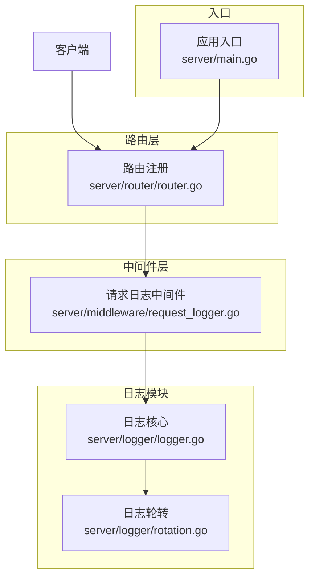
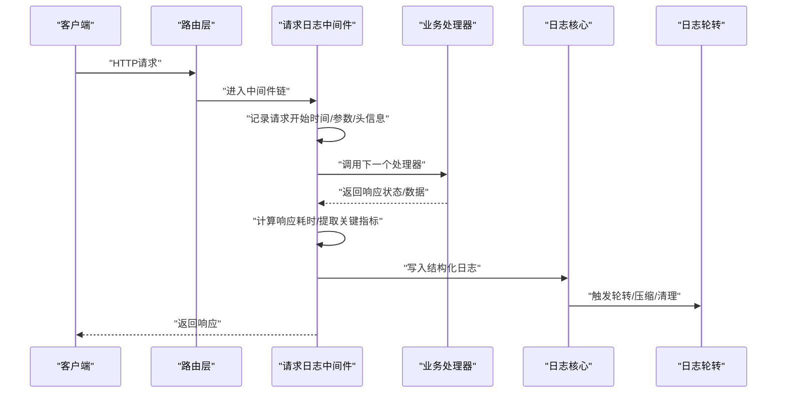
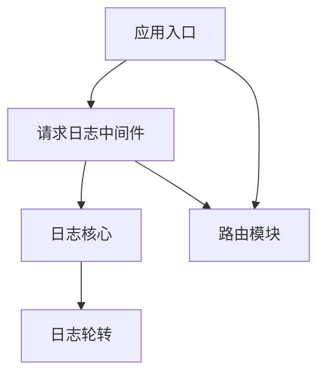

# 请求日志中间件

<cite>
**本文档引用的文件**
- [request_logger.go](file://server/middleware/request_logger.go)
- [logger.go](file://server/logger/logger.go)
- [rotation.go](file://server/logger/rotation.go)
- [router.go](file://server/router/router.go)
- [main.go](file://server/main.go)
</cite>

## 目录
1. [简介](#简介)
2. [项目结构](#项目结构)
3. [核心组件](#核心组件)
4. [架构概览](#架构概览)
5. [详细组件分析](#详细组件分析)
6. [依赖关系分析](#依赖关系分析)
7. [性能考虑](#性能考虑)
8. [故障排查指南](#故障排查指南)
9. [结论](#结论)

## 简介
本文件为Open虚拟机管理控制台的请求日志中间件技术文档，系统性阐述请求日志中间件的设计与实现，包括请求信息采集、响应数据捕获、性能指标统计、日志格式设计、日志级别配置、敏感信息过滤、日志存储策略（文件轮转、压缩、清理）、日志分析与监控告警配置，以及调试与故障排查技巧。该中间件通过拦截HTTP请求与响应，统一记录访问日志，为系统运维、安全审计与性能优化提供可靠依据。

## 项目结构
请求日志中间件位于服务端中间件层，配合日志模块与路由模块协同工作。整体结构如下：

图表来源
- [request_logger.go](file://server/middleware/request_logger.go)
- [logger.go](file://server/logger/logger.go)
- [rotation.go](file://server/logger/rotation.go)
- [router.go](file://server/router/router.go)
- [main.go](file://server/main.go)

章节来源
- [request_logger.go](file://server/middleware/request_logger.go)
- [logger.go](file://server/logger/logger.go)
- [rotation.go](file://server/logger/rotation.go)
- [router.go](file://server/router/router.go)
- [main.go](file://server/main.go)

## 核心组件
- 请求日志中间件：负责在HTTP请求进入时采集请求上下文信息，在响应返回时捕获响应状态与耗时，并将日志写入日志系统。
- 日志核心模块：提供日志记录接口与日志级别控制，支持结构化字段输出。
- 日志轮转模块：负责日志文件的大小限制、自动轮转、压缩与过期清理。
- 路由模块：定义HTTP路由并挂载中间件，确保请求日志中间件对所有受控路由生效。
- 应用入口：初始化配置、加载路由与中间件，启动HTTP服务。

章节来源
- [request_logger.go](file://server/middleware/request_logger.go)
- [logger.go](file://server/logger/logger.go)
- [rotation.go](file://server/logger/rotation.go)
- [router.go](file://server/router/router.go)
- [main.go](file://server/main.go)

## 架构概览
请求日志中间件采用“拦截器”模式，围绕HTTP请求生命周期进行日志采集与输出。其核心流程如下：

图表来源
- [request_logger.go](file://server/middleware/request_logger.go)
- [logger.go](file://server/logger/logger.go)
- [rotation.go](file://server/logger/rotation.go)
- [router.go](file://server/router/router.go)

## 详细组件分析

### 请求日志中间件
职责与功能
- 请求信息采集：在请求进入时记录时间戳、请求方法、URL路径、查询参数、请求头、客户端IP等。
- 响应数据捕获：在响应返回时记录状态码、响应体大小、响应头等。
- 性能指标统计：计算请求耗时，作为性能观测的关键指标。
- 结构化输出：以统一的日志格式输出，便于后续分析与检索。
- 敏感信息过滤：对包含敏感信息的字段进行脱敏处理（如密码、令牌等）。

实现要点
- 中间件需在路由注册阶段挂载到全局或特定路由组，确保覆盖所有需要审计的接口。
- 对于长连接或流式响应（如事件推送），需在连接关闭或流结束时补充写入最终日志条目。
- 对高并发场景，建议异步写日志或批量缓冲，避免阻塞请求处理线程。

章节来源
- [request_logger.go](file://server/middleware/request_logger.go)

### 日志核心模块
职责与功能
- 提供统一的日志记录接口，支持不同日志级别（如trace、debug、info、warn、error）。
- 支持结构化字段输出，便于关联请求ID、用户标识、资源标识等上下文信息。
- 集成日志轮转策略，按大小或时间触发轮转，减少单文件过大带来的读写压力。

实现要点
- 日志级别可通过环境变量或配置文件动态调整，满足开发、测试、生产等不同阶段需求。
- 结构化字段命名规范应统一，避免歧义；例如使用小驼峰或下划线风格保持一致性。

章节来源
- [logger.go](file://server/logger/logger.go)

### 日志轮转模块
职责与功能
- 文件大小限制：当日志文件达到阈值时自动轮转，生成新的日志文件。
- 压缩与清理：对历史日志进行压缩，保留一定数量或天数的历史文件，释放磁盘空间。
- 并发安全：在多进程或多实例部署时，确保轮转过程不会产生竞争条件。

实现要点
- 轮转策略应结合业务流量与磁盘容量设定，避免频繁轮转影响性能。
- 清理规则需明确保留期限与保留数量，防止误删重要审计日志。

章节来源
- [rotation.go](file://server/logger/rotation.go)

### 路由模块
职责与功能
- 定义HTTP路由与控制器映射关系。
- 在路由注册时挂载请求日志中间件，确保中间件对目标路由生效。
- 可按路由前缀或分组设置不同的日志策略（如对管理接口启用更详细日志）。

实现要点
- 将中间件置于路由链靠前位置，以便在进入具体处理器之前完成日志采集。
- 对静态资源与健康检查等无需记录的路由可跳过中间件，降低开销。

章节来源
- [router.go](file://server/router/router.go)

### 应用入口
职责与功能
- 初始化配置（如日志级别、轮转参数、敏感词库等）。
- 加载路由与中间件，启动HTTP服务监听端口。
- 统一异常处理与优雅停机，保证日志写入完整性。

实现要点
- 启动时校验日志配置的有效性，避免运行中出现配置错误导致日志丢失。
- 在优雅停机过程中确保未完成请求的日志被刷新到磁盘。

章节来源
- [main.go](file://server/main.go)

## 依赖关系分析
请求日志中间件与其他模块的耦合关系如下：

图表来源
- [request_logger.go](file://server/middleware/request_logger.go)
- [logger.go](file://server/logger/logger.go)
- [rotation.go](file://server/logger/rotation.go)
- [router.go](file://server/router/router.go)
- [main.go](file://server/main.go)

章节来源
- [request_logger.go](file://server/middleware/request_logger.go)
- [logger.go](file://server/logger/logger.go)
- [rotation.go](file://server/logger/rotation.go)
- [router.go](file://server/router/router.go)
- [main.go](file://server/main.go)

## 性能考虑
- 异步写日志：在高并发场景下，建议将日志写入操作异步化，避免阻塞请求处理线程。
- 批量缓冲：对高频接口可采用批量缓冲策略，减少磁盘I/O次数。
- 字段裁剪：仅记录必要字段，避免冗余信息占用带宽与存储。
- 轮转策略：合理设置轮转阈值与清理规则，平衡磁盘占用与查询效率。
- 过滤与脱敏：对敏感字段进行脱敏处理，既保护隐私又不影响日志价值。

## 故障排查指南
常见问题与解决思路
- 日志不落盘：检查日志级别是否过高，导致低于阈值的日志被忽略；确认日志文件权限与磁盘空间。
- 日志缺失：排查中间件是否正确挂载到目标路由；检查是否存在异常中断导致日志未刷新。
- 性能抖动：评估日志写入是否成为瓶颈，考虑异步化与批量缓冲；审查轮转策略是否过于频繁。
- 轮转异常：核对轮转配置与权限，确保多实例部署时无竞态条件；验证压缩与清理脚本执行情况。
- 敏感信息泄露：定期审查日志内容与脱敏规则，确保关键字段已正确脱敏。

调试技巧
- 临时提升日志级别：在问题复现期间提高日志级别，获取更多上下文信息。
- 关联请求ID：在日志中加入唯一请求ID，便于跨模块追踪同一请求的全链路行为。
- 分环境隔离：开发、测试、生产分别配置独立的日志目录与轮转策略，避免相互干扰。
- 压测验证：在压测环境中验证日志中间件的吞吐能力与稳定性，提前发现潜在问题。

## 结论
请求日志中间件是Open虚拟机管理控制台可观测性体系的重要组成部分。通过统一的请求采集、结构化输出与完善的日志存储策略，能够有效支撑安全审计、性能分析与故障定位。建议在实际部署中结合业务特点持续优化日志级别、轮转与清理策略，并建立配套的监控告警与分析流程，以充分发挥日志的价值。