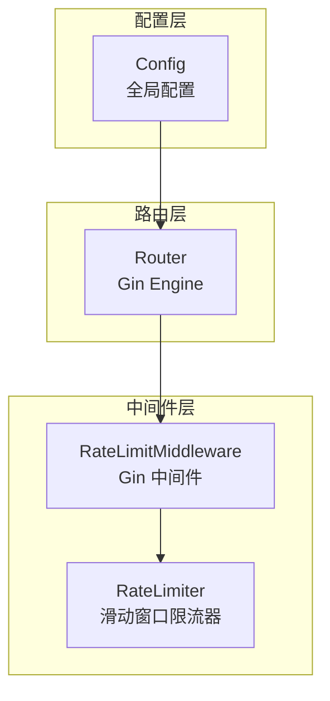
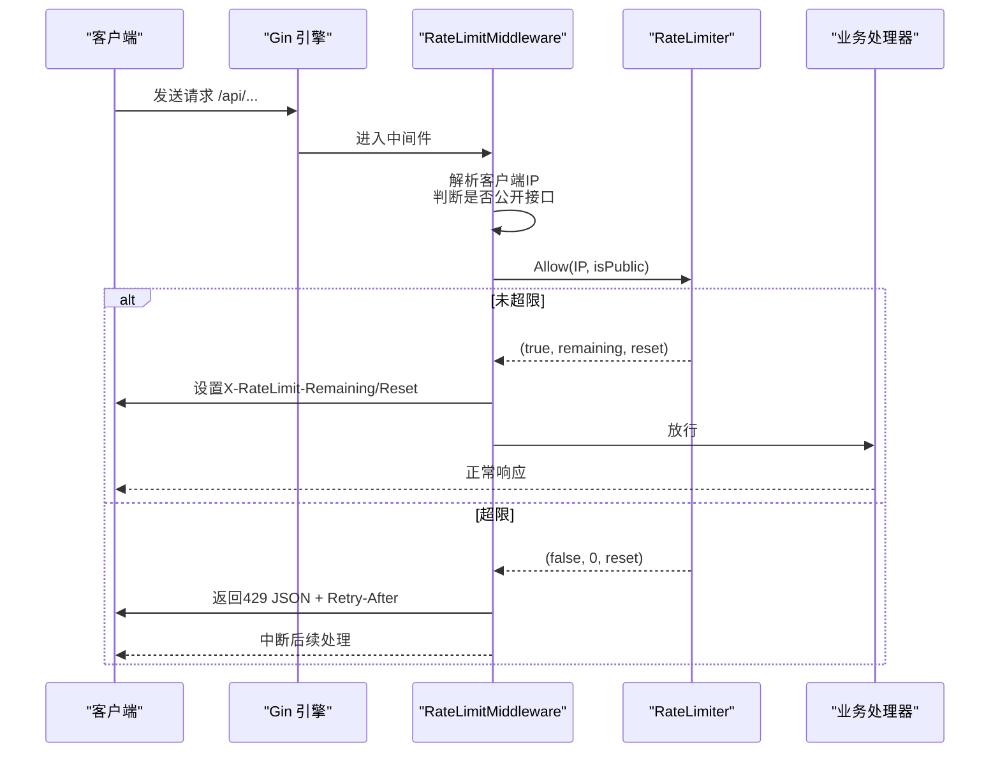
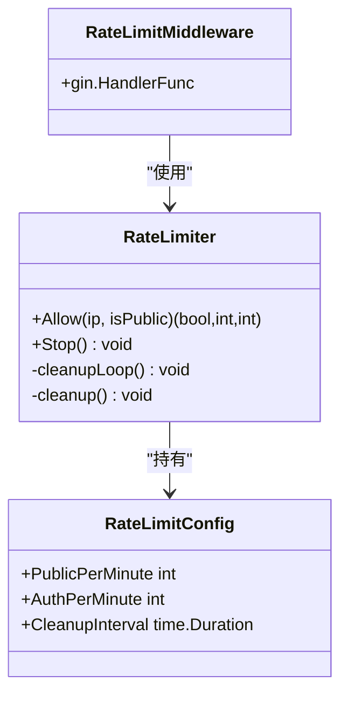

# 限流中间件

<cite>
**本文引用的文件**
- [ratelimit.go](file://server/middleware/ratelimit.go)
- [config.go](file://server/config/config.go)
- [router.go](file://server/router/router.go)
- [auth.go](file://server/middleware/auth.go)
</cite>

## 目录
1. [简介](#简介)
2. [项目结构](#项目结构)
3. [核心组件](#核心组件)
4. [架构概览](#架构概览)
5. [详细组件分析](#详细组件分析)
6. [依赖分析](#依赖分析)
7. [性能考量](#性能考量)
8. [故障排查指南](#故障排查指南)
9. [结论](#结论)
10. [附录](#附录)

## 简介
本文件面向 Open 虚拟机管理控制台的“限流中间件”，系统性说明其算法实现、配置方式、策略差异、触发响应与用户体验优化，并给出最佳实践、性能调优与监控日志建议。该中间件基于 Gin 框架，采用 IP 级别的滑动窗口限流，对公开接口与认证接口分别施加不同的速率限制，支持动态清理过期计数器，确保在高并发场景下维持系统的稳定性与公平性。

## 项目结构
限流中间件位于 server/middleware/ratelimit.go，全局配置来自 server/config/config.go，路由层在 server/router/router.go 中初始化并挂载中间件。

图表来源
- [ratelimit.go:36-53](file://server/middleware/ratelimit.go#L36-L53)
- [config.go:228-230](file://server/config/config.go#L228-L230)
- [router.go:26-33](file://server/router/router.go#L26-L33)

章节来源
- [ratelimit.go:1-211](file://server/middleware/ratelimit.go#L1-L211)
- [config.go:228-230](file://server/config/config.go#L228-L230)
- [router.go:26-33](file://server/router/router.go#L26-L33)

## 核心组件
- RateLimitConfig：定义每分钟请求数限制（公开接口 PublicPerMinute、认证接口 AuthPerMinute）、清理周期 CleanupInterval。
- RateLimiter：线程安全的滑动窗口计数器，按 IP 维度统计请求并在时间窗口内进行判断。
- RateLimitMiddleware：Gin 中间件，负责提取客户端 IP、识别公开/认证接口、调用 Allow 并设置响应头与错误处理。
- 公开接口白名单：isPublicPath 通过固定路径集合与前缀匹配识别公开接口。

章节来源
- [ratelimit.go:11-28](file://server/middleware/ratelimit.go#L11-L28)
- [ratelimit.go:36-53](file://server/middleware/ratelimit.go#L36-L53)
- [ratelimit.go:173-197](file://server/middleware/ratelimit.go#L173-L197)
- [ratelimit.go:134-154](file://server/middleware/ratelimit.go#L134-L154)

## 架构概览
限流中间件在路由初始化阶段被挂载为全局中间件，对所有 /api 请求生效。中间件根据请求路径判断是否为公开接口，选择对应的每分钟上限；若超过阈值则返回 429 并设置 Retry-After 与限流相关头部；否则放行并设置剩余次数与重置时间。

图表来源
- [ratelimit.go:173-197](file://server/middleware/ratelimit.go#L173-L197)
- [ratelimit.go:60-105](file://server/middleware/ratelimit.go#L60-L105)
- [router.go:26-33](file://server/router/router.go#L26-L33)

## 详细组件分析

### 算法实现与选择
- 算法类型：滑动窗口计数器
  - 时间窗口固定为 1 分钟，窗口内累计请求次数并与上限比较。
  - 使用互斥锁保证并发安全，避免竞态条件。
- 与令牌桶/漏桶的对比
  - 令牌桶适合突发流量平滑，但实现复杂且难以精确控制每分钟上限。
  - 漏桶适合恒定速率输出，但对突发请求不够友好。
  - 本项目采用滑动窗口，更贴合“每分钟请求数”的直观语义，实现简洁、边界清晰，适合 Web API 的典型场景。
- 优势
  - 实现简单，易于理解与维护。
  - 对于短时间内的突发请求有合理容忍，同时能有效抑制持续高频攻击。
- 局限
  - 不支持毫秒级细粒度控制。
  - 无法区分不同接口的差异化权重。

章节来源
- [ratelimit.go:60-105](file://server/middleware/ratelimit.go#L60-L105)
- [ratelimit.go:107-132](file://server/middleware/ratelimit.go#L107-L132)

### 限流规则配置
- 配置来源
  - 全局配置结构体包含 RateLimitPublicPerMin 与 RateLimitAuthPerMin 字段，分别对应公开接口与认证接口的每分钟上限。
  - 初始化时从环境变量 KVM_RATE_LIMIT_PUBLIC 与 KVM_RATE_LIMIT_AUTH 读取默认值。
- 默认行为
  - 公开接口默认上限为 20 次/分钟。
  - 认证接口默认上限为 0，表示不限制。
- 配置注入
  - 路由层读取 GlobalConfig 并构造 RateLimitConfig，随后创建 RateLimiter 并挂载到 Gin 引擎。

章节来源
- [config.go:35-38](file://server/config/config.go#L35-L38)
- [config.go:228-230](file://server/config/config.go#L228-L230)
- [router.go:26-33](file://server/router/router.go#L26-L33)
- [ratelimit.go:21-28](file://server/middleware/ratelimit.go#L21-L28)

### IP 地址与白名单
- IP 提取策略
  - 优先从 X-Forwarded-For 取首个 IP；若为空则取 X-Real-IP；最后回退到 Gin 的 ClientIP。
  - 该策略适配反向代理与负载均衡场景。
- 白名单机制
  - 代码中未实现基于 IP 的白名单功能。若需白名单，可在 RateLimitMiddleware 内扩展一个 IP 白名单集合，在 Allow 前进行快速放行判断。

章节来源
- [ratelimit.go:156-171](file://server/middleware/ratelimit.go#L156-L171)

### 公开接口与敏感接口的策略
- 公开接口
  - 路径集合与前缀匹配（如 /api/public/*、/api/auth/login 等）判定为公开接口。
  - 使用 PublicPerMinute 上限。
- 敏感接口
  - 除公开接口以外的所有 /api 路由均视为敏感接口。
  - 若 AuthPerMinute 为 0（默认），则不限制；否则使用 AuthPerMinute 上限。
- 路由与中间件关系
  - 公开接口与敏感接口的划分由路由层的中间件链决定，限流中间件仅感知路径是否公开。

章节来源
- [ratelimit.go:134-154](file://server/middleware/ratelimit.go#L134-L154)
- [router.go:41-86](file://server/router/router.go#L41-L86)

### 触发后的响应与用户体验优化
- 响应处理
  - 超限时返回 429 Too Many Requests，消息体包含 code 与 message。
  - 设置 X-RateLimit-Limit、X-RateLimit-Remaining、X-RateLimit-Reset 与 Retry-After 头部。
- 用户体验优化建议
  - 前端可读取 Retry-After 与 Remaining，提示用户等待时间与剩余配额。
  - 对于登录、邀请、找回密码等公开接口，建议在前端做本地节流与重试退避，减少重复触发。
  - 对于认证接口，若 AuthPerMinute 设为 0，前端无需特殊处理；若开启限制，建议在 UI 层提示“请稍后再试”。

章节来源
- [ratelimit.go:173-197](file://server/middleware/ratelimit.go#L173-L197)

### 中间件生命周期与清理
- 启动流程
  - 路由初始化时创建 RateLimiter，启动后台清理协程。
- 清理策略
  - 定期（默认 5 分钟）扫描并删除超过 1 分钟未活动的 IP 记录，释放内存。
- 停止流程
  - 提供 Stop 方法关闭清理通道，便于优雅退出。

章节来源
- [ratelimit.go:44-58](file://server/middleware/ratelimit.go#L44-L58)
- [ratelimit.go:107-132](file://server/middleware/ratelimit.go#L107-L132)

## 依赖分析
- 组件耦合
  - RateLimitMiddleware 依赖 RateLimiter；RateLimiter 依赖 Gin Context 以提取 IP 与路径。
  - 路由层负责装配配置与中间件，形成自上而下的依赖。
- 外部依赖
  - Gin：中间件框架与上下文。
  - time：定时器与时间计算。
  - net/http：HTTP 状态码与响应格式。

图表来源
- [ratelimit.go:36-53](file://server/middleware/ratelimit.go#L36-L53)
- [ratelimit.go:173-197](file://server/middleware/ratelimit.go#L173-L197)
- [ratelimit.go:11-28](file://server/middleware/ratelimit.go#L11-L28)

章节来源
- [ratelimit.go:1-211](file://server/middleware/ratelimit.go#L1-L211)
- [router.go:26-33](file://server/router/router.go#L26-L33)

## 性能考量
- 时间复杂度
  - Allow 操作为 O(1)，每次请求仅进行一次哈希表查询与少量数值运算。
- 空间复杂度
  - 每活跃 IP 维持一条计数记录，清理周期为 1 分钟，内存占用与并发 IP 数成正比。
- 并发安全
  - 使用 RWMutex 保护 entries，读多写少场景下读锁竞争较小。
- 清理频率
  - 默认 5 分钟清理一次，兼顾内存回收与开销平衡。
- 建议
  - 在高并发场景下，适当提高 AuthPerMinute 上限，避免误伤正常用户。
  - 如需更精细的限流策略（如按接口维度、按用户维度），可扩展 RateLimiter 的数据结构与 Allow 算法。

[本节为通用性能讨论，不直接分析具体文件]

## 故障排查指南
- 常见问题
  - 429 频繁出现：检查 KVM_RATE_LIMIT_PUBLIC/KVM_RATE_LIMIT_AUTH 是否过低；确认是否误将敏感接口标记为公开接口。
  - IP 显示异常：确认反向代理正确传递 X-Forwarded-For/X-Real-IP；必要时在中间件中增加日志。
  - 内存增长：确认清理协程正常运行；适当缩短 CleanupInterval 或提高 PublicPerMinute/AuthPerMinute 以降低峰值并发。
- 排查步骤
  - 在 RateLimitMiddleware 中增加日志，记录 IP、路径、isPublic、remaining、reset。
  - 检查路由层是否正确挂载中间件，确认 /api 前缀下的所有请求均受控。
  - 核对环境变量 KVM_RATE_LIMIT_PUBLIC/KVM_RATE_LIMIT_AUTH 的值与预期一致。

章节来源
- [ratelimit.go:173-197](file://server/middleware/ratelimit.go#L173-L197)
- [router.go:26-33](file://server/router/router.go#L26-L33)

## 结论
该限流中间件以滑动窗口为核心，结合 Gin 中间件机制，实现了对公开与认证接口的差异化限流。通过环境变量与全局配置，系统具备良好的可运维性与灵活性。建议在生产环境中根据业务峰值合理设置上限，并结合前端退避与 Retry-After 提升用户体验；同时可按需扩展白名单与更细粒度的限流策略。

[本节为总结性内容，不直接分析具体文件]

## 附录

### 配置项一览
- KVM_RATE_LIMIT_PUBLIC：公开接口每分钟上限，默认 20。
- KVM_RATE_LIMIT_AUTH：认证接口每分钟上限，默认 0（不限制）。

章节来源
- [config.go:228-230](file://server/config/config.go#L228-L230)

### 公开接口清单（部分）
- /api/public/settings
- /api/public/version
- /api/auth/login
- /api/auth/invite
- /api/auth/invite/complete
- /api/auth/password/forgot
- /api/auth/password/reset

章节来源
- [ratelimit.go:134-143](file://server/middleware/ratelimit.go#L134-L143)

### 相关中间件与认证
- 认证中间件：JWTTokenTypeMiddleware、AuthMiddleware 等，用于区分不同认证方式与权限等级。
- 与限流的关系：认证中间件在限流之后执行，因此敏感接口的限流默认不限制已认证用户（除非显式设置 AuthPerMinute）。

章节来源
- [auth.go:85-206](file://server/middleware/auth.go#L85-L206)
- [router.go:41-86](file://server/router/router.go#L41-L86)